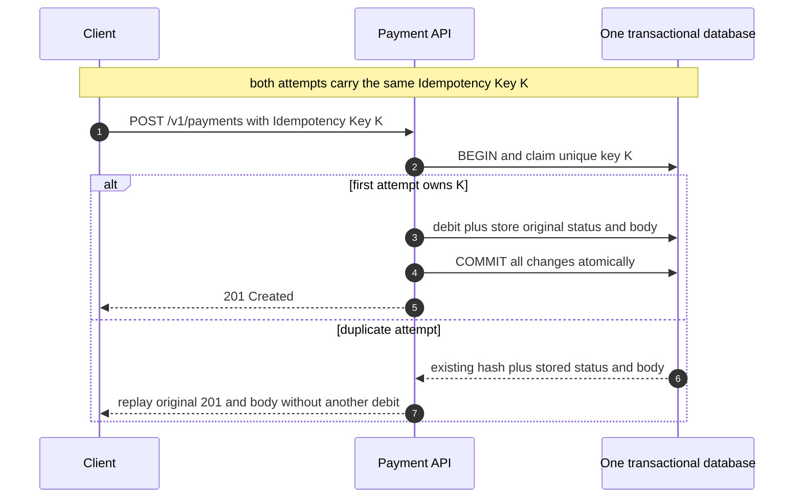
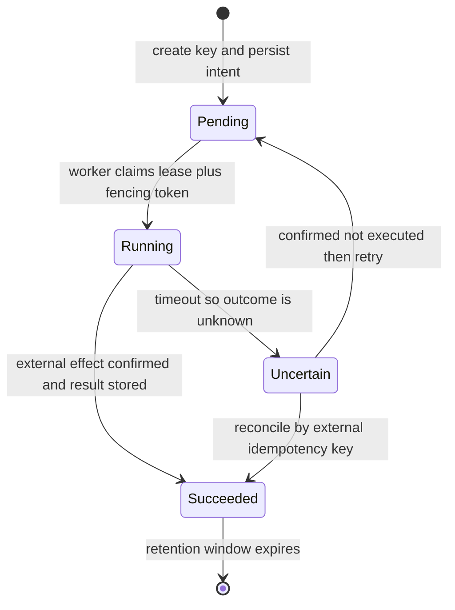

# 01 · 基础内功：数字、一致性与失败模型

> 这一篇要做的事只有一件：**把"我觉得这样会快一点"变成"这条链路的下限是 120 ms，因为光速"**。
> 系统设计里绝大多数争论之所以争不出结果，是因为双方都在比喻，没人在算数。这一篇给你算数需要的两样东西——
> 几个数量级的数字（用来算出可行域），以及几个失败与一致性模型（用来解释算出来的结果为什么长这样）。
> 后面所有的取舍论证，最终都会回落到这里。

这篇可以用三个问题串起来：

```text
1. 它最快能多快？  → RTT、数量级、fan-out、尾延迟
2. 它必须多正确？  → CAP、PACELC、一致性、事务隔离、幂等
3. 它坏了会怎样？  → 背压、失败模型、deadline、重试预算
```

后面每个公式都按同一种方式读：**它算出了什么、在什么前提下成立、能指导哪个设计决定**。公式本身不难，容易出错的是忘记它的前提。

---

## 读这一章之前

**你在工作中遇到过这个**

评审会上有人问"这个接口能压到 100 ms 以内吗"，你说"应该可以吧"，回去压测发现 p99 是 400 ms，查了三天才定位到中间夹了一次跨 region 的同步调用。
或者某次线上抖动，下游变慢 → 上游重试 → 下游被重试打死，复盘会上你只能写"增加限流"。
这两件事的共同点不是你不够仔细，是**你在动手之前没有把数字算出来**——没算，就只能事后归因。

**需要先懂的概念**

| 概念 | 一句话 | 详见 |
|---|---|---|
| 一个请求的旅程 | 从客户端点击到数据库再返回，中间经过哪些跳 | [00-concepts §1](00-concepts.md) |
| 延迟 / 吞吐 / 并发 | 延迟是单次耗时，吞吐是单位时间处理量，并发数把两者连起来 | [00-concepts §2](00-concepts.md) |
| 分位数 p50/p99 | 描述的是分布的形状；平均值会骗人，尾部才决定体验 | [00-concepts §3](00-concepts.md) |
| 副本 / 分片 | 同一份数据存多份 vs. 把数据切成多份 | [00-concepts §5](00-concepts.md) |
| 一致性 | 有多个副本时，"我读到的是不是最新的" | [00-concepts §6](00-concepts.md) |
| 同步 / 异步 | 调用方是否原地等结果 | [00-concepts §8](00-concepts.md) |
| 可用性 | 几个 9 分别对应全年多长的停机时间 | [00-concepts §10](00-concepts.md) |

**这一章要回答的问题**

1. 一个请求最快能有多快？这个下限由什么决定，哪一部分是花钱也买不回来的？
2. 想让"读到的一定是最新值"，我要额外付多少毫秒？这笔钱应该花在哪条链路上？
3. 网络一定会超时，重试一定会发生——怎么保证重试不会把钱扣两次？
4. 系统过载时，为什么表现是"雪崩"而不是"整体慢一点"？
5. 每个后端都很快，为什么用户还是觉得卡？
6. 我到底在防哪一种故障？哪一种最难防？

**本章新引入的术语**

| 术语 | English | 一句话定义 |
|---|---|---|
| 尾延迟放大 | tail latency amplification | 扇出到 N 个后端并等全部返回时，整体 p99 逼近单后端的更高分位 |
| CAP | Consistency / Availability / Partition tolerance | 网络分区发生时，强一致与每个请求都成功响应不能同时保证 |
| PACELC | PACELC | 网络断开、机器分成互相通不了的两拨时（Partition），你只能在"两拨都继续接客但数据可能不一致"和"停掉一拨保住一致"之间选一个；网络正常时（Else），你还要在"少等一个跨机房往返"和"读到的一定是最新值"之间选一个 |
| 写偏斜 | write skew | 两个事务各自只看见自己开始那一刻的数据副本（快照隔离），于是各自读到的都是合法状态、各自的提交也都合法，合在一起却破坏了某条规则（例如"至少留一个人值班"被两个人同时请假绕过） |
| 幂等键 | idempotency key | 客户端生成、服务端去重的请求标识，让重试不产生第二次副作用 |
| 背压 | backpressure | 处理不过来时向上游反向施压（拒绝/阻塞），而不是无限排队 |
| 对冲请求 | hedged request | 超过 p95 还没返回就向另一副本补发一份，取先到的 |
| 灰色故障 | gray failure | 节点健康检查通过、实际能力已严重退化的"半死不活"状态 |
| 围栏令牌 | fencing token | 单调递增的编号，让被抢占的旧持有者的写在下游被拒绝 |
| 超时预算传播 | deadline propagation | 把剩余时间随请求逐层传下去，每层只减不加 |
| 重试预算 | retry budget | 给重试量设的全局上限（如不超过总请求量的 10%），防止重试放大 |

---

## 1. 为什么要有这些数字

### 问题一：上海的用户，弗吉尼亚的服务器

用户在上海，你的服务器在 `us-east-1`（弗吉尼亚）。用户点一下按钮，**最快**多久能看到结果？这不是一个"看情况"的问题，是一道乘除法。

**第一步，光速。** 上海到弗吉尼亚大圆距离约 12,000 km。光在真空中 300,000 km/s，但在光纤里受折射率（≈1.47）拖累，只有约 **200,000 km/s**。

```
单程 = 12,000 km ÷ 200,000 km/s = 60 ms
往返 RTT = 120 ms          ← 按理想直线光纤估算出的传播下限
```

真实海缆不走直线（要经日本或关岛登陆），再算上沿途几十跳路由器的转发与排队，实测 RTT 通常是理论值的 1.5–2 倍，**取 200 ms**。

**第二步，握手。** 假设使用 TCP + TLS 1.3，而且没有可复用连接，首次点击时一个字节的业务数据都还没传，就已经欠下：

| 阶段 | 成本 |
|---|---|
| TCP 三次握手 | 1 RTT |
| TLS 1.3 握手（1.2 是 2 RTT） | 1 RTT |
| HTTP 请求 + 响应 | 1 RTT |
| **合计** | **3 RTT ≈ 600 ms** |

**第三步，你的代码。** 假设服务端查一次数据库要 5 ms。放进 600 ms 里，占比 0.8%。**于是：**

- 首次点击 ≈ **600 ms**，其中约 99% 是网络往返，约 1% 是你写的逻辑。
- 连接复用（keep-alive）之后约为 **1 RTT + 服务端处理时间 ≈ 205 ms**，主要成本仍然是网络。
- 你把服务端从 5 ms 优化到 1 ms，用户感知的变化是 **0.7%**——等于没做。
- 在这个例子里，收益最大的手段是**把数据挪到用户附近**：CDN、边缘节点、就近读副本、多活写入。HTTP/3、连接预热和压缩也可能有帮助，但都消除不了跨洲传播成本。

连接状态不同，欠下的 RTT 也不同：

| 场景 | 典型网络成本 | 说明 |
|---|---:|---|
| 新建 TCP + TLS 1.3 + 业务请求 | 约 3 RTT | 本题采用的保守估算 |
| 已复用连接 | 约 1 RTT | 不再重复 TCP/TLS 握手 |
| TLS 会话恢复 / QUIC | 取决于协议与连接状态 | 某些场景可减少握手 RTT，但不能消除传播 RTT |

页面最终可见时间还要加上服务端排队与计算、响应体下载以及浏览器渲染；这里先只估算请求链路的下限。

**你算不出这个数，就没法讨论任何架构决策。** "要不要上 CDN"、"能不能做单元化多活"、"合同里承诺 100 ms 现不现实"、"这次慢是不是我们代码的锅"——所有这些问题的答案都藏在上面这几行乘除法里。算不出来，讨论就只能停在互相说服对方的"感觉"上。

### 问题二：一个页面 20 个请求

一个页面要向后端发 20 个请求（20 个微服务，或一次查询扇出到 20 个分片），**每个的 p99 都是 10 ms**，且必须全部返回才能渲染。先假设这些请求的延迟分布相同、彼此独立，而且忽略固定的网络与渲染开销。用户感受到的后端等待时间大概是多少？

直觉答案是"10 ms 左右吧，反正是并行的"。算一下：

```
P(20 个全都没落进慢尾)  = 0.99²⁰ ≈ 0.818
P(至少一个落进慢尾)     = 1 − 0.818 ≈ 18%
```

为什么是这样？因为等待全部返回时：

```text
T_page = max(T₁, T₂, ..., T₂₀)

若单个请求的延迟分布为 F(t)，且请求相互独立：
P(T_page ≤ t) = F(t)²⁰
```

**约五分之一的页面加载，都会被至少一个慢后端拖住。** 单个后端的 p99 门槛，到了页面这一层变成了 p82 门槛
——上面算出只有 81.8% 的页面能完全避开慢尾，也就是说"10 ms 以内"这个承诺在页面这一层只对 82% 的加载成立，等于从 p99 掉到了 p82。
扇出到 100 个时，两个方向的概率分别是：

```text
P(全部 ≤ 10 ms)    = 0.99¹⁰⁰ ≈ 36.6%
P(至少一个 > 10 ms) = 1 − 0.99¹⁰⁰ ≈ 63.4%
```

这个现象叫**尾延迟放大（tail latency amplification）**，是本篇 §7 的主题。现在只需要记住一句话：**并行把“耗时相加”变成了“取最大值”，但扇出越大，最大值越容易撞进某个后端的慢尾。** “每个服务都很快”和“用户觉得很快”之间没有等号。

这里还有两个边界要记住：

- `0.99^N` 依赖“相互独立”的假设。现实里共享网络、数据库或机架故障会让延迟相关；此时要用实测的整条链路分布，不能机械套乘法。
- 只知道“单后端 p99 = 10 ms”，只能算出页面在 10 ms 内完成的概率，**算不出页面 p99 是多少毫秒**。要得到具体毫秒数，还需要单后端更高分位处的完整延迟分布。

### 下一节那张表怎么用

下一节是一张延迟数字表。**不要现在背它。用到时回来查。**

真正要在脑子里固化的只有**三个数量级**：

| 层级 | 量级 | 相对关系 |
|---|---|---|
| 内存访问 | ~100 ns | 基准 |
| SSD 随机读 | ~100 µs | 比内存慢 **1000×** |
| 跨洲网络往返 | ~100 ms | 比 SSD 慢 **1000×** |

每一级差 1000 倍。记住这三个，其余数字都可以现场推：

- 一次跨洲往返 ≈ 100 万次内存访问 ≈ 1000 次 SSD 读。所以"多一次跨洲调用"和"多做 1000 次本地磁盘查询"是同量级的开销。
- 缓存命中率从 99% 掉到 90%，意味着回源次数涨 10 倍，而每次回源比命中慢 1000 倍——平均延迟的恶化是数量级的，不是百分比的。
- 同 AZ / 同城的网络往返（0.2–2 ms）落在 SSD 和跨洲之间，靠近 SSD 那一端。

一条现场可用的口诀：**看到一个设计，先数它跨了几次 100 ms 的边界。** 在跨洲链路里，往返次数通常是用户体验的第一主导项，再看排队、计算、下载和渲染。

---

## 2. 只背三个数量级，其余用作估算查表（2026 校准版）

Jeff Dean 那张经典表格中的具体数字已经随硬件演进而变化。下面是可用于估算的当代量级，不是性能承诺：硬件型号、数据冷热、负载、payload、连接状态和所看分位数都会让结果相差数倍甚至数十倍。设计时先用它判断数量级，落地前再用目标环境的 benchmark 和 p99 验证。

| 操作 | 量级 | 备注 |
|---|---|---|
| L1 cache 引用 | 1 ns | |
| 分支预测失败 | 3 ns | |
| L2 cache 引用 | 4 ns | |
| 互斥锁 加/解锁 | 17 ns | 无竞争 |
| 主存引用 | 80–100 ns | NUMA 跨节点 ×1.5–2 |
| 1 KB 内存拷贝 | ~50 ns | |
| 1 KB Snappy 压缩 | ~500 ns | zstd-1 约 2× |
| NVMe SSD 随机读 4KB | 20–100 µs | p99 可到 1 ms |
| 同 AZ 网络 RTT | 0.2–0.5 ms | |
| 跨 AZ 网络 RTT | 0.5–2 ms | 同 region |
| 跨 Region RTT（美东↔美西） | ~60 ms | |
| 跨洲 RTT（美↔欧） | ~80 ms；美↔亚 ~150 ms | 光速下限，无法优化 |
| 机械盘寻道 | 5–10 ms | 归档场景才会遇到 |
| **LLM TTFT（time to first token，从请求发出到用户看见第一个字；中等模型）** | 200 ms – 2 s | 取决于 prompt 长度与是否命中**前缀缓存**（prefix caching：多个请求开头那段完全相同的文字只算一次，后来的请求直接复用这份结果，见 [`04/01`](../04-ai-agent-systems/01-llm-serving-infra.md)） |
| **LLM 单 token 解码** | 5–30 ms | 即 30–200 tok/s |
| **向量检索 ANN（1M 向量，HNSW）** | 1–10 ms | 召回率 0.95 时 |
| **一次 Agent 工具调用往返** | 50 ms – 5 s | 工具本身决定 |

**推论（面试里直接用）：**
- 传播速度是硬约束。跨洲同步写通常至少增加一个跨洲 RTT；如果这个成本不可接受，只能减少同步往返、改成异步，或把写入协调点移近用户。
- 内存比 SSD 快 ~1000×，SSD 比跨洲网络快 ~1000×。缓存层级的存在意义就是这两个 1000×。
- **单条 LLM 输出的 token 通常逐步生成**：按表中速率，输出 1000 token 约需 5–30 秒。交互式产品通常应该流式返回；必须拿到完整结果才能继续的批处理任务则应异步化并展示进度。
- Agent 的延迟预算要同时计算模型推理、工具调用和串行轮次。即使每一轮都不慢，5 轮 × (2s 推理 + 1s 工具) 也会累积到 15 秒；应优先减少不必要的串行轮次。

---

## 3. CAP 与 PACELC：正确的用法

### 先拆字母：这里的 C 和 A 不是日常口语

**CAP**：

| 字母 | 全称 | 在 CAP 里的严格含义 |
|---|---|---|
| C | Consistency | 每次读都得到最近一次成功写入的值，无法保证时宁可报错；这里接近线性一致，不是“最终会一样” |
| A | Availability | 每个到达未故障节点的请求都在有限时间内得到非错误响应；它不是 SLO 里“全年几个 9”的同义词 |
| P | Partition tolerance | 节点间任意消息丢失或延迟形成网络分区时，系统仍有明确行为 |

**PACELC** 不是一句英文的首字母缩写，而是一条决策规则的助记符：

| P | A | C | E | L | C |
|---|---|---|---|---|---|
| Partition | Availability | Consistency | Else | Latency | Consistency |

### CAP 的常见误读

CAP 说的是：**在网络分区（network partition）发生时**，你只能在一致性和可用性之间选一个。它**不**说"平时也要三选二"。

对必须跨节点协作的分布式系统，网络分区是必须面对的运行条件，不是可以靠设计承诺“永远不发生”的选项。分区发生后：

```text
保 C：无法确认最新值的一侧拒绝请求或返回错误，因此牺牲 CAP-A
保 A：两侧继续返回非错误响应，但其中一侧可能读写旧版本，因此放宽 C
```

**Senior 的表述方式：**
> "分区期间，我们的支付路径保 C —— 无法联系到法定多数时宁可返回 503，也不能让网络两侧分别确认同一笔余额的消费。动态点赞路径保 A —— 两侧可以继续接受点赞，分区恢复后通过去重和合并规则收敛。"

注意这里的关键：**CAP 的选择是按链路做的，不是按系统做的**。同一个系统里不同的数据路径（data path）可以有不同选择。

### PACELC 才是日常真正用的模型

```
if (Partition):  choose A or C
else (Else):     choose L(atency) or C(onsistency)
```

系统绝大多数时间没有发生严重分区。真正每天都在付出的成本是 **E 那一半**：网络正常时，为了更强的一致性，某些操作仍要等待副本确认或共识轮次；具体多几个 RTT 取决于协议、读写路径和副本位置。

**分类怎么读**：斜杠前是"有分区时"的选择，斜杠后是"没分区时（Else）"的选择。
所以 `PA/EL` = 分区时保可用（A）、平时保低延迟（L）；`PC/EC` = 两种情况下都保一致性（C）。四个字母就是上面那两行 if/else。

下面的标签只用于建立直觉，**不是产品永久不变的属性**。同一个系统会因单/多 Region、读或写、read/write concern、是否读主节点而表现不同：

| 系统/配置 | 近似分类 | 必须同时记住的边界 |
|---|---|---|
| DynamoDB 默认 eventually consistent read | PA/EL | 表和 LSI 可逐请求选择强一致读；GSI 和 stream 不支持强一致读；Global Tables 还取决于所选一致性模式 |
| DynamoDB strongly consistent read | 更偏 PC/EC | 读容量成本通常是最终一致读的 2 倍，但延迟差异不是固定 `+1 RTT` |
| Spanner 读写事务 | PC/EC | 写入要由复制组通过共识确认；实际 RTT 取决于副本布局和 leader 位置 |
| Cassandra 普通读写 | PA/EL 到 PA/EC 之间可调 | `ONE`、`QUORUM`、`ALL` 等级改变延迟、可用性和副本重叠；线性一致操作另用基于 Paxos 的 LWT |
| MongoDB replica set | 取决于 read concern + write concern | `w: majority` 主要描述写确认和持久性，不自动让默认 `local` 读取变成线性一致 |
| Redis 主从异步复制 | PA/EL | 是否可能丢失已确认写取决于确认与持久化配置，不能只看“用了 Redis” |

> **QUORUM / majority（法定多数）是什么**：在最简化的 N 副本模型里，写等 W 份确认、读问 R 份；只要 `W + R > N`，读集合和最近一次成功写入的集合就至少重叠一个副本。
> 但“集合有交集”不自动等于线性一致。系统还必须正确识别更新版本、处理并发写和冲突，并保证实际读写遵守这套 quorum 模型。Cassandra 的 consistency level、MongoDB 的 write concern 和共识协议里的多数派在细节上也不能完全画等号。完整推导见 [`01/05`](../01-building-blocks/05-consensus-and-coordination.md)。

**可复用的回答模板**：
> "先说明这条数据路径在网络分区时保一致还是保非错误响应，再说明正常情况下愿意为一致性等待哪些副本、多少 RTT。CAP 描述异常条件，PACELC 补上日常的延迟代价。"

---

## 4. 两条正交轴：副本一致性与事务隔离

“一致性”这个词经常同时指两件不同的事。先问自己：我在讨论**多个副本看见值的顺序**，还是**多个事务并发执行产生的异常**？

### 轴一：副本和客户端观察到什么顺序

```
Linearizable (线性一致)
   ↓  单对象 + 实时序，等价于"看起来只有一份数据"
Sequential (顺序一致)
   ↓  所有进程看到相同顺序，但不要求与真实时间一致
Causal (因果一致)
   ↓  有因果关系的操作保序，并发操作可乱序
Read-Your-Writes / Monotonic Reads (会话一致)
   ↓  单个会话内的保证
Eventual (最终一致)
      只承诺"停止写入后最终收敛"，没有时间上界
```

这是一张帮助理解的强弱地图，不是所有模型的严格全序。特别是 **Read-Your-Writes**（读己之写）与 **Monotonic Reads**（单调读）是两种不同的会话保证：前者保证自己刚写的值不会消失，后者保证同一会话不会从新版本倒退到旧版本；它们可以单独提供，也可以组合成更强的会话体验。

### 轴二：并发事务允许什么异常

```
Serializable > Snapshot Isolation > Read Committed > Read Uncommitted
```

**Snapshot Isolation（SI，快照隔离）**可以先理解为：事务第一次建立快照后，普通一致性读取持续看同一张快照，并发事务后来的提交不进入这张快照；具体建立快照的时点、锁定读和冲突规则由数据库实现决定。PostgreSQL 的 `REPEATABLE READ` 使用 SI 思路，但不能据此假设所有数据库里 `REPEATABLE READ` 与 SI 完全等价。详见 [00-concepts §7](00-concepts.md)。

⚠️ 常见陷阱：**Snapshot Isolation ≠ Serializable**。SI 允许 **写偏斜（write skew）**：
> 医院要求"至少一名医生值班"。Alice 和 Bob 同时读到"有 2 名医生在班"，各自请假。两个事务在 SI 下都提交成功，结果 0 名医生值班。

**这个例子里 SI 为什么拦不住它**：SI 能发现双方对同一版本数据的直接写冲突，但这里 Alice 改的是 Alice 那行、Bob 改的是 Bob 那行，
两人**写的行不重叠**，数据库眼里没有任何冲突 —— 被破坏的是一条它根本不知道的规则（"在班人数 ≥ 1"）。
这也是它和 §7 那类"同一行超扣"完全不同的地方：**写偏斜里没有任何一行被写坏，坏掉的是几行之间的关系。**

修复方式：把跨行规则**物化成一条所有事务都会更新或锁定的 guard row**，用 `SELECT ... FOR UPDATE` 制造真实冲突；把规则重新建模为数据库能原子检查的约束；或用 SSI（serializable snapshot isolation，PostgreSQL 的 `SERIALIZABLE`：在 SI 上额外跟踪读写依赖，发现可能不可串行就中止一个事务）。仅仅锁住当前查询恰好返回的几行不一定能保护“未来可能出现或消失的行”，实现时要明确锁住的业务对象是什么。

### 实践中怎么选

| 场景 | 副本/读取语义 | 事务或写入机制 | 要防的异常 |
|---|---|---|---|
| 账户余额扣减 | 权威写路径需要线性一致 | Serializable，或单行原子条件更新 | 双花、丢失更新、超扣 |
| 库存扣减（可超卖少量） | 可接受短暂陈旧读 | SI/原子扣减 + 补偿 | 用性能换取可控超卖 |
| 用户改完头像立刻看到 | Read-Your-Writes | 单行原子更新通常足够 | 用户刷新后看见旧头像 |
| 时间线 / Feed | Eventual 或 Causal | 按事件幂等合并 | 可接受短暂缺项，但回复不能早于原帖 |
| 分布式锁 | 锁服务必须线性一致 | fencing token 保护下游写 | 旧持有者恢复后继续写 |
| Agent 的对话历史 | Causal | 每条消息带会话序号/父事件 | 模型回复出现在用户问题之前 |

**成本直觉**：更强保证通常需要等待更多节点、冲突检测或共识轮次，但不存在“每升一级固定多 1 RTT”的通用公式。先明确要防的异常，再测具体实现为它付出的延迟与可用性成本。

---

## 5. 幂等（idempotency）：分布式系统的第一公民

**断言**：只要网络会超时，客户端就无法仅凭“没收到响应”区分请求丢了、服务端仍在执行，还是业务已成功但响应丢了。因此，**需要安全重试的有副作用接口必须提供幂等语义**。

### 幂等键（idempotency key）的正确实现

```
POST /v1/payments
Idempotency-Key: 550e8400-e29b-41d4-a716-446655440000
```

先限定最容易做对的场景：**幂等记录与业务数据在同一个支持事务的数据库里，业务操作能在一个短事务内完成。**

```sql
BEGIN;

-- 唯一约束应覆盖幂等作用域，例如 (tenant_id, operation, key)
INSERT INTO idempotency_records
       (tenant_id, operation, key, request_hash, status, created_at)
VALUES ($1, 'create_payment', $2, $3, 'STARTED', now())
ON CONFLICT (tenant_id, operation, key) DO NOTHING
RETURNING id;

-- 插入成功：在同一事务内完成业务写，再保存原始响应的 status/body。
-- 未插入：等待并发事务结束后读取已有记录，校验 request_hash，重放已保存响应。

COMMIT;
```

关键不是某一条 SQL，而是**幂等判定、业务写和最终响应记录具有同一个原子提交点**：



> 📖 **读图要点**：第一个事务未结束时，重复插入可能在唯一索引上等待，而不是立刻看见一个未提交的 `STARTED` 并返回 409。第一个进程如果在提交前崩溃，整个事务回滚；如果提交后响应丢失，第二次请求读到已保存结果并重放。不要同时声称“`IN_PROGRESS` 对其他事务立即可见”和“它与业务写尚处于同一未提交事务”。

**六个容易漏掉的点：**

1. **定义作用域**：唯一约束通常是 `(tenant_id, operation, key)`，不能让不同租户或不同接口意外共享 key。
2. **校验 request_hash**：同一个 key 携带不同业务参数应返回冲突；hash 前要先定义稳定的 canonicalization，避免 JSON 字段顺序制造假差异。
3. **重放原始结果**：保存并重放第一次请求的 status code、body 和必要 headers，而不是第一次返回 201、第二次随意改成 200。
4. **一个原子提交点**：同库短事务里，幂等记录和业务写一起提交；否则必须引入下面的状态机、outbox 或外部系统自己的幂等能力。
5. **TTL 覆盖可能的重试窗口**：具体是数小时还是数天取决于客户端、队列重投和业务审计要求；TTL 到期后，同一个 key 会再次被当成新请求。
6. **幂等不等于并发控制**：`SET x = 5` 重复执行结果相同，但仍可能覆盖另一个客户端刚写入的 `x = 6`；必要时还要配版本号/CAS。

### 长任务或跨系统副作用：状态机不能伪装成单事务

如果扣款发生在外部支付机构，或任务持续几分钟，就无法把“认领 key”和所有副作用塞进一个本地数据库事务。此时可以先持久化任务，再由 worker 执行，但需要更完整的状态机：



这里最危险的误解是“租约过期 = 旧 worker 已死”。旧 worker 可能只是暂停，恢复后仍会继续写；新 worker 接管时必须使用单调递增的 **fencing token**，或让外部系统接受同一个业务幂等键并返回第一次结果。对于“请求可能已经成功但暂时查不到结果”的 `Uncertain` 状态，应该先对账，不能直接重复副作用。

### 幂等的三种实现层次

| 层次 | 做法 | 适用 |
|---|---|---|
| 天然幂等 | `SET x = 5`（而非 `x += 1`） | 状态覆盖类 |
| 同库去重 | 幂等键 + 唯一索引 + 同一业务事务 | 单数据库短事务，优先选择 |
| 工作流状态机 | intent + lease/fencing + 对账/outbox | 长任务、消息消费或跨系统副作用 |
| 版本/CAS | `UPDATE ... WHERE version = N` | 乐观并发（optimistic concurrency），同时解决 **ABA**（值从 A 改成 B 又被改回 A：只比较"值还是不是 A"会误判成"没人动过"，而版本号只增不减，动过就是动过） |

---

## 6. 背压（Backpressure）：没有它系统就会雪崩（cascading failure）

**核心原理**：任何一个环节，当输入速率 > 处理速率时，队列会无限增长。队列增长 → 延迟增长 → 上游超时 → 上游重试 → 输入速率进一步增长 → **正反馈崩溃**。

把延迟和并发连接起来的是 **Little's Law**：

```text
L = λW

L：系统内平均在途请求数
λ：平均完成吞吐（requests/s）
W：平均请求停留时间（s）
```

例如服务稳定完成 500 rps，平均停留 100 ms，则约有 `500 × 0.1 = 50` 个在途请求；下游抖动让停留时间涨到 2 秒，即使吞吐不变，也会占住约 1000 个并发槽。慢请求不仅让用户等，它还会直接耗尽线程、连接池和内存。

```
无背压：
  Client ──1000 rps──> [ Queue: ∞ ] ──500 rps──> Worker
                          延迟 → ∞，全部超时，但 Worker 仍在处理已经没人要的请求

有背压：
  Client ──1000 rps──> [ Queue: 100 ] ──500 rps──> Worker
                        满则立即 429/503
  Client 收到拒绝 → 按 Retry-After/退避策略降低重试压力
```

快速失败不会自动让输入稳定在 500 rps；还需要客户端遵守退避、服务端限流，或由调用方减少源流量。`429` 通常表示调用方超过速率/配额，`503` 通常表示服务当前无法承载，选择哪个要与 API 语义和客户端重试策略配套。

### 实现手段

| 手段 | 说明 |
|---|---|
| **有界队列（bounded queue）** | 最重要的一条。无界队列（unbounded queue）= 把 OOM 和超时推迟到最坏时刻 |
| **信号量 / 并发限制（concurrency limiting）** | 限制在途请求数（in-flight requests），比限 QPS 更贴近真实资源 |
| **准入控制（admission control）** | 根据并发、队列等待或资源水位拒绝新工作；不能只看机器 CPU |
| **TCP 流控 / HTTP/2 或 gRPC 窗口** | 限制字节进入接收缓冲区；它解决传输速率问题，不替代业务级并发与准入控制 |
| **主动降级（load shedding）** | 拒绝低优先级流量，保住高优先级 |

**Agent 系统里的背压特别重要**：一个 Agent 可以并发 fan-out 出 50 个子任务，每个子任务再调工具。没有并发上限的 Agent 会在几秒内打爆下游。

---

## 7. 尾延迟放大（Tail Latency Amplification）

**如果一个请求扇出（fan-out）到 N 个独立且同分布的后端，并且必须等全部返回，那么想让整体达到 p99，单后端要看的是 `p[100 × 0.99^(1/N)]` 分位。**

这个式子只是把"全部都不慢"翻译过来：整体不慢的概率 = 单后端不慢的概率 `q` 自乘 N 次，要 `q^N = 0.99`，就得 `q = 0.99^(1/N)`。
N = 100 时 `q = 0.99^0.01 = 0.9999` —— **要拿到页面级 p99，每个后端得做到 p99.99**，这是高出两个数量级的要求。

反过来看同一件事：单后端 p99 = 10 ms，扇出 100 个：
> P(至少一个慢) = 1 − 0.99^100 = **63%**

也就是说，**63% 的请求会遇到至少一个 10ms+ 的后端**。这就是为什么大扇出系统的 p50 都很难看。

注意这里算出的是**分位映射**，不是毫秒数：如果不知道单后端在 p99.99 处是多少毫秒，就仍然不知道页面 p99 的具体延迟。请求之间若相关，也应改用实测联合分布；共享依赖造成的相关慢请求不会被独立乘法准确描述。

### 对策

| 手段 | 说明 | 代价 |
|---|---|---|
| **对冲请求（hedged request）** | 等到某个分位仍没返回，再向独立副本发第二份，取先到的 | p95 触发时理论上约 5% 请求会补发；取消延迟、相关故障会让实际资源开销更高 |
| **绑定请求（tied request）** | 同时发两份，谁开始处理谁通知对方取消 | 需要后端配合 |
| **减少扇出** | 用更粗的分片、预聚合（pre-aggregation） | 灵活性下降 |
| **部分结果** | 超时后返回已有的 90%，标记不完整 | 需要业务能容忍 |
| **微分片 + 负载感知路由（load-aware routing）** | 让慢节点少接活 | 复杂度 |

⚠️ 对冲只应发送到尽量独立的故障域，并受额外流量预算约束。共同过载时，大量请求会同时触发对冲，反而把下游推得更深。读请求通常最适合对冲；有副作用的请求必须先保证端到端幂等。

**LLM 场景的特殊性**：LLM 请求耗时几秒，对冲的绝对成本很高，且原请求即使取消也可能已经消耗大量算力。可选方案包括限制排队时间、流式返回、在开始推理前改路由，或在业务允许时降级到更小模型；降级模型的质量差异必须由产品显式接受。

---

## 8. 失败模型：你要防的到底是什么

按普通互联网业务中的常见程度和诊断难度来看：

1. **Fail-stop**：进程干净地死掉。最容易处理，健康检查 + 重启。
2. **Crash-recovery**：死了又活，带着旧状态回来。需要 fencing / epoch。
3. **网络分区**：双方都活着但看不见对方。→ 脑裂（split-brain）风险。
4. **灰色故障（Gray failure）**：日常生产环境里通常最难诊断。节点还在响应健康检查，但实际上处理能力下降 90%，或者只对某些客户端不可用。
5. **拜占庭（Byzantine）**：节点可能返回任意或恶意结果。这是更强的故障模型，但普通单一信任域业务通常不把它纳入设计目标；区块链、跨组织协作等场景才常见。

### 灰色故障为什么最要命

```
LB 的健康检查：GET /health → 200 OK （只检查进程活着）
实际情况：    数据库连接池耗尽，所有业务请求 30s 超时
结果：        LB 持续把流量送给这个"健康"的节点
```

**对策是把“健康”拆成不同问题，而不是让一个 `/health` 决定一切**：

| 信号 | 回答的问题 | 失败后的动作 |
|---|---|---|
| Liveness | 进程自身是否已经无法前进 | 满足谨慎阈值后重启；不要因共享数据库故障重启全部实例 |
| Readiness | 当前实例是否适合继续接新流量 | 暂时摘流量，但要防止共享依赖故障时整组实例同时被摘空 |
| Passive / outlier detection | 客户端实际看到的错误率和延迟是否异常 | 降低该实例权重或隔离异常路径 |
| Synthetic check | 从外部走关键业务链路是否成功 | 告警、故障定位和触发预案，不一定直接重启实例 |

**优雅降级（graceful degradation）要有明确定义**：不是“尽力而为”，而是“推荐依赖失败时关掉推荐模块，只返回时间线”，并且这个降级路径本身需要定期演练。

---

## 9. 幂等 × 重试 × 超时：三件套必须一起设计

```
超时预算（deadline budget，以下调用按顺序发生）：
  Client 总预算 3000ms
    ├─ API GW 已耗时 80ms，向下传剩余约 2920ms
    │   ├─ Service A 为收尾保留 200ms，可分配约 2720ms
    │   │   ├─ DB 单次调用上限 = min(剩余预算, DB 自身上限 500ms)
    │   │   └─ DB 返回后，用“绝对截止时间 − 当前时间”重新计算 Service B 的预算
```

**规则：**
- Deadline 必须**随请求传播（deadline propagation）**。gRPC 原生支持 timeout/deadline；HTTP 可定义明确单位和语义的内部 header。跨机器传绝对时间要考虑时钟误差，传剩余时长要扣除每一跳已消耗时间。
- 每层从同一个总截止时间重新计算剩余预算，预算**只减不加**；上游取消后也要尽量把取消信号传给仍在工作的下游。
- 一条调用链通常只选择**一个拥有完整业务语义和剩余预算的层**负责重试，不要每层各自重试。若 3 层都各执行 3 次 attempt，最坏是 `3³ = 27` 次最底层调用；若“重试 3 次”指首次加 3 次重试，则是 `4³ = 64` 次。
- 只重试可能瞬时恢复的错误。超时、连接重置、部分 `429/503` 可能可重试；参数、权限和明确的业务拒绝通常不可重试。有副作用的操作要先提供幂等语义。
- 重试必须带 **指数退避（exponential backoff）+ 抖动（jitter）**，遵守服务端 `Retry-After`，且受**重试预算（retry budget）**约束。`10%` 可以作为某些系统的起点，不是通用常数，应按错误率、容量余量和 SLO 压测确定。

```python
# 全抖动退避（AWS 推荐，比"等距退避"更能打散惊群）
sleep = random.uniform(0, min(cap, base * 2 ** attempt))
```

---

## 这一章的三句话

1. **先算不可消除的边界，再优化边界以内的代码。** 跨洲传播、必须等待的共识轮次和串行调用决定延迟下限；代码、缓存和协议优化仍有价值，但不能消除物理传播。看到设计先数 RTT，再看排队、计算、下载和渲染。
2. **正确性要分两条轴讨论。** CAP/PACELC 描述副本在分区与正常时期如何取舍，一致性模型描述客户端观察顺序，事务隔离描述并发事务异常；“用了 majority/quorum”不能替代对具体读写路径的证明。
3. **失败恢复必须限制它自己制造的新工作。** 有界队列和准入控制限制当前工作，deadline 和取消停止无用工作，幂等让必要重试安全，单层重试与重试预算限制新增工作；少一环都可能把局部抖动放大为雪崩。

最后把本章压成四个公式和两个坐标轴：

```text
传播下限：      RTT ≈ 2d / v
等待全部扇出：  Fmax(t) = F(t)^N       （独立同分布时）
并发与延迟：    L = λW
多层重试：      attempts = a^depth

副本取舍：      Partition 时 A vs C；Else 时 L vs C
正确性坐标：    副本一致性 × 事务隔离
```

---

## 面试官会追问

1. 你说这条链路最终一致，那用户改完设置刷新页面看到旧值怎么办？（→ 会话粘性 / 读己之写 / 客户端乐观更新 optimistic update）
2. 单分片 p99 = 10 ms，扇出 100 个后，页面在 10 ms 内完成的概率是多少？页面 p99 对应单分片哪个分位？为什么还不能算出具体毫秒数？
3. 你的重试会不会把下游打死？重试预算怎么设？
4. 幂等键存哪？多久过期？key 冲突但 body 不同怎么办？
5. 健康检查返回 200 但服务实际不可用，你怎么发现？
6. 跨 region 强一致写至少要等待哪些网络往返？哪些是传播下限，哪些能通过 leader 位置、副本布局或减少同步轮次改善？

---

## 延伸阅读与校准来源

- 尾延迟与对冲请求：[The Tail at Scale](https://research.google/pubs/the-tail-at-scale/)
- CAP 的原始证明：[Brewer's Conjecture and the Feasibility of Consistent, Available, Partition-Tolerant Web Services](https://doi.org/10.1145/564585.564601)
- PACELC：[Consistency Tradeoffs in Modern Distributed Database System Design](https://www.cs.umd.edu/~abadi/papers/abadi-pacelc.pdf)
- PostgreSQL 隔离级别与 serialization anomaly：[Transaction Isolation](https://www.postgresql.org/docs/current/transaction-iso.html)
- DynamoDB 不同读取方式的保证：[DynamoDB Read Consistency](https://docs.aws.amazon.com/amazondynamodb/latest/developerguide/HowItWorks.ReadConsistency.html)
- Cassandra 普通一致性与 LWT 的边界：[Cassandra Guarantees](https://cassandra.apache.org/doc/stable/cassandra/architecture/guarantees.html)
- 幂等 API 与安全重试：[Making Retries Safe with Idempotent APIs](https://aws.amazon.com/builders-library/making-retries-safe-with-idempotent-APIs/)
- 超时、退避与抖动：[Timeouts, Retries, and Backoff with Jitter](https://aws.amazon.com/builders-library/timeouts-retries-and-backoff-with-jitter/)
- Liveness、Readiness 与错误探针的级联风险：[Kubernetes Probes](https://kubernetes.io/docs/concepts/workloads/pods/probes/)

---

**下一篇** → [02-capacity-estimation.md](02-capacity-estimation.md)：把这些数字变成可以论证的估算。
