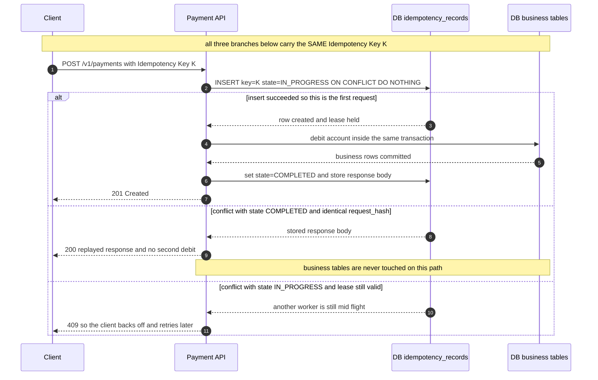
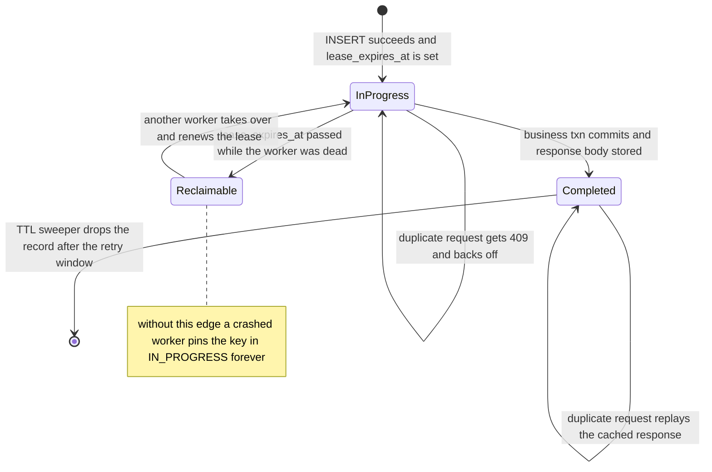

# 01 · 基础内功：数字、一致性与失败模型

> 这一篇要做的事只有一件：**把"我觉得这样会快一点"变成"这条链路的下限是 120 ms，因为光速"**。
> 系统设计里绝大多数争论之所以争不出结果，是因为双方都在比喻，没人在算数。这一篇给你算数需要的两样东西——
> 几个数量级的数字（用来算出可行域），以及几个失败与一致性模型（用来解释算出来的结果为什么长这样）。
> 后面所有的取舍论证，最终都会回落到这里。

---

## 读这一章之前

**你在工作中遇到过这个**

评审会上有人问"这个接口能压到 100 ms 以内吗"，你说"应该可以吧"，回去压测发现 p99 是 400 ms，查了三天才定位到中间夹了一次跨 region 的同步调用。
或者某次线上抖动，下游变慢 → 上游重试 → 下游被重试打死，复盘会上你只能写"增加限流"。
这两件事的共同点不是你不够仔细，是**你在动手之前没有把数字算出来**——没算，就只能事后归因。

**需要先懂的概念**

| 概念 | 一句话 | 详见 |
|---|---|---|
| 一个请求的旅程 | 从客户端点击到数据库再返回，中间经过哪些跳 | [00-concepts §1](00-concepts.md) |
| 延迟 / 吞吐 / 并发 | 延迟是单次耗时，吞吐是单位时间处理量，并发数把两者连起来 | [00-concepts §2](00-concepts.md) |
| 分位数 p50/p99 | 描述的是分布的形状；平均值会骗人，尾部才决定体验 | [00-concepts §3](00-concepts.md) |
| 副本 / 分片 | 同一份数据存多份 vs. 把数据切成多份 | [00-concepts §5](00-concepts.md) |
| 一致性 | 有多个副本时，"我读到的是不是最新的" | [00-concepts §6](00-concepts.md) |
| 同步 / 异步 | 调用方是否原地等结果 | [00-concepts §8](00-concepts.md) |
| 可用性 | 几个 9 分别对应全年多长的停机时间 | [00-concepts §10](00-concepts.md) |

**这一章要回答的问题**

1. 一个请求最快能有多快？这个下限由什么决定，哪一部分是花钱也买不回来的？
2. 想让"读到的一定是最新值"，我要额外付多少毫秒？这笔钱应该花在哪条链路上？
3. 网络一定会超时，重试一定会发生——怎么保证重试不会把钱扣两次？
4. 系统过载时，为什么表现是"雪崩"而不是"整体慢一点"？
5. 每个后端都很快，为什么用户还是觉得卡？
6. 我到底在防哪一种故障？哪一种最难防？

**本章新引入的术语**

| 术语 | English | 一句话定义 |
|---|---|---|
| 尾延迟放大 | tail latency amplification | 扇出到 N 个后端并等全部返回时，整体 p99 逼近单后端的更高分位 |
| PACELC | PACELC | 网络断开、机器分成互相通不了的两拨时（Partition），你只能在"两拨都继续接客但数据可能不一致"和"停掉一拨保住一致"之间选一个；网络正常时（Else），你还要在"少等一个跨机房往返"和"读到的一定是最新值"之间选一个 |
| 写偏斜 | write skew | 两个事务各自只看见自己开始那一刻的数据副本（快照隔离），于是各自读到的都是合法状态、各自的提交也都合法，合在一起却破坏了某条规则（例如"至少留一个人值班"被两个人同时请假绕过） |
| 幂等键 | idempotency key | 客户端生成、服务端去重的请求标识，让重试不产生第二次副作用 |
| 背压 | backpressure | 处理不过来时向上游反向施压（拒绝/阻塞），而不是无限排队 |
| 对冲请求 | hedged request | 超过 p95 还没返回就向另一副本补发一份，取先到的 |
| 灰色故障 | gray failure | 节点健康检查通过、实际能力已严重退化的"半死不活"状态 |
| 围栏令牌 | fencing token | 单调递增的编号，让被抢占的旧持有者的写在下游被拒绝 |
| 超时预算传播 | deadline propagation | 把剩余时间随请求逐层传下去，每层只减不加 |
| 重试预算 | retry budget | 给重试量设的全局上限（如不超过总请求量的 10%），防止重试放大 |

---

## 1. 为什么要有这些数字

### 问题一：上海的用户，弗吉尼亚的服务器

用户在上海，你的服务器在 `us-east-1`（弗吉尼亚）。用户点一下按钮，**最快**多久能看到结果？这不是一个"看情况"的问题，是一道乘除法。

**第一步，光速。** 上海到弗吉尼亚大圆距离约 12,000 km。光在真空中 300,000 km/s，但在光纤里受折射率（≈1.47）拖累，只有约 **200,000 km/s**。

```
单程 = 12,000 km ÷ 200,000 km/s = 60 ms
往返 RTT = 120 ms          ← 这是物理下限，任何厂商、任何优化都不可能突破
```

真实海缆不走直线（要经日本或关岛登陆），再算上沿途几十跳路由器的转发与排队，实测 RTT 通常是理论值的 1.5–2 倍，**取 200 ms**。

**第二步，握手。** 首次点击时，一个字节的业务数据都还没传，就已经欠下：

| 阶段 | 成本 |
|---|---|
| TCP 三次握手 | 1 RTT |
| TLS 1.3 握手（1.2 是 2 RTT） | 1 RTT |
| HTTP 请求 + 响应 | 1 RTT |
| **合计** | **3 RTT ≈ 600 ms** |

**第三步，你的代码。** 假设服务端查一次数据库要 5 ms。放进 600 ms 里，占比 0.8%。**于是：**

- 首次点击 ≈ **600 ms**，其中约 99% 是网络往返，约 1% 是你写的逻辑。
- 连接复用（keep-alive）之后 ≈ **200 ms**，仍然全部是网络。
- 你把服务端从 5 ms 优化到 1 ms，用户感知的变化是 **0.7%**——等于没做。
- 唯一有效的手段是**把数据挪到用户附近**：CDN、边缘节点、就近读副本、多活写入。这不是"优化选项"，这是这道题里**唯一能动的变量**。

**你算不出这个数，就没法讨论任何架构决策。** "要不要上 CDN"、"能不能做单元化多活"、"合同里承诺 100 ms 现不现实"、"这次慢是不是我们代码的锅"——所有这些问题的答案都藏在上面这几行乘除法里。算不出来，讨论就只能停在互相说服对方的"感觉"上。

### 问题二：一个页面 20 个请求

一个页面要向后端发 20 个请求（20 个微服务，或一次查询扇出到 20 个分片），**每个的 p99 都是 10 ms**，且必须全部返回才能渲染。用户感受到的延迟大概是多少？

直觉答案是"10 ms 左右吧，反正是并行的"。算一下：

```
P(20 个全都没落进慢尾)  = 0.99²⁰ ≈ 0.818
P(至少一个落进慢尾)     = 1 − 0.818 ≈ 18%
```

**约五分之一的页面加载，都会被至少一个慢后端拖住。** 单个后端的 p99 门槛，到了页面这一层变成了 p82 门槛
——上面算出只有 81.8% 的页面能完全避开慢尾，也就是说"10 ms 以内"这个承诺在页面这一层只对 82% 的加载成立，等于从 p99 掉到了 p82。
扇出到 100 个时，这个比例是 63%。

这个现象叫**尾延迟放大（tail latency amplification）**，是本篇 §7 的主题。现在只需要记住一句话：**扇出越大，整体的 p50 越像单后端的 p99**——"每个服务都很快"和"用户觉得很快"之间没有等号。

### 下一节那张表怎么用

下一节是一张延迟数字表。**不要现在背它。用到时回来查。**

真正要在脑子里固化的只有**三个数量级**：

| 层级 | 量级 | 相对关系 |
|---|---|---|
| 内存访问 | ~100 ns | 基准 |
| SSD 随机读 | ~100 µs | 比内存慢 **1000×** |
| 跨洲网络往返 | ~100 ms | 比 SSD 慢 **1000×** |

每一级差 1000 倍。记住这三个，其余数字都可以现场推：

- 一次跨洲往返 ≈ 100 万次内存访问 ≈ 1000 次 SSD 读。所以"多一次跨洲调用"和"多做 1000 次本地磁盘查询"是同量级的开销。
- 缓存命中率从 99% 掉到 90%，意味着回源次数涨 10 倍，而每次回源比命中慢 1000 倍——平均延迟的恶化是数量级的，不是百分比的。
- 同 AZ / 同城的网络往返（0.2–2 ms）落在 SSD 和跨洲之间，靠近 SSD 那一端。

一条现场可用的口诀：**看到一个设计，先数它跨了几次 100 ms 的边界。** 跨洲往返的次数几乎单独决定了用户体验，剩下的都是噪音。

---

## 2. 必须背下来的延迟数字（2026 校准版）

Jeff Dean 那张经典表格已经过时了（SSD 变快、网络变快、内存没怎么变）。下面是可用于估算的当代量级：

| 操作 | 量级 | 备注 |
|---|---|---|
| L1 cache 引用 | 1 ns | |
| 分支预测失败 | 3 ns | |
| L2 cache 引用 | 4 ns | |
| 互斥锁 加/解锁 | 17 ns | 无竞争 |
| 主存引用 | 80–100 ns | NUMA 跨节点 ×1.5–2 |
| 1 KB 内存拷贝 | ~50 ns | |
| 1 KB Snappy 压缩 | ~500 ns | zstd-1 约 2× |
| NVMe SSD 随机读 4KB | 20–100 µs | p99 可到 1 ms |
| 同 AZ 网络 RTT | 0.2–0.5 ms | |
| 跨 AZ 网络 RTT | 0.5–2 ms | 同 region |
| 跨 Region RTT（美东↔美西） | ~60 ms | |
| 跨洲 RTT（美↔欧） | ~80 ms；美↔亚 ~150 ms | 光速下限，无法优化 |
| 机械盘寻道 | 5–10 ms | 归档场景才会遇到 |
| **LLM TTFT（time to first token，从请求发出到用户看见第一个字；中等模型）** | 200 ms – 2 s | 取决于 prompt 长度与是否命中**前缀缓存**（prefix caching：多个请求开头那段完全相同的文字只算一次，后来的请求直接复用这份结果，见 [`04/01`](../04-ai-agent-systems/01-llm-serving-infra.md)） |
| **LLM 单 token 解码** | 5–30 ms | 即 30–200 tok/s |
| **向量检索 ANN（1M 向量，HNSW）** | 1–10 ms | 召回率 0.95 时 |
| **一次 Agent 工具调用往返** | 50 ms – 5 s | 工具本身决定 |

**推论（面试里直接用）：**
- 光速是硬约束。跨洲同步写 = 至少 +80 ms，**没有任何架构能绕过**，只能改成异步或就近写。
- 内存比 SSD 快 ~1000×，SSD 比跨洲网络快 ~1000×。缓存层级的存在意义就是这两个 1000×。
- **LLM 的解码是串行的**：输出 1000 token ≈ 10–30 秒。任何"让用户等完整回答"的设计都是错的，必须流式（streaming）。
- Agent 的延迟预算（latency budget）里，**模型推理通常不是瓶颈，工具调用和串行轮次才是**。5 轮 × (2s 推理 + 1s 工具) = 15 秒。

---

## 3. CAP 与 PACELC：正确的用法

### CAP 的常见误读

CAP 说的是：**在网络分区（network partition）发生时**，你只能在一致性和可用性之间选一个。它**不**说"平时也要三选二"。

**Senior 的表述方式：**
> "分区期间，我们的支付路径选 CP —— 宁可返回 503 让客户端重试，也不能出现双花（double spend：同一笔余额在网络两侧各被花掉一次，合起来花出了两倍的钱）。而通知路径选 AP —— 分区期间接受重复推送，靠客户端去重收敛。"

注意这里的关键：**CAP 的选择是按链路做的，不是按系统做的**。同一个系统里不同的数据路径（data path）可以有不同选择。

### PACELC 才是日常真正用的模型

```
if (Partition):  choose A or C
else (Else):     choose L(atency) or C(onsistency)
```

99.99% 的时间没有分区。真正每天在付出的成本是 **E 那一半**：为了强一致（strong consistency），你要多付几个 RTT。

**分类怎么读**：斜杠前是"有分区时"的选择，斜杠后是"没分区时（Else）"的选择。
所以 `PA/EL` = 分区时保可用（A）、平时保低延迟（L）；`PC/EC` = 两种情况下都保一致性（C）。四个字母就是上面那两行 if/else。

| 系统 | 分类 | 含义 |
|---|---|---|
| DynamoDB（默认） | PA/EL | 分区时可用，平时优先低延迟（最终一致读，eventually consistent read） |
| DynamoDB（强一致读） | PC/EC | 显式换成一致性，延迟 +1 RTT，成本 ×2 |
| Spanner | PC/EC | 始终强一致，代价是写要跨 AZ 达成 Paxos（一种**共识算法**：让多台机器就"这次写到底算不算数"投票并达成一致，代价是每次写至少多一轮跨机器往返） |
| Cassandra（QUORUM） | PA/EC | 可调 |
| MongoDB（majority） | PC/EC | |
| Redis（主从异步） | PA/EL | 主挂了会丢已确认的写（acknowledged writes） |

> **QUORUM / majority（法定多数）是什么**：3 副本时不等全部 3 份确认（太脆：挂一台就写不了），也不只等 1 份（太险：读可能读到没跟上的那份），
> 而是**写等 W 份确认、读问 R 份**，只要 `W + R > 副本数`，读到的那批里就**至少有一份是最新的**（两个集合必然重叠）。
> 3 副本取 W=2、R=2 是最常见的一组。上表里 Cassandra 的 `QUORUM` 和 MongoDB 的 `majority` 说的都是这件事，
> 它也是"强一致要多付一个 RTT"里那个 RTT 的来源。完整推导见 [`01/05`](../01-building-blocks/05-consensus-and-coordination.md)。

**面试金句**：
> "我们不是在选 CP 还是 AP，我们在选每一条链路上愿意为一致性付几毫秒。"

---

## 4. 一致性模型全谱（从强到弱）

```
Linearizable (线性一致)
   ↓  单对象 + 实时序，等价于"看起来只有一份数据"
Sequential (顺序一致)
   ↓  所有进程看到相同顺序，但不要求与真实时间一致
Causal (因果一致)
   ↓  有因果关系的操作保序，并发操作可乱序
Read-Your-Writes / Monotonic Reads (会话一致)
   ↓  单个会话内的保证
Eventual (最终一致)
      只承诺"停止写入后最终收敛"，没有时间上界
```

另有一条**事务维度**的正交谱（隔离级别，isolation level）：

```
Serializable > Snapshot Isolation > Read Committed > Read Uncommitted
```

（**Snapshot Isolation 快照隔离**：事务开始那一刻等于给整个库拍了张照片，此后它读到的一直是照片里的样子，别人后来的提交它一概看不见。
它就是 [00-concepts §7](00-concepts.md) 那张表里"可重复读"档在 PostgreSQL / MySQL 里的真实实现。）

⚠️ 常见陷阱：**Snapshot Isolation ≠ Serializable**。SI 允许 **写偏斜（write skew）**：
> 医院要求"至少一名医生值班"。Alice 和 Bob 同时读到"有 2 名医生在班"，各自请假。两个事务在 SI 下都提交成功，结果 0 名医生值班。

**SI 为什么拦不住它**：SI 只在"两个事务改了**同一行**"时才判冲突并中止一个。这里 Alice 改的是 Alice 那行、Bob 改的是 Bob 那行，
两人**写的行不重叠**，数据库眼里没有任何冲突 —— 被破坏的是一条它根本不知道的规则（"在班人数 ≥ 1"）。
这也是它和 §7 那类"同一行超扣"完全不同的地方：**写偏斜里没有任何一行被写坏，坏掉的是几行之间的关系。**

修复方式：`SELECT ... FOR UPDATE` 物化冲突（materializing conflicts：把那条看不见的规则**变成一行真实存在、大家都要抢的数据**，
比如给"值班表"这个对象建一行并锁它，于是"不重叠的写"重新变成"重叠的写"）、显式约束、
或用 SSI（serializable snapshot isolation，PostgreSQL 的 `SERIALIZABLE`：在 SI 上额外跟踪读写依赖，发现可能不可串行就中止一个事务）。

### 实践中怎么选

| 场景 | 需要的最低一致性 | 理由 |
|---|---|---|
| 账户余额扣减 | Linearizable / Serializable | 双花不可接受 |
| 库存扣减（可超卖少量） | SI + 补偿 | 用性能换，超卖（overselling）后人工/自动补偿 |
| 用户改完头像立刻看到 | Read-Your-Writes | 只需会话内保证，粘性路由（sticky routing）到主库即可 |
| 时间线 / Feed | Eventual | 慢几秒无人察觉 |
| 分布式锁 | Linearizable + fencing token | 光有锁不够，见 [`01-building-blocks/05`](../01-building-blocks/05-consensus-and-coordination.md) |
| Agent 的对话历史 | Causal | 用户消息必须在模型回复之前 |

**成本直觉**：每往上爬一级，通常多付 1 个跨节点 RTT 或一次共识轮次（consensus round，同 AZ ~1 ms，跨 AZ ~2–5 ms）。

---

## 5. 幂等（idempotency）：分布式系统的第一公民

**断言**：只要网络会超时，你就永远无法区分"请求丢了"和"响应丢了"。所以**每一个有副作用的接口都必须幂等**。

### 幂等键（idempotency key）的正确实现

```
POST /v1/payments
Idempotency-Key: 550e8400-e29b-41d4-a716-446655440000
```

服务端逻辑：

```sql
-- 1. 原子插入（唯一索引在 idempotency_key 上）
INSERT INTO idempotency_records (key, tenant_id, request_hash, state, created_at)
VALUES ($1, $2, $3, 'IN_PROGRESS', now())
ON CONFLICT (key) DO NOTHING
RETURNING id;

-- 2a. 插入成功 → 首次请求，执行业务逻辑，在同一事务里写入 response
-- 2b. 插入冲突 → 读取已有记录：
--     - state=COMPLETED 且 request_hash 相同 → 直接返回缓存的响应（200）
--     - state=COMPLETED 且 request_hash 不同 → 422 幂等键复用冲突
--     - state=IN_PROGRESS → 409，让客户端退避重试
```

**把上面这段 SQL 展开成时间轴：同一个 key 的第二次请求，走的是一条和第一次完全不同的路径。**



> 📖 **读图要点**：第 4–6 步必须是不可分割的一段——业务写和 `state=COMPLETED` 落在同一个事务里，否则时间轴上会出现"钱扣了但记录没写"的窗口，而第 7 步的 201 只是这段事务提交之后的回执。另外注意第三条分支返回的是 409 而不是"等它做完"：服务端此刻无法判断持有 lease 的那个进程是慢还是已经死了，让客户端退避比让连接挂着更安全。
（**lease 租约** = 一个带到期时间的占用权：谁插入成功谁就"租下"了这个 key，别人得等；租约一到期没续，就视同持有者已死，别人可以接手 —— 见下面第 2 点和状态图。）

**四个容易漏掉的点：**
1. **必须校验 request_hash**。否则同一个 key 带不同 body 会返回错误的缓存结果。
2. **IN_PROGRESS 需要超时回收**。进程崩溃会留下永久卡住的键，加 `lease_expires_at`。
3. **幂等记录和业务写必须同事务**，否则业务成功但记录失败 → 重试会重复执行。
4. **TTL 要 ≥ 客户端最大重试窗口（retry window）**，通常 24h–7d。

**第 2 点值得单独看它的状态可达性：把 Reclaimable 那条边删掉，InProgress 就变成了吸收态。**



> 📖 **读图要点**：Completed 是通向 `[*]` 的唯一出口，而 lease 过期是 InProgress 唯一的"非正常"出口。没有 `InProgress → Reclaimable → InProgress` 这条回收边，进程崩溃后该 key 就永远卡在 IN_PROGRESS 自环上——客户端拿到的是无限的 409，且因为 TTL 只清 COMPLETED 记录，这个键连过期都过期不掉。

### 幂等的三种实现层次

| 层次 | 做法 | 适用 |
|---|---|---|
| 天然幂等 | `SET x = 5`（而非 `x += 1`） | 状态覆盖类 |
| 去重表 | 幂等键 + 唯一索引 | 通用，推荐 |
| 版本/CAS | `UPDATE ... WHERE version = N` | 乐观并发（optimistic concurrency），同时解决 **ABA**（值从 A 改成 B 又被改回 A：只比较"值还是不是 A"会误判成"没人动过"，而版本号只增不减，动过就是动过） |

---

## 6. 背压（Backpressure）：没有它系统就会雪崩（cascading failure）

**核心原理**：任何一个环节，当输入速率 > 处理速率时，队列会无限增长。队列增长 → 延迟增长 → 上游超时 → 上游重试 → 输入速率进一步增长 → **正反馈崩溃**。

```
无背压：
  Client ──1000 rps──> [ Queue: ∞ ] ──500 rps──> Worker
                          延迟 → ∞，全部超时，但 Worker 仍在处理已经没人要的请求

有背压：
  Client ──1000 rps──> [ Queue: 100 ] ──500 rps──> Worker
                        满则立即 429/503
  Client 收到 429 → 退避 → 输入速率下降 → 系统稳定在 500 rps
```

### 实现手段

| 手段 | 说明 |
|---|---|
| **有界队列（bounded queue）** | 最重要的一条。无界队列（unbounded queue）= 把 OOM 和超时推迟到最坏时刻 |
| **信号量 / 并发限制（concurrency limiting）** | 限制在途请求数（in-flight requests），比限 QPS 更贴近真实资源 |
| **准入控制（admission control）** | 队列延迟 > 阈值 时直接拒绝（CoDel 思想） |
| **TCP 流控（flow control）/ gRPC 窗口** | 传输层天然背压，用 streaming 而非批量 |
| **主动降级（load shedding）** | 拒绝低优先级流量，保住高优先级 |

**Agent 系统里的背压特别重要**：一个 Agent 可以并发 fan-out 出 50 个子任务，每个子任务再调工具。没有并发上限的 Agent 会在几秒内打爆下游。

---

## 7. 尾延迟放大（Tail Latency Amplification）

**如果一个请求要扇出（fan-out）到 N 个后端，且必须等全部返回，那么想让整体达到 p99，每个后端要做到的是 `p(100 × 0.99^(1/N))`。**

这个式子只是把"全部都不慢"翻译过来：整体不慢的概率 = 单后端不慢的概率 `q` 自乘 N 次，要 `q^N = 0.99`，就得 `q = 0.99^(1/N)`。
N = 100 时 `q = 0.99^0.01 = 0.9999` —— **要拿到页面级 p99，每个后端得做到 p99.99**，这是高出两个数量级的要求。

反过来看同一件事：单后端 p99 = 10 ms，扇出 100 个：
> P(至少一个慢) = 1 − 0.99^100 = **63%**

也就是说，**63% 的请求会遇到至少一个 10ms+ 的后端**。这就是为什么大扇出系统的 p50 都很难看。

### 对策

| 手段 | 说明 | 代价 |
|---|---|---|
| **对冲请求（hedged request）** | 等到 p95 还没返回，就向另一副本发第二份，取先到的 | 多 ~5% 流量（按定义只有最慢的 5% 会触发补发，所以额外流量就是 5%；卡在 p99 补发则只多 1%） |
| **绑定请求（tied request）** | 同时发两份，谁开始处理谁通知对方取消 | 需要后端配合 |
| **减少扇出** | 用更粗的分片、预聚合（pre-aggregation） | 灵活性下降 |
| **部分结果** | 超时后返回已有的 90%，标记不完整 | 需要业务能容忍 |
| **微分片 + 负载感知路由（load-aware routing）** | 让慢节点少接活 | 复杂度 |

⚠️ 对冲请求**必须**配幂等，否则就是放大写。

**LLM 场景的特殊性**：LLM 请求耗时几秒，对冲的绝对成本非常高（一次对冲 = 一次完整推理的钱）。通常改用**超时后降级（fallback）到更小的模型**。

---

## 8. 失败模型：你要防的到底是什么

按难度排序：

1. **Fail-stop**：进程干净地死掉。最容易处理，健康检查 + 重启。
2. **Crash-recovery**：死了又活，带着旧状态回来。需要 fencing / epoch。
3. **网络分区**：双方都活着但看不见对方。→ 脑裂（split-brain）风险。
4. **灰色故障（Gray failure）**：**最难**。节点还在响应健康检查，但实际上处理能力下降 90%，或者只对某些客户端不可用。
5. **拜占庭（Byzantine）**：节点撒谎。一般只在跨信任域（区块链、多方计算）才考虑。

### 灰色故障为什么最要命

```
LB 的健康检查：GET /health → 200 OK （只检查进程活着）
实际情况：    数据库连接池耗尽，所有业务请求 30s 超时
结果：        LB 持续把流量送给这个"健康"的节点
```

**对策**：
- 健康检查必须**走真实依赖**（浅检查 shallow check + 深检查 deep check 分开，深检查决定是否摘流量 drain）
- 用**客户端侧的错误率**做异常检测（outlier detection / passive health check），而非只信服务端自报
- **优雅降级（graceful degradation）要有明确定义**：不是"尽力而为"，而是"关掉推荐模块，只返回时间线"

---

## 9. 幂等 × 重试 × 超时：三件套必须一起设计

```
超时预算（deadline budget）：
  Client 总预算 3000ms
    ├─ API GW 保留 100ms，向下传 2900ms
    │   ├─ Service A 保留 200ms，向下传 2700ms
    │   │   ├─ DB 查询 deadline = min(2700, 自身上限 500) = 500ms
    │   │   └─ Service B deadline = 2200ms
```

**规则：**
- Deadline 必须**随请求传播（deadline propagation）**（gRPC 原生支持；HTTP 用 `X-Deadline-Ms` 头）
- 每层**只减不加**。绝不能出现下游超时 > 上游超时（那样上游放弃后下游还在白干）
- **重试只在最外层或最内层做，不要每层都重试** —— 3 层每层重试 3 次 = 27 倍放大
- 重试必须带 **指数退避（exponential backoff）+ 抖动（jitter）**，且受**重试预算（retry budget）**约束（如"重试量不超过总请求量的 10%"）

```python
# 全抖动退避（AWS 推荐，比"等距退避"更能打散惊群）
sleep = random.uniform(0, min(cap, base * 2 ** attempt))
```

---

## 这一章的三句话

1. **一个设计的延迟下限，在你写第一行代码之前就已经由它跨了几次 100 ms 边界决定了。** 服务端从 5 ms 优化到 1 ms 对用户是 0.7% 的变化，把数据挪到用户附近是数量级的变化 —— 所以"这里能不能再快点"几乎总是错的问题，"这一跳能不能不跨洲"才是。
2. **幂等不是重试的配套设施，它是"允许存在网络"的准入条件。** 超时之后你在物理上分不清请求丢了还是响应丢了，所以重试一定会发生；没有一个由业务语义派生、在第一次尝试之前就定下来的幂等键，你的系统只是还没扣错第二笔钱而已。
3. **过载的表现是雪崩而不是"整体慢一点"，因为坏掉的部分会自己制造更多流量。** 无界队列、每层各自重试、按超时判定对方死活 —— 这三件事各自都"看起来合理"，叠加起来就是一个原因消失后仍然起不来的系统；背压、重试预算、deadline 只减不加是它唯一的解药，而且必须在设计时就装上，事后加不进去。

---

## 面试官会追问

1. 你说这条链路最终一致，那用户改完设置刷新页面看到旧值怎么办？（→ 会话粘性 / 读己之写 / 客户端乐观更新 optimistic update）
2. 扇出 100 个分片，p99 会变成多少？怎么救？
3. 你的重试会不会把下游打死？重试预算怎么设？
4. 幂等键存哪？多久过期？key 冲突但 body 不同怎么办？
5. 健康检查返回 200 但服务实际不可用，你怎么发现？
6. 跨 region 强一致写，延迟下限是多少？为什么不能优化？

---

**下一篇** → [02-capacity-estimation.md](02-capacity-estimation.md)：把这些数字变成可以论证的估算。
