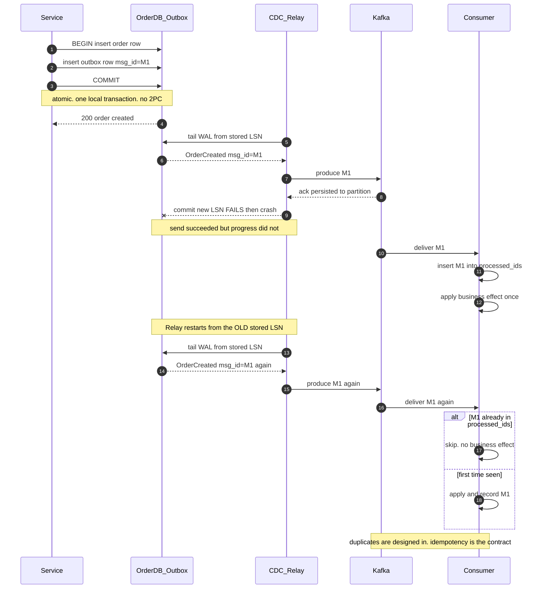
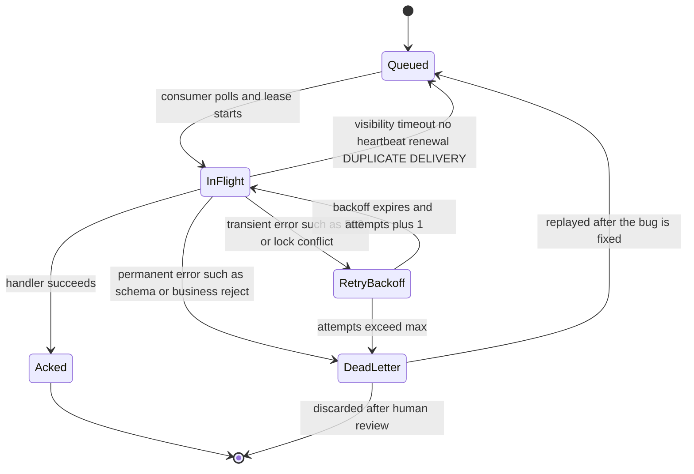

# 03 · 消息与流：解耦的代价

> 引入队列不是"加个组件"，是把你的系统从"同步的、可调试的"变成"异步的、最终一致的（eventually consistent）、需要幂等（idempotency）和死信处理的"。这个代价必须自觉支付。

---

## 1. 队列 vs 日志：两种根本不同的东西

| | **消息队列**（SQS, RabbitMQ） | **提交日志**（Kafka, Pulsar, Redpanda） |
|---|---|---|
| 模型 | 消息被消费后**删除** | 消息**持久保留**，消费者维护 offset |
| 顺序 | 通常无保证（FIFO 队列除外） | 分区内严格有序 |
| 重放（replay） | 不可（除非 DLQ） | **可以，任意回到过去某个 offset** |
| 多消费者 | 竞争消费（competing consumers，每条消息给一个） | 每个消费组（consumer group）独立读全量 |
| 扩展消费者 | 直接加，无上限 | **受分区数限制** |
| 单条 ACK | 支持（可乱序 ack） | 不支持（offset 是水位线） |
| 延迟消息（delayed message） | 原生支持 | 需要额外设计 |
| 典型吞吐 | 数万/s | **百万/s** |

**选择判据：**
- 需要**重放历史 / 多个独立消费者 / 严格顺序 / 极高吞吐** → 日志（Kafka）
- 需要**任务分发 / 每条独立重试 / 延迟队列 / 简单运维** → 队列（SQS）

**经典错误**：用 Kafka 做任务队列（task queue）。
> 一个慢任务会阻塞整个分区（head-of-line blocking，因为 offset 是单调的，不能跳过），导致后面所有消息延迟。任务队列需要"单条消息独立 ack/nack"，这正是 Kafka 不提供的。

**反过来的经典错误**：用 SQS 做事件总线（event bus）。事件需要被多个下游独立消费且能重放，SQS 的删除语义做不到（要给每个消费者一个队列 + SNS 扇出（fan-out），运维复杂且无法重放历史）。

---

## 2. Kafka 内核：你必须理解的几件事

```
Topic: orders
├─ Partition 0: [msg][msg][msg][msg]...  ← 追加写，严格有序
├─ Partition 1: [msg][msg][msg]...          Leader 在 broker-1
└─ Partition 2: [msg][msg][msg][msg][msg]   Follower 在 broker-2,3

消费组 A: consumer-1 → P0,P1    consumer-2 → P2
消费组 B: consumer-x → P0,P1,P2   （独立的 offset）
```

### 关键设计点

**a) 分区数 = 并行度（parallelism）上限**
```
消费者数 > 分区数  →  多余的消费者空闲（浪费）
分区数太多         →  每个分区一组文件句柄 + 元数据，broker 压力大，
                      rebalance 变慢，端到端延迟上升
```
经验值：`分区数 = max(目标吞吐/单分区吞吐, 峰值消费者数)`，通常 12–100。
**分区数只能增不能减**，且增加会破坏 key → 分区的映射（已有数据不迁移）→ **顺序保证（ordering guarantee）被打破**。所以初始规划要留余量。

**b) 顺序保证的边界**
> Kafka 只保证**同一分区内**有序。同一个 key 通过 `hash(key) % partitions` 落到同一分区 → **同一实体的事件有序**。
> 跨分区无序。所以"全局有序"（total ordering）要么单分区（吞吐 = 单分区上限），要么在消费端重排（reorder）（需要版本号/时间戳）。

**c) 复制与持久性（durability）**
```
acks=0     不等确认         → 可能丢
acks=1     等 leader 落盘   → leader 挂了且未同步到 follower 会丢
acks=all   等所有 ISR 确认  → 配合 min.insync.replicas=2 才真正安全
```
**生产配置**：`replication.factor=3, min.insync.replicas=2, acks=all`
含义：3 副本，至少 2 个确认才算写成功。允许挂 1 个 broker 继续写；挂 2 个则**停止写入**（选择了 C over A）。

**d) 消费者 rebalance 是最大的运维痛点**
消费者加入/退出/超时都会触发 rebalance，期间**整个消费组停止消费**（stop-the-world）。
- 用 **Cooperative Sticky** 分配策略（增量 rebalance，只动需要动的分区）
- `max.poll.interval.ms` 要大于最慢的一次处理时间，否则消费者被误判死亡 → 无限 rebalance 循环
- 静态成员（`group.instance.id`）避免滚动重启（rolling restart）触发 rebalance

---

## 3. "Exactly-Once" 的真相

**残酷事实**：在分布式系统中，端到端的 exactly-once **消息传递**是不可能的（两将军问题，Two Generals Problem）。

**能做到的是**：at-least-once 传递 + **幂等处理** = **effectively-once 语义**。

### 三种做法

**a) Kafka 的事务（EOS）**
```java
producer.initTransactions();
producer.beginTransaction();
producer.send(outputRecord);              // 写输出 topic
producer.sendOffsetsToTransaction(offsets, groupMetadata);  // 提交 offset
producer.commitTransaction();             // 原子：要么都成功要么都失败
```
✅ 有效范围：**Kafka → Kafka**（read-process-write）。
❌ **无效范围**：Kafka → 外部数据库/HTTP API。因为 Kafka 事务管不到外部系统。

**b) 消费端幂等（最通用，生产主力）**
```sql
-- 处理消息时，用消息的唯一 ID 做去重
INSERT INTO processed_messages (message_id, partition, offset, processed_at)
VALUES ($1, $2, $3, now())
ON CONFLICT (message_id) DO NOTHING;
-- 如果没插入成功 → 已处理过 → 跳过业务逻辑
-- 业务写入必须和这条 INSERT 在同一个事务里
```

**c) 幂等的业务操作**
`SET status='shipped'` 天然幂等；`balance += 100` 不幂等，改成 `记账条目 + 唯一约束`。

**面试标准答案**：
> "我不会说系统是 exactly-once。我会说：传递是 at-least-once，处理是幂等的，因此**效果**上是 exactly-once。具体做法是消费端用 message_id 做去重表（dedup table），去重记录和业务写入在同一个数据库事务里提交。"

---

## 4. 双写问题（dual-write problem）与 Outbox 模式

### 问题

```python
def create_order(order):
    db.insert(order)              # ① 成功
    kafka.send("order_created")   # ② 失败/超时 → 数据库有订单，下游永远不知道
```
这两个操作**无法原子完成**（不同的系统，2PC 不实用）。

调换顺序也不行：先发消息后写库，可能消息发出去了但库写失败 → 下游看到不存在的订单。

### Transactional Outbox —— 标准解法

```sql
BEGIN;
  INSERT INTO orders (id, ...) VALUES (...);
  INSERT INTO outbox (id, aggregate_id, event_type, payload, created_at)
  VALUES (gen_ulid(), $order_id, 'OrderCreated', $json, now());
COMMIT;   -- 原子：要么都写，要么都不写
```

然后由一个独立的 **Relay** 把 outbox 表的记录发到消息系统：

```
┌──────────┐    同一事务    ┌──────────┐
│  orders  │◄─────────────►│  outbox  │
└──────────┘                └────┬─────┘
                                 │ ① 轮询（SELECT ... FOR UPDATE SKIP LOCKED）
                                 │ ② 或 CDC（读 WAL/binlog）← 推荐
                                 ▼
                            ┌─────────┐
                            │  Kafka  │
                            └─────────┘
```

**两种 Relay 实现：**

| | 轮询（polling） outbox 表 | CDC（Debezium 等） |
|---|---|---|
| 延迟 | 100ms–1s | 10–100ms |
| DB 负载 | 持续查询 + 删除 | 只读 WAL，几乎无影响 |
| 运维 | 简单，自己写 | 需要运维 Debezium/Kafka Connect |
| 表膨胀（table bloat） | 需要定期清理 outbox | 同样需要 |

**关键点**：Relay 是 at-least-once 的（发了但没标记已发 → 重发）。所以**下游必须幂等**。

**上面的 ASCII 图画的是拓扑；下面这张画的是时间。重点看第 8 步之后：Kafka 已经 ack 了，但 Relay 在持久化"已发送"位点前挂掉——这一瞬间的裂缝，就是所有重复消息的来源。**



> 📖 **读图要点**：盯住第 9 步那个 `--x` 和它后面的第 10–12 步——位点没存住这件事，**完全不妨碍**消息被投递、被消费、在消费者侧产生真实的业务效果。第 8 步的 ack 和第 9 步的位点持久化之间不存在任何原子性，所以"发一次且只发一次"在这条链路上物理不可能；能做的只有把去重责任推到最右边那个 `processed_ids` 上。

### CDC（Change Data Capture）的两种用法

**1. Outbox 的 Relay**（推荐）：只捕获 outbox 表，事件是**有意设计的领域事件（domain event）**。

**2. 直接捕获业务表**（谨慎）：把数据库表变更直接变成事件流。
> ❌ 问题：这把**内部数据库 schema 变成了公开契约（public contract）**。改个列名就破坏所有下游。
> ✅ 适用：数据同步到分析库/搜索引擎（下游是你自己的，且是投影（projection）而非业务事件）。

**Senior 的表述**：
> "我用 Outbox + CDC。CDC 只读 outbox 表，不直接读业务表 —— 因为我不想让数据库 schema 成为跨团队的 API 契约。outbox 里的事件是我明确设计的、带版本的领域事件。"

---

## 5. 消息投递的失败处理

### 重试与死信队列（DLQ）

```
消息 → 消费 → 失败 → 重试(退避) → 失败 N 次 → DLQ
                                              ↓
                                        告警 + 人工/自动处理
```

**分类处理错误**：

| 错误类型 | 处理 |
|---|---|
| **瞬时错误**（网络、下游 503、锁冲突） | 重试，指数退避（exponential backoff） + 抖动（jitter） |
| **永久错误**（消息格式错、业务规则拒绝） | **立即进 DLQ，不要重试** |
| **毒丸消息**（poison pill，导致消费者崩溃） | 必须有重试上限，否则消费者无限重启 |

⚠️ **毒丸是队列系统最常见的生产事故**：一条格式异常的消息让消费者 panic → 重启 → 再消费同一条 → 再 panic → **整个分区永久卡住**。
**必须**：捕获所有异常 + 重试计数 + 超限入 DLQ。

**DLQ 不是垃圾桶**：
- 必须有**告警**（DLQ 深度 > 0 就该有人看）
- 必须有**重放工具**（修好 bug 后把 DLQ 消息放回主队列）
- DLQ 消息要保留原始上下文（原 topic、offset、失败原因、重试次数、trace_id）

**把上面那条线性的"重试 → DLQ"展开成状态机，你会发现它其实有环、而且有一条谁都不画的边：**



> 📖 **读图要点**：两条边最值得盯。一是 `DeadLetter --> Queued`——DLQ 是个**可回到起点的中转站**，没有这条边的系统等于把消息扔进黑洞。二是 `InFlight --> Queued` 那条可见性超时边：消费者可能**正在成功处理**，只是慢过了租约，消息已被重新投递；这条边和"永久错误"完全无关，却是线上重复消费最常见的真实来源，也是为什么慢处理必须**续约心跳**而不是简单调大超时。

### 延迟队列 / 重试队列的实现

```
主队列 → 失败 → retry-5s 队列 → 5s 后回主队列 → 失败 → retry-30s → ... → DLQ
```
- SQS：原生 `DelaySeconds`（最长 15 分钟）
- RabbitMQ：TTL + Dead Letter Exchange
- Kafka：需要自建（多个 retry topic，或用 timer wheel 服务）
- Redis：ZSET，score = 到期时间戳，轮询 `ZRANGEBYSCORE`

---

## 6. 流处理：语义与状态

### 时间语义

```
事件时间（Event Time）：事件实际发生的时间     ← 业务正确性依赖它
摄取时间（Ingestion Time）：进入系统的时间
处理时间（Processing Time）：被处理的时间      ← 简单但结果不可重现
```

**必须用事件时间**，否则重放历史数据会得到不同结果。

### 水位线（Watermark）—— 处理乱序（out-of-order events）

```
数据流: [t=10][t=12][t=9][t=15][t=11][t=20]...   乱序到达

Watermark(W) = 观察到的最大事件时间 − 允许延迟(如 5s)
含义："我认为不会再有 t < W 的事件了"
→ 当 W 越过窗口结束时间，触发窗口计算
```

**迟到数据（late-arriving data）的三种策略**：
1. **丢弃**（最简单，但会漏数据）
2. **侧输出流**（single output）单独处理
3. **允许延迟（allowed lateness）+ 更新结果**（要求下游能处理修正，即 upsert 语义）

**取舍**：水位线延迟设大 → 结果准但慢；设小 → 快但丢数据。这是流处理最核心的取舍，**没有正确答案，只有业务选择**。

### 窗口类型

| 类型 | 说明 | 用途 |
|---|---|---|
| 滚动（Tumbling） | 固定不重叠 `[0,5)[5,10)` | 每分钟统计 |
| 滑动（Sliding） | 固定重叠 `[0,5)[1,6)` | 移动平均；注意每条数据属于多个窗口，状态开销大 |
| 会话（Session） | 按不活跃间隔切分 | 用户会话分析、**Agent 对话轮次分组** |
| 全局 | 无窗口，需自定义触发 | |

### 状态管理

有状态流处理（去重（deduplication）、JOIN、聚合）需要状态后端（state backend）：
- **本地 RocksDB + Checkpoint 到 S3**（Flink 的做法）
- 状态大小是主要成本。去重状态尤其危险：**"全局去重"意味着无限增长的状态** → 必须加时间窗口（"24 小时内去重"）。

---

## 7. 消息系统的设计规范

### Schema 与版本演进

**必须用 Schema Registry**（Avro / Protobuf / JSON Schema）。

**兼容性规则：**
| 类型 | 允许的变更 | 谁先升级 |
|---|---|---|
| Backward | 删字段、加带默认值的字段 | 消费者先 |
| Forward | 加字段、删有默认值的字段 | 生产者先 |
| **Full** | 只加/删带默认值的字段 | 任意顺序 ✅ 推荐 |

**永远不要**：改字段类型、改字段含义、复用已删除的字段编号（Protobuf 用 `reserved`）。

### 事件设计：三种事件类型

```json
// 1. 事件通知（Event Notification）—— 只有 ID，消费者自己回查
{ "type": "OrderCreated", "orderId": "ord_123" }
// ✅ 载荷小、耦合低    ❌ 消费者要回查（N+1 压力、可能查到更新后的状态）

// 2. 事件携带状态转移（Event-Carried State Transfer）—— 携带完整快照
{ "type": "OrderCreated", "orderId": "ord_123", "items": [...], "total": 99.9, "customer": {...} }
// ✅ 消费者自治、无需回查    ❌ 载荷大、schema 耦合强

// 3. 领域事件（Domain Event）—— 携带发生了什么（增量）
{ "type": "OrderItemAdded", "orderId": "ord_123", "item": {...}, "version": 5 }
// ✅ 语义丰富、可做事件溯源    ❌ 消费者要自己重建状态
```

**推荐**：默认用 **2（携带状态）**，因为它消除了下游对上游的同步依赖 —— 这才是解耦（decoupling）的真正价值。载荷大不是问题（压缩后通常几 KB）。

### 事件信封（Envelope）标准

每个事件都应该有：
```json
{
  "event_id": "01HQ...",           // ULID，用于去重
  "event_type": "order.created",
  "event_version": "v2",
  "occurred_at": "2026-07-30T10:00:00Z",   // 事件时间
  "producer": "order-service@1.4.2",
  "trace_id": "...",               // 分布式追踪
  "tenant_id": "acme",             // 多租户路由/隔离
  "partition_key": "ord_123",      // 顺序保证的依据
  "data": { ... }
}
```
**`event_id` 和 `trace_id` 是事后排查唯一的抓手，不要省。**

---

## 8. 队列在 AI/Agent 系统中的角色

Agent 系统天然是异步的、长时的，队列是核心构件：

```
用户请求 → API（立即返回 run_id）
              ↓
           [任务队列]  ← 优先级分层：交互式 / 批量 / 后台
              ↓
        Agent Worker（可能运行 30 秒 – 30 分钟）
              ├→ [工具调用队列]（并发受限）
              ├→ 中间状态 checkpoint 写入
              └→ [事件流] → SSE/WebSocket 推给用户（流式 token）
                          → 计费计量管道
                          → 轨迹存储（可观测）
```

**Agent 场景的特殊要求：**

| 需求 | 做法 |
|---|---|
| **任务可能运行几十分钟** | 消息可见性超时（visibility timeout）要长，且要**心跳续约**（heartbeat renewal，否则消息被重新投递 → 任务重复执行） |
| **需要中途取消** | 任务队列外还要有控制通道（Redis pub/sub 发取消信号 + worker 定期检查） |
| **成本高，重复执行很贵** | 强幂等 + checkpoint 恢复，而不是从头重跑 |
| **优先级** | 交互式任务不能被批量任务饿死（starvation） → 分队列 + 加权轮询（weighted round-robin），或独立 worker 池 |
| **流式输出** | 队列送任务，**结果走单独的流通道**（不要把 token 流塞进 Kafka） |
| **公平性（fairness）** | 单租户不能占满 worker → 按租户分片队列 或 并发配额（concurrency quota） |

**一个真实的坑**：
> Agent 任务运行 10 分钟，SQS 默认可见性超时 30 秒 → 消息在任务还在跑时被重新投递给另一个 worker → **同一个任务被执行了 20 次**，账单爆炸。
> 修复：`ChangeMessageVisibility` 心跳续约 + 幂等键（idempotency key，run_id）。

---

## 9. 何时不要引入消息队列

| 情况 | 说明 |
|---|---|
| 调用方需要立即知道结果 | 异步只会让你在客户端实现轮询，得不偿失 |
| 只有一个消费者且逻辑简单 | 直接同步调用，用重试 + 熔断（circuit breaker） |
| 团队没有 DLQ / 幂等 / 监控的准备 | 队列会把 bug 变成"消息神秘消失" |
| 只是为了"削峰"（smoothing traffic spikes） 但峰值只有 2× | 加机器更便宜也更简单 |

**替代方案：数据库即队列（database as a queue）**
```sql
-- Postgres 的 SKIP LOCKED，可以支撑到数千 TPS，且和业务同事务
SELECT * FROM jobs
WHERE status='pending' AND run_at <= now()
ORDER BY priority DESC, run_at
FOR UPDATE SKIP LOCKED
LIMIT 10;
```
✅ 无新组件、事务性入队（transactional enqueue，自动解决双写问题）、易查询和调试。
❌ 上限约 几千 TPS、长时间持锁的连接压力、需要自己实现退避和 DLQ。

**这对 90% 的团队是正确的起点。** 到了真扛不住再上 Kafka。

---

## 面试官会追问

1. Kafka 保证顺序吗？在什么范围内？
2. 你说 exactly-once，具体怎么实现的？Kafka 事务能覆盖写数据库吗？
3. 写数据库 + 发消息怎么保证原子性？
4. 一条毒丸消息会怎么样？怎么防？
5. 消费者处理很慢，消息堆积（consumer lag / backlog）了 1 亿条，怎么办？（→ 加分区+消费者 / 跳过历史 / 并行处理 / 先分流再处理）
6. Agent 任务跑 20 分钟，队列的可见性超时怎么设？
7. 什么时候你会选择不用 Kafka？

---

**下一篇** → [04-networking-and-edge.md](04-networking-and-edge.md)
