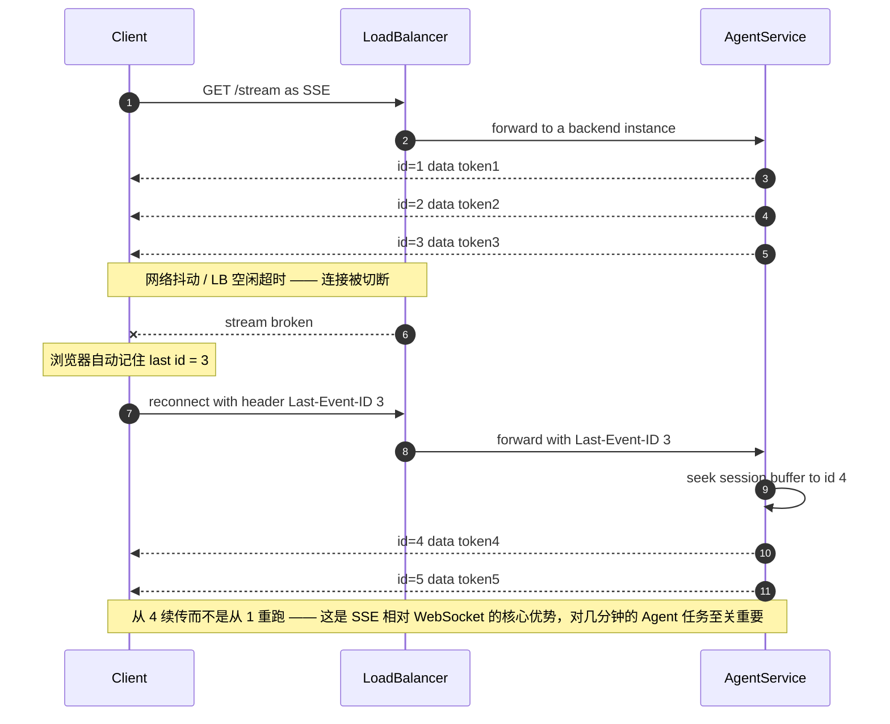

# 04 · 网络、负载均衡与边缘

> 网络是唯一你无法用"加机器"解决的层。光速是硬约束，连接是有状态的，中间盒子会撒谎。

---

## 读这一章之前

**你在工作中遇到过这个**

你的接口用 SSE 往前端推 token，本地和测试环境一切正常。上线后开始有用户反馈"回答到一半就断了"，
你压根复现不了 —— 断的全是那些模型思考超过 60 秒的请求：ALB 的空闲超时是 60 秒，
只要中间没有任何字节流过它，它就把连接掐了，而你的应用侧连一条错误日志都没有。
你加了心跳；第二周又炸一次：一次滚动发布同时打断了所有实例上的长连接，
几万个客户端在同一秒重连，网关被自己的客户端打挂了。

**需要先懂的概念**

| 概念 | 一句话 | 详见 |
|---|---|---|
| 一个请求的旅程 | DNS → CDN → 负载均衡器 → 服务，每一跳在干什么、挂了会怎样 | [00-concepts §1](../00-foundations/00-concepts.md) |
| Little's Law | 并发 = 吞吐 × 延迟；连接池和线程池的大小都从这里反推 | [00-concepts §2](../00-foundations/00-concepts.md) |
| 有状态 vs 无状态 | 杀掉任意一台会不会永久丢东西 —— 长连接就是那个"东西" | [00-concepts §9](../00-foundations/00-concepts.md) |
| 强一致 / 最终一致 | 有多个副本时"我读到的是不是最新的" | [00-concepts §6](../00-foundations/00-concepts.md) |
| RTT 与光速下限 | 跨洲一个来回至少 80–150 ms，这部分花钱也买不回来 | [01-fundamentals §1](../00-foundations/01-fundamentals.md) |
| 超时 / 重试 / deadline 传播 | 每层只减不加，重试只在一处做，否则 3 层 ×3 次 = 27 倍放大 | [01-fundamentals §9](../00-foundations/01-fundamentals.md) |

**这一章要回答的问题**

1. 请求进到你的代码之前被谁摸过一遍？L4 和 L7 各自能做什么、做不了什么？
2. 一条长连接（SSE / WebSocket）遇上空闲超时、滚动发布、扩缩容，会以哪几种方式坏掉？
3. 50 个应用实例各开 20 条连接连同一个 Postgres，为什么吞吐反而下降？
4. 想做多区域多活，又不想每次写都跨洲达成共识，写冲突该怎么绕开？

**本章新引入的术语**

| 术语 | English | 一句话定义 |
|---|---|---|
| L4 / L7 负载均衡 | layer-4 / layer-7 load balancing | 只看 IP 和端口就转发（不拆开内容）/ 先把 HTTP 解析出来，再按 URL、Header、Cookie 决定发给谁 |
| 一致性哈希 | consistent hashing | 把节点和键映射到同一个环上，键顺时针找到的第一个节点就是它的归属；增删一个节点只让约 1/N 的键换位置 |
| 二选一取优 | power of two choices (P2C) | 随机挑两个后端，把请求给其中负载较低的那个；不需要任何全局状态，效果却接近全局最优 |
| 会话粘性 | session affinity / sticky session | 让同一个用户（或同一个会话）的请求总是落到同一个后端实例上 |
| 连接迁移 | connection migration | 客户端换了网络（WiFi 切 4G，IP 都变了），连接却不断，仍是同一个会话 |
| 服务网格 / 边车 | service mesh / sidecar | 每个应用实例旁边挂一个代理进程，应用只连本地代理，由代理负责服务发现、重试、加密 |
| 熔断 | circuit breaker | 某个依赖的失败率超过阈值就暂时不再调用它、直接快速失败，冷却一段时间后放几个探测请求试探 |
| Anycast | anycast | 同一个 IP 在全球多个机房同时对外宣告，由互联网路由把用户带到"网络上最近"的那个 |
| RTO / RPO | recovery time / point objective | 故障后多久能恢复对外服务 / 最多能接受丢掉多长时间跨度的数据 |
| 边缘计算 | edge computing | 在离用户最近的那批小节点上跑一点逻辑，而不是所有请求都回中心机房 |
| 出网流量 | egress traffic | 从云厂商网络里流出去的数据（跨 AZ、跨 region、到公网），按 GB 计费 |
| 流式空闲超时 | stream idle timeout | 以"多久没有新数据流过"计时的超时，而不是以"这个请求总共开了多久"计时 |

---

## 1. 负载均衡（load balancing）：L4 vs L7

```
        L4（传输层，TCP/UDP）              L7（应用层，HTTP）
        ─────────────────────              ──────────────────
决策依据  IP + 端口                          URL、Header、Cookie、Body
性能      极高（可到 100 Gbps，内核旁路）      较低（要解析 HTTP）
TLS       透传（端到端加密）                  终止（可看内容，可做 mTLS 重加密）
连接      一条 TCP 连接绑定一个后端           连接复用，每个请求独立路由
能力      仅转发                             重试、超时、限流、金丝雀、改写、压缩
代表      AWS NLB, IPVS, Maglev              AWS ALB, Envoy, Nginx, Traefik
```

表里"能力"那行有个词后面会反复出现：**金丝雀（canary）**= 新版本先只接一小部分真实流量（1%、5%…），
指标没问题再逐步放大，出问题就把这一小部分切回旧版本 —— 之所以它是 L7 的能力，是因为要按 Header/Cookie 挑请求，
L4 只看 IP 和端口做不到。完整的放量阶梯与自动回滚判据见 [`03-saas-platform/05`](../03-saas-platform/05-release-engineering.md)。

**典型生产拓扑：**
```
Anycast IP → L4（NLB/Maglev，DSR）→ L7（Envoy 集群）→ 服务
             ↑ 抗 DDoS、超高吞吐      ↑ 智能路由、可观测

DSR = direct server return：只有"去程"经过 L4，"回程"由后端直接发回客户端。
      出向流量常是入向的几十倍，让它绕开 LB，LB 才扛得住。
```

### 一致性哈希（consistent hashing）vs 轮询（round robin）

**问题**：普通哈希 `hash(key) % N`，N 变化时几乎所有 key 重新映射 → 缓存全失效。

**一致性哈希**：把节点和 key 映射到一个环上，key 顺时针找到第一个节点。加/删一个节点只影响 1/N 的 key。

**改进：有界负载的一致性哈希（Consistent Hashing with Bounded Loads）**
> 纯一致性哈希会有热点（hot spot，某个节点分到的 key 过多）。加一个上限：如果目标节点负载 > 平均值 × (1+ε)，就顺延到下一个节点。
> 这是 **LLM 网关做会话粘性（session affinity / sticky session）路由的正确算法** —— 既保持 KV cache（LLM 推理时为已处理过的 token 缓存下来的中间状态，同一会话落回同一实例才能复用，见 [`02 §7`](02-caching.md)）亲和性，又不会让某个实例过载。

**Maglev 哈希**（Google）：查表法，中断更少、查表 O(1)，用于 L4 层。

### 负载均衡算法选择

| 算法 | 适用 |
|---|---|
| Round Robin | 请求成本均匀、后端同构 |
| **Least Connections / Least Outstanding Requests** | **请求耗时差异大时（默认推荐）** |
| **Peak EWMA / 延迟感知（latency-aware）** | 后端异构或有慢节点（straggler），按 p90 延迟加权。EWMA = 指数加权移动平均：越近的样本权重越大，旧样本自动衰减，所以慢节点恢复后能自己爬回来 |
| 一致性哈希 | 需要缓存亲和性（cache affinity）、会话粘性 |
| **Power of Two Choices (P2C)** | 随机选 2 个，取负载较低的。**接近最优且无需全局状态**，Envoy/Finagle 默认 |

**P2C 值得单独记住**：全局最少连接需要中心化状态（不可扩展），而随机选 2 个再比较，效果接近全局最优，且完全无状态。这是分布式负载均衡的标准答案。

**Agent/LLM 场景的特殊性**：请求耗时从 200ms 到 5 分钟不等，**Round Robin 是灾难性的**。必须用 least-outstanding-requests，且要考虑"这个实例正在处理多少 token"而非"多少请求"。

---

## 2. 连接管理

### 连接池（connection pool）是必须的

```
无连接池：每个请求新建 TCP + TLS
  = 1 RTT (TCP) + 2 RTT (TLS 1.2) 或 1 RTT (TLS 1.3)
  同 AZ 0.5ms × 3 = 1.5ms 白白浪费；跨 region 就是 180ms
```

**连接池配置的三个数：**
| 参数 | 怎么定 |
|---|---|
| 最大连接数 | 用 Little's Law：`并发 = QPS × 延迟`。留 2× 余量 |
| 空闲超时（idle timeout） | 要**小于**服务端和中间设备的空闲超时（否则用到已被对端关闭的连接 → 随机报错） |
| 最大生命周期 | 必须设！否则连接永远不重新解析 DNS，**扩容（scale out）后新节点收不到流量** |

⚠️ **数据库连接池的乘法陷阱**：
```
50 个应用实例 × 每实例 20 连接 = 1000 个数据库连接
Postgres 每连接约 5–10 MB 内存 + 上下文切换开销
→ 超过 ~200–400 活跃连接后，Postgres 吞吐反而下降
```
**解法**：外部连接池（PgBouncer，transaction 模式）把 1000 个应用连接复用成 50 个数据库连接。
注意 transaction 模式下**不能用会话级特性**（prepared statement 需要配置、`SET`、advisory lock（由应用自己命名、和任何具体表都无关的一把数据库锁）、临时表）。

### HTTP 版本演进

| | HTTP/1.1 | HTTP/2 | HTTP/3 (QUIC) |
|---|---|---|---|
| 多路复用（multiplexing） | ❌ 队头阻塞（head-of-line blocking），靠多连接 | ✅ 一条 TCP 上多流 | ✅ 基于 UDP |
| **TCP 队头阻塞** | 有 | **仍有**（一个包丢，所有流都等） | **无**（流独立） |
| 握手 | TCP + TLS = 2–3 RTT | 同 | **0–1 RTT**（0-RTT 恢复：复用上次连接协商好的密钥，第一个数据包就带上业务请求；代价是这个包可能被重放） |
| 头部压缩 | ❌ | HPACK | QPACK |
| 连接迁移（connection migration） | ❌ | ❌ | ✅ **切换 WiFi/4G 不断连** |
| 适用 | 遗留 | 服务端间通信（gRPC） | 移动端、高丢包网络 |

**HTTP/2 的一个反直觉问题**：在**丢包率（packet loss）高的网络**下，HTTP/2 可能比 HTTP/1.1 更慢 —— 因为所有流共享一条 TCP 连接，一个丢包会阻塞所有流。HTTP/3 就是为了修这个。
这就是**队头阻塞**在传输层的形态：排在前面的那个包没到，后面已经到了的包也不许交给应用（同一个词在 Kafka 分区消费上的形态见 [`03 §1`](03-messaging-and-streams.md)）。

**HTTP/2 在服务端到服务端的另一个坑**：L7 负载均衡看到的是"一条长连接"，如果 LB 按连接做负载均衡（L4），流量会严重倾斜（load skew）。必须用支持 HTTP/2 的 L7 LB，按**请求**而非连接分发。

---

## 3. gRPC vs REST vs GraphQL

| | REST/JSON | gRPC | GraphQL |
|---|---|---|---|
| 载荷（payload） | 文本，冗长 | Protobuf 二进制，**小 3–10×** | JSON |
| 性能 | 基准 | **快 2–5×**（序列化 + HTTP/2） | 类似 REST |
| 契约（contract） | OpenAPI（可选） | **.proto 强制** | Schema 强制 |
| 流式 | SSE / WebSocket | **原生双向流（bidirectional streaming）** | Subscription |
| 浏览器 | 原生 | 需要 grpc-web 代理 | 原生 |
| 调试 | curl 即可 | 需要工具（grpcurl） | GraphiQL |
| 缓存 | **HTTP 缓存天然可用** | 不可用 | 难（POST） |
| 适用 | **对外 API** | **内部服务间** | 前端聚合层，多客户端 |

**默认建议**：对外 REST，对内 gRPC。除非你有多个差异很大的客户端需要各取所需，否则不要上 GraphQL。

### GraphQL 的三个必须处理的问题
1. **N+1 查询（N+1 query problem）**：必须用 DataLoader 批量化（batching），否则一个查询打出 1000 次 DB 查询
2. **查询复杂度攻击（query complexity attack）**：深度嵌套查询可以让服务器 OOM → 必须有深度限制（depth limiting） + 复杂度评分 + 超时
3. **不可缓存**：POST + 任意查询形状 → CDN 无法缓存。用 **Persisted Query**（客户端只发 query hash）解决

---

## 4. 流式传输（streaming）：SSE vs WebSocket

**这在 LLM/Agent 时代变成了核心决策。**

| | SSE (Server-Sent Events) | WebSocket |
|---|---|---|
| 方向 | **单向**（服务端→客户端） | 双向 |
| 协议 | 普通 HTTP | 升级握手后独立协议 |
| 自动重连 | ✅ 原生（含 `Last-Event-ID` 断点续传） | ❌ 自己实现 |
| 通过代理/防火墙 | ✅ 就是 HTTP | 有时被阻断 |
| 压缩、HTTP/2 多路复用 | ✅ | 部分 |
| 负载均衡 | 普通 HTTP LB 即可 | 需要支持 upgrade |
| 二进制 | ❌ 文本 | ✅ |
| 浏览器连接数限制 | HTTP/1.1 下每域 6 个（HTTP/2 无此限制） | 独立 |

**LLM token 流的正确选择：SSE。**
> 理由：只需要服务端→客户端；`Last-Event-ID` 让断线重连能从中断处继续（对几分钟的 Agent 任务至关重要）；不需要特殊的 LB 配置；调试可以直接 curl。
> OpenAI/Anthropic 的流式 API 都用 SSE，不是巧合。

**什么时候需要 WebSocket**：协作编辑（高频双向）、多人游戏、需要客户端持续推送状态（如实时光标位置）。

**下面这张图要让你看清一件表格里写不出来的事：断线之后，服务端是从第 4 个 event 接着发，而不是把已经生成过的 token 从头重放一遍。**



> 📖 **读图要点**：全图的重量都压在重连那一跳带的 `Last-Event-ID` 上——客户端只需要记住最后一个 id，续传点就由服务端算出来。WebSocket 在协议层没有这个约定，重连后服务端不知道对方收到了哪里，同样的语义得你在应用层重造一遍（而且重连本身也要自己写）。另一处容易忽略：重连是一个全新的 HTTP 请求，LB 可能把它路由到**另一个实例**，所以续传所需的会话缓冲必须在实例之外。

### 长连接的实际问题

```
问题 1：中间设备的空闲超时
  AWS ALB 默认 60s，Nginx 默认 60s，公司防火墙可能 30s
  → 必须发心跳（SSE 用注释行 `: keepalive\n\n`，间隔 15–30s）

问题 2：服务端部署时会断开所有连接
  → 优雅关闭：停止接受新连接 → 通知客户端重连 → 等待现有流结束（有上限）
  → 客户端要有指数退避重连 + 抖动（否则所有客户端同时重连 = 惊群）
     惊群 thundering herd：大量客户端在同一瞬间做同一件事，一次把下游打满（见 01/02 §3）

问题 3：连接是有状态的，破坏了无状态扩展
  → 扩容时新实例没有连接，缩容时要迁移连接
  → Agent 场景更糟：连接绑定了会话状态和 KV cache
  → 解法：状态外置（Redis）+ 断线后能恢复，而不是依赖连接本身
```

---

## 5. 服务发现（service discovery）与流量治理（traffic management）

### 服务发现模式

| 模式 | 说明 | 代表 |
|---|---|---|
| DNS | 简单，但 TTL 缓存导致收敛慢，且不带健康状态 | K8s Service |
| 客户端发现 | 客户端查注册中心（service registry），自己负载均衡 | Eureka + Ribbon |
| **服务端发现 / Sidecar** | 应用只连本地代理，代理负责发现和路由 | Envoy / Service Mesh |

**Service Mesh 的价值与代价：**
```
✅ 提供：mTLS 自动化、统一重试/超时/熔断、金丝雀路由、黄金指标、多语言一致
❌ 代价：每 Pod 多一个容器（内存 +50–100 MB，延迟 +0.5–1ms 双向）
         控制面本身是关键依赖（挂了会怎样？）
         调试难度上升（多了一跳）
         团队要理解一套新的抽象

mTLS         : 双向 TLS —— 不只客户端验服务端的证书，服务端也用证书验客户端身份
金丝雀路由    : canary —— 新版本先只接一小部分流量，指标没问题再逐步放大
黄金指标      : golden signals —— 延迟、流量、错误率、饱和度这四个
控制面        : control plane —— 负责下发配置和路由规则的那一层，
               与真正转发流量的数据面（data plane）分开部署
```
**判据**：服务数 > 20 且多语言，或有强制 mTLS 的合规要求（compliance requirement） → 值得。否则用库（如 gRPC 内置的重试/负载均衡）。

**新趋势**：Ambient/Sidecar-less mesh（节点级代理 + 按需 L7 代理），降低了内存开销。

### 熔断（circuit breaker）的正确位置

熔断应该在**调用方（caller）**（客户端侧或 sidecar），不是被调方（callee）。因为熔断的目的是"保护调用方不被慢依赖拖死"和"给被调方喘息机会"。

---

## 6. Anycast、多区域与边缘

### Anycast

同一个 IP 在全球多个 PoP（point of presence：运营商或 CDN 在某个城市的接入机房）宣告（announce / advertise），BGP（互联网上各家网络互相通告"经我这里可以到达哪些 IP 段"的路由协议）把用户路由到"网络上最近"的 PoP。

```
✅ 天然的 DDoS 分散（攻击流量被分到各个 PoP）
✅ 无需 DNS 变更即可故障转移（撤销 BGP 宣告，秒级）
✅ 用户自动就近
❌ 路由可能"翻转"（BGP 变化导致 TCP 连接断）→ 需要 stateless 或 PoP 内一致性哈希
❌ "网络最近" ≠ "延迟最低"
```

### 多区域架构的三种形态

| 模式 | RTO | RPO | 成本 | 复杂度 |
|---|---|---|---|---|
| **单区域 + 备份** | 小时 | 分钟~小时 | 1× | 低 |
| **主备（Active-Passive）** | 分钟 | 秒（异步复制） | 1.5–2× | 中 |
| **多活（Active-Active）** | ~0 | 0 或 秒 | 2–3× | **高** |

**多活的核心难题：写冲突（write conflict）。** 三种解法：

1. **按分区键（partition key）路由**（推荐）：每个租户/用户"归属"一个 region，写只在归属 region 发生。其他 region 只读副本（read replica）。
   > 这是最实用的方案，避免了所有冲突，且天然符合数据驻留（data residency：法规要求某类数据必须存放在特定国家/地区境内）的合规要求。
2. **CRDT / 最后写入者胜**：适合可交换的数据（计数器、集合、协作文档）。CRDT 是一类特殊设计的数据结构 —— 多个副本各自乱序合并后必然收敛到同一个结果，因此完全不需要协调；"最后写入者胜"（LWW）则依赖时钟，为什么危险见 [`05 §5`](05-consensus-and-coordination.md)。
3. **全球共识（global consensus）**（Spanner/CockroachDB）：正确但每次写要跨 region 达成共识（共识 = 一组节点对某个值达成一个不可撤销的一致决定，见 [`05`](05-consensus-and-coordination.md)），延迟 +100ms 起。

**面试金句**：
> "多活我不会做全局强一致。我会做**分区多活**：用户数据按 home region 归属，写请求路由到归属 region，读可以就近走本地副本。跨 region 的强一致只保留给极少数真正需要的全局资源（如用户名唯一性），那部分我用一个全局服务 + 缓存来做。"

### 边缘计算（edge computing）

```
边缘能做：           边缘不适合做：
- 静态资源            - 需要强一致的写
- 认证/JWT 校验       - 大数据集查询（数据不在边缘）
- A/B 分流、地理路由   - 长时间计算（边缘运行时有 CPU 时间限制）
- 个性化 HTML 拼装
- 速率限制（近似）
- 图片变换
- 简单 API 聚合
```

**边缘的真实约束**：Cloudflare Workers 有 CPU 时间限制（默认 10ms–30s）、内存 128MB、没有本地磁盘、冷启动（cold start：一段时间没人调用的实例会被回收，下一个请求得先把运行时和你的代码重新装载起来，这段额外等待就是冷启动）虽快但状态需外置（KV/D1/DO）。

**LLM 场景**：边缘做**路由、鉴权（authn/authz）、限流（rate limiting）、缓存查找**很合适；**推理本身**必须在有 GPU 的中心节点。所以典型架构是"边缘网关 + 中心推理"。

---

## 7. 出网流量（egress traffic）与成本

| 路径 | 成本（AWS 参考） |
|---|---|
| 同 AZ 内 | 免费 |
| **跨 AZ** | $0.01/GB **双向** |
| 跨 Region | $0.02/GB |
| **出网到 Internet** | $0.05–0.09/GB |
| 经 CloudFront 出网 | $0.085/GB（但有大量免费额度和折扣） |

**这些数字驱动架构决策：**
1. **跨 AZ 流量费经常超过计算成本** → Cell 架构（Cell：把整套服务复制成若干个互相独立的小单元，每个单元只服务一部分用户；这里让每个 Cell 在单 AZ 内闭环）、拓扑感知路由（topology-aware routing，`topologyAwareHints`）
2. **出网贵** → 用 CDN、开启压缩、避免把大对象经过应用层中转（用 S3 预签名 URL（presigned URL）让客户端直连）
3. **Cloudflare R2 / Backblaze 零出网费** → 大流量场景的重要选项

**一个具体例子**：一个日志系统每天跨 AZ 传 10 TB → `10 TB × 30 × $0.01/GB × 1000 = $3,000/月`，仅流量。改成 AZ 内聚合后再跨 AZ 传压缩数据，能省 80%。

---

## 8. 超时、重试与 deadline 传播（网络视角）

```
必须设置的四个超时：
  连接超时（connect）    : 1–3 s     ← 网络不可达要快速失败
  TLS 握手超时           : 2–5 s
  请求超时（total）      : 按 SLO 定
  空闲超时（idle）       : 小于中间设备的超时
```

**没有超时 = 无限期挂起 = 线程/连接泄漏 = 级联故障（cascading failure：一个组件变慢导致上游并发堆积、资源耗尽，故障沿调用链一路向上传染，见 [`01-fundamentals §6`](../00-foundations/01-fundamentals.md)）。** 很多语言的 HTTP 客户端默认无超时，这是生产事故的头号来源之一。

**LLM 请求的超时特殊性**：
- 一个长生成可能要 5 分钟，普通的 30 秒超时会误杀
- 但"卡住不产出 token"和"正常慢"要区分 → 用 **流式空闲超时（stream idle timeout）**（30 秒没有新 token 才算超时），而不是总时长超时
- 这需要 LB 和客户端都支持（ALB 的 idle timeout 是"无数据传输"计时，SSE 心跳可以维持）

---

## 这一章的三句话

1. **这一层里唯一花钱买不回来的成本是光速，所以"网络优化"归根结底只有一件事：减少请求跨越 100 ms 边界的次数。** 连接复用、CDN、就近读、边缘鉴权，全都是这一件事的不同写法；其余的调参都是在小数点后面做文章。
2. **只要你开了长连接，你的服务就不再是无状态的了。** 部署、扩缩容、LB 空闲超时会从"用户无感"变成"用户掉线"。所以真正该问的不是"用 SSE 还是 WebSocket"，而是"断了之后靠什么把用户接回原处"—— SSE 赢在协议自带 `Last-Event-ID`，而不是赢在更简单。
3. **多活的目标不是"任何数据都能在任何 region 写"，而是"让绝大多数写根本不需要跨 region 协调"。** 按归属 region 给用户分流量，比任何一种冲突解决算法都便宜、都好解释、也顺带解决了数据驻留合规。

---

## 面试官会追问

1. L4 和 L7 负载均衡的区别？你在哪一层做金丝雀？
2. 一致性哈希解决了什么问题？它自身有什么问题？
3. 为什么服务端到服务端要用 P2C 而不是全局最少连接？
4. LLM 的流式输出用 SSE 还是 WebSocket？为什么？
5. 部署时长连接怎么办？客户端重连会不会打垮你？
6. 50 个应用实例连一个 Postgres，会有什么问题？
7. 跨 AZ 流量费怎么算？你会怎么优化？
8. 多活写冲突怎么解决？给我一个不需要全局共识的方案。

---

**下一篇** → [05-consensus-and-coordination.md](05-consensus-and-coordination.md)
