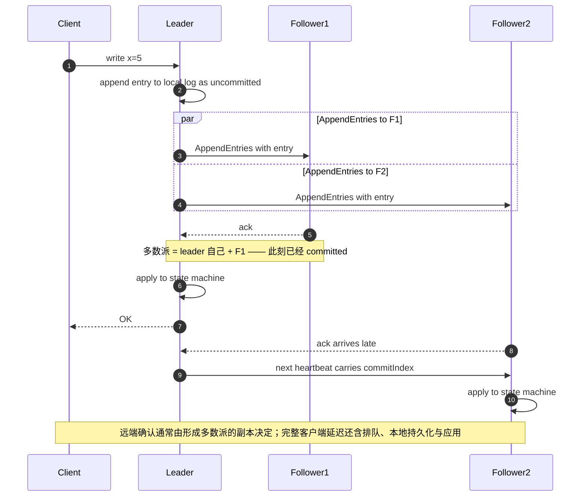
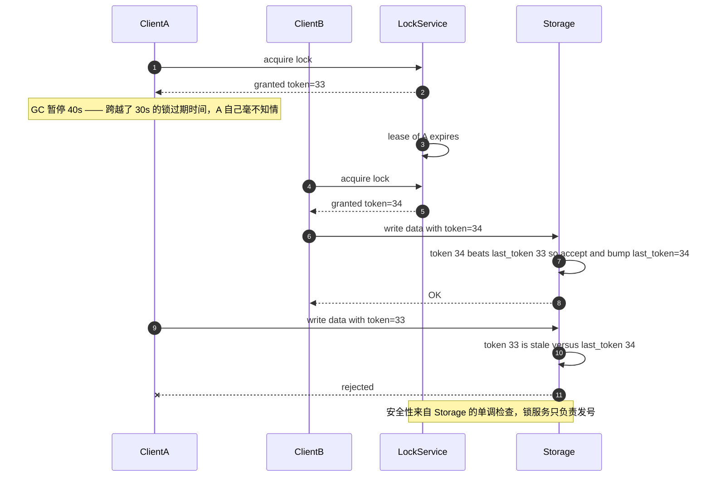

# 05 · 共识、协调与时间

> 大部分工程师用不着实现 Raft，但每个 Senior 都会遇到"分布式锁（distributed lock）不安全"、"时钟回退导致数据错乱"、"脑裂"这类问题。这一篇是关于**协调的正确姿势**。

---

## 读这一章之前

**你在工作中遇到过这个**

你有个每天凌晨跑的对账任务，部署了 6 个实例，用 `SET key val NX EX 30` 抢锁，谁抢到谁跑。
跑了半年一次没出过事。某天一次 Full GC 让持锁的那个实例停了 40 秒 —— 锁早就过期，
第二个实例接手把这批账对完了；第一个实例醒过来，什么都不知道，接着往下写它的中间结果，
同一批账被对了两遍，财务对不上。你翻了两天代码，锁的写法一行没错 ——
错的是"用一个超时来判断另一个进程死没死"这件事本身。

**需要先懂的概念**

| 概念 | 一句话 | 详见 |
|---|---|---|
| 网络分区 / 脑裂 | 机器都活着但互相通信不上；两边都以为自己是权威 | [00-concepts §5](../00-foundations/00-concepts.md#5-副本分片分区--三个被混用的词) |
| 强一致 / 线性一致 | 写成功之后任何人读到的都是新值，系统表现得像只有一份数据 | [00-concepts §6](../00-foundations/00-concepts.md#6-什么是一致性--一个词两种完全不同的意思) |
| 乐观并发 / CAS | 不加锁，提交时用版本号检查"这行有没有被别人改过"，被改过就重试 | [00-concepts §7](../00-foundations/00-concepts.md#7-事务与隔离级别) |
| CAP / PACELC | 有分区时在一致性和可用性里选一个；没分区时在延迟和一致性里选一个 | [01-fundamentals §3](../00-foundations/01-fundamentals.md#3-cap-与-pacelc正确的用法) |
| 幂等键 | 客户端生成、服务端去重的请求标识，让重试不产生第二次副作用 | [01-fundamentals §5](../00-foundations/01-fundamentals.md#5-幂等idempotency分布式系统的第一公民) |
| 围栏令牌 | 单调递增的编号，让被抢占的旧持有者的写在下游被拒绝 | [01-fundamentals](../00-foundations/01-fundamentals.md) |

**这一章要回答的问题**

1. 一组随时可能挂掉、消息随时可能丢的机器，凭什么能对"谁是主"这类事达成一个不可撤销的决定？
2. 为什么所有基于超时的分布式锁都不安全？既然不安全，线上那么多 Redis 锁为什么大多没出事？
3. 机器的时钟会漂、还会向后跳，那"哪件事先发生"到底该拿什么判断？
4. etcd / ZooKeeper 挂掉的那十分钟，我的系统应该表现成什么样才算设计对了？

**本章新引入的术语**

| 术语 | English | 一句话定义 |
|---|---|---|
| 共识 | consensus | 一组节点对某个值达成一致，且这个决定之后不可撤销 |
| 法定集合 | quorum | 协议规定的、足以推进某一步的一组参与者；不同协议可以使用不同 quorum 结构 |
| 多数派 | majority | 超过固定成员集合一半的 quorum；任意两个多数派相交，但只有配合任期、投票和日志规则才能阻止矛盾决定 |
| 任期 / 纪元 | term / epoch | 单调递增的编号，每重新选一次主就 +1；带着旧编号来的消息一律被拒绝 |
| 复制日志 / 状态机复制 | replicated log / state machine replication | 让所有节点按完全相同的顺序执行完全相同的一串操作，从而必然得到完全相同的状态 |
| FLP 不可能性 | FLP impossibility | 在没有任何时间假设的异步系统里，只要有一个节点可能失败，就不存在能保证达成共识的确定性算法 |
| 部分同步 | partial synchrony | 承认网络大多数时候是及时的，于是允许用超时来判定"对方大概是死了"—— 所有真实共识算法的前提 |
| 租约 | lease | 有时间限制、可续期的所有权授予；到期不续就自动失效，不需要持有者主动归还 |
| 单调时钟 | monotonic clock | 只会向前走、不受校时和闰秒影响的计时器；它能告诉你"过了多久"，但不能告诉你"现在几点" |
| 逻辑时钟 | logical clock | 不看真实时间，只靠"我给你发过消息"这类因果关系给事件排序的计数器 |
| 混合逻辑时钟 | HLC / hybrid logical clock | 把物理时间和逻辑计数器拼成一个值：既接近真实时间可读，又保证因果先后不会被时钟回退搞颠倒 |
| 静态稳定性 | static stability | 依赖挂掉时，系统靠上一次读到的数据继续按现状运行，而不是跟着一起挂 |
| 见证节点 | witness | 只参与投票、不存数据的轻量节点，用来把集群凑成奇数以免平票 |

---

## 1. 共识解决的到底是什么问题

**共识（Consensus）**：让一组节点对某个值达成一致，且这个决定不可撤销。

它是这些东西的底座：
- 谁是主节点（leader election）
- 分布式锁的所有权
- 配置的原子变更
- 复制日志（replicated log）的顺序（→ 状态机复制（state machine replication）→ 强一致数据库）

**FLP 不可能性定理（FLP impossibility）**：在完全异步的系统中（没有时钟假设），只要有一个节点可能失败，就**没有确定性算法**能保证达成共识。

实践中的绕法：引入**超时**（部分同步模型 partial synchrony）。所以所有真实共识算法都依赖超时来检测故障（failure detection） —— 这也是它们在网络抖动时会"莫名其妙重新选主"的原因。

---

## 2. Raft：够用的心智模型

```
三种角色：
  Follower  ──超时未收到心跳──> Candidate ──获得多数票──> Leader
      ↑                                                    │
      └──────────── 发现更高的 term ───────────────────────┘

任期（Term）：单调递增的逻辑时钟，每次选举 +1。
             收到更高 term 的消息 → 立刻退位为 Follower。
```

### 写入流程
```
1. 客户端 → Leader
2. Leader 追加到本地日志（uncommitted）
3. Leader 并行发 AppendEntries 给所有 Follower
4. 多数派（含自己）确认 → 标记为 committed
5. Leader 应用到状态机，回复客户端
6. 下次心跳告知 Follower 提交点，Follower 也应用
```

**把上面 6 步铺到时间轴上，会露出一个列表写不出来的事实：客户端拿到 OK 的那一刻，最慢的那个 follower 还没回话。**



> 📖 **读图要点**：看第 7 步和第 8 步的先后——客户端已经收到 OK，F2 的 ack 才姗姗来迟。"committed"是满足多数派规则，不是等所有副本。远端确认通常取决于最快形成的多数派；完整客户端延迟还包含 leader 排队、本地/副本持久化、网络往返和状态机应用。增加节点改变所需票数与故障域，但不必然单调变慢：结果取决于新增节点位置与延迟分布。还要注意 follower 知道提交点可能更晚，跟随者线性一致读需要协议提供的 ReadIndex、租约读等安全路径。

**关键推论：**
- 提交不等最慢 follower，但也不只是“一次 RTT”：持久化策略、批量、排队、leader 位置和客户端路径都会进入延迟
- 多数派集群可容忍的崩溃故障数为 `floor((N-1)/2)`；节点数、位置与投票成员应由故障模型和延迟目标共同决定
- 跨区域延迟必须按计划中的 leader 与投票副本布局测量，不能套固定毫秒数

### Raft 的三个保证
1. **选举安全（election safety）**：一个 term 最多一个 leader
2. **日志匹配（log matching）**：如果两个日志在某个 index 有相同 term，那么它们之前的所有条目都相同
3. **Leader 完备性（leader completeness）**：已提交的条目一定在未来所有 leader 的日志中（靠"只投票给日志不比自己旧的候选人"实现）

### Raft vs Paxos vs 其他

| | 说明 |
|---|---|
| **Paxos** | 理论最早，难懂难实现，Multi-Paxos 才实用 |
| **Raft** | 为可理解性设计，强 leader，工业界主流（etcd, Consul, TiKV, CockroachDB） |
| **ZAB** | ZooKeeper 用，类似 Raft |
| **EPaxos / Leaderless** | 无 leader，可就近提交，但冲突处理复杂 |
| **Viewstamped Replication** | 与 Raft 高度相似 |

**面试够用的表述**：
> "我用 Raft 支撑需要线性一致的元数据。写入经过 leader、复制多数派和实现要求的持久化，因此容量与延迟要在目标磁盘和副本布局上压测。我把低频配置和分片路由放入协调存储；高频业务数据只有在所选数据库用分片后的共识组承载且经过容量验证时才放进去。"

单个 Raft 组会受 leader、日志、快照和 apply 路径限制；etcd 等具体产品还有随版本变化的配额与运维建议，应查当前官方文档并压测。业务数据常通过 multi-raft 把数据切成多组、分散 leader 与写入，而不是把所有键塞进一个协调组。

---

## 3. 分布式锁：几乎所有实现都是错的

### 为什么"Redis SETNX"不安全

```python
# 常见写法
if redis.set(key, token, nx=True, ex=30):
    do_critical_work()      # ← 如果这里 GC 暂停 40 秒？
    redis.delete(key)       # ← 锁早就过期，删的是别人的锁！
```

**两个致命问题：**

**问题 1：进程暂停（process pause）/ 网络延迟导致的双持有**

（**GC 暂停**：垃圾回收器为了整理内存，把进程里所有线程**全部停住**，短则几毫秒、长则几十秒。
这期间进程既不执行代码也不收发网络包，而它自己毫无感知 —— 醒来时它以为只过去了一瞬间。
虚拟机被挂起、宿主机换页、一个 `SIGSTOP`，效果完全一样。）

```
Client A: 获得锁(TTL=30s) ──> [GC 暂停 40s] ──> 恢复，继续写数据 ❌
Client B:                     30s后获得锁 ──> 写数据 ❌
                              两个客户端同时认为自己持有锁
```
**没有任何基于超时的锁能避免这一点。** 因为你无法区分"进程慢"和"进程死了"。

**问题 2：删除别人的锁**
必须用 Lua 脚本做"比较并删除"（compare-and-delete）—— Redis 执行一段 Lua 脚本时是单线程、不可打断的，所以"比较"和"删除"之间不会被别人插进来：
```lua
if redis.call("get", KEYS[1]) == ARGV[1] then
    return redis.call("del", KEYS[1])
else
    return 0
end
```

### 正确的做法：Fencing Token

```
锁服务返回一个单调递增的 token：
  Client A 获得锁，token = 33
  Client A GC 暂停
  Client B 获得锁，token = 34
  Client B 写存储：write(data, token=34)  → 存储记录 last_token=34
  Client A 恢复，写存储：write(data, token=33)  → 存储发现 33 < 34，拒绝 ✅
```

**关键**：**被保护的资源本身必须参与验证**。锁服务只发号，真正的安全性由存储端的单调性检查（monotonicity check）提供。

实现方式：
- 数据库：`UPDATE ... WHERE fence_token < $new_token`
- 对象存储：`If-Match` 可拒绝基于旧对象版本的覆盖，但 ETag 本身通常不是全局单调 fencing token；若要围栏语义，受保护资源必须原子保存并比较单调 epoch，或使用具备等价版本条件的协议
- 文件：租约 + epoch 号

**严格按时间轴走一遍，才能看清"两个客户端同时自认为持锁"这件事根本没有被阻止——被阻止的只是旧持有者的那一次写。**



> 📖 **读图要点**：注意 A 的 GC 暂停横跨了"锁过期"和"B 加锁"两件事——在锁服务看来一切正常，在 A 看来它从没失去过锁，**没有任何超时机制能消除这个重叠区**。整张图里唯一不可达的边是最后那条"旧 token 写入成功"，而它之所以不可达，只因为 Storage 记住了 `last_token=34`。把 Storage 换成一个不检查 token 的对象存储，这条边立刻可达，你得到的就是一次静默覆盖写——锁服务那边什么告警都不会有。

### 什么时候可以用"不安全"的锁

| 用途 | 要求 |
|---|---|
| **效率优化**（避免重复做同一件事，做两次也没关系） | 简单锁够用 ✅ |
| **正确性**（不能重复扣款、不能双写） | **必须 fencing 或改用事务** ✅ |

**Senior 的答案**：
> "如果只是为了避免重复计算，我用 Redis 锁，最坏情况是算两次，浪费点 CPU。如果涉及正确性，我根本不用分布式锁 —— 我用数据库的唯一约束（unique constraint）或条件更新（conditional update），把互斥下推到已经具备线性一致性（linearizability）的存储层。"

**这句话是关键洞察**：**大部分需要分布式锁的场景，都可以用"幂等键（idempotency key） + 唯一约束"或"乐观并发（CAS）"消除。**

### Redlock 的争议

Redis 作者提出的 Redlock（在 N 个独立 Redis 上加锁，多数成功即持有）。Martin Kleppmann 指出它依赖时钟不发生跳变，且仍无法解决 GC 暂停问题。

**工程结论**：先定义锁是效率优化还是正确性边界。Redlock、单 Redis 和基于共识的租约有不同故障假设，但任一种超时锁都不能单独阻止暂停的旧持有者继续写；正确性场景仍需让受保护资源验证 fencing token/条件更新。只用于减少重复计算时，可以选更简单的锁并接受偶发重复。

---

## 4. 租约（Lease）：比锁更好的抽象

**租约 = 有时间限制的、可续期的所有权授予。**

```
Leader 持有租约（10s）→ 每 3s 续约一次
如果续约失败 → 主动降级为 Follower（不要等到租约过期！）
其他节点在租约过期 + 时钟误差余量 后才能接管
```

**关键设计：租约持有者要比观察者更早认为自己失去了租约。**
```
持有者：在 t + 7s 就放弃（保守）
观察者：在 t + 10s + Δ 才接管（Δ = 最大时钟漂移）
→ 中间有 3s + Δ 的安全间隔，保证不会重叠
```

这是安全租约的一种直觉。真实 lease read 还依赖协议对时钟漂移/单调时钟、消息延迟、选举与任期的假设；满足实现条件时，leader 可在租约有效期内省去一次新的 quorum 往返，但仍有本地处理与存储延迟，不能称为“延迟为 0”。

---

## 5. 时间：分布式系统里最不可信的东西

### 物理时钟的问题

| 问题 | 表现 |
|---|---|
| **时钟漂移（clock drift）** | 本地振荡器与真实时间速率不同；幅度随硬件、温度和同步状态变化 |
| **NTP 校正会跳变（clock step）** | 时间可能**向后跳** → `t2 - t1` 为负数 |
| **闰秒（leap second）** | 为对齐地球自转，UTC 偶尔插入一秒，那一分钟有 61 秒。2012 年闰秒让大量系统崩溃（Linux 内核 bug） |
| **虚拟机暂停/迁移** | 时钟可能瞬间跳几秒 |

**铁律：**
- **测量时间间隔一定要用单调时钟（monotonic clock）**（`CLOCK_MONOTONIC` / Go 的 `time.Since` / Java 的 `System.nanoTime`），绝不用 wall clock（wall clock：系统里"现在几点"的那个时间，NTP 会把它往前调、也会往后调）
- **绝不用时间戳做唯一 ID 或排序依据**（除非配合节点 ID + 序列号，如 Snowflake —— 结构见下面 §9）
- **绝不用 "最后写入者胜"（LWW）来解决冲突**，除非你能接受时钟不准导致的数据丢失

### 逻辑时钟（logical clock）

**Lamport 时钟**：每个节点维护计数器，发消息带上，收消息时 `c = max(c, received) + 1`。
> 保证：`a → b`（因果先于 happens-before）⟹ `L(a) < L(b)`
> **反向不成立**：`L(a) < L(b)` 不能推出有因果关系。

**向量时钟（vector clock）**：每个节点维护一个向量 `[c1, c2, ..., cn]`。
> 可以**检测并发**：如果两个向量互不支配，则两个事件并发（冲突）。
> （"A 支配 B" = A 的每一位都 ≥ B 的对应位，且至少有一位严格更大；两个方向都不成立，就叫互不支配。）
> 代价：大小与节点数成正比，节点动态变化时难管理。

**混合逻辑时钟（HLC）** —— 常见折中方案
```
HLC = (物理时间部分 pt, 逻辑计数器 l)
- 接近物理时间（可以人类阅读、可以和外部时间比较）
- 保证因果序（发消息时取 max 并递增）
- 单调（时钟回退时逻辑部分递增来保证）
- 可用固定宽度编码；所需位数取决于时间范围、精度、逻辑计数上限和实现
```
HLC 被多个分布式数据库采用。需要跨节点因果序时，还可以选择 Lamport/向量时钟、版本向量或由共识日志排序；HLC 适合既想接近物理时间又需要保持因果单调的场景，但不是唯一默认。

### TrueTime（Google Spanner）

用 GPS + 原子钟把**时钟不确定性（clock uncertainty）变成一个有界区间**：
```
TT.now() → [earliest, latest]，区间宽度 ε 随同步健康度变化
```

**Commit Wait**：事务提交时等待到时间不确定区间越过 `commit_ts`，从而把真实时间顺序纳入外部一致性保证。等待量随当时的不确定性变化，不是固定毫秒数。TrueTime 是 Spanner 的实现机制之一；其他系统也能用共识、序列化协议和不同时间戳方案提供强一致/外部一致语义，不能说它是唯一机制。

**没有 TrueTime 类基础设施怎么办**：普通时间同步服务能改善墙钟误差，但其保证不自动等同于 TrueTime 的有界不确定区间。根据目标选择 HLC、逻辑时间、共识分配时间戳或数据库已提供的一致性协议，并核对当前云服务文档。

---

## 6. 幂等与去重（协调视角）

**观察**：很多"需要协调（coordination）"的问题，本质是"需要去重（deduplication）"。

```
需要分布式锁的场景                 → 可以改成
─────────────────────────────────────────────────────
"同一时刻只让一个 worker claim 任务" → 短事务条件 UPDATE + RETURNING，写入
                                     lease_owner/lease_until/lease_epoch；
                                     事务外执行，完成时用 owner+epoch fencing
"防止重复创建订单"                  → 唯一索引 on (tenant_id, idempotency_key)
"定时任务只跑一次"                  → 唯一索引 on (job_name, scheduled_at)
"限制并发数"                        → 信号量（Redis 计数）或数据库行数检查
"选一个 leader 做后台工作"          → 每个实例都跑，但用上面的原子占有做互斥
```

**这个转换的价值**：把"分布式协调问题"降级成"单个存储系统内的原子操作问题"，而后者是已解决的。

---

## 7. 协调服务的使用规范

etcd / ZooKeeper / Consul 的正确用法：

| ✅ 适合 | ❌ 不适合 |
|---|---|
| 服务发现的注册表 | 存业务数据 |
| 配置（低频变更） | 超过目标集群压测能力的高频写入 |
| Leader 选举 | 超过产品当前配额与快照预算的大对象 |
| 分片路由表 | 作为消息队列（watch —— 订阅某个键的变更通知 —— 在断连重连期间发生的变更可能收不到） |
| 分布式锁（配 fencing） | 存储会随规模线性增长的东西 |

**关键红线**：**协调服务是整个系统的单点依赖（single point of failure）**。它挂了，你的系统会怎样？

**必须回答的问题**：
> "etcd 集群不可用时，我的服务还能提供服务吗？"
>
> 期望答案：**稳定的数据面尽量继续，变更面按风险降级。** 服务可以缓存最后一次已验证的配置/路由表并继续处理不依赖新协调的请求；需要新选举、所有权变更、吊销权限或安全策略更新的操作应 fail closed。是否只读取决于配置的新鲜度预算和业务风险。
>
> 错误答案：每个请求都查 etcd → etcd 挂 = 全站挂。

**这个"缓存 + 降级到静态配置"的模式叫 static stability（静态稳定性），是 AWS 的核心设计原则之一。**

---

## 8. 脑裂（Split Brain）与防护

```
网络分区：
  [Node A, Node B] ←╳→ [Node C]
   两边都可能选出 leader → 两个 leader 同时写 → 数据分叉
```

**防护手段：**

| 手段 | 说明 |
|---|---|
| **Majority quorum（多数派）** | 在固定成员集合中，只有拥有 > N/2 投票的分区能选主；还须配合任期、单票和日志新旧规则 |
| **Fencing / STONITH** | 新主接管前，物理隔离旧主（断电、断网、撤销存储访问权）。STONITH = shoot the other node in the head，字面意思就是这个 |
| **Epoch / Term 号** | 存储层拒绝低 epoch 的写入 |
| **见证节点（Witness）** | 偶数节点时加一个只投票的轻量节点，避免 2-2 平票 |

两投票节点的 majority 集群在任一节点故障或两者分区时无法取得多数派，容错收益有限；若放宽规则让单边写又会引入脑裂风险。奇数投票成员通常以更少节点获得相同崩溃容错，但成员布局、见证节点是否保存数据、跨故障域延迟和产品协议仍需单独设计；不是所有复制拓扑都必须奇数。

---

## 9. 现代系统里的协调：尽量避免它

**Senior 的核心倾向：设计时优先消除协调需求，而不是把协调做好。**

| 需要协调的设计 | 无协调（coordination-free）的替代 |
|---|---|
| 全局自增 ID | ULID / Snowflake / UUID v7（本地生成，仍近似有序） |
| 全局限流计数器 | 本地限流（配额预分配 quota pre-allocation：每个实例先向中心批发一段额度，用完再来领，平时完全不通信）+ 周期性同步 |
| 全局唯一性检查 | 分片键（shard key：决定一行数据落到哪个分片的那个字段，见 [`00-concepts §5`](../00-foundations/00-concepts.md#5-副本分片分区--三个被混用的词)）内唯一（`(tenant_id, name)` 而非全局 `name`） |
| 分布式事务（2PC 两阶段提交：协调者先让各方"预备"，都答应了再统一"提交"） | Saga + 补偿（compensation）—— 把一个跨服务的长事务拆成若干个各自独立提交的本地事务，中途失败就反向依次执行"撤销"动作 —— 或重新划分服务边界让事务落在一个服务内 |
| 集中式调度 | 分片 + 每个 worker 负责固定分片 |
| 全局 leader | 每个分片一个 leader（multi-raft） |

**关于 ID 生成**：
```
UUID v4     : 随机、无需协调、隐藏生成时间；B-Tree 写入位置分散，局部性较差
UUID v7/ULID: 时间前缀 + 随机部分 → 大致时间有序、通常改善索引局部性；并发与时钟回退下不保证严格全局顺序
Snowflake   : 时间 + 机器 ID + 序列 → 有序、64 位、需要分配机器 ID
自增        : 最紧凑，但需要中心化，且泄漏业务量信息

页分裂 page split：要插入的那一页已经满了，数据库只好把它劈成两页再插 ——
                  代价高，且让索引变松散、缓存命中率下降。详见 01 §2。
```
需要大致时间排序和 B-Tree 局部性时可选 UUIDv7/ULID；只需不透明随机标识、希望隐藏生成时间时 UUIDv4 完全有效。ULID/UUIDv7 的唯一性是基于足够随机性/正确实现的概率保证，不能替代数据库唯一约束；若要严格顺序则需序列器或共识。

---

## 这一章的三句话

1. **没有任何基于超时的锁是安全的，因为你永远无法区分"这个进程慢"和"这个进程死了"。** 安全性不可能由锁服务单独提供 —— 必须让**被保护的那个资源自己参与验证**（fencing token、条件更新、唯一约束）。锁只负责发号，拒绝是存储层做的。
2. **Senior 的第一反应不是"把协调做对"，而是"能不能不协调"。** 绝大多数看起来需要分布式锁的场景，都能被"唯一约束 + 幂等键"或"原子的条件更新"消灭掉；而哪怕你真的用了协调服务，它挂掉时你的系统也必须靠缓存的旧配置继续跑（static stability），而不是跟着一起死。
3. **时钟只能用来看个大概，绝不能用来判断"谁先谁后"。** 量时间间隔用单调时钟，排因果用逻辑时钟（跨节点就用 HLC）；而"最后写入者胜"不是一种冲突解决方案 —— 它是把数据丢失伪装成了冲突解决。

---

## 面试官会追问

1. Redis 分布式锁有什么问题？fencing token 是干什么的？
2. 你为什么不需要分布式锁？（→ 期待"改用唯一约束/CAS"的回答）
3. Raft 的写延迟是多少？为什么 5 节点比 3 节点慢？
4. 时钟回退会导致什么问题？你怎么防？
5. 为什么不能用 timestamp 做 LWW 冲突解决？
6. etcd 挂了你的系统会怎样？
7. 两个节点的集群为什么危险？
8. 全局唯一 ID 你怎么生成？为什么不用 UUID v4？

---

**按训练路径阅读** → 回 [START-HERE](../START-HERE.md) 按所选路径继续；页尾链接只表示本目录或专章的顺读顺序。

**目录顺读下一篇** → [06-replication.md](06-replication.md)：共识管的是"多台机器怎么就一件事达成不可撤销的一致"，
而绝大多数系统每天真正在用的是它便宜得多的表亲 —— 复制。
