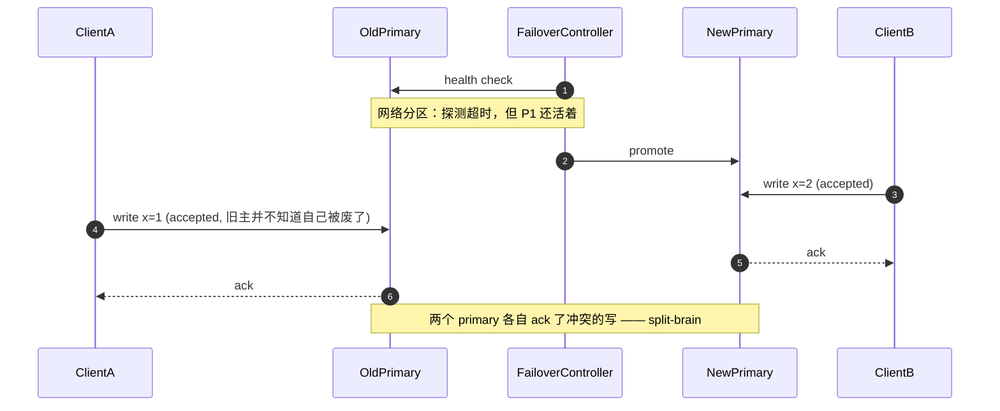

# 06 · 复制：主从、多主与无主

> 复制是唯一能同时买到可用性、读扩展和就近访问的手段。但这三样各自用不同的方式付钱，而第一张账单永远是同一句话：**有人会读到旧值。**

---

## 读这一章之前

**你在工作中遇到过这个**

你的 MySQL 是一主两从、异步复制，跑了两年没出过事。某天 21:14 主库所在宿主机内核 panic，
托管服务 28 秒后自动把一台从库提成了主库 —— 监控图上只有一个小缺口，你以为这就完了。
第二天财务对账发现 **1,900 笔订单在支付网关有记录、在你库里查不到**：主库 fsync 完成、
binlog 还没发出去的那一段里的写，跟着那台机器一起消失了。关键在于那一段有多长 ——
平时复制延迟 30 ms，而 21:14 是晚高峰，从库的 apply 已经积压到 **4 秒**；
你的订单峰值约 475 笔/秒，`475 × 4 ≈ 1,900`。**异步复制的 RPO 不是一个常数，它等于当下的复制延迟，
而复制延迟恰好在流量最高的那一刻最大。**
更糟的是这一夜里客服基于"查不到订单"给其中 300 单做了退款，你要手工对账三天 ——
**丢数据本身只是第一层伤害，第二层是所有基于"没查到"做出的决定。**

**需要先懂的概念**

| 概念 | 一句话 | 详见 |
|---|---|---|
| 副本 vs 分片 | 副本是同一份数据的多个完整拷贝（解决可用性和读扩展）；分片是把数据切开（解决容量和写扩展） | [00-concepts §5](../00-foundations/00-concepts.md) |
| 强一致 / 最终一致 / 线性一致 | 写完之后别人是不是立刻读得到；线性一致 = 表现得像只有一份数据 | [00-concepts §6](../00-foundations/00-concepts.md) |
| 复制延迟与读己之写 | 从副本落后主副本的那段时间；自己刚写完自己却读不到 | [00/01 §4](../00-foundations/01-fundamentals.md) |
| CAP / PACELC | 有分区时在一致性和可用性里选；没分区时在延迟和一致性里选 | [00/01 §3](../00-foundations/01-fundamentals.md) |
| 多数派 quorum · 围栏令牌 fencing token | N 个节点里任意 N/2+1 个，任意两个多数派必定相交；单调递增的编号，让被抢占的旧持有者的写在下游被拒 | [01/05 §1 §3](05-consensus-and-coordination.md) |
| WAL / binlog · CDC | 改数据前先顺序写下"我要改什么"的日志；订阅这份日志把每行变更变成事件 | [01/01 §2](01-storage-engines.md)、[01/03 §4](03-messaging-and-streams.md) |

**这一章要回答的问题**

1. "写成功"这三个字，到底意味着数据落在了几台机器的磁盘上？主库当场爆炸你会丢多少、丢的是哪一段？
2. 用户改完昵称、刷新页面看到旧的 —— 三种解法各自的代价是什么？哪一种在分片之后会失效？
3. 自动 failover 为什么能让一家公司丢一整天数据？为什么很多有钱有人的团队反而选手动？
4. `W + R > N` 到底保证了什么、没保证什么？它算不算强一致？
5. 特征存储和模型产物都要跨区域复制，为什么它们的方案必须是相反的？

**本章新引入的术语**

| 术语 | English | 一句话定义 |
|---|---|---|
| 半同步复制 | semi-synchronous replication | 主库等**至少一个**副本回复"这段日志我收到了/落盘了"才告诉客户端成功，其余副本仍然异步跟进 |
| 复制槽 | replication slot | 主库上为某个副本记下"它读到哪了"的标记；有槽在，那之前的日志主库就不敢删 |
| 物理复制 / 逻辑复制 | physical / logical replication | 前者搬的是存储层字节（哪个文件的哪一页变成什么），后者搬的是行级语义（哪张表的哪一行被改成什么），副本自己决定怎么落盘 |
| 级联复制 | cascading replication | 副本再带副本：B 从 A 复制，C 从 B 复制，主库只需要给 B 发一份 |
| 单调读 | monotonic reads | 同一个人连着读两次，第二次读到的绝不会比第一次更旧（时间不会倒流） |
| 一致前缀读 | consistent prefix reads | 有因果关系的几次写，读的人看到它们的顺序不会被颠倒（不会先看到回答再看到问题） |
| 多主复制 | multi-leader replication | 有两个以上的节点都能直接接受写入，它们之间互相复制 |
| 无主复制 | leaderless replication | 没有主副本，客户端（或协调节点）直接把写发给若干个副本，读也直接问若干个副本 |
| 读修复 | read repair | 读的时候发现有副本的值旧了，顺手把新值写回去 |
| 反熵 | anti-entropy | 后台进程定期两两比对副本内容（通常靠 Merkle 树只比差异段），把落下的补上 |
| 宽松多数派 | sloppy quorum | 正主副本联系不上时，把写临时交给**不该负责这个键**的其他节点，先收下再说 |
| 暗示移交 | hinted handoff | 那些临时代收的节点带着"这本来是给谁的"的备注，等正主恢复后再转交过去 |

---

## 1. 复制在解决四件不同的事，而它们要的方案不一样

**"我们做了复制"是一句没有信息量的话** —— 下面四个目的对应四种完全不同的部署形态，混着谈是设计评审里最常见的一类空转。

| 目的 | 你真正想要的 | 典型形态 | 它**不**解决什么 | 决定性指标 |
|---|---|---|---|---|
| **可用性** | 一台机器挂了服务不中断 | 同区域跨 AZ 一主两从 + 自动或半自动 failover | 数据被写错、被误删（那是备份的事） | 故障转移耗时、RPO |
| **读扩展** | 读 QPS 线性增长 | 主库 + N 个只读副本，读写分离 | 写完全没有变快，反而更慢 | 复制延迟、读己之写破坏率 |
| **就近访问** | 亚洲用户不要付 120 ms 跨洋往返 | 每个区域一份只读副本，写仍回主区域 | 写延迟（写还是要跨洋） | 各区域读延迟、写路径 RTT |
| **灾备** | 整个区域没了还能起来 | 跨区域异步复制 + 定期演练 | 逻辑错误（DROP TABLE 会被忠实复制过去） | RPO / RTO |

两个后面全篇都用的词：**RPO（recovery point objective：故障后能接受丢掉最近多长时间的数据）**、
**RTO（recovery time objective：从故障到服务恢复能接受多久）**。异步复制的 RPO 不是零，
是"当前复制延迟那么长"—— 而这个数你多半没测过。

⚠️ **复制不是备份。** 它会把 `DELETE FROM orders`、脏数据、误执行的 DDL 一字不差地送到每个副本，通常一秒内。
备份要的是"能回到过去的某个点"，所以你仍然需要 PITR（point-in-time recovery：留着基础备份 +
之后的全部日志，可以把库恢复到任意时刻，比如"回到 14:22:31 那一秒"）。

---

## 2. 同步 / 异步 / 半同步：给"丢数据窗口"和"写延迟"标上价格

这三个词的区别只有一个：**主库在时间轴的哪一点上告诉客户端"成功了"。**

```
一次写在时间轴上的六个点（同区域主从，括号里是常见量级）
  t1  主库执行、写自己的 WAL 缓冲            +0.05–0.1 ms
  t2  主库 fsync，日志落到自己的盘           +0.5–2 ms（云盘 gp3/EBS）
  t3  主库把这段日志发给副本                 +0.3–0.5 ms（同 AZ 单程）
  t4  副本收到，写进自己的 OS 缓冲（未落盘） +0.05 ms
  t5  副本 fsync 落盘                        +0.5–2 ms
  t6  副本 apply 完，这行在副本上查得到      +0 ms ～ 无上界（§3）

  异步 → 在 t2 就 ack ┊ 半同步 → 等到 t4 或 t5 ┊ 同步（remote_apply）→ 等到 t6
```

**关键在于"丢什么"**：主库在 t2 之后、t5 之前爆炸，那些**已经告诉客户端成功**的写就永久消失了 —— 唯一有它们的那块盘跟着机器一起没了。开头那 1,900 笔订单就是这么来的。

| 模式 | 主库何时 ack | 写延迟增量（同 AZ） | 丢数据窗口（RPO） | 主库可用性 | 谁在用 |
|---|---|---|---|---|---|
| **异步** | t2 | +0 ms | **等于当前复制延迟**：健康时 10–100 ms 的写，积压时可能是几分钟的写 | 副本全挂也能写 | MySQL 默认、Redis 主从、所有跨区域灾备 |
| **半同步** | t4（收到）或 t5（落盘） | **+1–4 ms**（一个 RTT + 一次远端 fsync） | ≈ 0（前提是没降级，见下） | **副本全挂时主库会卡住或降级** | MySQL `rpl_semi_sync`、Postgres `synchronous_commit=on` + `ANY 1` |
| **同步（等 apply）** | t6 | +2–10 ms，且被**最慢的那个副本**决定 | 0 | 一个副本卡住 = 全线写入卡住 | Postgres `remote_apply`；只在"必须从副本读到刚写的值"时用 |

**Postgres 的旋钮是可以逐级调的**，这是最值得记的一组可执行配置：

```sql
-- 每条 SQL 都能单独调，不必全库一个档
SET synchronous_commit = off;          -- 连本机盘都不等：进程崩不丢，机器崩会丢
SET synchronous_commit = local;        -- 只等本机 fsync           ← 异步复制
SET synchronous_commit = remote_write; -- 等副本收到并交给 OS（副本机器崩会丢）
SET synchronous_commit = on;           -- 等副本 fsync 落盘        ← 半同步常用档
SET synchronous_commit = remote_apply; -- 等副本 apply 完，副本上立刻读得到
ALTER SYSTEM SET synchronous_standby_names = 'ANY 1 (r1, r2, r3)';  -- 三个里任意一个确认即可
```

**这条旋钮真正的用法不是"全库设成哪一档"，而是按写路径分档**：支付流水 `on`，
用户改头像 `local`，埋点 `off`。**同一个库里不同的写可以有不同的 RPO** —— 这句话说得出来就是 senior。

### 半同步的降级陷阱（面试高频，生产更高频）

MySQL 的半同步有一个超时（`rpl_semi_sync_source_timeout`，**默认 10000 ms**）：
副本在这段时间内没回 ack，**主库自动退回异步**，继续接受写、继续返回成功，
只在错误日志里留一行。于是你的"零丢失"在最需要它的那一刻（副本变慢、网络抖动）恰好不在。

> 💬 **面试金句**
> "同步复制不是'不丢数据'，它是把'丢数据'换成了'写不进去'。我要选的从来不是丢不丢，而是在哪一端疼 ——
> 而半同步最危险的地方在于它两端都不疼：超时之后它悄悄变回异步，你以为自己买了保险。"
> *"Sync replication doesn't stop data loss — it trades it for write unavailability. You're picking which one you'd rather explain to your boss. And the nasty part about semi-sync is that it fails open: after the timeout it quietly falls back to async, so you think you're covered and you're not."*

还有一个开关：`rpl_semi_sync_source_wait_point = AFTER_SYNC`（默认，先等副本 ack 再本地提交）vs `AFTER_COMMIT`。
**用 AFTER_COMMIT 会出现"读得到但会消失"的数据**：本地已提交、别的会话已经读到，它却还没到副本；此刻主库挂掉，这条被人读过的数据在新主库上不存在。

---

## 3. 主从复制：复制延迟从哪来，多大算病

**复制延迟不是一个"网络快慢"问题，是一个排队问题。** 写一个微分式就清楚了：

```
d(lag)/dt = 主库产生日志的速率 − 副本能应用的速率
  正常：主库 8 MB/s，副本能吃 40 MB/s → lag 稳定在 10–100 ms（同区域）
  反过来时 lag 不是"大一点"，是线性无界增长：
    主库 40 MB/s，副本单线程 apply 只能吃 25 MB/s → 每秒欠 15 MB → 1 小时欠 54 GB
    → 就算此刻写全停，按 25 MB/s 也要追 36 分钟
```

**这就是为什么"复制延迟 3 秒"和"复制延迟 30 分钟"不是同一种故障**：前者是抖动，
后者说明你已经越过了 apply 能力的天花板，它只会继续涨。**告警要设在斜率上，不能只设在绝对值上。**

| 成因 | 为什么 | 量级 | 对策 |
|---|---|---|---|
| **单线程 apply** | 传统 MySQL 副本用一个线程重放，主库却是几十个连接并发写 | 副本吞吐 ≈ 主库的 1/5 – 1/10 | MySQL 8.0：`replica_parallel_workers=8..16` + `replica_parallel_type=LOGICAL_CLOCK` + `binlog_transaction_dependency_tracking=WRITESET` |
| **大事务** | 一条 `UPDATE` 改 500 万行，在副本上是一个不可拆的重放单元 | 单个事务能造成**分钟级**尖峰 | 批量操作切成每批 1k–5k 行、中间 sleep |
| **回填 / backfill** | 刷历史数据时写入速率是平时的 10–50 倍 | 常见的"半夜复制延迟报警"第一名 | 限速；按副本 lag 反馈调节批大小（写到 lag>1s 就退让） |
| **副本机型更弱** | "反正只读，给个小规格" | 直接决定天花板 | 副本规格 ≥ 主库，这不是省钱的地方 |
| **副本上的长查询** | 分析型大查询和 apply 抢锁/抢 IO（Postgres 还会因 `max_standby_streaming_delay` 直接取消查询或让 apply 等） | 秒级到分钟级 | 分析查询走单独一个副本，不要和在线读混用 |
| **跨区域带宽/RTT** | 单程 60–90 ms（美东↔欧西）叠加带宽上限 | 稳态 lag ≥ 1 个 RTT | 级联复制（§6）：跨洋只传一份 |

**MySQL 的 `Seconds_Behind_Source` 会骗你**：它算的是"正在重放的这条事件的时间戳"和现在的差，主库空闲时它是 0
（其实还差着一堆没传过来的日志），网络断了也可能是 0。**正确做法是心跳表**：主库每秒写一次 `now()`，
副本读它和本地时钟相减（`pt-heartbeat` 就是干这个）。Postgres 直接看 `pg_stat_replication` 的
`write_lag` / `flush_lag` / `replay_lag`，**它们分别对应上面的 t4 / t5 / t6**。

### 监控与告警：四个维度一起看

| 指标 | 怎么取 | 告警建议 | 它在回答什么 |
|---|---|---|---|
| **lag（时间）** | Postgres `replay_lag`；MySQL 用心跳表，**不要用** `Seconds_Behind_Source` | > 1 s 持续 5 min → warning；> 30 s → page | 从副本读会读到多旧的数据 |
| **lag（字节）** | `pg_wal_lsn_diff(pg_current_wal_lsn(), replay_lsn)` | > 5 GB | 还要追多久、槽会不会撑爆磁盘 |
| **lag 的斜率** | 上面两个的一阶差分 | 连续 3 个采样点单调上升 → warning | **区分抖动和"已越过 apply 天花板"** |
| **复制链路存活** | 副本数、`pg_stat_replication` 行数、槽的 `active` | 少一个就 page | lag=0 也可能是因为它根本没连上 |
| **槽保留的 WAL + 主库磁盘余量** | `pg_replication_slots.wal_status` | `extended` / `lost` 立即 page | 防"半夜磁盘写满、全站不可写"（§6） |

**① 告警线从 SLO 倒推，不是从"感觉"来**：读己之写靠"写后粘主 30 秒"，那 lag 告警就必须显著低于 30 秒 ——
超过它的那一刻正确性就破了。**② failover 前必须先看 lag**：把落后 40 秒的副本提上来 = 主动丢 40 秒的写，
自动化脚本里这应该是硬拦截（`if lag > RPO_budget: refuse`）。

---

## 4. 会话保证三件套：读己之写、单调读、一致前缀读

读写分离一上线，客服工单就来了。这三个是**同一根因（复制延迟）下的三种不同症状**，解法也不同。

### a) 读己之写（read-your-writes）

用户改完昵称，刷新页面看到旧的。它不是 bug 报告，它是复制延迟的可视化。

| 解法 | 做法 | 保证强度 | 代价 | 什么时候撞墙 |
|---|---|---|---|---|
| **写后粘主 N 秒** | 会话里记 `last_write_at`，30 秒内该用户的读全走主库 | 概率性：lag > N 就破 | 主库读流量按"写用户占比 × N 秒"上涨；改一次资料就把这个用户 30 秒的读全压给主库 | 写多的应用（社交、协作）里 N 秒窗口重叠，主库被读打爆 |
| **版本水位（LSN / GTID token）** | 写返回一个位置号（Postgres 的 LSN、MySQL 的 GTID），存进会话/cookie；读时挑一个 `replay_lsn ≥ token` 的副本，没有就走主库 | **确定性正确** | 需要路由层能拿到每个副本的位置，客户端要带 token；跨服务调用要透传 | token 要跟着请求穿过所有服务，链路一长就漏；跨分片时每个分片一个 token |
| **关键读全走主** | 按接口分类：个人中心走主，信息流走副本 | 确定性正确 | 最简单，但把读扩展的收益还回去了一部分 | 需要"读己之写"的接口清单不断变长，最后等于没做读写分离 |

**默认选择**：能改路由层就用版本水位（CQRS 的 "consistency token" 是同一个思想 —— 写返回一个水位，读带着它等投影追上，
见 [02/02 §5](../02-architecture-patterns/02-event-driven-and-cqrs.md)）；改不动就"关键读走主 + 写后粘主"混用。
**别指望靠调小复制延迟解决它 —— 那是把正确性建在一个你不控制的数字上。**

### b) 单调读（monotonic reads）

用户刷新两次，先看到 12 条评论、再看到 10 条 —— **时间倒流了**，因为两次读落到了 lag 不同的两个副本上。
**解法只有一个且很便宜：同一个用户固定映射到同一个副本**（`hash(user_id) % 副本数`；副本增减时改用一致性哈希
（consistent hashing：把副本和键都映射到一个环上，增减副本只让相邻的一小段键换归属，而不是全体重新分配）以减少抖动）。
代价是负载不再均匀，且该副本挂掉时这个用户会经历一次"时间跳变"。

### c) 一致前缀读（consistent prefix reads）

问答被读成了倒序："—— 是的，大概十秒。""…你那边延迟多少？"**单个分片里不会发生，跨分片一定会**：
两条有因果关系的写落在不同分片，各自的复制延迟不同。解法是**把有因果关系的数据放进同一个分片**
（同一会话、同一个帖子的评论共用一个分片键）；靠逻辑时钟让读端等待也行，但成本远高于选对分片键（[01/05 §5](05-consensus-and-coordination.md)）。

---

## 5. 故障转移：自动 failover 的脑裂风险，和为什么很多团队选手动

先算账。99.99% 可用性 = **每年 52 分钟**预算（[00-concepts §10](../00-foundations/00-concepts.md)）。
一次典型的自动 failover：检测（3 次健康检查失败 × 5 s）**15–30 s** + 提升新主并等它 apply 完积压 **5–20 s**
+ 改路由（DNS TTL / proxy / 客户端刷新，最被低估的一段）**5–60 s** + 连接池重建与缓存回填毛刺 **10–30 s**
= **35 秒到 2 分 20 秒**（`15+5+5+10 = 35 s` 到 `30+20+60+30 = 140 s`）。
全年预算是 `365 × 24 × 60 × 0.0001 = 52.6 分钟 = 3,156 秒`，所以**一次 failover 吃掉全年预算的 1.1%–4.4%** ——
听起来不多，但它的意思是"一年最多允许 22 次最坏情况的 failover，而且其余故障一秒都不许发生"。

### 脑裂：老主库并不知道自己已经不是主库了

自动 failover 最危险的不是慢，是**旧主还在接受写**。下面这张时序图要让你看见的是"重叠"——
第 3 步和第 4 步在真实时间上是压着的：两个客户端各自写到一个"主库"、各自拿到 ack。
ASCII 只能画出先后，画不出这种同一时刻的分叉。



> 📖 **读图要点**：第 2 步 `promote` 之后，图上**没有任何一条边通向 P1** —— 没有人告诉旧主它被废了，
> 也没有人有办法告诉它（网络正断着）。脑裂不是"选举选出了两个主"，而是**新主已产生、旧主还没收到讣告**
> 这段窗口里两边都在 ack。窗口长度 = 旧主自己发现失联所需的时间，通常等于它的租约/心跳超时（5–30 s）。

**三道防线（要一起上，任何一道单独都不够）：**

1. **租约（lease）**：主库身份有期限，到期不续自动失效 —— 旧主必须**自己**在租约过期后拒绝写，而不是等别人通知它（[01/05 §4](05-consensus-and-coordination.md)）。
2. **围栏令牌 fencing token**：每次提升 term/epoch +1，存储层只接受编号 ≥ 当前的写，旧主带旧编号来的写被**存储层**拒掉（[01/05 §3](05-consensus-and-coordination.md)）。
3. **少数派侧只读**：联系不到多数派的节点自动降级只读。代价是分区时小侧完全不可写 —— 这是对的取舍。

**真实代价（GitHub 2018-10-21 公开事故报告）**：一次 **43 秒**的网络分区触发自动 failover，
两侧数据库各自接受了写；分叉发生在 43 秒里，**修复用了 24 小时以上**，期间站点持续降级。
教训不是"别用自动 failover"，而是 **自动化能在 43 秒内做出你三个月都撤销不了的决定**。

### 为什么很多成熟团队选择"半自动"

| 模式 | RTO | 风险 | 适合 |
|---|---|---|---|
| **全自动** | 30 s – 2 min | 误判触发（GC 停顿、网络抖动、控制面自己抖）→ 脑裂或无谓切换 | 有共识层做仲裁（Raft/etcd）、有 fencing、且演练过的系统 |
| **半自动（推荐默认）** | 2–10 min | 需要人在场 | 检测到异常**自动把旧主降级为只读**，但提升新主要人点一下 —— 把"不可逆的那一步"留给人 |
| **全手动** | 10–60 min | 夜里没人 | 数据比可用性重要得多的场景（账务、清算） |

**判据一句话**：你的存储层能不能拒掉旧主的写？能，才有资格谈自动 failover；
不能，那么自动化只是在**加快制造分叉的速度**。这正是 [00/03 §2](../00-foundations/03-tradeoff-framework.md)
说的单向门 —— failover 是不可逆的那类决定，不可逆的决定不该由一个超时来做。

---

## 6. 复制拓扑与逻辑 / 物理复制

```
① 一主多从（默认）                ② 级联复制 cascading
   ┌─────────┐                       ┌─────────┐
   │ Primary │──┬──►[R1]             │ Primary │──►[R1 同区域]──┬──►[R2 同区域]
   └─────────┘  ├──►[R2]             └─────────┘                └──►[R3 跨洋]
                └──►[R3 跨洋]         跨洋链路只传 1 份而不是 N 份；
   出口带宽 = 写入量 × 3               代价：延迟叠加，R1 挂了 R2/R3 一起断流
   最贵的跨洋链路要付 N 份

③ 多主 multi-leader（环形/星型/全互联）
   [美东 Primary]◄──────►[欧西 Primary]      两边都能写；
          ▲   ╲          ╱   ▲               冲突必须在应用层解决（§7）
          │    ╲        ╱    │               全互联下 N=4 就有 6 条链路要监控
          ▼      ╲    ╱      ▼
   [亚太 Primary]◄──────►[美西 Primary]
```

**级联复制是被低估的一招**：写 20 MB/s 的主库带 6 个副本，直连拓扑下出口 `20 × 6 = 120 MB/s`；改成"主库带 2 个、那 2 个各带 2 个"后主库出口只剩 `20 × 2 = 40 MB/s`（降 3 倍），跨区域场景收益更大（贵的那条链路只走一份）。

| | 物理复制 | 逻辑复制 |
|---|---|---|
| **传的是什么** | 存储层字节：哪个文件的哪一页变成什么 | 行级语义：哪张表的哪一行被 INSERT/UPDATE/DELETE 成什么 |
| **两端要求** | 版本、页格式、往往连架构都必须一致 | **可跨大版本、跨引擎**（Postgres 15 → 17、MySQL → ClickHouse） |
| **开销** | 低，副本几乎白拿 | 高 2–5 倍：主库要解码、副本要执行 SQL |
| **能不能只复制一部分** | 不能，整库 | 能，按表、按行过滤 |
| **典型坑** | 副本上不能有自己的写；大版本升级必须停机 | **DDL 默认不复制**；无主键表的 UPDATE 会退化成全表扫描；大事务在副本上串行重放 |
| **主要用途** | 高可用副本、只读扩展 | 大版本蓝绿升级、异构下游、[CDC](03-messaging-and-streams.md)（Debezium 读的就是这一层） |

⚠️ **复制槽是最经典的"半夜磁盘写满"来源**：槽记着某个副本读到哪了，
只要这个副本掉线不回来，主库就**不敢删**那之后的 WAL —— 一个下线两天忘了删的槽能把主库磁盘撑爆，
而主库磁盘满 = 全站不可写。Postgres 13+ 一定要设 `max_slot_wal_keep_size`（例如 100 GB），
让主库在超限时**主动作废这个槽**：宁可这个副本要重建，也不能让主库死。

---

## 7. 多主复制：写冲突的三类解法

多主的唯一卖点是**本地写延迟**：亚太用户写亚太，不用跨 120 ms 的洋。
代价是一整类单主系统里根本不存在的问题 —— 两个人几乎同时改了同一行，而没有任何人有资格说谁在前。

```
   美东写 title="A" ──┐                       ┌── 亚太写 title="B"
   t=0 ms            │  复制单程 ~85 ms       │  t=20 ms
                     └───► 冲突到 t≈105 ms 才被发现 ◄───┘
   冲突窗口不是"同一毫秒"，而是"一个单程"：跨洋部署下（单程 ~85 ms），
   两个区域里相隔不到 ~85 ms 的写都可能冲突 —— 比"同时"宽了两个数量级。
```

| 解法 | 怎么做 | 保证 | 代价 / 撞墙条件 |
|---|---|---|---|
| **LWW（最后写入者胜）** | 每条写带时间戳，取时间戳大的 | 收敛，**但静默丢数据** | 依赖时钟；节点时钟差 200 ms 就能让"后写的"输。它不是冲突解决，是把丢数据伪装成冲突解决（[01/05 §5](05-consensus-and-coordination.md)） |
| **保留多版本让应用解决** | 冲突的两个值都留着（Dynamo 的 siblings），读的时候一起返回，由应用或用户合并 | 不丢数据 | 应用层必须为**每一种数据**写合并逻辑；购物车能合（并集），余额不能合 |
| **CRDT（收敛数据类型）** | 用数学上可交换的结构（计数器、集合、序列），乱序合并必然收敛 | 自动收敛、不丢数据 | 只适用于能表达成 CRDT 的数据；**表达不了跨副本不变量** —— "库存不能为负""这几个数加起来必须等于 100" 是 CRDT 做不到的 |

**还有三件在多主下直接失效的东西，比冲突本身更致命：**

- **唯一约束**：两个区域同时注册同一个用户名，各自本地检查都通过。数据库层面**无解**（除非把这个约束路由到单个主）。
- **自增主键**：必须换成 UUIDv7/ULID 或带区域前缀的 ID（[01/05 §9](05-consensus-and-coordination.md)）。
- **读己之写以外的一切因果**：环形拓扑下"先创建后更新"可能以相反顺序到达，副本上出现"更新一条不存在的行"。

> 英文里描述这件事的标准说法值得整句背下来：
> *"With multi-leader you don't get to have uniqueness constraints — the database can't enforce something it can only see half of."*

---

## 8. 什么时候不要用多主（这一节比上一节重要）

**默认答案是"不用"。** 多主的适用面比它的知名度窄一个数量级。下面每一条命中，就再退一步：

| 信号 | 为什么它否掉多主 |
|---|---|
| 你的数据有**任何**唯一性/不变量约束（用户名、库存、余额、座位） | 多主下这些约束只能靠应用层兜，且一定会漏 |
| 你无法为每一类数据写出确定的合并规则 | 那就等于选了 LWW，也就等于选了静默丢数据 |
| 你的跨区域写占比 < 5% | 用**单主 + 就近只读副本**：读就近、写回主区域。只有那 5% 的写付跨洋延迟 |
| 团队没有能力做冲突监控 | 多主的冲突是**静默的**：不报错、不写日志，只是一个值悄悄没了 |
| 你的动机是"跨区域高可用" | 这是灾备需求，用异步复制 + 明确的 RPO 和演练解决，不需要两边同时可写 |

**真正合理的只有三类**：① 离线优先的客户端（手机 App、Notion/Figma 这类本地先写后同步 —— 本质是"每设备一个主"，
数据模型专门为合并设计成 CRDT）；② 多数据中心的**分区数据**（每个区域只写自己那部分行，实为"按行分片的单主"，冲突域为空）；
③ 采集类只增不改的数据。**共同点是它们都在让冲突域为空 —— 多主的正确用法不是"解决冲突"，是"设计成没有冲突"。**

**反模式**：为了"双活"把订单库做成双主、靠 LWW 兜底。它平时完全正常，在你最需要它的那天（一次网络分区）
产生一批双方各自 ack、事后无法自动合并的订单，而你在对账时才发现 —— **第二层伤害又一次来自所有基于错误数据做出的决定**。

---

## 9. 无主复制与 Quorum：`W + R > N` 到底给了你什么

无主（Dynamo 系：Cassandra、ScyllaDB、Riak）没有主副本。客户端把写并发发给 N 个副本，
等 **W** 个成功就返回；读并发问 N 个，等 **R** 个回来，用版本号挑最新的。

```
N = 3, W = 2, R = 2 —— 为什么必然读到最新值
  副本:         [A]      [B]      [C]
  写 v2 成功在:  ✓        ✓        ✗ (超时/挂了)   ← W=2 达成，客户端收到"成功"
  读时问的是:    ✓        ✗        ✓              ← R=2 达成
                 └──────── A 同时在两个集合里 ──────┘
  W + R = 4 > N = 3 ⇒ 两集合至少共享 1 个成员（鸽笼原理）⇒ 读到的那批里必有一份带 v2
  而 W=1,R=1（W+R=2 ≤ 3）：写只落 A、读只问 C —— 完全可能读到 v1，没有任何保证
```

| 配置 | 语义 | 延迟 | 用在哪 |
|---|---|---|---|
| `W=N, R=1` | 读极快，写要全票 | 写被最慢副本决定；挂一台就写不了 | 读多写极少（配置、字典） |
| `W=2, R=2 (N=3)` | 默认，读写都容忍挂一台 | 各 +1 个 RTT | 绝大多数场景 |
| `W=1, R=1` | 最快，最终一致 | 最低 | 指标、日志、可丢的计数 |
| `LOCAL_QUORUM`（跨区域） | 只在本区域内凑多数派 | 本地 1–3 ms，不付跨洋 | 多区域 Cassandra 的**唯一正确默认**；代价是跨区域最终一致 |

### 它**不**给你的东西（这才是考点）

`W + R > N` 只保证"读集合与写集合相交"，**不是线性一致**：

- **并发写没有仲裁**：两个客户端同时写同一个键，各自都拿到 W 个 ack，两个值都在系统里。
  之后靠 LWW（丢一个）或版本向量（version vector：给每个副本各记一个计数器，用它判断两次写是"一个在另一个之后"
  还是"真并发"）把两个值都留成 siblings —— **quorum 不解决冲突，它只保证你能读到"某个"最新写**。
- **部分失败不会回滚**：W=2 时只成功了 1 个，客户端收到失败，但**那 1 个副本上的值不会被撤销**。
  后续的读可能读到这个"失败的写"。这是 Dynamo 系最反直觉的一条。
- **读期间的写没有顺序保证**：读修复本身不是原子的，两个并发读可能一个看到新值一个看到旧值。
- **sloppy quorum 让上面的推导直接失效**（见下）。

想要线性一致，只能上共识（[01/05 §2](05-consensus-and-coordination.md)），多付一个 RTT 和一整套 leader 选举的运维负担。

### 收敛靠两条腿：读修复 + 反熵

- **读修复（read repair）**：读的时候发现某个副本旧了顺手写回。免费，但**只修被读到的键**，冷数据永远修不到。
  （Cassandra 4.0 移除了老的 `read_repair_chance` 概率式读修复，改为依赖仲裁读路径上的修复 + 显式 repair。）
- **反熵（anti-entropy）**：后台用 Merkle 树（把键空间按范围逐层哈希成一棵树，两副本自顶向下比对，
  只传不一样的那几段）两两补齐，是**唯一能修复冷数据的机制**，必须定期跑（`nodetool repair`），
  且必须跑在 `gc_grace_seconds`（默认 10 天）之内 —— 否则删掉的数据会**复活**：无主系统里的删除是写一个
  "墓碑（tombstone：一条'此键已删'的标记记录，它必须活得比数据久，否则没收到删除的那个副本会把旧值当新数据同步回来）"。

### sloppy quorum 与 hinted handoff：拿持久性换可用性

分区时负责这个键的 3 个节点有 2 个联系不上。**严格 quorum** = 直接失败（CP）；
**sloppy quorum** = 把写临时塞给其他任意 2 个活着的节点（AP），它们带着"这本来是给 node-7 的"备注收下，
等 node-7 回来再转交 —— 这就是 **hinted handoff**。

**代价**：sloppy quorum 期间 **`W + R > N` 的重叠保证不成立**（写落在临时节点，读仍去问正主，读不到）。
它买的是"写不会失败"，卖的是"读到最新值"。Cassandra 的暗示只保留 `max_hint_window`（默认 3 小时），超时即丢，此后只剩反熵能救。

---

## 10. ML 场景的复制：特征存储与模型产物是两个相反的问题

ML 系统里有两样东西要跨区域复制，它们的一致性要求**几乎完全相反** —— 把同一套方案套上去是这一节唯一要防的错误。

| | **在线特征存储（online feature store）** | **模型产物（model artifact）** |
|---|---|---|
| 对象 | 每个实体几百字节到几 KB，数亿键 | 单个 1–20 GB（8B 级 LLM 容器镜像约 **20.2 GB**）；数量少 |
| 写频率 | 持续，秒级新鲜度要求 | 每天到每周几次 |
| 读延迟预算 | **p99 一两毫秒级**：Redis p50 600–700 µs / p99 2.5–3.0 ms；DynamoDB p50 3–4 ms / p99 20–25 ms | 只在冷启动时读一次 |
| 一致性要求 | **跨区域最终一致可接受，但同一次打分内必须自洽** | 内容不可变；**要求的是"原子切换"而不是"低延迟"** |
| 复制机制 | 区域内多副本 + 跨区域异步；写路径由物化作业各区域独立执行更好 | 内容寻址 + 对象存储 + 节点本地预热/P2P 分发 |
| 典型故障 | 训练/服务偏斜（training-serving skew：同一个特征在训练时和线上服务时算出来的值不一样）、同一用户在两个区域打出不同分 | 冷启动几分钟、半个系统被回滚 |

**特征存储这边，复制延迟直接变成模型质量问题**（而不只是"用户看到旧值"）：

- 跨区域异步复制 + 就近读 = **同一个用户在两个区域拿到不同版本的特征**，同一个模型打出不同的分，
  而这会**污染 A/B 实验**：区域一旦和实验分组相关，你测出来的差异里有一部分是复制延迟。
  二选一：**每个区域各自从流里独立物化**（物化 materialization：把算好的特征值提前写进在线存储，
  服务时直接取而不是现算 —— 这里指写不跨区复制、各区域各算一份，值可能有微小差异但各自自洽），
  或者**把 region 作为实验的分层维度显式控制**。
- 两个硬上限决定了容量方案：DynamoDB 单 entity key **3000 QPS** 封顶（热门商品必然撞上，
  读路径要加本地缓存或对热键打散，[01/02 §4](02-caching.md)）；Databricks 托管在线特征存储
  **最多 3 个只读副本**（含主实例共 4 个计算实例）—— "加副本扛读"这条路很快到头。
  （[Databricks 文档](https://docs.databricks.com/aws/en/machine-learning/feature-store/online-feature-store)、
  [Tecton 文档](https://docs.tecton.ai/docs/monitoring/online-serving)，2025–2026 口径，随版本变动。）

**模型产物这边，问题是带宽和冷启动，不是一致性**：

- 从容器 registry 拉 20 GB 推理镜像量级是 **5–6 分钟**（再加 3–4 分钟解压），同样的数据放对象存储按需流式读是 **~10 秒**量级
  （[BentoML, 2025-05](https://www.bentoml.com/blog/25x-faster-cold-starts-for-llms-on-kubernetes)）；并发读权重（Run:ai Model Streamer）
  把 15 GB 权重从 S3 灌进显存约 **4.9 秒**，也就是 `15 ÷ 4.9 ≈ 3.1 GB/s`（≈2.9 GiB/s）
  （[NVIDIA, 2025-09](https://developer.nvidia.com/blog/reducing-cold-start-latency-for-llm-inference-with-nvidia-runai-model-streamer)）。
  **结论：模型分发不要走复制协议，走"内容寻址 + 就近对象存储 + 预热"** —— 产物不可变，没有冲突，也就不需要一致性机制。
- 但它有**唯一一处强一致要求**：模型权重、特征 schema、预处理代码必须作为**一个不可分割的版本**一起切、一起回滚。
  只回滚模型不回滚特征，模型会遇到训练时不存在的"未来"特征、静默劣化 —— 这个失效模式叫特征时间旅行
  （[arXiv:2604.08181](https://arxiv.org/pdf/2604.08181)，2026）。实现就一句话：**版本号是元组
  `(model_id, feature_view_version, preprocess_sha)`，路由按元组切，不按单个字段切。**
- 换在线存储（Redis → DynamoDB、换供应商）时**必须先双读比对再切流**：新旧两套同时读、逐样本比对结果与序列，
  达标了再切（Pinterest 的公开做法）—— 这是唯一能发现"两边其实不一样"的手段。

推理服务本身的副本是另一件事：那里的路由要考虑会话粘性（同一会话得回到同一台机器，因为它显存里存着这个会话的中间结果，
换一台就要重算），完整讨论在 [04/01 §6](../04-ai-agent-systems/01-llm-serving-infra.md)。

---

## 这一章的三句话

1. **"写成功"不是布尔值，是一个你选出来的时间点。** 异步在自己 fsync 后就 ack、半同步等一个副本、同步等副本 apply ——
   你买的不是"丢不丢数据"，是"在哪一端疼"；而半同步默认在超时后**静默退回异步**，没演练过的零丢失配置等于没有。
2. **多主的正确用法不是解决冲突，是把冲突域设计成空集。** 数据一旦有唯一约束或跨行不变量，多主就出局 ——
   数据库无法强制执行一个它只能看到一半的约束。绝大多数"双活"需求的正确答案是单主 + 就近只读副本 + 写明的 RPO。
3. **`W + R > N` 给的是"读集合与写集合相交"，不是线性一致。** 它不仲裁并发写、不回滚部分失败的写，
   sloppy quorum 下连相交都不保证。要线性一致就得上共识、多付一个 RTT —— 把 quorum 当强一致用是这类系统最贵的误解。

---

## 面试官会追问

1. 异步、半同步、同步复制各自的丢数据窗口是多少？半同步的超时行为是什么，为什么它危险？
2. 复制延迟从哪来？为什么它可能**无界增长**而不是稳定在某个值？你怎么监控这一点？
3. 用户改完资料刷新看到旧值，给我三种解法和各自的代价。单调读和一致前缀读又分别在防什么？
4. 自动 failover 的脑裂窗口是怎么产生的？三道防线是什么？为什么很多团队选半自动？
5. 推导一下 `W + R > N`。它给你线性一致吗？sloppy quorum 之后这个保证还在吗？
6. 多主复制的三类冲突解法各自的代价？什么情况下你会明确拒绝多主？
7. 逻辑复制和物理复制怎么选？复制槽为什么能把主库磁盘写满？
8. 特征存储的跨区域复制和模型产物的分发，为什么方案必须相反？

---

**下一章** → [`02-architecture-patterns/01-microservices-vs-modular-monolith.md`](../02-architecture-patterns/01-microservices-vs-modular-monolith.md)：构件讲完了，接下来是把它们组装成系统时的边界问题。
