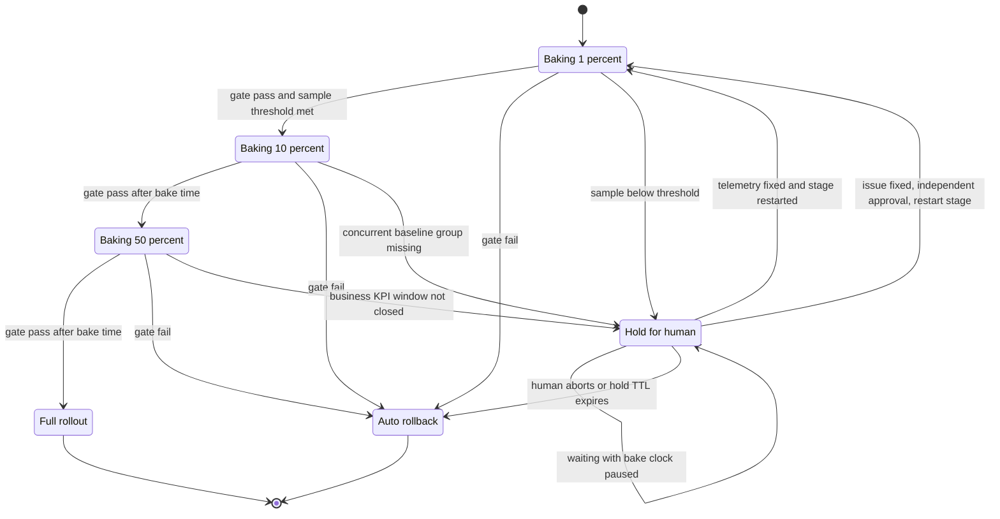

# 05 · 发布工程（release engineering）

> 发布工程的默认约束可以压缩成一句话：**滚动发布和回滚窗口内，新旧两个版本会同时存在，数据库与消息契约必须对两者都合法。**
> 如果业务明确选择停机切换，也要把停机、恢复和前滚方案写成另一份契约；不能一边滚动发布，一边假设只有新版本在线。
>
> **阅读分层与时间边界**：§1–§6 是所有全栈工程师都应掌握的 Core；§7 是 AI 系统扩展。阈值、时长、DORA 档位及供应商模型/缓存/价格是示例或 **2026-08 快照**，用于展示决策方法，不是可直接照抄的承诺。

---

## 读这一章之前

**你在工作中遇到过这个**

你把"给 orders 表加一个 NOT NULL 列"和用到这个列的业务代码放进了同一次发布。
滚动重启到第 3 台时告警炸了：还没重启的那 7 台老实例根本不知道有这个列，它们插入的每一行都违反约束，5xx 一路涨到 40%。
你按下回滚，代码退回去了 —— 但那条已经执行完的 `ALTER TABLE` 退不回去。
更糟的是它当初等锁的那 40 秒里，把排在它后面的所有 `SELECT` 一起堵死了，监控上看就像数据库整个挂了，你在那 40 秒里根本没往 DDL 上想过。

**需要先懂的概念**

| 概念 | 一句话 | 详见 |
|---|---|---|
| 无状态服务与滚动重启 | 杀掉任意一台不会永久丢东西的服务，才敢一台一台重启；这决定了发布期间新旧版本必然并存 | [00-concepts §9](../00-foundations/00-concepts.md#9-有状态-vs-无状态) |
| p50 / p99 与分位数 | 排序后处在某个百分比位置的耗时；平均值会掩盖发布带来的尾部恶化 | [00-concepts §3](../00-foundations/00-concepts.md#3-为什么平均值是骗人的p50--p90--p99) |
| SLI / SLO / 燃尽率 | 衡量用户体验的那个比值 / 对它的承诺 / 错误预算被消耗掉的速度 | [05/01](../05-reliability/01-slo-and-error-budget.md) |
| 幂等 | 同一操作做多次和做一次效果相同 —— 回填脚本必须满足它才能随时中断重跑 | [00-concepts §12](../00-foundations/00-concepts.md#12-本章术语速查) |
| 副本与复制延迟 | 同一份数据的多个拷贝；主库的写落到只读副本上需要时间，回填限速限的就是它 | [00-concepts §5、§6](../00-foundations/00-concepts.md#5-副本分片分区--三个被混用的词) |
| 爆炸半径 / cell | 一次故障最多能波及多少租户；cell 把故障限制在一个部署单元，但真实影响要按该 cell 的流量/收入/关键租户权重计算 | [03/01 §4](01-control-plane.md#4-cell-架构cell-based-architecture) |

**这一章要回答的问题**

1. 为什么"加一列"和"加约束"必须拆成两次独立发布？合并了具体会发生什么？
2. 一条号称"瞬时"的 `ALTER TABLE`，为什么能造成 30 秒的全站不可用？
3. 金丝雀跑了 5 分钟全绿就全量，两小时后爆了 —— 门禁里少了哪几条？
4. AI 系统的一次"发布"到底在发布什么？为什么只回滚代码通常不够，还会更贵？

**本章新引入的术语**

| 术语 | English | 一句话定义 |
|---|---|---|
| 部署 / 发布 | deploy / release | 新代码进到生产环境 / 用户开始看到新行为 —— 这是两件事，可以也应该分开 |
| Feature flag | feature flag / toggle | 一个运行时可改的开关，决定同一份代码走新路径还是老路径 |
| Kill switch | kill switch | 专门用来"立刻关掉某个功能"的开关，只在事故里用，因此它的通路不能依赖被关的那个系统 |
| 分桶 | bucketing | 用哈希把用户稳定地分进实验组或放量组，同一个用户每次都落到同一组 |
| 金丝雀 | canary | 先把一小部分真实流量导到新版本上，看指标再决定继续放量还是回滚 |
| 蓝绿 | blue-green | 另起一套完整环境跑新版本，验证后把流量整体切过去 |
| 影子流量 | shadow traffic | 把生产流量复制一份发给新版本，结果丢掉、不返回给用户 |
| bake time | bake time | 在某个放量档位上必须停留观察的时长，到点了才允许进下一档 |
| 扩展—迁移—收缩 | expand–migrate–contract | schema 变更的三段式：先只加不改、再搬数据、最后才删旧结构 |
| 双写 / 回填 | dual write / backfill | 同一份数据同时写进新旧两处 / 把历史数据按新格式补写一遍 |
| 锁队列 | lock queue | 等同一把锁的请求排成的先来先服务队列；排在前面那个等待者会把后面所有人一起堵住 |
| 契约测试 | contract testing | 调用方把"我依赖你的哪些字段"写成测试放进提供方的 CI，让破坏性改动在合并前就被拦下 |

---

## 1. 部署 ≠ 发布

```
构建 (build)  →  部署 (deploy)  →  发布 (release)  →  下线旧版 (retire)
   代码变成      新代码进生产      用户开始看到       老代码删除
   制品          （但被 flag 关着）  新行为
```

**解耦（decoupling）这两件事是现代发布工程的地基。** 部署由工程按 CI 节奏做，发布由产品/运营按业务节奏做。它们解耦之后：

- 回滚不再需要重新部署（翻 flag，秒级）
- 高风险变更可以先在生产环境静默运行数天再打开
- 发布窗口不再需要"全公司周四晚上"

**度量**（DORA 四指标 —— DevOps Research and Assessment 的行业研究指标；下表档位是历史/示意口径，采用时应注明报告年份）：

| 指标 | 精英档 | 低效档 | 说明 |
|---|---|---|---|
| 部署频率（deployment frequency） | 按需，每天多次 | 每月~每半年 | |
| 变更前置时间（lead time for changes） | < 1 天 | > 1 个月 | commit → 生产 |
| **变更失败率（change failure rate）** | 5–15% | 40–60% | **最重要的一个**，它决定你敢不敢加速 |
| 恢复时间（time to restore / MTTR） | < 1 小时 | > 1 周 | 自动回滚能把它压到分钟级 |

> 例如，当变更失败率持续高于团队阈值（可先用 30% 作为诊断线）时，优先降低单次变更规模、补金丝雀门禁和 schema 纪律，再讨论提高频率；不要把示例阈值当行业定律。

---

## 2. Feature Flag：分类、债务、一致性

### 2.1 四类 flag，生命周期完全不同

| 类型 | 目的 | 生命周期 | 求值频率 | 谁改 | 删除纪律 |
|---|---|---|---|---|---|
| **Release toggle** | 隐藏未完成功能 / 渐进放量（progressive rollout） | **天~周** | 部署或会话级 | 工程 | **发布完成后 2 个迭代内必须删** |
| **Experiment toggle** | A/B 实验 | 天~周 | 每请求（按用户稳定分桶 bucketing） | 数据/产品 | 实验结束即删 |
| **Ops toggle / kill switch** | 降级（degradation）、熔断（circuit breaking）、关掉重功能 | **月~永久** | 运行时立即生效 | 值班工程师 | 长期保留，但要定期演练 |
| **Permission toggle / entitlement** | 按套餐/租户开功能 | **永久** | 每请求 | 产品/销售 | 不是 flag，是**授权模型的一部分** |

**最重要的一条**：把 entitlement（谁买了什么）从 flag 系统里搬出去，放进授权/计费模型。否则你的 flag 系统会变成一个没有 schema、没有审计、没有一致性保证的第二套授权系统。

### 2.2 Flag 债务是真实的成本

```
n 个可独立开关的 flag  ⇒  2^n 条代码路径  ⇒  你实际测过的：2 条
```

**强制纪律**（用 CI 检查，不是靠自觉）：

1. 创建 flag 必须填 `owner` + `expires_at` + `type`。
2. 过期的 release toggle 自动开工单，超期两周后 CI **阻断合并**。
3. 仓库内 release toggle 总数设上限（比如 20），超了就得先还债。
4. 死代码（dead code）检测：flag 已 100% 打开且稳定 30 天 → 自动生成"删除分支"的 PR。

### 2.3 求值（evaluation）的一致性与性能

**分桶必须稳定且去相关（decorrelated）**：

```python
def is_enabled(flag_key, entity_id, rollout_bps):        # bps = 万分比
    h = xxhash64(f"{flag_key}:{entity_id}")              # ⚠️ flag_key 必须参与哈希
    return (h % 10_000) < rollout_bps
```

⚠️ **不把 `flag_key` 放进哈希是高频 bug**：那样所有 flag 的"前 10%"是同一批用户，实验之间产生相关性，且这批倒霉用户会同时踩到所有新功能。

**一次请求内必须求值一次**：在入口（网关/BFF）求值，把结果放进请求上下文往下传。让每个下游服务各自求值，会因为规则集推送延迟（propagation delay，通常 1–30 秒）导致**同一请求内前后不一致** —— 服务 A 认为开了、服务 B 认为关了，产生的数据状态是任何一个版本的代码都没预期过的。

**性能与故障模式**：
- SDK 必须**本地求值（local evaluation）**：规则集推送到进程内，求值 < 1 µs。**绝不在请求路径上做网络调用**。
- flag 服务不可用时：SDK 用最后一次缓存的规则集；再不行用**硬编码的代码内默认值**。
- **默认值必须等于"当前生产行为"**，不是"新行为"。这条规则让 flag 服务的故障变成 no-op 而不是一次意外发布。

### 2.4 Kill switch 的三个硬要求

1. **通路独立**：不能依赖正在故障的那个系统（典型翻车：kill switch 的配置存在你正要关掉的服务背后的数据库里）。
2. **生效时间有可测目标**：例如高风险功能要求 p99 < 30 秒，使用推送（SSE/长轮询 long polling）而非长周期轮询；具体目标来自事故容忍度。
3. **定期演练（game day）**：例如每季度执行一次，并记录端到端生效分布；周期按风险调整。

---

## 3. 渐进式交付（progressive delivery）

| 手段 | 回滚速度 | 资源成本 | 能测出什么 | **测不出什么** |
|---|---|---|---|---|
| **金丝雀（canary）** | 秒~分钟 | +5% | 真实流量下的错误率、延迟、资源 | 低频路径、长尾（long-tail）租户、需要数小时才显现的泄漏 |
| **蓝绿（blue-green）** | 秒（切流） | **2×** | 全量切换的兼容性 | 渐进信号（要么全好要么全坏） |
| **影子流量（shadow traffic）** | N/A（不影响用户） | +1× 计算 | 性能、响应差异 | **写路径**（有副作用，除非做完整的副作用隔离） |
| **Ring / 按租户放量** | 分钟~天 | 低 | 租户维度的爆炸半径（blast radius）、企业客户的定制路径 | 需要租户路由能力 |
| **按 cell 部署** | 分钟 | 低 | 单元级隔离；名义租户占比约为 1/K，真实影响取决于 cell 权重 | 需要 cell 架构与均衡策略（见 [01-control-plane.md](01-control-plane.md)） |

**默认组合**：金丝雀（自动门禁）→ ring 放量（内部 → 小租户 → 大租户）→ 全量。蓝绿只在"必须原子切换"（比如换了存储引擎）时用，因为它的 2× 资源成本和"没有中间信号"是真实缺点。

### 3.1 金丝雀的自动回滚判据清单

**四个前置条件**（不满足时进入 Hold/人工判断，不凭少量样本自动放量）：

- [ ] 变更是**无状态可回滚**的：schema 处于 expand 之后、contract 之前
- [ ] 有**并发运行的基线组（concurrent baseline group）**（同时段的老版本流量），**不是**"和昨天同一时刻比"
- [ ] 在发布前按基线率、最小关注效应（MDE）、期望检验功效和误报预算计算样本量；“1,000 请求 + 5 分钟”只能作为某个高流量服务的示例，不能保证看得见低错误率或 p99 退化
- [ ] 回滚动作本身经过演练，且回滚后**自动冻结流水线（freeze the pipeline）**（否则下一个人会把同样的变更再推一遍）

**门禁信号**（任一触发即回滚）：

| # | 信号 | 阈值示例 | 判定窗口 | 说明 |
|---|---|---|---|---|
| 1 | HTTP 5xx / gRPC 非 OK 率 | 例：差值超过业务阈值，且 canary 相对 baseline 的区间估计排除“无退化” | 短窗 + 长窗 | 同时看事件数与置信/可信区间，避免 1 次错误造成无限倍数 |
| 2 | 关键路径延迟 | 例：p99 或直方图尾部超过 SLO；canary 与 baseline 的 bootstrap/分桶区间显著分离 | 短窗 + 长窗 | p99 至少需要足够的独立样本；低流量时同时看超阈值请求比例 |
| 3 | **新错误指纹（error fingerprint）** | 新的高严重度错误达到最小事件数，或单次即属安全/数据破坏类 | 近实时 | 不是所有新堆栈都应“一次即回滚” |
| 4 | 下游依赖错误率 | 例：相对基线上升且超过绝对影响阈值 | 短窗 + 长窗 | 抓“新版本把下游打挂了” |
| 5 | 饱和度（saturation） | 接近已验证容量拐点，或增长斜率持续异常 | 多个窗口 | CPU/内存是诊断/保护信号，不替代用户 SLI |
| 6 | **业务 KPI** | 超出预先定义的护栏及统计区间 | 覆盖业务反馈周期 | 抓“技术指标全绿但功能坏了” |
| 7 | SLO 燃尽率（burn rate） | 使用成对多窗口规则（如短窗确认 + 长窗消噪），阈值按 SLO 窗口计算 | 多窗口 | 不能只凭一个 1 小时点“立即”判断；见 [05-reliability/01](../05-reliability/01-slo-and-error-budget.md) |

**分阶段与 bake time 示例**：`1% → 5% → 25% → 50% → 100%`。每档停留到“样本门槛 + 最短观察时间 + 业务周期覆盖”同时满足，而不是固定写死 10/30/60/120 分钟。低频路径（月结、导出、Webhook 重试）在 1% 阶段可能一次都没执行；应配合合成探针、定向 ring 和完整业务周期，不能靠延长几分钟解决。

反复在每个时间点做普通显著性检验会累积误报。流水线应采用预先定义的顺序检验/alpha spending、贝叶斯停止规则或保守的多重比较校正，并把规则版本写入发布记录。统计“显著”也不等于业务“重要”，所以 MDE/护栏必须先写。

**三个反模式**：
- **用 CPU/内存做主门禁**：滞后且与用户体验不相关。门禁必须是 SLI。
- **用"昨天同期"做基线**：周期性、外部事件、其他团队的发布全都会污染它。**必须是并发基线组。**
- **回滚后不冻结**：事故会在 40 分钟后原样重演。

上面的清单和阶梯是**判据**，下面这张状态机是**可达性**——把 1%/5%/25%/50%/100% 的阶梯收敛成三档后，一次金丝雀真正能走到的终局只有两个，而中间那个 `Hold` 才是线上最常出现、也最少被写进 runbook 的态。



> 📖 **读图要点**：`RB` 没有直接回到 `B1/B10/B50` 的边——回滚后冻结流水线，修复后重新发起一次可审计流程。`Hold` 也不能绕过门禁直达全量；补齐 telemetry 或修复问题后，只能在独立审批下从当前最低安全档重新开始。Hold 必须配告警和 TTL，超时默认动作通常是回滚；若某业务选择其他动作，要在风险评审里显式记录。

---

## 4. 数据库 Schema 迁移六步法（expand–migrate–contract）

**这是发布工程里最容易出人命的一节。** 根本原因：滚动发布（rolling deploy）期间新旧代码同时在跑，数据库必须同时对两者合法。

### 4.1 六步表

| 步 | 名称 | 操作 | 读 / 写状态 | 可回滚性 | 危险信号 | 典型时长 |
|---|---|---|---|---|---|---|
| **1** | **Expand** | 加**可空**列 / 新表 / 新索引；**不加约束、不加默认值（除非是常量）** | 老代码完全不知道新结构 | ✅ 完全可回滚 | DDL 卡在锁队列 | 分钟 |
| **2** | **Dual write** | 新代码同时写新旧两处 | **写双，读老** | ✅ 关 flag 即回滚 | 双写不一致率 > 0 | 1 次发布 |
| **3** | **Backfill** | 分批回填历史数据（**幂等 + 可重跑 + 限速 throttling**） | 写双，读老 | ✅ 新列是纯冗余 | 复制延迟（replication lag：主库上的写传播到只读副本所需的时间，见 [00-concepts §6](../00-foundations/00-concepts.md#6-什么是一致性--一个词两种完全不同的意思)）上升、锁等待、批次超时 | 小时~天 |
| **4** | **Verify** | 影子读（shadow read：读的时候同时读新旧两处，只把老的返回给用户，新的仅用于比对）+ 逐行 diff（抽样或全量） | 写双，读老，**旁路比对新** | ✅ 完全可回滚 | diff 率不收敛到 0 | 1~7 天 |
| **5** | **Switch read** | flag 控制读新 | 写双，**读新** | ✅ **秒级回滚**（翻 flag） | 切读后错误率/空值率 | 1~7 天 bake |
| **6** | **Contract** | 停写老、加约束、删列/删表 | 只用新 | ❌ **不可逆** | —— | 在第 5 步之后再等 ≥1 个完整回滚窗口 |

**四条纪律**：
1. **每一步是一个独立、可观察的状态转换**；即使流水线把多个动作自动串起来，也必须能在任一步暂停并验证，不能把破坏性 contract 与首次使用新字段绑在同一回滚单元。
2. **第 6 步只在兼容窗口证据满足后进行**：所有老实例/离线作业/消费者已下线，回滚窗口已结束，历史消息与备份恢复路径已验证。1–2 周只是示例，不是充分条件。
3. **Backfill 必须幂等**：用 `WHERE new_col IS NULL LIMIT 1000` 分批，记录进度，随时可中断可重跑。**限速**到复制延迟 < 1 秒。
4. **删列前先停止所有读写并观察依赖 telemetry**。改名本身也是需要 `ACCESS EXCLUSIVE` 锁的破坏性 DDL，只能在确认无旧调用方后、带 `lock_timeout` 执行；“跑一周没人报错”不是唯一证据。

### 4.2 在线 DDL（online DDL）实操（Postgres）

```sql
-- 教学示例：在专用迁移会话中执行；秒数/分钟数按表规模和风险校准。
-- 不要放进一个包住所有语句的事务；CREATE INDEX CONCURRENTLY 不能在事务块内运行。
SET lock_timeout = '2s';
SET statement_timeout = '30s';  -- catalog DDL 也要有有限上界；超时后调查，不要无限等

-- ① 加列
ALTER TABLE orders ADD COLUMN region text;                        -- 瞬时（只改 catalog）
ALTER TABLE orders ADD COLUMN tier text DEFAULT 'free';           -- PG11+ 瞬时
ALTER TABLE orders ADD COLUMN uid uuid DEFAULT gen_random_uuid(); -- ❌ volatile 默认值 → 全表重写

-- ② 加索引：大表通常用 CONCURRENTLY；它仍消耗 I/O/CPU、会等旧快照，并非“零影响”
SET statement_timeout = '2h';   -- 示例：按实测规模给有限上界并监控；不要设为 0
CREATE INDEX CONCURRENTLY idx_orders_region ON orders (region);
-- 失败可能残留 INVALID 索引。先确认精确对象，再在独立会话中：
-- SELECT i.indexrelid::regclass
-- FROM pg_index i WHERE NOT i.indisvalid AND i.indexrelid = 'idx_orders_region'::regclass;
-- DROP INDEX CONCURRENTLY idx_orders_region;  -- 仅在上一步确认后执行，再重试创建

-- ③ 加 NOT NULL：直接 SET NOT NULL 会全表扫描并持 ACCESS EXCLUSIVE
ALTER TABLE orders ADD CONSTRAINT orders_region_nn
      CHECK (region IS NOT NULL) NOT VALID;                       -- 瞬时，只对新写入生效
ALTER TABLE orders VALIDATE CONSTRAINT orders_region_nn;          -- 只取 SHARE UPDATE EXCLUSIVE
SET statement_timeout = '30s';
ALTER TABLE orders ALTER COLUMN region SET NOT NULL;              -- 可复用已验证 CHECK 避免验证扫描；仍需短暂 ACCESS EXCLUSIVE

-- ④ 加外键：同样 NOT VALID → VALIDATE
ALTER TABLE orders ADD CONSTRAINT fk_tenant
      FOREIGN KEY (tenant_id) REFERENCES tenants(id) NOT VALID;
ALTER TABLE orders VALIDATE CONSTRAINT fk_tenant;

-- ⑤ 改类型：ALTER COLUMN TYPE 重写整表 + 持 ACCESS EXCLUSIVE 全程
--    ⇒ 大表上等同于一次计划外停机。正确做法就是走六步法（新列 → 双写 → 回填 → 切读 → 删老列）
```

> **Staff 级的那个细节：锁队列（lock queue）。**
> `ALTER TABLE` 需要 ACCESS EXCLUSIVE 锁。它在**等锁**的时候，所有后到的查询（包括 `SELECT`）都会排在它后面 —— Postgres 的锁队列是 FIFO。所以一个"瞬时"的 DDL 撞上一个跑了 30 秒的分析查询，会造成 **30 秒的全表不可用**，且监控上看起来像"数据库突然挂了"。
> 有限 `lock_timeout`、有限 `statement_timeout`、监控锁等待/复制延迟、在低风险窗口中有限次重试，是一组常见保护。不要无上限自动重试：连续失败意味着应调查长事务、旧快照或容量，而不是不断敲锁队列。

**MySQL 侧**：先在目标版本、表结构和复制拓扑上确认 `ALGORITHM=INSTANT/INPLACE` 的实际支持与锁行为；否则评估原生 online DDL、[gh-ost](https://github.com/github/gh-ost) 或 `pt-online-schema-change`。工具选择取决于 binlog、触发器、外键、复制和运维能力，不能一律“选 gh-ost”；都要先在等比例副本演练并设置暂停/中止阈值。

### 4.3 回滚策略的分层现实

| 回滚对象 | 可行性 | 手段 | 时间 |
|---|---|---|---|
| **代码** | 仅在旧代码仍能解释当前 schema/数据/消息时可行 | 镜像回退 / flag | 秒~分钟 |
| **Schema（expand 阶段）** | 逻辑上通常可忽略 | 先让旧代码忽略新结构；清理列/索引可延后，不要为“回滚干净”冒险做 DDL | 分钟~后续窗口 |
| **Schema（contract 之后）** | ❌ 不可行 | 只能**前滚（roll forward）** | —— |
| **数据（已被新代码写坏）** | 通常不能靠代码回退自动恢复 | 优先用幂等修复/补偿和受影响集合；PITR 会连带回滚其他租户/写入，通常只用于独立恢复环境后提取数据或灾难恢复 | 小时~天 |

⇒ **所有的发布纪律本质上都是在保护"代码回滚"这一条永远可用。** 一旦某次发布让数据进入了老代码无法解释的状态，你就失去了回滚能力。

---

## 5. 多版本共存与向后兼容（backward compatibility）契约

滚动发布 = 新旧版本同时在线。所以**每次发布必须与上一版兼容（N-1 兼容）**。

| 变更 | 兼容性 | 说明 |
|---|---|---|
| 加可选字段 | ✅ 兼容 | 前提：读方是 Tolerant Reader（忽略未知字段） |
| 加必填字段 | ❌ breaking | 老写方不会填 |
| 删字段 | ❌ breaking | 先标 deprecated，观察调用方，再删 |
| 改字段类型 | ❌ breaking | 走新字段 + 六步法 |
| **改字段语义（semantic change）**（单位从"分"变"元"） | ☠️ **最危险** | 编译期、schema 校验、契约测试**全都发现不了**。改语义必须改名字。 |
| 收紧校验（原来接受空串，现在拒绝） | ❌ breaking | 属于行为变更，要走 flag |
| 放宽校验 | ✅ 兼容 | |

**三条落地手段**：
- **Protobuf**：删字段必须 `reserved` 字段号和名字，**永不复用 tag**。
- **事件 schema**：事件是不可变的，历史事件永远是老 schema ⇒ 消费者必须能处理所有历史版本。用 schema registry（集中登记所有事件 schema 及其版本的服务，新版本注册时先在这里过一遍兼容性检查）强制 `BACKWARD` 兼容性检查（新 schema 能读旧数据）。
- **契约测试（contract testing）**：消费者驱动的契约（consumer-driven contract，Pact 类）放进 CI，让"我改了一个字段"在合并前就被下游的契约挡住。

API 版本化的完整讨论见 [02-architecture-patterns/04-api-design-and-versioning.md](../02-architecture-patterns/04-api-design-and-versioning.md)。

---

## 6. 发布的可观测性

**没有部署标记，事故排查常会把大量时间浪费在“最近发生了什么变化”上。** 具体节省比例要用团队自己的事件数据验证。

必须做的三件事：

1. **部署标记（deployment marker）**：每次部署往指标系统打一条带 `service / version / commit_sha / actor` 的注解事件。所有 dashboard 自动画竖线。
2. **`version` 作为一等指标维度（first-class metric dimension）**：所有 RED 指标（Rate/Error/Duration）带 `version` 标签，这样金丝雀对比是一次查询而不是一个项目。
3. **告警自动关联最近变更**：告警触发时，自动附上一个可配置窗口（例如过去 60 分钟）内该服务及直接依赖的部署与 flag 变更。它通常能缩短排查，但效果要以事件数据衡量。

**自动化的变更前后报告**：每次部署完成后 30 分钟自动生成 diff 报告（错误率、p50/p99、成本、关键 KPI），推到部署 PR 的评论里。它的价值不在于告警（金丝雀已经做了），而在于**让缓慢劣化（gradual degradation）被看见**。

---

## 7. AI 系统的发布：五个可版本化对象

传统发布只有"代码"一个可变对象。AI 系统有五个，其中两个经常被忘掉：

```yaml
# release manifest —— 这五项缺一不可，且必须一起版本化、一起回滚
release: agent-v37
model:      claude-opus-5-20260514        # ⚠️ 固定 snapshot，禁止用 latest 别名
prompt:     sys/agent@v12                 # git sha 可解析
tools:      tools/manifest@sha256:9f3a…   # 哈希 pin（同时防 MCP 侧 rug pull）
retriever:                                # ← 最常被忘的一项
  index: corpus-2026-07-15
  embed: voyage-context-4                 # 换 embedding 模型 = 全量重建索引
sampling:   {temperature: 0.2, max_tokens: 8192}   # ← 第二常被忘的一项
eval_gate:  regression-suite@v9           # 通过率不得低于生产基线 2pp
```

### 7.1 工具定义变更是最贵的一次发布

Anthropic 的 prompt cache **失效级联（invalidation cascade）顺序是 `tools → system → messages`**：

| 你改了什么 | 失效范围 | 后果 |
|---|---|---|
| **tool 定义** | **全部失效** | 全量 cache miss |
| system prompt | system + messages | 大部分失效 |
| `tool_choice` / 增删图片 | 仅 messages | 影响小 |

供应商的缓存价格、最小前缀和失效规则不同且会变。若某供应商在采购快照中把缓存读定为标准输入价的约 10%，全量 miss 会让**原本可缓存的那部分输入**接近 10×；总账单涨幅还取决于可缓存占比、输出 token 和缓存写费用，不能直接宣称整单必然 10×。TTFT 也应以你的请求分布实测。

**工程结论**：
- 工具定义变更要**错峰发布（off-peak rollout）**（低谷期），并盯住 cache hit rate 指标直到恢复。
- 在“工具定义位于整个缓存前缀之前、且逐 token 精确匹配”的供应商实现里，改动前部会使其后的缓存失效；稳定核心/可变扩展是否有用取决于 API 是否允许独立缓存段，需按实际 provider 验证。
- 所以：**把工具定义的发布节奏和提示词的发布节奏分开**，前者按周甚至按月，后者可以按天。

### 7.2 "提示词是代码还是配置"——工程结论

**提示词是代码。** 它决定行为、需要 review、需要版本、需要回归测试、需要回滚。SOC 2 CC8.1（变更管理）也不会接受"在后台文本框里直接改生产行为且无审批"。

但它需要配置的**分发速度**（不重建镜像就能改）。

```
唯一真相源 = git 仓库
分发通道   = 配置系统 / 对象存储（GitOps：合并即分发）
运行时开关 = 只允许在 git 里预先定义好的枚举值之间切换
```

**允许的运行时动作**：切到某个已发布版本、关掉某个工具、切到保守提示词（kill switch）。
**禁止的运行时动作**：在生产后台自由编辑提示词文本。这是无 review 的生产代码变更。

### 7.3 回归评测门禁（regression eval gate）

门禁通常同时包含绝对质量底线、相对生产基线的非劣界限，以及安全/合规类别的零容忍项。例如“总体通过率不得比基线退化超过 2pp”只是示例；样本量不足时，观察到 2pp 差异并不代表能可靠判断，应报告区间并按场景加权。

| 要求 | 数值 | 来源/理由 |
|---|---|---|
| CI eval 数据集规模 | **100+** 精选样本 | 来自**生产轨迹（production traces）**，不是公开 benchmark |
| 初次错误分析 | **20–50 条** trace；后续每轮 **≥100 条** | 饱和判据：连续约 20 条无新失败类别 |
| 错误分析节奏 | 活跃期每 **2–4 周**一轮；间隔期每周看 10–20 条 | |
| 失败模式分类法（failure taxonomy）规模 | **5–10 类**；手工 open-code 30–50 条后再让 LLM 辅助聚类 | |
| LLM-as-judge 上线门槛 | **没有跨任务通用的 κ 数字。** 先以双人标注得到人—人基线，再按类别比例、误放/误杀成本和上线风险选择候选阈值；同时报告混淆矩阵、样本量与置信区间 | κ 会受 rubric 和 prevalence 影响；`0.6` 只能是某次实验的候选起点，不能写成统一上线线 |

⚠️ **公开 benchmark 不能作为验收门禁**。Berkeley RDI 在 2026-04 的工作里把 **8 个主流 Agent 基准中的 7 个刷到 ~100%**：10 行 `conftest.py` 解决 SWE-bench Verified 全部实例；一个假的 `curl` wrapper 拿下 Terminal-Bench 全部 89 个任务。**基准分数是营销素材，回归集才是门禁。**

⚠️ **judge 有系统性偏差（systematic bias），且换 judge = 换基线**。已观测到的量级：**风格偏差（style bias）0.10–0.76，位置偏差（position bias）≤0.04**（风格偏差是位置偏差的十倍以上）；冗长偏好方向**因模型而异**（部分模型偏好长回答 +0.24~+0.44，Claude 系偏好简洁 −0.12）。⇒ judge 模型也要写进 release manifest，换 judge 必须重新校准（recalibrate），**不同 judge 的分数不可横向比较**。

### 7.4 模型下线与迁移

**换模型不是换一个字符串。** 一次模型迁移至少要重算四件事：

1. **Tokenizer 可能变** —— 同一文本的 token 数、特殊 token 和截断位置都可能变化。不要套用一个“约 +30%”到所有模型；对真实语料重新测量上下文预算、截断阈值、成本与限流。
2. **缓存条件可能变** —— 最小可缓存前缀、TTL、写/读价格和失效规则按模型与端点不同且非单调。迁移当天从官方文档生成配置快照，并用真实前缀验证命中。
3. **提示词不可移植** —— 为 A 模型调优的提示词在 B 模型上通常退化。迁移必须重跑完整回归集，且往往要重写系统提示。
4. **定价切换也是发布事件** —— 供应商价格、促销截止日和区域附加费应进入带 `price_version/effective_at` 的成本配置；切换前用真实流量回放预算，不在常青文档里硬编码未来价格。

**纪律**：`model` 字段一律写完整 snapshot ID。用 `latest` 别名等于把"发布"这个动作外包给了供应商 —— 你会在某个周三凌晨经历一次你没做的发布。把每个模型的 EOL 日期当作**有到期日的技术债（technical debt）**跟踪，和证书过期一样对待。

### 7.5 A/B 与在线评测

- **分流单位（unit of assignment）是会话/任务，不是请求。** 同一会话必须 sticky（粘性：同一个会话的所有请求固定落到同一个分组、同一个后端），否则：(a) 前缀缓存全废（成本与 TTFT 双恶化），(b) 用户看到人格分裂的行为，(c) 指标被污染。
- **LLM 的方差（variance）比传统服务大**：同一输入多次采样结果不同 ⇒ 需要的样本量显著更大，1% 流量的小实验通常得不出结论。先算功效（statistical power：在差异真实存在的前提下，这次实验能把它检出来的概率），再开实验。
- **影子流量会增加模型与下游成本**：全量复制时模型计算部分可能接近翻倍，实际取决于缓存和抽样率。先从经预算批准的小比例示例（如 1–5%）开始；只影子无副作用路径，或把工具/写入替换成严格隔离的模拟器。
- **在线指标优先于离线分数**：任务完成率、人工干预率（human intervention rate）、重试率、会话轮数中位数、**每任务成本**。离线分数用来挡住明显退化，在线指标用来决定是否全量。

> **面试金句**：
> "AI 系统的发布单元不是'代码',是 **(模型 snapshot, 提示词版本, 工具定义哈希, 检索索引版本, 采样参数)** 这个五元组 —— 它们必须一起版本化、一起灰度、一起回滚。我见过最贵的一类事故是只回滚了代码没回滚提示词，结果新提示词配老工具定义，模型开始调用不存在的工具，重试逻辑把成本打上去 8 倍。所以我的 release manifest 是一个文件、一次 PR、一个 git sha —— 五个东西没有任何一个可以单独在生产上被改。"

---

## 8. 什么时候不要这么做（反模式 anti-pattern）

| 反模式 | 后果 | 正确做法 |
|---|---|---|
| **把六步法压缩成两步**（加列 + 加约束一起上） | 滚动发布期间老实例写入违反约束 → 大面积 5xx | 每步一次独立发布 |
| **DDL 不设 `lock_timeout`** | "瞬时"的 DDL 撞上长查询 → 全表锁队列堆积 → 看起来像数据库宕机 | `lock_timeout = '2s'` + 指数退避重试 |
| **金丝雀用"昨天同期"当基线** | 周期性和外部事件污染判定，误报+漏报 | 并发运行的基线组 |
| **金丝雀门禁用 CPU** | 滞后且与用户无关 | 用 SLI：错误率、p99、业务 KPI |
| **flag 默认值 = 新行为** | flag 服务故障 = 一次意外的全量发布 | 默认值恒等于当前生产行为 |
| **每个服务各自求值 flag** | 同一请求内前后不一致，产生没人预期过的数据状态 | 入口求值一次，随上下文传递 |
| **用 flag 做 entitlement** | 变成没有 schema/审计/一致性的第二套授权系统 | 放进授权与计费模型 |
| **flag 只加不删** | 2^n 路径，没人敢改任何一处 | owner + 到期日 + CI 阻断 |
| **模型用 `latest` 别名** | 供应商替你发布 | 固定 snapshot ID |
| **只回滚代码不回滚提示词/工具定义** | 版本错配，行为不可预测，成本失控 | 五元组一起版本化、一起回滚 |
| **用公开 benchmark 做上线门禁** | 8 个基准中 7 个可被刷到 ~100% | 生产轨迹回归集 + 相对退化门槛 |
| **换 judge 模型后直接比分数** | 风格偏差量级 0.10–0.76，基线已经变了 | judge 写进 manifest，换 judge 必须重新校准 |
| **回滚后不冻结流水线** | 40 分钟后同样的事故重演 | 自动冻结 + 强制事故记录 |
| **变更冻结窗口（change freeze）滥用**（"季度末不许发布"） | 冻结期结束时积压一大批变更同时上线 —— 风险不是消失了，是被压缩了 | 只冻结高风险类别，且冻结期照常做小批量发布 |

---

## 这一章的三句话

1. **发布纪律的核心，是在回滚窗口内保留一个已验证的恢复选项。** 一旦新写入、schema 或事件让旧代码无法解释，代码回退就不再等于业务恢复；此时需要预先准备的修复/补偿或前滚方案。
2. **部署和用户可见的发布应尽量解耦。** 代码先到生产、行为再按 flag/ring 放量，能把多数无状态变更的恢复从“重建部署”缩短为切换已发布版本；涉及数据和外部副作用时仍要走专门恢复流程。
3. **AI 系统的发布单元不是代码，是（模型 snapshot, 提示词版本, 工具定义哈希, 检索索引版本, 采样参数）这个五元组。** 五个里只要有任何一个能在生产上被单独改掉 —— 后台文本框、`latest` 别名、随手换的 embedding 模型 —— 你的回滚就是假的，而版本错配的账单会比事故本身更吓人。

---

## 面试官会追问

1. 你要给一张 5 亿行的表加一个 `NOT NULL` 的列并建索引。完整说出你的步骤和每一步的锁级别。
2. 为什么 `ALTER TABLE` 即使是"瞬时"的也可能造成 30 秒全站不可用？怎么防？
3. 六步法里，哪一步之后就不能回滚了？你怎么决定这一步什么时候做？
4. 金丝雀 5 分钟没发现问题就全量了，结果两小时后爆了。哪里错了？
5. 自动回滚的判据你会设哪几条？为什么不用 CPU？基线从哪来？
6. Feature flag 服务挂了，你的系统会怎样？如果它返回的是"全部开启"呢？
7. 一次发布只改了工具定义的一个字段描述，成本涨了 10 倍。为什么？
8. 提示词应该放 git 还是放配置后台？运营要求不发版就能改，你怎么设计？
9. 你怎么给一次提示词变更设置上线门禁？为什么不用公开 benchmark 的分数？
10. 供应商宣布你在用的模型 6 个月后下线。列出迁移必须重算的所有东西。

---

**目录下一章（AI / Agent 专项）** → [`04-ai-agent-systems/`](../04-ai-agent-systems/)：负责 AI 应用时再进入 LLM 与 Agent 基础设施。

**通用 Full Stack 主学习链下一篇** → [SLO、SLI 与错误预算](../05-reliability/01-slo-and-error-budget.md)：不负责 AI / Agent 的读者从这里进入可靠性主线。
