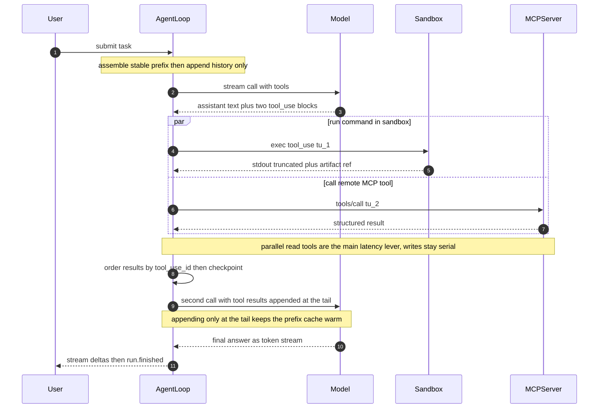
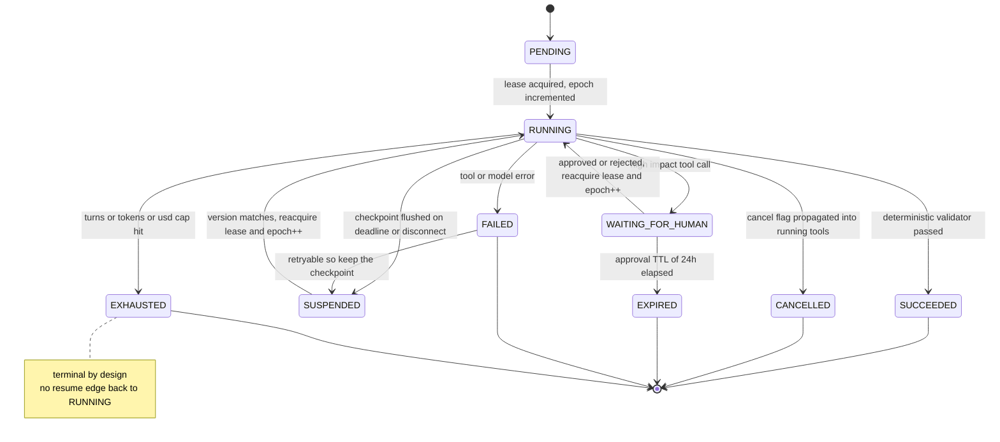

# 03 · Agent 运行时

> Agent 运行时不是"调模型的 for 循环"。它是**在一个不可信、会崩、会超时的执行环境里，把一个非确定性（non-deterministic）的循环变成可恢复、可审计、有预算硬上限的作业调度器**。
> 你写的 90% 代码和模型无关：终止判据（termination criteria）、幂等（idempotency）、沙箱（sandbox）、背压（backpressure）、取消传播（cancellation propagation）。

---

## 读这一章之前

**你在工作中遇到过这个**

上线第一周，有一个 run 在凌晨跑了 4 个小时、烧掉 $180 —— 它在"改文件 → 跑测试 → 没过 → 改回去"这四步之间转了两百多圈，
每一圈的思考文本都写着"我已经接近了"。同一周另一个 run 在第 38 轮把一封邮件发出去之后进程被 OOM 杀掉，
你按设计从 checkpoint 恢复，它又把同一封邮件发了一遍。
这两件事都不是模型不够聪明造成的 —— 一件是没有终止闸门，一件是写操作没有幂等键。

**需要先懂的概念**

| 概念 | 一句话 | 详见 |
|---|---|---|
| 幂等 | 同一个操作执行多次，效果和执行一次相同 | [00-concepts §12](../00-foundations/00-concepts.md#12-本章术语速查) |
| 幂等键 | 客户端生成、服务端去重的请求标识，让重试不产生第二次副作用 | [00/01 §5](../00-foundations/01-fundamentals.md#5-幂等idempotency分布式系统的第一公民) |
| 背压 | 处理不过来时向上游反向施压（拒绝/阻塞），而不是无限排队 | [00/01 §6](../00-foundations/01-fundamentals.md#6-背压backpressure没有它系统就会雪崩cascading-failure) |
| 超时预算传播 | 剩余时间随请求逐层传下去，每层只减不加 | [00/01 §9](../00-foundations/01-fundamentals.md#9-幂等--重试--超时三件套必须一起设计) |
| 有状态 vs 无状态 | 运维判据是：随机杀掉一台实例后，服务能否只靠外部持久化状态恢复，而不丢失唯一数据或会话进度 | [00-concepts §9](../00-foundations/00-concepts.md#9-有状态-vs-无状态) |
| 前缀缓存与失效级联 | 改了靠前的内容，它后面所有内容的缓存一起作废 | [02 §9](02-context-engineering-and-rag.md#9-上下文组装顺序与前缀缓存的硬约束) |

**这一章要回答的问题**

1. 一个自己不知道该在哪停的循环，怎么保证它一定会停？停的时候又该做什么？
2. 模型生成的代码要在哪里执行，才能在"防注入的分类器 100% 失效"这个前提下依然安全？
3. Agent 跑到第 40 轮进程崩了，怎么恢复到"不会重复扣款"的程度？checkpoint 里必须有什么？
4. 用户点了取消，一个已经扇出到 5 个子 Agent、3 个沙箱的 run 要怎么真的停下来？

**本章新引入的术语**

| 术语 | English | 一句话定义 |
|---|---|---|
| Agent 循环 / 轮 | agent loop / step | 「调模型 → 模型说要调工具 → 你的代码去执行 → 把结果塞回消息里再调模型」，重复一次算一轮 |
| 工具调用 | tool use / function calling | 模型不亲自执行动作，只输出一个"我要调 X、参数是 Y"的结构化请求，由你的代码决定执行不执行 |
| 终止判据 | termination criteria | 决定这个循环什么时候必须停下来的那组条件 |
| 无进展检测 | no-progress detection | 一组不依赖模型自述、只看外部可观测变化的信号，用来判断它是不是在原地打转 |
| 沙箱 | sandbox | 一个隔离的执行环境；里面的代码即使是恶意的，也伤不到宿主机、别的租户和你的凭据 |
| microVM | microVM | 每个负载单起一台极小的虚拟机、带自己独立的内核，冷启动约 125 ms |
| 提示注入 | prompt injection | 攻击者把指令藏在模型会读到的数据里（网页、邮件、文件名、工具返回值），让模型把它当命令执行 |
| MCP | Model Context Protocol | 工具提供方与 Agent 运行时之间的对接协议，用来消掉"N 个 Agent × M 个工具"份集成代码 |
| 检查点 | checkpoint | 把一次运行的状态定期落盘，进程崩了能从这里接着跑而不是从头来 |
| 租约 | lease | 一个带过期时间的"这活归我了"的声明；每次重新领取还要递增 `lease_epoch` 作为 fencing token，阻止旧 worker 在失联后继续写 |
| 人在回路 | human-in-the-loop (HITL) | 在特定动作执行前强制停下来等人批准 |
| 取消传播 | cancellation propagation | 取消信号要能逐层送达在飞的模型请求、工具调用和子 Agent，并有强制兜底 |

---

## 1. Agent 循环的最小正确实现

```
用户输入 ─┐  ┌───────────────── 每轮循环（step）─────────────────┐
          ▼  │                                                   │
   ┌──────────┴─┐  1 消息组装   稳定前缀 + 只追加历史            │
   │ 会话状态   │──► 2 模型调用  流式 token / thinking            │
   │ + budget   │──► 3 解析校验  schema 校验 + 权限判定（沙箱外） │
   │  Store     │──► 4 执行      读并行 ┆ 写串行 ──► 沙箱 / MCP   │
   └──────▲─────┘──► 5 结果回填  截断 + 落盘 + 按 id 定序         │
     checkpoint ◄──────┘                                          │
                       ▼                                          │
                  6 终止判据 ──否────────────────────────────────┘
                       │ 是 ──► 最终答案 / 失败原因 / 挂起等待人
```

```python
def agent_run(run_id, task, budget: Budget, deadline_ts):
    state = store.load_or_init(run_id, task)           # 恢复点：可能从第 N 轮继续
    while True:
        stop = check_stop(state, budget, deadline_ts)  # 6a 闸门放循环顶部，不是底部
        if stop: return finalize(state, stop)
        # 1 组装：顺序必须逐 token 稳定（工具定义排序固定、无时间戳、无随机 ID）
        msgs = [SYSTEM_PROMPT] + TOOLS_BLOCK + state.history + state.pending_tool_results
        # 2 模型（流式）
        resp = llm.stream(msgs, tools=TOOLS, tool_choice="auto"); emit_events(resp)  # §10
        budget.spend(resp.usage)
        # 3 校验 + 授权：校验失败不要抛，回填结构化错误让模型自纠；越权直接拒，不进沙箱
        calls = resp.tool_calls
        for c in calls: validate_schema(c); authorize(c, state.principal)
        if not calls: return finalize(state, Stop.MODEL_DONE, resp.text)   # 显式完成信号
        # 4 执行：纯读可并行；写默认串行（显式声明资源不相交时才可并行）
        reads  = [c for c in calls if TOOLS[c.name].pure]
        writes = [c for c in calls if not TOOLS[c.name].pure]
        results = gather(reads, limit=TOOL_FANOUT, timeout=TOOL_TIMEOUT)
        for w in writes:
            results.append(exec_with_idempotency(
                w, key=(run_id, state.step_id, w.id)))
        # 5 回填：顺序必须与 calls 一致，否则 prefix cache 全废
        state.history += [resp.assistant_msg] + [normalize(r) for r in order_by(results, calls)]
        state.step_id += 1
        store.checkpoint(state)                        # §7
```

| 步骤 | 陷阱 | 后果 | 对策 |
|---|---|---|---|
| 1 组装 | 系统提示里塞 `now()`、动态排序工具、把检索结果插到前面 | prompt cache 全废，成本 ×10、TTFT ×5 | 前缀逐 token 稳定；变化内容只 append 到末尾 |
| 1 组装 | 中途改工具定义 | Anthropic 失效级联是 **tools → system → messages**，改 tool 定义 = **全部缓存失效** | 工具定义版本化、按会话冻结，变更走灰度（canary rollout：新版本先只对一小部分流量生效，观察无异常再逐步放大） |
| 2 模型 | 只处理 `stop_reason=end_turn` | `max_tokens` 截断时 tool_call 的 JSON 是残缺的 | 显式分支处理 `max_tokens` / `refusal` / `pause_turn` |
| 3 校验 | 校验失败就抛异常终止 | 单次幻觉参数杀死整个 run | 把错误当**工具结果**回填，给 1–2 次自纠（self-correction）机会再终止 |
| 3 授权 | 在沙箱里判权限 | 沙箱内的判断可被注入影响 | 授权在**沙箱外**做，沙箱只是第二道 |
| 4 执行 | 无超时，或超时 = 整轮失败 | 一个 30s 慢工具拖垮 p99 | 每工具独立超时（30–60s），超时也回填结构化结果 |
| 4 执行 | 并行写同一资源 | 产生覆盖、重复副作用或合并冲突 | 默认串行；只有工具声明稳定的 `conflict_key`，且调度器证明资源集合不相交时才并行 |
| 5 回填 | 原样塞入几十 KB 输出；顺序随完成先后变 | 上下文最大污染源；前缀漂移（prefix drift） → 缓存不命中 | 截断（truncation） + 落盘只回引用（§3）；按 `tool_use_id` 定序 |
| 6 终止 | 判据放在循环底部 | 恢复后会多跑一轮、多花一次钱 | 放顶部，恢复即重新判定 |

（`stop_reason` 是模型 API 返回的"这次为什么停下来"标志：`end_turn` 是说完了，`max_tokens` 是被输出长度上限截断了 —— 此时最后那个 tool_call 的 JSON 很可能只写了一半，`refusal` 是模型拒绝作答，`pause_turn` 是长任务的中途暂停、需要你原样带着继续请求。）

**伪代码是"从上往下"读的，看不出同一轮里时间怎么交错。下图把一轮拉到时间轴上：模型只被调用两次，夹在中间的那段并行工具执行才是这一轮墙钟时间的大头。**



> 📖 **读图要点**：两个工具落在同一个 `par` 块里，这一轮的工具耗时是 max(沙箱, MCP) 而不是两者之和——这是延迟优化最大的一根杠杆，也是"读并行"存在的唯一理由。另一处容易被忽略：第二次调模型时新增内容**全部追加在消息尾部**，一旦把工具结果插到工具块或系统提示之后的中间位置，前缀缓存立刻整段失效（对应上表第 1 行）。

---

## 2. 终止条件：Agent 系统的第一大 bug 源

MAST（Multi-Agent System Failure Taxonomy，一套对 Agent 失败模式的公开分类体系，本章多处引用它的占比数字）分类（1600+ 标注 trace / 7 个框架 / κ=0.88，κ 是标注者之间的一致性系数，0.88 属于很高）里终止与验证相关问题合计约 **1/3**：不知道终止条件 **12.4%**、过早终止 **6.2%**、无/不完整验证 **8.2%**、错误验证 **9.1%**。生产遥测更直接：**14.2% 的总花费烧在最终失败的 run 上**。

**终止必须是多个独立闸门（gate）的 OR，任一触发即停：**

| 闸门 | 参数 | 建议初值 | 触发后 |
|---|---|---|---|
| 轮次 | `max_turns` | 交互式 20–40；后台长任务 100–300 | 强制收敛：只用现有信息写最终答案 |
| 预算 | `max_input_tokens` / `max_output_tokens` / `max_usd` | 按单位经济（unit economics）模型倒推（见 [08-cost-and-latency.md](08-cost-and-latency.md)） | 同上，并写 `stop_reason=budget` 供计费与告警 |
| 墙钟（wall clock） | `deadline_ts` | 交互式 5–10 min；后台 1–24 h | 挂起为可恢复状态，不是丢弃 |
| 无进展 | 见下 | 连续 3 轮命中 | 升级（escalation）：换策略 / 求助人 / 终止 |
| 显式完成 | 无 tool_call，或调用 `submit_result` | — | **必须再过一遍确定性验证器（deterministic validator）**才算数 |

`max_turns` 是**必填参数，不是可选**。任何允许 `None` 的 API 设计都会在生产上留一条无限花钱的路径。

模型最典型的失败不是"错"，而是"卡在同一个坑里重复"（MAST 步骤重复占 **15.7%**）。检测必须基于**动作**而非文本：

```python
def no_progress(state) -> bool:
    fp = [hash(c.name, canonical(c.args)) for c in state.recent_calls(6)]
    return (len(fp) == 6 and len(set(fp)) <= 2)        # 1 动作指纹重复
        or state.consecutive_tool_errors >= 3          # 2 同一工具连续失败
        or state.world_hash_unchanged_turns >= 3       # 3 外部世界零变化（最可靠）
        or state.assistant_text_similarity(3) > 0.95   # 4 输出熵坍缩
```

信号 3 最可靠：**把"进展"定义为外部可观测状态的变化**（新增 commit、测试通过数、写入行数），而不是模型自称有进展。

> **面试金句**
> "Agent 的终止条件不能交给模型判断，因为'我完成了'和'我卡住了'在模型的输出分布里长得一模一样。我会把终止拆成四个确定性闸门——轮次、token/美元预算、墙钟、外部状态无变化——任一触发就停；模型的'我完成了'只是第五个信号，而且必须再过一遍确定性验证器（跑测试、校验 schema）才算数。"

---

## 3. 工具设计：工具的描述就是 API 文档，模型是你的用户

**你不是在写函数，你是在写一份给"健忘、爱猜、不读源码、每次只读一遍"的初级工程师看的 API 文档。**

**① 命名要在无上下文时自解释（self-describing）。** `search` ❌ → `search_codebase_by_regex` ✅。模型在 30 个工具里选一个时只看得到名字和第一句描述。

**② 参数最小化，能推断的不要问。**

```jsonc
// ❌ 暴露实现细节，模型每个都要猜
{"name":"query_db","params":{"host":"","port":0,"db":"","sql":"","timeout_ms":0,"fetch_size":0}}
// ✅ 一个语义参数 + 一个可选过滤；枚举永远优于自由文本
{"name":"query_orders","params":{"filter":{"customer_id":"","status":"pending|shipped|…"},
                                 "limit":{"type":"integer","default":50,"maximum":200}}}
```
经验值：**单个工具超过 5 个必填参数，调用正确率明显下降**；拆成两个工具或加一个 `mode` 枚举。

**③ 错误信息必须可操作（actionable）** —— 它是模型下一轮的唯一输入。`"Error: 400 Bad Request"` 是纯浪费。合格的写法是"**哪个参数错了 + 当前值 + 约束 + 下一步该调什么工具**"：

```
✅ "参数 `path` 必须是仓库内的相对路径（当前值 '/etc/passwd' 在工作区外）。
    可用顶层目录：src/, tests/, docs/。要查文件请先调用 list_dir。"
```

**④ 返回值为模型优化，不是为人优化。** ANSI 颜色与表格框线 → 纯文本/紧凑 JSON；200 行 stack trace → 顶部 3 帧 + 错误类型 + 相关源码 5 行；500 条记录 → 20 条 + `total` + `next_cursor` + **一句摘要**；UUID → 稳定短 ID（`ord_1042`，模型后续轮次要复述它）；`1753891200` → `2026-07-30T12:00:00Z (3 hours ago)`。

**⑤ 分页（pagination）与截断是契约的一部分，不是异常处理。** 工具输出是上下文最大的污染源（⚠ 有社区逆向称占 Agent 总 token 的 **67.6%**，Anthropic 未公开官方比例，仅作量级参考）。

```python
TOOL_RESULT_BUDGET = 4000                        # token 硬上限；特大工具单独调到 8000
def truncate(result, budget):
    if tokens(result) <= budget: return result
    ref = artifact_store.put(result)             # 全量落盘（S3 / 沙箱文件系统）
    return (head_tokens(result, budget*0.6) + f"\n…[截断 {tokens(result)-budget} tok]…\n"
            + tail_tokens(result, budget*0.2)
            + f"\n完整内容见 {ref}，可用 read_artifact(ref, offset, limit) / grep_artifact(ref, pat)")
```

**截断必须给出继续读的路径。** 只截断不给句柄，模型会重新调一遍同样的工具再被截断一次——这是无进展循环最常见的成因。

**工具数量与缓存**：**20–40 个是舒适区**，超过 ~50 个选择正确率下降且工具定义本身吃掉几千 token；超出就用 `list_available_tools(category)` 做二级发现，或拆到子 Agent。工具块位于前缀最前面，值得单独设 cache breakpoint（Anthropic 最多 **4 个** breakpoint，每个只回看 **20 个 content block**）；最小可缓存前缀因模型而异（2026 年中量级，随时变动）：Opus 5 / Fable 5 为 **512** token，Sonnet 5 / Opus 4.8 为 **1024**，Haiku 4.5 为 **4096**。

---

## 4. 并行化与依赖

一条安全的默认规则是：

> **纯读和相互独立的评估可以并行；写操作默认串行。只有资源所有权明确、冲突键不相交且下游幂等时，写才可以并行。**

原因不是性能而是语义：**动作隐含决策，冲突的决策产生糟糕结果**。两个并行 Agent 各自定了配色方案，合起来就是垃圾。

```
一轮返回 5 个 tool_call：read_file(a) read_file(b) search(q) ──► 并行（信号量限流）
                        write_file(c) run_migration()        ──► 串行，按模型给出的顺序 + 幂等键
```

判定"能否并行"至少看四条：工具是否声明 `pure=true`、是否有稳定的资源/冲突键、资源集合是否不相交、失败能否独立重试。声明来自受信任的工具注册表，不能由模型临时决定。数据库对不同行的幂等 upsert 可以并行；同一账户扣款即使参数不同也应串行或交给下游事务化。

| 并发上限层级 | 参数 | 建议值 | 缺失后果 |
|---|---|---|---|
| 单轮扇出（fan-out：一次请求向下分发出 N 个并行的下游调用；N 越大，整体延迟越接近最慢那个下游的高分位，见 [`00/01 §7`](../00-foundations/01-fundamentals.md#7-尾延迟放大tail-latency-amplification)） | `TOOL_FANOUT` | 5–10 | 一轮拉起 50 个子任务打爆下游 |
| 单 run 并发 | 子 Agent 并发 | 参考 Claude Code Dynamic Workflows 硬上限：**同时最多 16 个 Agent、单次运行总计 1,000 个**，>25 个或预计 >150 万 token 时预警 | 扇出失控（Anthropic 观察到简单 query 被拉起 50+ 子 Agent） |
| 组织级 | spend limit / TPM 配额 | 按团队日预算 | 一次跑飞的 workflow 吃掉全团队当天配额 |

嵌套深度同样要限：Claude Code 默认 **3 层**（`CLAUDE_CODE_MAX_SUBAGENT_SPAWN_DEPTH`，设 1 即关闭）。没有深度上限的递归 spawn 是指数级烧钱路径。**成本锚点**：单 Agent 的 token 消耗约为纯 chat 的 **4×**，多 Agent 系统约 **15×**。并行化降低墙钟时间（复杂研究类任务最多减少 90% 耗时），但**不降成本，只升成本**。

---

## 5. MCP 协议

[Model Context Protocol](https://modelcontextprotocol.io/) 解决的是 **N 个 Agent × M 个工具 = N×M 份集成代码**。它**不是函数调用的替代**——函数调用（function calling / tool use）是模型 API 层的能力，MCP 是工具供给侧的传输与发现（discovery）协议，二者是上下游：MCP server 给出工具定义 → 运行时翻译成模型 API 的 `tools` 数组 → 模型返回 tool_call → 运行时再翻回 `tools/call`。分层共识（2026）：**MCP 管工具与上下文；[A2A](https://a2a-protocol.org/latest/specification/)（v1.0，2026-04，Linux Foundation，150+ 组织）管跨组织的 Agent 委派（delegation）；厂商 SDK 管内层推理循环。** 把 MCP 硬套跨组织长时协作是常见误用。

**三大原语（primitive）**：**Tools**（模型控制，有副作用（side effect）的动作，≈POST）、**Resources**（应用控制，URI 寻址的只读上下文，≈GET）、**Prompts**（用户控制，显式触发的模板，≈slash command）。实践观察：生态里 Tools 占绝对多数，Resources / Prompts 的客户端支持长期参差——做 server 时不要押注 Resources 被正确渲染。

### 2026-07-28 的破坏性重构：MCP 变成无状态协议

这是设计题的高价值考点（[官方 changelog](https://modelcontextprotocol.io/specification/2026-07-28/changelog)）。

| 变更 | SEP | 架构后果 |
|---|---|---|
| 删握手（`initialize`），协议版本与能力改为**每请求**放 `_meta`（`io.modelcontextprotocol/protocolVersion` 等）；新增 server **MUST** 实现的 `server/discover` | 2575 | server 变无状态（stateless） |
| 删 `Mcp-Session-Id`；`tools/list` 等**不再允许按连接变化** | 2567 | **粘性路由（sticky routing）与共享 session store 可以删掉**，MCP 网关少一层；需跨调用状态的 server 自己铸 handle，当普通 tool 参数传 |
| **删 SSE 断线续传**（`Last-Event-ID` 与 event id 移除）；订阅改为单一长连接 POST `subscriptions/listen` | — | **断流 = 丢请求**，客户端 MUST 用新 request id 重发 ⇒ 工具必须幂等。请求作用域通知（`notifications/progress`）仍走各自响应流 |
| 反向请求改 MRTR：返回 `InputRequiredResult`，客户端**重发原请求**带 `inputResponses`；所有 result 必填 `resultType` | 2322 | 无状态下的反向请求，需自己在 `requestState` 编码关联标识 |
| **Roots / Sampling / Logging 弃用**，`ping`、`logging/setLevel` 直接删除 | 2577 | Sampling 的替代是**直连 provider API** ⇒ "MCP server 借用 client 模型额度"被官方关掉，server 端 agentic loop 必须自带凭据与预算 |
| Tasks 移出核心变官方扩展 `io.modelcontextprotocol/tasks`，轮询（polling）`tasks/get` | 2663 | 长耗时工具的正解；状态机（state machine）working / input_required / completed / failed / cancelled |
| list 类结果**必须**带 `ttlMs` 与 `cacheScope`；POST **必须**带 `Mcp-Method` / `Mcp-Name` 头 | 2549 / 2243 | **网关不解 body 即可路由与缓存**；规范建议 `tools/list` 确定性排序（deterministic ordering）以提升 prompt cache 命中 |

错误码重编号：`HeaderMismatch` −32001→**−32020**、`UnsupportedProtocolVersion` −32004→**−32022**；**−32000～−32019 留给实现自定义，−32020～−32099 保留给规范**。弃用窗口 **≥12 个月**（Active / Deprecated / Removed 三态）。

**传输**：`stdio`（本地子进程，凭据走环境变量）与 **Streamable HTTP**（远程）。
**授权**：MCP server 只做 **OAuth 2.1 Resource Server，不做 Authorization Server**；强制 PKCE，[RFC 9728](https://datatracker.ietf.org/doc/html/rfc9728) 做资源发现，[RFC 8707](https://datatracker.ietf.org/doc/html/rfc8707) resource indicator 把 token 绑到具体 server。**Authorization 对 MCP 是 OPTIONAL：HTTP 传输 SHOULD 遵循，STDIO SHOULD NOT。** **DCR（RFC 7591）已弃用**，改用 **Client ID Metadata Documents（CIMD）**；三项加固：授权响应带 `iss` 且客户端 **MUST** 在兑换 code 前校验（防 mix-up）、DCR 时 MUST 指定 `application_type`、**客户端凭据必须按 issuer 作 key 存储且 MUST NOT 跨 AS 复用**。**Token passthrough（把客户端给你的 token 原样转发给下游）是 MUST NOT**：server 必须校验 audience（受众：token 里写明"这张票只对哪个服务有效"的那个字段；不校验它，一个为 A 服务签发的 token 就能拿来打 B 服务）。

**生态规模三种口径不可互换**：官方 Registry **9,652** latest server（28,959 版本记录，2026-05-24，API 仍在 v0.1 freeze 非 GA）／第三方目录 Glama ~**19,831**（2026-03）／Anthropic 口径 10,000+ 活跃公共 server；SDK（Python+TS）月下载约 **9,700 万**。安全现状（Trend Micro，2025-11~2026-03）：**9,695** 个唯一 server 中 **5,832** 个有弱点，扣掉仅缺认证的 3,573 个后仍有 **2,259** 个确证问题、合计 **4,982** 条；分类 top 是任意文件访问 880、命令注入（command injection：参数被拼进 shell 命令里执行）476、SSRF 422（server-side request forgery，服务端请求伪造：诱导服务器去访问它本不该访问的地址，典型目标是云元数据端点和内网服务）、SQL 注入 211、提示注入（prompt injection）185（≈3.7%，注入类难自动检出，实际严重低估）。

**最关键的一条认知——信任边界（trust boundary）在 tool description，不在 tool 调用**：`连接恶意 server → tools/list（到这一步已中招）→ 恶意描述进入 prompt → 模型按隐藏指令行事`，**全程不需要调用任何工具**。MCP 规范对工具描述投毒（tool poisoning） / rug pull / 跨 server shadowing **没有任何 MUST/SHOULD**，这是已知空白。补空白的是 [OWASP MCP Security Cheat Sheet](https://cheatsheetseries.owasp.org/cheatsheets/MCP_Security_Cheat_Sheet.html)（非规范）：**用密码学哈希 pin 住 tool 定义、任何变更告警**；**每个 MCP server 当作独立的不可信安全域**（独立凭证、独立 scope、绝不共享 token）；所有工具返回值视为不可信输入。

---

## 6. 沙箱

Agent 会执行模型生成的代码，而模型的输入里混着不可信内容。概率性防御（probabilistic defense）不能当边界——[arXiv 2510.09023](https://arxiv.org/abs/2510.09023)（OpenAI + Anthropic + GDM 联合）对 **12 个已发表防御**做自适应攻击（adaptive attack），多数 ASR **> 90%**，500 人红队（red team）后对全部 12 个达到 **100%** 成功；Anthropic 官方的表述是 **"Probabilistic defense has a non-zero miss rate"**。设计评审只有一条判据：**假设分类器 100% 失效，系统还剩什么？**

读下表前先统一三个词：**syscall（系统调用）**是程序向操作系统内核请求服务的入口，读文件、发网络包、起进程都要走它；隔离方案的强弱基本等于"它对 syscall 的拦截有多彻底"。**冷启动**是从零把一个执行环境拉起来到能跑第一条命令所需的时间，Agent 每次调工具都可能付一次。**逃逸（escape）**指沙箱里的代码突破隔离、拿到宿主机上的能力。

| 方案 | 隔离强度 | 冷启动（厂商口径，**不可跨厂商比**） | 开销 | 任意二进制 | 适用 |
|---|---|---|---|---|---|
| **裸容器** | ⚠ 共享宿主内核，**对不可信代码不是安全边界（security boundary）** | 数百 ms–数 s | ~0 | 是 | 只跑自己的可信代码 |
| **gVisor**（用户态内核） | 中高，syscall 被 Sentry 拦截 | 数百 ms | syscall 密集 **10–40%**；文件系统密集 **30–80%**（Sentry+Gofer 双跳） | 是（syscall 覆盖不全） | 计算密集、syscall 稀疏；复用容器工具链 |
| **Firecracker / Kata microVM** | 高，**每负载独立内核** | ~**125 ms**，内存开销 **<5 MB** | 近原生 | 是 | **LLM 生成代码的生产默认** |
| **WASM / WASI** | 高（内存安全 + 能力式 syscall），逃逸面（escape surface）在 host 函数 | 亚毫秒–毫秒 | 低，但需重编译 | 否 | 插件、纯计算工具、边缘 |
| **V8 isolate**（CF Dynamic Workers） | 中高（进程内，历史上有 Spectre 类问题） | 毫秒级，约比容器沙箱快 **100×**，MB 级内存 | 极低 | 否 | 极短的纯 JS/TS 工具 |

其他冷启动锚点（2026 厂商口径）：E2B ~**150 ms**、Daytona ~**90 ms**、Cloudflare 容器沙箱 **1–3 s**（多次顺序工具调用会累积）、Blaxel standby 恢复 **25 ms** / SmolVM **<200 ms**。**选型规则**：I/O 或 syscall 密集 → microVM；计算密集、syscall 稀疏 → gVisor 可接受；能编成 WASM 的纯函数工具 → WASM 最便宜。**永远不要用裸容器隔离模型生成的代码。**

```
挂载三档（照抄 Cowork 的产品模型）：只读（参考资料/依赖缓存）｜读写（工作区）｜读写不可删（产出目录）
必须在挂载层排除（模型层拦不住——实测直接注入下 25 次有 24 次成功外泄）：
  ~/.aws/credentials   ~/.ssh   ~/.config/gh   .env   ~/.kube/config
每沙箱硬限额：cpu 2 core ｜ memory 4GiB（OOM kill，不 swap）｜ disk 8GiB（含 tmpfs）
              pids 512（防 fork bomb）｜ egress 512MiB ｜ wall_clock 3600s（硬 kill）
```

网络的正确心智模型是**能力授予（capability granting），不是目的地过滤**：

> Anthropic 自己的 Cowork 事故：egress allowlist 放行了 `api.anthropic.com`，攻击者把**自己的** API 凭证放进被挂载的工作区文件，Claude 就把用户数据上传到了攻击者账户。**allowlist 完好，数据照样出去了。**

修复方式是在沙箱内加 MitM 代理，**只接受该沙箱自己被下发的 session token，拒绝文件里带的任何其他凭证**；同时封禁云元数据端点 `169.254.169.254` 与全部私网/链路本地段（MCP 规范点名推荐 [Stripe Smokescreen](https://github.com/stripe/smokescreen) 这类 egress proxy）。**凭证不进沙箱**：token 由沙箱外的代理持有，只向内下发短时窄 scope 的派生凭证（derived credentials），下游一律 token exchange 不透传（no passthrough）。

逃逸（sandbox escape）不是理论风险：["SharedRoot"](https://accomplish.ai/blog/sharedroot-escaping-claude-cowork-sandbox/)（2026-07-23，Claude Cowork 的 macOS 本地执行模式）实现了从 Linux VM 逃逸、读写宿主 Mac 任意文件。**它是一条链，不是单个 CVE**：根因是把宿主整个 `/` 以"仅 guest-root 可见"的方式挂进 VM 的 `/mnt/.virtiofs-root`，攻击者只需在 VM 内提权（privilege escalation）到 guest-root 就拿到宿主文件系统；拿 guest-root 用的是 `CVE-2026-46331` —— 一个 **Linux 内核** `act_pedit` 的写时复制 / 页缓存缺陷（CVSS 7.8，2026-06 已修补），**不是 Anthropic 的漏洞**。引用时别把内核 CVE 挂到产品头上，也别把"打了内核补丁"当成这条路径已封死——真正的设计缺陷是那个挂载。（Anthropic 以"CVE 发布未满 30 天"为由把该报告归类为 informative；当前版本 Cowork 默认走云端执行，本地逃逸路径不适用。）

Anthropic 在自己的[容器化复盘](https://www.anthropic.com/engineering/how-we-contain-claude)里给的教训值得背下来：**"The hypervisor, seccomp, and gVisor across our products have been dependable. Our custom allowlist proxy was the piece that failed."** —— 不要自研安全原语，你自研的那部分就是最弱环节（weakest link）。官方同时明确：**沙箱降低影响但不消除风险，任何允许网络出口的方案仍会泄露 Agent 能读到的数据，任何可写挂载项目目录的方案仍可被改代码。**

**成本（2026 年中量级，随时变动）**：E2B 2vCPU+4GiB ≈ **$0.166/h**；Modal Sandbox 同规格 ≈ **$0.38/h**（约为 Modal 普通 compute 的 **3×**）；Cloudflare standard-1 满载 ≈ **$0.074/h**、闲置 ≈ $0.038/h；Anthropic Managed Agents **$0.08/session-hour**（仅 `running` 计时）。两个陷阱：**Cloudflare 的内存/磁盘按"已配置"计费、CPU 按"实际活跃"计费**，Agent 等 LLM 响应那几秒仍在付内存钱 ⇒ 等待期应让沙箱**休眠（hibernate）**；按"普通 compute 单价 × 时长"做的预算会系统性低估。**但要记住比例**：Agent 成本里推理占 **85–89%**、沙箱运行时只占 **11–15%**、存储近乎 0（Anthropic 官方算例，n=1）——**优化预算的 85% 应该投在推理侧**。

---

## 7. 长任务与可恢复执行

| checkpoint 粒度 | 写放大（write amplification：一次逻辑上的"存一下"引发多少次实际磁盘写入，见 [`00-concepts §11`](../00-foundations/00-concepts.md#11-三个最常见的优化手段各在优化什么)） | 崩溃损失 | 适用 |
|---|---|---|---|
| 每轮循环后 | 中 | ≤1 轮（一次模型调用 + 一批工具） | **默认选择** |
| 每个工具调用后 | 高 | ≤1 个工具 | 工具昂贵（长跑构建、付费 API） |
| 仅退出时 | 低 | **全部** | 只适合幂等且便宜的短任务 |

LangGraph 的 `durability` 三档正是这个谱系：`"exit"` 只在图退出时落盘（**无中途恢复**）、`"async"` 边执行下一步边异步落盘（**崩溃时小概率丢最后一个 checkpoint**）、`"sync"` 下一步开始前同步落盘。另一个必须知道的限制：**LangGraph 只在节点之间存 state，不存节点内部——节点内的长工具调用崩了就整节点重跑。**

```jsonc
{ "run_id":"…", "step_id":42,                          // 幂等键的两个组成部分
  "lease_epoch":17,                                      // 每次重新领取 run 都递增；旧 epoch 的写必须被拒绝
  "history":[…],                                       // 已提交的消息（含 tool_use_id）
  "pending_calls":[{"id":"tu_7","name":"write_file","status":"in_flight"}],
  "budget_spent":{"input_tokens":812340,"output_tokens":41200,"usd":4.31},
  "deadline_ts":1753900000,
  "world_refs":{"git_sha":"a3f9b2","artifacts":["s3://…/run/42/build.log"]},
  "principal":{"agent_id":"agt_9","sponsor":"u_123","scopes":["repo:write"]},
  "code_version":"runtime@2.4.1|prompt@v7|tools@sha256:…" }  // 恢复时必须校验
```

`code_version` 最容易漏：**用新版本的 prompt / 工具定义恢复旧 run，行为不可预测。** 升级要用 rainbow deployment（彩虹发布：新旧多个版本同时在线，已经开跑的 run 一直留在它启动时那个版本上直到跑完，新 run 才进新版本）灰度切流，因为不能把正在跑的 Agent 一次性换版本。

### checkpoint ≠ durable execution

这一点**存在争议**：Diagrid 主张 LangGraph / CrewAI / Google ADK 的 checkpoint 模型对生产 Agent workflow 不够（缺确定性重放（deterministic replay：把历史上每一步的结果按顺序记进日志，恢复时重跑代码但直接读日志里的旧结果，从而精确复现到崩溃那一刻）、跨服务编排、精确一次（exactly-once：一个副作用最终恰好发生一次；对比 at-least-once 至少一次，可能重复）副作用）；LangChain 主张配了 checkpointer 即为 durable execution，可任意点 pause/resume。**分歧的根子是"durable"的定义不同：状态快照恢复 vs 执行历史重放。** 但双方对工程结论一致——**任何有外部副作用的写操作都应携带由 `(workflow_id, step_id, tool_use_id)` 派生的幂等键（idempotency key）**。前两项定位恢复步骤，第三项区分同一步里的多次写：

```python
def exec_with_idempotency(call, key):
    idem = f"{key[0]}:{key[1]}:{call.id}"             # run_id : step_id : tool_use_id
    policy = action_contract(call.name).idempotency
    # 不能写死 7 天：至少覆盖 workflow 最晚恢复/重试、下游动作契约与争议/对账窗口。
    tombstone_until = max(policy.workflow_retry_until(key[0]),
                          policy.action_retry_until(call),
                          policy.reconciliation_or_dispute_until(call))
    rec = idem_store.claim_once(                       # 原子占位，挡住并发重放
        idem, request_hash=hash_request(call),
        result_ttl=policy.result_replay_ttl,
        tombstone_until=tombstone_until)
    if rec.already_exists:
        return restore_or_reconcile(rec)               # 即使完整结果已清，也绝不再次执行
    result = do(call, idempotency_key=idem)            # 下游 API 也传这个键（Stripe 风格）
    idem_store.complete(idem, result, downstream_ref=extract_operation_ref(result))
    return result
```

没有这个键，"可恢复"会退化成"重新执行一次"——用户被收两次款、邮件发两遍。**完整响应与去重证据是两种保留期**：大响应可在 `result_replay_ttl` 后转冷存储或删除；紧凑 tombstone 至少保留 `key + request_hash + terminal_status + downstream_ref + executed_at`，直到上面三个窗口都结束。付款、发信、删除等动作若契约上没有一个“过了此刻重放就安全”的时间点，tombstone 就长期归档，不能因省一点热存储而重新开放副作用。命中只有 tombstone、拿不到原响应时，应凭 `downstream_ref` 查询/对账或进入人工恢复，**不能把 miss 当成“没执行过”**。具体能保住多少进度取决于工作流图、检查点边界和引擎的重放语义；把长节点拆成有明确输入输出的小步骤通常能缩小重做范围，但“拆成更多 Agent”本身并不自动带来更好的恢复性，反而可能增加协调与一致性成本。

### 可恢复执行状态机

```
                 调度器原子领取 + lease(worker, ttl=60s, lease_epoch++)
  create ──► PENDING ─────────────────────────────────► RUNNING ──┐ step 完成
                 ▲                                       │  ▲     │ → checkpoint
                 └──── 租约过期（worker 挂）─────────────┘  └─────┘   (step_id++)
                       at-least-once ⇒ 幂等键必须有        │  ▲
                                        需要人工审批       │  │ 已批准 / 已拒绝
                                  ┌────────────────────┐◄─┘  │
                                  │ WAITING_FOR_HUMAN  │─────┘
                                  └─────────┬──────────┘
                                            └─ 超时 24h ──► EXPIRED
  ── 终态 ─────────────────────────────────────────────────────────────────
  SUCCEEDED  模型最终答案 + 确定性验证器通过
  EXHAUSTED  预算 / 轮次 / deadline 触顶
  CANCELLED  经 CANCELLING（清理中）；**副作用不回滚**，只记录到 world_refs
```

四条不显然的设计：① **RUNNING 靠租约（lease）而不是心跳标志位** —— worker 挂了租约自然过期、状态回 PENDING 被别人接走，这是 at-least-once，所以幂等键必须有；② **租约必须带 fencing token**：每次领取在同一事务里递增 `lease_epoch`，worker 的 checkpoint、状态迁移和副作用网关请求都携带它，存储层只接受等于当前 epoch 的写。否则旧 worker 只是网络失联、并没有死亡，租约过期后仍能覆盖新 worker 的进度；第三方工具无法校验 epoch 时，至少由本方副作用网关拒绝旧 epoch，并继续依赖下游幂等键；③ **WAITING_FOR_HUMAN 是持久状态，不是内存里的 `await`**，进程重启后审批请求必须还在；④ **CANCELLED 不等于回滚（rollback）** —— 已发出的邮件收不回来，取消只保证"不再产生新的副作用"。

**上面那张图是调度器视角的流转；下图沿用同一套状态名，补两个它没画的态——`SUSPENDED`（checkpoint 已落盘、等着被恢复）与 `FAILED`（错误已发生、还没决定重试还是收尾），以及由此暴露出来的可达性：哪些状态还有回到 `RUNNING` 的边，哪些一进去就再也出不来。**



> 📖 **读图要点**：`SUSPENDED` 与 `WAITING_FOR_HUMAN` 都有一条指回 `RUNNING` 的边——它们是"暂停"；`EXHAUSTED` 只有指向 `[*]` 的出边——它是"结束"。把这两类塞进同一个 `PAUSED` 状态是设计期最贵的错误：恢复逻辑会尝试重启一个已经烧完预算的 run，而闸门在循环顶部又立刻再判一次，白付一次 input token。还要注意 `FAILED --> SUSPENDED` 这条边：可重试的失败必须保住 checkpoint 才有得恢复，不可重试的直接落终态，二者在写 `finalize()` 时就要分流。

### 持久化工作流引擎

| 引擎 | 模式 | 卖点 | 代价 |
|---|---|---|---|
| [Temporal](https://temporal.io/) | journal + 确定性重放 | 生态最成熟、retry/timeout 控制最强、事件历史可存活数天到数周 | **基础设施最重**；workflow 代码必须确定性（不能直接 `random()`/`now()`）；版本化 patching 是持续负担 |
| [Restate](https://restate.dev/) | journal + 重放 | 手感更轻，适合 serverless / edge | 生态较新 |
| [DBOS](https://www.dbos.dev/) | Postgres 即真理来源（source of truth） | **零新增基础设施** | 绑定 PG，规模上限即 PG 上限 |
| Inngest | 事件驱动 step function | 托管为主，接入快 | 供应商绑定 |

⚠ **未找到这四者在 Agent 负载下公开可复现的一手基准**，以上是定位差异而非性能对比。**值得上**：run 跨越数小时以上、有跨服务外部副作用（付款/开单/发信）、需要精确一次语义、需跨进程重启存活。**不值得**：交互式会话、纯只读研究任务、团队没人懂确定性重放——**引入 Temporal 是架构级承诺，它会重写你的错误处理、测试与部署方式**。这些场景可以从“Postgres 表 + 租约 + 幂等键”的小型实现起步；“约 200 行”只能代表教学原型，生产版还要补迁移、并发竞争、监控、清理、灾备和故障注入测试。

**中断与取消**必须是协作式（cooperative） + 可传播 + 有兜底（fallback）：

```
用户点取消 → 写 runs.cancel_requested = true（持久化，不是内存信号）
  ├ 循环顶部检查 → 不再发起新的模型调用
  ├ 在飞的模型请求 → 客户端 abort（省 output token，已消费的 input 照付）
  ├ 在飞的工具 → CancellationToken 逐层下传；沙箱 SIGTERM → 5s → SIGKILL
  ├ 子 Agent → 递归传播，每层独立超时，不能等父层
  └ 兜底：宽限期 30s 后强制 kill 沙箱并标 CANCELLED
```
**兜底是必须的**：协作式取消依赖每个组件都检查 token，而第三方 MCP server 不一定会。没有强制 kill，取消会变成"永远在 CANCELLING"。

---

## 8. 人在回路（HITL）

Five Eyes 五国联合指南（2026-05-01，CISA + NSA + ASD + CCCS + NCSC-NZ + NCSC-UK）明确：**不可逆或高影响动作必须走人工审批（human approval），HITL 是必需控制而非可选增强**；且"哪些动作算高影响"**必须由设计者与安全团队事先静态判定，不得在运行时交给 Agent 自己判断**。

| 插入点 | 时机 | 适用 |
|---|---|---|
| 计划审批 | 模型给出计划、执行前 | 长任务；一次审批换后续自主 |
| 动作审批 | 单个高影响 tool_call 前 | 转账、删除、对外发消息、生产写 |
| 产出审批 | 最终结果提交前 | 发布公开内容、合并 PR |
| 异常升级 | 无进展 / 预算触顶 / 权限不足 | 兜底 |

静态高影响清单（照抄即可）：**转账与支付、权限/身份变更、对外发送消息或邮件、发布公开内容、不可逆删除、生产环境写操作、超过 $X 的单次支出**。

**审批疲劳（approval fatigue）是实测问题**：Claude Code 侧观测到约 **93% 的自动批准率**（在权限提示已减少 84% 之后）——**弹窗越多，每个弹窗的安全价值越低**。四条原则：① 弹窗预算化，每个 run 的人工确认目标 **≤3 次**，超出说明权限模型设计错了；② 用**能力域批准（capability-scoped approval）**替代逐次批准（"允许本 run 在 `src/` 下写文件" 优于 20 次"允许写 `src/a.ts`"）；③ 高影响动作**永远不进批量批准**且必须展示完整未截断参数（MCP 侧对应 `requiresUserInteraction`，组织可把 connector 工具统一设为 `ask`）；④ **跨 Agent 消息不构成权限授予** —— 子 Agent 不能替你批准，被拒的动作不能转手绕过。状态挂起用 §7 的 `WAITING_FOR_HUMAN`，必须持久化并带 TTL（建议 24h），过期转 EXPIRED 而不是无限占资源。

---

## 9. 并发与背压

Agent 负载和普通 HTTP 负载的根本差别：**单个请求可能持续数分钟到数小时，且大部分时间在等待**。线程、协程或进程仍可作为 worker 内的执行机制，但不能成为唯一状态载体；跨重启的运行状态应外置，长任务通常采用“持久化任务 + 可替换 worker + 租约”。

（本节两个词：**水位线（watermark）**是一条预设的容量刻度线，越过就触发动作 —— 这里指全局在跑的 run 数超过阈值就开始拒新；**信号量（semaphore）**是一个计数式的并发闸门，最多放 N 个任务同时进入，满了后来者要么排队要么被拒。整节讲的是[`00/01 §6`](../00-foundations/01-fundamentals.md#6-背压backpressure没有它系统就会雪崩cascading-failure) 那条背压原理在 Agent 上的具体形态。）

```
 API ──► runs 表(PENDING) ──准入：每租户并发配额 / 全局水位──► worker pool（无状态，持租约）
                             超限 → 429 + Retry-After            │
              ┌────────────── 三个彼此独立的信号量 ──────────────┘
              ▼                       ▼                       ▼
      模型并发（TPM/RPM）      工具全局并发（按下游能力）   沙箱池（最贵）
```

| 维度 | 参数 | 起点 | 撞墙信号 |
|---|---|---|---|
| 单用户并发 Agent | `per_user_max_runs` | 交互式 **3–5**；后台 **1–2** | 用户排队时长上升 |
| 单租户并发 | `per_tenant_max_runs` | 按套餐（E2B Hobby 并发 20 / Pro 100、可加购到 1,100 是个可参考量级） | 噪音邻居（noisy neighbor） |
| 工具全局并发 | 每类工具一个信号量 | **按下游能力设，不是按 Agent 数设** | 下游 p99 上升 / 429 |
| 沙箱池 | 预热池（warm pool）大小 | 覆盖 p95 并发（冷启动 90–150 ms 时可以小） | 冷启动占端到端延迟比例上升 |
| 模型侧 | TPM/RPM 配额 | **按租户分桶**，不要共享一个大池 | 一个租户吃掉全部配额 |

**背压需要“有界排队 + 准入控制”，而不是无限排队。** 交互请求的预计等待超过产品承诺时，对新 run 返回 429 + `Retry-After`；可延迟的后台任务可以进入有容量、TTL 和优先级的 `PENDING` 队列。已运行任务也不是因为“花过钱”就永远优先——沉没成本不应影响决策；调度器应看用户优先级、deadline、剩余成本、是否已产生不可中断副作用和公平配额，必要时安全挂起低优先级任务。会话硬上限要提前设计进去：E2B 的 Hobby 档 **1 小时**、Pro 档 **24 小时**是硬上限，容器休眠会中断进程 —— **不要把长任务押在单个沙箱存活上**，状态必须外置（progress 文件 + git commit + 结构化 feature list），沙箱要能被重建。

---

## 10. 流式输出的事件模型

```jsonc
{"seq":1,"type":"run.started",     "run_id":"r_1","step":0}
{"seq":2,"type":"thinking.delta",  "text":"需要先看目录结构"}     // 是否透出是产品决策
{"seq":3,"type":"message.delta",   "text":"我先列一下"}
{"seq":4,"type":"tool.started",    "id":"tu_7","name":"list_dir","args_preview":{"path":"src"}}
{"seq":5,"type":"tool.progress",   "id":"tu_7","pct":40,"note":"扫描 1200 文件"}
{"seq":6,"type":"tool.finished",   "id":"tu_7","status":"ok","summary":"42 个文件","artifact":"s3://…"}
{"seq":7,"type":"approval.required","id":"ap_2","action":"write_file","expires_at":"…"}
{"seq":8,"type":"usage",           "input":81234,"output":4120,"cache_read":76000,"usd":0.42}
{"seq":9,"type":"run.finished",    "status":"succeeded","stop_reason":"model_done"}
```

1. **`seq` 单调递增 + 服务端保留最近 N 条**，断线后客户端带 `Last-Event-ID` 续传。注意 **MCP 在 2026-07-28 删掉了自己的 SSE 断线续传**（SSE / Server-Sent Events：服务端通过一条一直不关的 HTTP 连接，持续往客户端推事件；断线续传指重连时带上"我收到的最后一条编号"，服务端从那之后接着发），产品层必须自己实现这一层，不能指望协议。
2. **`tool.started` 要早于工具真正开始**（获得信号量之前就发），否则用户会看到几秒"死寂"。
3. **参数只发预览（`args_preview`）** —— 参数里可能有密钥或大 payload；`tool.finished` 只发摘要 + artifact 引用，与 §3 的截断策略共用同一套 artifact store。
4. **`usage` 每轮发一次**，前端实时显示花费——这是控制成本焦虑最有效的产品手段。
5. **事件流不是真理来源。** 断流后客户端必须能靠 `GET /runs/{id}` 拿权威状态；凡是"只在事件流里出现一次"的信息（尤其副作用确认）都会丢。

---

## 11. 什么时候不要这么做

| 反模式（anti-pattern） | 为什么错 | 正确做法 |
|---|---|---|
| **没有 `max_turns` / 预算上限就上生产** | 一条无限花钱的路径；14.2% 的花费本就烧在失败 run 上 | 多闸门 OR，`max_turns` 必填 |
| **用裸容器隔离模型生成的代码** | 容器共享宿主内核，不是安全边界 | microVM / gVisor |
| **靠注入分类器当安全边界** | 自适应攻击 ASR > 90%，红队 100% | 确定性隔离兜底；假设分类器全失效 |
| **凭据放进沙箱** | 一次成功注入就全丢（实测 24/25） | 沙箱外代理持有，只下发短时窄 scope 派生凭证 |
| **依赖 MCP 协议层 session / SSE 续传** | 2026-07-28 已删除 | 无状态设计；长任务走 Tasks 扩展轮询；工具幂等 |
| **per-connection 动态裁剪 tool 列表做租户隔离** | 新规范禁止 list 按连接变化，且会击穿客户端缓存与 prompt cache | 不同 server 端点，或授权后在调用时拒绝 |
| **副作用工具没有幂等键，或固定 7 天就删记录** | 恢复 = 重复执行；晚于 TTL 的重放仍会让用户被收两次款 | `(run_id, step_id, tool_use_id)` 派生键，下游也传；结果可短存，tombstone 按动作契约/重试/争议窗口保留 |
| **一上来就上 Temporal** | 确定性重放约束会重写你的错误处理、测试与部署 | 先用 "PG 表 + 带 `lease_epoch` 的租约 + 幂等键/长期 tombstone"；跨小时 + 跨服务副作用时再升级 |
| **用多 Agent 解决单 Agent 能解决的问题** | token 成本 15× vs 4×，且引入 orchestrator 类失效（占失效责任 67.7%） | 先把单 Agent 的工具与终止判据做对 |
| **把长任务押在单个沙箱存活上** | 会话有 1h / 24h 硬上限，休眠会断进程 | 外部化状态：progress 文件 + git commit + 结构化任务清单 |
| **审批弹窗当兜底** | 93% 自动批准率 = 审批疲劳 | 高影响清单静态定义 + 能力域批准，每 run ≤3 次弹窗 |
| **花力气优化沙箱成本** | 沙箱只占 11–15%，推理占 85–89% | 把 85% 的优化预算投在缓存命中率与模型路由 |
| **把 computer-use 当可靠自动化** | 长程（long-horizon）真实任务完整完成率约 20%（⚠ OSWorld 2.0 口径，二手未核实） | "Agent 提议 + 人确认"，或限制在可完全回滚的环境 |

> **面试金句**
> "Agent 运行时最难的地方在于它同时是三样东西：一个**非确定性的**决策循环、一个**执行不可信代码的**沙箱调度器、一个**有外部副作用的**分布式作业。这三者叠加意味着——重试必须幂等，因为副作用不可回滚；隔离必须是确定性的，因为决策是概率性的；预算必须是硬闸门，因为循环本身不知道该在哪停。我会先把这三条钉死，再谈 prompt 怎么写。"

---

## 这一章的三句话

1. **终止不能交给模型判断，因为"我做完了"和"我卡死了"在它的输出分布里长得一模一样。** 所以终止必须是四个确定性闸门的 OR —— 轮次、预算、墙钟、外部世界零变化 —— 而"进展"的唯一可靠定义是外部可观测状态变了（新 commit、多过一个测试），不是模型自称有进展。
2. **沙箱的强度只能按"分类器 100% 失效"来评估。** 概率性防御在自适应攻击下 ASR 超过 90%、红队后 100%，所以模型生成的代码永远不能跑在裸容器里；而真正决定爆炸半径的不是网络白名单，是"凭据根本没进沙箱"——放行 `api.anthropic.com` 也拦不住攻击者把自己的 API key 放进工作区。
3. **可恢复不等于不重复，可恢复只有配上幂等键才成立。** 任何有外部副作用的写操作都必须带一个从 `(run_id, step_id, tool_use_id)` 派生的键并一路传给下游，否则"从 checkpoint 恢复"在用户那边的名字叫"被扣了两次款"；同理，取消只保证不再产生新的副作用，已经发出去的邮件收不回来。

---

## 面试官会追问

1. 你的 Agent 循环在什么条件下会停？给我四个独立判据，各自触发后的处理动作有什么不同？
2. "无进展"怎么检测？为什么不能用模型自己说"我卡住了"当信号？
3. 一轮里模型返回 3 个读工具 + 2 个写工具，你怎么调度？为什么写不能并行？
4. 工具返回 200 KB 日志你怎么处理？截断之后模型再调一次同样的工具怎么办？
5. MCP 在 2026-07-28 变成无状态协议，对你的网关架构意味着什么可以删掉、什么必须新增？
6. 恶意 MCP server 的攻击在哪一步生效？为什么"只列出不调用"也已经中招？
7. 容器还是 microVM 跑模型生成的代码？给出冷启动、隔离强度、成本三个维度的数字对比与你的选择理由。
8. Agent 跑到第 40 轮进程崩了怎么恢复？checkpoint 里必须有哪些字段？已经发出去的那封邮件怎么办？
9. checkpoint 和 durable execution 的区别是什么？什么时候值得引入 Temporal，代价是什么？
10. 用户点了"取消"，系统要做哪几件事？如果第三方 MCP server 不响应取消呢？

---

**按训练路径阅读** → 回 [START-HERE](../START-HERE.md) 按所选路径继续；页尾链接只表示本目录或专章的顺读顺序。

**AI 专章顺读下一篇** → [04-agent-memory-and-state.md](04-agent-memory-and-state.md)
