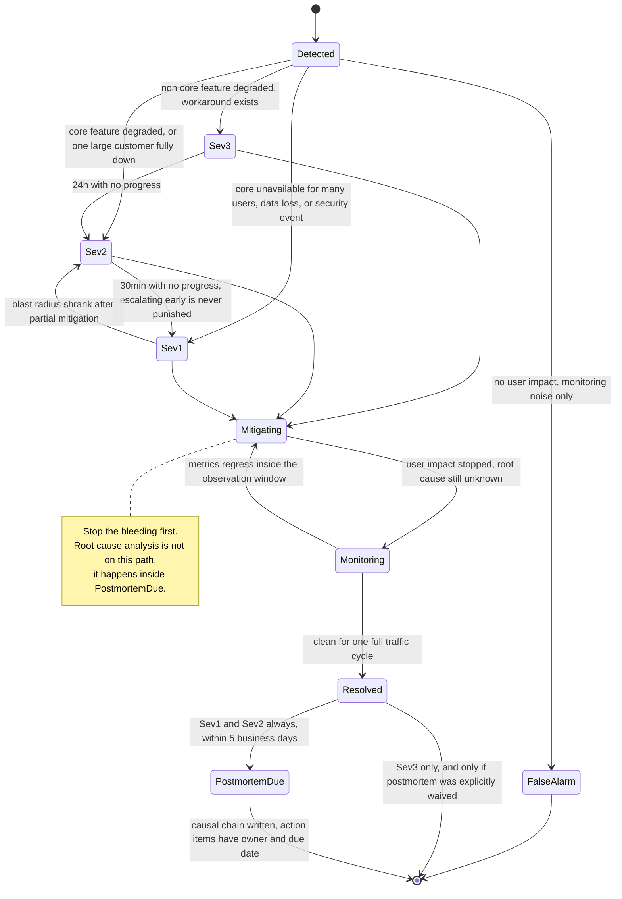

# 04 · 事故管理与混沌工程

> 事故的第一目标是**止血（stop the bleeding）**，不是定位根因（root cause）。把这两件事的顺序搞反的团队，MTTR 是别人的 5 倍。
> 而混沌工程（chaos engineering）的价值不在"把东西弄坏"，在于**逼你先写下你以为会发生什么**。

---

## 1. 第一原理：事故响应是一个分工问题，不是技术问题

大多数事故拖长的原因不是技术难，是**组织混乱**：所有人挤在同一个频道里同时说话，没人负责决策，工程师一边被高管追问一边看日志，恢复动作被重复执行。

**三条铁律**：

1. **先止血再定位。** 回滚、切流（traffic shifting）、降级、扩容 —— 这四件事中的任何一件都不需要知道根因。**知道"哪次变更引入的"就够了，不需要知道"为什么这次变更会引入"。**
2. **决策权集中，工作分散。** 一个人（IC）决定做什么，其他人执行。没有 IC 的事故会出现"两个人同时回滚不同版本"。
3. **沟通是独立工种。** 让在修问题的人同时回答"什么时候好"是最有效的拖延手段。

> **面试金句**：
> "事故期间我不允许任何人做根因分析。根因分析的产出是知识，止血的产出是可用性 —— 在错误预算正在燃烧的时候，我只买后者。判据很简单：**这个动作能不能在 5 分钟内让指标回来？** 能就做，不能就先放着。回滚永远排在调试前面，哪怕我们百分之百确定回滚不会修好它 —— 因为排除一个变量本身就有价值。"

---

## 2. 角色：IC / Comms / Ops / Scribe

沿用 [PagerDuty Incident Response](https://response.pagerduty.com/) 与 [Google SRE: Managing Incidents](https://sre.google/sre-book/managing-incidents/) 的模型。

| 角色 | 职责 | 明确**不做**的事 |
|---|---|---|
| **Incident Commander (IC)** | 决策、分派、维护状态、决定升级与宣告解除（all-clear） | **不亲自敲键盘调试**。IC 一开始 debug，就没人在指挥了 |
| **Ops Lead** | 唯一有权执行变更的人（回滚、切流、改配置） | 不做对外沟通 |
| **Comms Lead** | 对内（高管、客服、销售）与对外（状态页、客户）沟通 | 不做技术判断 |
| **Scribe** | 记录时间线：谁在几点做了什么、看到什么 | 不参与决策 |
| **Subject Matter Expert** | 被 IC 拉进来的领域专家 | 不自作主张改东西 |

**小团队的现实版本**：Sev-3 以下 IC + Ops 可以是同一个人；**Sev-1 必须至少三个人，且 IC 不能是最懂这个系统的那个人**（他要去查问题）。

⚠️ **IC 不是最资深的人，是最擅长控场的人。** 这是最反直觉也最重要的一条。让首席架构师当 IC，结果通常是他埋头看代码，指挥真空。

---

## 3. 严重级别（severity level）与升级（escalation）路径

严重级别必须按**用户影响**定义，不能按"技术上多严重"定义。

| 级别 | 定义（用户视角） | 响应 | 升级 | 复盘（postmortem） |
|---|---|---|---|---|
| **Sev-1** | 核心功能对多数用户不可用 / 数据丢失 / 安全事件 | 立即，7×24 | 5 分钟内呼叫 IC，15 分钟内通知管理层 | **强制**，5 个工作日内 |
| **Sev-2** | 核心功能显著降级，或单个大客户全面受影响 | 30 分钟内，工作时间外也响应 | 30 分钟无进展则升 Sev-1 | 强制 |
| **Sev-3** | 非核心功能受损，有 workaround | 下一个工作日 | 24 小时无进展则升级 | 可选 |
| **Sev-4** | 用户几乎无感（内部工具、监控噪音） | 排入 backlog | — | 不做 |

**两条容易漏掉的规则**：
- **升级是无责的、鼓励的。** "我升级早了"绝不应该被批评。要在流程文档里写死这一句，否则没人敢升级。
- **任何人都可以宣告（declare）事故。** 客服、销售、值班工程师都行。**宣告成本必须极低**（一条 `/incident declare` 命令），否则问题会在群里飘 40 分钟才有人叫人。

**安全事件走独立流程**。数据泄露（data breach）有法定通报时限（GDPR 72 小时），流程和技术事故不同，涉及法务与不同的证据保全要求。

**上面的表把级别讲清楚了，但表格画不出两件事：级别是可以在事故中途来回改的，以及"止血"在流程上排在"搞清楚为什么"之前。**



> 📖 **读图要点**：三个 Sev 状态的出边**全部直接指向 `Mitigating`**，路径上根本没有一个叫 "RootCauseFound" 的状态 —— 这不是画漏了，而是流程的核心：回滚、切流、开降级开关都不需要先知道为什么坏。真正需要盯住的是两条边：`Monitoring --> Mitigating` 说明"指标看起来好了"不等于 Resolved，观察期内反弹就得退回去止血；而 `PostmortemDue` 是 Sev-1/Sev-2 通向 `[*]` 的**唯一出口**，Sev-3 那条绕过它的边还得先显式豁免 —— 复盘是状态机的一部分，不是事后可选的自觉行为。

---

## 4. 事故时间线：每一段要压缩什么

```
     故障发生    检测到      有人响应     止血       根因定位     完全恢复    复盘完成
        │          │           │          │            │            │           │
────────●──────────●───────────●──────────●────────────●────────────●───────────●───→
        │◄─ MTTD ─►│◄─ MTTA ──►│◄─ 缓解 ─►│                         │
        │          │           │          │◄──────── 修复 ─────────►│
        │◄──────────────── MTTR（对外口径：影响时长）───────────────►│
                                                                     │◄─ ≤5 工作日 ─►│

各段的压缩手段（按 ROI 排序）：
  MTTD  ← 基于 SLO 的多窗口燃尽率告警（见 05/01），而不是阈值告警
        ← 合成监控（黑盒探测）补上"用户能不能用"这个视角
        ← 目标：Sev-1 的 MTTD < 2 分钟
  MTTA  ← 单一寻呼系统 + 明确 on-call 轮值 + 升级链自动化
        ← 目标：p90 < 5 分钟（人被吵醒需要时间，这是物理下限）
  缓解  ← ★ 最大杠杆：一键回滚、一键切流、预置降级开关
        ← 目标：Sev-1 的"决定回滚 → 回滚完成" < 5 分钟
  修复  ← 与可用性无关，不要在事故期间赶（赶出来的修复是下一次事故）
```

**关键判断**：
> 90% 的 MTTR 改善来自"缓解（mitigation）"这一段，而不是"检测"。团队常年在优化告警，但真正的瓶颈是"发现了却不知道该按哪个按钮"。
> 检验方法：**你的系统有多少个"能在 5 分钟内明显改善指标"的按钮？** 少于 3 个就说明缓解能力不足。典型的三个是：回滚上一次部署、把流量切到另一个 region/cell、打开降级开关。

---

## 5. 沟通模板与节奏

**节奏**（Comms Lead 负责，与技术进展无关地按时发）：Sev-1 每 **30 分钟**一次，Sev-2 每 **60 分钟**一次。**没有新进展也要发** —— "仍在排查，下次更新 XX:XX" 比沉默好一百倍，沉默会引来高管一个个私聊工程师。

```
[Sev-1] 支付失败率升高 —— 更新 #3 (14:30 UTC)

影响：  约 30% 的信用卡支付返回错误。储值卡与订阅续费不受影响。
        受影响时段：13:52 UTC 至今。
现状：  已定位到 14:05 的支付网关配置变更，回滚进行中，预计 14:40 完成。
用户可做：稍后重试；或改用储值卡。
下次更新：15:00 UTC（或状态变化时立即更新）
IC: @alice   频道: #inc-2026-0730-payments
```

**四条硬规则**：
1. **绝不承诺具体修复时间**，只承诺**下次更新时间**。
2. **对外文案先写"影响"再写"原因"**。用户关心的是"我能不能用"，不是你的架构。
3. **状态页（status page）要在 Sev-1 宣告后 10 分钟内更新**。晚于用户在社交媒体上发现，信任成本远高于事故本身。
4. **状态页必须托管在你的基础设施之外**。你的机房挂了，状态页也挂了 —— 这是每年都有人踩的坑。

---

## 6. 无责复盘（Blameless Postmortem）的实质

"无责"不是"不追究"，是**认定"人做了在当时信息下合理的事"，然后去问系统为什么允许这个合理选择造成事故**。见 [Etsy: Blameless PostMortems](https://codeascraft.com/2012/05/22/blameless-postmortems/) 与 [How Complex Systems Fail](https://how.complexsystems.fail/)。

### 对事不对人的具体做法

| ❌ 有责表述 | ✅ 无责表述 |
|---|---|
| "Bob 忘了加索引" | "变更评审流程没有强制检查新查询的执行计划；CI 里也没有慢查询门禁" |
| "运维执行了错误命令" | "该命令在生产和预发的参数含义不同，且没有二次确认；工具设计诱发了这个错误" |
| "应该更小心一点" | "该操作缺少 dry-run 模式；我们将增加 `--dry-run` 并默认开启" |
| "沟通不畅" | "告警只发到 A 团队频道，B 团队在 20 分钟后才知道 —— 缺少跨团队的事故广播" |

**判据**：**每一条行动项都必须是对系统/流程/工具的改动，不能是对人的要求。**
"以后要更仔细"不是行动项。"给这个操作加确认弹窗"是行动项。

### 事后诸葛偏差（hindsight bias）是无责的头号敌人

复盘时你已经知道答案了，于是"当时为什么没看出来"显得很蠢。**正确的问法是："在当时那个人能看到的信息里，为什么这个判断是合理的？"** —— 这个问题的答案通常直接指向一个可观测性缺口。

### 行动项（action item）的可执行性

| 属性 | 要求 |
|---|---|
| 有明确 owner | **个人，不是团队**。"平台组负责"= 没人负责 |
| 有截止日期 | Sev-1 的 P0 行动项 ≤ 2 周 |
| 进正式的工作跟踪系统 | 不能只写在复盘文档里；要能跑报表 |
| 分级 | P0 = 阻止同类事故复发（必须做）；P1 = 缩短 MTTR；P2 = nice to have |
| **有完成率指标** | **行动项完成率 < 70% 的团队，复盘是在演戏** |

⚠️ **最常见的失败**：复盘会开得很好，行动项写了 12 条，三个月后完成 2 条，同样的事故再次发生。**宁可只写 3 条并且做完**。

### 复盘模板

```markdown
# 事故复盘：<一句话标题>
事故编号 / Sev 级别 / 日期 / IC / 复盘主持人（应≠IC）

## 1. 影响（先写这个）
- 用户影响：<哪些用户、哪些功能、什么表现>
- 量化：受影响请求数 X（占比 Y%）、受影响租户数 Z、影响时长 T 分钟
- 错误预算消耗：本次消耗季度预算的 N%
- 财务/合规影响：<SLA 赔付、是否触发通报义务>

## 2. 时间线（UTC，含检测/响应/动作/关键观察）
| 时间 | 事件 | 谁 | 依据（图表/日志链接） |
- 必须包含：故障注入时刻、首个异常信号时刻、告警时刻、响应时刻、
  每次缓解动作、恢复时刻。**无效的尝试也要记录**，那是最有价值的部分。

## 3. 因果链（不是"根本原因"）
用"贡献因素 + 触发条件"的形式，见 §7。至少列出 3 条贡献因素。

## 4. 为什么没有更早发现 / 为什么没有更快恢复
- 检测缺口：<缺哪个 SLI / 告警阈值不对 / 无黑盒探测>
- 缓解缺口：<没有回滚路径 / 降级开关不存在 / runbook 过时>

## 5. 幸运因素（What went right / 侥幸）
"如果 X 没有恰好发生，影响会大 10 倍" —— 这一节最容易被跳过，
但它指出的是**还没爆的雷**。

## 6. 行动项
| ID | 行动 | 类型(检测/缓解/预防) | Owner(个人) | 优先级 | 截止 | 工单 |

## 7. 附：给全公司的一段话（可直接转发的摘要）
```

---

## 7. 根因分析（root cause analysis）的现实：因果链（causal chain），不是 5 Whys

**复杂系统里没有单一根因。** 事故是多个正常状态下无害的因素恰好对齐的结果（瑞士奶酪模型 Swiss cheese model）。

5 Whys 的问题：它是一条**线性链**，会诱导你在第一个看起来合理的答案处停下，并暗示"修掉这一个就安全了"。

```
❌ 5 Whys（线性、诱导单一结论）
支付失败 → 因为 DB 慢 → 因为缺索引 → 因为评审没发现 → 因为评审没检查清单
→ 行动项："加评审清单"   ← 只堵住了一个洞

✅ 因果图（多因素、每条边都是一个可下手的点）
                 ┌─── 新查询缺索引（变更引入）
                 ├─── CI 无执行计划门禁（预防缺口）★
   支付失败 ◄────┼─── DB 连接池无隔板，慢查询吃光连接（放大器）★
                 ├─── 支付服务对 DB 超时设为 30s（放大器）★
                 ├─── 告警只看错误率，DB 延迟无告警（检测缺口）★
                 └─── 回滚需要 20 分钟人工操作（缓解缺口）★

★ = 独立可修复。修任意一个都能显著降低下次的影响 —— 这才是复盘的产出。
```

**判据**：**如果你的复盘只产出一条根因，那它多半是"变更引入了 bug"这种废话。** 真正有价值的产出在"放大器（amplifier）"和"缺口（gap）"这两类，因为它们对**下一次完全不同的故障**同样有效。

---

## 8. 事故指标：看趋势，别看单次

| 指标 | 定义 | 参考目标 | 陷阱 |
|---|---|---|---|
| **MTTD** | 故障发生 → 检测到 | Sev-1 < 2 min | 只统计"被发现的"，漏检不计入 → 看起来永远很好 |
| **MTTA** | 告警 → 有人确认 | p90 < 5 min | 深夜与白天要分开统计 |
| **MTTR / MTTM** | 检测 → 影响结束 | 按 Sev 分别设 | **均值毫无意义**（长尾极重），必须看 p50 / p90 |
| **重复事故率（repeat incident rate）** | 30 天内同类事故占比 | **< 10%** | ★ 最有价值的单一指标：它直接度量复盘有没有用 |
| **行动项完成率** | 到期完成 / 总数 | > 80% | < 70% 说明复盘是走过场 |
| **变更相关事故占比** | 由部署/配置变更引发 | 通常 60–75% | 这个数字高不是坏事，说明归因清晰；**用它来论证渐进式发布（progressive delivery）的投入** |
| **告警可行动率** | 需要人做事的告警 / 总告警 | > 80% | 低于此说明在制造疲劳 |

⚠️ **不要把 MTTR 设成 OKR 目标。** 它会被优化成"把大事故拆成很多小事故上报"或"提前宣告恢复"。**用它做趋势观察，用"重复事故率"和"行动项完成率"做考核。**

---

## 9. On-call 的可持续性

这是工程组织最容易透支的资产。**一个 on-call 体验很差的团队，两年内会失去最资深的人。**

| 参数 | 参考值 | 说明 |
|---|---|---|
| **每班次事件数** | **≤ 2 次 / 12 小时班** | Google SRE 的经典阈值。超过则无法在事故中做认真的排查 |
| 轮换人数 | ≥ 6 人（8 人更好） | 少于 6 人意味着每月轮到一次以上，疲劳累积 |
| 一线/二线 | 一线响应，二线兜底 | 二线的存在让一线敢于升级 |
| 运维工作占比 | **≤ 50%** 工作时间 | 超过说明系统在吃人；剩余 50% 必须用于消除运维负担（toil） |
| 夜间寻呼（page） | 目标 ≈ 0 | 非 Sev-1/2 的告警**不允许**在夜间寻呼，转为工单 |
| 补偿 | 明确的调休或津贴 | 不给补偿的 on-call 是隐性裁员 |

**降低寻呼量的优先级顺序**：
1. **删掉不可行动（non-actionable）的告警**（通常能砍掉 30–50%）。判据：这个告警响了，接到的人**当场**需要做什么？答不上来就删。
2. 把"需要人做但可自动化"的变成自动化（自动扩容、自动重启、自动切流）。
3. 把 SLO 告警从"症状阈值"改成"多窗口燃尽率"，见 [`01-slo-and-error-budget.md`](01-slo-and-error-budget.md)。
4. 最后才是修系统。

### Runbook 的质量标准

| ❌ 坏 runbook | ✅ 好 runbook |
|---|---|
| 描述系统架构 | 直接给命令，可复制粘贴 |
| "检查服务是否健康" | `kubectl -n prod get pods -l app=payments`，附上期望输出 |
| 假设读者懂业务 | 假设读者是凌晨三点被吵醒的另一个团队的人 |
| 只有 happy path | 有"如果这步失败，做 X" |
| 没写过期时间 | 有"最后验证日期"，超过 6 个月标记为待验证 |

**判据**：**runbook 的正确性只能靠演练（drill）验证。** 每次事故后检查用到的 runbook 是否需要更新；每季度随机抽一份在预发环境走一遍。

---

## 10. 混沌工程：假设驱动，不是随机破坏

[Principles of Chaos Engineering](https://principlesofchaos.org/) 的核心不是"注入故障"，是**先定义稳态、再写下假设、再实验**。没有前两步的故障注入（fault injection）叫"制造事故"。

```
① 定义稳态（steady state）—— 必须是业务指标，不是资源指标
     ✅ "每分钟成功下单数在 800–1200 区间"、"结账 p99 < 500ms"
     ❌ "CPU < 70%"（用户不关心 CPU）
② 写下假设：  "杀掉 1 个可用区的所有实例后，稳态指标偏离 < 5%，
               且 3 分钟内自动恢复，无人工干预"
③ 定义中止条件（abort criteria）：稳态偏离 > 15% 或持续 > 2 分钟 → 立即回滚实验
④ 最小爆炸半径注入
⑤ 观察 → 假设成立？→ 不成立就是一个 bug（而且是你在可控条件下发现的）
⑥ 逐步扩大爆炸半径，直到覆盖真实故障规模
```

**关键点：假设不成立才是收获。** 如果你的实验总是成功，说明爆炸半径设得太保守，没有产生信息。

### 爆炸半径（blast radius）的推进路径

| 阶段 | 环境 | 半径 | 前置条件 |
|---|---|---|---|
| 0 | 本地 / 单测 | 单进程（用 [toxiproxy](https://github.com/Shopify/toxiproxy) 注延迟） | 无 |
| 1 | 预发 | 全环境 | 预发有真实流量回放 |
| 2 | 生产 | **1 个实例**，工作时间，人守着 | 有一键中止；有稳态看板 |
| 3 | 生产 | **1% 流量 / 1 个 cell** | 阶段 2 连续通过 |
| 4 | 生产 | **1 个可用区** | 有静态稳定性容量 |
| 5 | 生产 | **1 个 region**（游戏日 game day） | 高层批准 + 客户沟通 |
| 6 | 生产 | 自动化持续运行，无人值守 | 前五阶段全部稳定 6 个月以上 |

⚠️ **不要跳级。** 从"没做过混沌"直接跳到"杀一个可用区"，你只是在制造一次真实事故，而且没人准备好。

### 常见实验清单

| # | 实验 | 假设（示例） | 常见的真实发现 |
|---|---|---|---|
| 1 | 依赖注入 500ms 延迟 | 上游超时生效，降级路径触发 | 超时是 30s 默认值；线程池被占满 |
| 2 | 依赖返回 100% 5xx | 熔断打开，走 fallback | 熔断器配了但没有 fallback；用户仍看到错误 |
| 3 | **杀掉 1 个实例** | 流量 5 秒内重新分布，无错误 | 优雅关闭（graceful shutdown）没做，在途请求被砍断 |
| 4 | 杀掉数据库主节点 | 30 秒内自动 failover | 应用连接池不感知，卡到 TCP 超时（几分钟） |
| 5 | 缓存集群整体不可用 | 降级到 DB，限流保护 DB | 回源（origin fetch）无并发限制 → DB 秒崩（见 `01/02`） |
| 6 | 填满磁盘 / 耗尽 inode | 告警触发，服务只读降级 | 日志写满盘，服务静默死亡，无告警 |
| 7 | **DNS 解析失败** | 用缓存端点继续工作 | 全部服务同时不可用（最被低估的单点 single point of failure） |
| 8 | 时钟跳变（clock skew） ±5 分钟 | 无影响 | 令牌校验全失败、租约误判过期 |
| 9 | 可用区网络分区（network partition） | 静态稳定，容量足够 | 跨 AZ 调用超时打满线程池 |
| 10 | 证书过期 | 提前 30 天告警 | 没人监控证书；凌晨全站不可用 |
| 11 | **模型 API 返回 429/超时**（AI） | 降级到备用模型，标注降级 | 无 fallback；Agent 循环把预算烧光后失败 |
| 12 | **向量库/检索超时**（AI） | 跳过检索，标注"未查文档" | 整个请求失败；或悄悄给出无依据的答案 |
| 13 | **MCP server 返回畸形/超大响应**（AI） | 被截断 + 记录，不污染上下文 | 22MB 垃圾撑爆上下文；工具输出直接进 prompt |

**工具**（2026 常用）：[AWS Fault Injection Service](https://aws.amazon.com/fis/)、[Chaos Mesh](https://chaos-mesh.org/)（K8s）、[LitmusChaos](https://litmuschaos.io/)、toxiproxy（应用层代理）、Gremlin（商业）。**选型不重要，实验设计的纪律才重要。**

---

## 11. 灾难恢复（disaster recovery）演练：验证 RTO/RPO，而不是声明它

**"我们的 RTO 是 4 小时"这句话在没有演练过之前是一个愿望，不是一个指标。**

| 演练类型 | 频率 | 通过判据 |
|---|---|---|
| **备份恢复** | **每月**（自动化） | 从备份恢复出可查询的数据库，**并校验行数/校验和（checksum）**。"备份任务成功"不等于"备份可恢复" |
| 单 AZ 故障 | 每季度 | 稳态偏离 < 5%，无人工干预 |
| **Region 故障转移** | 每半年 | 实测 RTO ≤ 声明值；实测 RPO ≤ 声明值 |
| 依赖供应商中断 | 每季度 | 降级路径生效 |
| **"钥匙人"缺席演练（bus factor drill）** | 每半年 | 最懂系统的人休假时，其他人能否照 runbook 恢复 |

**几条硬话**：
- **没有恢复演练的备份不是备份。** 常见失效：备份里少了一张表、加密密钥不在灾备区、恢复需要的凭证存在被毁的那个系统里。
- **RPO 的验证方式是"写入一条带时间戳的哨兵记录（sentinel record），故障转移后看它在不在"**，不是看文档。
- **故障转移要演练"切回来"**。很多团队能切过去，切不回来（数据双向不一致）。
- 单元化架构（cell）能把演练成本大幅降低：`N` 个 cell 意味着单 cell 全挂影响 ≤ `1/N` 流量，你可以拿一个 cell 常态化做演练。见 [`03-saas-platform/01-control-plane.md`](../03-saas-platform/01-control-plane.md)。

---

## 12. AI / Agent 系统的事故特殊性

这是 2025–2026 新增的一整类事故形态，传统 SRE 手册完全没有覆盖。

### 特殊性一：**"输出变差"是一种没有报错的故障**

所有指标绿灯：延迟正常、错误率 0、吞吐正常。但答案质量掉了 20%。**你的监控体系对此完全失明。**

检测手段（按 ROI 排序）：

| 手段 | 延迟 | 说明 |
|---|---|---|
| **代码型轨迹（trajectory）指标**（免费，实时） | 秒级 | 工具调用次数、循环检测、必经步骤是否出现、平均步数、终止原因分布。**布尔轨迹分数在每条 trace 上计算都是免费的**，适合做告警信号 |
| **隐式用户信号（implicit signal）** | 分钟级 | 重试率、复制率、会话轮数、"转人工"率、点踩率。**这是最灵敏的早期指标** |
| **在线 LLM-judge 抽样** | 分钟–小时 | 对采样流量打分。注意 judge 本身会漂移（drift），见下 |
| **离线回归集（regression set）重跑** | 小时 | 版本化的生产轨迹回归集 |

**必须建的告警**：`平均工具调用次数`、`平均步数`、`因步数上限而终止的比例`、`空回复/拒答率`。这些在质量退化时通常先于用户投诉动。

### 特殊性二：变更源比传统系统多得多

传统系统的变更 = 代码 + 配置。Agent 系统的变更包括：**提示词（prompt）、工具定义、模型版本（供应商可能悄悄换权重）、检索索引、embedding 模型、rerank 模型、上下文管理策略、温度/推理预算参数**。

```
必须版本化 + 可独立回滚的东西（每一项都要有 git 记录与灰度能力）：
  prompt 模板   工具定义(schema)   模型 ID+版本   embedding 模型 ID
  检索参数(topK/alpha/RRF k)      rerank 模型     上下文管理策略
  judge 模型与 judge prompt       安全过滤器规则
```

⚠️ **供应商侧的模型行为变化是你无法控制的变更。** 别名（alias，如"最新版"）会在你不知情时切换 —— **生产必须 pin 具体模型版本 ID**，并把"供应商弃用/切换"当作一类计划内事故来演练。同理：换 embedding 模型 = 全量重建索引，旧向量与新向量不可混用。

### 特殊性三：事故的成本形态不同

- **失败的运行也要花钱**：生产遥测显示 **14.2% 的总花费花在最终失败的运行上**（63.9 万执行步 / 2.36 万次运行样本）。一次"Agent 疯狂循环"的事故，第一个可见症状可能是**账单**而不是错误率。
- **必须有成本熔断（cost circuit breaker）**：单租户/单会话的 token 与美元硬上限，超限即终止。**这是可用性控制，不只是财务控制。**
- 参考量级：Claude Code 官方口径 **$13/开发者/活跃日**、$150–250/月、P90 < $30/日（2026 年中，随时变动）。**日成本 P99 突然翻 5 倍就是一个事故信号。**

### 特殊性四：回滚的对象不同

| 故障类型 | 止血动作 | 注意 |
|---|---|---|
| 模型供应商 5xx/429 激增 | 切 fallback 模型链 / 切 region | 降级链必须**事先跑过质量评测** |
| 提示词回归 | **回滚提示词版本**（应该像回滚代码一样快） | 提示词必须在版本控制里，不能存数据库里手改 |
| 工具/MCP server 故障 | 单独禁用该工具，Agent 继续跑 | 需要工具级别的开关（kill switch），不是全有全无 |
| 检索质量退化 | 回退到上一个索引快照（snapshot） / 降级为纯 BM25 | 索引要有可回滚的快照 |
| 评测回归（judge 说变差了） | **先确认是模型变差还是 judge 变了** | judge 模型/prompt 变更视同换评测标准，必须重跑校准 |
| 上下文污染（context poisoning） / 注入 | 终止会话，清空记忆，不要"继续对话" | 被污染的上下文会持续影响后续所有轮 |

### 特殊性五：安全事故的形态

提示注入（prompt injection）在 2026 年仍是**未解决的架构性问题**：自适应攻击对 12 个已发表防御多数达到 >90% 成功率。**这意味着"检测到注入"不是一个可靠的事故检测手段** —— 你的事故检测必须建在**动作侧**（哪些高影响动作被执行了、哪些数据被外发了），而不是输入侧。

**事故响应上的推论**：Agent 的每一次工具调用都要有可审计的记录（谁、代表谁、用什么凭证、做了什么、结果是什么）。没有这个，Agent 安全事故的取证（forensics）是不可能的。见 [`04-ai-agent-systems/07-agent-security.md`](../04-ai-agent-systems/07-agent-security.md)。

---

## 13. 什么时候不要这么做

| 反模式（anti-pattern） | 为什么坏 |
|---|---|
| **事故期间做根因分析** | 延长 MTTR；错误预算在燃烧时买知识是错误的优先级 |
| **IC 由最资深的人担任并亲自调试** | 指挥真空，两个人同时改生产 |
| **五人以下团队上完整 ICS 角色体系** | 官僚开销 > 收益。Sev-1 有 IC + Ops 两个人就够 |
| **复盘写 12 条行动项** | 完成率会低于 30%，等于没写。**宁可 3 条做完** |
| **把 MTTR 设成 OKR** | 被优化成拆分事故、提前宣告恢复 |
| **在没有稳态定义时做混沌实验** | 你不知道实验有没有产生影响，这只是在制造事故 |
| **在没有一键中止时跑生产实验** | 实验变成事故，且你无法立刻停止 |
| **"我们做混沌工程"= 随机杀 Pod** | 没有假设就没有信息。Chaos Monkey 只是入口，不是终点 |
| **有备份但从不做恢复演练** | 你拥有的是一种感觉，不是一个能力 |
| **在事故还没被基本消化时就上混沌工程** | 如果日常事故已经消耗了 50% 以上的工程时间，你不缺故障，你缺的是修复；**先降低事故率，再主动注入** |

**最后一条最重要**：混沌工程是成熟度的**结果**，不是原因。**准入条件（entry criteria）**：有 SLO、有可用的监控、有一键回滚、事故有复盘且行动项完成率 > 70%。四条不全就先做这四条。

---

## 面试官会追问

1. 事故发生了，第一件事做什么？为什么不是先定位根因？
2. IC 应该由谁担任？为什么不是最懂这个系统的人？
3. 你怎么定义 Sev-1？如果客服说"有个大客户不能用了"，是几级？
4. "无责复盘"具体怎么做到？给我一个把有责表述改成无责表述的例子。
5. 为什么不用 5 Whys？你的复盘产出应该长什么样？
6. MTTR 的哪一段最值得投入？你的系统有几个"5 分钟内能改善指标"的按钮？
7. 混沌实验的前四步是什么？没有稳态定义会怎样？你怎么验证 RTO/RPO？
8. LLM 应用"输出变差但不报错"，你怎么发现？给我三个不需要 judge 的信号。
9. Agent 系统里"变更"包括哪些？哪些是你控制不了的？怎么应对？

---

**下一篇** → [05-scaling-playbook.md](05-scaling-playbook.md)
