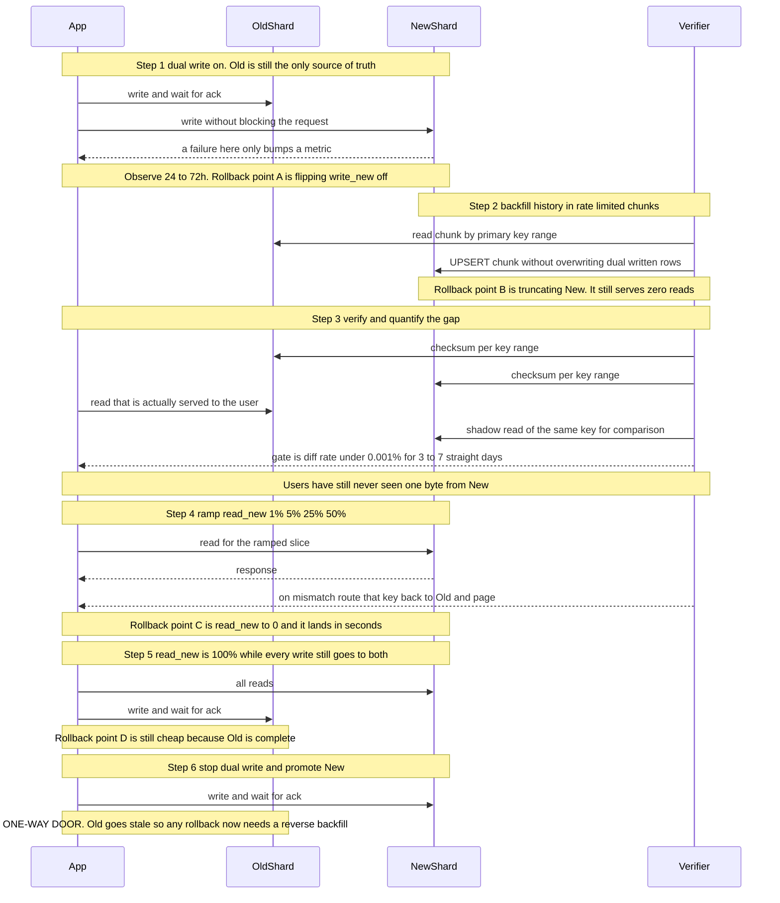

# 05 · 扩展剧本：从 1k 到 1M QPS

> 每一个数量级都是一个新系统。让你到达 10k QPS 的架构，正是让你卡在 100k 的那个架构。
> 扩展的真正技能不是"知道怎么分片（sharding）"，是**知道现在该做哪一步、以及下一堵墙的信号长什么样**。

---

## 读这一章之前

**你在工作中遇到过这个**

用户量翻了三倍，主库 CPU 常年 80%，你在设计文档里写下"分库分表"，排期六个月。
评审会上有人问："现在的瓶颈到底是 CPU、IO 还是锁竞争？"你答不上来。
后来有人翻了慢查询日志，排第一的是一个列表页：先查 100 条订单，再对每条各查一次用户，一次请求打了 340 条 SQL。
补一个索引、改成批量查询之后，CPU 掉到 30%，那份六个月的分片方案再也没人提起过。

**需要先懂的概念**

| 概念 | 一句话 | 详见 |
|---|---|---|
| 垂直扩展 vs 水平扩展 | 换一台更强的机器 vs 加更多台机器；中文都叫"扩容"，英文必须分清 | [00-concepts §4](../00-foundations/00-concepts.md) |
| 副本 / 分片 / 分片键 | 副本解决"会挂"和"读太多"，分片解决"装不下"和"写太多"，两者互相独立 | [00-concepts §5](../00-foundations/00-concepts.md) |
| 最终一致 | 停止写入后最终收敛，中间可能读到旧值，且**没有时间上界** | [00-concepts §6](../00-foundations/00-concepts.md) |
| 复制延迟与读己之写 | 写完立刻读只读副本会读到旧值，解法是会话内粘到主库 | [01-fundamentals §4](../00-foundations/01-fundamentals.md) |
| 幂等 | 同一操作做多次等于做一次 —— 回填与双写全靠它兜底 | [01-fundamentals §5](../00-foundations/01-fundamentals.md) |
| 爆炸半径 | 一次故障最多能波及多大范围；分片不解决它，单元化才解决 | [04-incident-and-chaos.md §10](04-incident-and-chaos.md) |

**这一章要回答的问题**

1. 主库 CPU 已经 80% 了，"分片"应该排在我要做的第几件事？前面还有哪几件更便宜的？
2. 分片键怎么选？为什么"按时间"和"按自增 ID"分片几乎总是错的？
3. 怎么在完全不停机、且每一步都能回滚的前提下，把一个库切成十六个？哪一步之后就回不去了？
4. 什么时候应该停止扩展，转而去改配额和定价？

**本章新引入的术语**

| 术语 | English | 一句话定义 |
|---|---|---|
| 单向门 | one-way door | 做完之后回退代价极高的决策；与"试了不行就撤"的双向门相对 |
| 垂直拆库 | functional partitioning | 按业务域把不同的**表**拆到不同的库（订单库、用户库），区别于把同一张表按行切开 |
| 逻辑分片 | logical shard | 先把数据固定映射到大量虚拟桶（如 1024 个），再把桶映射到物理节点；扩容时只搬桶 |
| 一致性哈希 | consistent hashing | 把节点和 key 映射到同一个环上，增删节点时只有相邻的一小段 key 需要换归属 |
| 热点 / 热分片 / 热键 | hotspot / hot shard / hot key | 负载显著高于均值的那一个分片，或单个 QPS 超过单分片能力的那一个 key |
| 再平衡 | rebalancing | 扩容或缩容之后，把数据在节点之间重新分配的过程 |
| 双写 | dual write | 同一份变更同时写老系统和新系统的过渡状态，老系统仍是唯一真相 |
| 回填 | backfill | 把历史存量数据分批灌进新存储的过程，必须限速、幂等、可断点续传 |
| 影子读 | shadow read | 用户拿到的仍是老系统的结果，同时**异步**读一份新系统的结果做比对，用户零暴露 |
| 扩展-收缩 | expand and contract | 大表 schema 变更的六步：加新列 → 双写 → 回填 → 切读 → 停写老列 → 删老列，每步可独立回滚 |
| 单元化 | cell-based architecture | 把整个技术栈复制成 N 份，每份服务一个用户子集，把爆炸半径压到 1/N |
| 削峰 | smoothing traffic spikes | 把同步的瞬时峰值转成排队的异步处理，让容量按平均值而不是峰值配 |

---

## 1. 第一原理：先找瓶颈，别先加机器

```
扩展的正确顺序（每一步都比下一步便宜一个数量级）：
  ① 别做这件事        → 删功能、改产品、加缓存、改契约（最便宜）
  ② 做得更少          → 减少每请求的工作量：N+1、序列化、多余的索引写
  ③ 做得更快          → 索引、算法、批量、更好的序列化格式
  ④ 更大的机器        → 垂直扩容（对 DB 是最省心的一步，别跳过）
  ⑤ 更多的机器（读）  → 只读副本、缓存层、CQRS（读写分成两个模型：写走原表，
                          读走一份为查询预先组织好的数据，见 §4）
  ⑥ 更多的机器（写）  → 分片（★ 一旦跨过就回不去了）
  ⑦ 更多的独立系统    → 单元化 / 多 region
```

**最常见的错误是从 ⑥ 开始。** 分片是不可逆的复杂度承诺：跨分片事务没了、跨分片查询没了、二级索引（secondary index：主键之外的字段上的索引 —— 分片后它指向的行可能落在别的分片上，所以维护起来变难）变难、运维成本永久增加。

> **面试金句**：
> "我在提议分片之前一定会先问三个问题：**当前单机的瓶颈到底是 CPU、IO 还是锁？把最热的三个查询修掉能不能拖过下一个季度？垂直扩到最大规格还有多少倍空间？**
> 因为分片是一次单向门（one-way door） —— 分完之后每一个新功能都要为跨分片付税。我愿意为推迟这个决定花钱买更大的机器，那通常是我能买到的最便宜的时间。"

---

## 2. 阶段路线表

> 数字是**量级参考**，具体取决于请求复杂度、数据模型与云厂商。成本按 2026 年中主流云厂商的按需价估算，量级用。

| 阶段 | 读 QPS | 架构 | 主要瓶颈 | **撞墙信号** | 月成本量级 |
|---|---|---|---|---|---|
| **S0 起步** | < 1k | 单体 + 单 Postgres + 托管缓存；多 AZ | 无（人是瓶颈） | — | $500 – 3k |
| **S1 读扩展** | 1k – 10k | + 只读副本（read replica） 2–3 个<br>+ Redis 缓存层<br>+ CDN | DB 读、N+1 查询（先查出 N 条记录，再对每条各发一次查询，一次请求变成 N+1 条 SQL） | 主库 CPU > 60%；p99 抖动；慢查询日志变长 | $3k – 15k |
| **S2 写路径瘦身** | 10k – 50k | + 写异步化（队列/Outbox）<br>+ 连接池代理（pgbouncer）<br>+ 表分区（partitioning：把一张大表在**同一个库内**按范围或哈希切成多张物理子表，仍然是单机，与跨机器的分片不是一回事） | **连接数**、写 IOPS、锁竞争（lock contention） | 连接数逼近 `max_connections`；WAL 生成速率打满；vacuum（Postgres 回收被更新/删除的旧行版本的后台进程）追不上 | $15k – 60k |
| **S3 垂直到顶 + 拆分** | 50k – 150k | + 垂直扩到最大规格<br>+ **按业务域垂直拆库（functional partitioning）**<br>+ 冷热分层（hot/cold tiering） | 单机写上限；单表 > 数 TB | 最大规格仍 > 70% 利用率；备份窗口超过维护窗口；schema 变更做不完 | $60k – 200k |
| **S4 水平分片** | 150k – 500k | + **分片（16–64 逻辑分片）**<br>+ 分片感知路由层<br>+ 全局二级索引/搜索外置 | 跨分片查询、热点分片（hot shard）、再平衡 | 单个域的写入仍超过单机；热点租户压垮一个分片 | $200k – 600k |
| **S5 单元化 / 多 region** | 500k – 1M+ | + Cell 架构（每 cell 完整栈）<br>+ 地理路由（geo routing）<br>+ 独立控制面 | 爆炸半径、跨 cell 一致性、部署编排 | 一次故障影响 100% 用户；合规要求数据驻留 | $600k – 数 M |

**几条从这张表读出的判断**：
- **S1 → S2 之间躺着最大的性价比**。多数团队在 5k QPS 时以为需要分片，实际需要的是修掉 3 个 N+1 和一个缺失的索引。
- **S3 的"按业务域垂直拆库"常被跳过**，但它比水平分片简单一个数量级，且能买到 2–5× 空间。
- **S4 之后成本曲线变陡**：不是因为机器贵，是因为运维复杂度和人力成本。**跨过 S4 前先算清楚这笔账是否比"限制业务"更划算**（见 §11）。

### 单组件的天花板（量级，用于快速判断）

| 组件 | 单实例上限（量级） | 先撞哪堵墙 |
|---|---|---|
| Postgres（简单点查，有缓存） | 读 20k–50k QPS；写 5k–15k TPS | **连接数**通常先于 CPU |
| MySQL/InnoDB | 类似量级 | 同上 |
| Redis 单实例 | 10万–15万 QPS | 单线程 CPU / 网络 pps |
| Kafka 单 broker | 数十万 msg/s（取决于消息大小） | 磁盘吞吐 / 网络 |
| 应用实例（Go/Java，简单 JSON） | 5k–20k QPS/核组 | GC / 序列化 / 下游等待 |
| L7 负载均衡（Envoy 单实例） | 数万–十万 RPS | CPU（TLS 握手最贵） |

---

## 3. 垂直扩容（vertical scaling / scale up）：不要跳过，但知道天花板在哪

**垂直扩容是唯一一种"不增加架构复杂度"的扩容手段。** 在 DB 上尤其值。

- 现代云上最大的单机规格可以给到数百核、数 TB 内存 —— 这能覆盖绝大多数公司的一生。
- **收益不是线性的**：数据库的扩展性受 [USL（通用可扩展性定律：描述加核数/加节点时，吞吐为什么会先变缓、再掉头下降的经验模型）](https://en.wikipedia.org/wiki/Neil_J._Gunther)约束，`C(N) = N / (1 + α(N−1) + βN(N−1))`。β（一致性/协调开销）项让吞吐在某个核数后**掉头下降**。经验上单机 DB 超过 64–96 核后收益迅速衰减，因为瓶颈变成锁与 latch 竞争。

**必须垂直转水平（horizontal scaling / scale out）的三个硬信号**：
1. 已在最大规格且持续 > 70% 利用率，且增长曲线在 6 个月内会撞顶。
2. **单表体积让运维不可行**：备份窗口（backup window） > 维护窗口；`ALTER TABLE` 做不完；恢复时间超过 RTO。
3. 单机写入（WAL/binlog 生成速率）打满磁盘或复制带宽 —— **这是唯一真正无解的一堵墙**，读可以靠副本，写不行。

---

## 4. 读扩展（read scaling）与写扩展（write scaling）是两个完全不同的问题

### 读扩展（简单，按顺序做）

| 手段 | 收益 | 代价 |
|---|---|---|
| 1. 修 N+1（N+1 query）与缺失索引 | 常见 5–50× | 零架构代价。**永远先做这个** |
| 2. 缓存（多级） | 10–100× | 一致性复杂度，见 [`01-building-blocks/02-caching.md`](../01-building-blocks/02-caching.md) |
| 3. 只读副本 | 线性（每副本 +1×） | **复制延迟（replication lag）** → read-your-writes 破坏 |
| 4. CQRS / 物化读模型（materialized read model：把一个复杂查询的结果预先算好、单独存一份，读的时候直接取） | 复杂查询 10–1000× | 双写（dual write）复杂度、最终一致，见 [`02-architecture-patterns/02-event-driven-and-cqrs.md`](../02-architecture-patterns/02-event-driven-and-cqrs.md) |
| 5. 搜索/分析外置（ES/ClickHouse） | 聚合查询 100× | 一份数据两处存，需要 CDC（change data capture：从数据库的复制日志里捕获每一次行级变更，实时推给下游） |

⚠️ **只读副本的隐形陷阱**：用户改完资料立刻刷新，读到旧值。解法不是"关掉副本"，而是**按会话粘性（session stickiness）**：写入后的 N 秒内（或直到 LSN 追上 —— LSN 是 log sequence number，Postgres 复制日志位置的单调递增编号，用它就能判断副本追到哪一刻了）该用户的读走主库。在 cookie/会话里存一个 `write_lsn` 是最干净的做法。

### 写扩展（难，选择少）

```
写路径瘦身四步（做完再考虑分片）：
① 异步化：把非关键写移出同步路径 → Outbox + 消费者
     "下单"必须同步；"发通知/更新推荐特征/写审计"必须异步
② 批量化：单条 INSERT → 批量 COPY / 多值 INSERT
     Postgres 上批量提交能把 TPS 提升 5–20×
     （fsync：强制把数据真正刷到磁盘，是写入慢的主要来源；批量提交把一次 fsync 摊给很多行）
③ 瘦身：删掉不必要的索引（每个索引都是一次额外写）
     一张表 8 个索引 = 每次写放大（write amplification，见 `00/00 §11`）9×。
     审计一遍，通常能删掉一半
④ 聚合：高频计数器不要直连 DB
     Redis 累加 + 每 10 秒 flush → 10 万 TPS 变 100 TPS
```

只有这四步做完还不够，才进入分片。

---

## 5. 分片深度剖析

### 分片键（shard key）选择的判据（按重要性排序）

| 判据 | 说明 | 反例 |
|---|---|---|
| **1. 绝大多数查询能带上它** | 否则每个查询都要 scatter-gather（扇出到所有分片再把结果合并，整体延迟由最慢的那个分片决定） | 按 `created_at` 分片，但 90% 查询按 `user_id` |
| **2. 基数足够高** | 分片键的不同值数量 ≫ 分片数 × 100 | 按"国家"分片 → 中国分片是其他 100 倍 |
| **3. 分布均匀（含未来）** | 按当前分布均匀不代表未来 | 按 `tenant_id` 分片：一个企业客户增长 1000× |
| **4. 事务边界与它对齐** | 单分片内可用本地事务，跨分片要 Saga（把一个大事务拆成若干个本地事务，失败时靠事先写好的补偿动作往回退，而不是数据库回滚） | 订单按 `order_id`、库存按 `sku` → 每笔下单都跨分片 |
| **5. 不可变** | 分片键变更 = 跨分片迁移一行 | 用"用户当前所属组织"做分片键，用户会换组织 |

**多租户系统的默认答案是 `tenant_id`**（满足 1、4、5），代价是 3 —— 大租户会造成热点，需要额外处理（见下）。

**复合键技巧**：`shard_key = hash(tenant_id)` 用于路由，但对超大租户改用 `hash(tenant_id, sub_key)` 打散（spread / salt the key）。这要求路由层支持**按租户的例外规则**，从第一天就要设计进去。

### 热点（hotspot）的发现与治理

```
热分片（hot shard）：某个分片的负载显著高于均值
热键  （hot key）  ：单个 key 的 QPS 超过单分片能力

发现（必须有，否则你只能等着被烧）：
  · 按分片的 QPS / CPU / p99 分布图（看的是"最大值 / 中位数"的比值，> 3 就要处理）
  · 采样 key 频率（客户端本地 count-min sketch —— 用很小的固定内存近似统计
    每个 key 出现了多少次的数据结构 —— 定期上报 top-N）
  · 按租户的资源消耗排行榜（多租户系统必备）
```

| 治理手段 | 适用 | 代价 |
|---|---|---|
| **本地缓存热 key（1–5 秒）** | 读热点 | 短暂不一致。**最便宜，先做这个** |
| **key 打散** `hot:{0..9}` | 读热点，写少 | 写要更新 N 份 |
| **把大租户单独放一个分片/一套栈** | 租户级热点 | 路由层要支持例外表；运维多一套 |
| **该租户单独限流/降级** | 恶意或异常流量 | 需要租户级配额体系 |
| **写热点：改成追加 + 异步聚合** | 计数器、排行榜 | 最终一致 |

⚠️ **单调递增（monotonically increasing）的分片键（时间戳、自增 ID）会制造"永远只有最后一个分片在写"的热点。** 这是最常见的错误。用 hash 分片或在键前缀加 bucket。

### 再平衡（rebalancing）：三种方案

| 方案 | 迁移量 | 复杂度 | 适用 |
|---|---|---|---|
| **取模** `hash(k) % N` | 扩容时几乎全量重排 | 最低 | **只适合从不扩容的场景。基本别用** |
| **一致性哈希（consistent hashing） + 虚拟节点（virtual node：让每个物理节点在哈希环上占据多个位置，避免分布不均）** | ~`1/N` | 中 | 缓存层（Redis/Memcached）、无状态路由 |
| **逻辑分片（logical shard，虚拟桶）映射** | 按桶粒度精确控制 | 中（多一层映射表） | ★ **有状态数据库的默认答案** |

**逻辑分片是生产系统的正解**，值得展开：

```
用户 ──hash──► 逻辑分片 (0..1023，固定不变) ──映射表──► 物理节点
                    ↑                              ↑
              数量一开始就定死                可以随时改，粒度是"整个逻辑分片"
              （1024 个足够撑到很大）

优点：
  · 扩容 = 把若干逻辑分片从节点 A 挪到节点 B，其余完全不动
  · 迁移单位可控（1/1024 的数据），可以一次挪一个，失败影响小
  · 映射表极小（几 KB），可以放在配置中心 + 客户端缓存
  · 支持"把某个大租户的逻辑分片单独放一台机器"这种例外
代价：
  · 多一次映射查找（可忽略）
  · 逻辑分片数是**一次性决定**：定太少（如 16）以后受限，定太多（如 100万）管理开销大
    经验值：1024 或 4096
```

Vitess（[vitess.io](https://vitess.io/)）的 keyspace/shard、Elasticsearch 的 primary shard、Kafka 的 partition、Redis Cluster 的 16384 个 hash slot，本质都是这个模型。**Redis Cluster 选 16384 是一个很好的参考点。**

---

## 6. 在线分片迁移（online migration）的完整剧本

这是 Staff 面试里最能区分层次的题目。**关键在于每一步都有独立的回滚点，且任何一步失败都不需要停机。**

```
前置：唯一 ID 已经全局唯一（不能依赖单库自增，见 §8）
      应用层已有"分片路由"抽象（读写都走它，没有裸 SQL 直连）
      有可信的数据校验工具

┌─ P0 双写准备（可回滚：删代码即可）────────────────────────────────┐
│ 1. 上线新分片集群（空的），配置就绪但不接流量                      │
│ 2. 路由层加开关：  write_new = off,  read_new = off              │
│ 3. 灰度打开 write_new：应用同时写老库和新库                        │
│    · 新库写失败**不影响主流程**（只记指标 + 告警），老库仍是唯一真相 │
│    · 观察 24–72 小时：写失败率、延迟增加量                        │
│    ★ 回滚点 A：关掉 write_new，一切如初                          │
└──────────────────────────────────────────────────────────────────┘
┌─ P1 历史回填（可回滚：清空新库）──────────────────────────────────┐
│ 4. 分批回填历史数据（按主键区间 / 按 chunk）                      │
│    · 限速：目标是老库 CPU 增量 < 10%，通常 1k–10k 行/秒          │
│    · 必须幂等（UPSERT），可断点续传，记录进度水位（watermark：      │
│      "已经处理到这个位置了"的标记，重启后从这里接着往下做）        │
│    · **回填的写不能覆盖双写产生的新数据** → 用 `INSERT ... ON      │
│      CONFLICT DO NOTHING`，或比较版本号/更新时间                  │
│ 5. 回填完成后，持续跑一致性校验                                    │
│    ★ 回滚点 B：新库仍无流量，随时可清空重来                       │
└──────────────────────────────────────────────────────────────────┘
┌─ P2 校验（不可跳过，这是整个剧本的核心）──────────────────────────┐
│ 6. 全量校验：按主键区间分块，两边算 checksum 比对                  │
│ 7. 影子读校验（最有价值）：                                        │
│    读请求走老库返回给用户，同时**异步**读新库并比对结果            │
│    → 记录差异率，按差异类型分类                                    │
│    → 目标：差异率 < 0.001% 且剩余差异全部可解释                   │
│    → 差异的常见来源：时间戳精度、NULL 语义、排序不稳定、           │
│      浮点数、回填期间的竞态                                        │
│ 8. 连续 3–7 天差异率达标才进下一步                                │
└──────────────────────────────────────────────────────────────────┘
┌─ P3 切读（可回滚：秒级）──────────────────────────────────────────┐
│ 9. read_new 灰度：1% → 5% → 25% → 50% → 100%                    │
│    · 每一档观察至少 1 小时（覆盖一个流量周期更好）                 │
│    · 监控：错误率、p99、业务指标（★ 不只是技术指标）              │
│    ★ 回滚点 C：把 read_new 调回 0，秒级生效，老库一直是最新的      │
└──────────────────────────────────────────────────────────────────┘
┌─ P4 切写（★ 唯一不可秒级回滚的一步）──────────────────────────────┐
│ 10. 反转真相源：新库为主，老库为副（继续反向双写一段时间）         │
│     · 切换瞬间需要极短的写暂停（或用分布式锁/租约保证不双主）      │
│     · 这一步之后，新库有了老库没有的数据 → 回滚需要反向补数据      │
│     ★ 回滚点 D：反向双写让你还能回去，但要付反向回填的代价        │
│ 11. 观察 1–2 周                                                   │
└──────────────────────────────────────────────────────────────────┘
┌─ P5 收尾 ─────────────────────────────────────────────────────────┐
│ 12. 停止反向双写 → 老库只读 → 保留 30 天 → 归档 → 删除            │
│ 13. 删除路由开关与双写代码（★ 一定要删，否则下一个人不敢动）       │
└──────────────────────────────────────────────────────────────────┘
```

**四条最容易翻车的地方**：
1. **跳过 P2 影子读（shadow read）校验**。直接从回填跳到切读，你会在切读到 25% 时发现数据不对，而这时已经有用户看到了错误数据。
2. **回填（backfill）不限速**，把老库压垮，制造一次自己造的事故。
3. **忘记删除**（delete）与 TTL 过期在双写期的处理。回填时那行已被删，双写把它写回去了 —— 幽灵数据（resurrected row / zombie record）。
4. **P4 没有做"防双主（split-brain）"**。切换瞬间两边都在写同一行 = 数据分叉。用短暂只读窗口或全局租约。

**上面的方框图讲的是"有哪几个阶段"，下面这张时序图讲的是另一件事：在任意时刻，用户的读和写分别落在哪一边 —— 以及四个回滚点各自把你退回到哪个时刻。**



> 📖 **读图要点**：盯住 `App` 这条生命线上"读"箭头指向谁 —— 直到 Step 3 结束，它一根都没指向 `New`，用户从没读过一个来自新库的字节。校验的全部价值就买在这个"零用户暴露"的窗口里，跳过它等于把差异留给 Step 4 的真实用户去发现。另一处是 Step 5 与 Step 6 之间那道分界：前五步的回滚都只是改一个开关（A 关双写、B 清空新库、C 把 read_new 调回 0、D 靠反向双写兜底），代价是分钟级；跨过最后一条 Note，`Old` 从这一刻起开始变旧，回滚从"改开关"变成"再做一次反向回填"。这是整个剧本唯一的单向门，也是唯一需要提前写好审批和演练的一步。

---

## 7. 单元化（Cell / cell-based architecture）：从"扩展"变成"复制"

分片解决了数据容量，**没有解决爆炸半径（blast radius）**：一个坏部署仍然影响 100% 用户。单元化的思路是**把整个栈复制 N 份**，每份服务一个用户子集。

```
        ┌──────────────── 全局控制面（薄，尽量只读）─────────────────┐
        │  路由表：tenant → cell     ·     部署编排     ·     计费    │
        └────────────────────────────┬──────────────────────────────┘
                    ┌────────────────┼────────────────┐
              ┌─────▼─────┐    ┌─────▼─────┐    ┌─────▼─────┐
              │  Cell-1   │    │  Cell-2   │    │  Cell-N   │
              │ LB/App/DB │    │ LB/App/DB │    │ LB/App/DB │
              │ 缓存/队列  │    │ 缓存/队列  │    │ 缓存/队列  │
              └───────────┘    └───────────┘    └───────────┘
              各自完整、互不依赖；一个 cell 全挂 → 影响 ≤ 1/N 流量
```

**收益**：爆炸半径 ≤ `1/N`（AWS 的公开材料里给过"误删数据库时影响限制在约 0.1% 用户"这样的量级）；金丝雀（canary）天然存在（先发一个 cell）；混沌演练可以常态化（拿一个 cell 做）。
**代价**：跨 cell 的查询/迁移复杂；部署要编排 N 次；小规模时资源利用率低（每个 cell 都要有冗余）。
**准入门槛**：至少 3 个 cell 才有意义；通常在 S4/S5 阶段引入。详见 [`03-saas-platform/01-control-plane.md`](../03-saas-platform/01-control-plane.md)。

**规则**：**cell 之间不允许同步调用。** 一旦 Cell-1 同步依赖 Cell-2，你的爆炸半径立刻回到 100%，且付了单元化的全部成本。

---

## 8. 扩展中最常被忽略的六件事

这一节是分水岭 —— 每一条都在真实系统里造成过事故。

### ① 连接数（最常见的第一堵墙）

```
100 个应用实例 × 每实例连接池 20 = 2,000 个连接
Postgres 默认 max_connections = 100，调到 500 就已经很吃力
（每个连接 ~5–10 MB 内存 + 进程调度开销）

对策：pgbouncer / RDS Proxy 做 transaction-mode 池化
      （只在一个事务执行期间才独占一条真实后端连接，事务一提交就还回池子）
      → 2,000 客户端连接收敛成 50 个真实后端连接
陷阱：正因为连接是借来还去的，transaction 模式下不能用会话级特性
      （prepared statement 需配置、`SET` 变量、advisory lock（应用自己定义
        语义的数据库锁）、临时表）
```

**规则**：`应用实例数 × 池大小` 必须在扩容前就算过。自动扩容会在你不注意时把这个乘积翻倍。

### ② ID 生成

单库自增 ID 在分片后立刻失效，且**是在线迁移的前置条件**。选择：

| 方案 | 有序 | 泄漏业务量 | 长度 | 备注 |
|---|---|---|---|---|
| **UUIDv7 / ULID** | ✅ 时间有序 | ❌ 不泄漏 | 128 bit | **默认推荐**：无需协调、索引友好 |
| Snowflake 类 | ✅ | 部分 | 64 bit | 需要机器 ID 分配 + 时钟回拨处理 |
| 号段（segment） | ✅ | ✅ 泄漏 | 64 bit | 需要中心服务 |
| UUIDv4 | ❌ | ❌ | 128 bit | **B-Tree 索引杀手**（随机插入导致页分裂 page split：叶子页写满后被拆成两页，随机插入让这件事持续发生，索引因此膨胀且写放大），避免 |

见 [`01-building-blocks/05-consensus-and-coordination.md`](../01-building-blocks/05-consensus-and-coordination.md)。

### ③ 后台任务与定时任务

`SELECT * FROM orders WHERE status='pending'` 这种全表扫描的定时任务，在 10 万行时无感，在 1 亿行时会把主库打死，**而且它在凌晨跑，没人看着**。

对策：所有后台任务必须**分片化 + 限速（throttling） + 有游标（cursor）**；跑在只读副本上；有单独的资源配额；有超时与熔断。**批处理任务是最容易被遗忘的容量消费者。**

### ④ 报表与分析查询

一个产品经理在生产库上跑 `GROUP BY` 全表聚合，可以让线上 p99 涨 10 倍。**规则：分析查询绝不允许打生产 OLTP 库**（OLTP：面向大量短小读写的在线业务库；对应的 OLAP 是面向大范围扫描聚合的分析引擎，两者的存储与执行方式完全不同）。走 CDC → 数仓/ClickHouse，见 [`02-architecture-patterns/05-data-platform.md`](../02-architecture-patterns/05-data-platform.md)。

### ⑤ 备份窗口

```
数据量增长 → 备份时间线性增长 → 某天它超过了维护窗口
后果：备份与业务高峰重叠 → IO 争抢 → p99 恶化 → 或者备份被跳过
更危险：恢复时间也在增长。1 TB 恢复约几十分钟，20 TB 可能是数小时
        → 你的 RTO 在你不知情时被打破了
```

**规则**：**每季度实测一次恢复时间**并与 RTO 对照。用增量备份（incremental backup） + 副本快照 + 并行恢复。数据量到 TB 级后，"从逻辑备份恢复"就不再是一个可行的方案。

### ⑥ 大表上的 schema 迁移

这是把很多团队钉死在原地的一堵墙。

| 表大小 | 可行做法 |
|---|---|
| < 10 GB | 直接 `ALTER TABLE`（Postgres 的加列带默认值、加 NOT NULL 约束在现代版本已优化） |
| 10 GB – 500 GB | 在线 DDL 工具：[gh-ost](https://github.com/github/gh-ost)、`pt-online-schema-change`（MySQL）；Postgres 用 `CREATE INDEX CONCURRENTLY` + 分步迁移 |
| > 500 GB | **改架构而不是改表**：分区表、双写到新表 + 回填 + 切换（就是 §6 的剧本） |

**通用的六步扩展-收缩法（expand and contract）**（[`03-saas-platform/05-release-engineering.md`](../03-saas-platform/05-release-engineering.md) 有完整版）：加新列（可空）→ 双写 → 回填 → 切读 → 停写老列 → 删老列。**每一步都可独立部署与回滚。**

⚠️ **加索引在大表上会锁写**。Postgres 必须用 `CREATE INDEX CONCURRENTLY`（更慢，但不阻塞），且要处理它失败后留下 INVALID 索引的情况。

---

## 9. 数据归档（archiving）与冷热分层

**大多数系统 90% 的查询只碰 10% 的数据（最近的）。** 但那 90% 的旧数据在拖慢你的备份、索引、vacuum 和迁移。

```
热（近 30 天）  → 主库 SSD，全索引            访问 99%，成本 1×
温（30–365 天）→ 分区表 / 更便宜的存储        访问  1%，成本 0.3×
冷（> 1 年）   → 对象存储 Parquet + 外部表    访问 0.01%，成本 0.02×
                （Parquet：列式存储文件格式，适合放在对象存储上做批量扫描；
                  外部表：让 SQL 引擎能像查普通表一样直接查这些文件）
```

**实现方式（按简单度）**：① 按时间分区表 + 直接 `DROP PARTITION`（最简单，Postgres 声明式分区、MySQL 分区）；② 归档任务搬到冷表/对象存储 + 查询层按时间路由；③ 分层存储的托管方案。

**必须先解决的两件事**：数据保留策略（data retention policy，法务/合规要求保留多久？GDPR 要求删除的怎么办？）与**冷数据的可查询性**（"永远不查"是假设，实际会有合规调证需求 —— 至少要能在小时级别取出来）。

---

## 10. AI / Agent 系统的扩展维度

传统扩展是 CPU/IO 密集，LLM 服务是**显存（GPU memory） + 有状态缓存**密集。三点根本不同：

**① GPU 显存是新的分片维度，KV cache 是新的"热数据"。**
KV cache 的每 token 体积**由注意力结构决定，模型之间差 30 倍**：MHA ~2.5 MB、GQA ~320 KB、MQA ~40 KB、MLA ~70 KB（BF16 口径，FP8 减半）。以 Llama-3.1-70B（GQA）+ FP8 为例是 160 KB/token，8k tokens 的 KV 约 **1.3 GB/请求**。
> ⚠️ 流传的"约 1 MB/token"是 **MHA 时代**（LLaMA-1 65B 那一代）的口径。套到今天的 GQA 模型上会把 KV 体积**高估 3.2×**（FP8 下 6.4×），也就是把一张卡能装下的会话数**低估同样的倍数**。
> 注意 **Llama-2-70B 已经是 GQA**（论文明确 34B/70B 用 GQA），别拿它当 MHA 的例子。扩容前按 [`04/01 §2`](../04-ai-agent-systems/01-llm-serving-infra.md) 的公式自己算一遍。

这意味着**并发数直接被显存卡死**，不是被 CPU 卡死。扩容的第一问题是"我还能放下几个会话的 KV"。

**② 路由必须是缓存感知的（cache-aware），无状态轮询（round-robin）会毁掉性能。**
对照实验（8 pod / 16×H100 / Qwen-32B / 150 租户 × 6k ctx，KV 需求占集群 73%）：P90 TTFT 精确路由 **0.542s** vs 近似 31.1s vs 随机 **92.6s** —— 约 **57× / 170×** 的差距；输出吞吐 8,730 / 6,944 / 4,428 tok/s。
> **推论**：LLM 网关的扩容策略与无状态服务相反 —— **加机器可能让性能变差**，因为前缀缓存被稀释。必须先做会话/前缀亲和路由，再加机器。K8s 侧的事实标准是 [Gateway API Inference Extension](https://gateway-api-inference-extension.sigs.k8s.io/)（已 GA）。

**③ 前缀缓存（prefix caching）是最大的单点杠杆，但也是最大的跨租户泄露面。**
Mooncake 的 agentic 场景实测（GB200×60，Kimi-2.5 NVFP4，输入:输出 ≈ 131:1）：命中率 **1.7% → 92.2%**、P50 TTFT **↓46×**、端到端延迟 ↓8.6×、吞吐 ↑3.8×。
但 PROMPTPEEK（NDSS 2025）证明**共享 prefix cache 可被逐 token 重建他人 prompt**：已知模板时成功率 99%，**无任何背景知识时 95%**。
> **结论必须写死在架构里：前缀缓存在租户内共享，跨租户默认关闭。** 这会直接削掉多租户场景最大的性能杠杆 —— 这是一个必须显式承认、而不是悄悄绕过的取舍。

**④ 成本扩展与流量扩展不同步。**
传统系统扩容成本 ≈ 线性于 QPS。Agent 系统的成本线性于 **token × 步数**，而步数会随任务复杂度非线性增长。参考倍数：单 Agent 相对 chat 约 **4×** token，多 Agent 系统约 **15×**（2025-06 一手口径）。**容量规划（capacity planning）必须按 token 而非请求做**，见 [`04-ai-agent-systems/08-cost-and-latency.md`](../04-ai-agent-systems/08-cost-and-latency.md)。

---

## 11. 什么时候停止扩展，转而限制业务

**这一节是 Senior 和 Staff 的分界。** 无限扩展是一个工程幻觉；真实的公司会在某个点上选择改变业务规则，而不是继续买机器。

**三个应该转向业务侧的信号**：

| 信号 | 含义 | 业务侧手段 |
|---|---|---|
| **单位经济（unit economics）为负**：某类请求的边际成本 > 边际收入 | 你在补贴用户滥用 | 定价改结构（按用量/按结果计费）、免费档降配额 |
| **1% 的用户消耗 50% 的容量** | 长尾（long tail）对多数人是纯成本 | 按套餐设**硬配额（hard quota）**；超量转异步/批处理（Batch 三家均 50% 折扣）；超大客户改独立部署并单独定价 |
| **扩展带来的复杂度正在拖慢功能交付** | 你在为规模付创新税 | 砍功能；把不赚钱的场景下线；把实时改成准实时 |

**三种最常用的"业务侧减压阀"**：
1. **配额与限额（quota and limit）**：每租户的 QPS / 存储 / token / 并发上限。**必须在第一天就有**，事后加配额会激怒所有已经在超量使用的客户。
2. **同步转异步**：把"立刻要结果"改成"提交任务 + 回调"。这一步能把峰值容量需求砍掉 60–80%，因为你获得了削峰（smoothing traffic spikes）的权力。对 LLM 场景收益更大（Batch 模式 50% 折扣 + 缓存读 10%，叠加可到同步未缓存价的 **1/20** 量级）。
3. **定价对齐成本**：让贵的操作显式地贵。这是最有效但最需要跨部门协作的一条 —— **也是 Staff 工程师最该参与的一场对话**。

> **面试金句**：
> "在设计的最后我一定会问：**这个系统在什么规模下会变得不划算？** 如果答案是'10 倍流量时毛利转负'，那我要提的方案就不是分片，是和产品一起改配额或定价。
> 工程师容易把'能不能扛住'当成唯一问题，但扛住一个亏钱的负载不是胜利。"

---

## 12. 什么时候不要这么做

| 反模式（anti-pattern） | 为什么坏 | 正确做法 |
|---|---|---|
| **在 5k QPS 时就分片** | 付了永久复杂度税，买了用不上的容量 | 先修 N+1、加索引、加缓存、加副本、垂直扩 |
| **用取模分片** | 扩容时几乎全量数据搬迁 | 逻辑分片（1024/4096 桶）+ 映射表 |
| **单调递增的分片键** | 永远只有最后一个分片在写 | hash 分片或加 bucket 前缀 |
| **迁移不做影子读校验** | 切读时才发现数据不对，用户已受影响 | P2 阶段连续 3–7 天差异率 < 0.001% |
| **迁移没有回滚点** | 一旦出问题只能硬扛 | 每个阶段都要有明确的回滚动作与代价 |
| **cell 之间同步调用** | 爆炸半径回到 100%，白付单元化成本 | cell 间只允许异步/最终一致 |
| **忘了算连接数** | 自动扩容把连接乘积翻倍，DB 拒绝连接 | pgbouncer + 提前算 `实例数 × 池大小` |
| **分析查询打生产库** | 一条 SQL 毁掉线上 p99 | CDC 到 OLAP 引擎 |
| **LLM 网关无状态轮询扩容** | 前缀缓存被稀释，加机器反而更慢 | 缓存感知/会话亲和路由 |
| **跨租户共享 prefix cache** | 已被实证可重建他人 prompt | 租户内共享，跨租户关闭 |
| **无限扩展，从不谈业务限制** | 扛住了一个亏钱的负载 | 配额、异步化、定价对齐 |

---

## 这一章的三句话

1. **分片是一扇单向门：它买到的容量你可能三年后才用得上，而它收的税从你合并第一个 PR 那天就开始收。** 所以顺序永远是"别做这件事 → 做得更少 → 做得更快 → 更大的机器 → 更多机器扛读"，分片排在第六位；愿意花钱买更大的机器来推迟这个决定，通常是你能买到的最便宜的时间。
2. **扩展路上第一堵墙几乎从来不是 CPU。** 是连接数（`实例数 × 池大小` 这个乘积在自动扩容时会悄悄翻倍）、是超过维护窗口的备份、是那条没人看着的凌晨全表扫描定时任务、是一张大表上做不完的 `ALTER` —— 这些都不会出现在容量规划的 PPT 里，但每一条都真实地把团队钉死过。
3. **无限扩展是一个工程幻觉。** 真实的公司会在某个规模上停止加机器，转而改配额、改定价、把同步改成异步 —— 而配额必须第一天就有，事后加会激怒所有已经在超量使用的客户。扛住一个亏钱的负载不是胜利。

---

## 面试官会追问

1. 你在 5k QPS，DB CPU 80%。列出你按顺序会做的五件事，分片排第几？
2. 分片键怎么选？给我五条判据，并说明多租户系统为什么常选 `tenant_id`、它的代价是什么。
3. 一致性哈希和逻辑分片映射有什么区别？为什么有状态数据库更适合后者？
4. 请完整讲一遍在线分片迁移：每个阶段的回滚点在哪？哪一步之后不可秒级回滚？
5. 影子读校验发现 0.5% 的差异，你会怎么排查？常见的假差异来源有哪些？
6. 扩容时第一个撞到的墙很可能不是 CPU 而是什么？一张 800 GB 的表要加一列并回填，你怎么做？
7. 单元化解决了分片没解决的什么问题？cell 之间为什么不能同步调用？
8. LLM 网关加机器为什么可能让延迟变差？什么时候你会告诉产品"不要再扩了，改配额"？

---

**下一章** → [`06-case-studies/`](../06-case-studies/)
