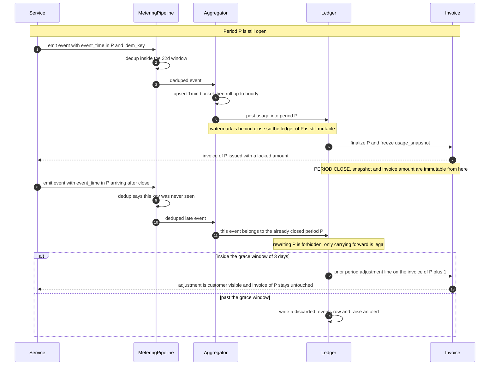

# 04 · 案例：设计用量计费系统（准确性 / 幂等 / 对账）

> 计费系统的正确性目标是**不对称**的：漏计（under-billing）只是亏钱，重计（over-billing）是客诉、退款和法律风险。
> 用同一套机制去保证这两件事，是这道题最常见的失分点。

---

## 读这道题之前

**如果你是直接翻到这道题的**：正文里的 outbox、幂等键、watermark、租约都是当已知用的 —— 案例篇不再解释构件。第 2 题答不出，§3 那句"用两种完全不同的机制"你只会读成一句口号。

**先确认你能回答这三个问题**

1. 双写问题（dual-write）是什么？"先写业务库，再往 Kafka 发一条计量事件"，进程恰好死在两步之间会怎样？Outbox 是怎么把它变成一次写的？
   答不出 → 先读 [`03-messaging-and-streams.md`](../01-building-blocks/03-messaging-and-streams.md) §4
2. at-least-once 投递保证"不丢"，幂等键保证"不重"。那么漏计和重计分别该由这两件里的哪一件负责？为什么一个 exactly-once 同时解决两个，最后两个都保证不了？
   答不出 → 先读 [01-fundamentals §5 幂等](../00-foundations/01-fundamentals.md)、[`03-messaging-and-streams.md`](../01-building-blocks/03-messaging-and-streams.md) §3
3. 事件时间（event time）和处理时间（processing time）差在哪？watermark 判定的到底是什么，它一旦推过去，迟到的事件会怎么样？
   答不出 → 先读 [`03-messaging-and-streams.md`](../01-building-blocks/03-messaging-and-streams.md) §6

**这道题会用到的构件**

| 构件 | 用在哪 | 详见 |
|---|---|---|
| Outbox、at-least-once、DLQ、背压 | §5 为什么日志不能当计费依据、Kafka 写不进去时返回 429 | [`03-messaging-and-streams.md`](../01-building-blocks/03-messaging-and-streams.md) §4、§5 |
| 流处理窗口、watermark、迟到事件 | §6 迟到事件三选一、§7 聚合必须幂等可重跑 | [`03-messaging-and-streams.md`](../01-building-blocks/03-messaging-and-streams.md) §6 |
| 幂等键的派生规则与去重窗口 | §6 幂等键由业务语义派生、32 天窗口那笔 154 GB 的账 | [01-fundamentals §5](../00-foundations/01-fundamentals.md)、[`02-billing-and-metering.md`](../03-saas-platform/02-billing-and-metering.md) §4 |
| 租约（lease）与本地令牌 | §10 实时配额：超支上界 = 实例数 × MAX_LEASE | [`05-consensus-and-coordination.md`](../01-building-blocks/05-consensus-and-coordination.md) §4 |
| 不可变原始层与重算 | §2 推论 2 永久保留原始事件、§9 出账重算的输入 | [`05-data-platform.md`](../02-architecture-patterns/05-data-platform.md) §2、§3 |

**这道题的一句话本质**

> **计费的正确性目标是不对称的，所以它必须由两套互不依赖的机制分别保证。**
> 漏计靠 outbox + at-least-once 保证"一定送到"，重计靠业务语义派生的幂等键保证"不会算两次"。带着这句话往下读 —— 每见到一个组件就问一次："它在守漏计，还是在守重计？"两个都不守的，就是这道题的装饰品。

---

## 1. 需求澄清（前 5 分钟）

| 问题 | 为什么决定架构 |
|---|---|
| 计费维度：token / 请求 / 席位 / 结果（outcome）？ | 决定事件密度，直接决定管道量级 |
| 误差预算（error budget）是多少？漏计和重计**分别**能容忍多少？ | **这是整道题的地基**，见 §3 |
| 账期（billing period）按自然月还是订阅锚点日（anchor day）？租户时区？ | 决定聚合边界与月末峰值 |
| 需要实时硬限额（hard limit）吗？延迟预算多少？ | 决定要不要做本地令牌 + 周期同步 |
| 账期关闭后的迟到事件（late-arriving event）怎么处理？ | **必须写进产品条款，三选一**，见 §6 |
| 争议窗口（dispute window）12 个月还是 24 个月？ | 决定原始事件保留期与审计粒度 |
| 自建到哪一层？评级和发票也自建吗？ | 见 §11 —— 大部分人在这里画错线 |

**本文假设**：LLM 平台型 SaaS，10 万租户，按 token 计费（input / output / cache_read 三种 meter），需要实时硬限额，多币种，账期按订阅锚点日。

---

## 2. 规模估算

```
5,000 万 LLM 请求/天 × 3 个 meter/请求 = 1.5 亿 计量事件/天
  = 1,736 events/s 平均 × 5（日内峰谷比） = 约 8,700 events/s 峰值

事件 ~400 B → 60 GB/天 → 1.8 TB/月
  → Parquet + zstd 约 5× → 360 GB/月 → S3 约 $8/月（2026 年中量级，随时变动）
```

**推论 1**：`8,700 events/s` **远超** Stripe Meter Event 端点 live mode 的 **1,000 calls/s**，也逼近 Meter Event **Stream** API 的单流 **10k events/s**（单商户可到 100k events/s，2026 口径）。
⇒ **必须在自己这一侧预聚合（pre-aggregation）**，原始事件留在自己的数据湖（data lake）里。

**推论 2**：原始事件的存储成本是 **$8/月**。
⇒ **没有任何理由不永久保留原始事件。** 它是重算（recompute）、对账（reconciliation）、争议处理的唯一依据。删它省下的钱，一次客户争议就赔光。

---

## 3. 误差预算：先定义"对"，再谈架构

```
月度计费误差目标（按金额）：
  ├─ 漏计 under-billing    < 0.05%    → 直接的收入漏损
  ├─ 重计 over-billing     < 0.005%   → 客诉/退款/合规，容忍度低一个数量级
  └─ 跨账期错配            < 0.04%    → 非净损失，但制造对账噪声
```

**为什么不对称**：丢事件 = 少收钱，方向**永远对供应商不利** —— $5,000 万 ARR 上 0.5% 的事件丢失 = **$25 万/年**。而重复计费（double billing）是客户看到账单翻倍 → 工单 → 退款，在受监管市场可能是合规事件。

> **面试金句**
> "我会给漏计和重计设两个差一个数量级的预算，并且用**两种完全不同的机制**保证：漏计靠 outbox + at-least-once 保证'一定送到'，重计靠业务语义派生的幂等键（idempotency key）+ 去重窗口（deduplication window）保证'不会算两次'。试图用一个 exactly-once 同时解决两个问题的系统，最后两个都保证不了。"

---

## 4. 高层架构

```
 ┌── 产生 ─────┐  ┌── 传输 ──┐  ┌── 处理 ──────────┐  ┌── 商业逻辑 ─┐  ┌── 收款 ──┐
 │ LLM Gateway │→ │  Outbox  │→ │ 去重（幂等键）    │→ │  Rating     │→ │ 发票     │
 │ (provider   │  │    ↓     │  │      ↓           │  │ (价格计划   │  │   ↓      │
 │  usage 对象 │  │  Kafka   │  │ 预聚合            │  │  版本化)    │  │ 支付网关 │
 │  的产生点)  │  │ (tenant  │  │ tenant×meter     │  │      ↓      │  │   ↓      │
 │             │  │  分区)   │  │   ×1min 桶        │  │  账期快照   │  │ 催收     │
 └─────────────┘  └────┬─────┘  └────┬─────────────┘  └─────────────┘  └──────────┘
                       ↓             ├──→ 实时配额服务（本地令牌 + 周期同步）
                  原始事件湖         └──→ 客户看板（新鲜度承诺 ≤ 15 min）
                  Iceberg on S3            ↑
                  永久保留 ────────────────┴── 对账作业（三方比对，每日）
```

**四条不可动摇的边界**：

1. **计量（metering）与业务写路径解耦**。API 层只负责可靠投递到 log。**绝不在同步请求路径做去重查询** —— 那会把计费系统的可用性绑进产品可用性。
2. **原始事件永久不可变**。聚合、评级、发票都可重算，重算的输入永远是原始事件。
3. **发票 finalize 后不可变**。任何调整走贷记单（credit note）。这是会计要求，不是技术偏好。
4. **看板与账单读同一份聚合表**。两个数据源必然打架。

---

## 5. 深挖一：事件的产生与传输

### 在哪里埋点（instrumentation）

| 位置 | 可信？ | 有业务语义？ | 结论 |
|---|---|---|---|
| 客户端 SDK | ❌ | ✅ | **绝不**。用户能改的东西不能用来收钱 |
| LB / 访问日志 | ✅ | ❌ 不知道 token 数 | 只能做兜底交叉验证 |
| **网关收到 provider 响应的瞬间** | ✅ | ✅ 有 `usage` 对象 | **正解** |
| 业务服务内部 | ✅ | ✅ | 可以，但每个服务都要重实现一遍可靠投递 |

**原则：在最接近"不可否认事实"的位置埋点。** 对 LLM 产品，那个事实就是 provider 返回的 `usage`。

⚠️ **绝不用自己的 tokenizer 估算 token 来计费。** Claude 4.7+ 系列 tokenizer 对同样文本约多产生 **+30% token**（Opus 4.7/4.8/5、Sonnet 5、Fable 5；Sonnet 4.6 及更早为旧 tokenizer）。用旧 tokenizer 估算就是系统性低估 30% —— 这不是误差，是把三成收入送人。

### 为什么不能只靠应用日志

1. **尽力投递（best-effort delivery）**：采样、缓冲区满即丢、磁盘满、agent OOM，没有一环承诺不丢。
2. **schema 无契约**：有人改了字段名，计费静默错一个月。
3. **SLO 不匹配**：日志按 99.9% 设计；计费需要 99.99%+ 且**允许延迟但不允许丢**。
4. **保留期不匹配**：日志留 30 天，争议窗口 12–24 个月。
5. **无法区分"没打日志"和"没发生"** —— 这一条是致命的，对账时你无法证明任何事。

⇒ **计量事件是一等业务事件，走 Outbox → Kafka**（见 `../01-building-blocks/03-messaging-and-streams.md`）。

### 丢失概率量化，然后选机制

| 方案 | 丢失量 | 代价 | 适用 |
|---|---|---|---|
| 进程内缓冲，1 s flush | 每次崩溃 ~1,700 条；日均 5 次重启 → 8,700 条/天 = **0.006%** | 0 | 单事件 < $0.0001 |
| **Outbox**（同事务写 outbox 表 + CDC 投递） | ≈ 0 | 每事务多一次写，+0.5–2 ms | **单事件 > $0.001** |
| 本地磁盘 WAL spool + 后台投递 | ≈ 0（强杀节点除外） | 需要优雅关机 | 无 DB 的网关层 |

LLM 场景一次请求可能值 $0.05 ⇒ **用 Outbox 或 spool，不要用裸缓冲**。

### 背压（backpressure）：宁可拒绝，不要静默丢

Kafka 不可用时，生产者在 `max.block.ms` 到期后默认**丢弃**。必须显式兜底：

```properties
acks=all
enable.idempotence=true
max.block.ms=30000
delivery.timeout.ms=120000
```
应用层：Kafka 写失败 → 落本地 spool → 后台重投 → spool 积压超阈值时**对新请求返回 429**。
**计费事件的背压必须传导到产品。** 一个明确的降级远好过一个静默的收入漏洞。

---

## 6. 深挖二：准确性保证

### 幂等键必须由业务语义派生

```python
# 错：客户端每次重试生成新 UUID → 幂等键形同虚设，重试 3 次收 3 次钱
event_id = str(uuid.uuid4())

# 对：从不可否认的业务标识确定性派生
event_id = uuid.uuid5(NAMESPACE_METERING, f"{request_id}:{meter_name}:{seq}")
#          request_id 由网关在请求入口生成并落库，重试时不变
```

> **"幂等键 = 不会重复计费"是错的。** 幂等只保证同 key 不重复入账，**不保证客户端在重试时生成了同一个 key**。真正的失效模式永远是"重试时生成了新 key"。

去重的事实标准是 CloudEvents 的 `source` + `id`。OpenMeter / Lago / Orb / Metronome / Stripe 都以幂等键为前提，差异在**窗口长度、是否接受迟到事件、是否支持回填（backfill）重算** —— 这几点公开文档披露不足，**选型时必须实测**。去重键格式、"最终一致（eventually consistent）去重"的行业惯例与那个致命误解的完整论证，见 [`03-saas-platform/02-billing-and-metering.md §4`](../03-saas-platform/02-billing-and-metering.md)。

### 去重窗口：它的长度就是一笔存储账

本题的规模把窗口长度直接变成了一张账单。取行业默认的 **32 天**窗口（[OpenMeter](https://openmeter.io/blog/usage-deduplication)）代入本题的 1.5 亿事件/天：

```
窗口 = 你能容忍的客户端重放延迟上限；成本 = 流处理状态存储

1.5 亿/天 × 32 天 = 48 亿键
  精确存储（RocksDB，32 B/键）→ 154 GB 状态
  分层：Bloom filter（48 亿键 @ 1% FP ≈ 5.7 GB）前置
        BF 说"没见过" → 100% 没见过，直接放行（99% 流量走这条）
        BF 说"可能见过" → 查精确存储（1% 流量 + 真重复）
```

**更省的做法**：按 `(tenant_id, hour_bucket)` 分桶去重，窗口压到 7 天，越界事件进**异常队列（dead-letter queue）**而非静默丢弃或静默接受。异常队列必须有人看 —— 它是"客户端重试逻辑坏了"的唯一信号。

### 分区与热点（hot partition）

Kafka 按 `tenant_id` 分区 ⇒ 去重可用本地状态。但巨型租户会打爆单分区。二级分区（secondary partitioning）：
```
partition = f(hash(tenant_id) → 分区组) + (hash(request_id) % 16 → 组内分区)
```
幂等键由 `request_id` 派生，同一 key 永远落同一子分区 ⇒ **去重语义不受影响**。分区设计里少见的免费午餐。

### 迟到事件：三选一，写进合同

用 `event_time`（业务发生）与 `ingest_time`（进入管道）双时间戳 + watermark：

| 情形 | 处理 | 客户可见？ |
|---|---|---|
| 账期关闭前到达 | 正常计入 | 否 |
| 账期关闭后、宽限期（如 3 天）内 | **计入下期**，发票单列 `prior period adjustment` 行 | ✅ 必须 |
| 超过宽限期 | 丢弃 + 落 `discarded_events` 表 + 告警 | ✅ 条款写明 |

**未找到任何主流厂商对"账期关闭后迟到事件"的公开 SLA。** 你必须自己定义并写进条款，否则第一次出现就变成一次谈判。

**账期关闭（period close）必须有明确的"关闭时刻"和"关闭后不可变"语义**：finalize 时把该账期聚合结果快照进不可变表（`usage_snapshots`），发票行引用快照 ID。之后无论上游怎么重算，这张发票的依据不变。

**上面那张表讲的是"怎么处理"，但真正决定处理方式的是事件落在关账时刻的哪一侧。同一条事件、同一个账期归属，只因为到达时间差了几分钟，走的就是两条完全不同的链路：**



> 📖 **读图要点**：关账那两步之后，图里再没有任何一条箭头指回 `Invoice` 的 P 期 —— 迟到事件只能向右（下一期的 adjustment line）或向下（`discarded_events`），不能向左。这条"缺失的边"就是会计不可变性在时间轴上的形状；ASCII 表格能列出三种处理方式，却画不出"处理方式由到达时刻单向决定、且回头路根本不存在"这件事。

### 对账：三方比对（three-way reconciliation），每天跑

```sql
WITH provider AS (   -- provider 的 usage export / 账单 API
  SELECT usage_date, model, token_type, SUM(tokens) tok
  FROM provider_usage_export WHERE usage_date = :d GROUP BY 1,2,3),
metered AS (         -- 我们的计量事件聚合
  SELECT event_date, model, meter, SUM(qty) tok
  FROM metering_events_daily WHERE event_date = :d GROUP BY 1,2,3),
app AS (             -- 应用侧 DB 会话记录（独立来源）
  SELECT date(created_at) d, model, token_type, SUM(tokens) tok
  FROM llm_calls WHERE date(created_at) = :d GROUP BY 1,2,3)
SELECT p.model, p.token_type, p.tok, m.tok, a.tok,
       (m.tok - p.tok)::numeric / NULLIF(p.tok,0) AS drift_vs_provider,
       (m.tok - a.tok)::numeric / NULLIF(a.tok,0) AS drift_vs_app
FROM provider p FULL JOIN metered m USING (...) FULL JOIN app a USING (...)
WHERE abs(coalesce((m.tok - p.tok)::numeric / NULLIF(p.tok,0), 1)) > 0.005;  -- 0.5% 告警
```

**允许的漂移（drift）**：与 provider < 0.5%（存在跨时区归属、舍入、失败请求是否计费的口径差异）；与应用侧 < 0.05%（同一份事实的两条路径，漂移大就是有 bug）。

**必须显式决策：失败请求是否计入用量与预算。** 退款体验好但制造滥用面，计入更公平但对瞬时故障显得苛刻。**这个决定必须写进合同并对租户可见。**

---

## 7. 深挖三：聚合

```
raw events (Iceberg on S3, 永久)
   ↓ 流处理，窗口 1 min，watermark 容忍乱序 5 min
1min 桶 (tenant, meter, model, bucket_start) → qty    ← 看板读这一层
   ↓ 每小时
1h 桶                                                  ← 配额同步读这一层
   ↓ 每日 + 账期关闭时
账期聚合 (tenant, meter, period_id) → qty              ← 评级读这一层
```

**预聚合 vs 查询时聚合**：直接扫原始事件灵活但 1.5 亿行/天 × 30 天 = 看板打不开；预聚合快但**最细粒度决定了你能支持的最细计费维度**，事后加一个 `region` 维度就要重跑历史。
⇒ **预聚合到 `(tenant, meter, model, 1min)`，同时保留原始事件支持临时切片。最细粒度多留 1–2 个维度** —— 加维度比重跑历史便宜得多。

### 聚合必须幂等且可重跑（replayable）

```sql
-- 错：append（重跑就翻倍）           INSERT INTO usage_1min SELECT ...;
-- 对：以桶为主键 upsert，重跑结果相同
INSERT INTO usage_1min (tenant_id, meter, model, bucket_start, qty, event_count, updated_at)
SELECT tenant_id, meter, model, date_trunc('minute', event_time), SUM(qty), COUNT(*), now()
FROM metering_events_deduped WHERE event_time >= :from AND event_time < :to
GROUP BY 1,2,3,4
ON CONFLICT (tenant_id, meter, model, bucket_start)
DO UPDATE SET qty = EXCLUDED.qty,          -- 覆盖而非累加
              event_count = EXCLUDED.event_count, updated_at = now();
```
**计费管道一定会重跑**（上游修 bug、迟到回填、灾难恢复）。不可重跑的聚合等于不可修复。

### 时区与账期边界

**账期按租户的 billing timezone 计算，不是 UTC。** 事件统一存 UTC，转换在聚合时做。

```
账期 = [anchor_day 00:00:00 @tenant_tz, 下一个 anchor_day 00:00:00 @tenant_tz)
必须显式定义的边界（否则每年出两次事）：
  · anchor = 31 日 → 2 月落到 28/29；4/6/9/11 月落到 30
  · 夏令时切换日有 23 或 25 小时 → 用绝对时刻算，不要"加 24 小时"
  · anchor 分布决定月末峰值：全用自然月 = 1 号凌晨 10 万份发票同时生成，DB 必挂
    ⇒ 按 anchor day 打散是免费的削峰
```

---

## 8. 深挖四：评级（Rating）与定价规则

| 原语 | 语义 | 陷阱 |
|---|---|---|
| **阶梯 tiered** | 分档单价 | **graduated（累进）vs volume（一口价）差异巨大** |
| 包含额度 included | 先扣免费额度 | 是否跨期结转（rollover）必须定义 |
| 承诺用量 commitment | 保底消费 | 未用完是否退、是否结转 |
| 折扣 discount | 百分比 / 固定 / 覆盖单价 | 多个折扣**叠加顺序**影响结果 |
| 多币种（multi-currency） | 按租户结算币种 | **汇率必须在出账时刻快照写进发票行，永不重算** |

```
价目：0–1M token $10/M，1M–10M $8/M，>10M $5/M；实际用量 12M
  graduated（累进，每档各算）：1×10 + 9×8 + 2×5 = $92
  volume（一口价，全按最高档）：12×5              = $60
  差 53%。合同里写的是哪个？
```
这是真实的争议来源。**评级引擎必须显式支持两种模式并在价格计划里标注**，不能靠"我们默认是累进"这种口头约定。

### 规则引擎：数据驱动，不要图灵完备

嵌入式脚本（Lua/JS）表达定价 = 不可审计、不可静态校验、不可确定性重放。用声明式（declarative）价格计划（pricing plan）：

```json
{ "plan_id": "pro-2026-07", "version": 3, "immutable": true, "currency": "USD",
  "components": [
    { "meter": "input_tokens", "model": "tiered_graduated", "unit": 1000000, "included": 0.5,
      "tiers": [ {"up_to": 1, "unit_amount": "10.00"}, {"up_to": 10, "unit_amount": "8.00"},
                 {"up_to": null, "unit_amount": "5.00"} ] },
    { "meter": "output_tokens", "model": "flat", "unit": 1000000, "unit_amount": "30.00" } ],
  "commitment": { "amount": "500.00", "period": "month", "drawdown": true } }
```

**三条铁律**：
1. **价格计划版本化且不可变**。订阅指向 `(plan_id, version)`。改价 = 发新版本 + 迁移订阅，不是 `UPDATE`。
2. **评级是纯函数（pure function）**：`rate(usage_snapshot, plan_version, fx_snapshot) → line_items`。同输入永远同输出，可离线重放。
3. **金额用定点数（fixed-point）**（`NUMERIC(20,10)` 或整数最小货币单位），**绝不用 float**；舍入（rounding）规则（方向、在哪一步舍）写死并测试。

---

## 9. 深挖五：出账（invoicing）幂等与重算

```sql
BEGIN;
  -- 幂等键：同一订阅同一账期只能有一张有效发票
  INSERT INTO invoices (id, subscription_id, period_start, period_end, status, currency, fx_snapshot_id)
  VALUES (:id, :sub, :ps, :pe, 'draft', :cur, :fx)
  ON CONFLICT (subscription_id, period_start, period_end) WHERE status <> 'voided'
  DO NOTHING RETURNING id;            -- 无返回 = 已存在，直接返回既有发票
  INSERT INTO invoice_lines  (...) SELECT ...;
  INSERT INTO usage_snapshots(...) SELECT ...;   -- 冻结依据
COMMIT;
```
**发票号必须由不可跳号的序列（gapless sequence）生成**（多数税务辖区的硬要求）⇒ 号码在 finalize 阶段才分配，不能在可能回滚的事务里浪费。

```
draft ──finalize──► open ──payment_succeeded──► paid
  │                  ├──payment_failed × N────► uncollectible
  └──void──► voided  └──void（仅未付时）──────► voided

finalized 之后金额不可变。任何调整只能是 credit_note（贷记单）。
```

### 价格改了要不要追溯（retroactive）？

**默认不追溯。** 已 finalize 的发票是历史事实，改价只影响未来账期。必须调整时：

```
1. dry-run 重算（新价格 + 原 usage_snapshot）
2. diff 报告：受影响发票数、总金额差、按租户分布
3. 人工审批（超阈值需财务 + 法务）
4. 生成 credit note（多收）或 additional invoice（少收），关联原发票
5. 原发票保持不变
```
**"直接 UPDATE 已发出的发票金额"是这道题最严重的错误答案** —— 它破坏会计不可变性，且客户手上的 PDF 和你库里的数字对不上。

### 出账前 sanity check（防定价配置错误）

```
· 本期金额 vs 上期偏差 > ±50%        → 挂起转人工
· 单张发票 > $100,000                → 挂起
· 本轮出账总额 vs 上轮偏差 > ±20%    → 停止整批
（$/M 被写成 $/K 会造成 1000× 跳变，上面三条能兜住）
```
**批量出账必须有"停止整批"开关。** 发出 10 万张错误发票和发出 1 张，成本差三个数量级。

---

## 10. 深挖六：实时配额（quota）检查

配额检查在请求关键路径上：要 **< 5 ms**，又**不能超支**。这两件事在分布式系统里天然冲突。

### 本地令牌 + 周期同步（租约模型）

```
中心配额服务持有租户剩余额度 R
网关实例租借：lease = clamp(R / (2 × active_replicas), MIN_LEASE, MAX_LEASE)
本地原子扣减（纳秒级），耗尽再借
归还：优雅关机时归还；崩溃则等 lease TTL（60 s）自动回收

超支上界 = 活跃实例数 × MAX_LEASE = 20 × 10,000 = 200,000 token
          按 $5/M 计 ≈ $1.00      ← 可接受

自适应收敛：R=1,000 万 → lease 25 万（少调中心）
            R=10 万    → lease 2,500
            R=1 万     → lease = MIN_LEASE = 500（接近精确）
```

> **面试金句**
> "我不追求配额强一致，我追求**超支上界（overage bound）可计算**。20 个实例 × 单次租借 1 万 token = 20 万 token 的理论超支，按当前单价折合 $1。我把这个数字写进设计文档，让业务方决定它可不可接受；不可接受就调小 MAX_LEASE，用更多中心调用换更小上界 —— 这是一个连续旋钮，不是一个是非题。"

### 双层限额（单层一定会出事）

```
软限额（80% / 100%）：告警 + 邮件 + 看板横幅 + 可选降级到小模型
硬限额（120% 或合同上限）：拒绝新请求，返回 402 / 429 + 明确 error code
Agent 场景额外加：单会话 / 单任务的绝对 token 上限
```
单层硬限额会让大租户在月中直接停服（商业灾难）；单层软限额挡不住失控的 Agent 循环 —— **Agent 循环的 token 方差比人类会话大一个数量级**，绝对上限不是可选项。

### 配额服务不可用时

| 档位 | 策略 | 理由 |
|---|---|---|
| 免费 / 试用 | **fail-close** | 滥用面大，拒绝的商业损失接近 0 |
| 付费 | **fail-open + 事后补记** | 停服损失远大于短暂超支；补记靠计量事件（独立管道） |
| 已欠费 / 冻结 | **fail-close** | 状态缓存在网关本地，不依赖配额服务 |

**这就是计量和配额必须是两条独立管道的原因**：配额挂了，计量还在记，事后能补齐。

---

## 11. 支付、催收、看板与自建边界

**支付网关**：幂等键 = `invoice_id`（不是随机 UUID）；**以网关 webhook 为准，本地状态是缓存**；webhook 处理必须幂等（网关会重发）；每日 reconcile job 拉网关 charge 列表比对本地 invoice 状态。

**催收（dunning）**：`D+0` 通知 → `D+3` 重试 → `D+7` 重试 + 降级（只读/限速）→ `D+14` 重试 + 暂停服务（保留数据）→ `D+30` 标记 uncollectible。
全程叠加"卡即将过期"webhook 提前 14 天提醒 —— **这一条 ROI 最高**，大部分失败扣款其实是卡过期。

**客户看板**：UI 上明写"用量数据延迟最多 15 分钟，账单以账期结算结果为准"。
延迟来自预聚合窗口 1 min + watermark 5 min + 调度 5 min + 缓存 3 min。硬做实时就要绕过去重，那会让看板数和账单数不一致。
**铁律：看板和账单读同一份聚合表，只是粒度和时间范围不同。** 两套数据源意味着必然有一天客户拿着看板截图来问为什么账单不一样，而你无法回答。

### 自建到哪一层（build vs buy）

```
┌─────────────────────────────────────────────────────────────┐
│ 计量（埋点/投递/去重/预聚合）        → 自建                  │
│   与产品语义强耦合；8,700 eps 超过多数计费 SaaS 的入口限额；  │
│   原始事件必须留在自己手里（争议 + 重算 + 审计）             │
├─────────────────────────────────────────────────────────────┤
│ 评级 / 发票 / 税 / 多币种 / 催收     → 外购                  │
│   税务合规不是你的核心竞争力，且随辖区持续变化               │
└─────────────────────────────────────────────────────────────┘
```

**2026 年的市场现实**：一年内三起并购 —— [Stripe 完成收购 Metronome](https://stripe.com/newsroom/news/stripe-completes-metronome-acquisition)（2026-01-14）、[Adyen 完成收购 Orb](https://www.adyen.com/knowledge-hub/talon-one-orb-acquisitions)（2026-07-01，$335M 全现金）、[Kong 收购 OpenMeter](https://konghq.com/blog/news/kong-acquires-openmeter)（2025-09）。
⇒ **独立的计量/计费 SaaS 正被支付与网关巨头收编。** 把"被收购后产品方向变化"当成真实的选型风险；剩下的主要独立开源选项是 [Lago](https://getlago.com/)（自建 ingestion，支持 REST/batch/SDK/Kafka/Kinesis/S3 多路接入，去重逻辑可自定义）。

**别指望用量计费（usage-based billing）能修复毛利（gross margin）。** AI 产品平均毛利约 **52%**（传统成熟 SaaS 基准 80–90%，ICONIQ 2026 口径），而这个数字是在大量公司**已经转向用量计费之后**测出来的。真正拉毛利的是模型路由、缓存、蒸馏和规模效应（见 `../04-ai-agent-systems/08-cost-and-latency.md`）；定价只是把成本方差转移给客户。

---

## 12. 什么时候不要这么做

| 情况 | 该做什么 |
|---|---|
| < 100 万事件/天，< 1,000 租户 | Postgres 一张 `usage_events` + 唯一索引去重 + 每日 cron 聚合。**别上 Kafka** |
| 纯席位制订阅，无用量维度 | Stripe Billing 直接接，不需要计量管道 |
| < 1,000 eps 且能接受厂商去重语义 | 直发计费 SaaS 的 meter event 接口。**但仍要在自己这边留一份原始事件** |
| 内部成本归因（不对外收钱） | 误差预算放宽到 5%，采样 + 日志即可，别按计费标准建 |

**十条反模式（anti-pattern）**：

1. **用应用日志计费**。见 §5 的五条理由。
2. **用自己的 tokenizer 估算 token**。Claude 4.7+ 的 +30% 会教你做人。
3. **幂等键用随机 UUID**。重试即重复计费。
4. **在同步请求路径做去重查询**。把计费的可用性绑进产品可用性。
5. **> 1k eps 还直发计费 SaaS**。必须自己预聚合。
6. **聚合作业用 append 而不是 upsert**。重跑即翻倍。
7. **`UPDATE` 已 finalize 的发票**。破坏会计不可变性，且和客户手上的 PDF 对不上。
8. **单层配额**。月中停服 或 挡不住 Agent 循环，二选一。
9. **看板和账单两套数据源**。必然有一天对不上，且你无法解释。
10. **"最终一致，差一点点无所谓"**。0.5% 丢失在 $5,000 万 ARR 上是 $25 万/年，**且方向永远对你不利**。

---

## 13. 失败模式（failure mode）与演进

| 失败模式 | 信号 | 应对 |
|---|---|---|
| **漏计**：Kafka 不可用，生产者静默丢 | 事件数 / 请求数比值下降 | `acks=all` + spool 兜底；**这个比值是最好的漏计探针** |
| **重计**：消费者 rebalance 重放 | 对账 drift 转正、客诉 | 幂等消费 + 去重窗口吸收 rebalance 期重复 |
| 去重状态膨胀 → 流处理 OOM | 状态大小增长曲线变陡 | 分桶去重 + BF 前置 + 缩短窗口；别靠加内存拖 |
| 定价配置错误（$/M 写成 $/K） | 本期总额跳变 1000× | 出账前 sanity check + 批量停止开关 |
| 月末出账把 DB 打挂 | 1 号凌晨 p99 飙升 | anchor day 打散 + 出账队列限流 |
| 巨型租户单分区热点 | 单分区 lag 持续增长 | 二级分区（见 §6） |
| 时钟漂移（clock drift）导致事件落错桶 | 跨桶漂移在午夜集中 | `event_time` 由服务端赋值（不信客户端时间）+ NTP 监控 |
| 配额与计量不一致 | 客诉"没超却被拒" | 配额本就是近似的，**必须允许人工临时提额且立即生效** |
| 迟到事件撑破已关闭账期 | `discarded_events` 增长 | 宽限期策略 + 异常队列有人值守 |

```
v0  < 100 万事件/天
    Postgres：usage_events（唯一索引去重）+ 物化视图 + 每日 cron；Stripe Billing 出账。
    撞墙信号：聚合查询 > 30 s；唯一索引写入争用。

v1  < 1,000 eps
    Kafka + 流去重 + 预聚合 1min 桶；原始事件落 S3。评级/发票仍外购。
    撞墙信号：去重状态 > 单机内存；对账 drift > 0.5%。

v2  1,000–10,000 eps   ← 本文
    分层预聚合 + Iceberg 湖 + 独立配额服务 + 三方对账 + 自建评级预览（出账仍外购）。
    撞墙信号：计费 SaaS 入口限流；多币种/多法人实体需求。

v3  多法人实体 / 收入确认（ASC 606）/ 渠道分成
    计费成为独立财务系统，需要专职团队与外部审计。
    信号：审计师开始问"你怎么证明这张发票的数字是对的" —— 答案必须是
          "原始事件 → 快照 → 发票的可重放链路"，而不是"我们的系统很可靠"。
```

---

## 面试官会追问

1. 漏计和重计哪个更严重？你的误差预算分别是多少？用什么机制分别保证？
2. 幂等键怎么生成？为什么"客户端传 UUID"是错的？
3. 去重窗口设多长？这个长度的成本是什么？48 亿个键怎么存？
4. 账期已经关闭，一条 3 天前的事件到了。你怎么处理？这件事需要客户知道吗？
5. 怎么和 provider 的账单对账？允许多大漂移？漂移超了先怀疑谁？
6. 实时配额要 5 ms 内返回又不能超支，怎么做？你的超支上界是多少，怎么算的？
7. 定价改了，上个月的发票要不要重算？如果法务说必须调，你怎么做？
8. 客户看板显示 100 万 token，账单显示 103 万。为什么会发生？怎么从架构上杜绝？
9. 用量计费系统你会自建哪一层、外购哪一层？分界线画在哪，为什么？

---

**下一篇** → [05-realtime-collaboration.md](05-realtime-collaboration.md)
