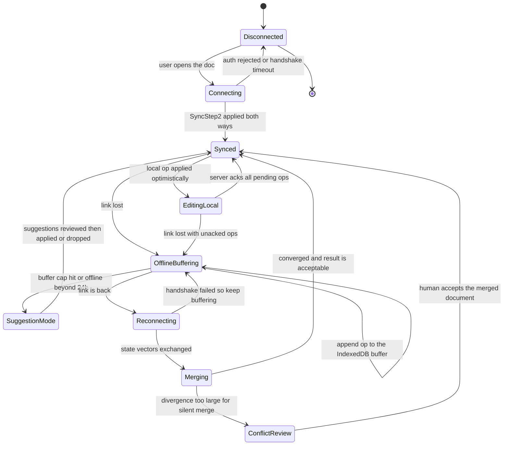

# 05 · 设计实时协作编辑（real-time collaborative editing）

> 这道题被误解成"选 OT 还是 CRDT"。真正的胜负手是另外两件事：**服务端能不能读懂一条操作的语义**（决定你的权限模型上限），以及**光标数据有没有和文档数据分家**（决定你的带宽账单是 $18k 还是 $109k）。
> 收敛算法只是这两件事的一个副产品。

---

## 读这道题之前

**如果你是直接翻到这道题的**：这题的地基不是 CRDT，是"单写者 + 租约 + fencing"。第 2 题答不出，§4.2 那句"影响行数 = 0 就自杀"会读成一句黑话 —— 案例篇不再解释构件。

**先确认你能回答这三个问题**

1. 有状态服务和无状态服务差在哪？"按 doc_id 路由到唯一一台机器"这句话，让扩容和故障转移分别多付出什么代价？
   答不出 → 先读 [00-concepts §9 有状态 vs 无状态](../00-foundations/00-concepts.md)、[`04-networking-and-edge.md`](../01-building-blocks/04-networking-and-edge.md) §2、§4
2. 租约（lease）和 fencing token 各解决什么？老 owner 因为 GC 停顿 15 s 被判死、新 owner 已接管，老 owner 醒来继续写 op log —— 没有 epoch 会发生什么？
   答不出 → 先读 [`05-consensus-and-coordination.md`](../01-building-blocks/05-consensus-and-coordination.md) §3、§4
3. "两个副本最终会长得一样"和"任何时刻读到的都一样"是两回事。收敛（convergence）属于哪一个？它保证过顺序吗？
   答不出 → 先读 [00-concepts §6 一致性的两种含义](../00-foundations/00-concepts.md)、[01-fundamentals §4 一致性模型全谱](../00-foundations/01-fundamentals.md)

**这道题会用到的构件**

| 构件 | 用在哪 | 详见 |
|---|---|---|
| 有状态服务、长连接、WebSocket 与扇出 | §3 三条数据通路、§4.2 按 doc_id 路由的 single-writer | [00-concepts §9](../00-foundations/00-concepts.md)、[`04-networking-and-edge.md`](../01-building-blocks/04-networking-and-edge.md) §2、§4 |
| 租约、fencing token、脑裂 | §4.2 lease + epoch，被 fence 立刻自杀不重试 | [`05-consensus-and-coordination.md`](../01-building-blocks/05-consensus-and-coordination.md) §3、§4、§8 |
| Little's Law（并发 = 到达率 × 会话时长） | §2.1 从 DAU 推出 25 万峰值连接与 13.9 万活跃文档 | [00-concepts §2](../00-foundations/00-concepts.md)、[`02-capacity-estimation.md`](../00-foundations/02-capacity-estimation.md) §3 |
| 出网流量与成本 | §2.4 光标降采样把带宽账单从 $109k 压到 $18k | [`04-networking-and-edge.md`](../01-building-blocks/04-networking-and-edge.md) §7 |
| op log / 快照 / 对象存储的分工 | §4.3 热尾只为恢复服务、快照与版本历史是三件不同的事 | [`01-storage-engines.md`](../01-building-blocks/01-storage-engines.md) §7 |

**这道题的一句话本质**

> **服务端能不能读懂一条操作的语义，决定你的权限模型上限；光标数据有没有和文档数据分家，决定你的带宽账单。**
> OT / CRDT 的选择只是这两件事的副产品。带着这句话往下读 —— 每见到一条数据通路就问一次："它丢了会怎样？它必须经过单写者吗？"这两个答案不同的东西，永远不该放进同一条通路。

---

## 1. 需求澄清：我会问的 12 个问题

| # | 问题 | 假设答案 | 为什么这个答案改变架构 |
|---|---|---|---|
| 1 | 编辑什么？纯文本、富文本（rich text）、还是结构化画布？ | **富文本文档**（段落 + 行内格式 + 嵌入块） | 富文本让 OT 的 transform 函数组合爆炸；决定序列 CRDT 要不要 Peritext 式的格式标记 |
| 2 | 单文档并发编辑者上限？ | 软上限 **50**，硬上限 **100**（超出转只读） | 这个数字直接决定扇出层（fan-out layer）要不要分层。[Google Docs 的公开上限也是 100 个同时编辑者](https://support.google.com/docs/answer/2494822) |
| 3 | 观众（只读）会不会远多于编辑者？ | 会，直播式评审场景 1 : 200 | 只读连接**不应该**经过单写者（single-writer）序列化点（serialization point），走独立扇出层 |
| 4 | 离线编辑要支持多久？ | 目标 **7 天**，超过转"建议模式"（suggestion mode） | 7 天是 OT 服务端历史保留窗口能撑住的量级；无限离线基本排除 OT |
| 5 | 需要段落级/字段级权限（paragraph-level permissions）吗？ | **需要**（"这一节只有法务能改"） | **这一条杀死了纯 CRDT 哑中继（dumb relay）架构**（见 §4.6） |
| 6 | 需要完整版本历史与"回到某个时刻"吗？ | 需要，保留 **1 年** | 决定 op log 不能无脑压缩掉；决定版本是"里程碑聚合"而不是每个 op |
| 7 | 延迟 SLO？ | 本地回显（local echo）**0 ms**（乐观应用）；远端可见 p95 **< 150 ms** 同区、**< 400 ms** 跨区 | 150 ms 是"感觉像实时"的门槛；决定是否需要多区域 session |
| 8 | 丢编辑可接受吗？ | **不可接受**。ack 后必须持久 | 决定 ack 语义（见 §4.2），这是本题最容易答错的正确性点 |
| 9 | 端上是浏览器为主吗？ | 是，90% Web + 移动端只读 | 决定 CRDT 库要能在 JS 里跑得动；决定文档大小上限 |
| 10 | 数据规模？ | 5,000 万文档，中位 8 KB 文本，p95 100 KB | 决定单文档内存与快照策略 |
| 11 | 合规？ | 需要硬删除（GDPR）+ 审计谁改了哪一段 | CRDT 的墓碑与审计粒度在这里会打架 |
| 12 | AI 会不会作为协作者写入文档？ | 会（v2） | Agent 一次插 5,000 字符，会打爆按人类节奏设计的批处理（batching）与限流（rate limiting） |

**问题 5 和问题 12 是这道题的分水岭。** 只答"用 CRDT，Yjs 现成的"的候选人，会在这两条上直接翻车。

---

## 2. 规模与成本估算

### 2.1 连接与活跃文档（Little's Law）

```
MAU 1,000 万        DAU 200 万        人均 2.5 个协作会话/天
平均会话时长 W = 20 min = 1,200 s
────────────────────────────────────────────────────────
λ = 200万 × 2.5 / 86,400            ≈ 58 会话/s
L = λ × W = 58 × 1,200              ≈ 69,400 平均并发连接
峰谷比 3.5×（工作时段高度集中）      ≈ 250,000 峰值并发连接

平均每文档同时在线 1.8 人（多数时候只有一个人在写，其他人开着标签页）
活跃文档数 = 250,000 / 1.8          ≈ 139,000
```

### 2.2 操作速率

```
250,000 连接中真正在打字的约 6%     = 15,000 人
击键在客户端合并到 200 ms 粒度      → 4 op/s/人
────────────────────────────────────────────────
全局 op 速率  = 15,000 × 4          = 60,000 op/s
出站广播      = 60,000 × 0.8（平均协作者数）≈ 48,000 msg/s
```

### 2.3 内存

```
单文档常驻 = CRDT 状态 + 会话结构
  CRDT 状态 ≈ 可见文本 × 3–8（元数据 + 索引；重度编辑过的文档取上限）
  中位 8 KB 文本  → 约 40 KB
  会话结构（连接表 / awareness / 待落盘缓冲）→ 固定约 30 KB
  加权均值取 120 KB
────────────────────────────────────────────────
139,000 × 120 KB ≈ 16.7 GB 常驻
```

按 12 台 session 节点（16 vCPU / 64 GB）：每台约 1.2 万活跃文档、5,000 op/s。**瓶颈是 CPU 不是内存** —— 单核处理一条 Yjs update（解码 + 应用 + 重编码）约 20–50 μs，留 25% 利用率余量后每台约 2 万 op/s 上限。

### 2.4 带宽：这道题真正的账单

```
【文档 op】 48,000 msg/s × 150 B                      ≈ 7.2 MB/s

【光标 / presence】
  250,000 连接中，处在 ≥2 人房间的约 30%             = 75,000 人
  不降采样（跟随鼠标 60 Hz）：75,000 × 60 × 120 B    = 540 MB/s
  服务端聚合到 10 Hz 合并帧：  75,000 × 10 × 120 B    =  90 MB/s
```

| 方案 | 出网 | 月出网量 | 月成本（$0.07/GB，2026 年中量级，随时变动） |
|---|---|---|---|
| presence 不降采样 | 547 MB/s | 1,417 TB | **≈ $99,000** |
| presence 聚合到 10 Hz | 97 MB/s | 252 TB | **≈ $17,600** |
| 计算侧（24 台 16vCPU/64GB） | — | — | ≈ $12,300 |

> **面试金句**：
> "把在线状态和文档操作放进同一个通道，是这道题最常见的失分点。光标是 60 Hz、可丢、不需要顺序的数据；文档 op 是低频、不可丢、必须严格有序的数据。混在一起，等于让最不重要的数据决定最重要的数据的延迟 —— 顺带把带宽账单打成计算成本的 8 倍。**光标降采样（downsampling）这一个动作，在这个规模上每月省 8 万美元，比任何算法优化都值钱。**"

### 2.5 存储

```
op log   60,000 op/s × 60 B（压缩后的增量）= 3.6 MB/s = 311 GB/天
         只保留 7 天热尾  ≈ 2.2 TB（放 Postgres 分区表 / ScyllaDB）
快照     每文档「空闲 10 s 或累计 500 op」触发；活跃文档 300 万/天 × 3 次 × 60 KB
         ≈ 540 GB/天 写入，只保最新一份 → 稳态 5,000 万 × 60 KB ≈ 3 TB
版本历史 每文档每天 ≤ 24 个里程碑，只存当日合并增量 ≈ 20 KB/文档/天
         300 万活跃文档 × 20 KB = 60 GB/天 ≈ 21 TB/年 ≈ $480/月（对象存储）
```

**结论：这个系统的成本结构是「带宽 > 计算 > 存储」，与绝大多数无状态 Web 服务相反。** 优化预算应该按这个顺序分配。

---

## 3. 高层架构

```
                       ┌──────────────┐
  浏览器 ── WSS ──────▶│  Edge / WS   │  终结 TLS、鉴权、心跳、限流
   本地 CRDT 副本      │   Gateway    │  单机 3–5 万长连接
   + IndexedDB         └──────┬───────┘
                              │ 按 doc_id 一致性哈希 + 租约
              ┌───────────────┴────────────────┐
              ▼                                ▼
     ┌─────────────────┐              ┌─────────────────┐
     │ Doc Session #A  │              │ Presence Hub    │   ← 独立通道
     │ (single-writer) │              │ LWW + TTL 30 s  │     不落盘
     │  内存 CRDT 状态 │              │ 10 Hz 合并帧     │     可丢
     │  op 序列化点    │              └─────────────────┘
     │  权限校验       │
     └───┬─────────┬───┘
         │         │ 批量（200 ms / 500 op）
         │         ▼
         │   ┌───────────────┐   ┌──────────────┐   ┌─────────────┐
         │   │  Op Log (DB)  │──▶│ Snapshotter  │──▶│ 对象存储     │
         │   │  7 天热尾     │   │  合并 + 压缩 │   │ 快照/版本历史│
         │   └───────────────┘   └──────────────┘   └─────────────┘
         │
         └──▶ ┌──────────────┐   只读扇出：不经过 single-writer
              │ Read Fanout  │   订阅 op 流，向观众广播
              └──────────────┘

  ┌──────────────┐    权限变更事件（目标 p99 < 2 s 生效）
  │ AuthZ Service│──────────────────────────▶ Doc Session
  └──────────────┘
```

三条数据通路，**可靠性等级完全不同**，这是整个设计的骨架：

| 通路 | 顺序 | 可靠性 | 持久化 | 延迟目标 |
|---|---|---|---|---|
| 文档 op | 严格全序（每文档） | 不可丢，ack = 已持久 | 是 | p95 < 150 ms |
| presence / 光标 | 无序 | 可丢 | **否** | 尽力，100 ms 帧 |
| 权限变更 | 因果序 | 不可丢 | 是 | p99 < 2 s 生效 |

---

## 4. 深挖

### 4.1 OT vs CRDT：把选择判据钉死

**OT（Operational Transformation，操作变换）** 的核心是一个变换函数：并发的两个操作 `a`、`b`，需要满足

```
TP1（收敛性）:  apply(apply(S, a), T(b, a))  ==  apply(apply(S, b), T(a, b))
TP2（可组合）:  T(T(c, a), T(b, a))  ==  T(T(c, b), T(a, b))
```

**关键事实：有中心服务器定序时，只需要 TP1。** 这就是 [Jupiter 模型](https://svn.apache.org/repos/asf/incubator/wave/whitepapers/operational-transform/operational-transform.html)（Google Wave / Google Docs / [ShareDB](https://github.com/share/sharedb) / Etherpad 走的路）：服务端维护全局序列号，每个客户端与服务端之间维护一条二维状态空间，客户端把本地 op 变换到服务端的最新状态。**TP2 是去中心化 OT 才需要的，而历史上被证伪的 OT 论文几乎全部栽在 TP2 上** —— 这是"OT 不要自己写"的真正原因。

**CRDT（Conflict-free Replicated Data Type，无冲突复制数据类型）** 走另一条路：给每个字符一个全局唯一、可全序比较的标识（如 `(clientID, clock)`），合并变成集合并集 + 确定性排序。收敛保证是 **SEC（Strong Eventual Consistency）**：收到相同的操作集合 ⇒ 状态必然相同，与到达顺序无关。代表实现：[Yjs](https://github.com/yjs/yjs)（YATA 算法）、[Automerge](https://automerge.org/)（RGA 系）。

| 维度 | OT（Jupiter 式） | 序列 CRDT（Yjs/Automerge） |
|---|---|---|
| 收敛（convergence）保证 | 依赖 transform 函数正确性；富文本下人工验证极难 | **算法层面保证**（SEC），与顺序无关 |
| 是否必须中心服务器 | **是**（否则要 TP2） | 否，可 P2P / local-first |
| 元数据开销 | ≈ 0（只存文本 + op 日志） | 每个字符一个 ID；Yjs 用连续插入的 run-length 合并摊薄，实测常见 **3–8×** 可见文本，重度编辑的老文档可到 **数十倍** |
| 墓碑（tombstone） | 无 | **有且默认不可回收**。Yjs 丢弃已删内容、只保 delete-set 区间；Automerge 保留更多历史 |
| 实现复杂度 | 每对操作类型都要写 transform，随类型数 **O(n²)** 增长；富文本 + 表格 + 嵌套块基本失控 | 复杂度封装在库里；业务侧只做数据建模 |
| 意图保留（intention preservation） | transform 可以编码语义意图（"缩进"而非"插 4 个空格"） | 只保证收敛，不保证符合人的预期。经典缺陷是**并发插入交错（interleaving）**（两人同时在同一位置写句子 → 字符级交错）。[Fugue（arXiv 2305.00583）](https://arxiv.org/abs/2305.00583) 证明了"最大非交错"并给出算法 |
| 富文本格式 | transform 组合爆炸 | 需要专门设计，见 [Peritext](https://www.inkandswitch.com/peritext/)（格式作为带端点的 mark，而非字符属性） |
| Undo | **非常难**（要求逆操作 + 变换到当前状态） | 不平凡但可做；Yjs `UndoManager` 按 `origin` 过滤实现"只撤销我自己的" |
| **服务端能否理解操作语义** | **能**。op 就是 `{retain:5, insert:"x"}`，服务端可校验、可裁剪、可审计 | **默认不能**。update 是二进制增量，哑中继看不懂。要看懂必须在服务端跑同一套 CRDT 运行时 |
| 离线时长上限 | 受**服务端历史保留窗口**限制（保 7 天 = 最多离线 7 天） | 受客户端存储与合并耗时限制，理论上无限 |
| 典型选择 | Google Docs、Etherpad、ShareDB | Yjs 生态、Zed、Apple Notes 系、绝大多数 local-first 应用 |

**第三条路（容易被忽略，但在 B2B 产品里越来越主流）：服务端权威（server-authoritative）+ 客户端 rebase。**
客户端乐观应用（optimistic update）本地 mutation，服务端按到达顺序重放并成为唯一真相，客户端收到服务端状态后回滚本地未确认的 mutation 再重放。Linear 的 sync engine、Replicache/Zero 走这条。它不保证任意并发文本编辑的"好结果"，但对**结构化数据**（任务、字段、状态机）是最简单且服务端语义最强的方案。[Figma 的多人协作](https://www.figma.com/blog/how-figmas-multiplayer-technology-works/)也在这一族：属性用 LWW 寄存器、子节点顺序用 fractional index，作者明确写了"因为有中心服务器，我们不需要真正的 CRDT"。

**选择判据（按优先级从上往下走，第一个命中的就是答案）：**

```
1. 需要离线数周 / P2P / 无服务端信任？        → CRDT（且必须接受服务端做不了细粒度校验）
2. 需要段落级权限、服务端内容审核、字段级审计？ → OT，或"服务端跑 CRDT 运行时"的重方案
3. 数据是结构化字段而非自由文本？             → 服务端权威 + rebase（别上 CRDT）
4. 富文本 + 中心服务器 + 无极端离线需求？      → CRDT（Yjs），因为 OT 的富文本 transform 你写不对
5. 纯文本 + 已有成熟 OT 栈？                  → 留在 OT，不要为了时髦重写
```

> **面试金句**：
> "OT 和 CRDT 的选择不是算法品味问题，是**你的服务端要不要读懂一条操作**。要做段落级权限、服务端内容审核、字段级审计、按人裁剪的差异视图，你就必须能在服务端解开操作 —— 这时'CRDT + 哑中继'的架构会把你逼进死角，你只能整篇授权。反过来，要 local-first、离线数周、P2P，OT 的 TP2 会把你逼进另一个死角。**先钉死权限粒度和离线时长这两个需求，算法就没得选了。**"

### 4.2 文档会话的服务端模型

**核心约束：每个文档在任意时刻只能有一个写者。** 这不是性能优化，是正确性要求 —— op 的全序（total order）、快照的一致性、权限校验的时点都依赖它。

```
路由：hash(doc_id) → 虚拟节点 → session 节点
锁：  租约（lease）表，TTL 10 s，持有者每 3 s 续租
      lease 表字段：doc_id, owner_id, epoch(单调递增), expires_at
```

**Fencing 是这里唯一不能省的东西。** 老 owner 因为 GC 停顿 15 s 被判死，新 owner 接管；老 owner 醒来继续写 op log —— 如果没有 epoch，两份 op 交错写入，文档永久损坏。

```sql
-- op log 写入必须带 fencing token，存储层拒绝过期 epoch
INSERT INTO doc_ops (doc_id, seq, epoch, payload, created_at)
SELECT $1, $2, $3, $4, now()
WHERE $3 >= (SELECT epoch FROM doc_lease WHERE doc_id = $1);
-- 影响行数 = 0 ⇒ 我已被 fence，立刻自杀，不要重试
```

**ack 语义：这道题最容易答错的正确性点。**

| 策略 | 客户端何时认为"已提交" | 风险 | 额外延迟 |
|---|---|---|---|
| ack-on-apply | 服务端内存里应用完就 ack | **owner 崩溃 = 静默丢编辑**，用户毫无感知 | 0 |
| ack-on-broadcast | 广播给其他人后 ack | 同上，且已经"泄露"给别人了 | 0 |
| **ack-on-durable** | op 批量落盘并复制后 ack | 无 | 本地 SSD fsync 0.5–2 ms + 跨 AZ 复制 1–2 ms ≈ **+2–5 ms** |

**在 150 ms 的端到端预算里，2–5 ms 是 3%。所以默认必须是 ack-on-durable。** 唯一的例外是 presence（本来就可丢）。注意本地回显仍然是 0 ms —— 客户端乐观应用，ack 只影响"未确认编辑"的 UI 标记和离线缓冲的清理时机。

**故障转移（failover）的恢复路径与时间预算：**

```
t=0     owner 进程消失
t≤10s   lease 过期（TTL 10 s；这是恢复时间的下界，别设太长）
t+50ms  新 owner 抢到 lease，epoch+1
t+120ms 从对象存储拉最新快照（60 KB，p99 < 80 ms）
t+180ms 重放 op log 尾巴（限制 ≤ 2,000 op，Yjs 重放约 25 μs/op ≈ 50 ms）
t+200ms 客户端重连，带 last_seen_seq，服务端补发缺口
────────────────────────────────────────────
恢复 ≈ 10.2 s，其中 98% 是 lease TTL
```

**优化点很明确：主动交接（graceful handoff）而不是等 lease 过期。** 滚动发布时 owner 主动 flush + 释放 lease + 向客户端发 `redirect` 帧，恢复降到 **200 ms**。lease TTL 只兜底真正的机器猝死。

**op log 尾巴必须限长**（≤ 2,000 op）是硬约束：它直接等于故障恢复时间。快照触发条件写成"空闲 10 s **或** 累计 500 op **或** 距上次快照 60 s"三者取先。

### 4.3 持久化：op log + 快照 + 版本历史是三件不同的事

```sql
-- 热尾：只为恢复服务，7 天后删
CREATE TABLE doc_ops (
  doc_id     uuid,
  seq        bigint,          -- 文档内单调递增，服务端分配
  epoch      int,             -- fencing
  actor_id   uuid,            -- 审计与权限追溯
  payload    bytea,           -- Yjs update 二进制增量
  created_at timestamptz,
  PRIMARY KEY (doc_id, seq)
) PARTITION BY RANGE (created_at);

-- 快照：只为加载与恢复服务，只保最新一份
CREATE TABLE doc_snapshot (
  doc_id      uuid PRIMARY KEY,
  up_to_seq   bigint,
  object_key  text,           -- 对象存储路径
  size_bytes  int,
  updated_at  timestamptz
);

-- 版本历史：为人服务，粒度是"里程碑"不是"op"
CREATE TABLE doc_version (
  doc_id      uuid,
  version_id  bigint,
  label       text,           -- 自动生成或用户命名
  base_version bigint,        -- 增量链的基点；每 100 个版本存一次全量
  delta_key   text,
  actors      uuid[],         -- 这一段是谁改的
  created_at  timestamptz,
  PRIMARY KEY (doc_id, version_id)
);
```

**版本历史（version history）≠ op log。** 用户要的不是 60,000 个 op，是"今天下午张三改的那一版"。里程碑（milestone）的切分规则：

```
新建里程碑的条件（任一命中）：
  · 距上一个里程碑 ≥ 30 min 且期间有编辑
  · 编辑者集合发生变化（有人加入 / 离开编辑）
  · 累计变更 ≥ 2,000 字符
  · 用户显式命名
上限：每文档每天 ≤ 24 个自动里程碑（防止长会话炸出上千版本）
```

存储用**增量链（delta chain）+ 周期基线**：每 100 个版本存一次全量快照，之间存合并增量。恢复任意版本 = 拉一次基线 + 重放 ≤ 100 个增量，p99 < 300 ms。

**压缩（compaction）**：把 N 个连续 update 合并成一个（Yjs 的 `Y.mergeUpdates`），删掉中间态。收益在重度编辑文档上是 **5–20×**。但注意：**压缩会丢失细粒度归属信息（attribution）**（谁在什么时刻改了哪个字符），所以审计要求高的租户必须关掉压缩或延长热尾窗口 —— 这是一个要在合同里写清楚的成本项。

**GDPR 硬删除（hard delete）的坑**：删除文档不能只删索引。要删 op log 分区、删快照对象、删版本链，还要处理**已同步到客户端 IndexedDB 的副本**（只能靠下次连接时下发 tombstone 指令，做不到强保证 —— 这一点必须对法务如实说明）。

### 4.4 Presence 与光标：高频低价值数据的正确姿势

Presence 的数据模型天然是 **per-user 的 LWW 寄存器 + TTL**（[y-protocols/awareness](https://github.com/yjs/y-protocols) 就是这个），字段：`{user_id, cursor_anchor, cursor_head, selection, color, last_seen}`。

**四条硬规则：**

1. **不进 op log，不落盘，不参与 single-writer 序列化。** 服务重启后 presence 全部丢失是**正确行为**，客户端 1 秒内会重新上报。
2. **服务端聚合成帧，而不是逐条转发。** 逐条转发是 O(N²) **消息**；聚合成"每 100 ms 一帧，帧里带房间内所有人的最新光标"是 O(N) 消息 / O(N²) 字节，常数小一个数量级。
3. **发送频率随人数自适应降级（adaptive degradation）**：
   ```
   client_send_hz  = clamp(60 / max(1, N/5), 5, 20)     # N = 房间人数
   server_frame_hz = clamp(200 / max(1, N),   2, 10)
   # N=3  → 客户端 20 Hz，服务端 10 Hz
   # N=50 → 客户端 6 Hz，服务端 4 Hz
   ```
4. **TTL 清理**：30 s 无心跳即从房间移除。不做这一步，"幽灵用户"会永远挂在头像条上，是最高频的用户投诉之一。

**光标锚点的正确表示**：不要存字符偏移量（`position: 1234`），别人在你前面插入一个字符你的光标就飘了。要存 **CRDT 的相对位置（relative position）**（Yjs `createRelativePositionFromTypeIndex`，本质是"锚在某个字符 ID 的左/右"），这样并发编辑下光标自动跟随。这是个 1 行代码的选择，但错了以后表现为"多人编辑时别人的光标乱跳"，且极难定位。

### 4.5 离线编辑与重连合并

**同步协议（Yjs sync protocol 的两步握手 two-step handshake，值得直接抄）：**

```
客户端 ──▶ 服务端 :  SyncStep1(state_vector)      # "我有这些 clientID 的哪些 clock"
服务端 ──▶ 客户端 :  SyncStep2(diff)              # 只发客户端缺的部分
服务端 ──▶ 客户端 :  SyncStep1(server_state_vector)
客户端 ──▶ 服务端 :  SyncStep2(diff)              # 客户端把离线期间的编辑推上去
```

State vector 的大小 = 曾经编辑过该文档的客户端数 × ~16 B。一个被 500 人编辑过的文档，state vector 约 8 KB —— **这是"每次连接都要传"的固定开销**，长期看要做 clientID 回收（把同一用户的多次会话合并到稳定的 clientID，而不是每次连接生成新的）。不做这件事，三年后老文档的握手会传几百 KB。

**OT 侧的对应问题更硬**：客户端离线期间的 op 需要逐个变换到服务端当前状态，要求服务端保留从客户端离线那一刻起的全部 op。所以 **OT 的离线上限 = 服务端 op 历史保留窗口**，这是个可以直接换算成存储成本的数字。

**离线时长的产品判据（这是 Staff 级的回答）：**

| 离线时长 | 处理方式 | 理由 |
|---|---|---|
| < 5 min | 静默自动合并 | 冲突面小，字符级交错概率低 |
| 5 min – 24 h | 自动合并 + 顶部横幅"你离线期间有 3 人编辑过，[查看差异]" | 收敛结果可能不符预期，必须让人知道 |
| 24 h – 7 d | **转"建议模式"**：离线编辑作为 suggestion 提交，不直接落文档 | 大概率产生字符级交错乱码。自动收敛在这里是**错误的产品行为** |
| > 7 d | 存为分支副本，人工合并 | — |

**"CRDT 保证收敛"和"CRDT 保证结果可用"是两件事。** 收敛只保证所有人看到同一份乱码。超过阈值就要把控制权还给人 —— 这是把算法保证翻译成产品保证的关键一步。

**上表按离线时长分了四档，但客户端实际是个状态机：它不知道自己会离线多久，只能在缓冲的过程中撞到上限时改变行为。把这些态和它们之间走得通、走不通的边画出来，上表的四档就落到了具体的转移上：**



> 📖 **读图要点**：只有 `Merging` 有一条通向人的出边（`ConflictReview`）—— 自动路径上人最多被打扰一次，这是设计的目标而不是巧合。同样关键的是 `OfflineBuffering` 那条指向 `SuggestionMode` 的边：缓冲**有上限**，撞到上限时切换的是**产品语义**（编辑降级为 suggestion）而不是继续攒或者丢。还有一条**不存在的边**值得盯一眼：`EditingLocal` 没有任何路径直达 `ConflictReview` —— 本地编辑在被合并之前永远不产生冲突，冲突只诞生在 `Merging` 这一个点上。

### 4.6 权限与实时鉴权变更

**三个必须分开的时点：**

```
① 连接时     ── 校验 doc 的读权限，签发短 TTL 会话令牌（5–15 min）
② 每个 op 写入时 ── 校验写权限 + 该 op 影响的范围是否在授权域内   ← 最容易漏
③ 权限变更事件 ── 主动推送到 session owner，目标 p99 < 2 s 生效
```

**只在 ① 做校验是最常见的漏洞**：用户在编辑中被移除权限，长连接还挂着，他可以继续写几分钟甚至几小时。正确做法是把权限快照放进 session 的内存态，每个 op 进来时做 O(1) 检查，并订阅权限变更事件做失效（invalidation）。

**权限变更的传播链路：**

```
AuthZ 服务写入 → 发事件（doc_id, user_id, new_role）
  → 广播到所有 session 节点（Redis Pub/Sub 或 NATS，p99 < 200 ms）
  → owner 更新内存权限表
  → 该用户的连接：降级为只读 / 断开
  → 客户端：清空未确认的本地 op（不能偷偷补交）+ UI 变只读
目标 p99 < 2 s，写进 SLO 并做端到端探针监控
```

**未提交的本地 op 怎么办？** 服务端在 ② 无条件拒绝（返回 `403 + rejected_seq`），客户端必须能**回滚本地已乐观应用的编辑**。CRDT 的回滚不是天然的 —— 要用 `UndoManager` 按 origin 撤销，或者干脆丢弃本地状态从服务端重新加载。后者更简单也更安全，代价是用户丢几秒钟的输入 —— 在"权限被撤销"这个场景下这是可接受的。

**段落级权限：这里就是 §4.1 判据 2 的落点。**

```
纯 CRDT 哑中继：服务端收到 40 字节二进制 update，看不出它改了哪一段
                ⇒ 只能做整篇 allow/deny
方案 A：服务端跑同一套 CRDT 运行时，解码 update，检查受影响的 Y.Type 路径
        ⇒ 可行，但服务端 CPU 成本 ×2，且升级 CRDT 库要前后端同步（版本地狱）
方案 B：把权限边界做成文档边界 —— 一个权限域 = 一个子文档（Yjs subdoc）
        ⇒ 强烈推荐。权限校验退化成连接时的文档级校验，O(1)，无版本耦合
方案 C：改用 OT，op 本身自带语义（{retain:120, insert:"x"}）
        ⇒ 服务端天然能算出影响范围
```

**方案 B 是绝大多数场景的正确答案**：把"这一节只有法务能改"建模成"这一节是一个独立的子文档，法务组有写权限"。你把一个困难的运行时问题换成了一个简单的数据建模问题。

**最后一条必须说清楚的合规事实**：撤销读权限只能阻止获取**新**内容，客户端内存和 IndexedDB 里已有的全文你拿不回来。这在合同里要写成"撤销后不再同步新内容"，而不是"撤销后无法访问"。

### 4.7 大文档与超多协作者的退化

三个正交的规模轴，撞墙信号完全不同：

| 轴 | 撞墙点 | 信号 | 对策 |
|---|---|---|---|
| **文档大小** | 约 50 万字符 | 首次加载解码 + 建索引 > 500 ms，浏览器主线程卡顿 | 拆子文档（subdoc）懒加载（lazy loading）；块级文档模型（Notion 式）从根上避开 |
| **并发编辑者** | 约 50 人 | 单文档出站消息 = N × op_rate × N | 广播批处理（见下）；> 100 人强制转只读 |
| **历史长度** | 约 100 万 op | 快照变大、重放变慢、state vector 膨胀 | 定期 compaction；clientID 回收；版本历史另存 |
| **观众数** | 约 500 人 | session owner 单核被扇出打满 | 只读扇出层（订阅 op 流，不经过 owner） |

**并发编辑者的扇出计算与批处理收益：**

```
【逐 op 广播】100 人，每人 5 op/s
  出站消息 = 100 × 5 × 99 ≈ 49,500 msg/s（单文档！单核必死）

【50 ms 批处理，把窗口内所有 op 合并成一帧】
  出站消息 = 100 人 × 20 帧/s = 2,000 msg/s        ← 降 25×
  代价    = 中位延迟 +25 ms（150 ms 预算里占 17%，可接受）
```

**批处理窗口是可调的旋钮（knob），且应该按房间人数自适应**：`window_ms = clamp(N * 0.6, 20, 80)`。2 个人时 20 ms（几乎实时），100 个人时 60 ms（换 25× 的 CPU 与带宽）。

**AI 作为协作者的特殊退化（v2 必须处理）**：Agent 一次插入 5,000 字符，产生一个巨大的 update，且不遵守人类的击键节奏。三条约束：

1. **限流**：Agent 客户端单独一档，每秒最多 1 个 op、单 op ≤ 20 KB，超出排队。
2. **标记 origin**：所有 Agent 产生的 op 带 `origin: "agent:<run_id>"`，让 `UndoManager` 能一键撤销"AI 刚才做的全部改动"。这是产品必需，不是锦上添花。
3. **默认走建议模式**：Agent 的写入落到 suggestion 层而非文档主体，人确认后才合并。这与"人在回路（human-in-the-loop）对不可逆动作（irreversible action）是必需控制"是同一条原则（见 [04-ai-agent-systems/07-agent-security.md](../04-ai-agent-systems/07-agent-security.md)）。

---

## 5. 什么时候不要这么做（反模式）

| 反模式（anti-pattern） | 为什么错 | 正确做法 |
|---|---|---|
| **为结构化数据上 CRDT** | 任务状态、库存、余额需要**全局不变量（invariant）**（"总和 = 100"、"状态机只能这样迁移"），CRDT 从定义上表达不了跨副本约束 | 服务端权威 + 客户端 rebase；不变量在服务端校验 |
| **自己实现 OT 的富文本 transform** | 每对操作类型一个函数，O(n²) 增长；学术界发表过的 OT 算法有相当比例后来被证伪 | 用成熟库（ShareDB json0 / Yjs）；真要自己写就只做纯文本 |
| **把 presence 写进 op log** | 60 Hz × N 的可丢数据污染不可丢通道；op log 一天涨几个 TB；恢复重放变慢 | 独立通道、不落盘、TTL 过期 |
| **每个 op 一次 DB 写** | 60,000 op/s = 60,000 IOPS，且 fsync 进关键路径 | 每文档 200 ms / 500 op 批量；ack 等批次落盘（+2–5 ms） |
| **无 fencing 的会话迁移** | GC 停顿导致双 owner，op 交错写入 → 文档永久损坏且无法自动检测 | 单调 epoch + 存储层拒绝过期写；写失败即自杀 |
| **纯 CRDT 哑中继 + 细粒度权限** | 服务端读不懂 update，只能整篇授权 | 权限边界做成文档边界（子文档）；或服务端跑 CRDT 运行时 |
| **光标存字符偏移量** | 并发插入后光标飘移，表现为"别人光标乱跳"，极难定位 | CRDT 相对位置（锚到字符 ID） |
| **离线 30 天后自动收敛** | 收敛 ≠ 结果可用；产出字符级交错的乱码 | 超过 24 h 转建议模式，超过 7 天转分支 |
| **让观众走 single-writer 路径** | 1,000 个只读连接把序列化点的 CPU 吃光 | 只读扇出层订阅 op 流 |
| **把版本历史等同于 op log** | 用户要"下午三点那一版"，不是 60,000 条 op；且 op log 要能压缩 | 里程碑聚合 + 增量链 + 周期基线 |
| **P2P 直连省服务器钱** | NAT 穿透失败率在企业网络里高得离谱；且没有服务端就没有权限、审计、合规删除 | 服务端中继；P2P 只作为同局域网的延迟优化 |

---

## 6. 失败模式与应对

| 失败 | 症状 | 立即动作 | 结构性对策 |
|---|---|---|---|
| **双 owner（脑裂 split-brain）** | 同一 seq 出现两条不同 op；用户看到文档"抽搐" | 按 epoch 判定，回滚低 epoch 的写入，从快照重建 | fencing token（唯一真正的解）+ 写失败即自杀，绝不重试 |
| **CRDT 状态损坏** | 某文档加载即崩，或不同客户端不收敛 | 隔离该文档，从最近的**已知良好快照**回滚，丢弃之后的 op | 快照写入时存校验和；定期在影子进程里做"从零重放 = 当前状态"的一致性巡检 |
| **presence 风暴** | 出网带宽 5 分钟内涨 8×，op 延迟跟着涨 | 全局降级：服务端帧率强制降到 2 Hz，或直接关闭 presence | presence 与 op 的带宽配额物理隔离（physical isolation）（不同端口/不同 QoS），presence 永远可以被牺牲 |
| **热文档**（全公司 800 人打开同一份年度计划） | 单个 session 节点 CPU 100%，其他文档被拖累 | 该文档强制只读 + 转只读扇出层 | 单文档编辑者硬上限 100；owner 节点做每文档 CPU 配额（隔板 bulkhead） |
| **快照写入失败但 op log 还在涨** | 恢复时间从 200 ms 变成 30 s | 告警 `snapshot_lag_ops`，触发强制快照 | op log 尾巴长度硬上限 2,000；超过即拒绝新 op（宁可短暂只读也不要恢复不了） |
| **权限撤销未生效** | 已被移除的人还在写 | 强制断开该用户全部连接 | 每 op 校验（不是只在连接时）+ 权限变更端到端探针，p99 > 2 s 即告警 |
| **老文档 state vector 膨胀** | 打开一份三年前的文档要传 400 KB 握手 | 无 | clientID 回收（按用户稳定分配，不是按连接）；定期 compaction |
| **客户端 IndexedDB 与服务端分叉（divergence）** | 用户看到的和别人不一样，刷新才好 | 提供"强制从服务端重载"按钮 | 客户端周期性比对 state vector 摘要，不一致即自动重同步 |
| **AI 写入打爆批处理** | 单个 update 2 MB，广播帧超过 WebSocket 帧上限 | 拒绝并要求 Agent 分片 | Agent 单独限流档 + 单 op 大小上限 20 KB |

---

## 7. 演进路线

```
 v0  ──────────────▶  v1  ──────────────▶  v2
 0–50 租户            50–2,000 租户         2,000+ / 企业
 ~1.5 人月            ~6 人月               ~1.5 人年
```

**v0（能上线的最小系统）**
- 单区域；Yjs + `y-websocket` 风格的单进程 session；Postgres 存 op log 与快照。
- 无 lease（进程重启即全部重连），无只读扇出，presence 直接转发。
- 权限只做文档级，连接时校验一次。
- ack-on-durable 从**第一天**就要做 —— 这是唯一一件后补代价极高的事（补的时候要处理历史上已经丢过的编辑，无法追溯）。
- **升级触发信号**：单进程内存 > 24 GB；出网带宽账单超过计算账单；用户开始报"编辑丢了"。

**v1（做成一门生意）**
- 一致性哈希（consistent hashing）+ lease + fencing（§4.2）；主动交接把发布期的恢复从 10 s 压到 200 ms。
- presence 独立通道 + 自适应降采样（§4.4）—— 这是投入产出比最高的一项。
- 快照 + 压缩 + 里程碑版本历史（§4.3）；op log 热尾 7 天。
- 只读扇出层；单文档编辑者上限与广播批处理（§4.7）。
- 每 op 权限校验 + 权限变更推送（§4.6）；段落级权限用子文档建模。
- **升级触发信号**：跨区域用户抱怨延迟（p95 > 400 ms）；单文档并发超过 50 成为常态；开始收到"编辑记录要保留 7 年"的合规要求。

**v2（企业与规模）**
- 多区域：文档归属主区域（数据驻留要求也在这一层落地），远端用户走边缘只读副本 + 写请求回主区。**不要做多主（multi-master）—— 多主的 CRDT 收敛没问题，权限和审计会失控。**
- 子文档模型全面化：大文档拆块，按需加载；这同时解决了大小、权限、加载三个问题。
- AI 协作者作为一等参与者：独立限流档、origin 标记、默认建议模式（§4.7）。
- 合规删除流水线（op log 分区删除 + 对象存储删除 + 客户端 tombstone 下发）。
- **升级触发信号**：合规成为销售阻塞项；单区域出网带宽成本 > $50k/月；AI 写入量超过人类写入量。

> **演进的判据不是"做得更好"，是"旧方案在什么信号下失效"。** 这里每一档的触发信号都可以直接做成告警：`snapshot_lag_ops`、`presence_egress_bytes / op_egress_bytes`、`authz_propagation_p99`、`state_vector_bytes_p99`。

---

## 面试官会追问

1. OT 的 TP1 和 TP2 分别是什么？为什么有中心服务器时只需要 TP1？这对你的架构意味着什么？
2. 你选了 CRDT。现在产品要"这一节只有法务能改"。你的服务端收到一个 40 字节的二进制 update，怎么知道它改了哪一段？给我三个方案和各自代价。
3. 客户端收到 ack 之后 200 ms，session 节点崩了。这条编辑还在不在？你的 ack 语义是什么，多花了多少延迟？
4. 一个进程 GC 停顿 15 秒被判死，新 owner 接管，老 owner 醒过来继续写。会发生什么？怎么防？
5. 100 个人同时编辑一份文档，出站消息是多少？你怎么把它降一个数量级，代价是多少毫秒？
6. 用户离线 30 天后回来，他的 800 处编辑要怎么合并？"CRDT 保证收敛"在这里够不够用？
7. 你的出网带宽账单是计算成本的 8 倍。钱花在哪儿了？给出两个能立刻生效的旋钮和各自的收益量级。
8. 用户的编辑权限在他打字的中途被撤销。已经乐观应用在他屏幕上、但还没提交的那 3 个字符怎么办？
9. 版本历史和 op log 有什么区别？为什么不能把 op log 直接当版本历史给用户看？存储上差多少？
10. 一个 Agent 作为协作者接入，一次插入 5,000 字符。你的系统有几处会被打爆？分别怎么处理？
11. 什么情况下你**不会**用 CRDT？给出三条可量化的判据。

---

**下一篇** → [06-notification-platform.md](06-notification-platform.md)
