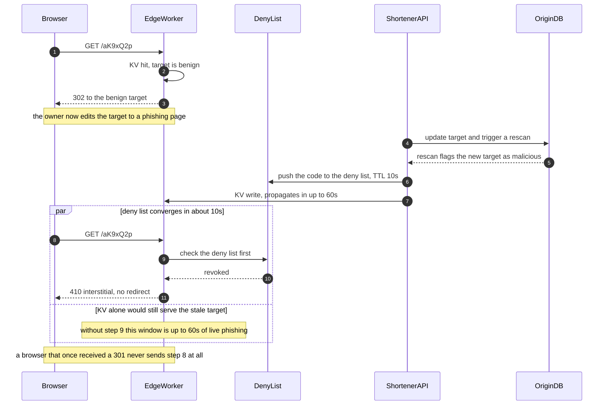

# 08 · 设计短链接服务（Design a URL Shortener）

> 这题的题面是"把长 URL 变短"，但没有一分是给"变短"这件事的。
> 真正被打分的是三件事：**发号器（ID generator）在零协调的前提下怎么保证唯一**、**100:1 读放大下缓存放在哪一层**、
> 以及**你知不知道 301 是一个不可撤销的决定**。第三件事一句话就能定生死，而且它不在任何数据结构里。

---

## 读这道题之前

**如果这是你在 `START-HERE` Week 1 的诊断性检查点**：先只用“W1 最低前置”完成 45 分钟计时。你此时应能覆盖需求、估算、API / 数据模型、缓存和基本失败路径；发号器、共识与负载卸载还没排期，第一次答不出是预期结果。计时结束后再用“后续深挖前置”标记知识缺口，**不要把未学内容计为失败**。

### W1 最低前置：计时前要会

先确认你能回答这三个问题：

1. 缓存穿透和缓存雪崩的区别是什么？空值缓存（negative caching）解决的是哪一个？
   答不出 → 先读 [`01-building-blocks/02-caching.md` §3](../01-building-blocks/02-caching.md#3-三大经典故障穿透击穿雪崩)
2. "先 `SELECT` 看看有没有，没有就 `INSERT`"，两个并发请求会发生什么？数据库的默认隔离级别挡不挡得住？
   答不出 → 先读 [`00-foundations/00-concepts.md` §7](../00-foundations/00-concepts.md#7-事务与隔离级别)
3. "最终一致"承诺多久收敛？边缘 KV 说"写入最多 60 秒后全球可见"，这算不算 bug？
   答不出 → 先读 [`00-foundations/00-concepts.md` §6](../00-foundations/00-concepts.md#6-什么是一致性--一个词两种完全不同的意思)

**完整阅读会用到的构件**

| 阶段 | 构件 | 用在哪 | 详见 |
|---|---|---|---|
| **W1 最低前置** | 容量估算 | §2 算出 62⁷ 与 0.104% 填充率，并判定“带宽不是瓶颈、可用性才是” | [`00/02 §1–§3`](../00-foundations/02-capacity-estimation.md#1-估算的黄金流程) |
| **W1 最低前置** | 缓存模式 / 穿透 / 热 Key | §4.4 先解释 cache-aside、空值缓存和爆款短链 | [`01/02 §2–§4`](../01-building-blocks/02-caching.md#2-缓存模式) |
| **后续深挖前置** | 单位经济与边缘缓存 | §2 的价格算例与 §4.4 的 CDN / 边缘 KV 选择；W1 对照时可先跳过 | [`00/02 §6`](../00-foundations/02-capacity-estimation.md#6-成本建模单位经济unit-economics)、[`01/02 §6`](../01-building-blocks/02-caching.md#6-cdn-与边缘缓存) |
| **后续深挖前置** | 单向门（one-way door）与可逆性 | §4.3 为什么 301 难以撤回，以及何时仍应选 302 | [`00/03 §2`](../00-foundations/03-tradeoff-framework.md#2-决策的四象限法) |
| **后续深挖前置** | 协调成本；共识 ≠ 复制 | §4.1 号段为什么可减少协调；§4.2 自定义码为什么需要线性化的命名空间占用 | [`01/05 §1、§9`](../01-building-blocks/05-consensus-and-coordination.md#1-共识解决的到底是什么问题) |
| **后续深挖前置** | 有界队列与负载卸载 | §4.5 点击管道“满即丢并计数”，绝不反压到跳转 | [`05/03 §6`](../05-reliability/03-resilience-patterns.md#6-负载卸载load-shedding与准入控制) |

> **对照规则**：W1 检查点只给前两行计分；后续各行用于告诉你 Week 2 之后为什么要回来重做，而不是要求你提前补课。

**这道题的一句话本质**

> **短链服务不是"把 URL 变短"，是一张必须永远可撤回的全球只读跳转表。**
> 唯一性靠数学（**双射置换**：一种把整数打乱成另一个整数的变换，输入和输出严格一一对应 —— 不同的输入永远得到不同的输出，所以"撞码"在数学上不可能发生，§4.1 展开）而不是运行时检查，撤回能力靠 302 而不是 301。前者决定写路径的尾延迟有没有上界，后者决定一条链接变成钓鱼站时你还关不关得掉它 —— 带着这两句往下读，§4.1 和 §4.3 就不是两个孤立的技术点，而是同一个判断的两半。

---

## 0. 45 分钟怎么分配这道题

这题的陷阱是**太容易开始**：任何人都能在 3 分钟内画出 `code → url` 的表。所以时间必须主动押在别处。

| 时间 | 做什么 | 这一段的得分点 |
|---|---|---|
| **0:00–0:04** | 6 个澄清问题，其中 2 个是分水岭（§1） | 问出"支持自定义短码吗"和"点击统计是不是产品功能" |
| **0:04–0:05** | 复述范围 + **写下 3 条非目标** | "不做 A/B 分流、不做二维码、不做链接预览" —— 主动砍范围本身是分 |
| **0:05–0:09** | 估算：读写 QPS、存量、码长、带宽、成本（§2） | 算出 **62⁷ = 3.5 万亿** 和 **0.1% 填充率**，后面所有结论都靠这两个数 |
| **0:09–0:19** | 高层：写路径 + 读路径两张图，先给最简版本（§3） | 明确说"读写是两条几乎不相干的路径，我分开设计" |
| **0:19–0:26** | **深挖 1：短码生成四方案**（§4.1） | 这是主菜。给出冲突概率和协调成本的量化对比 |
| **0:26–0:31** | **深挖 2：301 vs 302 + 点击管道**（§4.3、§4.5） | 主动提 301 陷阱。不等面试官问 |
| **0:31–0:37** | **深挖 3：缓存分层与热点**（§4.4） | 边缘 + 进程内 + Redis 三层，每层给命中率 |
| **0:37–0:41** | **深挖 4：安全与生命周期**（§4.6） | 开放重定向 + 短码永不回收 |
| **0:41–0:45** | 收敛：撞墙条件 + v0/v1/v2（§6） | 说出"第一个撑不住的是 X，信号是 Y 超过 Z" |

**如果只剩 20 分钟**：砍掉 §4.4 和 §4.6，把时间全给 §4.1 和 §4.3。这两节答对，这题就及格线以上。

---

## 1. 需求澄清

| # | 我会问 | 面试官通常的回答 | 这个答案改变什么 |
|---|---|---|---|
| 1 | **支持自定义短码（custom alias）吗？** | 支持，付费功能 | ⭐ **不问就会做错方向。** 有自定义码 = 命名空间里出现了你控制不了的占用者，"零冲突生成"的承诺立刻要重写；且它是唯一需要跨区域强一致的写路径（§4.2、§4.7） |
| 2 | **点击统计（click analytics）是产品功能吗？要实时吗？** | 是核心卖点；分钟级即可 | ⭐ **不问就会做错方向。** 它直接决定 301/302，而 301 是不可逆的（§4.3）；同时带来一条写量是主路径 60 倍的第二管道（§4.5） |
| 3 | 短码需要**不可枚举（unguessable）**吗？ | 需要，链接可能含敏感参数 | 排除"自增 ID 直接 base62"；决定要不要置换层（§4.1） |
| 4 | 链接会过期或被删除吗？短码能复用吗？ | 支持 TTL；**不复用** | 决定墓碑（tombstone：只标记为"已删"、不物理删除的那一行）策略与回收成本（§4.6） |
| 5 | 目标 URL 创建后可以修改吗？ | 付费用户可以 | 打开 bait-and-switch 攻击面：先建良性链接过审，再改成钓鱼（§4.6） |
| 6 | 全球用户还是单区域？可用性目标？ | 全球；跳转 99.99% | 跳转必须多区域 + 边缘；创建可以单区域（写只有 12 QPS） |
| 7 | 日创建量与日跳转量？留存多久？ | 100 万 / 1 亿；至少 10 年 | 直接给出 §2 的全部输入 |
| 8 | 短域名是共用的还是每个客户自带域名？ | v1 共用，v2 支持自带 | 共用域名意味着**一个客户的钓鱼链接会让所有人的短域名进浏览器黑名单**（§5） |

**本文假设**：面向企业的短链服务，1 亿跳转/天、100 万创建/天，全球四区域，支持自定义短码、TTL、点击统计。

---

## 2. 估算

```
① 读（跳转）
   1 亿/天 ÷ 86,400 = 1,157 QPS 均值
   日内峰均比 3×（社交流量白天集中）→ 约 3,500 QPS 峰值

② 写（创建）
   100 万/天 ÷ 86,400 = 11.6 QPS 均值 × 5（营销活动集中投放）≈ 58 QPS 峰值
   ⇒ 读写比 = 100 : 1

③ 码长（这一步定全局）
   10 年存量 = 100 万/天 × 365 × 10 年 = 36.5 亿条    ← 下面三行都在跟这个数比
   62⁵ = 9.16 亿      ← 10 年存量 36.5 亿，装不下，直接出局
   62⁶ = 568 亿       ← 装得下，但 10 年填充率 6.4%
   62⁷ = 3.52 万亿    ← 10 年填充率 0.104%
   ⇒ 取 7 位。多一位的代价是每条链接多 1 字节，收益是填充率降 60 倍

④ 存储
   一行 ≈ code 7 B + long_url 均值 120 B + owner 8 B + 时间戳 16 B + 状态位 + 行头
        ≈ 250 B 逻辑 → 含页开销与主索引约 500 B
   10 年 36.5 亿行 × 500 B = 1.8 TB
   再加 (owner, created_at) 与 expire_at 两个二级索引（secondary index）→ 约 5 TB
        （索引不是"一点点额外开销"：每条索引项要存 索引列 + 指回主键的引用 + 页头，
         36.5 亿行 × 两个索引 ≈ 每个 1.5 TB 量级 → 1.8 + 1.5 + 1.5 ≈ 5 TB。
         **经验法则：每加一个二级索引，按"再来一份表"的量级估，别按 10% 估。**）

⑤ 带宽
   响应只有一个 302 + Location 头 ≈ 300 B → 3,500 × 300 B = 1.05 MB/s ≈ 8.4 Mbps 出网
   请求（含 UA、Accept）≈ 600 B → 约 17 Mbps 入网
   ⇒ 用短域名 + cookieless 域，请求头能再砍一半

⑥ 连接数（Little's Law）
   若稳定峰值窗口的平均停留时间为 5 ms：平均在途 = 3,500 QPS × 0.005 s = 17.5
   若该窗口的平均停留时间恶化到 50 ms：平均在途 = 175
   p99 = 50 ms 只能描述尾部，不能直接代入 Little's Law；尾部容量另看分布、突发与压测

⑦ 成本量级（2026 年中，随时变动）
   托管 Postgres 5 TB ≈ $500–1,250/月 ；Redis 2 GB ≈ $50–150/月
   边缘 KV：30 亿次读/月 × $0.5/百万 + 30 亿次 Worker 调用 × $0.3/百万 ≈ $2,400/月
   点击原始事件：1 亿/天 × 100 B = 10 GB/天，列存 + zstd 约 6× → 1.7 GB/天 = 600 GB/年 ≈ $14/月
```

**这些数字意味着什么：**

1. **3,500 QPS 在 2026 年是一台机器的零头。** 这题从来不是容量题。真正的约束是**可用性**和**尾延迟** —— 短链印在包装盒、邮件、二维码上，服务挂 10 分钟，所有已经发出去的物料同时失效，而且你没有任何办法通知持有者。所以设计目标是 99.99%+ 和 p99 < 30 ms，不是 QPS。
2. **带宽 8.4 Mbps。** 它不搬运内容，只搬运一个 HTTP 头。**任何把带宽当瓶颈的分析都跑偏了。**
3. **填充率 0.104%。** 这个数字是 §4.1 全部结论的地基：在 0.1% 填充率下，随机生成的单次冲突概率是 0.104%，而在 6.4% 填充率（6 位码）下是 6.4% —— 相差 60 倍。**码长不是审美问题，是冲突模型的自变量。**
4. **点击事件的写量（3,500/s）是核心写路径（58 QPS）的 60 倍。** 这条管道比主服务本身更容易挂，必须彻底异步、必须可丢。

---

## 3. 高层设计

先给最简单能工作的版本 —— 两条几乎不相交的路径：

```
写路径（58 QPS 峰值，允许 200 ms，允许单区域）
 Client ──▶ API ──▶ ① 校验目标 URL（scheme 白名单 + 恶意域名检查）
                    ② 取一个 ID（本地号段 segment：一次领 10 万个 ID 进内存，之后零网络往返）
                    ③ id → Feistel 置换（用密钥把整数打乱成另一个整数的双射变换，
                       │                  输入输出一一对应，所以自动生成码彼此不撞）
                       └─→ base62（用 0-9A-Za-z 这 62 个字符写出这个整数）→ code
                    ④ INSERT (code PK, long_url, owner, expire_at, status)
                       └── 唯一索引就是唯一裁决者；ON CONFLICT 则换下一个 id
                    ⑤ 异步写入边缘 KV
                    ◀── 返回 https://s.co/aK9xQ2p

读路径（3,500 QPS 峰值，要求 p99 < 30 ms，必须多区域）
 Client ──▶ Anycast（同一个 IP 在全球多个机房同时广播，用户被路由到最近的那个）──▶ Edge Worker
                          ├─ ① 撤回名单（deny list，全量常驻，TTL 10 s）→ 命中则 410
                          ├─ ② 边缘 KV：code → {url, expire_at}   ≈ 92% 命中
                          │      └─ 命中 → 302 + Location，并 fire-and-forget（发出即不管：
                          │           不等结果、失败也不重试）一条点击事件
                          └─ ③ 未命中 ──▶ 回源（origin fetch）
                                            L2 进程内 LRU（1 万条 / TTL 5 s）≈ 60% 命中
                                            （层号沿用 §4.4 那张表：L1 就是上面的边缘 KV）
                                            └─▶ Redis 集群 ≈ 95% 命中
                                                  └─▶ Postgres（回源信号量 semaphore：全局最多
                                                       200 个请求同时打到库，多的直接降级不排队）

点击管道（3,500 事件/s，可丢，绝不反压到读路径）
 Edge ──▶ 有界队列（满即丢并计数）──▶ Kafka ──▶ 流聚合 ──▶ ClickHouse
                                          └──▶ 原始事件 Parquet on S3（永久）
```

**四条边界，先说出来再展开：**

1. **读写完全解耦。** 写路径可以单区域、可以慢、可以偶尔不可用；读路径必须全球、必须快、必须几乎不可用不了。用同一套 SLO 设计两者是浪费。
2. **唯一性由存储层的唯一约束裁决，应用层永不 check-then-act。** 见 §4.2。
3. **点击统计是可丢的，跳转是不可丢的。** 这个不对称必须体现为两条物理独立的路径 + 有界队列。
4. **短码一旦发出，永不回收、永不改语义。** 见 §4.6。

---

## 4. 深挖

### 4.1 短码怎么生成：四种方案的冲突概率与协调成本

这是本题的主菜。四个方案的差别不在"能不能用"，在**每次写要付多少次跨节点往返**，以及**冲突概率随存量怎么增长**。

| 方案 | 冲突概率（10 年存量 36.5 亿 / 62⁷） | 每次写的协调成本 | 可枚举？ | 写路径尾延迟 | 多区域 |
|---|---|---|---|---|---|
| **A. 自增 + base62** | **0** | 计数器是全局单点：裸自增每写 1 次跨节点往返；**号段（segment）分配后 ≈ 0** | ❌ 完全可枚举 | 有界（无重试） | 需要划分号段区间 |
| **B. 随机 + 冲突重试** | 单次 0.104%；期望尝试 1.001 次，p99.99 需 2 次 | 每次写必须一次唯一性检查（可与 INSERT 合并） | ✅ | **无界**（理论上不收敛） | 唯一性检查必须全局 |
| **C. 预生成号段 + 置换（本文选择）** | **0**（双射） | 一次领 10 万个 ID，摊薄后 ≈ 0.00001 次往返/写 | ✅ | 有界 | **区域号进原像，零跨区协调** |
| **D. 哈希截断（MD5/SHA 前 7 位）** | 生日碰撞（birthday collision：随机取码时冲突次数按 `n²/2N` 增长，比直觉快得多）：10 年内约 **189 万次**，单次 0.104% | 同 B，必须检查 | ✅ | 无界 | 同 B |

**几个数字要能当场算出来：**

```
单次冲突概率 = 已用 / 空间 = 3.65e9 / 3.52e12 = 0.104%
期望冲突总数（生日近似）= n² / 2N = (3.65e9)² / (2 × 3.52e12) ≈ 189 万次
每天需要重试的写 = 100 万 × 0.104% ≈ 1,040 次/天   ← 不是灾难，但它是二次增长的
```

**所以"随机 + 重试"其实没那么糟 —— 这是 Staff 和 mid-level 的分界线。** 在 0.1% 填充率下它每天只多 1,040 次重试，`INSERT ... ON CONFLICT DO NOTHING` 一条语句就能兜住。它真正的问题有三个，而且都不是"冲突率"：

1. **尾延迟无界。** 重试次数没有上限，`p99.99` 的写延迟是一个你无法承诺的数字。面试官下一句一定问"你重试几次就放弃"，答不出就掉分。
2. **每次写必须做一次全局唯一性检查。** 单区域时这只是一次本地 INSERT；**多区域时它是一次跨洋往返**，直接把创建接口的 p99 从 20 ms 抬到 200 ms。
3. **它和自定义短码抢同一片键空间。** 用户占走的码越多，生成侧撞得越勤，而且撞的分布是不均匀的（用户偏爱短的、可读的组合）。

**方案 C 的两步：**

```
第一步 · 号段分配（消灭协调）
  DB 一行： id_segments(biz='short', max_id BIGINT, step=100000)
  实例启动/耗尽时：UPDATE ... SET max_id = max_id + step RETURNING max_id;   ← 一次原子写
  之后 10 万个 ID 在本地内存自增，零网络。
  代价：实例重启会浪费剩余号段。即使每天浪费 10 万个 ID，62⁷ 也要约 9.6 万年才耗尽。

第二步 · 置换（消灭可枚举性），把自增变成不可预测但仍双射的整数
  balanced Feistel network，4 轮，21 位半块 → 域 2⁴²
    L, R = id >> 21, id & 0x1FFFFF
    for r in 0..3:  L, R = R, L ^ (HMAC-SHA256(key, r || R) & 0x1FFFFF)
    out = (L << 21) | R
  2⁴² = 4.398e12 > 62⁷ = 3.52e12 ⇒ 落在 [62⁷, 2⁴²) 的输出做 cycle-walking
      （超出合法范围就把结果再喂回置换一遍，直到落进范围内；双射性质不变）
    期望迭代次数 = 4.398 / 3.52 = 1.25 次
  out → base62 → 7 位短码
```

> **面试金句**
> "我不会用哈希加冲突重试来生成短码。核心理由不是冲突率 —— 在 0.1% 填充率下冲突率只有千分之一 —— 而是**它把写路径的尾延迟变成了一个我无法承诺的数字**，而且在多区域下每次写都要付一次跨洋的唯一性检查。号段分配加 Feistel 置换同时解决这两件事：双射保证零冲突所以永不重试，置换保证不可枚举所以竞品无法遍历我的全量链接，而号段让每 10 万次写才做一次跨节点写。**唯一性从此是一个数学性质，不是一个运行时检查。**"
> "I wouldn't generate short codes by hashing and retrying on collision. The reason isn't the collision rate — at 0.1% fill it's about one in a thousand. The reason is that it makes write-path tail latency a number I can't commit to, and in a multi-region setup every write pays a cross-ocean uniqueness check. Segment allocation plus a Feistel permutation kills both: the bijection means zero collisions so there's never a retry, the permutation makes codes unguessable so nobody can crawl my whole namespace, and segments mean one cross-node write per hundred thousand codes. Uniqueness becomes a mathematical property instead of a runtime check."

**什么条件下我改选别的：**
- **规模 < 1,000 万条、单区域、不要求不可枚举** → 直接用方案 B（随机 + `ON CONFLICT`）。Feistel 的复杂度不值得，且需要密钥管理与轮换预案（**密钥换了 = 双射变了，历史码不受影响但新旧码空间会重叠**，所以密钥只能新增版本不能替换）。
- **需要"同一个长 URL 永远返回同一个短码"** → 只能用方案 D。但要清楚这是一个**功能**同时是一个**隐私缺陷**：任何人拿到某个 URL 就能验证它是否已被别人缩过，而且两个租户的私有链接会被合并成一条，点击统计跟着合并。正确做法是 `hash(url + owner_id + salt)`，退化成"每租户去重"。
- **需要短码里编码路由信息**（如自带域名的租户分片） → 号段的高位放租户组，再置换。

### 4.2 自定义短码、保留字与"谁来裁决唯一性"

自定义短码是**唯一一个你控制不了输入的写入者**。三件事必须同时成立：不能撞已有的自动码、不能撞别的自定义码、不能占用系统保留字（`api`、`admin`、`login`、`health`、`static`、`robots.txt`、`favicon.ico`、`.well-known`，加上品牌词与脏词表）。

**错误答法（并发下必错）：**
```sql
SELECT 1 FROM links WHERE code = 'launch';   -- 没有 → 认为可用
INSERT INTO links (code, ...) VALUES ('launch', ...);   -- 两个并发请求都走到这里
```

**正确答法：让数据库的唯一索引做唯一裁决者。** 保留字不是一段 `if` 逻辑，而是**开服时就 INSERT 进同一张表**的 `status='reserved'` 行：

```sql
-- 保留字与自定义码、自动码共用同一张表、同一个唯一索引
INSERT INTO links (code, long_url, owner_id, status)
VALUES ('launch', :url, :owner, 'active')
ON CONFLICT (code) DO NOTHING
RETURNING code;              -- 无返回 = 已被占用（不管被谁占用），返回 409
```
**这样保留字、自定义码、自动码走的是同一条代码路径，不存在"某一类漏检"的可能。** 加一个保留字是一条 INSERT，不是一次发版。

**更进一步：把两个命名空间在语法上分开，让冲突根本不可能发生。**

```
自动码：固定 7 位，字母表 [0-9A-Za-z]
自定义码：长度 3–6 或 8–30，或必须含至少一个 '-' / '_'（自动码字母表里没有这两个字符）
  ⇒ 两个空间语法不相交 ⇒ 生成侧永远不会撞上用户占用的码 ⇒ 方案 C 的"零冲突"承诺成立
  ⇒ 代价：用户拿不到恰好 7 位的纯字母数字靓号。这是一个可以接受的产品约束
自定义码空间仍有 62³+…+62⁶ ≈ 577 亿，够用
```

**多区域下的差别（这是把两个空间分开的第二个理由）**：自动码靠号段区间划分，各区域天然不相交，**零跨区协调**；自定义码是用户指定的任意字符串，**必须有一个全局唯一裁决者** —— 要么把所有自定义码创建路由到单一 home 区域，要么放在全球强一致存储（Spanner / CockroachDB）里。自定义码创建量只有个位数 QPS，付 150 ms 的跨洋写延迟完全可以接受。

> ⚠ **注意**：DynamoDB Global Tables 这类"最后写入者获胜（last-writer-wins）"的全球复制**不能**用来做唯一性裁决 —— 两个区域同时 `PutItem` 同一个 alias 都会成功，然后静默合并成一个。**唯一性需要的是共识，不是复制。** 见 [`05-consensus-and-coordination`](../01-building-blocks/05-consensus-and-coordination.md)。

### 4.3 301 vs 302：本题最经典、也最不可逆的陷阱

| | 301 Moved Permanently | 302 Found | 307 / 308 |
|---|---|---|---|
| 浏览器缓存 | **默认启发式缓存（heuristic caching），可能永久** | 默认不缓存 | 308 同 301，307 同 302 |
| 第二次点击是否到达你的服务器 | **否** | 是 | 同上 |
| 点击统计 | **永久性低估，且无法修复** | 完整 | 同上 |
| 改目标 / 封禁恶意链接 | **对已缓存的浏览器无效** | 立即生效 | 同上 |
| 每次点击的服务器成本 | 第一次之后为 0 | 每次一次请求 | 同上 |
| HTTP 方法 | 可能被降级为 GET | 可能被降级为 GET | **保留原方法** |

**量化这个陷阱：**

```
假设一条链接的点击里有 35% 来自同一浏览器的重复访问（群聊里反复点、书签、邮件里再点一次）
  用 301 → 你只能看到 65%，而且这 35% 永远追不回来
  更糟的是：误差和信号正相关 —— 越是被反复访问的重要链接，低估越严重
  客户看到的统计数字比真实值低三分之一，而你在他的合同里承诺了"点击统计"
```

**真正致命的不是数字，是不可逆性。** 你可以清空自己的 CDN、清空自己的 Redis，但**你无法清空一亿个浏览器的 HTTP 缓存**。一旦某个短码带着 301 发出去，那个 code → target 的映射就永久固化在部分客户端里：链接被举报成钓鱼，你封了它，可那些浏览器仍然会直接跳过去，你连日志都看不到。

**关于 SEO 的祛魅**：教科书里"301 传递 PageRank、302 不传递"的说法已经过时 —— Google 多年来的公开表态是 30x 重定向都不损失 PageRank。**把 301 当成 SEO 必需品是十年前的教条**，而它换来的是永久失去撤回能力。

**结论与例外**：默认 **302 + `Cache-Control: private, no-store`**。只有当客户在合同里明确要求短链作为规范化（canonical）跳转、且接受"该链接无点击统计、无法撤回"时，才**按链接级别**开启 301 —— 这是一个产品开关，不是一个全局配置。

> **面试金句**
> "301 不是一个性能优化，是一个把控制权永久交给客户端的决定。我可以清空我的 CDN、清空我的 Redis，但我清不掉一亿个浏览器的 HTTP 缓存 —— 所以只要我还需要能撤回一条恶意链接，或者还需要向客户交付点击统计，302 就是唯一的答案。**我付的代价是每次点击一次请求，而这笔账在第 2 节的容量估算里已经付过了：3,500 QPS 是一台机器的零头。**"
> "A 301 isn't a performance optimization — it's permanently handing control to the client. I can purge my CDN and flush my Redis, but I can't purge the HTTP cache of a hundred million browsers. So as long as I need to be able to kill a malicious link, or owe a customer click analytics, 302 is the only answer. The price is one request per click, and I already paid for that in the capacity estimate: 3,500 QPS is a rounding error on one machine."

下面这张图要让你看见 ASCII 表格画不出的那件事：撤回请求发出后，**边缘 KV 和撤回名单是两条收敛速度差 6 倍的通道**，而它们的时间差就是钓鱼页面继续存活的窗口；同时，那条本该收敛的箭头对 301 客户端**根本不存在**。



> 📖 **读图要点**：看第 6 步和第 7 步 —— 同一次撤回被拆成两条通道，撤回名单约 10 秒收敛、主 KV 最多 60 秒；而第 9 步的检查排在 KV 查询**之前**，正是这个顺序把 50 秒的钓鱼窗口压掉了。**撤回必须走独立的、极小的、TTL 10 秒的通道，而不能等主 KV 的最终一致（eventually consistent）传播。** 再看最后那条 Note：第 8 步这条箭头在 301 的世界里根本不存在，所以图里画得出的每一条撤回路径对它全部失效 —— **缺失的那条边，就是 301 的真实代价。**

### 4.4 100:1 读放大：四层缓存、热点短链与缓存穿透

短链的数据有一个别处很少见的性质：**创建后不可变**（除非用户主动改目标）。不可变数据 + 最终一致的边缘 KV 是天生一对 —— 这题的缓存比大多数系统好做一个数量级。

| 层 | 内容 | 命中率 | 命中延迟 | 容量 / 成本 | 失效方式 |
|---|---|---|---|---|---|
| L0 浏览器 | **故意不缓存**（`no-store`） | 0% | — | 0 | — |
| L1 边缘 KV（Workers KV / 类似） | 全量热链接 | ≈ 92% | 5–15 ms（同城边缘） | 30 亿读/月 ≈ $2,400/月 | TTL；写入全球传播**最多 60 s**（[Cloudflare KV 文档](https://developers.cloudflare.com/kv/concepts/how-kv-works/)；2026-01 起最小 `cacheTtl` 从 60 s 降到 30 s，[changelog](https://developers.cloudflare.com/changelog/2026-01-30-kv-reduced-minimum-cachettl/)） |
| L2 进程内 LRU | 1 万条最热 | 未命中中的 60% | < 0.1 ms | 1 万 × 200 B = 2 MB | TTL 5 s（**不做主动失效，靠短 TTL**） |
| L3 Redis 集群 | 近 7 天活跃码 500 万条 | 剩余中的 95% | 0.5–1 ms | 500 万 × 200 B = 1 GB | 写时删除（delete-on-write） |
| L4 Postgres | 全量 36.5 亿 | 100% | 2–10 ms | 5 TB | 真相源 |

```
端到端未命中率 = (1 − 0.92) × (1 − 0.60) × (1 − 0.95) = 0.16%
打到 Postgres = 3,500 QPS × 0.16% ≈ 5.6 QPS   ← 数据库基本在睡觉
```

**热点短链（一条被转爆，单 key 50 万 QPS）在这题里是最容易的一类热点**：值不可变、体积 200 字节、所有人拿到的响应完全一样 —— **边缘层原地全额吸收，一次回源都不会发生**。这和 [`02-caching` §4](../01-building-blocks/02-caching.md#4-热点-keyhot-key) 里那种"热 key 带写入"的场景完全不是一个难度，面试时要主动指出这个差别，否则你会花五分钟解决一个不存在的问题。

**缓存穿透（lookups for keys that don't exist）**：有人拿随机 7 位码扫。

```
方案一：全量布隆过滤器（Bloom filter：一个位数组，只回答"肯定不存在"或"可能存在"，有误判无漏判）
  36.5 亿键 @ 1% 误判率（false positive rate）= 9.58 bit/键 = 4.4 GB
  ⇒ 太大，塞不进边缘节点。这题不适合布隆过滤器
方案二：不可枚举性本身就是防线
  扫描者的单次命中率 = 3.65e9 / 3.52e12 = 0.104%
  ⇒ 平均 962 次请求才撞到一个有效码
  叠加 100 req/min/IP 限流 → 单 IP 每 10 分钟命中一条
  要采集 1% 的存量（3,650 万条）需要 3.5e10 次请求 = 单 IP 约 667 年
  ⇒ 加上 60 s 的空值缓存（negative caching）就够了
```

**这是本题最漂亮的一处耦合**：§4.1 选置换而不是自增，同时解决了"竞品遍历"和"缓存穿透"两个问题。**不可枚举性是一个安全属性，但它的第一受益者是缓存。**

### 4.5 点击统计：60 倍写放大怎么不压垮跳转

点击事件的写量是 3,500/s，核心创建路径只有 58 QPS —— **统计管道比它服务的业务本身重 60 倍**。

| 方案 | 每次跳转的额外延迟 | 数据完整性 | 跳转对统计的依赖 | 结论 |
|---|---|---|---|---|
| 同步 `UPDATE links SET clicks = clicks + 1` | +2–10 ms，且**热链接是单行热点，行锁封顶约 1,000 TPS** | 精确 | **统计 DB 挂 = 跳转挂** | ❌ 立即出局 |
| 同步写 Kafka | +1–3 ms | 高 | Kafka 抖动直接进跳转的 p99 | ❌ 仍然把统计的可用性绑进跳转 |
| **边缘平台原生异步队列 / `waitUntil` 投递** | 不阻塞 302；具体开销由平台决定 | 至少一次或有界丢失，按产品配置 | 跳转不等待统计后端 | ✅ 默认 |
| 常驻进程内环形缓冲 + 批量 flush | 近似不增加跳转关键路径 | 进程崩溃丢最后一批 | 仅适用于生命周期受控的常驻进程 | ✅ 条件适用 |

```
Edge Worker / 常驻边缘代理
  ├─ 302 已经返回给浏览器 ────────────────► 用户感知到此结束
  └─ provider queue / waitUntil；若是常驻进程可再用有界环形缓冲
        ├─ 达到容量 → 按产品策略丢弃或采样，并记录 dropped_clicks
        └─ 异步批量投递
              ▼
        Kafka（按 code 分区）
              ├─▶ 流聚合：(code, hour) 计数 upsert ─▶ ClickHouse   ← 看板读这层
              └─▶ 原始事件 Parquet on S3（按隐私与争议窗口分层保留）← 重算与争议靠这层
```

**三个必须说出口的判断：**

1. **有界队列 + 明确溢出策略 + 计数。** 无界队列只是把 OOM 推迟到最糟的时刻。统计允许丢失时可丢弃或采样；若合同要求完整，则要用持久队列并让“队列不可用”进入产品决策。无论哪种都记录 `dropped_clicks / attempted_clicks`。Serverless/isolate 运行时不能假设响应结束后内存和后台任务仍存活，必须使用平台提供的异步生命周期 API。
2. **独立访客用 HyperLogLog（HLL：用固定大小的内存估算"有多少个不同的值"，不保存原始值，因此不可能精确），但只对头部开。** 一个 dense HLL 是 12 KB、标准误差 0.81%。500 万个活跃码全开 = 60 GB，不可接受；只给点击量 Top 1%（5 万条）开 = 600 MB，其余用稀疏表示或干脆不提供。**"精确到个位的独立访客"是一个没人愿意为之付 100 倍成本的需求。**
3. **点击时间戳用边缘节点的时间，不用浏览器时间。** 且必须区分 `event_time` 与 `ingest_time`，否则统计口径在跨时区和迟到数据（late-arriving data）上会自相矛盾。

### 4.6 生命周期与安全：短码永不回收、开放重定向、SSRF

**短链服务在定义上就是一个开放重定向（open redirect）。** 这不是一个可以修掉的 bug，只能被约束。

| 攻击 | 机制 | 控制 |
|---|---|---|
| 钓鱼分发 | 用可信短域名包装恶意站点 | 创建时 + 跳转时**各查一次**恶意域名库；跳转时查是为了覆盖创建后才被标黑的域名 |
| Bait-and-switch | 建良性链接过审，之后改目标 | 允许改目标 = 必须**每次改都重新扫描**，且保留目标变更历史；高风险账号禁止改目标 |
| 危险 scheme | `javascript:` / `data:` / `vbscript:` / `file:` | **白名单只允许 http/https**，黑名单一定会漏 |
| 内网 SSRF | 你为了抓标题/favicon 去请求目标 URL | 抓取走独立出网代理：拒绝私网、link-local 和元数据地址；每一跳重新解析与校验，**连接时固定到已验证 IP**，不在校验后重新做一次不受约束的 DNS 解析；限制重定向次数与协议 |
| 重定向链自嵌套 | 短链指向自己的另一个短链，绕过检测 | 拒绝目标域 = 自身短域名；限制跳转链深度 |
| 域名信誉连坐 | 一个客户的钓鱼链接让整个 `s.co` 进浏览器黑名单 | **付费客户强制自带域名（BYOD）**；免费用户共用一个可牺牲的域名 |

**过期与删除：**

```
expire_at 上建部分索引（partial index）：WHERE expire_at IS NOT NULL AND status = 'active'
  每日批量任务把过期行 status → 'expired'（不物理删除）
删除请求：status → 'deleted' + 推撤回名单（TTL 10 s 生效）+ 主动 purge 边缘 KV
```

> **面试金句**
> "在本题容量与产品语义下，短码不回收。一条链接过期或被删除后，我保留墓碑并拒绝跳转。若回收，攻击者可以在高流量链接过期后抢注同一码，而旧二维码仍在传播。存量码只占 62⁷ 空间的一小部分，因此墓碑成本远低于复用风险；若未来空间或保留成本成为约束，再重新评估码长，而不是静默复用。"
> "Short codes are never recycled. When a link expires or is deleted I keep the row as a tombstone and just refuse to redirect. The reason is security: if I recycled codes, an attacker could watch a high-traffic link expire and immediately claim that code for a phishing site — while the code is still printed on someone's packaging and QR codes. Live codes occupy 0.1% of the 62-to-the-7 space, so never recycling costs me nothing, and recycling once costs me an incident."

墓碑的存储成本：36.5 亿行 × 约 50 B（code + status + 时间戳）= 180 GB，年增 18 GB。对照"回收一次短码"可能带来的品牌与法律代价，**这是这套设计里性价比最高的一笔存储支出**。

---

## 5. 失败模式

| 故障 | 影响 | 检测信号 | 应对 / 降级到什么 |
|---|---|---|---|
| 号段表所在 DB 不可用 | **新建短链全停**；跳转不受影响 | `POST /links` 5xx 率；号段剩余量 | 每实例预取 2 段（20 万个 ID）→ 按单实例 10 万/天的份额可撑约 2 天；号段耗尽后创建接口返回 503，**绝不降级成"随便发一个码"** |
| Redis 集群整体不可用 | 未命中打向 Postgres：3,500 × 8% = 280 QPS，Postgres 撑得住 | Redis 连接错误率；Postgres QPS 跳变 | 回源信号量（semaphore）限并发 200；边缘 KV 与 Redis 是**不同故障域**，L1 的 92% 命中依然成立 |
| 边缘 KV 区域性不可用 | 该区域全部回源，跨洋 RTT 使 p99 从 15 ms → 180 ms | 边缘命中率断崖；跨区回源量 | Anycast 把流量导到相邻区域；进程内 LRU 承接头部；**这条降级路径必须常态演练** |
| 点击管道积压 | 统计延迟或丢失；**跳转不受影响** | consumer lag；`dropped_clicks` 比例 | 有界队列满即丢并计数；看板打上"数据延迟中"横幅。**绝不反压到跳转** |
| 误发了 301 | 该批链接永久失去统计与撤回能力 | `clicks / redirects` 比值断崖式下跌；某批码的重复访问率异常低 | **不可回收。** 只能给受影响客户换发新短码 + 书面说明。这是这题唯一真正不可逆的故障 |
| 恶意链接大规模分发 | 短域名进浏览器/邮件网关黑名单，**所有客户的链接同时失效** | Safe Browsing 状态；跳转量整体骤降 | 撤回名单 10 s 生效；付费客户自带域名做隔离；准备好向浏览器厂商申诉的流程 |
| 单条链接爆火（50 万 QPS） | 边缘全额吸收，几乎无感 | 单 code 的边缘请求数 | 无需动作。**主动说出"这题的热点比大多数系统好处理"是加分项** |
| 跨区域复制延迟 | 刚创建的链接在其他区域 404 | 404 率与 create 率的相关性 | 返回 404 前做一次跨区域确认（+120 ms，只发生在真未命中上）；**空值缓存必须在确认之后才写入** |
| 随机短码做主键导致 B+Tree 页分裂（page split） | 写吞吐下降、表膨胀（table bloat） | 索引页利用率下降；写 p99 上升 | 主键用自增 `bigint`，`code` 建唯一二级索引；写量 > 5,000 TPS 时按 code 前两位分片 |

---

## 6. 演进路线

```
v0 · 能上线（< 1,000 万条，< 500 QPS，单区域）
    Postgres 单库：links(id bigserial PK, code UNIQUE, url, expire_at)
    短码 = 随机 7 位 + INSERT ON CONFLICT 重试（方案 B）
    缓存 = 应用进程内 LRU + CDN 关掉。302 从第一天就用。
    → 触发 v1 的信号：跳转 p99 > 100 ms（跨洋用户）；或 Postgres 读 QPS > 2,000

v1 · 加缓存与异步统计（< 5,000 QPS，单区域 + CDN）
    Redis 集群 + delete-on-write；点击事件走 Kafka → ClickHouse
    号段分配替换掉随机重试（此时填充率仍低，换的是尾延迟不是冲突率）
    → 触发 v2 的信号：非本土用户占比 > 25%；或单区域 API 的月度不可用时长超出 99.99% 预算

v2 · 多区域 + 边缘（本文）
    Feistel 置换 + 区域号段区间；边缘 KV 承接 92%；撤回名单独立通道
    自定义码路由到 home 区域做强一致裁决
    → 触发 v3 的信号：单条链接的合规撤回 SLA 要求 < 5 s；或需要按链接做 A/B 分流与地域路由
```

### 什么时候这整套方案是错的

| 情况 | 该做什么 |
|---|---|
| **内部工具，< 100 万条链接，无外部曝光** | 一张 Postgres 表 + 随机码 + `ON CONFLICT`。**Feistel、边缘 KV、撤回名单全部删掉。** 这套方案的复杂度只有在"链接会被公开分发"时才有回报 |
| **链接不需要不可枚举** | 自增 + base62，连置换都不要。少一个密钥管理面 |
| **不需要点击统计** | 那 301 就是对的答案，而且是更好的答案：CDN 全量缓存，你的服务器几乎不用开机 |
| **短码是内容寻址的**（同 URL 必须同码） | 哈希截断（方案 D）是唯一选择，接受它的隐私与统计合并代价 |
| **需求其实是"营销活动追踪"** | 你要的是 UTM 参数 + 分析平台，不是短链服务。**做错这个判断，你会花半年造一个分析系统的劣化版** |
| **需要每条链接做 A/B 分流、地域路由、设备路由** | 这已经不是 KV 查询了，是一个边缘规则引擎。数据模型从 `code → url` 变成 `code → 规则集`，缓存不可变性的前提消失，本文 §4.4 的整套结论作废 |

---

## 7. 常见错误答法

| Mid-level 会答 | 为什么掉分 | 正确的说法 |
|---|---|---|
| **"用 MD5 取前 7 位，撞了就加盐重试"** | 36.5 亿条下生日碰撞会发生 189 万次，你被迫做"查—重试"循环；面试官下一句必问"重试几次放弃、上限延迟是多少"，答不出即结束。而且同 URL 同码会把不同租户的私有链接合并 | "我用号段 + Feistel 置换：双射零冲突，写路径永不重试。冲突率不是我关心的点，**尾延迟有界**才是" |
| **"跳转用 301，浏览器缓存了更快、SEO 更好"** | 这是本题的经典陷阱。永久失去点击统计（低估约 35%）和撤回能力，且**不可逆**；SEO 论点在 2026 年已被 Google 的公开表态推翻 | "默认 302 + `no-store`。**我用每次点击一次请求的成本，换撤回能力和统计完整性** —— 而 §2 的容量估算已经把这个成本算进去了" |
| **"自增 ID 直接 base62"** | 可枚举：竞品能遍历你的全部链接，还能靠两天的 ID 差推算你的日创建量。能跑，但安全 review 必被打回 | "自增只用来做**协调**，绝不直接暴露。中间必须有一层双射置换" |
| **"应用层先 SELECT 检查自定义码可用，再 INSERT"** | check-then-act，并发下必然双写成功。这是判断有没有写过并发代码的单选题 | "唯一裁决者是数据库的唯一索引。保留字也 INSERT 进同一张表，走同一条路径，不存在漏检的可能" |
| **"点击数就 `UPDATE ... clicks = clicks + 1`"** | 热链接是单行热点，行锁封顶约 1,000 TPS；更致命的是把统计 DB 的可用性绑进了跳转的可用性 | "统计走 fire-and-forget 的有界队列。**统计可丢，跳转不可丢** —— 这个不对称必须是两条物理独立的路径" |

---

## 8. 相关章节

| 用到的构件 | 章节 | 这题用它的哪一部分 |
|---|---|---|
| 容量估算 | [`00-foundations/02-capacity-estimation.md`](../00-foundations/02-capacity-estimation.md) | §2 换算表、§6 单位经济：算出"带宽不是瓶颈、可用性才是" |
| 权衡框架 | [`00-foundations/03-tradeoff-framework.md`](../00-foundations/03-tradeoff-framework.md) | 单向门（one-way door）：301 是全书最典型的单向门 |
| 存储引擎与索引 | [`01-building-blocks/01-storage-engines.md`](../01-building-blocks/01-storage-engines.md) | §2 B+Tree 页分裂（随机码做主键的代价）、§5 部分索引与覆盖索引 |
| 缓存 | [`01-building-blocks/02-caching.md`](../01-building-blocks/02-caching.md) | §3 穿透与空值缓存、§4 热点 Key、§6 CDN 与边缘缓存 |
| 消息与流 | [`01-building-blocks/03-messaging-and-streams.md`](../01-building-blocks/03-messaging-and-streams.md) | 点击管道的有界队列、批量投递、迟到数据 |
| 网络与边缘 | [`01-building-blocks/04-networking-and-edge.md`](../01-building-blocks/04-networking-and-edge.md) | §6 Anycast 与多区域：跳转为什么必须在边缘 |
| 共识与协调 | [`01-building-blocks/05-consensus-and-coordination.md`](../01-building-blocks/05-consensus-and-coordination.md) | §9 尽量避免协调：号段的全部理由；自定义码为什么需要共识而非复制 |
| 数据平台 | [`02-architecture-patterns/05-data-platform.md`](../02-architecture-patterns/05-data-platform.md) | 点击原始事件湖 + 预聚合分层 |
| 韧性模式 | [`05-reliability/03-resilience-patterns.md`](../05-reliability/03-resilience-patterns.md) | §6 负载卸载与有界队列、§8 缓存作为可用性层 |
| 安全威胁模型 | [`04-ai-agent-systems/07-agent-security.md`](../04-ai-agent-systems/07-agent-security.md) | §1 把"不可信输入"的范围定对 —— 短链的目标 URL 就是不可信输入 |
| 压缩版 | [`06-case-studies/07-classic-canon.md`](07-classic-canon.md) 第 1 题 | 同一题的 6 分钟版本 |

---

## 面试官会追问

1. 你的短码生成方案在什么规模下会失效？如果空间填到 50%，你的方案还成立吗？（提示：Feistel 是双射，填充率不影响它；随机重试会崩）
2. Feistel 的密钥泄露了会怎样？要不要轮换？轮换之后历史短码怎么办？
3. 自定义短码和自动短码撞了，谁来裁决？为什么不能在应用层判断？保留字呢？
4. 你为什么用 302 不用 301？如果客户明确要求 301，你怎么做，代价怎么向他解释？
5. 一条链接被举报成钓鱼，从你点下"封禁"到全球最后一个边缘节点停止跳转，最长多久？这个数字由什么决定？
6. 边缘 KV 是最终一致的，用户在东京创建的链接，纽约的人 3 秒后点开会 404 吗？你怎么办？
7. 点击统计管道整体挂了 2 小时，跳转会受影响吗？恢复后这 2 小时的数据能补回来吗？
8. 36.5 亿条链接，你怎么防止别人扫描你的短码空间？布隆过滤器要多大？为什么这里不用它？

---

## 自测

遮住上文，你能不能说出：

1. **62⁷ 是多少，10 年存量的填充率是多少，这个数字为什么决定了后面所有结论？**（3.52 万亿 / 0.104% / 它是冲突概率与扫描成本的共同分母）
2. **号段 + Feistel 相比"随机 + 重试"，真正赢在哪里？**（不是冲突率，是**写路径尾延迟有界** + 多区域零协调）
3. **301 的代价是什么，为什么它不可逆？**（点击统计永久低估约 35%、无法撤回恶意链接；你清不掉一亿个浏览器的缓存）
4. **点击统计和跳转的可用性关系是什么？**（完全不对称：统计可丢、跳转不可丢 ⇒ 有界队列 + fire-and-forget + 满即丢并计数）
5. **短码为什么永不回收？**（回收 = 攻击者可以蹲守高流量链接过期后接管；墓碑成本 180 GB，几乎为零）

---

**按训练路径阅读** → 回 [START-HERE](../START-HERE.md) 按所选路径继续；页尾链接只表示本目录或专章的顺读顺序。

**案例顺读下一篇** → [09-rate-limiter.md](09-rate-limiter.md)
