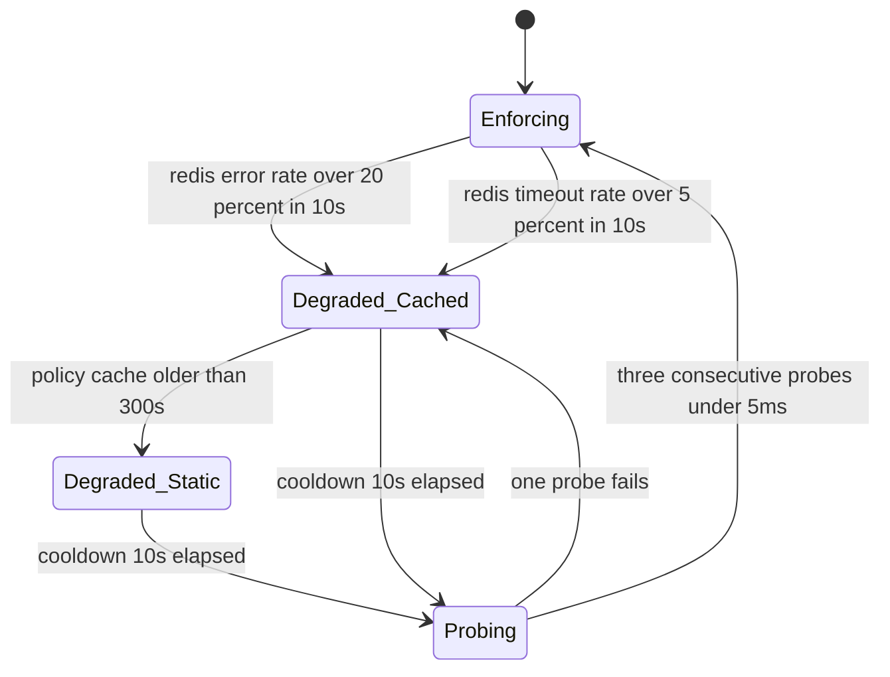

# 09 · 设计限流服务（Design a Rate Limiter Service）

> 题面像是"选哪个算法"。真正考的是：**在 200 个进程上维护同一个计数时，你愿意为精确性付多少延迟；以及这个计数器自己挂掉时，系统处于什么状态。**
> 算法那张对比表最多值 20% 的分，而它恰好是唯一能背下来的部分 —— 这就是为什么它区分不出人。

**先读**：[`07-interview/06-mock-interview.md`](../07-interview/06-mock-interview.md) 是同一道题的 45 分钟英文逐字稿（30 万 QPS 规模，含面试官打断与评分锚点）。本篇是**完整设计文档**，规模取到 **100 万 QPS**，因为集中式方案恰好在这个量级开始不够用 —— 同一条判据公式，在两个规模上给出**不同的结论**。逐字稿里已经讲透的部分（burst 作为定价参数、Count-Min Sketch 热点检测、被 challenge 时怎么答）本篇只引用不复述。
压缩版见 [`07-classic-canon.md` 第 2 题](07-classic-canon.md)。

---

## 读这道题之前

**如果你是直接翻到这道题的**：这题考的是分布式计数，不是算法。第 1 题答不出，你会把它读成一道单机题，正文里 `q = limit × T / N` 的整套推导就只剩公式表演。

**先确认你能回答这三个问题**

1. "先 `GET` 判断有没有超，再 `INCR` 扣减"，两个网关同时执行会发生什么？"原子"具体指哪一步不可分割？
   答不出 → 先读 [`00-foundations/00-concepts.md` §7](../00-foundations/00-concepts.md)
2. 下游从 0.8 ms 变慢到 80 ms（注意：没有挂），为什么比它直接挂掉更危险？用 Little's Law 把这条链说一遍。
   答不出 → 先读 [`00-foundations/00-concepts.md` §2](../00-foundations/00-concepts.md)
3. `429` 和 `503` 在客户端 SDK、CDN 眼里有什么不同？`Retry-After` 是谁在告诉谁什么？
   答不出 → 先读 [`02-architecture-patterns/04-api-design-and-versioning.md` §6](../02-architecture-patterns/04-api-design-and-versioning.md)

**这道题会用到的构件**

| 构件 | 用在哪 | 详见 |
|---|---|---|
| Little's Law、峰谷比、排队论、成本建模 | §2 全部：内存装得下、ops/s 装不下、跨 AZ 账单 | [`00-foundations/02-capacity-estimation.md`](../00-foundations/02-capacity-estimation.md) §2 §3 §6 |
| 限流的 HTTP 契约（429 / `Retry-After` / `RateLimit`） | §4.6 响应契约，本题唯一的单向门 | [`02-architecture-patterns/04-api-design-and-versioning.md`](../02-architecture-patterns/04-api-design-and-versioning.md) §6 |
| 租约（lease）、单调时钟、为什么不用分布式锁 | §4.2 本地租约 + 周期同步；§3 惰性补充为什么用单调时钟 | [`01-building-blocks/05-consensus-and-coordination.md`](../01-building-blocks/05-consensus-and-coordination.md) §4 §5 |
| 超时预算、熔断半开、信号量隔板、负载卸载、优雅降级 | §4.4 Redis 挂了 / 变慢了的分档降级状态机 | [`05-reliability/03-resilience-patterns.md`](../05-reliability/03-resilience-patterns.md) §2 §4 §5 §6 §7 |
| 噪音邻居、巨型租户的逃生舱 | §4.3 热点租户打爆单分片，邻居陪葬 | [`02-architecture-patterns/03-multi-tenancy.md`](../02-architecture-patterns/03-multi-tenancy.md) §5 §8 |

**这道题的一句话本质**

> **限流器的难点从来不是选算法，而是在 200 个进程上维护同一个计数。**
> 那张算法对比表最多值 20% 的分；精确性只能用延迟买，买不买得起由 `q = limit × T / N` 决定。而当这个计数器自己变慢或挂掉时，被打分的是"**降级之后的上界是多少**" —— `fail-open` 的上界是 ∞，所以它从来不是一个答案。

---

## 0. 45 分钟怎么分配这道题

| 时间 | 做什么 | 这一段的得分点 |
|---|---|---|
| `00:00–05:00` **澄清** | 问 §1 的 8 个问题；白板角落写需求卡；显式划掉 L3/L4 volumetric DDoS 与 WAF | 必须问出**精度的方向**（超发 vs 误拒哪个更贵）和**限流单位**（请求数 vs 加权成本）。这两个决定后面所有取舍的方向 |
| `05:00–09:00` **估算** | QPS 均值/峰值、键基数、内存、Redis ops/s、分片数、跨 AZ 带宽账单 | 每个数字后跟一句"所以呢"。**内存全都装得下、ops/s 装不下** —— 这个结论必须是你自己算出来的 |
| `09:00–13:00` **单机版** | 进程内令牌桶 + 惰性补充（lazy refill）+ 三层 try-then-commit；说出 100 ns 这个基准 | 展示"复杂度是被逼出来的，不是默认的"。100 ns vs 0.8 ms 的四个数量级差，是后面每一次论证的锚点 |
| `13:00–19:00` **分布式版** | 集中式 Redis + Lua 原子判定 + hash tag；**主动说出 hash tag 的代价**并预告会回来讲 | 画完立刻提名 3 个深挖点让面试官选 —— 交出选择权，同时展示你知道哪个最难 |
| `19:00–27:00` **深挖 A** | 五种算法（用你自己算的 ops/s 否决滑动窗口日志）+ 集中式 vs 本地租约的判据公式 | `q = limit × T / N`。**给公式，不给"看情况"** |
| `27:00–33:00` **深挖 B** | 热点租户（含 key splitting 的碎片化损失公式）+ Redis 故障的分档降级 | 区分"挂了"和"变慢了"；拒绝 `fail-open` 这个标准答案，给**有界**降级 |
| `33:00–37:00` **深挖 C** | 多维度组合与优先级 + 响应契约（429 / `Retry-After` / `RateLimit`） | "响应头是这个系统唯一真正的单向门（one-way door：一旦发出去被客户端解析，就再也改不回来的决定；见 [`03-tradeoff-framework` §3](../00-foundations/03-tradeoff-framework.md)）" —— 面试官很少听到这句 |
| `37:00–43:00` **收敛** | 30 秒回顾 + v0/v1/v2 + 撞墙表 + 单向门 | **自己启动收敛**。没有收敛的设计题，评分上等同于没做完 |
| `43:00–45:00` **反问** | 见文末 | 问可运维性与组织边界，不问 WLB —— 这 2 分钟仍在被评分 |

**时间陷阱**：算法对比表是最容易讲超时的一段（因为你最熟）。**给它 4 分钟上限**，超了就把剩下的塞进一句"其余三种我可以展开，但结论已经在表上"。

---

## 1. 需求澄清

| # | 我会问的问题 | 面试官通常怎么回 | 它决定什么 |
|---|---|---|---|
| 1 | 它是每个服务 import 的**库**，还是网关在请求路径上调的**服务**？ | 网关，同步，覆盖 100% 流量 | 延迟预算与失败行为的重要性都被顶到最高 |
| 2 | 维度和基数：per-tenant？per-API-key？per-endpoint？per-IP？ | 四层都要，租户 5 万 | 基数决定"能不能全放内存"，是选型的支配变量 |
| 3 | **精度的方向**：超发（over-admission）容忍多少？误拒（false 429）容忍多少？**哪个更贵？** | 超发 5% 可接受、硬顶 2×；误拒接近 0，会被升级到 VP | ⚠️ **不问就会做错方向 #1** |
| 4 | **限流单位**是请求数，还是加权成本（token / 字节 / CPU 秒 / 美元）？ | 大部分端点按请求数；AI 与 bulk export 端点按成本 | ⚠️ **不问就会做错方向 #2** |
| 5 | 是速率限制（rate limiting）还是月度配额（quota）？ | 两个都要 | 配额必须走异步计量管道，绝不能进同步路径 |
| 6 | 被拒时 429 还是排队整形？多层里一层拒了，其他层扣不扣？ | 429，不排队；一层拒则一层都不扣 | 逼出 all-or-nothing 语义 ⇒ 必须原子 try-then-commit |
| 7 | 限流器自己挂了，fail-open 还是 fail-closed？ | "你说呢" | 正确答案是**分维度**，见 §4.4 |
| 8 | 多 region 吗？限额是全局的还是按 region 切的？ | 目前单 region，一年内上第二个 | 决定 v3，也决定策略 schema 现在就要留 region 字段 |
| 9 | 平台上已经有某种限流了吗？ | nginx `limit_req` + 各服务自己写的 | 真正的工作是**迁移**，不是新建 |

### 为什么是问题 3 和问题 4

**问题 3（精度的方向）**：如果误拒比超发贵，本地租约方案是危险的 —— 它的特征失败恰好就是误拒。如果反过来（例如按美元计费的硬上限），集中式才是唯一安全的。**同一套架构在两个答案下的评分是相反的**，不问就是在 50% 的概率上押注。

**问题 4（限流单位）**：请求数和加权成本不是同一个系统。加权成本必须"**先按估算值预扣，执行完再用真实值结算**"，这条链路要求令牌桶支持**负余额**、要求有一条回写路径、要求估算值偏保守。这些在按请求数计数的设计里一条都不存在。等你画完架构才发现单位是美元，整张图要重画。

**主动划掉**：L3/L4 volumetric DDoS（在 TLS 终止之前，是另一个系统）、WAF 规则、匿名 IP 的信誉评分。

**本文假设**：公开 API 平台，5 万付费租户，300 亿次调用/天，200 个网关实例，单 region，平台读路径承诺 p99 150 ms。

---

## 2. 估算

```
① 流量
   300 亿次/天 ÷ 86,400 s = 347,222 ≈ 34.7 万 QPS 均值
   峰谷比 3×（美洲工作时段驼峰 + 夜间批处理）→ 104 万 ≈ 100 万 QPS 峰值
   ÷ 200 个网关实例 = 每实例 5,000 QPS 峰值 = 平均每 200 µs 一个请求
```
> **解读**：单实例 200 µs 一个请求，意味着限流判定如果花 1 ms，一个实例只能处理 1,000 QPS —— **判定必须是微秒级或者异步化**，这一条在画图之前就已经排除了一大类方案。

```
② 键基数（cardinality）
   per-tenant 全局          5 万租户                →   5 万
   per-API-key              5 万 × 4 把 key         →  20 万
   per-(tenant × 端点类)     5 万 × 6 类             →  30 万
   per-IP（认证前）          活跃 /24 前缀 45 万      →  45 万
                                             合计 ≈ 100 万 个计数键

③ 内存
   令牌桶 payload  = float64 tokens + int64 ts = 16 B
   Redis 结构性开销 ≈ 80 B/key（key SDS + robj + dictEntry + 过期字典），与 payload 无关
   合计 ≈ 96 B/key → 取 100 B
   100 万 × 100 B = 100 MB          ← 一台 r6g.large 都用不满
   ⇒ 结构性开销是 payload 的 5 倍。**换算法能改的是那 8–16 B，改不了那 80 B。**
```
> **解读**：**内存从来不是这道题的约束。** 任何以"内存放不下"为由否决方案的论证，在这个规模上都是错的。真正的约束在下一条。

```
④ Redis ops/s —— 真正的约束
   集中式：每请求 1 次 EVALSHA → 100 万 ops/s 峰值
   单分片吞吐（量级，随实例与脚本大小变动）：
       裸 INCR                        ≈ 15 万 ops/s
       三层层级判定的 Lua 脚本         ≈  5 万 ops/s   （解释开销 + 3 个 key 的读改写）
   ⇒ 裸计数 7 分片；本题的 Lua  20 分片
```
> **解读**：**分片数完全由脚本复杂度决定，不由数据量决定。** 同样 100 MB 的状态，写法差 3 倍分片。这句话是这一节最值钱的一句 —— 它把"选算法"和"付账单"直接连起来了。

```
⑤ 成本（2026 年中量级，随实例类型与云厂商变动）
   20 主 + 20 副本 = 40 节点 × 约 $150/节点/月 ≈ $6,000/月
   网关侧 CPU：限流约占 3% × 200 节点 × 约 $400/节点/月 ≈ $2,400/月
   合计 ≈ $8,400/月 ÷ 9,000 亿次请求/月 ≈ $0.01 / 百万请求

⑥ 带宽 —— 最容易被漏掉的一笔
   每次限流调用 ≈ 请求 200 B + 响应 80 B = 280 B
   34.7 万 QPS 均值 × 280 B = 97 MB/s → 8.4 TB/天 → 约 252 TB/月
   3 个 AZ 随机放分片 ⇒ 约 2/3 跨 AZ = 168 TB/月 × 约 $0.02/GB ≈ $3,400/月
```
> **解读**：跨 AZ 流量费和整个 Redis 集群同一量级。**AZ 感知路由（topology-aware routing）不是延迟优化，是账单优化** —— 它同时省掉 0.5–1 ms 的 p50 和三分之一的钱。

```
⑦ 连接数
   每网关对每分片 4 条连接 → 200 × 20 × 4 = 16,000 条，每分片 800 条
   Redis 每连接输出缓冲区约 20 KB → 每分片约 16 MB，可接受
   撞墙点：网关扩到 1,000 实例 → 每分片 4,000 连接，maxclients 与内存同时紧张

⑧ 延迟预算
   平台 p99 150 ms → 限流器分到 p99 2 ms / p99.9 5 ms（约 1.3%），硬超时 5 ms
   同 AZ Redis：p50 0.3 ms / p99 0.8 ms / p99.9 3–5 ms；跨 AZ +0.5–1 ms
   进程内令牌桶：约 100 ns（一次带条带锁的原子操作）
```
> **解读**：`100 ns` 与 `0.8 ms` 差 **4 个数量级**。这个倍数是本篇每一个取舍的基准 —— 每当有人说"就多一次 Redis 调用而已"，把这两个数并排写出来。

---

## 3. 高层设计

### 先给最简单能工作的版本：单机

```
type Bucket struct { tokens float64; lastNs int64 }   // 16 B

// 惰性补充（lazy refill）：读时才算，不跑定时器
elapsed  := nowMonotonicNs() - b.lastNs
b.tokens  = min(capacity, b.tokens + elapsed*rate)
b.lastNs  = nowMonotonicNs()
if b.tokens >= cost { b.tokens -= cost; ALLOW } else { DENY }
```

两个点值得说出口：**补充是惰性的**（不对 100 万个桶跑 ticker，空闲租户零成本，每请求 O(1)）；**补充用单调时钟（monotonic clock）**，因为墙钟被 NTP 回拨时，`elapsed` 变负会让令牌数倒退，而回拨到未来则凭空造令牌。

**它在第 2 个节点上就坏掉**：每个节点各自计数，N 个网关 ⇒ 租户拿到 N 倍限额。200 个节点时这不是近似误差，是限流器不存在。

### 分布式版

```
   ┌──────────────── 控制面（control plane）────────────────┐
   │ Postgres: 计划默认值 / 租户覆盖 / 紧急压制 / block 标志  │
   │      └── 策略流 push，p99 收敛 ≤ 1 s，网关本地缓存 30 s │
   └────────────────────────┬───────────────────────────────┘
                            ▼ policy
  client        ┌───────────────────────────┐   EVALSHA    ┌────────────────────┐
 ───────────────▶│   API Gateway × 200       │  同 AZ 0.8ms │ Redis Cluster × 20 │
   1M QPS 峰值   │  ① 进程内短路段（0 IO）    │─────────────▶│ hash tag {grp:NNN} │
                 │  ② 一次 Lua 原子三层判定   │              │ AOF everysec       │
                 │  ③ 本地租约（大租户专用）  │◀── lease ────│ + 租约分配器        │
                 └───────────┬───────────────┘   每 T=200ms └────────────────────┘
                             │ 用量事件，异步批量 10 s
                             ▼
                 ┌────────────────────────────────┐
                 │ 计量 / 计费管道（月度 quota）    │ ← 只回吐一个 block 标志给控制面
                 └────────────────────────────────┘
```

**数据流**：网关鉴权时已经解出 `tenant_id` 与 `api_key_id`（零额外成本）→ 读进程内策略缓存 → 跑判定 → 放行或 429 → 用量事件异步批量投递给计量管道。**计量管道从不在同步路径上**，它只通过控制面回吐一个"这个租户已欠费/已封禁"的布尔标志。

### 请求路径上的两段判定流水线

```
第一段：进程内，零 IO，任一拒即短路（不产生任何 Redis ops）
  ① block 标志（本地缓存 TTL 30 s）………………………… 拒 → 403
  ② 每节点静态上限（与租户无关，如 2,000 rps/节点）…… 拒 → 429   ← 零依赖的最后防线
  ③ per-IP 桶（GCRA：令牌桶的等价形式，只存一个"下一次允许通过的
     理论时刻"，进程内，认证之前就能判）…………………… 拒 → 429
        │ 通过
        ▼
第二段：一次 EVALSHA（按脚本哈希调用已缓存在 Redis 上的 Lua 脚本；Redis 单线程执行
        脚本，所以"读—判断—扣减"在脚本内部天然是原子的），三层原子 try-then-commit
  ④ rl:{grp:317}:t:acme        租户全局
  ⑤ rl:{grp:317}:k:ak_9f2c     单个 API key          三个都过才扣；
  ⑥ rl:{grp:317}:e:search      (租户 × 端点类)        任一不过，一个都不扣
  TTL = 2 × 窗口               空闲桶自动消失，省掉一整套 GC
```

**顺序原则：便宜的、拒绝概率高的、不需要网络的放前面。** 被攻击时，第一段短路掉的流量不产生任何 Redis 调用 —— 这就是限流器自己能活下来的原因。第二段必须是**一次** Lua 调用而不是三次 pipeline：pipeline 给不了"三层 dry-run 后统一提交"的原子性，两个网关会同时看到"三层都还有余量"然后都提交。

> **`{grp:317}` 而不是 `{acme}`**：hash tag（Redis Cluster 里被 `{}` 包住的那段子串单独决定 key 落在哪个 slot —— 同 tag 的多个 key 保证同槽，才可能被一个 Lua 脚本原子地一起改）里放一层间接（`grp = hash(tenant_id) % 4096`）。它保留了"同租户三个 key 落同一 slot"的原子性，同时让你可以**把单个热租户重映射到另一个 group 而不改 key 格式**。直接用 `{tenant_id}` 做 hash tag 的设计，在热点出现时唯一的出路是改 key 格式 —— 那是一次全量迁移。

---

## 4. 深挖

### 4.1 五种算法：内存与精度的量化

条件：100 万个键、100 万 QPS 峰值、窗口 60 s。

| 算法 | 每 key 状态 | Redis 内存（100 万键） | 每请求命令 | 峰值 Redis ops/s | 需要的分片数 | 最坏超发 | `Retry-After` |
|---|---|---|---|---|---|---|---|
| 固定窗口计数 fixed window counter | 1 int（8 B） | ≈ 90 MB | 1 × INCR | 100 万 | 7 | **2L，可在 ε 时间内交付** | 只能给窗口重置时刻 → 自制惊群 |
| 滑动窗口日志 sliding window log | 窗口内每请求 1 个时间戳 | 60 s × 100 万 = **6,000 万条** × 80–100 B ≈ **5–6 GB** | 3（ZREMRANGEBYSCORE / ZADD / ZCARD），且必须包进 Lua 才原子 | **300 万** | **约 75**（ZSET 是 O(log N)，吞吐约为 INCR 的 1/4） | 0（精确） | 精确 |
| 滑动窗口计数 sliding window counter | prev / curr 两个 key，各 1 int | ≈ 180 MB（80 B 开销付两次） | 1 × Lua | 100 万 | 20 | 理论仍可到 2L（见下）；生产实测 0.003%（Cloudflare 公开口径，随流量形态变化） | 近似 |
| **令牌桶 token bucket** | tokens + ts（16 B） | ≈ 100 MB | 1 × Lua | 100 万 | 20 | 长期速率 = L 精确；瞬时 = `capacity`，**是显式售卖的参数** | 需一次除法 |
| GCRA | TAT 一个 float64（8 B） | ≈ 90 MB | 1 × Lua | 100 万 | 20 | 同令牌桶 | **免费**：`TAT − τ − now` 就是等待时间 |

**结论一：内存全都装得下，连最贵的滑动窗口日志 6 GB 也就是一台机器。杀死它的是 300 万 ops/s ⇒ 约 75 个分片，是令牌桶方案的 3.75 倍账单，换来一个在 §1 已经被明确放弃的精度（超发 5% 可接受）。**自己在澄清阶段拿到的约束，深挖阶段自己不用，是最可惜的一种失分。

**结论二：滑动窗口计数的"最坏情况"和固定窗口一样是 2L。** 教科书排序在这里是错的，推一遍：

```
估计值 = prev × (1 − f) + curr        f = 当前窗口已过的比例
对抗性构造：把 L 个请求全部压在上一窗口的最后一刻
  f = 0.5：估计 = 0.5L + curr < L ⇒ curr 可到 0.5L
           真实的"最近 W 秒"内 = L + 0.5L = 1.5L        → 超发 50%
  f → 1  ：估计 = 0 + curr < L ⇒ curr 可到 L
           真实的"最近 W 秒"内 → 2L                      → 超发 100%
```
差别不在最坏值，在**触发难度和交付速度**：固定窗口只要"客户端在整点前后各发一次"就撞上，且 2L 可以在 2 秒内打完（瞬时速率是目标速率的几十倍，具体倍数见逐字稿 §4.1）；滑动窗口计数要求突发精确压在边界，且 2L 被摊到整个窗口。**只报最坏情况会得出错误结论；期望情况差两个数量级。**

**结论三：GCRA 在 Redis 里省不到内存。** 8 B 与 16 B 的差异被 80 B 的结构性开销吃掉（88 B vs 96 B，差 8%）。GCRA 真正省一半的场景是**进程内紧凑数组**：1 亿个 per-IP 键，令牌桶 1.6 GB vs GCRA 800 MB。⇒ **选 GCRA 的理由从来不是 Redis 内存，是（a）进程内海量键、（b）`Retry-After` 从算术里免费掉出来。**

**判决：认证后的三层用令牌桶（burst 是定价页上卖的参数，理由见逐字稿 §4.1，不复述）；认证前的 per-IP 层用进程内 GCRA。**

**什么条件下改选**：

| 改选 | 触发条件 | 为什么 |
|---|---|---|
| 滑动窗口日志 | 基数 < 1 万 **且** 限额 < 100/窗口 | 内存只有几 MB，而"能列出是哪 5 次密码重置"这个审计能力值钱 |
| 固定窗口 | 窗口 ≤ 1 s | 2L 的绝对值就是 2 秒的量，可忽略；此时 1 条 `INCR` 是全场最便宜的 |
| GCRA | 键数 > 1,000 万 **且** 状态在进程内 | 内存减半 + `Retry-After` 免费 |

### 4.2 集中式 Redis vs 本地令牌 + 周期同步：给公式，不给"看情况"

| | 集中式（每请求一次 Redis） | 本地租约（lease）+ 周期同步 |
|---|---|---|
| 每请求延迟 | p99 0.8 ms / p99.9 3–5 ms | 约 100 ns |
| Redis ops/s | 100 万（= 总 QPS） | `N / T` = 200 / 0.2 s = **1,000**（降 1,000×） |
| 分片数 / 月成本 | 20 分片 / 约 $6,000 | 1 分片 / 约 $300 |
| 跨 AZ 带宽 | 约 $3,400/月 | ≈ 0 |
| 精确性 | 精确（原子提交） | 长期速率精确，瞬时有界误差 |
| **特征失败** | **可用性耦合**：Redis 不可用 = 100% API 调用受影响 | **误拒（false 429）**：总量对了，分配错了 |

**超发上界（可推导，不是拍的）**：分配器每周期只发 `L·T` 个令牌 ⇒ 长期速率 = L，由构造保证。误差来自时序：节点可以把第 k 周期没花完的租约和第 k+1 周期的一起花。
⇒ **瞬时最坏 2L，持续时间 ≤ T = 200 ms。** 这个数字写进设计文档，让业务方决定它可不可接受。

**误拒来自量化误差**。令 `q = L·T / N`（每节点每周期分到的令牌数），到达近似泊松（Poisson：随机独立到达时，每个窗口内的计数会围绕均值波动，标准差 = √均值），则相对抖动 `≈ 1/√q`：

```
q < 1       多数节点连一个整令牌都拿不到      → 必然误拒，禁止本地
1 ≤ q < 10  抖动 ≥ 32%，误拒率不可忽略        → 不建议
q ≥ 10      抖动 ≤ 32%，配合"提前续借"可接受  → 本文采用的开启阈值
q ≥ 100     抖动 ≤ 10%，与集中式几乎无差别    → 本地明显更优
```

**开启本地模式所需的最小限额** `L_min = 10·N / T`：

| T ＼ N | 50 节点 | 200 节点 | 1,000 节点 |
|---|---|---|---|
| **100 ms** | 5,000 rps | 20,000 rps | 100,000 rps |
| **200 ms** | 2,500 rps | **10,000 rps** | 50,000 rps |
| **1 s** | 500 rps | 2,000 rps | 10,000 rps |

`T` 是一个连续旋钮，两头都有代价：`T↑` 让阈值下降（更多租户可本地化）、Redis ops 下降（`N/T`），但**超发窗口变长**（≤ T）、策略变更收敛变慢。`N↑`（网关扩容）会把租户从本地模式挤回集中式 —— **网关的水平扩展会缩小可本地化的租户集合**，这个反直觉的耦合值得主动说出来。

代入本文（N=200，T=200 ms）：阈值 10,000 rps，5 万租户里约 200 个在线上，它们承载约 80% 的 QPS。**用 0.4% 的租户卸掉 80% 的负载。**

> **面试金句**
> "分布式限流的判据可以写成一个式子：`q = limit × T / N`，就是每个节点每个同步周期分到多少令牌。q 小于 1 必然误拒；小于 10 时光泊松抖动就有 32%；大于 100 时本地和集中式已经分不出来。所以'本地还是集中'不是架构偏好，是这个租户的 limit 落在哪一段。200 个节点、200 毫秒周期，分界线是 10,000 rps —— 线以上走本地，线以下走集中式，而线以下的租户天然量小，集中式对他们根本不构成问题。"
> "The whole centralized-versus-local decision collapses into one number: q equals limit times the sync period divided by node count — how many tokens each node gets per period. Below one, you're guaranteed to reject valid traffic. Below ten, Poisson jitter alone is thirty-two percent. Above a hundred, local and centralized are indistinguishable. So it isn't an architectural preference, it's just where a given tenant's limit falls. With two hundred nodes and a two-hundred-millisecond period, the line sits at ten thousand requests per second. Tenants above it go local, tenants below it stay central — and they're cheap to serve centrally precisely because they're small."

**怎么知道生产里的误差真在容忍范围内**：1% 采样的影子对比（shadow）—— 本地路径的请求同时过一遍集中式计数器（observe-only），把分歧率导成一等公民指标 `limiter_shadow_disagreement_ratio`，1% 告警。**没有测量的近似只是祈祷。**

### 4.3 Redis 单点、分片与热点租户

**分片丢失**：`cluster-require-full-coverage no` —— 一行配置，把爆炸半径（blast radius）从"整个 keyspace 下线"变成"1/20 的租户降级"。

**故障转移期**：Redis Cluster 的自动故障转移需要 `cluster-node-timeout`（默认 15 s）加选举，实际 15–30 s。**限流器等不了 15 秒** ⇒ 熔断器（circuit breaker：错误率超阈值就直接短路、不再发请求，每隔一段时间放一个探针试探恢复；见 [`03-resilience-patterns` §4](../05-reliability/03-resilience-patterns.md)）必须在 1 s 内打开并进降级路径，而不是等集群自愈。这两个时间尺度差一个数量级，是很多人第一次踩到才发现的。

**持久化**：AOF `everysec`，让重启的节点不是空的；**绝不用 `appendfsync always`** —— 给半衰期 60 s 的数据付每请求的耐久成本是净亏。

**热点租户**：hash tag 把一个租户的三层 key 钉在同一个 slot 上换来了原子性，代价是**热租户全压一个分片**。设单分片 Lua 上限 5 万 ops/s，任何单租户超过 5 万 QPS 就打爆它所在的分片，而受害者是同分片的所有邻居（noisy neighbor）。

两条出路。**升到本地租约模式**是首选（热租户恰好是 `q` 最大、本地模式最舒服的那一类，两个性质都来自"量大"，见逐字稿 §4.3）。来不及时用 **key splitting**：拆成 k 个子桶、每桶 `L/k`、按 `hash(request_id) % k` 落桶。它的代价可以算出来：

```
每桶每窗口期望到达量  m = L·W / k
泊松涨落 σ = √m，被浪费的期望额度 E[(X−m)⁺] = σ/√(2π) ≈ 0.4√m
碎片化损失率 ≈ 0.4√m / m = 0.4 / √m = 0.4 / √(L·W/k)
```

| 租户限额 L（k=16，W=1 s） | 每桶期望 m | 碎片化损失 | 判读 |
|---|---|---|---|
| 150,000 rps | 9,375 | **0.4%** | 几乎免费 |
| 10,000 rps | 625 | 1.6% | 可接受 |
| 1,000 rps | 62.5 | **5.1%** | 客户买的额度被悄悄砍掉 5% |
| 100 rps | 6.3 | **16%** | 荒谬 |

**结论：key splitting 只对大租户便宜，而只有大租户会造成热点 —— 这不是巧合。给小租户拆 key 是纯亏损。** 顺带，这条公式解释了工程直觉里那个"大概 5%"从哪来的。

### 4.4 Redis 挂了：fail-open 还是 fail-closed

先拆故障类型 —— **这个区分比答案本身更重要**：

- **干净故障**（connection refused、节点消失）：熔断器 1 秒内打开，简单。
- **延迟故障**（Redis 活着但 p99 从 0.8 ms 涨到 80 ms）：**这个才是杀手**。天真的客户端就是等，网关工作线程堆在限流调用上，**唯一职责是保护平台的东西变成了平台挂掉的原因**。

客户端配置不可协商：`5 ms 硬超时` / `每网关 200 个在飞请求的信号量（semaphore：一个有上限的并发许可计数），满了直接走降级，不排队` / `10 s 窗口内错误率 > 20% 或超时率 > 5% 即熔断` / `半开每 2 s 放 1 个探针`。

**fail-open vs fail-closed 按维度决定，一刀切必错**：

| 限流维度 | 挂了怎么办 | 判据 |
|---|---|---|
| per-tenant 速率（保护后端） | **降级，不 fail-open**：本地缓存的上一版策略 × 1.5 安全系数 | 误拒的商业损失 > 短暂超发的容量损失 |
| per-IP / 未认证（防滥用） | **fail-closed 到保守静态值**（如 10 rps/IP） | 攻击者是唯一受益方；正常用户几乎撞不到 |
| block 标志（已欠费 / 已封禁） | **fail-closed**，标志必须缓存在网关本地 | 这是商业与合规决定，不能因为基础设施故障而失效 |
| 加权成本上限（$ 硬顶） | **fail-closed 到计划默认额度** | fail-open = 免费送算力，且不可回收 |
| 每节点静态上限 | 永远生效，**零依赖** | 它是最后一道防线，不参与任何降级判断 |

**判据一句话：`fail-open` 的正确问法不是"开还是关"，是"降级之后的上界是多少"。open 的上界是 ∞，任何有限上界的降级都比它好。** 三层降级的具体内容（缓存策略 ×1.5 / 静态每节点上限 / 预设 shed 顺序）见逐字稿 §4.4，本篇只补它讲不了的部分 —— **这些档位之间哪些转移不存在**：



> 📖 **读图要点**：这张图的信息在**缺失的两条边**上。第一，**没有任何一条边通向 `FailOpen`** —— 它不是一个可达状态，`Degraded_Cached` 的上界是"上一版策略 × 1.5"，`Degraded_Static` 的上界是"每节点静态上限 × 节点数"，两个都是有限数。第二，**`Degraded_Static` 没有直接回到 `Enforcing` 的边**：进到静态档意味着策略缓存已超过 300 s，直接回去等于用一份不知道多旧的策略执法，必须先经 `Probing` 刷新。这两条"画不出的边"是 ASCII 表格列不出来的 —— 表格能说"降到哪一档"，说不了"哪些路径不存在"。

### 4.5 多维度限流：组合、基数与优先级

**(a) 基数爆炸的硬规则**。限流键的每一个维度**必须来自服务端可枚举的集合**（租户表、API key 表、端点路由表、IP 前缀），**绝不能由请求内容自由派生**。一个"按 `X-Client-Id` 头限流"的功能，攻击者用随机值几分钟就能造出几千万个键 —— 这是一次内存 DoS，而且它打的正是你的保护层。
产品确实需要客户自定义维度时：加**基数上限**（每租户最多 1,000 个自定义键，越界的全部落进一个 `__overflow__` 键共享额度），并把键基数的 5 分钟增长率做成告警。

**(b) 策略优先级**。同一请求会匹配多条策略：

```
紧急压制（必须带 TTL ≤ 24 h）  >  租户临时覆盖（带过期时间）
    >  租户长期覆盖  >  计划默认值
同一优先级内：维度更具体的赢（tenant × endpoint  >  tenant）
```
两条铁律：**紧急压制必须有 TTL**（没有 TTL 的紧急开关会永久留在生产里，一年后没人敢删）；**每条覆盖必须记录是谁、什么时候、为什么加的**。

**(c) 成本加权限流**。请求数是个糟糕的单位 —— 一次调用可能比另一次贵 200 倍。

```
准入时：按该端点历史成本的 p75 扣一个估算值 c_est
完成后：用真实成本 c_real 做差额结算（可为负，即退还）
桶允许短暂负余额，下界 = −(单次最大成本)；余额为负时一律拒绝直到补回
```
关键点：**估算值必须偏保守（取 p75 而不是 p50）**。这是全篇唯一一处我主动选择"宁可误拒"的地方，理由是这里的不对称性反过来了 —— 超发的算力不可回收，而误拒会在几百毫秒后由退还自动修复。AI 端点的输出 token 数事后才知道，这条链路是它唯一的正确形态（见 [`02-llm-gateway.md`](02-llm-gateway.md)）。

### 4.6 限流响应契约

```http
HTTP/1.1 429 Too Many Requests
Retry-After: 7
RateLimit: "tenant";r=0;t=7, "endpoint";r=418;t=53
RateLimit-Policy: "tenant";q=1000;w=60, "endpoint";q=600;w=60
RateLimit-Limit: 1000              ← 老三件，为兼容而发
RateLimit-Remaining: 0
RateLimit-Reset: 7
```

**规范现状（2026-07 核对）**：`429` 来自 RFC 6585，`Retry-After` 由 RFC 9110 定义。`RateLimit` / `RateLimit-Policy` 目前仍是 IETF httpapi 工作组的 Internet-Draft —— [`draft-ietf-httpapi-ratelimit-headers-11`](https://datatracker.ietf.org/doc/draft-ietf-httpapi-ratelimit-headers/)，2026-05-23 发布，2026-11-24 到期，**尚未成为 RFC**。参数：`RateLimit-Policy` 用 `q`（配额）`w`（窗口秒）`qu`（配额单位）`pk`（分区键）；`RateLimit` 用 `r`（剩余）`t`（有效窗口秒）。草案规定两者同时出现时 **`Retry-After` 优先**，且 `Retry-After` 不应指向早于有效窗口结束的时刻。老三件 `RateLimit-Limit / -Remaining / -Reset` 来自更早的草案，仍是部署最广的事实标准 ⇒ **两套都发**，SDK 优先读新的。

**四条契约铁律**：

1. **`Retry-After` 必须带抖动（jitter）**：`base + rand(0, 0.2×base)`。给 5,000 个客户端同一个重试时刻，等于给自己排了一次 DDoS。
2. **必须告诉客户端是哪一条策略拒的** —— `RateLimit` 里 `r=0` 的那个 policy name，或一个显式响应头。否则每次误拒都是一张工单加一次人肉排查。
3. **成功的响应也要带 `RateLimit`**，否则客户端只能靠撞墙发现限额。代价可以算：34.7 万 QPS 均值 × 100 B = 34.7 MB/s → 约 90 TB/月 × $0.05–0.09/GB ≈ **$4,500–8,100/月，比整个 Redis 集群还贵**。⇒ 2xx 上只发一行 `RateLimit`，`RateLimit-Policy` 只在 429 和策略变更后的第一个响应上发。
4. **不要用 503 代替 429**（语义是服务不可用，CDN 和客户端 SDK 会按完全不同的规则重试）；**不要用 200 + body 里写 error**（所有中间层的重试、熔断、监控会一起失效）。

> **面试金句**
> "限流器最容易被低估的一半是它的**响应契约**。一个光秃秃的 429 只告诉客户端'不行'，那它唯一能做的就是立刻重试 —— 这时候限流器变成了流量放大器。契约其实是三件事：`Retry-After` 带抖动，因为给五千个客户端同一个重试时刻等于自己给自己排了一次 DDoS；说清是**哪一条策略**拒的，否则每一次误拒都是一张工单加一次人肉排查；以及在**成功的响应**上也带剩余额度，这是客户端主动退避和被动挨打的区别。而这套头字段一旦被客户端 SDK 解析，语义就冻住了 —— 它是这个系统里唯一真正的单向门，比算法选型重要得多。"
> "The most underrated half of a rate limiter is its response contract. A bare 429 only tells the client 'no', so the only thing it can do is retry immediately — and now your limiter is a traffic amplifier. The contract is really three things: a Retry-After with jitter, because handing five thousand clients the same retry instant is scheduling your own DDoS; naming which policy rejected the request, because otherwise every false 429 is a support ticket and a manual investigation; and returning the remaining quota on successful responses too, which is the difference between clients backing off proactively and discovering the limit by hitting it. And once client SDKs start parsing those headers, the semantics are frozen. That header schema is the only real one-way door in this system — it matters far more than which algorithm you pick."

---

## 5. 失败模式

| 故障 | 影响 | 检测信号 | 应对 / 降级到什么 |
|---|---|---|---|
| **Redis 变慢**（灰色故障 gray failure，非宕机） | 网关工作线程堆积 → 保护层变成故障源 | 限流调用 p99 > 5 ms **且** 在飞信号量占用 > 80% | 5 ms 硬超时 + 每节点 200 在飞上限 + 熔断 → `Degraded_Cached` |
| 单分片丢失 | 哈希到该分片的租户无法判定 | 该分片错误率 100%，`cluster_slots_fail` > 0 | `cluster-require-full-coverage no` ⇒ 只有 1/20 租户降级；熔断 1 s 内打开，**不等 15 s 故障转移** |
| 热点租户打爆单分片 | 同分片邻居被连累 | 分片 CPU 分布 p99/p50 > 3 | 升本地租约模式；来不及则 key splitting（接受 §4.3 的碎片化损失） |
| 网关滚动重启 → 本地桶清零 | 瞬时多放一个 burst | 重启窗口内 429 率骤降 + 后端 QPS 尖峰 | 令牌桶**冷启动从 0 补充**而不是从 `capacity` 开始；单批重启 ≤ 10% 节点 |
| 策略下发错误（limit 写成 0，或单位差 1000×） | 全平台误拒 / 限流完全失效 | 全局 429 率相对昨日同时刻偏离 > 5× | 下发前 diff + 影子模式；**批量策略变更必须有"停止整批"开关** |
| `Retry-After` 同步 → 惊群（thundering herd） | 窗口重置瞬间流量尖峰 | 429 后 1 s 内重试峰值/均值 > 5 | `Retry-After` 加 20% 抖动；固定窗口改滑动 |
| 网关时钟漂移 / 回拨（clock rollback） | 走到未来的时钟凭空造令牌 | NTP offset > 100 ms | 补充用单调时钟；跨节点只交换用量计数、不交换时间戳；Lua 里的 `now` 由网关传入，必须监控 skew |
| 限流键基数爆炸（自定义维度被攻击） | Redis 内存打满 → 全体降级 | 键基数 5 分钟增长 > 20% | 维度必须服务端枚举；自定义键每租户上限 1,000 + `__overflow__` 共享桶 |
| 租约分配器不可用 | 本地模式租户拿不到新租约 | 分配器错误率 > 0 | 本地节点回落到 `limit / N` 的静态份额**继续本地判定**，绝不整体拒绝；同时告警 |
| 多 region 各自计数 | 全局限额被放大 N 倍 | 全局用量 / 各 region 之和 > 1.1 | 按历史份额静态切分限额，或在合同里显式接受 N× —— 二选一，不能装作不存在 |

---

## 6. 演进路线

| 版本 | 内容 | 撑到 | **触发进入下一版的可观测信号** |
|---|---|---|---|
| **v0**（2 周） | 进程内令牌桶 + LB 一致性哈希把租户粘到少数节点 | ~2 万 QPS | 租户被路由到 > 3 个节点的比例 > 20%（粘性失效）；或与集中式影子计数的偏差 > 5% |
| **v1**（6 周） | 集中式 Redis + Lua 三层原子判定 + 静态每节点上限兜底。**绝大多数团队真正要发的就是这一版** | ~50 万 QPS | 限流调用 p99.9 > 5 ms 持续 1 周；或单分片 CPU 分布 p99/p50 > 3；或跨 AZ 流量账单 > Redis 实例账单 |
| **v2**（+6 周） | 大租户本地租约 + 热点自动升降级（带迟滞 hysteresis）+ 1% 影子对比 + per-IP 层下沉到进程内 GCRA | ~200 万 QPS | `shadow_disagreement_ratio` > 1%；或网关节点数 > 500 使 `q < 10` 的租户比例上升 |
| **v3** | 多 region | — | **上第二个 region 的当天**。没有中间态：要么按历史份额静态切分限额，要么接受 N× 超发并写进合同。跨 region 强一致计数需要每请求一次跨洋 RTT（80–150 ms），在这条路径上不可能 |

**迁移比新建重要**（平台上一定已经有某种限流）：新限流器先以 **observe-only** 模式部署，只记录它*会*拒绝哪些请求；跑两周，把新旧决策的分歧率和分歧样本给最大的 20 个租户逐个 review；分歧率 < 0.1% 后按租户灰度 1% → 10% → 50% → 100%，每档卡 48 小时。回滚是一个配置开关，10 秒生效。
**唯一不可回滚的是发出去的响应头** —— 客户端一旦开始解析，语义就锁死了。所以头字段 schema 必须在 observe 阶段**之前**定稿。

---

## 什么时候这个方案是错的

| 情况 | 该做什么 |
|---|---|
| 单服务、QPS < 5,000、无多租户 | 一个进程内令牌桶，20 行代码。**上 Redis 是纯负债** |
| 你只想保护自己的后端，不对外承诺限额 | 用**并发限制（concurrency limiting）**而不是速率限制：在飞请求数上限 + 队列等待超时。它直接对应真实资源，几乎不需要配置调优，且天然自适应后端变慢。见 [`03-resilience-patterns.md`](../05-reliability/03-resilience-patterns.md) |
| 请求成本方差 > 100× | 按请求数限流没有意义。改成本加权（§4.5c）或干脆改并发限制 |
| 目标是 volumetric DDoS 防护 | L3/L4 的活，在 TLS 终止之前。应用层限流器**结构上看不到 TLS 里的身份**，也扛不住线速 |
| 你要的其实是月度配额而不是速率 | 走异步计量管道，限流器只消费一个 block 标志。把计费账本放进同步路径 = 让计费系统的可用性成为 API 可用性的上限 |
| 想直接用托管边缘限流 | 够用的场景比你想的多，但**必须先读它的一致性声明**。Cloudflare Workers 的 `ratelimit` 绑定（[2025-09 GA](https://developers.cloudflare.com/changelog/post/2025-09-19-ratelimit-workers-ga/)）明确写明限额是 **per Cloudflare location** 的、"permissive, eventually consistent, and intentionally designed to not be used as an accurate accounting system"，且周期只能是 10 或 60 秒。⇒ 它是很好的**第一层粗筛**，不是你的租户限额执行点。要在边缘做精确计数，得把计数放进一个逻辑单实例（如 Durable Object），代价是每请求一次到该对象归属地的往返 —— **N 个 PoP 各自计数，就是 N 个网关节点的问题，只不过挪到了上一层** |

**一句总结**：这套方案的成立前提是"你在卖限额、你有多租户、且你必须能对客户解释为什么被拒"。三条缺一条，它就都过度设计了。

---

## 7. 常见错误答法

**❌「把限额均分给 N 个节点，每节点 `limit/N`」**
→ 流量从来不均匀。粘性 LB（session affinity）下一个节点可能看到某租户 40% 的流量却只有 1/200 的额度，它在 5 rps 就开始 429，而另外 199 个节点坐在没花完的令牌上。**均分的特征失败是误拒，而误拒正是你在澄清阶段确认过最贵的那一种。**
✅ 正确说法：按上一周期实际份额分配 + 提前续借（燃尽 20% 周期就立刻再要），并且只在 `q = L·T/N ≥ 10` 时才允许本地模式。

**❌「先 GET 判断，再 INCR 扣减」**
→ check-then-act，两个网关会同时读到"还没超"然后都提交。这是判断候选人有没有真写过并发代码的一道单选题。
✅ 正确说法：单条原子语句（`INCR` 后判断返回值），多维度时整个层级判定放进**一次** Lua —— pipeline 给不了 dry-run 与 commit 之间的原子性，这也是"三层 all-or-nothing"必须用 Lua 而非 pipeline 的唯一理由。

**❌「Redis 挂了就 fail-open，让请求都过去」**
→ 把"降级"和"放弃"混为一谈。fail-open 的上界是 ∞，而 Redis 生病通常和平台过载同时发生 —— 正好是你最不想要无限额度的时刻。另外这个答法默认了故障是"挂掉"，而生产里更常见的是"变慢"，那种情况下天真的客户端会把网关线程池耗尽。
✅ 正确说法：先区分干净故障和延迟故障；按维度决定方向（防滥用 fail-closed、保护后端降级不 open、block 标志 fail-closed）；每一档都有有限上界；最后一档零依赖。

**❌「限流器前面加个队列，排队而不是拒绝」**
→ 把速率问题换成了延迟问题加内存问题。队列一旦无界，OOM 只是被推迟到最糟糕的时刻；有界队列则只是把 429 改名叫"排队超时"，还多了一份内存和一份尾延迟。
✅ 正确说法：网关直接 429 + `Retry-After`，把整形（shaping）的责任推给客户端 SDK。真要削峰（buffer the burst），那属于异步任务提交端点，不属于同步 API 网关。

---

## 8. 相关章节

| 用到的构件 | 章节 |
|---|---|
| 租约（lease）语义、单调时钟、为什么用租约而不是分布式锁 | [`01-building-blocks/05-consensus-and-coordination.md`](../01-building-blocks/05-consensus-and-coordination.md) |
| 本地 L1 缓存、TTL 抖动、惊群、单飞 | [`01-building-blocks/02-caching.md`](../01-building-blocks/02-caching.md) |
| L4/L7、会话粘性、AZ 感知路由、边缘限流的位置 | [`01-building-blocks/04-networking-and-edge.md`](../01-building-blocks/04-networking-and-edge.md) |
| 峰谷比、Little's Law、成本建模 | [`00-foundations/02-capacity-estimation.md`](../00-foundations/02-capacity-estimation.md) |
| 超时预算、熔断半开、信号量隔板、负载卸载、优雅降级 | [`05-reliability/03-resilience-patterns.md`](../05-reliability/03-resilience-patterns.md) |
| 把"误拒率"定义成 SLI、多窗口多燃尽率告警 | [`05-reliability/01-slo-and-error-budget.md`](../05-reliability/01-slo-and-error-budget.md) |
| 噪音邻居、隔板、whale 租户的处置 | [`02-architecture-patterns/03-multi-tenancy.md`](../02-architecture-patterns/03-multi-tenancy.md) |
| 策略下发、协调循环、控制面与数据面分离 | [`03-saas-platform/01-control-plane.md`](../03-saas-platform/01-control-plane.md) |
| quota 与 rate 的分界、计量管道、实时配额的租约模型 | [`03-saas-platform/02-billing-and-metering.md`](../03-saas-platform/02-billing-and-metering.md)、[`06-case-studies/04-usage-based-billing.md`](04-usage-based-billing.md) |
| 成本加权限流的完整形态（预扣 + 事后对账） | [`06-case-studies/02-llm-gateway.md`](02-llm-gateway.md) |
| 同题的 45 分钟逐字稿与评分锚点 | [`07-interview/06-mock-interview.md`](../07-interview/06-mock-interview.md) |

---

## 面试官会追问

1. 100 万 QPS 下，滑动窗口日志到底是被内存杀死还是被 ops/s 杀死？给两个数。
2. 滑动窗口计数的最坏超发是多少？推给我看。它凭什么比固定窗口好？
3. 本地租约的特征失败是超发还是误拒？为什么？总量不是由构造保证吗？
4. 什么时候**不能**用本地计数？给公式。网关从 200 台扩到 1,000 台，这个公式怎么变？
5. 一个租户占平台 15% 的流量，hash tag 把他钉在一个分片上。给我两个方案，各自的量化代价是什么？
6. Redis 挂了 vs Redis 变慢，哪个更危险？你的降级链里有没有 fail-open 这个状态？
7. 三层限额里有一层拒了，另外两层扣不扣？这个决定对存储层提了什么要求？
8. 429 的响应里必须有什么？给成功响应也带 `RateLimit` 头，一个月多花多少钱？
9. 这个设计的单向门是什么？如果只能保住一个想法，你保哪个？
10. 平台上已经有 nginx 的 `limit_req` 了。你的上线剧本是什么，回滚点在哪？

---

## 自测

遮住上文，你能不能说出：

1. **`q = limit × T / N` 是什么，四个数量级各对应什么决策**，以及 200 节点 / 200 ms 下的分界线是多少 rps。
2. **为什么"内存装得下"是这道题的送分陷阱** —— 100 万键只有 100 MB，真正逼你分片的是 ops/s，而 ops/s 由脚本复杂度决定（裸 `INCR` 7 分片 vs 三层 Lua 20 分片）。
3. **key splitting 的碎片化损失公式**（`≈ 0.4/√(L·W/k)`），以及为什么它只对大租户便宜。
4. **`fail-open` 的正确问法**是"降级之后的上界是多少"，以及为什么 `Degraded_Static` 必须经过 `Probing` 才能回到 `Enforcing`。
5. **响应契约的三件事**（抖动的 `Retry-After`、拒绝它的策略名、成功响应上的剩余额度），以及为什么这套头字段是全系统唯一真正的单向门。

答不出第 1、3 两条，说明你只背了算法表；答不出第 4、5 两条，说明你把限流当成了算法题而不是平台题。

---

**下一篇** → [10-news-feed.md](10-news-feed.md)
