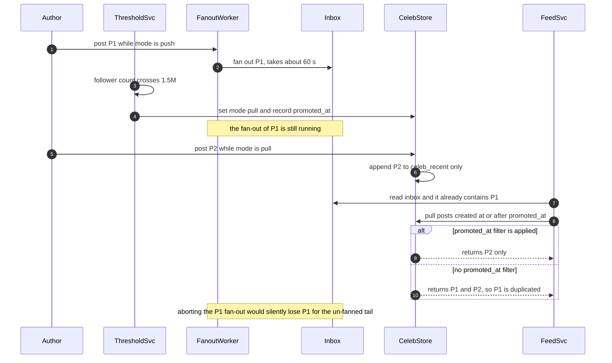

# 10 · 设计信息流 / 时间线（Design a News Feed / Timeline）

> 这题不考"推还是拉"。二选一的答案在第 12 分钟就会被"一亿粉丝的账号发一条呢"击穿。真正被打分的是三件事：**阈值你算不算得出来**、**收件箱（inbox）里到底存什么**、**大 V 这条长尾有没有被物理隔离出主链路**。
> 而这三件事最后收敛成同一条原则：收件箱是一个可以随时丢弃并重建的**读模型（read model）**，不是真相源（source of truth）。

---

## 0. 45 分钟怎么分配这道题

| 分钟 | 做什么 | 这一段的得分点 |
|---|---|---|
| **0–5** | 澄清。只问 8 个问题，其中 2 个是必须问的 | 问出**排序模式**和**粉丝数直方图**。没问直方图，后面所有阈值都是拍的 |
| **5–9** | 估算。写四个数：读 QPS、写 QPS、纯 push 写放大、纯 pull 读放大 | 白板上同时出现 **34 万写/s** 和 **1,400 万读/s**。这两个数字一出来，混合方案就不需要辩护了 |
| **9–14** | 高层：先画**最简单能工作**的版本（全量 push），并**主动说出它死在哪** | "我先给最简版，然后我自己攻击它" —— 这是 Staff 与 Senior 的分水岭 |
| **14–19** | 高层：加上大 V 旁路，画第二版。**当场推导阈值** | 阈值必须从"新鲜度 SLO ÷ 扇出吞吐预算"反推，不能是一个整数 |
| **19–24** | 深挖①：收件箱存什么、存多长、用什么存 | 说出 `(post_id, author_id, score)` 三元组，并说出为什么必须多存那 8 字节 |
| **24–29** | 深挖②：读路径 —— 归并、游标（cursor）、去重、读时过滤 | over-fetch 1.5× + 读时按当前关系过滤；游标是 `(score, post_id)` 不是 offset |
| **29–34** | 深挖③：内容变更 —— 删帖、编辑、改隐私、封禁 | "绝不去三千万份收件箱里删"，并给出秒级生效的替代路径 |
| **34–38** | 深挖④：面试官指定的那一个（通常是排序、或关注图变更） | 排序把收件箱从"答案"降级为"一路召回"，但**不归零** |
| **38–42** | 失败模式与降级。至少讲扇出堵塞 + 收件箱全挂两条 | 降级到纯 pull 的延迟代价要给数字（45 ms → 500 ms） |
| **42–45** | 收敛：撞墙条件 + 演进 | "第一个撑不住的是 X，信号是 Y 超过 Z" |

**时间分配的唯一硬规则**：第 14 分钟之前不要提"混合"这个词。先把纯 push 画出来、自己算出单帖 1,500 秒扩散不完，混合方案才是**推导结果**而不是**背诵结果**。面试官分得清这两者。

---

## 1. 需求澄清

| # | 我会问的问题 | 面试官通常怎么回 | 这个答案改变什么 |
|---|---|---|---|
| 1 | 时间线是**严格时序（strictly chronological）**，还是**算法排序（ranked feed）**？v1 要哪个？ | "v1 时序，v2 要排序" | ⚠️ **不问就会做错方向**。见 §4.4：排序会把收件箱从"答案"变成"候选池"，游标（cursor）机制整个失效 |
| 2 | 粉丝数（follower count）的**分布**长什么样？p50 / p99 / 最大值各是多少？ | "p50 约 25，p99 约 5,000，最大 1.5 亿" | ⚠️ **不问就会做错方向**。所有阈值都从这张直方图算，问不到就只能拍数字 |
| 3 | DAU、日发帖量、人均日读 feed 次数？ | "2 亿 DAU，5,000 万帖/天，人均读 10 次" | 决定容量的三个输入 |
| 4 | 新鲜度 SLO：发帖后多久粉丝应该看得到？ | "普通账号 p95 < 5 s；大 V 可以放宽" | **这一条直接决定大 V 阈值**（见 §4.1） |
| 5 | 用户一次会话能往回滑多深？ | "p99 约 200 条，超过就该给推荐了" | 决定收件箱裁剪长度，而它决定内存账单是 $14k 还是 $180k/月 |
| 6 | feed 里只有关注内容，还是掺推荐 / 广告 / 群组？ | "v1 只有关注 + 转发（repost）" | 掺入外部源 = 收件箱不再是唯一召回源，提前踩到 §4.4 |
| 7 | 删帖 / 改隐私 / 封禁的**生效时限**是多少？ | "秒级，这是合规要求" | ⚠️ 这条决定了收件箱**绝对不能存内容副本**（见 §4.6） |
| 8 | 需要 read-your-writes 吗？自己刚发的帖必须立刻出现在自己 feed 里？ | "必须" | 一条特例：自己的帖同步写自己的收件箱，不走异步扇出（fan-out）队列 |

**本文假设**：5 亿 MAU / 2 亿 DAU；人均关注 200 个账号（总关注边 1,000 亿）；5,000 万帖/天；人均读 feed 10 次/天；v1 严格时序；删除与隐私变更秒级生效。

---

## 2. 估算

### 2.1 读写两端

```
读：2 亿 DAU × 10 次/天 = 20 亿 次/天 = 23,148 QPS 均值
    峰谷比（peak-to-average ratio）3× → 约 7 万 QPS 峰值
    每次返回 20 条 → 内容对象读 = 140 万 次/s（这才是真正的读压力）
写：5,000 万 帖/天 = 578 QPS 均值 × 3 = 约 1,700 QPS 峰值
    ⇒ 发帖本身不是容量问题。容量问题全部来自它引发的扇出（fan-out）
```

### 2.2 两个极端的写放大 / 读放大（这一步是整道题的支点）

```
总扇出边/天 = Σ over posts (作者的粉丝数)
  发帖频率与粉丝数正相关，取大 V 发帖是普通人的 30×：
    大 V（>150 万粉，约 316 个账号，均 513 万粉）× 3 帖/天 = 48.6 亿
    其余（983.8 亿 关注边 × 人均 0.1 帖/天）        = 98.4 亿
                                            合计 ≈ 147 亿 扇出写/天

纯 push（fan-out on write）：147 亿/天 = 17 万 写/s 均值 × 3 = 51 万 写/s 峰值
    去掉大 V 后 98.4 亿/天 → 34 万 写/s 峰值 ← 可承受
    但 1.5 亿粉一帖 = 1.5 亿次写；给它 10 万写/s 也要 1,500 秒
    ⇒ 一个账号能把扇出队列堵 25 分钟，期间所有普通用户的 feed 停更

纯 pull（fan-out on read）：7 万 QPS × 200 个关注源 = 1,400 万 次源查询/s
    ⇒ 这不是"省存储"，是把一个 34 万/s 的写问题换成一个 1,400 万/s 的读问题；
      写可以异步、削峰、排队，读不行 —— 用户正在等
```

**这个数字意味着什么**：两个极端各自坏在完全不同的维度上 —— push 坏在**单帖的绝对扇出量**（延迟与队列公平性），pull 坏在**每次读的固定成本**（吞吐与尾延迟）。所以混合方案的边界不能是同一个判据，必须是**两个独立的闸门**（见 §4.1）。

### 2.3 存储、带宽、连接、成本

```
关注图（follow graph）
  1,000 亿边 × 正反两份索引 × 16 B = 3.2 TB 裸数据（含索引与副本 8–12 TB）
  反向索引（粉丝列表）是扇出的输入 → 宽行存储（Cassandra / ScyllaDB）
  ⚠️ 大 V 单行 1.5 亿个 follower_id = 2.4 GB，宽行必炸 ⇒ 二级分桶
     (followee_id, bucket) → follower_ids，bucket = hash(follower_id) % 1024
     单行降到 2.4 MB，且 1024 个桶天然可并行扫描（扇出的并行度免费拿到）

收件箱（inbox）只存 (post_id 8 B, author_id 8 B, score 8 B) = 24 B/条
  裁剪到 200 条 → 4.8 KB/人 × 2 亿活跃用户 = 960 GB
  ⚠️ 这是**裸数据**。Redis ZSET 的真实开销是 3–5×，见 §4.2 —— 本题最常见的 5× 估算错误

带宽
  feed 响应 gzip 后约 8 KB（20 条帖的文本 + 元数据 + 媒体 URL）
  23,148 QPS × 8 KB = 185 MB/s = 16 TB/天 = 480 TB/月
  出网（egress）按 $0.05/GB ≈ $24k/月 ⇒ 媒体字节必须走 CDN，永不经过 feed 服务

连接
  feed 是请求-响应，**不需要长连接**；实时性用"下拉刷新 + 新帖徽标"就够。
  长连接是聊天题的成本结构，不是这题的 —— 主动说出这条边界会加分。

成本量级（2026 年中，随时变动）
  收件箱 Redis 960 GB × 副本 ≈ 20 台 r6g.4xlarge ≈ $14k/月
  内容缓存（近 7 天 3.5 亿帖 × 1 KB = 350 GB）    ≈ $5k/月
  扇出 worker 6.8 万写/s ÷ 5,000 写/s/worker      ≈ 14 台
    ⚠ 但 §4.1 的毒性闸要按"设计吞吐 30 万写/s"反推阈值 ⇒ 必须留 4.4× headroom = 60 台
```

---

## 3. 高层设计

**先给最简单能工作的版本**：全量写扩散，没有任何特例。

```
 发帖 ─▶ Post Svc ─▶ Posts 表（按 post_id 分片）─▶ Kafka: post_created
                                                      │
                                              Fanout Worker（并行读 1024 个粉丝桶）
                                                      │
                                              ZADD inbox:{follower_id} score post_id
 读 ─▶ Feed Svc ─▶ ZREVRANGE inbox:{uid} 0 19 ─▶ MGET 内容 ─▶ 返回
```

这个版本 p95 约 20 ms，代码两百行，**在 5,000 万用户以下完全正确**。它的死法只有一个，但足够致命：`1.5 亿粉 ÷ 10 万写/s = 1,500 秒`。一个账号发一条推文，普通用户的时间线停更 25 分钟。

**第二版：把长尾从主链路物理切出去。**

```
                        ┌──────────────── 写路径 ────────────────┐
 发帖 ─▶ Post Svc ─▶ Posts(分片 by post_id) ─▶ Kafka: post_created
              │                                      │
              └─ 同步写自己的 inbox（read-your-writes 特例，不进队列）
                                                     ▼
                                      ┌── Fanout Router：查作者的 mode ──┐
                                      │                                  │
                          mode=push（其余全部账号）           mode=pull（约 316 个）
                                      │                                  │
                     按扇出量（活跃粉丝数）分优先级队列：       不扩散。只维护
                          <1k   → fast lane（p95 1 s）           celeb_recent:{uid}
                          <50k  → normal   （p95 5 s）           （ZSET，仅存最近 200 条）
                          <300k → bulk     （p95 30 s）
                                      │
                        只写"近 7 天活跃粉丝"（约 20%）
                        ZADD inbox:{fid} + 概率裁剪到 200 条

                        ┌──────────────── 读路径 ────────────────┐
 读 ─▶ Feed Svc ─┬─▶ ① ZREVRANGEBYSCORE inbox:{uid} (cursor -inf LIMIT 0 30   ← over-fetch 1.5×
                 ├─▶ ② 关注的 pull 源（p50 3 个 / p95 15 / p99 60）并发取 20 条
                 │      超时 80 ms，超时即返回部分结果并置 partial=true
                 ├─▶ ③ 归并（按 score 降序）+ 按 post_id 去重 + 转发折叠
                 ├─▶ ④ 读时过滤：取关 / 拉黑 / 静音 / 封禁 / 隐私 / 已删
                 ├─▶ ⑤ 不足 20 条 → 从 ① 再取一页补位（最多 2 轮）
                 └─▶ ⑥ MGET 内容对象（L1 进程内 1 s + Redis + 回源）→ 序列化
```

**数据流的四条不可动摇的边界**：

1. **收件箱是读模型（read model），不是真相源（source of truth）。** 丢了可以从 `posts` + `follows` 完整重建。任何"只有收件箱里才有的信息"都是设计错误。
2. **收件箱只存引用，永不存内容副本。** 见 §4.6，这一条是删除与合规的地基。
3. **大 V 的帖子永远不进任何人的收件箱。** 不是"少写一点"，是一条独立的物理路径。
4. **权限、拉黑、隐私一律在读时判定。** 写时判定意味着每次关系变化都要回写千万份收件箱。

---

## 4. 深挖

### 4.1 阈值：push 和 pull 的成本交点里，粉丝数会被约掉

对某个作者 A：粉丝数 `F`、活跃粉丝比 `α`、日发帖数 `P`、粉丝人均日读 feed 次数 `R`。

```
push 成本/天 = P × αF × C_w        C_w = 一次收件箱写（ZADD + 摊薄裁剪）
pull 成本/天 = αF × R × C_r        C_r = 一次"取该作者最近 20 条"+ 归并入堆

令两边相等：   P × C_w = R × C_r
                        ↑ αF 从两边同时消掉
              P* = R × (C_r / C_w)
```

**这是这道题最反直觉的一步：成本交点与粉丝数无关。** 它只取决于"发帖频率 ÷ 读频率"。

实测 `C_r / C_w`：一次 pull 源查询要传 20 倍数据、多一次 RTT、还占用 feed 请求的并发槽位，比值通常落在 **4–10**。取 6、`R = 10` ⇒ `P* = 60 帖/天`：**发帖超过 60 条/天的账号，pull 比 push 便宜 —— 无论它有 100 个粉还是 1 亿个粉。**

这条闸门抓住的是**高频发帖机器人和资讯账号**，不是明星。明星一天发 3 条，成本上 push 完胜。所以还需要第二条、完全独立的闸门：

```
毒性闸（toxicity gate）—— 它管的不是成本，是队列公平性与新鲜度 SLO
  扇出集群设计吞吐           = 30 万 写/s（峰值需求 6.8 万 × 4.4 headroom）
  允许单帖占用的吞吐份额     = 20%   → 6 万 写/s
  允许占用这个份额的时长     = 5 s（= 普通账号的新鲜度 SLO）
  ──────────────────────────────────────────────────────
  FANOUT_MAX = 6 万 × 5 = 30 万 次活跃粉丝写
  阈值粉丝数  = 30 万 ÷ α(0.2) = 150 万 总粉丝
```

| 闸门 | 判据 | 触发时的行为 | 它保护的是什么 |
|---|---|---|---|
| **成本闸** | `P > 60 帖/天`（滑动 7 日均值） | 转 pull | 云账单 |
| **毒性闸** | `αF > 30 万`（即 `F > 150 万`） | 转 pull | 其他所有人的新鲜度 SLO |
| 两者都不触发 | | push | |

> **面试金句**
> "大 V 的阈值我不拍数字，我从两个互相独立的闸门算出来。成本闸：把 push 和 pull 的成本写成等式，粉丝数会从两边同时消掉 —— 交点只取决于发帖频率和读频率的比值，实测落在 60 帖/天。毒性闸：单帖扇出不能占用超过 20% 的扇出吞吐超过 5 秒，反推是 30 万活跃粉丝，按 20% 活跃率就是 150 万总粉丝。**粉丝数管的不是成本，是队列公平性** —— 这就是为什么一个判据不够。"
> "I don't hand-pick the celebrity threshold — I derive it from two independent gates. The cost gate: write out push cost equals pull cost, and follower count cancels from both sides. The crossover only depends on the ratio of posting rate to read rate, and it lands around sixty posts a day. The toxicity gate: no single post's fan-out may hold more than twenty percent of fan-out throughput for more than five seconds, which works back to three hundred thousand active followers, or one and a half million total at a twenty percent active rate. Follower count doesn't govern cost — it governs queue fairness. That's exactly why one criterion isn't enough."

**这个阈值对应多少个账号？** 用 Zipf（`followers(rank) ≈ 1.5 亿 / rank^0.8`）拟合：`rank^0.8 = 100 → rank ≈ 316`。**只有约 316 个账号越线**，它们吃掉 16.2 亿条关注边（占全部的 1.6%）。所以人均 200 个关注里命中大 V 的是 `200 × 1.6% ≈ 3.2 个` —— 这就是读路径 p50 只有 3 个 pull 源的来源。

**什么条件下改选另一个**：如果直方图头部更重（短视频平台常见：头部 2% 的账号吃掉 40% 关注边），p95 的 pull 源会从 15 涨到 80，归并会退化。那时的正确动作**不是调阈值**（调高会让毒性闸失效），而是给重度用户加**预归并缓存**：把 `merged_celeb:{uid}` 缓存 30 s。命中率取决于会话内翻页次数，实测 40–60%。

**切换的时间窗口是个真实的坑。** 一个账号刚跨过阈值时，push 和 pull 两条路径会短暂同时活跃：



> 📖 **读图要点**：第 2 步的扇出在第 4 步和第 5 步发生时**还没跑完** —— 这个重叠窗口才是所有麻烦的来源。图里那条 `else` 分支说明 `promoted_at` 不是可选字段，它是切换正确性的唯一支点；而最后那条 Note 说明"升级就中止正在跑的扇出"这条看起来最省事的边**根本不能画**，画了就是静默丢帖。ASCII 能画出"先 push 后 pull"，画不出"push 还没结束 pull 已经开始"。

配套三条：**升级立即生效**（保护系统）、**降级需连续 24 h 低于阈值**（滞后 hysteresis，防抖动）、**读时按 post_id 去重兜底**（成本近似为零的最后一道防线）。

### 4.2 收件箱：存什么、存多长、用什么存

**存什么**：`(post_id 8 B, author_id 8 B, score 8 B)`。多存的那 8 字节 `author_id` 买到三件事 —— 取关、拉黑、静音全部可以在读时按**当前**关系过滤，不需要任何写放大。这是全篇性价比最高的 8 个字节。

**存多长**：这个数字直接就是内存账单，而且它不是线性的。

| 收件箱长度 | Redis 编码 | 每用户内存 | 2 亿用户总量 | 月成本（量级） | 覆盖单次会话滚动深度 |
|---|---|---|---|---|---|
| 100 | listpack（默认阈值 128） | 约 2.4 KB | 480 GB | $7k | p90 |
| **200** | listpack（阈值调到 256） | 约 **4.8 KB** | **960 GB** | **$14k** | **p99** ← 选它 |
| 800 | **skiplist**（越过阈值，编码切换） | 约 **64 KB** | **12.8 TB** | **$180k** | p99.9 |

**从 200 到 800，长度涨 4 倍，内存涨 13 倍** —— 因为越过 `zset-max-listpack-entries` 后 Redis 从紧凑数组切成 skiplist + dict，每个 member 从约 24 B 变成约 80 B。**这个非线性是本题最值钱的一个数字**，也是"800 条 × 16 B = 2.6 TB"这个流传很广的估算失真 5 倍的原因 —— 那个算法只有在你**自己写存储层**（定长环形数组）时才成立。

| 收件箱存储选型 | 每用户内存 | 写吞吐 | 崩溃后 | 什么时候选它 |
|---|---|---|---|---|
| Redis ZSET / listpack 200 条 | 4.8 KB | ZADD O(n) memmove，n=200 时约 1 µs | 从 posts+follows 重建（分钟级） | **默认**。运维成熟度换 2× 内存 |
| 自研定长环形数组 800 条 | 12.8 KB | O(1) 头插 | 自己做快照 | 用户数 > 10 亿，且你有存储团队 |
| Cassandra / ScyllaDB 宽行 | 磁盘 | 写便宜 10× | 天然持久 | 内存装不下，且能接受读 p99 从 20 ms 到 80 ms |
| 关系数据库表 | 磁盘 | 索引写放大 3–5× | 天然持久 | **< 1,000 万用户时这就是正确答案**，别上 Redis |

**裁剪（trimming）怎么做**：不要每次 ZADD 后都 `ZREMRANGEBYRANK`。用**概率裁剪** —— 以 1/50 概率触发一次裁到 200 条，摊薄成本降到 2%，最坏长度 200 + 50 ≈ 250，内存超支 25%，仍在 listpack 阈值内。

**懒物化（lazy materialization）**：只给近 30 天活跃用户维护收件箱。沉默用户的收件箱在他登录时按需重建（一次读时归并 + 一次批量写）。2 亿 DAU / 5 亿 MAU ⇒ 直接省 60% 内存与 60% 扇出写。**给一个三年没登录的人写时间线是纯粹的浪费。**

### 4.3 读路径：归并、游标、去重、已读位置、缓存

**游标（cursor）绝不能是 offset。** `LIMIT 1000, 20` 在混合 feed 下既慢又错 —— 期间有新帖插入，翻页会重复。

```
cursor = base64( score_ms : post_id )   单调、无状态、可跨源共用
  收件箱 ZREVRANGEBYSCORE inbox:{uid} (score_ms -inf LIMIT 0 30
  pull 源 ZREVRANGEBYSCORE celeb_recent:{cid} (score_ms -inf LIMIT 0 20
⚠️ 前提是所有源共用同一个 score 空间（毫秒时间戳）。§4.4 引入算法排序后
   score 不再是时间戳，这个游标立刻失效 —— 那时必须换成会话快照游标。
```

**归并与过滤流水线**（这就是那条 over-fetch 1.5× 的由来）：
```
  ① 收件箱取 30 条 ─┐
                    ├─▶ ② 按 score 归并 ─▶ ③ post_id 去重 ─▶ ④ 转发折叠
  ② pull 源 3×20 ──┘        （堆，O(k log n)）    （跨源重复）    （5 人转同一帖 → 1 条）
                                                          │
   ⑤ 读时过滤 ◀───────────────────────────────────────────┘
     ├─ viewer 的取关 / 拉黑 / 静音集合（请求开始时一次拉取，缓存 60 s，p99 < 500 条）
     ├─ 全局封禁作者（Bloom filter 广播，100 万账号 ≈ 1.2 MB，本地驻留，秒级更新）
     ├─ 帖子 deleted_at / privacy_level（随内容 MGET 一起返回，不额外查）
     └─ 输出 < 20 条 → 回到 ① 再取一页，**最多 2 轮**，之后返回不足并标记 partial
                                                          │
   ⑥ MGET 内容对象 ◀──────────────────────────────────────┘
     L1 进程内 LRU（TTL 1 s，扛热帖）→ Redis 内容缓存 → Posts 分片回源（origin fetch）
```

**这条流水线里的远程调用只有 2 次**（viewer 关系集 + 内容 MGET），不是 20 条 × 3 次 = 60 次。把过滤做成"一次批量拉取 + 纯本地判定"，是这段能跑进 45 ms 的唯一原因。

**尾延迟放大（tail latency amplification）是这里的真实风险**：并发拉 15 个 pull 源、单源 p99 = 5 ms，则"至少命中一个慢源（straggler）"的概率是 `1 − 0.99¹⁵ = 14%`；p99 的重度用户拉 60 个源，这个概率涨到 45%。所以：**并发 + 80 ms 硬超时 + 允许部分结果**，并在响应里显式返回 `partial: true`（客户端据此决定要不要下拉重试）。见 [`../05-reliability/03-resilience-patterns.md`](../05-reliability/03-resilience-patterns.md)。

**已读位置（read position）**：
```
存 last_seen_score（时间戳），不存 last_seen_post_id —— 帖子会被删，ID 会变悬空引用
每设备一份 read_pos:{uid}:{device_id}，TTL 90 天
写量：每次翻页上报 = 23k/s；改为"退出 feed / 切后台时合并上报一次" → 2.3k/s，降一个数量级
未读数：ZCOUNT inbox:{uid} (last_seen_score +inf 是 O(log N) 可以做，但 pull 部分算不出
  ⇒ 产品上只显示小红点或 "99+"。**承诺一个精确未读数，就是承诺你算不出来的东西。**
```

**缓存与预取**：这里有一个反直觉的结论。

| 缓存什么 | 缓存基数 | 命中率 | 值不值 |
|---|---|---|---|
| feed 响应本身（per-user 第一页） | = 用户数（2 亿） | < 15%（人均一天只读 10 次，间隔以小时计） | ❌ **不值**。为 15% 命中率付 2 亿份内存 |
| 内容对象 `post:{id}` | = 近 7 天帖数（3.5 亿） | > 95% | ✅ 主力 |
| 大 V 最近帖 `celeb_recent:{cid}` | = 316 | > 99%，且被它全部粉丝共享 | ✅ 性价比最高 |
| 重度用户预归并 `merged_celeb:{uid}` | = p99 用户数（约 200 万） | 40–60%（会话内翻页） | ⚠️ 只对 pull 源 > 30 的用户开 |
| 推送通知触发的预生成第一页 | = 被推送用户数 | > 70%（点通知必然打开 feed） | ✅ 见 `06-notification-platform.md` |

> **面试金句**
> "feed 本身不该被缓存。feed 是 per-user 的，缓存基数等于用户数，而用户一天只读 10 次 —— 命中率不到 15%，你在为一个 15% 命中率的缓存付两亿份内存。该缓存的是**被很多读者共享**的东西：内容对象命中率 95% 以上，一个大 V 的最近帖列表被它全部粉丝共享，缓存基数只有 316。**缓存的价值来自共享度，不是来自被缓存的那个东西看起来有多贵。**"
> "The feed itself shouldn't be cached. A feed is per-user, so cache cardinality equals your user count, and a user only reads ten times a day — you'd get under a fifteen percent hit rate while paying for two hundred million entries. Cache the things that many readers share instead: post content objects hit above ninety-five percent, and a celebrity's recent-posts list is shared by every one of their followers, so its cardinality is three hundred, not two hundred million. Cache value comes from how many readers share an entry, not from how expensive the cached thing looks."

### 4.4 排序：从时间序到算法排序，架构要拆掉三件事

| | 严格时序 | 轻量重排（Top 200 规则打分） | 全量算法排序（多路召回 + 模型） |
|---|---|---|---|
| 候选池大小 | 20（收件箱**就是**答案） | 200 | 500–2,000（关注只是**一路**召回） |
| 额外服务依赖 | 0 | 1（特征缓存） | 3+（召回、特征、打分） |
| feed p95 | **45 ms** | 70 ms | **180–250 ms** |
| 每请求 CPU | 约 0.02 ms | 0.5 ms | 8–15 ms（+ 打分推理） |
| 游标机制 | `(score, post_id)` 无状态 | 同左 | ⚠️ **必须换成会话快照** |
| 收件箱的角色 | 答案 | 候选池 | 召回源之一（**但仍是最便宜的那一路**） |
| 失效半径 | 单点故障只影响自己 | 特征服务降级 → 退回时序 | 打分服务 p99 **直接支配** feed p99 |

1. **游标失效，必须改成会话快照。** score 不再单调（模型更新、特征漂移会让同一条帖的分数变化），无状态游标翻页会重复和漏。解法：第一次请求时把排序后的 300 个 ID 冻结进 `feed_session:{uid}:{session_id}`（TTL 10 min），翻页从快照里切片。**这是从时序 feed 迁到排序 feed 时最容易漏掉的一步**，症状是"用户投诉翻页时同一条帖出现两次"。
2. **p99 的支配项从存储换成模型。** 时序 feed 的 p99 由最慢的 Redis 分片决定（几毫秒）；排序 feed 的 p99 由特征服务 + 打分服务决定（几十到上百毫秒）。**扩容对象、告警对象、降级路径全部要重写。**
3. **收件箱降级但不归零。** 很多候选人在这里说"那就不预计算了，直接召回"—— 错的。纯 pull 召回仍然是 1,400 万次/s。收件箱作为"关注召回"这一路，成本是一次 `ZREVRANGE`，比任何其他召回源都便宜一个数量级。**它从"答案"降级为"最便宜的一路召回"，不是被删掉。**

**什么条件下不上排序**：feed 里关注内容占比 > 80%、且用户人均关注 > 100 时，时序 feed 的用户满意度和排序 feed 的差距很小，而复杂度差 5 倍。**先测这两个比例，再决定要不要付这 5 倍。**

### 4.5 关注图变更：回填、取关、冷启动

**新关注一个人 → 要不要回填（backfill）？**

| 回填方案 | 关注瞬间成本 | 用户感知 | 什么时候选 |
|---|---|---|---|
| 不回填，等对方发新帖 | 0 | 关注了但 feed 里啥也没有，几小时后才出现 | 对方发帖极频繁时可接受 |
| **回填最近 30 条** | 30 次 ZADD ≈ 0.2 ms | 立即可见 | ✅ **默认**。关注操作只有约 600 QPS，这个成本是噪声 |
| 全量回填 200 条 | 200 次 ZADD + 排序 | 完美 | 关注风暴时会打爆，见下 |

**关注风暴（follow storm）是这里唯一的坑**：用户导入通讯录一次关注 500 人 → 500 × 30 = 1.5 万次 ZADD 同步做。闸：**一次批量关注 > 20 人 → 回填转异步 + 每人只回填 5 条**，并给收件箱打上 `rebuild_pending` 后台重建一次。

**取关 / 拉黑 → 绝不从收件箱里删。** 要删就得扫 200 条找出该作者的条目，而这正是 §4.2 那 8 字节 `author_id` 存在的理由：**读时按当前关注关系过滤，零写放大。**

代价是过滤率。极端场景：用户取关了 100 个人，收件箱里 60% 是这些人的帖 → 取 30 条只剩 12 条，要多翻一轮。

```
监控 filtered_ratio = 被过滤条数 / 取出条数
  < 0.3 正常（over-fetch 1.5× 足够）｜0.3–0.5 提高 over-fetch 到 2×
  > 0.5 连续 3 次 → 异步触发一次收件箱重建（rebuild），成本一次约 5 ms
⇒ 重建是兜底，不是主路径。主路径永远是过滤 —— 过滤对写路径的成本是 0。

冷启动（cold start）判据：following_count < 10 或 inbox_len < 20
  ⇒ 不走收件箱，走 explore 候选池（热门 + 兴趣 + 地域），**另一条完全不同的链路**
  ⇒ 也不要给他建收件箱：关注 5 个人 = 5 个 pull 源，直接 pull 比维护收件箱便宜
  ⇒ 收件箱在 following_count 越过 10 时才第一次物化（一次回填 + 转入正常路径）
```

**别试图用同一条链路服务冷启动。** 冷启动 feed 的召回逻辑、排序目标、评估指标和主 feed 全都不同；硬塞进来会让主链路多出一堆只在 0.5% 请求上生效的分支。

### 4.6 内容变更：删帖、编辑、改隐私、封禁

**唯一的原则**：收件箱里没有内容副本，所以**所有内容变更都是 O(1) 的**。

| 变更 | 收件箱要动吗 | 读时怎么处理 | 生效延迟 | 生效延迟由谁决定 |
|---|---|---|---|---|
| 删帖 | ❌ 不动 | MGET 返回墓碑（tombstone）→ 跳过并补位 | < 1 s | 内容缓存的主动 purge，不是 TTL |
| 编辑帖 | ❌ 不动 | MGET 拿到的天然是最新版 | < 内容缓存 TTL（60 s） | 写后 delete 缓存键 |
| 改隐私（公开 → 仅粉丝） | ❌ 不动 | 读时按 viewer 与当前 ACL 判定 | < 1 s | 隐私字段随内容对象一起失效 |
| 作者被封禁 | ❌ 不动 | 全局封禁 Bloom filter 本地驻留 → 整块跳过 | < 5 s | Bloom 广播周期 |
| 转发被删（原帖还在） | ❌ 不动 | 折叠时该转发者从列表移除 | 同删帖 | |

**为什么必须这样**：一个 1.5 亿粉的账号删一帖，如果要去收件箱里删，就是 3,000 万次 `ZREM`（按 20% 活跃粉丝）。按 30 万写/s 的扇出吞吐要 100 秒 —— 而合规删除的时限是**秒级**。**你做不到。读时过滤是唯一能满足秒级的路径。**

**唯一的例外场景与它的代价**：如果为了省一次 MGET，把标题/摘要冗余进收件箱条目 —— 条目从 24 B 涨到约 200 B（收件箱内存 960 GB → 8 TB，$14k → $115k/月）；删一帖从 O(1) 变成 O(粉丝数)（3,000 万次写，合规时限做不到）；编辑与改隐私同理；封禁一个账号更是变成 `O(该账号全部帖 × 粉丝数)`。

> **面试金句**
> "收件箱里永远只存 `(post_id, author_id, score)` 二十四个字节，绝不存内容副本。多存那 8 字节的 `author_id` 让我能在读时按**当前**的关注、拉黑、静音关系过滤 —— 这是唯一不需要写放大的做法。而一旦你为了省一次 MGET 把标题冗余进去，'删一条帖子'就从 O(1) 变成 O(粉丝数)：一个一亿五千万粉的账号删帖会变成三千万次写，而合规删除的时限是秒级。**这不是性能权衡，这是一条你做不到的承诺。**"
> "The inbox stores exactly twenty-four bytes — post_id, author_id, score — and never a copy of the content. Those extra eight bytes of author_id are what let me filter at read time against the current follow, block and mute state, and that's the only way to do it with zero write amplification. The moment you denormalize a title in to save one MGET, deleting a post goes from O(1) to O(followers): a hundred-and-fifty-million-follower account deleting a post becomes thirty million writes, and compliance deletion is measured in seconds. That's not a performance trade-off — that's a promise you can't keep."

### 4.7 什么时候这整套混合方案是错的

| 情况 | 为什么混合是错的 | 该做什么 |
|---|---|---|
| **< 1,000 万用户，最大账号 < 10 万粉** | 纯 pull 的读放大是 `QPS × 200`，在 500 QPS 下只有 10 万次/s，一个 Postgres 读副本就够 | `SELECT ... WHERE author_id = ANY(关注列表) ORDER BY created_at DESC LIMIT 20`，加 `(author_id, created_at DESC)` 复合索引。**别上 Redis，别上 Kafka** |
| **强关系社交 / 企业内网**（好友双向，上限 5,000） | 最大扇出 5,000，一秒扩散完。没有长尾，毒性闸永远不触发，整个大 V 分支是死代码 | 纯 push + 收件箱裁剪即可 |
| **每个用户的关注数上限就是 50** | 200 源归并才是问题，50 源不是 | 纯 pull + 内容缓存，省掉整个扇出系统 |
| **feed 里关注内容 < 50%，主体是推荐** | 收件箱预计算的是关注召回，它只贡献一半不到的曝光 | 直接建召回 + 排序架构，收件箱作为其中一路（见 §4.4） |
| **合规要求"删除后 0 秒内全球不可见"** | 读时过滤依赖内容缓存 purge，有秒级窗口 | 在 CDN 与内容缓存之间加一层同步的 revocation 检查（付出 p99 +5 ms），或者接受"秒级"并写进条款 |

**判断的通用形式**：混合推拉的复杂度只在**长尾足够长**时才划算。先画粉丝数直方图，如果 p99.99 和 p50 差不到 3 个数量级，你不需要这套东西。

---

## 5. 失败模式

| 故障 | 影响 | 检测信号 | 应对 / 降级到什么 |
|---|---|---|---|
| **扇出队列被大扇出账号堵死** | 普通用户 feed 停更数十分钟，用户以为"没人发帖" | `fanout_lag` **按扇出量分桶**的 p99（不分桶会被均值掩盖） | 三条优先级队列（fast / normal / bulk）+ 毒性闸；bulk lane 积压不影响 fast lane |
| **收件箱 Redis 分片整片挂** | 该分片 1/N 用户 feed 返回空 | `inbox_miss_rate` 突增；`ZCARD` 返回 0 的比例 | **降级到纯 pull**：p95 45 ms → 500 ms 但可用。这条路径必须**每月演练**，否则它只在文档里存在 |
| 收件箱未裁剪，单 key 涨到几十万成员 | 编码退化成 skiplist，内存爆炸 + `ZREVRANGE` 变慢 | 收件箱长度 p99.9；Redis `used_memory` 斜率变陡 | 概率裁剪 + 单 key 长度告警（> 500 即告警，不等 OOM） |
| **爆款帖的内容对象被击穿（cache stampede）** | 单 key 承接数百万 QPS，打爆单个 Redis 分片 | 单 key QPS；该分片 p99 从 0.5 ms 跳到 5 ms | L1 进程内缓存 TTL 1 s（削掉 95%+）；再热就把内容推 CDN。**加分片解决不了单 key** |
| 读时归并的尾延迟放大 | p95 用户拉 15 源、p99 拉 60 源，一个慢源（straggler）拖垮整个响应 | 归并阶段 p99 ÷ 单源 p99 的比值 > 3 | 并发 + 80 ms 硬超时 + 返回部分结果并置 `partial=true` |
| 关注风暴（导入通讯录）打爆回填 | 扇出 worker 被回填任务占满，正常发帖扩散延迟飙升 | 单用户单位时间关注数；回填占 worker 时间比 | > 20 人的批量关注转异步 + 每人只回填 5 条 + 每用户回填限流 |
| 删帖后内容缓存未 purge | 已删内容继续可见，合规事故 | purge 到生效的端到端延迟 p99 | 删除走**主动 purge**（不靠 TTL）+ TTL 兜底 60 s + 每日抽样审计 |
| 大 V 阈值抖动（账号在 149 万 / 151 万之间来回） | 同一批帖一会 push 一会 pull，重复与丢失交替出现 | mode 切换频率 > 1 次/天 | 升级立即、降级需连续 24 h（滞后）；`promoted_at` 过滤 + post_id 去重兜底 |
| 排序特征服务降级（若已上 §4.4） | feed 排序退化成随机，比时序还差 | 特征缓存命中率跌破 80%；打分服务 p99 > 200 ms | **优雅降级（graceful degradation）到纯时序**，且这条路径必须常驻代码，不能是 feature flag 里那条从没跑过的分支 |

---

## 6. 演进路线

```
v0 ── 能上线 ───────────────────────────────────────────────────────
   纯 pull。Postgres 复合索引 (author_id, created_at DESC)：
   SELECT ... WHERE author_id = ANY($follow_list) ORDER BY created_at DESC LIMIT 20
   撑到约 100 万 DAU / 500 读 QPS / 最大账号 10 万粉
   触发 v1：feed 查询 p95 > 300 ms 连续 7 天，或关注列表 p99 > 500 导致查询计划
            从 Index Scan 退化成 Bitmap Heap Scan

v1 ── 加收件箱，全量 push，无任何特例 ──────────────────────────────
   Kafka: post_created → Fanout Worker → Redis ZSET inbox（裁剪 200）；读路径
   只有一次 ZREVRANGE + MGET。代码量约 2 倍于 v0。撑到最大账号约 50 万粉。
   触发 v2：**单帖 fanout 耗时 p99 > 30 s**（最直接的信号），
            或 fanout 队列 consumer lag > 60 s 且不是流量峰值造成的

v2 ── 混合推拉 + 大 V 旁路 + 活跃粉丝过滤 + 优先级队列 ── ← 本文
   触发 v3：收件箱内存成本 > $50k/月（该自研存储或下沉磁盘），或 pull 源数
            p99 > 50（该上预归并缓存），或 KPI 从"新鲜度"变成"停留时长"

v3 ── 多路召回 + 算法排序 ──────────────────────────────────────────
   收件箱降级为一路召回；游标改会话快照；p99 的支配项换成打分服务。
   触发信号：feed 里关注内容曝光占比跌破 50% —— "关注图"已不再是产品的主结构，
            继续优化扇出是在优化一条正在萎缩的路径。
```

**每一步的触发条件都是一条可观测的指标**，不是"用户变多了"。写进告警，让系统自己告诉你什么时候该演进。见 `../05-reliability/05-scaling-playbook.md`。

---

## 7. 常见错误答法

| mid-level 会怎么答 | 为什么掉分 | 正确的说法 |
|---|---|---|
| ❌「全部写扩散，简单可靠」 | 面试官只需回一句"1.5 亿粉的账号发一条呢"，这题就结束了。而且你会发现自己**没有第二条路可退** | "我先给全量 push 的最简版，它的死法是单帖 1.5 亿次写要 1,500 秒。所以我需要一条独立的路径给长尾" |
| ❌「全部读扩散，省存储」 | 7 万 QPS × 200 源 = **1,400 万次查询/s**。说不出这个数字，等于宣布没做过估算 | "纯 pull 是把一个 34 万/s 的**写**问题换成一个 1,400 万/s 的**读**问题。写可以异步、削峰、排队，读不行 —— 用户正在等" |
| ❌「阈值设 100 万粉丝」 | 拍数字。下一句必是"为什么是 100 万不是 50 万"，答不出就全盘崩 | "阈值是 `扇出吞吐 × 允许占比 × 新鲜度 SLO ÷ 活跃粉丝比`，代进去是 150 万。**换一个 SLO 就换一个阈值**，这是一个公式不是一个常数" |
| ❌「删帖就去收件箱里删掉」／「顺便存个标题省一次 MGET」 | 两者是同一个错误：3,000 万次 ZREM、100 秒，而合规时限是秒级；冗余标题还让内存从 $14k 涨到 $115k/月 | "收件箱只存引用，删除、编辑、隐私、封禁**全部在读时判定**，所有内容变更因此是 O(1) 的。为省 1 ms 的 MGET 把删除变成三千万次写，是把便宜的问题换成做不到的问题" |
| ❌「上排序就不需要预计算了」 | 纯召回仍然是 1,400 万次/s。这句话说明没有把"召回"和"排序"分开想 | "收件箱从'答案'降级成'最便宜的一路召回'。它的成本是一次 ZREVRANGE，比任何其他召回源低一个数量级 —— 降级不等于删除" |

---

## 8. 相关章节

| 这题用到的构件 | 章节 | 用在哪 |
|---|---|---|
| 缓存分层、热 key、cache stampede、L1 本地缓存 | [`01-building-blocks/02-caching.md`](../01-building-blocks/02-caching.md) | §4.3 内容缓存与爆款帖击穿；§5 单 key QPS |
| 扇出队列、优先级、consumer lag、背压 | [`01-building-blocks/03-messaging-and-streams.md`](../01-building-blocks/03-messaging-and-streams.md) | §3 三条优先级 lane；§5 队列堵塞 |
| 宽行、hot partition、编码与内存布局 | [`01-building-blocks/01-storage-engines.md`](../01-building-blocks/01-storage-engines.md) | §2.3 粉丝列表分桶；§4.2 listpack ↔ skiplist |
| CDN、egress 成本、字节不经过应用层 | [`01-building-blocks/04-networking-and-edge.md`](../01-building-blocks/04-networking-and-edge.md) | §2.3 媒体走 CDN；$24k/月 出网账单 |
| 估算方法与峰谷比；可逆性 / 双向门 | [`00-foundations/02-capacity-estimation.md`](../00-foundations/02-capacity-estimation.md)、[`03-tradeoff-framework.md`](../00-foundations/03-tradeoff-framework.md) | §2 全部；§4.2 收件箱可重建 ⇒ 双向门 |
| 读模型 / 物化视图 / CQRS | [`02-architecture-patterns/02-event-driven-and-cqrs.md`](../02-architecture-patterns/02-event-driven-and-cqrs.md) | §3 "收件箱是读模型，不是真相源" |
| 超时、部分结果、优雅降级、熔断 | [`05-reliability/03-resilience-patterns.md`](../05-reliability/03-resilience-patterns.md) | §4.3 归并超时；§5 降级到纯 pull |
| 撞墙信号与演进节奏；SLO 与新鲜度预算 | [`05-reliability/05-scaling-playbook.md`](../05-reliability/05-scaling-playbook.md)、[`01-slo-and-error-budget.md`](../05-reliability/01-slo-and-error-budget.md) | §6 触发条件；§4.1 用 5 s SLO 反推阈值 |
| 推送通知与预生成；本题的压缩版 | [`06-notification-platform.md`](06-notification-platform.md)、[`07-classic-canon.md` §3](07-classic-canon.md) | §4.3 通知触发的 feed 预生成；复习用 |

---

## 面试官会追问

1. 你的大 V 阈值是怎么算出来的？**如果新鲜度 SLO 从 5 秒放宽到 30 秒，阈值变成多少？**（答案：`FANOUT_MAX` 涨 6 倍 → 阈值涨到 900 万粉，按同一条 Zipf 曲线，越线账号从 316 个降到约 34 个）
2. 一个账号从 149 万粉涨到 151 万粉的那一刻，它刚发的那条帖会怎么样？会重复吗？会丢吗？
3. 收件箱只存 200 条，用户想往回滑 1,000 条怎么办？这条路径的 QPS 是多少，你打算支持它还是拒绝它？
4. 用户关注了 100 个大 V，读时要归并 100 个源。p99 会怎样？你怎么修，代价是什么？
5. 一个 1.5 亿粉的账号删了一条帖，合规要求 5 秒内全球不可见。你怎么做到？
6. 收件箱 Redis 集群整个挂了，你的 feed 还能不能返回？延迟从多少变到多少？这条降级路径上次演练是什么时候？
7. 产品说要上算法排序。你的哪一部分要重写，哪一部分可以留？**翻页会出什么问题？**
8. 一个新注册用户，关注了 3 个人。你给他建收件箱吗？为什么？

---

## 自测

遮住上文，你能不能说出：

1. **push 和 pull 的成本交点公式里，为什么粉丝数会被约掉？** 那既然被约掉了，为什么还要用粉丝数当阈值？（答案在 §4.1 的两个独立闸门）
2. **收件箱从 200 条涨到 800 条，内存为什么涨 13 倍而不是 4 倍？** 这个非线性来自哪里？（§4.2，listpack → skiplist 的编码切换）
3. **收件箱条目里那 8 字节的 `author_id` 买到了哪三件事？** 不存它的话，取关要付出什么代价？（§4.2 / §4.5）
4. **为什么 feed 响应本身不该被缓存，而大 V 的最近帖列表该被缓存？** 判据是哪一个量？（§4.3，共享度即缓存基数，不是"看起来贵不贵"）
5. **上了算法排序之后，无状态游标为什么必然出错？** 你用什么替代它？（§4.4，score 不再单调 ⇒ 会话快照游标）

---

**下一篇** → [11-chat-messaging.md](11-chat-messaging.md)：有状态服务的路由，以及"推送管延迟、拉取管正确性"。
