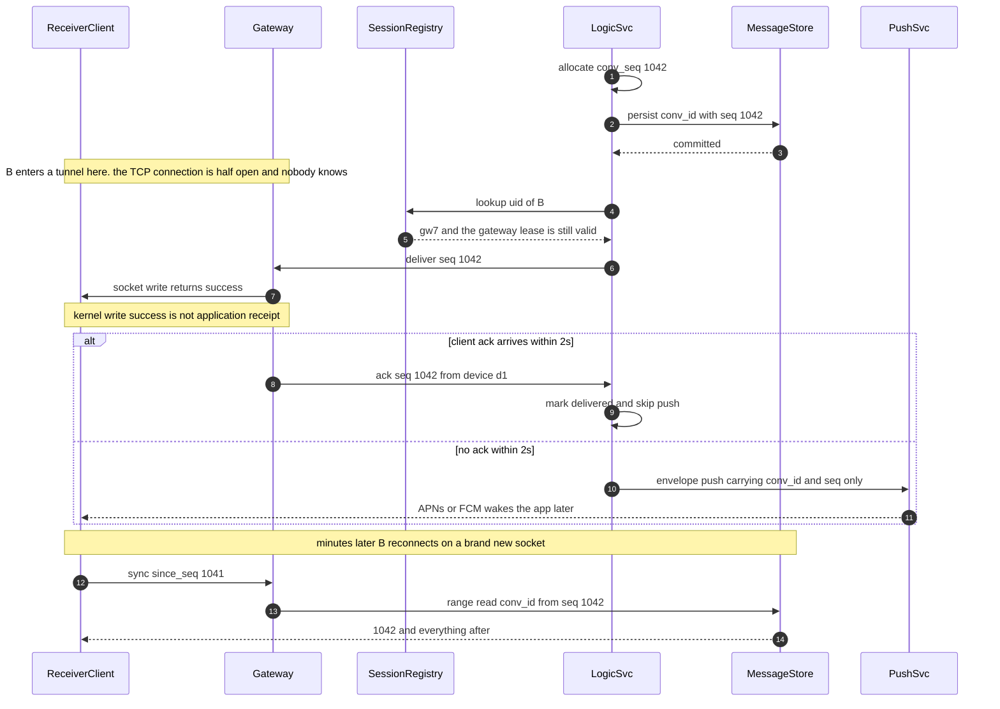

# 11 · 设计聊天系统（Design a Chat / Messaging System）

> 题面是"聊天"，考的是**有状态服务的路由**：A 的连接在机器 7、B 的在机器 91，你怎么找到 91；找到了推过去，你怎么知道 B 真的收到了。
> 消息存储在这道题里是最简单的一部分。**难的是连接、序号、和那条谁都不愿意画的拉取补齐线。**

---

## 0. 45 分钟怎么分配这道题

| 时间 | 做什么 | 这一段的得分点 |
|---|---|---|
| **0–5 min**<br>澄清 | 群上限、E2EE、已读回执、多端、历史保留期、规模 | 问出**群上限**和**要不要 E2EE**；当场说"这两个答案不同，我画的是两张不同的图" |
| **5–9 min**<br>估算 | 并发连接 → 接入机数；消息 QPS → 投递扇出；心跳；存储 | 算出"**投递扇出 247 次/消息，其中 97% 来自 5% 的大群**"，并立刻说出推论：大群必须走第二条路径 |
| **9–19 min**<br>高层 | 接入层 / 逻辑层 / 存储 / Registry / 推送，画数据流 | 主动说"**推送管延迟，拉取管正确性**"，并把 `since_seq` 那条线画出来 —— 90% 的候选人不画 |
| **19–25 min**<br>深挖① | 连接与用户的映射存哪 + 两级租约 | 说出"每连接 TTL = 167 万 Redis 写/s"这个数字，再给出降到 50/s 的做法 |
| **25–31 min**<br>深挖② | 会话内单调**连续**序号，为什么不能是时间戳 | 强调"连续"而不只是"有序"：客户端要能自证没漏 |
| **31–37 min**<br>深挖③ | 已读回执 O(n²) → O(n) → O(1)，或大群扇出 | 给出"大群索引是消息本身的 1,200 倍"这个数字 |
| **37–42 min**<br>收敛 | 3 条失败模式 + 演进触发信号 | 说重连风暴的瓶颈是 **TLS 握手 CPU**，不是内存 —— 这一条能立刻区分做过和背过 |
| **42–45 min**<br>反问 | "你们现在最痛的是哪一段：连接层、大群，还是多端一致？" | 显示你知道这题在真实系统里的分歧点在哪 |

---

## 1. 需求澄清

| # | 我会问的问题 | 面试官通常的回答（本文采用的假设） |
|---|---|---|
| 1 | 规模：DAU？峰值同时在线率？人均发多少条？ | 5,000 万 DAU，峰值在线 60%，人均 40 条/天 |
| 2 | ⚠️ **群聊上限多少人？** | 最大 10 万人 |
| 3 | ⚠️ **要端到端加密（end-to-end encryption, E2EE）吗？** | v1 不要，但要在设计里说明它会拿走什么 |
| 4 | 消息必达吗？允许乱序吗？ | 必达；**会话内**必须严格有序，跨会话不要求 |
| 5 | 要已发送 / 已送达 / 已读三态回执吗？群里也要？ | 单聊三态全要，群里的已读可以降级 |
| 6 | 多端登录几个？换新设备要看到历史吗？ | 手机 + 桌面 + 网页，最多 4 端；换设备要看到全部历史 |
| 7 | 历史保留多久？要服务端搜索吗？撤回要吗？ | 永久保留；要全文搜索；撤回要，编辑不要 |
| 8 | 单区域还是全球多区域？ | v1 单区域 + CDN，多区域列为演进 |

**不问就会做错方向的两个（写在白板上，别只在心里想）**：

- **第 2 题（群上限）。** 10 人群和 10 万人群不是同一个系统。前者写扩散（fan-out on write）无脑正确，后者会产生比消息本身多三个数量级的索引（§4.6 给数字）。按 10 人群画完整张图，面试官一句"那 10 万人的群呢"就能把方案清零。
- **第 3 题（E2EE）。** 它决定服务端**还能不能存在**。要 E2EE，第 7 题的"服务端搜索"直接作废，第 6 题的"换设备看历史"要整个重做。这两个需求在同一个系统里互斥，必须让产品先选（§4.7）。

---

## 2. 估算

### 2.1 连接：这道题的支配变量

```
DAU 5,000 万 × 峰值在线率 60% = 3,000 万 在线用户
× 平均在线设备 1.6（手机 + 桌面/网页）= 4,800 万 ≈ 5,000 万 并发 socket
单机连接上限取 10 万 ⇒ 5,000 万 ÷ 10 万 = 500 台接入机
单机内存 = 10 万 × 40 KB（TCP 收发缓冲 + TLS 会话 + 连接结构）= 4 GB ⇒ 16 GB 机器绰绰有余
单机消息投递 = 49 万/s ÷ 500 = 980 次/s（见 2.2）⇒ CPU 几乎空转
```

**推论 1：接入层的瓶颈既不是内存也不是稳态 CPU，是重连时的 TLS 握手。**
ECDSA P-256 服务端握手约 2,000–3,000 次/s/核（量级），8 核约 2 万次/s/台：

```
单台网关挂：10 万连接被 LB 分散到剩余 499 台 → 每台 200 次握手 → 无感
全局重连（发版 / LB 变更 / 运营商故障）：5,000 万 ÷ (500 × 2 万/s) = 5 s 理论下限
  客户端退避没做好 → 3 次重试叠加 → 15 s 以上的全站 CPU 饱和 → 二次雪崩
```

### 2.2 消息与投递扇出

```
20 亿 条/天 ÷ 86,400 = 23,148 msg/s 均值 × 3（峰谷比）= 69,444 ≈ 7 万 msg/s 峰值

会话构成假设：单聊 60% ｜ 小群（均 20 人）35% ｜ 大群（均 5,000 人）5%
在线投递次数 = (成员数 − 1) × 1.6 端 × 60% 在线率
  单聊 1 × 1.6 × 0.6 = 0.96 ≈ 1.0 ｜ 小群 19 × 1.6 × 0.6 = 18.24
  大群 4,999 × 1.6 × 0.6 = 4,799

全部写扩散：0.6×1.0 + 0.35×18.24 + 0.05×4,799 = 0.6 + 6.38 + 239.9 = 247 次投递/消息
            其中大群贡献 239.9 / 247 = 97.2%
大群改读扩散：0.6 + 6.38 = 6.98 ≈ 7 次投递/消息 ⇒ 降 35 倍；峰值投递 7 万×7 = 49 万/s
```

**推论 2：5% 的会话贡献 97% 的投递量。** 这是"大群必须从主链路物理分离"的量化根据 —— 和信息流里大 V 的结构完全同构（见 [`07-classic-canon.md` §1.3](07-classic-canon.md)）。**面试里把这个百分比说出来，比说十句"大群要特殊处理"有效。**

### 2.3 心跳：比消息量大 24 倍的那笔账

```
心跳间隔 30 s ⇒ 5,000 万 ÷ 30 = 166.7 万 心跳/s ÷ 7 万 msg/s 峰值 = 23.8 ≈ 24 倍
服务端 CPU：166.7 万 ÷ 500 台 = 3,333 次/s/台                      ← 便宜，不是问题
带宽：166.7 万 × 160 B（一来一回含帧与 IP 头）= 267 MB/s = 2.1 Gbps ← 摊到 500 台也不痛
```

**推论 3：心跳本身不贵，贵的是它带动的 Registry 续期。** 如果每次心跳都去 Redis 给 `uid → gw` 续一次 TTL，就是 **166.7 万 Redis 写/s**，按单分片 10 万 QPS 算要 **17 个分片纯做续期** —— 成本超过消息主链路本身。解法在 §4.1。

### 2.4 存储、带宽与成本

```
消息体 = 文本约 100 B + 元数据约 100 B（conv_id, seq, sender, ts, type）= 200 B
         媒体只存对象存储指针，字节不进消息库
20 亿 × 200 B = 400 GB/天 ｜ 90 天热层 = 36 TB × 3 副本 = 108 TB

同步索引（给每个成员写一条 24 B 的"你这个会话有新消息"，按成员数而非在线数，故 257 > 247）：
  全部写扩散  ：20 亿 × 257 条/消息 × 24 B = 12.3 TB/天  ← 消息本身的 31 倍
  大群改读扩散：20 亿 × 7.25 × 24 B        =  348 GB/天  ← 与消息同量级 ✅

下行带宽：49 万 × 400 B（含 TLS/帧开销）= 196 MB/s = 1.6 Gbps ⇒ 每台 3.2 Mbps
推送：合并后人均 8 条/天 × 5,000 万 = 4 亿/天 = 4,630/s × 3 = 1.4 万 push/s 峰值

月成本（2026 年中量级，随时变动）
  接入 500 台×$150 = $75,000 ｜ 逻辑 100 台×$150 = $15,000 ｜ Redis 10 节点 = $3,000
  热存储 108 TB×$0.08/GB = $8,640 ｜ 冷存储(压缩 3×) + 跨 AZ 流量 ≈ $3,900
  合计 ≈ $105,000/月 ÷ 5,000 万 DAU = $0.0021 / DAU / 月
```

**推论 4：每用户每月 0.2 分钱。** 聊天本身省不出钱，成本控制的全部意义在于**不让大群扇出和已读回执把这个数字放大 10 倍** —— 而这两件事如果不主动设计，一定会。

---

## 3. 高层设计

先给最简单能工作的版本：接入层只管连接，逻辑层管序号与落库，正确性挂在拉取上。

```
 ┌─ 接入层（业务无状态，唯一的状态是 TCP 本身）─────────────────────────┐
 │  App ══ WSS / HTTP3 ══► Gateway ×500                                 │
 │            · TLS 终止 · 鉴权 · 心跳 · 编解码 · 限速                   │
 │            · 零业务逻辑 ⇒ 改业务不用重启网关，不用断 5,000 万条连接    │
 └────────┬──────────────────────────────────────────┬──────────────────┘
     注册/续期租约                                 上行消息
          ▼                                          ▼
 ┌ Session Registry (Redis) ┐          ┌ Logic Svc（按 conv_id 分片）──────┐
 │ gw:7    → alive  EX 30   │          │ ① 幂等：client_msg_id 去重 5 min  │
 │ uid:bob → {gw:7, dev, ep}│◄─────────┤ ② 发号：conv_seq = 会话内 +1      │
 └──────────────────────────┘          │ ③ 落库：PK = (conv_id, seq)       │
                                       │ ④ 路由：查 Registry → 直投目标 gw │
          ┌────────────────────────────┤ ⑤ 2 s 内无 ack → 交给 Push Svc    │
          ▼                            └───────────────┬───────────────────┘
 ┌ Message Store ──────────┐                           ▼
 │ 分片 by conv_id         │                  ┌ Push Svc ─────────┐
 │ PK = (conv_id, seq)     │                  │ 合并 + 免打扰过滤 │
 │ 一条消息只存一份        │                  │ 信封式 payload    │
 └─────────▲───────────────┘                  │ → APNs / FCM      │
           │  GET /sync?since=S               └───────────────────┘
           │  GET /messages?conv&since_seq=N   ← 正文；正确性的唯一来源
           └── 重连 / 换端 / 冷启动 / 弱网 / App 被冻结，全部收敛到这两条
```

**一条单聊消息的一生**：客户端带 `client_msg_id` 上行 → 网关转给该 `conv_id` 所属的逻辑分片 → 幂等去重 → 分配 `conv_seq` → 写 Message Store 并等提交 → 回 ACK 给发送方（`sent`）→ 查 Registry 找接收方连接 → 直投目标网关 → 网关写 socket → 收到接收端 ack 标 `delivered`，2 秒无 ack 走推送 → 接收端上报 `last_read_seq` 标 `read`。

**四条不可动摇的边界**：① 接入层不放业务逻辑 —— 它是全系统最难重启的一层（5,000 万连接），目标是"半年不发版"；② **推送管延迟，拉取管正确性** —— "送到了"只能由客户端 ack 或 `since_seq` 拉取证明，不能由服务端 write 的返回值证明；③ 一条消息只存一份，会话是存储单位、用户不是，用户侧只存游标；④ `conv_seq` 永不复用、永不跳号、永不物理删除 —— 它是客户端"自证没漏"的唯一依据（§4.2）。

---

## 4. 深挖（6 个子问题 + 1 个约束）

### 4.1 连接层：网关、会话路由，以及 `uid → 连接` 到底存哪

**问题**：峰值 7 万 msg/s 展开成 49 万次投递，**每一次投递**都要回答"这个接收端现在连在哪台机器上"，且必须在 1 ms 内。

| 方案 | 查询成本 | 故障影响 | 扩缩容代价 | 适用规模 |
|---|---|---|---|---|
| **全网关广播**（每条消息广播给所有网关） | 0 次查询 | 无单点 | 0 | 7 万 × 500 台 = **3,500 万次内部投递/s，不可行**；网关 < 50 台时（350 万/s）勉强可行 |
| **一致性哈希** `uid → gw`，不存映射 | 0 次查询（算出来） | 无单点 | 加一台 = 1/N 连接被迫重连（10 万次握手） | 连接可随时迁移、且有路由服务告诉客户端连哪台 |
| **中心 Registry（Redis）** | 0.3–0.5 ms，可本地缓存 1 s 降到 ~0 | Redis 挂 = 全站不能直投（但可降级：全部走推送 + 拉取） | 0 | **默认选择** |

选 Registry。但**天真实现会被续期打死** —— §2.3 算过的 166.7 万写/s。正确做法是把 TTL 从连接级提到网关级：

```
 ❌ 每连接一个 TTL   uid:bob → gw:7  EX 90，每次心跳 SETEX
                    ⇒ 166.7 万 写/s，17 个 Redis 分片纯做续期

 ✅ 两级租约（lease）—— 续期量 166.7 万/s → 50/s，降 33,000 倍
    第一级  gw:7    → alive  EX 30    每台网关每 10 s 续 1 次；500 台 = 50 次/s
    第二级  uid:bob → {gw:7, dev_id, conn_epoch}  无 TTL，连接建立时写、正常断开时删
    读取：先看 gw:7 是否存活（结果本地缓存 1 s）→ 存活则直投；已死则视 uid 条目失效
    代价：网关被 SIGKILL 时它名下的 uid 条目最长残留 30 s，期间直投失败
          —— 失败即降级为推送 + 拉取，不影响正确性，因为正确性从来就不在推送上
```

`conn_epoch` 是单调递增的连接代号（fencing token 的同构物）：同一用户新连接建立时 epoch+1，逻辑层投递时携带，网关比对不一致即丢弃 —— 防止"旧连接的残留投递打到新连接上"。

**单机 10 万连接的其他约束**（面试官会挨个问）：`ulimit -n` 与 `fs.file-max` 都要调（10 万连接 ≈ 10 万 fd）；**端口不是问题** —— 服务端是 `(本机IP:443, 对端IP:对端端口)` 四元组，不受 65535 限制；40 KB/连接里大头是 TCP 收发缓冲，聊天消息小，调到 8–16 KB 后单机可上 30 万；Go/Java 在 10 万连接对象上的 GC STW 是真实约束，每连接的堆对象要压到几十个以内；移动端优先 **HTTP/3 / QUIC**，connection migration 让 WiFi→蜂窝切换不断连，在切换频繁的市场能砍掉 20–40% 的重连（量级，实测差异大）。

### 4.2 消息 ID 与会话内有序：为什么时间戳一定错

**问题**：客户端拿到一批消息，怎么排序？怎么知道自己**没有漏**？后者才是难点。

| 方案 | 有序 | **连续（能判缺）** | 抗时钟回拨 | 单会话吞吐 | 结论 |
|---|---|---|---|---|---|
| 客户端时间戳 | ❌ | ❌ | ❌ | — | 客户端时钟可伪造，一票否决 |
| 服务端墙钟（wall-clock）毫秒 | 弱 | ❌ | ❌ NTP 会回拨 | 同毫秒并发无法定序 | 错 |
| Snowflake / UUIDv7 | ✅ | ❌ | 部分 | 高 | 能排序，**不能判缺** |
| **`conv_seq` 会话内单调连续** | ✅ | ✅ | ✅ 与时钟无关 | ~1k–5k msg/s | **正解** |

**"有序"和"连续"是两件事，这是本节唯一的核心。** UUIDv7 可以排序，但客户端拿到 `...a3, ...a9` 两条时无法判断中间是否漏了 —— 因为 ID 空间本来就不连续。而 `seq=1041, 1043` 一眼就能看出缺 1042。**客户端的自证完整性只能建立在连续序号上。**

**三个 ID 各司其职，不能互相顶替**：

```
 client_msg_id  UUIDv4，客户端生成，重发时不变  → 幂等去重（服务端 5 min 窗口）
 conv_seq       会话内单调 +1，服务端发放       → 排序、定位、拉取水位线、判缺
 msg_id         Snowflake / UUIDv7，全局唯一    → 跨会话引用、日志、媒体 key、审计

 缺任何一个都会塌：
   只有 client_msg_id → 无法排序
   只有 conv_seq      → 无法跨会话引用；客户端重发会白占一个 seq，制造假空洞
   只有 msg_id        → 无法回答"我还差哪几条"
```

**发号实现与它的硬上限**：`conv_seq` 由持有该 `conv_id` 的逻辑分片在本地内存自增，配合号段式持久化高水位（崩溃后从高水位续，宁可跳一段号也绝不重复 —— 但**跳号必须留骨架**）。单会话吞吐受制于串行落库，约 **1,000–5,000 msg/s**（量级）。⇒ **10 万人大群必须限速，这既是技术必然也是产品必然**：全群 20 msg/s、每人每 3 s 一条。10 万人里每秒 100 条的消息流本来就没有人类能读。

**撤回与删除：三种"删"必须分开，且都不物理删 seq**

```
 revoke（对所有人）   seq 1042 msg    "..."           ← body 置空，骨架保留
                      seq 1103 revoke {target: 1042}  ← 新事件占新 seq，客户端按序应用
                      不对 1042 原地删除，否则已同步的客户端永远无法收敛
 delete_for_me        写进该用户的隐藏表 (uid, conv_id, seq)，不占 conv_seq，不广播
 retention 到期       批量清 body，保留 (conv_id, seq, tombstone) 骨架
```

**铁律：`conv_seq` 的骨架永远保留。** 一旦物理删除造成空洞，客户端 `since_seq` 补齐时无法区分"这条被删了"和"我漏了这条"，只能反复重拉 —— 一个用户的本地库损坏就变成对存储的持续放大攻击。

> **面试金句**
> "我不用时间戳，也不只用一个有序 ID。会话内必须是**单调且连续**的序号 —— 有序只解决排序，连续才解决'我知不知道自己漏了'。客户端存 `last_seq`，重连时带 `since_seq` 补齐，弱网、切网、App 被系统冻结、进程被杀这四种场景全部收敛到同一个机制上。代价是单会话的发号是串行的，上限大概几千条每秒，所以 10 万人的群必须限速 —— 而那本来就是产品该做的事。"
> "I wouldn't use timestamps, and I wouldn't rely on a merely sortable ID either. Within a conversation the sequence has to be monotonic *and* gapless — sortable only solves ordering, gapless is what tells a client whether it missed something. The client stores its last_seq and re-syncs with since_seq on reconnect, and that one mechanism covers a flaky network, a WiFi-to-cellular handoff, the OS suspending the app, and an outright process kill. The cost is that sequence allocation is serial per conversation, so you cap out at a few thousand messages a second — which means a hundred-thousand-member group has to be rate-limited anyway, and honestly it should be."

### 4.3 已发送 / 已送达 / 已读：写放大可能超过消息本身

**问题**：三态回执各需要一条独立的确认通道。前两态成本可控，**已读在群聊里是 O(n²)**。

```
 100 人群，一条消息，逐条上报已读：
   100 人各上报 1 条回执        = 100 次上行写
   每条回执再广播给群内 100 人  = 100 × 100 = 10,000 次推送
   ⇒ 一条消息制造 1 万次写。回执帧约 60 B × 1 万 = 600 KB，
     而消息本身只有 200 B ⇒ 回执流量是消息的 3,000 倍
```

| 方案 | 100 人群单条消息的回执开销 | 本题峰值写入 | 实时性 | 用在哪 |
|---|---|---|---|---|
| 逐条回执 + 全群广播 | 100 上行 + 10,000 推送 | 不可行 | 秒级 | 不用 |
| 逐条回执 + 只回发送者 | 100 上行 + 100 推送 | 49 万 × 2 = 98 万写/s | 秒级 | 仅单聊 |
| **按会话合并 `last_read_seq` + 节流 5 s** | ≤ 100 上行，不主动广播 | 49 万 × 40% 立即读 ÷ 3（合并比）≈ **6.5 万写/s** | 5 s | **默认** |
| 完全按需（打开"已读成员"面板才拉） | 0 常态写 | 0 | 打开时 | > 500 人群 |

**分档策略（写进设计文档，不要口头约定）**：单聊三态全开（`sent / delivered / read`，成本 ≈ 消息量 × 2，可接受）；≤ 100 人群只做 delivered 计数（"12/20 已送达"），已读按需查询；> 500 人群**完全关闭已读** —— 10 万人里谁读了，产品上也没有人在意。

存储侧：`last_read_seq` 是 per (uid, conv) 一行，5,000 万 × 50 会话 = **25 亿行 × 24 B = 60 GB**。行数不是问题，**它是一张 25 亿行、峰值 6.5 万 UPDATE/s 的表**才是 ⇒ 写在 Redis（`HSET read:{conv} {uid} {seq}`），每 30 s 批量落库；Redis 丢了从落库版本恢复，最多丢 30 s 已读进度 —— 这是所有状态里最不值钱的一种。

> **面试金句**
> "已读回执在群聊里是 O(n²)：100 人群一条消息，逐条上报是 100 条回执，每条回执再广播给 100 人 = 1 万次写。我把它降成 O(n)：客户端按会话上报'读到 seq=1042'并节流 5 秒；再降成 O(1)：常态不广播，只在用户点开'已读成员'时按需查。代价是已读状态从秒级实时变成打开面板时准确 —— 这个代价我主动买下，因为它换掉了整个系统里最大的一笔写放大。"
> "Read receipts in a group chat are O(n squared): one message in a hundred-person group means a hundred receipts, and each receipt fans out to a hundred people — ten thousand writes for one message. I collapse that to O(n) by having the client report 'read up to seq 1042' per conversation, throttled to once every five seconds, and then to O(1) by not broadcasting at all — the read-by list is fetched on demand when someone opens the panel. The cost is that read state is accurate when you open it instead of in real time, and I'll take that trade every time, because it removes the single biggest write amplifier in the system."

### 4.4 离线消息与推送：在线判定是一句谎话

**问题**：服务端认为"在线"的四个层次一个比一个弱 ——
`TCP 连接存活 ⊃ 网关进程存活 ⊃ App 进程存活 ⊃ App 在前台 ⊃ 用户真的看得到`，
最左边是服务端能观测的，最右边是产品真正关心的。半开 TCP（对端断电、地铁进隧道）下，服务端 `write()` 会成功返回并进入内核缓冲，直到几十秒后重传超时才报错。**"我写成功了"不等于"他收到了"** —— 这是整个系统里最大的一个谎言。

**下面这张图要让你看见 ASCII 画不出来的一件事：`socket write` 返回成功、Registry 说他在线、逻辑层认为已投递，这三件事同时为真的那个时间窗口里，消息其实一条都没到；而最终让系统收敛的那一跳，发生在几分钟之后、另一条连接上。**



> 📖 **读图要点**：注意第 7 步 `socket write returns success` 之后**没有任何一条边指回 `LogicSvc`** —— 送达这件事只能由第 8 步（客户端 ack）证明，服务端自己证明不了自己。真正让系统收敛的是第 12 步 `sync since_seq 1041`，它发生在几分钟后、一条全新的连接上，且完全不依赖前面 7 步里的任何一步是否成功。这就是"推送管延迟、拉取管正确性"在时间轴上的形状：把第 6–11 步全部删掉，系统依然正确，只是慢。

**推送侧的四个决策**：

| 决策 | 选择 | 代价 |
|---|---|---|
| 何时发 push | 直投后等 **2 s** 无 ack 才发 | ack 在 2 s 后到会重复通知一次，靠客户端按 `(conv_id, seq)` 去重兜住 |
| payload 装什么 | **信封式**：`{conv_id, seq, badge}`，正文客户端拉 | 点开通知多一次网络往返；但 APNs/FCM payload 上限 **4 KB**、内容可能已被撤回、E2EE 下服务端根本没有明文 |
| 怎么合并 / 去重 | 同会话 5 s 内多条合成一条"3 条新消息"；客户端以 `(conv_id, seq)` 为准，socket 与 push 谁先到用谁 | 人均 push 从 20 条/天降到 8 条/天（降 60%，这是推送量估算的依据）；客户端要维护已收 seq 集合 |

**2026 的通道现实**：FCM 的 batch send 端点已随 legacy API 于 **2024-06-20 关停**，Admin SDK 的 `sendEach` 虽然一次接受 500 条，底层仍是逐条 HTTP 请求（[Firebase 迁移说明](https://firebase.google.com/docs/cloud-messaging/migrate-v1)）。1.4 万 push/s 意味着 1.4 万条并发出网 HTTP/2 流，必须维持长连接池 + 多凭据分流 + 独立失败重试队列；无效 token 不按 APNs/FCM 反馈立即清理，失败率指标会直接失真（见 [`06-notification-platform.md` §4.7](06-notification-platform.md)）。

### 4.5 多端同步：水位线（watermark）设计决定了存储规模

**问题**：4 个设备各自离线了不同的时长，重新上线时怎么用最小的代价补齐？

**天真做法的账**：per (设备, 会话) 一个游标 → 5,000 万 × 1.6 端 × 50 会话 = **40 亿行 × 40 B = 160 GB，且高频写**。

```
 ✅ 两个游标，各管一件事：
   sync_seq  per (uid, device)  "这台设备同步到全局第几号变更"
             5,000 万 × 1.6 = 8,000 万行  ← 高频写，行数小
   read_seq  per (uid, conv)    "这个人在这个会话读到哪"（跨设备共享）
             5,000 万 × 50 = 25 亿行      ← 行数大；单会话 5 s 至多一次，但全局 6.5 万/s

 增量同步分两步（关键）：
   GET /sync?device=d1&since=S              → 变更流 [(conv_id, conv_seq, op)…] + new_S
                                              每条约 24 B，必须小到能一次拉完
   GET /messages?conv=c&since_seq=N&limit=200 → 该会话正文，可跨会话并发拉

 断档兜底 RESET —— 这条路必须存在：
   since 落后超过阈值（如 7 天 / 10 万条变更）⇒ 服务端返回 RESET
   客户端丢弃本地会话列表，改拉「会话列表 + 每会话最近 50 条」
   ⇒ 冷启动代价从 O(离线期间全部消息) 降到 O(会话数)
   没有这条路：一个离线三个月的用户上线拉 100 万条，同时打死存储和他自己的手机
```

**水位线推进的时序陷阱**：`sync_seq` 必须在客户端**成功写入本地库之后**才推进，绝不能在收到网络包时推进。否则 App 在这两步之间崩溃 = 永久丢消息且无法自愈。**客户端本地也要有 WAL 语义** —— 这条常被忽略，却是"用户说丢消息了、服务端日志里查不到"这类工单的头号来源。

### 4.6 群聊扇出：大群不是"大一点的小群"

**问题**：给群成员写"你有新消息"的索引，写还是不写？**先算成本交点，别拍数字** —— 设某会话每天 M 条消息、N 个成员、每人每天打开该会话 k 次：

```
 写扩散总成本/天 = M × N × w      w ≈ 20 μs（一次索引写）
 读扩散总成本/天 = N × k × r      r ≈ 2 ms（一次范围读 200 条 + 归并）
 交点：M × w = k × r  ⇒  M* = k × (r / w) = k × 100
   小群 M = 50 条/天，k = 5    ⇒ M* = 500 > 50    ⇒ 写扩散更便宜 ✅
   大群 M = 5,000 条/天，k = 3 ⇒ M* = 300 < 5,000 ⇒ 读扩散更便宜 ✅
```

**注意 N 被约掉了 —— 交点与群大小无关。** 真正的判据是"**消息密度 ÷ 人均阅读频率**"，不是成员数。群大小只是这个比值的代理变量：群越大，人均关注度越低，M/k 越高。**面试里说出这一条，比说"超过 500 人就不写扩散"高一个档次。**

**但成本交点只管平均值，还有两条独立的理由 + 三档路由**：

```
 ① 存储：万人群（1 万成员）一条消息的索引 = 10,000 × 24 B = 240 KB，消息本身 200 B
         ⇒ 放大 1,200 倍。该群 5,000 条/天：索引 1.2 GB/天 vs 消息 1 MB/天
 ② 尖峰：10 万人群一条消息 = 10 万次索引写要在 100 ms 内做完 = 瞬时 100 万写/s，
         堵死同队列上所有普通会话的投递 —— 这是延迟问题，加机器解决不了

 ≤ 50 人    写扩散：给每个成员的 sync 流写索引，读时 O(1)
 50–500 人  混合：只给「最近 7 天活跃」的成员写（约 30%），其余读时补
 > 500 人   不写扩散：只存一份会话消息，成员靠 会话列表 + since_seq 拉；
            推送只发给 ①被 @提及 的人 ②最近 30 分钟有交互的人；
            大群消息不进 sync 流，避免污染小会话的增量同步
```

**队列必须按扇出量分优先级**（和信息流里的大 V 完全同构）：小扇出走快车道，大扇出走慢车道。共用一条队列时，一个万人群的刷屏会让所有单聊延迟到分钟级。

### 4.7 端到端加密：把服务端降级成哑管道的代价

E2EE 不是在架构图上加一个加密框。它一次性拿走这些能力：

| 服务端能力 | 明文模式 | E2EE 模式 | 补偿方案与它的代价 |
|---|---|---|---|
| 全文搜索 | 一个倒排索引（inverted index） | ❌ | 客户端本地索引；新设备没有历史可搜；索引占端上存储 |
| 换设备看历史 | 拉就有 | ❌ 新设备没有旧密钥 | 加密备份（用户密码派生密钥）或设备间直传；**忘记密码 = 历史永久丢失** |
| 内容审核 / 反垃圾 | 服务端模型 | ❌ | 只剩举报 + 元数据信号（发送频率、社交图谱） |
| 链接预览 | 服务端抓取 | ❌ | 客户端抓 → 把用户 IP 泄露给第三方站点 |
| 消息撤回 | 服务端删 body | ❌ **不可强制** | 撤回退化成"礼貌请求"，改过的客户端可以忽略 |
| 媒体缩略图 / 转码 | 服务端做 | ❌ | 客户端加密后上传，缩略图也得客户端生成 |
| 已读/送达聚合 | 服务端算 | 部分可以 | 回执本身不含内容可不加密，但会泄露社交图谱 |

**群聊 E2EE 的两条路**：

| | Sender Keys（Signal 群聊的经典做法） | **MLS**（[RFC 9420](https://www.rfc-editor.org/info/rfc9420/)，2023-07） |
|---|---|---|
| 单条消息加密成本 | 1 次对称加密 | 1 次对称加密（相同） |
| **成员变更成本** | O(n)：每次进出群重新分发 sender key<br>1 万人群加一个人 ≈ 1 万次密钥分发 | **O(log n)**：基于树的 ratchet<br>同样场景约 14 次 |
| 标准化 / 生态（2026） | 私有协议；Signal / WhatsApp | IETF 标准、跨平台可互通；Cisco、RingCentral 已上线，Google Messages 宣布采用，Matrix 在试；设计目标覆盖到 5 万人群 |

**判断：超过 1,000 人的 E2EE 群，Sender Keys 的成员变更成本会压垮系统 —— 这是 MLS 存在的唯一理由。** 但 MLS 不解决多端历史同步，也不解决搜索，那两件事是产品必须接受的净损失。

> **面试金句**
> "E2EE 把服务端从'能理解内容的系统'降级成'加密字节的可靠存储与路由'。搜索、审核、链接预览、换设备看历史、可强制的撤回 —— 这五件事一次性全没了，每一件都要在客户端重做一遍或者干脆放弃。所以我会先问产品一个问题：你要的是隐私承诺，还是合规审计？这两个需求在同一个系统里互斥，选了就没有中间态。"
> "End-to-end encryption demotes the server from something that understands content to a reliable store-and-forward pipe for opaque bytes. Search, moderation, link previews, multi-device history, and enforceable deletion all disappear at once, and every one of them has to be rebuilt on the client or given up. So I'd ask the product side one question first: do you want a privacy guarantee or a compliance audit trail? Those two are mutually exclusive in one system — pick one, there's no middle ground."

### 什么时候这整套设计是错的

| 情况 | 该做什么 |
|---|---|
| **< 10 万 DAU，单区域** | 一个 Go/Node 进程 + Postgres `LISTEN/NOTIFY` 或 Redis pub/sub。**别建 Registry、别建 Kafka、别分片**。500 行代码能跑到 1 万并发连接 |
| **团队协作型 IM（Slack 型）** | 会话是"房间"、成员固定、消息集中在少数活跃房间 ⇒ 一个房间一个有状态对象的模型天然吻合。[Cloudflare Durable Objects](https://developers.cloudflare.com/durable-objects/concepts/what-are-durable-objects/) 的 **WebSocket Hibernation API** 让连接保持在边缘而对象从内存卸载，空闲期不计 duration 费 —— 自建 500 台接入机在这个规模上是纯亏 |
| **客服 / 工单型对话** | 会话短、并发低、必须可审计 ⇒ **根本不需要长连接**。SSE + 轮询兜底，消息进关系库，搜索直接用 Postgres 全文索引 |
| **消息 < 1,000 万/天 且无大群** | 单库一张表，PK `(conv_id, seq)`。分片是负债不是资产 |
| **直播弹幕 / 广播** | **完全不同的题**：不要求必达、不要求会话内严格有序、不要求历史。用尽力广播 + 采样丢弃 + 边缘聚合；用聊天系统的架构做弹幕是数量级的浪费 |

**2026 年"要不要自建接入层"的判据**：托管实时层（Ably / Pusher / PubNub / Durable Objects）在房间型场景已经足够便宜。**自建需要一个明确的理由** —— 数据驻留（data residency）、合规、超出托管方案的规模、或极端成本敏感。"我们要自己控制"不是理由，500 台机器的 on-call 是真实成本。

---

## 5. 失败模式

| 故障 | 影响 | 检测信号 | 应对 / 降级到什么 |
|---|---|---|---|
| **重连风暴**（一台网关重启 → 10 万客户端同时重连） | TLS 握手 CPU 饱和，波及正常连接 | 网关 CPU 突增 + TLS handshake/s 尖峰 + 鉴权服务 p99 上升 | 客户端**指数退避 + 全抖动**（full jitter）；网关侧入连接限速（如 2,000/s/台）；鉴权结果本地缓存 60 s；发版必须滚动 + 每批间隔 ≥ 退避窗口 |
| **Registry 不可用** | 无法直投，所有消息延迟到推送/拉取路径 | Registry 错误率 > 1%；直投成功率骤降 | **降级不降正确性**：全部走推送 + 客户端拉取，延迟从 100 ms 涨到几秒但不丢消息。这条降级必须常态演练 |
| **半开 TCP / 僵尸连接** | 服务端认为在线，实际不通；消息"投出去了"没人收 | 投递 ack 率下降；连接存活时长分布出现长尾 | 应用层心跳（30 s）+ TCP keepalive 双保险；连续 2 次心跳缺失即主动关连接并删 Registry 条目 |
| **单会话 seq 发号热点**（万人群刷屏） | 该会话消息延迟飙升，可能拖累同分片其他会话 | 单 `conv_id` 的发号 QPS > 1,000；分片队列 lag 上升 | 全群级限速（20 msg/s）+ 每人限速（1 条/3 s）；热点会话单独迁到独占分片 |
| **大群扇出堵塞普通会话** | 单聊延迟从 100 ms 涨到分钟级 | 扇出队列 lag 按扇出量分桶后，大桶 lag 持续增长 | 按扇出量分优先级队列，小扇出走快车道；大群超阈值直接切读扩散 |
| **客户端游标回退**（本地库损坏 → `since_seq=0`） | 全量重拉，单用户即可打出 GB 级读放大 | 单用户 `/messages` 请求量突增；`since_seq` 跳变为 0 | 服务端强制 RESET 路径（§4.5）+ 单用户拉取配额；`since_seq=0` 只返回会话列表和每会话最近 50 条 |
| **消息已发号但未落库** | 客户端拉到空洞，反复重试 | `seq` 高水位与存储最大 seq 的差值持续 > 0 | 先落库再回 ACK（顺序不能倒）；未落库的 seq 由后台补写 tombstone 骨架，绝不让空洞长期存在 |

---

## 6. 演进路线

```
v0  < 10 万 DAU，< 1 万并发连接
    单进程 WebSocket + Postgres 一张 messages 表（PK = conv_id, seq）；
    在线判定放进程内存；离线直接查表；推送用第三方 SDK 直发。
    ── 撞墙信号（可观测，不是"用户变多"）──
      单机并发连接 > 5 万 且 GC STW > 200 ms ｜ messages 写入 > 5,000 TPS

v1  < 500 万 DAU
    接入层与逻辑层分离；Redis Session Registry（每连接 TTL）；消息库按 conv_id 分片；
    独立推送服务；已读回执按会话合并。
    ── 撞墙信号 ──
      Registry 续期 QPS > 10 万（该上两级租约了）｜ 单个 conv_id 发号 QPS > 1,000
      ｜ 扇出队列 lag > 10 s 且集中在少数大群

v2  5,000 万 DAU  ← 本文
    两级租约 + 大群读扩散 + 回执分档 + sync/messages 两步同步 + 扇出优先级队列
    + 推送合并与信封式 payload。
    ── 撞墙信号 ──
      全局重连时 TLS 握手 CPU 饱和 > 30 s ｜ 跨区域用户 > 30% 且 p95 > 200 ms
      ｜ 单区域接入机 > 800 台

v3  多区域 + 会话归属地路由，或 E2EE（MLS）
    ── 触发信号 ──
      > 30% 的会话成员跨区域（"会话归属哪个区域"升级为首要设计问题）
      ｜ 产品/合规明确要求 E2EE —— 服务端搜索与多端历史同步全部要重做
```

---

## 7. 常见错误答法

| mid-level 会怎么答 | 为什么掉分 | 正确的说法 |
|---|---|---|
| 「每个用户一个 Kafka topic 当信箱」 | 5,000 万 topic 会让 Kafka 的分区元数据直接爆炸；且 Kafka 无法按消息单独 ack | **Kafka 是管道，不是用户级信箱。** 用户信箱是 `(conv_id, seq)` 上的一次范围读，游标存在客户端和 `sync_seq` 里 |
| 「用时间戳排序就行」 | NTP 会回拨、同毫秒并发无法定序、客户端时钟可伪造；更致命的是**不连续 ⇒ 客户端无法判缺** | 会话内**单调且连续**的 `conv_seq`。有序解决排序，连续解决"我漏没漏" |
| 「推送保证送达，客户端不用拉」 | `socket write` 返回成功 ≠ 应用收到。半开 TCP、App 被系统冻结、进程被杀、客户端崩在落库前 —— 四种场景推送全失败且服务端不知道 | **推送管延迟，拉取管正确性。** 把推送整条路径删掉系统依然正确，只是慢 |
| 「大群就是大一点的小群，写扩散加机器就行」 | 万人群的索引是消息本身的 1,200 倍；10 万次写的瞬时尖峰会堵死同队列的所有单聊。同理「已读回执每条存一行」在群里是 O(n²) | 按成本交点 `M* = k × (r/w)` 分档，大群走读扩散 + 独立队列，判据是**消息密度 ÷ 阅读频率**而不是成员数；已读按会话合并 + 节流 + 分档 |

---

## 8. 相关章节

| 这题用到的构件 | 章节 |
|---|---|
| WebSocket vs SSE、空闲超时与优雅关闭、QUIC connection migration | [`01-building-blocks/04-networking-and-edge` §2、§4](../01-building-blocks/04-networking-and-edge.md) |
| 租约（lease）、fencing token、时钟为什么不可信 | [`01-building-blocks/05-consensus-and-coordination` §4、§5](../01-building-blocks/05-consensus-and-coordination.md) |
| 复合主键 `(conv_id, seq)`、LSM 范围读、墓碑（tombstone）｜ Registry 的本地 L1 缓存、TTL 抖动 ｜ 去重窗口、消费者 lag、优先级队列 | [`01-storage-engines`](../01-building-blocks/01-storage-engines.md) ｜ [`02-caching`](../01-building-blocks/02-caching.md) ｜ [`03-messaging-and-streams`](../01-building-blocks/03-messaging-and-streams.md) |
| 峰谷比、Little's Law、并发连接估算 | [`00-foundations/02-capacity-estimation`](../00-foundations/02-capacity-estimation.md) |
| 退避与抖动、重试放大、优雅降级 ｜ 撞墙信号怎么定 | [`03-resilience-patterns`](../05-reliability/03-resilience-patterns.md) ｜ [`05-scaling-playbook`](../05-reliability/05-scaling-playbook.md) |
| APNs/FCM 通道、token 生命周期、免打扰与合并 | [`06-notification-platform` §4.4、§4.7](06-notification-platform.md) |
| 长连接 + presence 的同构问题、离线合并 ｜ 本题的压缩版（母题 D） | [`05-realtime-collaboration` §4.4、§4.5](05-realtime-collaboration.md) ｜ [`07-classic-canon` §1.4](07-classic-canon.md) |

---

## 面试官会追问

1. 一台接入机挂了，10 万连接同时重连。瓶颈是什么？给我一个数字，以及你会限速到多少。
2. `uid → 连接` 的映射存哪？如果每次心跳都续一次 TTL，Redis 要扛多少 QPS？你怎么把它降下来？
3. 为什么不能用时间戳做消息 ID？UUIDv7 是有序的，为什么还不够？
4. 客户端说"我少了一条消息"。你的系统靠什么让他自己证明，而不是让你查日志？
5. 100 人群一条消息，逐条上报已读会产生多少次写？你降到多少？代价是什么？
6. 服务端 `socket write` 返回成功了，消息一定到了吗？如果没到，靠哪一步收敛？
7. 10 万人的群发一条消息，你写不写索引？给我阈值的算法，不要给一个整数。
8. 上了 E2EE 之后服务端还剩什么能力？搜索和"换新设备看历史"怎么办？
9. 一个用户离线三个月后上线，会发生什么？消息撤回又为什么不能直接删那一行？

---

## 自测

遮住上文，你能不能说出：

1. **投递扇出的那个百分比**：为什么 5% 的会话贡献了 97% 的投递量，以及这个数字直接推出了哪个架构决策？
2. **两级租约**：为什么 `uid → gw` 不能各自带 TTL？两级租约把 166.7 万/s 降到了多少，代价是什么（提示：残留窗口有多长，为什么这个窗口不影响正确性）？
3. **有序 vs 连续**：Snowflake 和 `conv_seq` 都能排序，为什么只有后者能让客户端自证没漏？以及这件事如何反过来约束了"撤回"的实现（为什么不能物理删）？
4. **已读回执的三档**：O(n²) → O(n) → O(1) 分别是怎么做到的，每一档买下了什么代价？
5. **写扩散阈值**：成本交点公式是什么，为什么它与群成员数 N 无关？除了成本，还有哪两个独立的理由要求大群走另一条路径？

---

**下一篇** → [12-distributed-cache.md](12-distributed-cache.md)：一致性哈希是入场券，缓存挂了数据库怎么活才是评分点。
