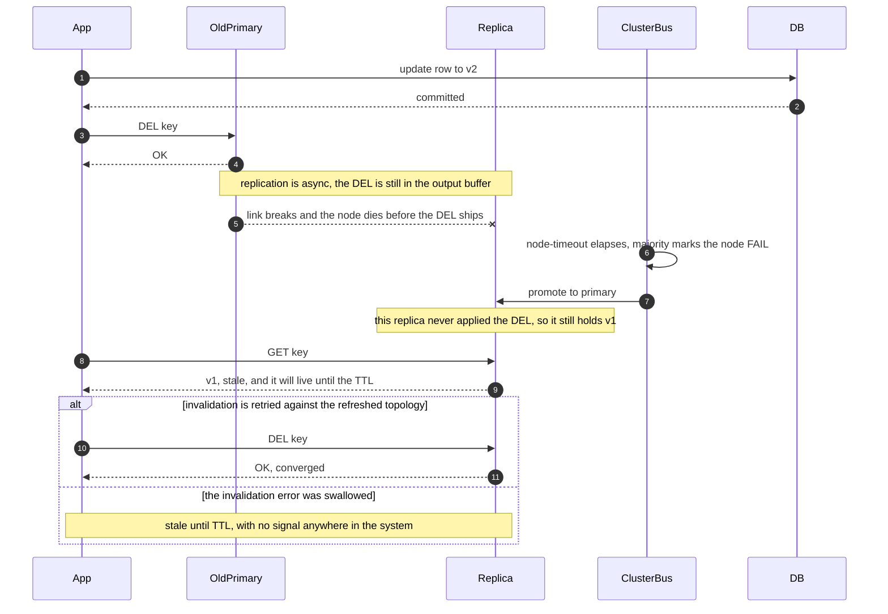

# 12 · 设计分布式缓存（Design a Distributed Cache）

> 这题的题面是"怎么把数据缓存起来"，考的却是"**缓存不在了，这个系统还活不活得下去**"。
> 一致性哈希（consistent hashing）是入场券，回源（origin fetch）路径上那个能说出数字的并发上限才是分数线。

---

## 0. 45 分钟怎么分配这道题

| 时间 | 做什么 | 这一段的得分点 |
|---|---|---|
| **0:00–0:04** | 快速过 8 个澄清问题，重点锁死两件事：**缓存里的东西能不能丢**、**数据库平时承担多少流量、上限是多少** | 面试官在第 3 分钟就能判断你会不会问"缓存挂了怎么办"。不问这两个，后面全是空中楼阁 |
| **0:04–0:09** | 估算：外部 QPS → 扇出（fan-out）→ 峰值 → miss QPS → **从数据库容量倒推目标命中率** → 分片数 / 内存 / 带宽 / 连接数 | 倒推命中率是全场第一个区分点。只报"100 万 QPS"而没有推论，等于没估 |
| **0:09–0:19** | 高层设计：先画**最简单能工作的版本**（cache-aside + 一致性哈希 + TTL），再明说"接下来我加三件事"：L1、单一失效来源、回源闸门 | 分层展开 > 一次画完。面试官要看你知道哪些是必需、哪些是加固 |
| **0:19–0:22** | 主动提名深挖点："我想挖回源限流、扩缩容迁移、热 key。第一个是这题最难的，我从它开始。" | **提名权拿到手 = 你控制了后 20 分钟的话题**。等着被问，节奏就是面试官的 |
| **0:22–0:31** | 深挖一：缓存全挂 → 信号量（semaphore）容量推导 → 600 个实例上怎么落地 → 降级阶梯 → 恢复曲线 | **这一段决定这道题的分数。** 给不出信号量容量的具体数字，其余全对也只在 hire 边缘 |
| **0:31–0:37** | 深挖二 + 三：扩缩容的 miss QPS 与分批上限；热 key 的 833× 与它的陈旧代价 | 每个深挖都要落到一个数字 + 一句代价，否则是在复述教科书 |
| **0:37–0:41** | 失败模式表 + 演进触发条件 | 说"信号是 X 超过 Y，我就做 Z"。说"用户变多了再优化"直接掉档 |
| **0:41–0:45** | 收敛：撞墙点、什么条件下整套方案是错的、只有两周你先建哪一半 | 主动说边界，比被问出来强一个档次 |

**节奏红线**：一致性哈希的实现细节讲超过 **90 秒**就是在丢分。那是本科知识，不是这题的区分度。

---

## 1. 需求澄清

| # | 我会问 | 面试官通常怎么回 | 为什么它决定架构 |
|---|---|---|---|
| 1 | 是要我实现一个**缓存中间件**（自建 Redis-like 服务），还是给一个业务**设计缓存层**？ | 后者，可以用现成的 Redis / Valkey | 前者要讲存储引擎与协议，后者讲拓扑与失效。两条完全不同的路 |
| 2 | ⚠️ **缓存全挂了，业务能降级吗？数据库平时承担多少流量、点查上限是多少？** | 可以降级但不能全挂；DB 点查上限约 2 万 QPS | **这一问定义了整道题的答案**。见 §4 深挖三 |
| 3 | ⚠️ **缓存里的东西全部丢掉，能靠回源重建吗？** | 能，纯缓存语义 | 不能重建的东西（会话、锁、去重窗口）根本不该叫缓存，它是内存数据库，设计目标完全不同 |
| 4 | 需要 read-your-writes 吗？能容忍多少陈旧（staleness）？ | 用户改自己的资料要立刻看到；别人看到的可以陈旧 3 s | 决定失效（invalidation）策略，也决定 L1 的 TTL 能设多长 |
| 5 | value 大小分布？有没有 > 1 MB 的？读写比？ | 中位 2 KB，p99 50 KB，读写比 100:1 | 大 key 是分片倾斜（load skew）与 p99 毛刺的主因，见 §4 深挖五 |
| 6 | 数据总量与活跃工作集？key 有多少个？ | 3 亿 key，24 h 内被访问过的约 40% | 直接决定内存与分片数 |
| 7 | 单区域还是多区域？p99 目标？ | 单区域三 AZ；p99 < 5 ms（端到端含回源） | 决定要不要跨区失效广播 |
| 8 | 有没有周期性批处理（对账、导出、爬虫）会扫过冷数据？ | 有，每天凌晨 | 这一问直接引出淘汰策略（eviction policy）的选型，见 §4 深挖四 |

**不问第 2、3 问就会做错方向**：不问第 2 问，你会把 20 分钟花在一致性哈希上，而面试官全程在等回源限流；不问第 3 问，你可能给一个"缓存 + 强持久化 + 强一致复制"的方案 —— 那不是缓存，是把成本抬高 3 倍去解决一个不存在的问题。

**本文假设**：电商/内容型 SaaS 的读缓存；峰值 100 万 QPS 缓存读；纯 cache 语义（可丢、可重建）；单区域三 AZ；数据库为 1 主 4 从的关系型数据库，点查硬上限 2 万 QPS。

---

## 2. 估算

### 2.1 QPS：扇出才是真正的放大器

```
外部请求（页面 + API）13 亿次/天 ÷ 86,400 = 15,000 QPS 均值
× 每请求平均展开 20 次缓存读（商品 / 用户 / 权限 / 配置 / 计数 …）= 30 万 QPS 均值
× 峰谷比（peak-to-average ratio）3.5 = 105 万 QPS 峰值，记作 100 万
写（失效）：读写比 100:1 ⇒ 1 万 QPS 的 DEL
```

**解读**：外部 1.5 万 QPS 是个小系统，缓存层 100 万 QPS 是个大系统 —— **中间那个 20× 扇出是这道题所有难度的来源**。面试官给"100 万 QPS"时，第一件事是问清它是外部还是内部，两者差两个数量级的架构。

### 2.2 目标命中率不是拍的，是从数据库容量倒推的

```
数据库点查硬上限 2 万 QPS ⇒ 安全预算（60% 利用率）1.2 万 QPS
  （超过 80% 利用率排队延迟指数上升，见 ../00-foundations/02-capacity-estimation.md §3）
⇒ 目标命中率 ≥ 1 − 12,000 / 1,000,000 = 98.8%  ⇒ 定 99%

反过来验证"95% 命中率听起来不错"：
  miss = 5 万 QPS = 安全预算的 4.2 倍 = 硬上限的 2.5 倍
  ⇒ 95% 在这个量级是不合格的：它意味着**稳态就把数据库压在红线外**
```

> **在 100 万 QPS 上，命中率的每 1% 值 1 万 QPS 的数据库容量。** 命中率不是"越高越好"的软指标，它是一个由下游容量反推出来的硬约束。

**但它也有天花板**：按 Zipf（α ≈ 0.9）的经验，命中率从 99% 提到 99.5% 需要工作集大约翻倍。0.5% 换来 5,000 QPS 的数据库容量（约 0.25 台只读副本，量级 $400/月），而内存翻倍是 +$16k/月。**边际收益在 99% 附近就已经反转 —— 追的是 miss QPS 的绝对值，不是命中率这个比率。**

### 2.3 内存与分片数

```
key 总数 3 亿；24 h 活跃工作集 40% = 1.2 亿 key；value 中位 2 KB、均值 4 KB
数据 1.2 亿 × 4 KB = 480 GB
元数据 1.2 亿 × 150 B（key 串 + 对象头 + 字典项 + 过期字典）= 18 GB   ⇒ 小计 500 GB
× 内存碎片率 1.3（jemalloc 典型）= 650 GB 实占
+ 30% 余量（突发写入 + defrag 期间）⇒ 规划 850 GB

单节点 maxmemory：不开持久化 → 96 GB 机器可设 70% = 67 GB ⇒ 850/67 = 12.7 → 13 分片
                 开 RDB → 只能设 50% = 48 GB      ⇒ 850/48 = 17.7 → 18 分片
                 （BGSAVE 的 fork 写时复制最坏要再复制一份全量）
```

**这一步就把"要不要开持久化"变成了"要不要多买 10 台机器"** —— 见 §4 深挖六。本文先按开持久化的保守口径取 **18 分片**，副本 1 份 ⇒ 36 节点，跨 3 AZ 每 AZ 12 台；每分片 5.6 万 QPS，在单节点 8–15 万上限内留了 2 倍余量。

### 2.4 带宽、连接数、成本

```
带宽：100 万 QPS × 4 KB = 4 GB/s = 32 Gbps；18 分片 ⇒ 每节点 1.8 Gbps，网卡富余 8 倍
      但 p99 value 是 50 KB：某个爆款商品的聚合详情若到 2 万 QPS = 1 GB/s = 8 Gbps
      打在**一个**节点上 —— 一个 key 吃掉三分之一张网卡
      ⇒ 大 key × 热 key 是唯一能靠单个 key 打死一个分片的组合
连接数：600 实例 × 每分片池 8 条 × 18 分片 = 8.6 万 ⇒ 每主节点 4,800，低于默认
      maxclients 10,000，但实例翻倍就撞线，且每条连接的输出缓冲区**不计入 maxmemory**
      ⇒ 靠 pipelining 压小连接池，而不是靠加连接提吞吐
成本：36 × 96 GB 级内存实例，按需约 $0.6–0.9/节点/小时（2026 年中量级）⇒ $16k–23k/月
      对照：100 万 QPS 全走数据库要约 50 台 2 万 QPS 级只读副本 ≈ $75k/月，且写主库
      根本扛不住 ⇒ 缓存 ROI 3–4 倍，而且它是唯一能把 p99 从 20 ms 压到 1 ms 的手段
```

**托管 vs 自管的交叉点**：托管 serverless 缓存（如 ElastiCache Serverless / Valkey 引擎）在 10 GB + 5 万 QPS 量级约 $900/月，而同等负载的 node-based 集群单价便宜约 [4 倍](https://www.usage.ai/blogs/aws/database-savings-plans/elasticache/serverless-pricing/)（2026 年口径）。**交叉点大约在 5 万 QPS**：低于它用 serverless 省心且更便宜，高于它必须回到按节点计费。本题 100 万 QPS + 700 GB，serverless 不是选项。

---

## 3. 高层设计

### 3.1 先给最简单能工作的版本

```
 读: App ─▶ 缓存客户端 ─hash(key)─▶ 分片 ─▶ 命中: 返回（p99 ≈ 1 ms）
                                    └─▶ 未命中 ─▶ DB ─▶ SET key TTL=300+jitter
 写: App ─▶ ① 先写 DB ─▶ ② 再 DEL key      （删，不是 SET；顺序不能反）
```

两条规则来自 [`../01-building-blocks/02-caching.md` §2](../01-building-blocks/02-caching.md)：**更新时删缓存而不是写缓存**（写缓存在并发下会产生永久脏值，删是幂等的）；**先写 DB 再删缓存**（反过来会在窗口里被读请求回填旧值）。这个版本在 5 万 QPS 以下能跑很多年，在 100 万 QPS 下会死于三件事：扩容时全量失效、单个热 key 打爆分片、缓存挂掉时数据库瞬间崩溃。下面三个加固分别对应。

### 3.2 加固后的完整版

```
        ┌─────────── 唯一失效来源 ───────────┐
        │ DB binlog/WAL ─▶ CDC ─▶ Invalidator │──▶ DEL（幂等·可重试）─┐
        └─────────────────────────────────────┘                       │
 Client ──▶ ┌──────────────────────────────────────────────────┐      │
            │ App 实例 ×600                                     │      │
            │  L1: Caffeine / W-TinyLFU，仅热榜 key，TTL 1–3 s   │      │
            │      └ miss ─▶ Cache Proxy sidecar（+0.15 ms）    │      │
            └────────────────────┬─────────────────────────────┘      │
                                 │ 一致性哈希环 18 主 × 200 vnode      │
                                 │ 带单调 topology_version             ▼
        ┌────────────────┐ ┌────────────────┐   ┌────────────────┐
        │shard-01 主 AZ-a│ │shard-02 主 AZ-b│ … │shard-18 主 AZ-c│
        │  └async▶从AZ-b │ │  └async▶从AZ-c │   │  └async▶从AZ-a │
        └───────┬────────┘ └────────────────┘   └────────────────┘
                │ L2 miss
                ▼
  ┌──────────── 回源闸门（origin-fetch gate）三层，缺一不可 ────────────┐
  │ ① single-flight：同一 key 的并发 miss 合并成 1 次                    │
  │ ② 全局并发硬上限 = 200（落在 pgbouncer pool_size；wait_timeout 50 ms）│
  │ ③ 拿不到许可 → 降级阶梯：serve stale → 简版响应 → 503                │
  └──────────────────────────────┬──────────────────────────────────┘
                                 ▼   Primary DB + 4 replicas（上限 2 万 QPS）
```

**四条不可动摇的边界**：① **失效只能有一个来源** —— 应用侧 DEL 与 CDC 并存时两条路径的时序打架必然产生长期脏值，选 CDC 作为唯一权威来源，应用侧 DEL 只是"加速"，失败可忽略；② **所有 key 必须有 TTL 上限**（本文 300 s + 抖动），TTL 不是失效手段而是**兜底手段**，把任何一次失效丢失的影响封顶在 5 分钟；③ **缓存和"不能丢的东西"分实例** —— 分布式锁、会话、去重窗口不能与缓存混住，淘汰策略无法同时满足"可淘汰"和"不能丢"；④ **回源限流是全局的，不是每分片的** —— 单分片故障就会把 5.6 万 QPS 推给数据库，按分片切分的信号量挡不住。

---

## 4. 深挖

### 深挖一 · 分片与一致性哈希：vnode 数怎么定，扩容时命中率掉多少

**问题**：取模分片在扩容时会让绝大多数 key 重映射。18 → 19 台，`hash % 19` 下只有 `1/19 = 5.3%` 的 key 仍落在原节点 —— **94.7% 的缓存瞬间作废**，等价于主动制造一次大规模同时失效（mass expiration → cascading failure）。一致性哈希把这个数字降到 `1/N`。但它降的是**重映射比例**，不是**命中率跌落** —— 这两个数字不一样，绝大多数人只答前者。

**vnode 数的判据是"最重的那个节点还在不在容量内"**：

| vnode/节点 | 负载标准差 ≈ 1/√V | 环内条目总数（18 台） | 最重节点 QPS（均值 5.6 万，+3σ） | 结论 |
|---|---|---|---|---|
| 1 | 实测 ±40–50% | 18 | > 13 万 | 不可用，逼近单节点上限 |
| 100 | 10% | 1,800 | 7.3 万 | 勉强 |
| **200** | **7%** | **3,600** | **6.8 万** | **✔ 本题选这个** |
| 400 | 5% | 7,200 | 6.4 万 | 收益 0.4 万 QPS，环查找与拓扑广播翻倍 |
| 1,000 | 3% | 18,000 | 6.1 万 | 收益递减，拓扑传播成为新问题 |

**选 200 的理由不是"方差好看"，是最重节点 6.8 万 QPS 仍在单节点 8–15 万上限的一半以内。** 判据永远是"最坏节点是否还在容量内"，不是标准差本身。**什么条件下改**：节点数少（< 6 台）时单节点占比大 → 提到 500；节点数多（> 100 台）时环元数据与传播成本上升 → 降到 100，或换成固定 slot 方案（如 16384 个 slot 手工分配），把"再平衡"从"重算环"变成"搬 slot"，可控性高一个量级。

**扩容时到底掉多少命中率**：

```
   hash 空间 [0, 2^32)          v = vnode（每主 200 个）
   ...──[v]──[v]──[v]──[v]──[v]──[v]──[v]──...
        N3   N7   N1   N12  N5   N9   N2
   加入 N19（200 个 vnode 均匀插入）：
        N3   N7  [N19] N1   N12 [N19] N5  ...
                  ↑                ↑   只有落在 N19 与其原顺时针后继之间的 key
                                       被重映射 = 1/19 = 5.3%，且在 N19 上全是冷的

   命中率 = 99% × (1 − 5.3%) = 93.8%   ⇒ miss = 100 万 × 6.2% = 6.2 万 QPS
                                       = 数据库安全预算 1.2 万的 5.2 倍
   ⇒ 一次"平滑扩容"能直接打死数据库。这是本节唯一要记住的数字。

   迁移期读路径（双读）：GET k ─▶ N19 miss ─▶ 回查旧属主 N1 ─▶ 命中则返回并回填
                                              └─ 也 miss 才走 DB
```

| 方案 | 扩容期额外 miss 打到 DB | 迁移时长 | 代价 |
|---|---|---|---|
| 直接切环 | +5.2 万 QPS（5.2× 预算） | 秒级 | 数据库崩溃 |
| **迁移期双读** | **≈ 0**（全挡在缓存层内） | 秒级切环 + 一个 TTL 的双读窗口 | 该 key 多一跳（+0.3 ms）；客户端要保留"上一版拓扑" |
| 分批迁移 slot | 每批 ≤ 数据库剩余预算 | **2.3 小时**（算例见下） | 期间拓扑长期处于中间态 |

**批次数是算出来的，不是拍的**：剩余预算 = 1.2 万 − 1 万（稳态 miss）= 2,000 QPS ⇒ 单批 ≤ 2,000/100 万 = **0.2%** ⇒ 5.3% ÷ 0.2% = **27 批**，每批要等新节点被回填（一个 TTL 周期约 5 min）⇒ **2.3 小时**。**我选双读**：扩容退化成一次普通发布；分批只在客户端改不了 miss 路径时用（比如被托管服务的原生 SDK 锁死）。

> **面试金句**
> "扩容一个缓存集群不是加容量，是**主动制造 miss**。18 台加到 19 台，一致性哈希只重映射 5.3% 的 key，听起来无害 —— 但这 5.3% 在新节点上全是冷的，命中率从 99% 掉到 93.8%，回源从 1 万 QPS 涨到 6.2 万，是数据库预算的 5 倍。所以扩容不是运维动作，是一次要走变更评审的容量事件：要么让新节点 miss 时回查旧属主，把额外的 miss 全挡在缓存层内；要么把 slot 切成每批不超过 0.2% 慢慢迁，那要 2 个多小时。"
> "Scaling out a cache cluster isn't adding capacity — it's deliberately manufacturing misses. Going from eighteen nodes to nineteen, consistent hashing only remaps five point three percent of the keyspace, which sounds harmless. But every one of those keys is cold on the new node, so the hit rate drops from ninety-nine to about ninety-four, and origin QPS goes from ten thousand to sixty-two thousand — five times what the database can take. A scale-out isn't an ops task, it's a capacity event that goes through change review. Either the new node falls back to the previous owner on a miss, which keeps all the extra load inside the cache tier, or you migrate slots in batches of no more than two tenths of a percent, and that takes over two hours."

---

### 深挖二 · 路由放在哪：客户端 / 代理 / 服务端重定向

**问题**：`key → 节点` 这个决策在哪里做。它决定了拓扑变更（扩缩容、failover）传播的速度，以及多语言团队的成本。

| 维度 | 客户端直连（SDK 内置环） | **代理层（sidecar / 独立代理）** | 服务端重定向（Redis Cluster MOVED/ASK） |
|---|---|---|---|
| 额外跳数 | 0 | 1（sidecar 走 unix socket） | 0（命中）/ 1（重定向时） |
| p99 增量 | 0 | **+0.15 ms**（同机 sidecar）<br>+0.4 ms（独立代理集群） | 0 / +0.8 ms |
| 拓扑变更传播 | **最慢**：需要配置中心推送 + 客户端重载，分钟级；期间新旧环并存 | **秒级**，集中一处改 | 秒级，但依赖客户端正确处理 MOVED |
| 多语言成本 | 每种语言重实现一遍环 + 双读 + 单飞 | **0** | 中：SDK 要支持重定向与 ASK 语义 |
| 故障域 | 无新增 | sidecar 挂 = 该 pod 缓存不可用（爆炸半径 1 个 pod） | 无新增 |
| 连接数 | 600 × 18 = 高 | **600 → 代理 → 18 主，连接收敛 10–30×** | 600 × 18 |

**本题选 sidecar 代理**，理由按重要性排序：① 600 个实例、4 种语言 —— 双读、单飞、热 key 上报、拓扑版本校验这四件事在客户端要写 4 遍，且必然有一个语言写错；② 连接收敛，8.6 万条压到几千条，直接解掉 §2.4 的 maxclients 问题；③ 拓扑一致性 —— **扩缩容期最危险的不是慢，是"一半客户端用新环、一半用旧环"**，那会同时产生命中率腰斩和跨节点脏读；集中一处改 + 单调递增的 `topology_version`（客户端拒绝版本回退），这个问题就消失了。**什么条件下改选另一个**：p99 预算 < 1 ms 且只有一种语言 → 客户端直连，那 0.15 ms 值得省；QPS < 10 万且不想多维护 sidecar 生命周期 → 直接用 Redis Cluster 原生重定向，够用且零运维。

---

### 深挖三 · 缓存全挂，数据库怎么活（本题的分数线）

**问题**：99% 命中率下数据库承担 1 万 QPS。缓存集群整体不可用时，它要承担 100 万 QPS —— **硬上限的 50 倍**。它会在几秒内死掉，而死掉之后缓存永远填不满，**这是一个不会自愈（self-heal）的故障**。

**三层闸门，缺一不可**：

| 层 | 解决什么 | 挡住多少 | 代价 |
|---|---|---|---|
| ① **single-flight**（进程内同 key 合并） | 同一个 key 的并发 miss | 热 key 场景可达 1000×，均匀分布场景 ≈ 1× | 只在单进程内合并；600 个进程各合并一次 |
| ② **全局并发上限**（信号量） | **所有 key 的总并发回源** | 把 100 万 QPS 压到数据库能吃下的数字 | 超出的请求排队或被拒 |
| ③ **降级阶梯** | 拿不到许可时返回什么 | — | 必须提前定义，不能临场决定 |

**只做 ① 不做 ②，是这道题最常见的"看起来做了"**：单飞只在 key 分布极度倾斜时有效，而缓存全挂时 miss 的是**全部 key**，1.2 亿个不同的 key 无从合并。

**信号量容量怎么算 —— 面试官在等的就是这个数字**：

```
Little's Law: 并发 = QPS × 延迟；数据库点查 p50 = 3 ms、p99 = 20 ms、安全 QPS = 1.2 万
  稳态   12,000 × 0.003 = 36 个并发
  压力下 延迟退化到 p99 ⇒ 12,000 × 0.020 = 240 个并发
⇒ 全局上限取 200（留 20% 余量：超过 200 后延迟继续恶化，会形成正反馈）
```

#### 200 个许可，600 个应用实例，怎么分？（真正的深水区）

| 方案 | 全局实际上限 | 精度 | 代价 |
|---|---|---|---|
| 应用内本地信号量，容量 = ⌈200/600⌉ = 1 | **600**（是目标的 3 倍） | 差 | 实例数一变就失准；实例数 > 目标并发时彻底失效 |
| 前置一层薄"读取服务"（20 个实例 × 10 许可） | 200 | 精确 | 多一跳、多一个要运维的服务、它自己也会挂 |
| **连接池即信号量**：pgbouncer/ProxySQL 20 个 × `pool_size=10` | **200** | 精确 | 超出的在代理侧排队 → 必须配 `query_wait_timeout=50ms`，超时即降级 |

**选连接池。** 理由是它已经在那里了 —— 把数据库连接池的大小调成"你愿意给数据库的并发上限"，比在应用里再造一个分布式信号量可靠一个数量级，而且它天然是全局的、跨服务的、连绕过缓存的直连查询也一并管住。**唯一必须补的是排队超时**：没有 `query_wait_timeout` 的连接池不是限流器，是一个无界队列（unbounded queue），它只是把 OOM 推迟到最糟糕的时刻。

**降级阶梯：先牺牲新鲜度，再牺牲丰富度，最后才牺牲可用性。**

```
档 0  正常        缓存命中，或拿到回源许可
档 1  serve stale 物理值还在但逻辑已过期 → 直接返回，响应头带 X-Cache: STALE
                  ⇒ 吃掉绝大部分冲击，前提是用"逻辑过期"而不是物理 TTL 删除
档 2  简版响应    商品页去掉个性化推荐；库存显示"有货/无货"而不是精确数字
                  ⇒ 降级内容必须**提前定义并常态演练**，不是事故中临时想
档 3  503 + Retry-After   写路径、结算路径不降级，直接拒
```

**恢复曲线要算出来并演练。** 缓存全挂后不能直接放 100 万 QPS 进来 —— 缓存是空的，信号量会拒掉 99.98% 的请求。**关键在于：被限流的回源速率同时也是缓存的填充速率。**

```
填充速率 = 200 并发 / 3 ms = 66,600 key/s ⇒ 1.2 亿 key 全填满要 1,800 s = 30 分钟
但你不需要填满。按 Zipf(α≈0.9)，前 1% 的 key 覆盖约 60% 的请求：
   120 万 key ÷ 6.66 万/s = 18 s     ⇒ 30 秒内命中率回到 ~60%
   5 分钟填入 2,000 万 key（工作集 17%）⇒ ~95%；30 分钟 ⇒ 99%
配合准入控制按比例放行（1% → 10% → 50% → 100%，每档等 miss QPS 稳定再进）
⇒ **这条曲线必须在演练里跑过。没跑过的恢复流程等于没有。**
```

> **面试金句**
> "缓存系统最重要的设计不在缓存里，在**未命中路径上**。100 万 QPS、99% 命中率，缓存全挂时数据库要接 50 倍于它上限的流量 —— 几秒内死掉，而死掉之后缓存永远填不满，这是一个不会自愈的故障。所以回源必须有一个能说出数字的并发上限：我用 Little's Law 从数据库的 p99 和安全 QPS 算出 200，并且把它落在连接池上，而不是应用里的信号量 —— 600 个应用实例分不了 200 个许可。宁可拒绝 90% 的请求：**活着的数据库能把缓存重新喂满，死掉的不能。**"
> "The most important part of a distributed cache isn't in the cache — it's on the miss path. At a million QPS with a ninety-nine percent hit rate, losing the cache sends the database fifty times its hard limit. It dies in seconds, and once it's dead the cache can never refill, so that failure doesn't self-heal. So the origin path needs a concurrency cap I can put an actual number on: Little's Law over the database's p99 and its safe QPS gives me two hundred. And I enforce it in the connection pool, not with a semaphore inside the app — six hundred app instances can't meaningfully split two hundred permits. I'd rather shed ninety percent of the traffic: a live database can refill the cache, a dead one can't."

---

### 深挖四 · 淘汰策略与扫描污染

**问题**：内存满了淘汰谁。默认答案 LRU 有一个致命弱点 —— **扫描污染（scan pollution）**：一次全表扫描或夜间批处理会把冷数据全部变成"最近使用"，把真正的热集挤出去。

| 策略 | 相对 LRU 的命中率 | 每 key 元数据 | 扫描抗性 | 实现复杂度 |
|---|---|---|---|---|
| LRU | 基线 | 16 B（双向链表指针）；Redis 用近似 LRU，采样 5 个取最旧 | ❌ 完全没有 | 低 |
| LFU | +2–5%（有稳定热点时） | 8 bit Morris 计数器 + 时间衰减 | 部分 ✔ | 低（Redis `allkeys-lfu`） |
| **W-TinyLFU** | +5–15%（缓存越小差距越大） | Count-Min Sketch，摊薄约 4 B/key | ✔✔ **准入策略（admission policy）直接拒绝一次性 key** | 中（Caffeine / Ristretto 已实现） |
| **S3-FIFO** | ≈ W-TinyLFU | 3 个 FIFO 队列 + 2 bit | ✔✔ | **低一个数量级**，无锁 |
| SIEVE | 显著优于 LRU | 一个 hand 指针 | ✔ | 极低，改动 < 20 行 |

S3-FIFO 与 SIEVE 是 2023–2024 的新结论，已进入 Google、VMware、Redpanda 等生产系统，并有 20+ 开源实现（[USENIX ;login:](https://www.usenix.org/publications/loginonline/sieve-cache-eviction-can-be-simple-effective-and-scalable)）。**如果你要自己写一个缓存服务器，2026 年的默认选择是 S3-FIFO 而不是 LRU。**

**扫描污染的伤害要用 miss QPS 表达，不是用"挤掉多少 key"**：

```
热集 1.2 亿 key；夜间对账任务扫过 3,000 万条冷记录
LRU：3,000 万 × 4 KB = 120 GB 冷数据写入 ⇒ 挤掉热集里最冷的 24%
     "只挤掉 24%" 听起来还好。但按 Zipf(α≈0.9) 最冷的 24% 承担约 2.7% 的请求：
     额外 miss = 2.7% × 100 万 = 2.7 万，叠加稳态 1 万 ⇒ 3.7 万 QPS = 安全预算的 3 倍
     ⇒ **每天早高峰一次自制的雪崩，而且它每天准时发生**
LFU / W-TinyLFU：这些 key 的历史频率是 1，准入策略拒绝它们进主缓存 ⇒ 热集纹丝不动
```

**本题的选择**：L2 集群用 `allkeys-lfu`（不是默认的 `allkeys-lru`）；L1 进程内用 Caffeine 的 W-TinyLFU（Java 生态默认就是它，白拿）；**另外给批处理配独立连接让它绕过缓存** —— 策略层面挡是兜底，让污染源根本不进来才是正解。**什么条件下改**：访问模式没有稳定热点时（每个 key 一天被访问 1–2 次，如会话数据），频率计数毫无信息量，LFU 反而比 LRU 差 —— 退回 LRU 或干脆 FIFO + TTL，省掉全部元数据。**"有没有稳定热点"是这个选型唯一的判据，不要按流行度选。**

---

### 深挖五 · 倾斜治理：热 key 与大 key

**检测要放在你能治理的那一层**：客户端 / sidecar 里跑本地 Count-Min Sketch（1 s 窗口、Top-100 上报中心聚合，~1 MB/实例、CPU < 0.5%、延迟 1–2 s）。集中式代理天然全局，但**被 L1 治理后的 key 不再经过它 ⇒ 它看不见自己治理的效果**；服务端 `redis-cli --hotkeys` 是分钟级全量扫描（`MONITOR` 会拖垮实例，生产禁用）。**选客户端上报，因为治理手段（L1）也在客户端，检测与治理同处一地，闭环最短。**

```
治理阶梯：< 5 万 QPS/key 不管；5–15 万 → 客户端 L1（TTL 1–3 s）；> 15 万 必须治，
          否则同分片的其他 key 陪葬
算例：某 key 50 万 QPS，600 个应用实例，L1 TTL = 1 s
  每实例每秒最多回 L2 一次 ⇒ L2 上该 key 的 QPS = 600/s ⇒ **降低 833 倍**
  代价：最坏 1 s 陈旧，且 600 份副本过期时刻各不相同
        ⇒ **同一秒内不同用户看到不同版本**（不是"最多陈旧 1 s"那么简单）
```

**不能容忍这个陈旧时**（库存、余额、风控开关）只剩两条路：key 打散（salt the key）`k#0..k#9` —— 单分片压力 ÷ 10，代价是写放大 10× 且 10 份之间**没有原子性**，只适用于读极多写极少的 key；或推 CDN / 边缘 —— 源站 QPS 归零，但只适用于可公开缓存的内容，失效要靠 surrogate key purge。

**热 key 的过期瞬间是另一个问题**（cache stampede）：50 万 QPS 的 key 物理过期，同一毫秒 50 万个请求同时回源。解法**不是分布式锁** —— 600 个实例抢一把锁本身就是新热点，而且锁超时 + GC 暂停会引入 fencing token 一整类问题（见 [`../01-building-blocks/05-consensus-and-coordination.md` §3](../01-building-blocks/05-consensus-and-coordination.md)）。正解是**热 key 不设物理 TTL**：逻辑过期时间写进 value，读到逻辑过期就 serve stale 并异步触发一次 single-flight 刷新 —— 50 万并发回源变成 1 次回源 + 50 万次返回旧值，且**永远有值可返回**。

**大 key 伤的不是自己，是同分片的所有人。** 一个 10 MB 的 value：传输在 1 Gbps 上占 80 ms；主线程单线程执行命令，这次 GET 的序列化与写 socket 期间同分片所有命令排队 ⇒ **全分片 p99 从 1 ms 跳到 30–80 ms**；`DEL` 一个大 hash 是 O(N) 阻塞，必须用 `UNLINK`；复制时一次性灌满缓冲区，可能触发从节点全量重同步。治理按有效性排序：① 客户端 SET 时硬限 value ≤ 100 KB，超限**直接拒绝并打点**（不靠人自觉）② 按 field / 分页拆 key ③ 只缓存指针（字节放对象存储 + CDN，缓存里只放 URL 与 ETag）④ zstd 压缩（文本 3–5×，CPU 花在客户端 —— 这是特性不是缺陷）。

```
内存碎片 mem_fragmentation_ratio = used_memory_rss / used_memory，**两个方向都要告警**：
  1.0–1.5 正常（jemalloc 按 size class 分配，value 从 1 KB 涨到 1.1 KB 会跳一档）
  > 1.5   开 activedefrag（CPU +5–15%）
  > 2.0 且 defrag 无效 ⇒ 只能滚动重启 —— 这就是"重启一个分片"必须常态演练的原因
  < 1.0   ⚠️ **已经在用 swap**，比碎片严重得多，p99 从 1 ms 到 100 ms，必须立刻扩容
```

---

### 深挖六 · 故障转移与持久化：丢一个 SET 和丢一个 DEL 不是一回事

#### 异步复制对缓存来说几乎没有代价 —— 除了一种情况

Redis / Valkey 默认异步复制，故障转移（failover）的数据丢失窗口 = 复制延迟（同 AZ < 1 ms，跨 AZ 1–3 ms）。对缓存来说丢几毫秒的写完全无所谓：**丢的是缓存值，回源能重建**。

**但如果丢的是一条 DEL，代价是一条不会自己消失的脏数据。** 这个不对称性是本节的全部内容。下面这张图要让你看见的是：一次已经被确认成功的失效，如何在几秒后被拓扑变更悄悄撤销 —— 这是"顺序"表达不了的，因为问题不在谁先谁后，而在**一个已返回成功的操作被后来的事件抹掉，且没有任何一方收到通知**。



> 📖 **读图要点**：看第 4 步和第 9 步 —— 第 4 步 `Old` 已经返回 `OK`，应用有充分理由认为失效完成了；第 9 步同一个 key 又把被删的旧值交了回来。中间没有任何一步向应用报错。再看 `else` 分支：它里面**一条箭头都没有**，只有一条 Note。没有重试就没有回到 `Rep` 的边，也就没有收敛路径 —— 这个分支的终点是"脏到 TTL 为止，且全系统无信号"。**这也是 §3.2 铁律 2（所有 key 强制 TTL 上限）唯一的存在理由。**

**三条推论**：① **失效必须幂等且可重试**，失败要落"待失效队列"重投，绝不能吞掉错误；② **CDC 是兜底的第二次失效** —— 应用侧 DEL 失败时 binlog 那条记录仍会走 CDC 再删一次，这是保留 CDC 的真正原因；③ **所有 key 强制 TTL 上限**，把任何一次失效丢失的影响封顶在 5 分钟。

**故障转移窗口有多长，这段时间发生什么**：

```
节点故障 → cluster-node-timeout（默认 15 s）→ 多数派标记 FAIL → 从节点选举
        → 获多数主节点投票 → 提升为主 → 广播新拓扑 → 客户端刷新
总窗口 ≈ node-timeout + 1–2 s ≈ 16–17 s（默认）
调到 5 s 转移快 3 倍，代价是网络抖动或 GC 暂停超 5 s 就会误判 ⇒ 无谓的 failover
⇒ **选 5 s，但必须先证明 p99.9 的 GC 暂停 < 1 s**，否则换来的是更频繁的抖动
这 5–17 秒里：
  读：连不上旧主 → 快速失败 → 走 miss；该分片 1/18 流量 = 5.6 万 QPS 全部回源
      = 安全预算的 4.7 倍 ⇒ **单分片故障就足以打死数据库** ⇒ 信号量必须全局
  写：DEL 打到旧主失败 → 必须重试到新拓扑，见上图
```

**持久化要不要开：用机器数量回答。**

| 选项 | 重启后 | fork 抖动 | maxmemory 上限 | 本题分片数 |
|---|---|---|---|---|
| **不开** | 空，靠回源重建（30 分钟，见深挖三） | 无 | 70% = 67 GB | **13** |
| RDB / BGSAVE | 秒级加载到快照点 | fork 本身在 50 GB 堆上约 100–300 ms 停顿；CoW 最坏再占一份全量 | 50% = 48 GB | 18 |
| AOF everysec | 丢 ≤ 1 s | rewrite 时同样 fork，外加持续磁盘 IO | 50% | 18 + 磁盘 |

**代价换算**：`18 − 13 = 5 个分片 × 2（含副本）= 10 台机器 ≈ +$5k/月`，换回来的是全集群重启从"30 分钟限流重建"变成"2 分钟加载快照"。

⚠️ **无论开不开持久化，透明大页（THP）必须关闭。** 开启时 fork 的写时复制单位从 4 KB 变成 2 MB，写放大 512 倍，延迟毛刺可以到秒级。这是缓存节点最常见的、纯配置造成的 p99 灾难。

> **面试金句**
> "缓存开持久化，是拿一次**可预测**的冷启动，换一个**不可预测**的 p99 毛刺。BGSAVE 要 fork，写时复制最坏要再占一份全量，所以 maxmemory 只能设到机器内存的一半 —— 我的分片数从 13 变成 18，多 10 台机器、多 5,000 美元一个月。换回来的是重启从 30 分钟重建变成 2 分钟加载。如果回源限流做对了，那 30 分钟是一次可控降级；如果没做对，开了持久化也救不了 —— 因为让你死掉的从来不是冷启动本身，是冷启动期间无节制的回源。**持久化是回源限流做不到位时的补丁，不是它的替代品。**"
> "Turning on persistence for a cache trades a predictable cold start for an unpredictable p99 spike. BGSAVE has to fork, and copy-on-write can in the worst case duplicate the whole dataset, so maxmemory caps at half the machine — my shard count goes from thirteen to eighteen, which is ten more machines and about five thousand dollars a month. What I get back is a restart that takes two minutes instead of thirty. If the origin-fetch limiter is done right, those thirty minutes are a controlled degradation. If it isn't, persistence won't save you either — what kills you is never the cold start itself, it's the unbounded origin fetches during it. Persistence is a patch for a weak miss path, not a substitute for one."

---

## 5. 失败模式

| # | 故障 | 影响 | 检测信号 | 应对 / 降级到什么 |
|---|---|---|---|---|
| 1 | 单分片主节点宕机 | 1/18 流量全 miss = 5.6 万 QPS 回源，4.7× 预算 | 该分片连接错误率、`cluster_state`、单分片 miss QPS 突增 | 全局信号量吸收 → serve stale → 503；failover 完成自动恢复 |
| 2 | **缓存集群整体不可用**（AZ 故障 / 配置误推 / OOM 连锁） | 数据库面对 50× 硬上限 | miss QPS、DB active connections、pgbouncer 排队时长 | L1 兜底 + 全局信号量 + 准入放行降到 1% + 静态降级页；按恢复曲线逐档放量 |
| 3 | TTL 同时到期（预热或批量导入用了同一个 TTL） | 周期性 miss 尖峰 | miss QPS 出现周期 = TTL 的锯齿 | `ttl = base + rand(0, 0.1×base)`；已发生则临时全局打开 serve stale |
| 4 | 热 key 打爆单分片 | 该分片 p99 1 ms → 50 ms，**波及同分片所有 key** | 单 key QPS Top-N、分片间 QPS 方差 > 20% | 客户端 L1 1–3 s（833×）；不可陈旧则打散或推 CDN |
| 5 | 大 key（10 MB value） | 全分片 p99 毛刺 + 网卡饱和 + 从节点全量重同步 | slowlog、单命令响应字节 p99、`repl_backlog` 溢出 | 写入侧硬限 100 KB；存量用 UNLINK 清理；改缓存指针 |
| 6 | 扩缩容迁移 | 5.3% key 变冷 → miss 6.2 万 QPS（5.2× 预算） | 迁移期 miss QPS、migrating slot 数 | 双读（新节点 miss 回查旧属主）；否则分批 ≤ 0.2%/批 |
| 7 | 拓扑不一致（一半新环一半旧环） | 命中率腰斩 + 同一 key 在两节点并存 → 脏读 | 各客户端上报的 `topology_version` 分布 | 拓扑带单调版本号，客户端拒绝版本回退；切换期双查窗口 |
| 8 | 扫描污染（夜间批处理） | 次日早高峰 miss 3.7 万 QPS（3× 预算），**每天准时发生** | 凌晨 `evicted_keys` 尖峰 + 次日 08:00 命中率跌落 | `allkeys-lfu` / W-TinyLFU 准入；批处理绕过缓存走独立连接 |
| 9 | **失效丢失**（failover 期间 DEL 未复制） | 脏数据存活到 TTL，且全系统无信号 | 缓存与 DB 抽样比对的 drift 率（每 5 min 抽 1,000 个 key） | 失效走可重试队列 + CDC 二次失效 + 所有 key 强制 TTL 上限 |
| 10 | 内存碎片 > 1.5，或 ratio < 1.0（已在 swap） | p99 1 ms → 100 ms | `mem_fragmentation_ratio` 双向告警 | `activedefrag yes`；ratio < 1.0 立即扩容或下调 maxmemory；关 THP |
| 11 | 连接数打满 `maxclients` | 新连接被拒，业务侧表现为"缓存挂了" | `connected_clients / maxclients` > 70% | sidecar 收敛连接 + 客户端 pipelining；调高 maxclients 需重算输出缓冲内存 |

**第 2、6、8 三行是同一个问题的三种触发方式：突然出现远超预算的 miss QPS。** 它们共用同一个防线（全局回源信号量）—— 这是把 11 条失败模式压成一句话的方式。

---

## 6. 演进路线

```
v0  单实例缓存（或什么都不做，直接用数据库的 buffer pool）；< 5 万 QPS
    触发升级（任一）：evicted_keys 持续 > 0（内存不够，命中率会一路恶化）；
                     单实例 CPU > 60% 或 p99 > 3 ms；实例故障即业务不可用
v1  主从 + 自动故障转移（Sentinel 或托管服务），客户端加 L1；< 20 万 QPS
    触发升级：单实例 QPS > 8 万（上限 8–15 万，留一半余量）；
             工作集 > 机型内存上限的 70%；单节点故障期间 miss QPS 已超安全预算
v2  分片集群 + 一致性哈希 + 全局回源信号量 + 热 key 治理        ← 本文
    触发升级：稳态 miss QPS 达到安全预算的 50%（本题 6,000 QPS）；
             分片间 QPS 方差持续 > 20%（vnode 数或 key 设计有问题）；
             一次扩容需要 2 小时以上才安全（说明双读没做）
v3  多区域 / 边缘缓存
    触发升级：跨区读延迟占到 p99 预算的 30% 以上；或出现数据驻留要求
    做法：每区域独立集群 + **只跨区广播失效，不跨区复制值**
    代价：跨区失效传播 50–200 ms ⇒ 必须显式定义并承诺"跨区最大陈旧"
```

### 什么时候这套方案整个是错的

| 情况 | 该做什么 | 为什么 |
|---|---|---|
| QPS < 5 万且热数据 < 64 GB | 单实例 + 一个副本，别上分片 | 分片的运维成本是**阶跃的**：拓扑管理、迁移剧本、跨分片一致性，一个都不能少 |
| 读写比 < 5:1 | 不要缓存 | 命中率上不去，缓存只是把一致性问题引进来，没有换到任何东西 |
| 需要强一致（余额、库存、座位） | 直读数据库 + 索引优化 | 缓存这类数据必然出事，且事故形态是"钱不对" |
| 数据总量 < 10 GB 且数据库已在内存里 | 数据库的 buffer pool 就是你的缓存 | 多一层就是多一层失效 bug |
| 团队 < 5 人、没有 24/7 值班 | 用托管服务 | 自建集群的 failover 演练、版本升级、碎片治理是一份全职工作。**运维成本远大于那笔机器差价** |
| 用缓存掩盖一个 3 s 的慢查询 | **先修查询** | 这个系统在缓存正常时看起来很好，一旦冷启动就**无法自愈**：回源太慢，缓存永远填不满 |
| 需求是"缓存里的东西不能丢" | 那它不是缓存 | 它是内存数据库（如 MemoryDB 这类多副本持久化方案）。设计目标、成本、一致性模型全部不同，别混在一个方案里讲 |

**关于选型的一条 2026 年的现实**：Redis 在 2024 年改用 SSPL 后，Linux 基金会主导的 [Valkey](https://redis.io/blog/what-is-valkey/) 分叉出来并聚拢了 AWS / Google / Oracle；Redis 8 又在 2025 年 5 月[加回 AGPLv3](https://www.phoronix.com/news/Redis-8.0-Goes-AGPLv3) 三重许可。**但分叉没有因此消失** —— 两边都在活跃演进，单节点性能差异在个位数到十几个百分点区间、随负载形态而变，不构成选型理由。**真正的选型变量是许可证、托管服务的可得性、以及你的云厂商在推哪一个**，不是 benchmark。面试里说得出这一点，比背 benchmark 数字有价值得多。

---

## 7. 常见错误答法

| mid-level 会怎么答 | 为什么掉分 | 正确的说法 |
|---|---|---|
| **"用 `hash % N` 分片，扩容时 rehash 一下"** | 18 → 19 台，只有 5.3% 的 key 留在原节点 —— **94.7% 的缓存瞬间作废**。这是主动制造一次雪崩，也是本题最经典的送命答案 | "一致性哈希 + 每节点 200 个 vnode。但重点不是这个：即便只重映射 5.3%，命中率也会从 99% 掉到 93.8%、回源涨到 6.2 万 QPS。所以我在迁移期让新节点 miss 时回查旧属主。" |
| **花 15 分钟讲一致性哈希的实现细节** | 那是本科知识，没有区分度。**面试官全程在等"缓存挂了怎么办"**，你把时间花在了唯一不加分的地方 | 90 秒讲完环 + vnode + 迁移窗口，然后主动说："这部分是标准做法，我想把时间花在回源限流上，那是这题真正难的地方。" |
| **"Redis 挂了就降级读数据库"** | 这句话的字面意思是"让 100 万 QPS 直连一台上限 2 万的数据库"。它不是降级方案，是**对故障的描述** | "降级的定义必须是两件事：回源路径有一个能说出数字的并发上限（我算的是 200，落在连接池上），以及拿不到许可时返回什么（serve stale → 简版 → 503）。" |
| **"加个布隆过滤器 / 加个分布式锁就行了"** | 布隆过滤器解决的是"查不存在的 key"，和缓存挂了没有关系；分布式锁能防 stampede，但引入锁超时 + GC 暂停 + fencing token 一整类问题，而且 600 个实例抢一把锁本身就是新的热点 | "stampede 我用两层解：进程内 single-flight 合并同 key，跨进程用逻辑过期 + serve stale + 异步刷新。**零锁**，而且永远有值可返回。布隆过滤器我留给另一个问题：不存在的 key。" |

---

## 8. 相关章节

| 这题用到的构件 | 章节 |
|---|---|
| cache-aside 的两条铁律、stampede 的四种解法、热 key、淘汰策略、监控指标、什么时候不该用缓存 | [`../01-building-blocks/02-caching.md`](../01-building-blocks/02-caching.md) §2 §3 §4 §5 §8 §9 |
| 隔板、负载卸载与准入控制、优雅降级、缓存作为可用性层、级联故障的完整剖析 | [`../05-reliability/03-resilience-patterns.md`](../05-reliability/03-resilience-patterns.md) §5 §6 §7 §8 §9 |
| 排队论：为什么 60–70% 是利用率上限、Little's Law（信号量容量的推导来源） | [`../00-foundations/02-capacity-estimation.md`](../00-foundations/02-capacity-estimation.md) §3 |
| 分布式锁为什么大多不安全、租约与 fencing token（为什么不用锁防 stampede） | [`../01-building-blocks/05-consensus-and-coordination.md`](../01-building-blocks/05-consensus-and-coordination.md) §3 §4 |
| 分片深度剖析、在线分片迁移的完整剧本（扩容双读的通用形态） | [`../05-reliability/05-scaling-playbook.md`](../05-reliability/05-scaling-playbook.md) §5 §6 |
| L4/L7 负载均衡与一致性哈希路由、边缘与 Anycast（v3 的前提） | [`../01-building-blocks/04-networking-and-edge.md`](../01-building-blocks/04-networking-and-edge.md) §1 §6 |
| 存储选型总表（缓存 vs 内存数据库的边界）；告警设计（为什么对 miss QPS 而不是命中率告警） | [`../01-building-blocks/01-storage-engines.md`](../01-building-blocks/01-storage-engines.md) §8、[`../05-reliability/02-observability.md`](../05-reliability/02-observability.md) §8 |
| 本题的压缩版（第 5 题）与它所属的母题 B（扇出与聚合） | [`07-classic-canon.md`](07-classic-canon.md) |

---

## 面试官会追问

1. 缓存全挂了，数据库会怎么样？它能自己恢复吗？你的回源并发上限是多少，这个数字怎么算出来的？
2. 600 个应用实例怎么共享 200 个许可？为什么应用内的本地信号量在这里是失效的？
3. 18 台扩到 19 台，命中率会掉多少？这对数据库意味着什么？你怎么把它摊平，摊平要多久？
4. vnode 为什么是 200 不是 2,000？判据是什么？节点数变成 100 台时这个数字要不要改？
5. 一次故障转移里，丢一个 SET 和丢一个 DEL 有什么区别？后者怎么兜底？
6. 缓存要不要开持久化？把这个决定用机器数量和恢复时间表达出来。
7. 命中率 95% 和 99%，差的那 4% 值多少钱？为什么 99.5% 反而不值得追？
8. 夜间批处理跑完，第二天早高峰命中率掉了 3 个点，为什么？"只挤掉 24% 的 key"为什么是个危险的说法？什么情况下你会说"这个系统根本不该有分布式缓存"？

---

## 自测

遮住上文，你能不能说出：

1. **目标命中率 99% 是怎么倒推出来的**（数据库硬上限 2 万 → 60% 利用率 → 1.2 万 miss 预算 → 1 − 1.2/100），以及为什么 99.5% 在经济上不值得追。
2. **回源信号量容量 200 的完整推导**（Little's Law：1.2 万 QPS × p99 20 ms = 240，取 200），以及它为什么必须落在数据库连接池上而不是应用内 —— 600 个实例分不了 200 个许可。
3. **18 → 19 扩容时 miss 从 1 万涨到 6.2 万 QPS**，以及"分批不超过 0.2%/批、共 27 批、2.3 小时"这三个数字是怎么算出来的，为什么我最终选了双读而不是分批。
4. **failover 里丢一个 SET 无所谓、丢一个 DEL 是永久脏数据**，以及兜底的三件事：可重试的失效队列、CDC 二次失效、所有 key 强制 TTL 上限。
5. **不开持久化的决定**是用 10 台机器（$5k/月）换 28 分钟的冷启动差距，以及这个交换在什么条件下反转（缓存里有回源重建不了的东西时 —— 但那时它就不该叫缓存）。

---

**下一篇** → [13-ride-hailing.md](13-ride-hailing.md)
