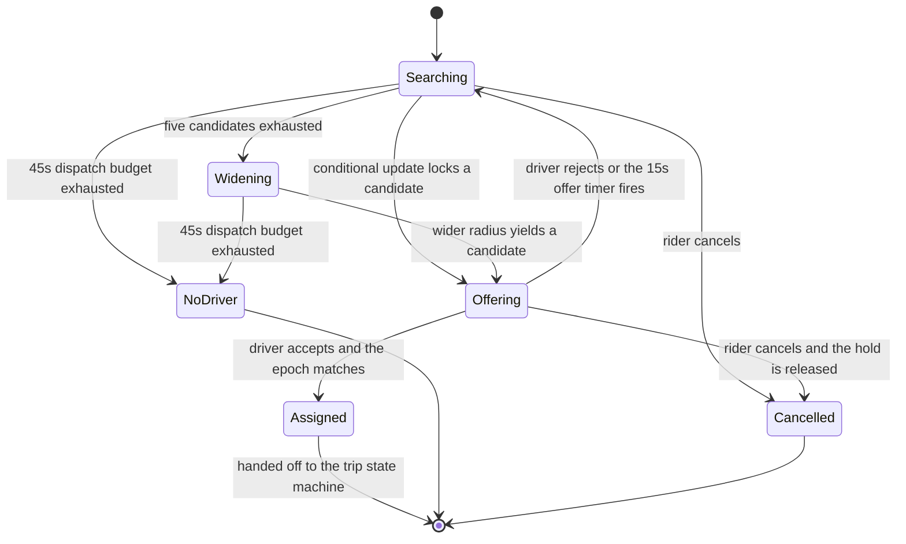

# 13 · 设计打车 / 附近的人（Design a Ride-Hailing Service）

> 这题的题面是"怎么找到附近的司机"，考的却是**在一个最终一致的世界里守住一个强一致的不变量**：
> 任一时刻，一个司机只能被一个订单持有。地理索引是入场券，独占性与超时收敛才是分数。
> 还有一个几乎所有人都漏掉的量级事实：这个系统 **99.7% 的写可以随便丢，剩下 0.3% 一条都不能错** —— 把它们放进同一个存储，这题就结束了。

---

## 读这道题之前

**如果你是直接翻到这道题的**：下面三个问题是这题的地基。答不出，正文里每一句"条件更新"都会读成黑话 —— 案例篇不再解释构件。

**先确认你能回答这三个问题**

1. 什么是 check-then-act？"先 SELECT 查这个司机是否空闲、再 UPDATE 把他占住"，两个请求同时来会发生什么？
   答不出 → 先读 [00-concepts §7 事务与隔离级别](../00-foundations/00-concepts.md)
2. 副本和分片各解决什么问题？全世界司机位置加起来才 200 MB、一台机器绰绰有余，那为什么还要分片？
   答不出 → 先读 [00-concepts §5 副本 / 分片 / 分区](../00-foundations/00-concepts.md)
3. 弱网会带来重复、乱序、迟到三件事。幂等键能解决其中哪几件？剩下那件靠什么？
   答不出 → 先读 [01-fundamentals §5 幂等](../00-foundations/01-fundamentals.md)、[§9 幂等 × 重试 × 超时](../00-foundations/01-fundamentals.md)

**这道题会用到的构件**

| 构件 | 用在哪 | 详见 |
|---|---|---|
| 条件更新、fencing token、租约 | §4.3 判定"这个司机归谁"、§4.4 超时回收 | [`05-consensus-and-coordination.md`](../01-building-blocks/05-consensus-and-coordination.md) §3、§4 |
| 有状态 vs 无状态 | 司机长连接与 Geo 索引分片都是有状态的 | [00-concepts §9](../00-foundations/00-concepts.md)、[`04-networking-and-edge.md`](../01-building-blocks/04-networking-and-edge.md) §2、§4 |
| Little's Law（并发 = 吞吐 × 延迟） | §2.4 推出 43.5 万在途订单与 30 台接入机 | [00-concepts §2](../00-foundations/00-concepts.md)、[`02-capacity-estimation.md`](../00-foundations/02-capacity-estimation.md) §3 |
| 流式窗口聚合与 watermark | §4.6 供需信号 → surge 价格快照 | [`03-messaging-and-streams.md`](../01-building-blocks/03-messaging-and-streams.md) §6 |
| 热 key | §4.2 "一城一个 geo key" 为什么会烧掉一个分片 | [`02-caching.md`](../01-building-blocks/02-caching.md) §4 |

**这道题的一句话本质**

> **在一个最终一致的世界里守住一个强一致的不变量：任一时刻，一个司机只能被一个订单持有。**
> 地理索引是入场券，独占性与超时收敛才是分数。带着这句话往下读 —— 每见到一个组件就问一次："它是在守这个不变量，还是在为它做准备？"

---

## 0. 45 分钟怎么分配这道题

| 时间 | 做什么 | 这一段的得分点 |
|---|---|---|
| **0–3 min** | 问"立即派单还是批量撮合"、"一个司机能否同时持有多单" | 这两个问题决定架构走向。不问就是在赌 |
| **3–5 min** | 敲定规模（在线司机数、日单量、上报频率）与非目标（不做定价算法、不做导航） | 明确说出"我不做 X"，把 45 分钟留给该深挖的地方 |
| **5–9 min** | 算三个数：位置写入 QPS、匹配 QPS、两者比值 | **比值 333:1 是本题的枢纽**，它直接推出"两条路径必须用不同的存储" |
| **9–13 min** | 画最简版本：Postgres + PostGIS + 条件更新，说清它在什么规模撞墙 | 先给能工作的最简解，再演进。上来就画 8 个框是负分 |
| **13–19 min** | 画目标架构：接入层 / 位置索引 / Dispatch / 订单状态机 / 超时调度器 | 边画边说数据流，每个框写一句"它挂了会怎样" |
| **19–24 min** | 深挖一：地理索引选型与边界效应（给 k-ring 覆盖公式） | 说出"网格只用于召回，不用于判定"，并给出 37 格 vs 9 格的数字 |
| **24–31 min** | 深挖二：**匹配的原子性**（条件更新 + fencing token） | **本题唯一的必答点。**没讲到这里，前面全白讲 |
| **31–36 min** | 深挖三：派单超时与重派状态机（每个状态都有超时出边） | 说出"惰性过期判定"，说清清理器只管体验不管正确性 |
| **36–40 min** | 深挖四（面试官挑一个）：弱网状态同步 / 动态定价 / 供需失衡 | 有余量就主动提名 —— 主动提名比被动回答高一档 |
| **40–45 min** | 失败模式 3 条 + 撞墙信号 + 演进触发条件 | 说出可观测的信号（"条件更新返回 0 行的比例 > 15%"），不要说"用户变多" |

**如果只剩 10 分钟**：跳过地理索引选型（一句"H3 res 8 + k-ring 召回，精确距离过滤"带过），把全部时间给 §4.3 和 §4.4。

---

## 1. 需求澄清

| # | 我会问 | 面试官通常怎么答 | 为什么决定架构 |
|---|---|---|---|
| 1 | **立即派单（immediate dispatch）还是批量撮合（batch matching）？** | "先做立即派单" | 立即派单是无状态的逐个 offer；批量撮合是有状态的窗口 + 二分图匹配，独占性的实现完全不同 |
| 2 | **一个司机能同时持有几单？拼车（pooling）在范围内吗？** | "一车一单，拼车不做" | 不变量从"独占"变成"容量 ≤ k"。这一个字的差别决定条件更新的谓词，也决定要不要做路径可行性判断 |
| 3 | 规模：在线司机数、日单量、城市数？ | 峰值 100 万在线司机，500 万单/天，单区域多城市 | 决定位置写入量级与分片键 |
| 4 | 司机位置上报频率固定还是自适应？ | "你定，说清代价" | 4 s 与 15 s 差 3.75 倍写量，是全系统最大的写压力 |
| 5 | ETA 要真实路网还是直线距离够？谁提供？ | "先直线，v1 接路网" | 路网 ETA 会成为匹配链路 p99 的支配项，且外部 API 按次计费在这个量级完全不可行（见 §2） |
| 6 | 派单超时多久？重派几轮？乘客最长等待多久？ | 15 s × 3 轮 = 45 s | 这是产品与架构的共同参数，状态机的每条超时边都由它推出 |
| 7 | 动态定价（surge pricing）在范围内吗？ | "讲架构影响，不用讲定价算法" | 它会新增一条流式管道 + 一个高读放大的价格快照层 |
| 8 | 计费按里程+时长，还是下单时锁定预估价？ | 预估价 + 实际偏差修正 | 决定 surge 倍数在哪个时刻快照，这是最大的客诉来源 |

**不问就会做错方向的两个：#1 和 #2。**

- 不问 #1，你会把立即派单的方案讲完，然后被一句"我们其实是每 5 秒攒一批一起算"推翻整个匹配层。
- 不问 #2，你会用"司机是否空闲"这个布尔量建模。一旦允许拼车，正确的模型是"容量 + 路径可行性"，你的条件更新会给出一个能跑但结果很差的系统 —— 而且你不会知道它差。

**本文假设**：单区域、多城市、峰值 100 万在线司机、500 万单/天、一车一单、立即派单、15 s × 3 轮。

---

## 2. 估算

### 2.1 位置写入 —— 全系统最大的写流量

```
峰值在线司机 100 万，固定 4 s 上报一次
  → 100 万 ÷ 4 s = 250,000 writes/s

自适应上报（空闲 15 s / 载客 4 s / 接客中 4 s，占比 60% / 30% / 10%）
  → 100 万 × (0.6/15 + 0.3/4 + 0.1/4) = 140,000 writes/s     ← 降 44%
  空闲司机降到 15 s 的代价：时速 60 km/h 时最大位置误差 250 m
  召回半径补偿 +300 m 即可抵消，匹配质量不变 ⇒ 这是本题最便宜的优化
```

**传输方式决定带宽和 CPU，差 7 倍**：

| 方式 | 单条线上字节 | 25 万/s 的入向带宽 | 隐藏成本 |
|---|---|---|---|
| HTTPS POST（每次新连接） | ~900 B（头部 + TLS 握手摊销） | 225 MB/s ≈ 1.8 Gbps | **TLS 握手的 CPU 才是真瓶颈**，25 万握手/s 需要几十台机器纯做握手 |
| **WebSocket 二进制帧（长连接）** | ~120 B | 30 MB/s ≈ 240 Mbps | 需要连接管理与重连风暴防护 |

### 2.2 存储：这份数据小到荒谬

```
最新位置：100 万 × (driver_id 8 + lat/lng 16 + ts 8 + 状态/航向/速度 8 + map 开销 ~50) ≈ 90 MB
cell → driver 倒排索引 ≈ 50 MB                                          合计 < 200 MB

轨迹归档（trajectory archive）：只归档载客段（30% 司机 × 4 s）
  75,000 点/s × 86,400 = 65 亿点/天 × 24 B = 156 GB/天（原始）
  delta-of-delta + zigzag + zstd（时序压缩三件套：只存"差值的差值"、把负数映射成小正数、再通用压缩）
    约 10× → 15.6 GB/天 → 5.7 TB/年
  S3 标准约 $0.023/GB/月（2026 量级）→ 约 $130/月
```

**推论 1**：**全世界的司机位置装进一台机器的内存都绰绰有余。** 分片的理由从来不是容量，是**写吞吐**和**可用性**。任何"位置数据太大所以要分库"的论证都是错的。
**推论 2**：**轨迹归档一年不到 $2,000，没有任何理由为省这笔钱不存它** —— 它是理赔、纠纷仲裁、路网学习和反作弊的唯一依据。贵的不是存它，是把它放进在线数据库。

### 2.3 匹配 —— 根本不是容量问题

```
500 万单/天 ÷ 86,400 = 58 QPS 均值 × 5（早晚高峰集中）≈ 300 QPS 匹配
每单平均 2.5 轮派单（含拒单与超时）→ 750 次条件更新/s 峰值

位置写 : 派单写 = 250,000 : 750 = 333 : 1
```

> **面试金句**
> "这个系统 99.7% 的写是司机位置 —— 可丢、覆盖写、四秒后作废；剩下 0.3% 是派单，一条都不能错。这两类写的正确性要求差三个数量级，它们必须落在两个不同的存储上。把位置写进主库，等于用 fsync 去保护一个四秒后就作废的值，同时把主库的可用性拉到位置服务的水平。"
> "Ninety-nine point seven percent of the writes here are driver locations — disposable, overwrite-only, stale after four seconds. The other zero point three percent is dispatch, and not one of those can be wrong. Those two classes differ by three orders of magnitude in how much correctness they need, so they belong in two different stores. Putting locations in the primary database means fsyncing a value that's worthless in four seconds, and dragging the primary's availability down to the location service's."

### 2.4 连接数、在途订单与成本

```
Little's Law（并发 = 吞吐 × 停留时间，见 00-concepts §2）：
  峰值在途订单 L = λ × W = 290/s × (等待 5 min + 行程 20 min = 1,500 s) ≈ 435,000
  ⇒ 与"40% 司机处于载客或接客中"自洽（§2.1 的上报占比假设成立）
长连接 = 100 万司机 + 43.5 万乘客 ≈ 143 万 ÷ 10 万/机 = 15 台，留 2× 余量 → 30 台接入机
  内存 143 万 × 40 KB = 57 GB ÷ 30 台 = 1.9 GB/台   ← 装得下

基础设施 ≈ 100 台（c 系列 16 vCPU）≈ $30k/月（2026 量级）→ 摊到 1.5 亿单/月 = $0.0002/单
  客单价量级 $10、抽成 20% = $2/单 ⇒ 基础设施占抽成的 0.01%
ETA 调用 = 58 QPS × 20 候选 = 1,160 次/s → 30 亿次/月 × $2–5/千次 = $6–15 M/月
```

**推论 3**：**这题里唯一贵的东西是 ETA。** 按次计费的外部路网 API 在这个量级下差三个数量级不可行 ⇒ **ETA 必须自建或本地部署路网引擎**。而基础设施成本可以忽略 ⇒ 本题任何以"省成本"为理由的架构取舍都站不住，理由只能是延迟和可靠性。

---

## 3. 高层设计

### 3.1 先给最简单能工作的版本（单城市，5,000 在线司机）

```
 司机 App ──HTTP 10s──► App ──► Postgres
                                 drivers(id, geog GEOGRAPHY, status, updated_at)
                                 GiST 索引 on geog   -- GiST：PostgreSQL 的通用搜索树，
                                                     -- PostGIS 用它做空间索引（B-Tree 做不了二维范围）
 乘客 App ──叫车──────► App ──► SELECT id FROM drivers
                                 WHERE status='idle' AND ST_DWithin(geog, :p, 2000)
                                 ORDER BY geog <-> :p LIMIT 20;
                              ► UPDATE driver_assignment SET ... WHERE driver_id=? AND (...)
 超时：timers 表 + 每秒扫描一次
```

**它能撑到哪**：位置写 500/s，Postgres 轻松。撞墙信号有三个，任一出现就走 v1：
`drivers` 表死元组（dead tuple）比例 > 30% 且 autovacuum 追不上；或 `ST_DWithin` p99 > 50 ms；或**位置写入让订单表的 commit p99 上升 > 20%**（它们共享同一个 WAL）。

### 3.2 目标架构（100 万在线司机）

```
 司机 App ══WSS══► [Location Gateway ×30]     只做：连接/鉴权/解码/频率限制，零业务逻辑
                        │ 位置帧（自适应 4–15 s）
                        ▼
                  Location Ingest（无状态）
                        │ 按 H3 res 5（约 253 km²，≈ 一个城市片区）路由
          ┌─────────────┴──────────────┐
          ▼                            ▼
   Geo Index Shard #k             Kafka: driver_location（异步，可丢）
   内存两张表：                          ├──► 轨迹归档（仅载客段）→ 对象存储
     driver_id → {pos, cell, ts}         ├──► 供需信号 1 min 窗口 → surge 快照
     cell(res 8) → set<driver_id>        └──► 反作弊（速度合理性、GPS 伪造）
   条目 TTL 30 s，无落盘，无跨分片删除

 乘客 App ══WSS══► [Rider Gateway] ──叫车──► Dispatch Svc ──────┐
   ① 召回  H3 res 8 中心 + k-ring(3) = 37 格 → 最多 200 个候选   │
   ② 过滤  idle + 车型 + 服务区 + 订单级 blocklist → Top 50      │
   ③ 排序  批量 ETA（一次调用，超时 200 ms，降级 haversine）      │
   ④ 判定  逐个条件更新 driver_assignment，抢到才推 offer        │
                                                              ▼
                              Order Svc ──► orders(PG) + order_events(append-only)
                                    ▲                    │
                                    └── 超时事件 ─── Timeout Scheduler（Redis ZSET 时间轮）
```

> **图里的三个词**：**H3 res N** = H3 六边形网格的分辨率等级，数字越大格子越小（res 5 ≈ 253 km² 的城市片区，res 8 ≈ 0.74 km²）｜**k-ring(k)** = 以某个格子为中心、向外 k 圈的全部格子，共 `3k²+3k+1` 个（§4.1 有推导）｜**haversine** = 球面上两点的直线距离公式，不走路网、纯算术、零外部依赖，所以能当 ETA 的降级值。

**数据流的四条边界**：

1. **位置流与订单流物理隔离**：不同的存储、不同的可用性目标、不同的团队 oncall。位置索引全挂 → 派不出单（业务降级）；订单库全挂 → 钱和行程都停（事故）。
2. **Geo 索引只有最新值**：条目带 30 s TTL，司机跨片区移动时旧片区的条目自然过期，**没有跨分片删除，也就没有分布式事务**。查询端按 `ts > now - 15s` 二次过滤。
3. **`driver_assignment` 是全系统唯一的强一致点**。除它以外的一切 —— 位置、ETA、排序、surge —— 都可以陈旧、可以近似、可以出错。
4. **每个状态都有超时出边**，超时事件由独立调度器回灌状态机，不靠请求线程 `sleep`。

---

## 4. 深挖

### 4.1 地理编码方案：边界效应不是靠对齐格子解决的

**问题**：把二维的"附近"变成一维索引能处理的查询。所有网格方案都用空间填充曲线（space-filling curve）降维，代价是**空间相邻 ≠ 编码相邻**，这就是边界效应。

| 方案 | 单元与精度 | 覆盖 2 km 半径需要 | 范围查询（range scan） | 25 万写/s 承受力 |
|---|---|---|---|---|
| **GeoHash**（Z-order 曲线，base32） | 矩形，**每加一位面积 ÷32**，长宽比在奇偶位间反转；6 位 = 1.22 × 0.61 km | 6 位需 5×8 = **40 格**（`⌈4 km/1.22⌉+1` × `⌈4 km/0.61⌉+1`）；5 位只需 9 格但一次拉回 215 km²（目标 12.6 km² 的 **17 倍**） | 前缀匹配即范围，但相邻格前缀可能完全不同 | 取决于底层存储 |
| **S2**（Hilbert 曲线，球面立方体） | 近似正方形，同 level 面积差最坏约 2:1；level 13 ≈ 1.27 km² | `S2RegionCoverer` 混合 level 覆盖，约 20 个 cell → 合并成 **8–12 个 id 区间** | ✅ **唯一优势**：任意区域 → 少量整数区间，直接翻译成 `WHERE cell_id BETWEEN a AND b` | 取决于底层存储 |
| **H3**（六边形 + 12 个五边形） | res 8 = 0.737 km²，边长 **461.4 m**；**所有邻居中心等距** | k-ring(3) = **37 格**，合计 27.3 km²（目标的 2.2 倍） | ❌ H3 index 不保序，不能做区间扫描 | 取决于底层存储 |
| **PostGIS**（R-Tree / GiST，真球面距离） | 任意几何，精度最高，支持服务区多边形 | 一次 `ST_DWithin` 搞定 | ✅ 但走磁盘 | ❌ 每次 UPDATE = 索引删+插 + WAL + 死元组，单主上限约 2 万 TPS |

**k-ring 覆盖公式（能重算的）**：六边形边长 `e`，相邻中心距 `√3·e`，中心格 + k 环的内切半径 ≈ `0.866 × (2k+1) × e`，再减去查询点落在中心格顶点的最坏偏移 `e`：

```
保证覆盖半径 R(k) ≈ 0.866 × (2k+1) × e − e        （H3 res 8: e = 461 m）
  k=1 →  7 格，R ≈ 0.74 km
  k=2 → 19 格，R ≈ 1.54 km
  k=3 → 37 格，R ≈ 2.33 km          ← 2 km 半径需要 k=3
格子数 = 3k² + 3k + 1
```

> **面试金句**
> "网格只用来召回，绝不用来判定。任何网格方案的边界效应都不是靠把格子对齐得更好来解决的，是靠承认它不精确、然后用一段精确距离过滤兜住。顺便纠正一个流传很广的说法：'查中心格加 8 个邻格'只在格子边长约等于搜索半径时才成立。H3 res 8 边长 461 米，覆盖 2 公里半径要 k=3 的环，也就是 37 个格子，不是 9 个。"
> "The grid is for recall only, never for the decision. You don't fix boundary effects by aligning cells better — you fix them by admitting the grid is approximate and putting an exact distance filter behind it. And let me correct something people repeat a lot: 'query the center cell plus its eight neighbors' only holds when the cell edge is about the same as your search radius. H3 resolution 8 has a 461-meter edge, so covering a two-kilometer radius takes a k-ring of three — that's 37 cells, not nine."

**我选 H3 res 8 做主索引**，理由是排序里最贵的两件事都吃六边形的等距性质：供需热力聚合和（v3 的）批量撮合分区。正方形网格有 4 个边邻 + 4 个角邻，距离差 √2 倍，做密度统计时会引入方向性偏差。

**什么条件下改选 S2**：**当索引必须放在一个只支持范围扫描的持久化存储里**（DynamoDB / Cassandra / Postgres B-Tree）。S2 能把一个圆盖成 8–12 个整数区间，这是 H3 给不了的 —— H3 只能做 37 次点查。如果你的位置索引在内存里（本文的选择），这个优势为零。

**密度自适应**：市中心一个 res 8 格高峰可能有 5,000 个司机。做法是**先细后粗**：先用 res 9（0.105 km²，边长 174 m）查 k-ring(2)，候选不足 50 再退到 res 8。反过来（先粗后细）意味着先取回 5,000 个对象再截断，网络和 GC 都白付。

---

### 4.2 司机位置往哪写：为什么不能是主库

**问题**：25 万 writes/s，每条覆盖前值，4 秒后作废。

| 方案 | 写吞吐 | 单写成本 | 崩溃后 | 致命代价 |
|---|---|---|---|---|
| A. `UPDATE ... SET geog` 主库 | 单主约 2 万 TPS 上限 | ~1 ms + WAL fsync + GiST 维护 | 数据在 | **超上限 12 倍**；25 万死元组/s 让 autovacuum 永远追不上；且与订单写共享 WAL 与 buffer pool |
| B. Redis GEO（`GEOADD` / `GEOSEARCH`） | 单实例约 10 万 ops/s（`GEOADD` 即 `ZADD`，O(log N)）；25 万需 4–8 分片 | 0.3 ms 网络往返 | 丢几秒无所谓 | 一城一个 geo key 会变**热 key**；ZSET 成员数百万时大半径 `GEOSEARCH` 退化 |
| C. **自建内存索引**（本文） | 单机 300–500 万 ops/s（纯内存 map） | 0（本地） | 全丢，**30 s TTL 内自愈** | 要自己写分片、故障转移、扩缩容 |

**位置数据永远不写主库，三条理由**：

1. **它是可丢的。** 用 fsync 保护一个 4 秒后就作废的值是纯粹的浪费。副本全丢也只需要 30 秒自愈 —— 因为所有司机每 4–15 秒就会重新上报一次，**这份数据自带修复机制**。
2. **它会污染共享资源。** 同一个 WAL、同一个 buffer pool、同一个 VACUUM 通道。最终表现不是"位置慢"，是"订单表的查询变慢" —— 一个极难定位的故障。
3. **它的可用性要求更低。** 绑在一起等于把主库的 SLO 拉到位置服务的水平。

**我的选择**：v0/v1 用 **B（Redis GEO）** —— 它在 < 5 万写/s 时是免费的正确答案，省掉一整个自研组件；本文规模用 **C**。撞墙信号：单个 geo key 的 ZSET 成员 > 50 万，或 `GEOSEARCH` p99 > 5 ms，或 Redis 分片 CPU > 60%。
**什么条件下 A 也够用**：单城市 5,000 司机、上报 10 s → 500 writes/s，PostGIS 是最省事的答案，上 H3 是纯粹的复杂度。

---

### 4.3 匹配的原子性：这是本题唯一的必答点

**问题**：两个乘客在同一个格子里几乎同时叫车，两个 Dispatch 实例的候选列表高度重叠，同时给司机 D 发 offer。

**先说冲突有多常见** —— 它不是边缘 case：

```
市中心高峰，一个 res 8 格内 60 个空闲司机、每秒 3 单、每单取 Top 20
  两单候选集期望重叠 = 20 × 20 / 60 = 6.7 人（33%）
  且排序键是 ETA、两个乘客位置相近 ⇒ 排序高度相关
  ⇒ Top-1 候选是同一个司机的概率接近 50%
```

**条件更新返回 0 行是主路径的一部分，不是异常路径。** 它必须快（< 2 ms）、不重试、不等待，直接换下一个候选。

| 方案 | 正确性 | 延迟 | 失效模式 |
|---|---|---|---|
| A. Redis 分布式锁 `SET NX PX 15000` | 不带 fencing token 就不安全 | +0.3 ms | GC 暂停 30 s → 锁过期而持有者不自知，两个持有者并存；Redis 主从异步复制，主挂即丢锁；Redlock 也不解决 GC 暂停 |
| B. **数据库条件更新（CAS）** | **单条语句原子，DB 是唯一裁决者** | +1–2 ms（同 AZ） | 只受单行 TPS 限制（约 500–1,000）；而**单个司机行的实际写入 < 0.1 TPS** ⇒ 完全不是问题 |
| C. 按 cell 分区的单线程匹配器 | 分区内天然无冲突 | 0 | 引入有状态服务 + 故障转移；**跨分区仍冲突**（司机在 cell A、订单在 cell B 的边界上） |

**选 B。** 具体实现：
```sql
-- driver_assignment：每个司机一行，PK = driver_id。全系统唯一的强一致点。
UPDATE driver_assignment
   SET order_id   = :order_id,
       state      = 'offered',
       expires_at = now() + interval '15 seconds',
       epoch      = epoch + 1                    -- fencing token
 WHERE driver_id  = :driver_id
   AND (order_id IS NULL                          -- 空闲
        OR expires_at < now())                    -- 或上一次持有已过期（惰性过期判定）
RETURNING epoch;
-- 返回 0 行 = 没抢到。不重试、不等待、不加锁，直接换下一个候选。
```

**三个要点，每一个都是独立的评分信号**：

1. **`expires_at < now()` 是惰性过期判定（lazy expiry）**：正确性只依赖读时比时间戳。后台清理器挂掉不会永久占用运力 —— 清理器只负责"体验"（让司机 App 及时回到空闲界面），**不负责正确性**。这两件事必须由两个机制分别保证。
2. **`epoch` 是 fencing token**（围栏令牌：一个单调递增的编号，让被抢占的旧持有者的写在下游被识别出来并拒绝，见 [`05-consensus-and-coordination.md`](../01-building-blocks/05-consensus-and-coordination.md) §3）：司机 App 上报"我接受订单 X"时必须回传收到 offer 时的 epoch。epoch 落后 = 这是一个过期 offer 的回声（弱网延迟送达），服务端必须拒绝。**没有 epoch，一条迟到 10 秒的"接受"会把一个已经重派给别人的订单改回来，然后两个司机同时开向同一个乘客。**
3. **串行 offer，不是并行广播**。并行给 5 个司机发同一单，4 个人白点一次 —— 接单率指标直接废掉，司机端体验崩坏。串行的代价是延迟 = 轮数 × 超时，所以超时必须短（§4.4）。

**注意这题和票务系统的关键差别**：票务的痛点是**单行热点**（1 万座位的总余量在一行上被 6 万 QPS 打），所以它需要准入层削峰 + 分桶。打车这里，`driver_assignment` 按 `driver_id` 天然分散在 100 万行上，**单行 TPS < 0.1，根本没有热点**。同样是"条件更新守不变量"，两题的瓶颈完全不在一处 —— 说得出这个区别，说明你不是在背模板。

> **面试金句**
> "这题看起来是地理索引题，实际是在一个最终一致的世界里守住一个强一致的不变量：任一时刻一个司机只能被一个订单持有。我用 `driver_assignment` 一行上的条件更新守它 —— 单条语句原子，数据库是唯一裁决者，所以'持锁进程 GC 暂停 30 秒'这一整类问题根本不存在。过期用 `expires_at < now()` 惰性判定，清理器挂了也不会永久占住运力。"
> "This looks like a geo-indexing problem, but it's really about holding one strongly consistent invariant inside an eventually consistent world: at any instant a driver can be held by at most one order. I enforce that with a conditional update on a single driver_assignment row — one atomic statement, the database is the only arbiter, so the whole 'what if the lock holder GC-pauses for thirty seconds' class of bugs never exists. Expiry is evaluated lazily against expires_at, so a dead sweeper can't strand supply."

**什么条件下改选 C**：上批量撮合时。撮合器本来就是有状态的，独占性由二分图匹配内部保证（一个司机只出现在一条匹配边上），条件更新退化成落库时的最后一道防线。这时冲突只发生在**跨批次**（上一批已 offer 未响应的司机），解法是撮合器读候选时排除 `state <> 'idle'` 的司机。
**什么条件下不变量本身要改**：允许拼车时，谓词从 `order_id IS NULL` 变成 `active_count < k` —— **仍然不需要分布式锁**，但排序必须换成路径可行性判断，本文的方案会给出很差的结果（见 §4.7）。

---

### 4.4 派单超时与重派：每个状态都必须有超时出边

**问题**：司机 App 会闪退、会进隧道、会就是不点。没有超时兜底的状态机会持续累积卡在 `Offering` 的僵尸订单，表现为**可用运力静默下降**（司机被占着，但没人在服务任何乘客）。

派单的转移用 ASCII 箭头也画得出来，但 ASCII 画不出**哪条边不存在** —— 箭头一多就互相穿插，"没有回头路"这件事会淹没在线条里。这张图的信息量恰恰在缺失的边上：



> 📖 **读图要点**：`Assigned` 没有任何一条指回 `Searching` 或 `Offering` 的边 —— 司机一旦接受，乘客已经看到姓名和车牌，换司机必须走"取消 + 新建订单"这条对乘客可见的路径，绝不能悄悄替换。另一处：`Offering` 的三条出边里有两条由**时间**驱动（15 s 超时、45 s 总预算），只有一条由司机的动作驱动 —— 这就是"每个非终态都必须有超时出边"在图上的样子。`NoDriver` 是终态且没有自环，系统不会自己重试整单，重试是乘客的动作。

**超时参数不是拍的**：

| 参数 | 取值 | 依据 | 取别的值会怎样 |
|---|---|---|---|
| 单次 offer 超时 | **15 s** | 司机"看到弹窗 → 判断 → 点击"的中位数约 4–6 s，15 s 覆盖 p95 | 5 s：p50 之外的司机全部超时，接单率暴跌；30 s：乘客最长等待翻倍 |
| 重派轮数 | **3** | 3 × 15 = 45 s 总预算 | 无上限：订单永远在 `Searching`，乘客不知道该不该走 |
| 定时器实现 | Redis ZSET 时间轮 | 750 个定时器/s × 15 s 存活 ≈ **1.1 万个在途定时器**，在 ZSET 里是 1.1 万个成员，每 200 ms 扫一批，成本可忽略 | 每单一个线程 / `sleep`：1 万线程，或进程重启丢光全部定时器 |

**超时处理必须幂等且可重放**：

```sql
-- 超时事件到达时先做条件更新，不要"先读状态再决定"
UPDATE driver_assignment SET order_id = NULL, state = 'idle'
 WHERE driver_id = :d AND order_id = :o AND state = 'offered' AND expires_at < now();
-- 返回 0 行 = 司机刚好接受了，或者这是一次重复投递。直接丢弃该事件。
```

**这是本题第二个 check-then-act 陷阱。** 定时器一定会重复投递（调度器崩溃重启、消息重放），"先 SELECT 看状态、再 UPDATE"在并发下必错。**重派的三条硬规则**：

1. 拒过这单的司机进**订单级 blocklist**（存在订单对象里，TTL = 订单生命周期），不再进候选。
2. **超时 ≠ 拒绝**。超时的司机降权但不排除（可能只是弱网），惩罚写进排序（如 `ETA + 60 s`）。把两者混为一谈会持续惩罚信号差区域的司机，最后那片区域没人接单。
3. 扩大半径必须有上限，且**每扩一次要重算 ETA**，不能复用旧值 —— 半径变了，路网条件也变了。

---

### 4.5 行程状态机、计费与司机端弱网同步

**行程状态机**（派单结束后接手，ASCII 足够，因为它是一条主线加几个分支）：

```
 assigned ──司机到达上车点──► arrived ──司机点"开始行程"──► in_trip ──► completed ──► settled
     │                          │                            │
     │ 乘客取消(2 min 免费窗口)  │ 乘客取消(收取消费)          │ 异常结束(事故/车辆故障)
     ▼                          ▼                            ▼
 cancelled_free            cancelled_fee                completed_partial
 ── 每一个非终态都有 TTL：assigned 30 min、arrived 15 min、in_trip 8 h ──
 ── 超时不自动推进状态，只触发人工介入工单 + 告警（钱相关的状态不能靠超时猜） ──
```

**注意这里和派单状态机的区别**：派单阶段超时**直接推进状态**（自动重派），因为代价是"多派一次"；行程阶段超时**只告警不推进**，因为代价是"钱算错了"。同一个机制，两种用法 —— 判据是超时误判的代价。

**弱网状态同步：司机端永远不是真相源。** ❌ 司机端上报"我现在是 `in_trip`"（状态）→ 重复上报覆盖后续状态，迟到的 `in_trip` 把 `completed` 改回去。✅ 司机端发**命令** `(order_id, action, client_event_id, epoch)`，服务端在状态机上校验，非法转移返 409 + 权威状态。四条实现规则：

1. **`client_event_id` 由 `(order_id, action)` 派生，不是随机 UUID。** 同一动作重发一百次只生效一次 —— 和计费系统的幂等键是同一条原则（见 [`04-usage-based-billing.md`](04-usage-based-billing.md) §6）。
2. **司机端离线队列按序重放，不允许跳过失败的命令** —— 否则 `end_trip` 会先于 `start_trip` 到达。
3. **服务端不信任 `client_ts`**，合法性只看动作在状态机上是否可达：`in_trip` 收到 `start_trip` → 幂等返回成功；`assigned` 收到 `end_trip` → 409 + 当前状态。
4. **客户端无条件以服务端返回的状态为准**，不做本地合并。"谁的时间戳新听谁的"在时钟不可信时必错。

> **面试金句**
> "弱网会给你三样东西：重复、乱序、和迟到十秒的'我接受了'。前两样靠业务派生的幂等键，第三样只能靠 epoch —— 没有 epoch，一条迟到的接受会把一个已经重派给别人的订单改回来，然后两个司机同时开向同一个乘客。"
> "A flaky network hands you three things: duplicates, reordering, and an 'I accept' that shows up ten seconds late. The first two are handled by an idempotency key derived from business semantics. Only the epoch handles the third — without it, a late acceptance rewrites an order that's already been reassigned, and two drivers head for the same rider."

**计费：计价必须是纯函数**，`fare(trip_snapshot, pricing_version, surge_snapshot) → amount`。三个输入都在**下单时刻**快照 —— surge 倍数尤其不能在结算时刻取，否则乘客看到的预估价和账单对不上，这是这类产品最大的客诉来源。

里程来源，三选一：

| 来源 | 误差 | 成本 | 偏差方向 |
|---|---|---|---|
| GPS 轨迹点直连求和 | 城市峡谷多径可达 **+10–20%** | 0 | **系统性高估**（把 GPS 抖动当成移动）—— 这不是误差，是持续向一侧倾斜的偏差 |
| 地图匹配（map matching）后的路网里程 | ±2% | 每单一次路网调用 | 中性 |
| 下单时的预估路线里程 | 遇绕路/堵车差 10%+ | 0（已经算过） | 中性 |

**选：下单时用预估价锁定，行程后用 map matching 修正，两者差 > 20% 挂起转人工。** 裸 GPS 求和是这里唯一必须排除的选项。
账本走复式记账（double-entry：每笔钱同时记一借一贷，两边相等，账本因此自带校验，见 [15-payment-system.md](15-payment-system.md) §4.3）——乘客应付 / 司机应收 / 平台抽成，取消费、等待费、路桥费各自独立行项，见 [`../03-saas-platform/02-billing-and-metering.md`](../03-saas-platform/02-billing-and-metering.md)。

---

### 4.6 供需失衡与动态定价：它改的是架构，不是价格

动态定价（surge pricing）在架构上带来三件事，**没有一件是"定价算法"**：①一条新的流式管道（位置流 + 订单流 → 每格 `等待订单数 / 空闲司机数`，1 min 窗口）；②一个读放大 10–20 倍的热点读（乘客打开 App 就看价，多数人看了不下单）；③一个需要阻尼的反馈回路（涨价 → 需求降 + 供给升 → 降价 → 需求回升，无阻尼必然震荡）。

| 做法 | 读延迟 | 一致性 | 代价 |
|---|---|---|---|
| 查询时实时算供需比 | 20–50 ms | 最新 | 峰值 6,000 QPS × 一次聚合，且价格在乘客眼前跳变 |
| **写入只读快照表 + 全量推进程内存** | **0 网络往返** | 最多陈旧 1 min | 需要快照版本管理 |

```
100 城 × 每城约 2,000 个 res 7 格（5.16 km²/格，10,000 km² 的城市约 1,940 格）
  = 20 万行 × 200 B = 40 MB   ← 整份推进每个 API 实例的进程内内存
每分钟全量刷新 = 3,300 写/s   ← 一个 Redis 实例足够
```

**价格快照必须是可寻址的不可变对象**：`(city, h3_res7, valid_from, valid_to, multiplier)`，乘客看到的那一份的快照 ID 随下单请求回传，服务端校验其未过期超过 30 s。**这是架构决策不是产品决策** —— 它决定了价格是一个带 ID 的对象，而不是一次函数调用的返回值。

阻尼三件套：变化限速（每分钟最多 ±0.2×）+ 迟滞（hysteresis，上调阈值高于下调阈值）+ 硬上限（很多辖区对灾害期间的倍数有监管上限）。
**调度（repositioning，把空闲司机引导到高需求格子）绝不能进派单关键路径。** 它是近线推荐问题，延迟预算分钟级；挂进关键路径等于给一条 300 QPS 的强一致链路加了一个模型推理依赖。

---

### 4.7 什么时候这整套方案是错的

| 场景 | 为什么本文方案错 | 应该做什么 |
|---|---|---|
| 单城市、< 5,000 在线司机 | 位置写 500/s，内存索引、H3、Kafka 全是净复杂度 | §3.1 的 PostGIS 版本，一个进程 + 一个 Postgres |
| **预约单（scheduled ride）为主** | 根本没有"实时附近"这个问题 | 这是排班与运筹问题：提前 N 小时做全局指派，架构接近排产系统，和本文没有共享部分 |
| **货运 / 长途**（一单 8 小时，日单 1,000） | 匹配质量的价值远超匹配延迟；15 s 超时毫无意义 | 批量撮合 + 人工确认，超时以分钟/小时计，状态机参数全变 |
| **外卖配送**（一个骑手同时持 3–5 单） | 不变量从"独占"变成"容量 + 路径可行性"。条件更新仍能防超派，但**它保证不了'这五单能顺路送完'** | 撮合器内做路径规划（VRP = vehicle routing problem，车辆路径问题：给定多个取送点求一条总代价最小的路线，NP-hard，工程上只求近似解），条件更新只做最后一道防线 |
| 强监管市场要求"最近的车必须优先" | 本文按 ETA + 接单率 + 空驶补偿排序，会被判定为不合规 | 排序键退化为纯距离，把接单率优化挪到司机端的接单激励里 |

**一条通用判据**：当"匹配质量"的边际收益超过"匹配延迟"的边际成本时，立即派单就该换成批量撮合。可观测的信号是 **空驶率（deadhead ratio）**成为公司级指标的那一天。

---

## 5. 失败模式

| 故障 | 影响 | 检测信号 | 应对 / 降级到什么 |
|---|---|---|---|
| Geo 索引分片挂 | 该片区召回不到司机，叫车全失败 | 该片区 `candidate_count = 0` 的订单占比突增 | 副本接管；**30 s 内自愈**（TTL 内全部司机会重新上报）；期间降级到相邻片区召回 |
| 司机点了接受但上行丢包 | 订单被重派，两个司机开向同一乘客 | `epoch mismatch` 计数上升 | epoch 校验拒绝迟到的接受；司机端收 409 后立刻提示"订单已取消"；**必须给空驶补偿**，否则接单率崩 |
| 超时调度器积压 | 订单卡 `Offering`，运力被静默占用 | `Offering` 状态订单数、定时器队列 lag | **惰性过期判定兜底**（任何一次条件更新都会顺手回收过期持有）；调度器只影响体验 |
| ETA 服务慢或熔断 | 匹配 p99 从 200 ms 涨到 3 s | ETA 调用 p99、超时率 | 200 ms 超时 → 降级 haversine × 城市绕行系数（1.3–1.4）；熔断后全城走降级 5 min |
| 位置流 Kafka 堆积 | 轨迹、热力、surge 滞后（**派单不受影响**，它读内存索引） | consumer lag | 丢最旧数据（位置可丢）；surge 冻结在最后一个有效快照 |
| 单城市热点（一城占 30% 流量） | 该分片 CPU 打满，p99 分化 | 分片间 CPU / p99 方差 | 分片键从 `city_id` 换成 `h3_res5_cell`，天然按地理打散；超大城市再切到 res 6 |
| 接入机重启引发重连风暴 | 单机约 4.8 万连接（143 万 ÷ 30）同时重连，打死鉴权链路 | 新建连接速率尖峰 | 指数退避 + 全抖动（full jitter：重试间隔在 `[0, 上限]` 里取随机值，而不是"上限 ± 一点"，否则所有客户端的重试时刻仍会对齐，见 [`03-resilience-patterns.md`](../05-reliability/03-resilience-patterns.md) §3）；接入层新建连接限速；**重连只发最新一条位置，不补历史** |
| GPS 伪造 / 漂移；司机端时钟不可信 | 司机"瞬移"到高需求区抢单；用 `client_ts` 排序会错乱 | 相邻两点隐含速度 > 200 km/h 的占比 | 服务端速度合理性检查，异常点丢弃后进风控队列；**所有生效时间由服务端赋值**，`client_ts` 只用于同一设备内排序 |
| 支付失败但行程已完成 | 司机已提供服务，钱没到 | 未结算行程数、老化天数 | 行程状态机到 `completed` 即结束；收款是独立账务流程（挂账 + 催收），**不能让支付失败卡住行程状态** |

---

## 6. 演进路线

```
v0  单城市，< 5,000 在线司机（位置写 500/s）
    单体 + Postgres/PostGIS；ST_DWithin 召回；driver_assignment 条件更新；timers 表每秒扫描。
    → v1 触发条件（任一命中）：drivers 表死元组比例 > 30% 且 autovacuum 追不上；
      或 ST_DWithin p99 > 50 ms；或**位置写让订单表 commit p99 上升 > 20%**（共享 WAL 已成瓶颈）

v1  多城市，5 万–20 万在线司机（位置写 1.3 万–5 万/s）
    位置移出主库 → Redis GEO（一城一 key）；Dispatch 独立服务；超时用 Redis ZSET 时间轮。
    → v2 触发条件：单 geo key 的 ZSET 成员 > 50 万；或 GEOSEARCH p99 > 5 ms /
      Redis 分片 CPU > 60%；或单城市流量占比 > 25%（热 key 已形成）

v2  100 万在线司机 ← 本文
    自建内存 geo 索引（H3 res 8 倒排 + res 5 分片，30 s TTL），位置不落盘；
    位置流进 Kafka 供轨迹归档 / 供需信号 / 反作弊；surge 快照管道；自建 ETA。
    → v3 触发条件：候选召回 p99 > 10 ms；或**条件更新返回 0 行的比例 > 15%**
      （这是"该上批量撮合"的信号，不是"该加机器"）；或空驶率进入公司级 OKR

v3  批量撮合成为主路径 / 跨国多区域
    3–5 s 窗口 + 二分图匹配（降 10–20% 空驶，代价是 +5 s 延迟、复杂度高一档）；
    先影子运行（shadow）两周比对空驶率与接单率再切流。信号：监管要求数据驻留（data residency）。
```

---

## 7. 常见错误答法

| mid-level 会怎么答 | 为什么掉分 | 正确的说法 |
|---|---|---|
| 「用 `WHERE lat BETWEEN ... AND lng BETWEEN ...` 找附近司机」 | 二维范围无法被复合 B-Tree 有效裁剪：`(lat, lng)` 索引只有 lat 那一段能做范围，lng 退化成过滤。100 万行也要扫几万行。这个答案暴露的是没意识到地理是二维的 | "用空间填充曲线把二维降成一维再用一维索引 —— 这是 GeoHash / S2 的全部原理；或者用 R-Tree 家族。**但网格只做召回，判定靠精确距离过滤。**" |
| 「用 Redis 分布式锁锁住司机」 | 面试官必问"持锁进程 GC 暂停 30 秒醒来继续写呢"、"Redis 主从异步复制，主挂了锁丢了呢"。没有 fencing token 就接不下去 | "`driver_assignment` 一行 + 条件更新，单条语句原子，DB 是唯一裁决者，**根本不需要面对'持有者崩溃'这一类问题**。过期用 `expires_at < now()` 惰性判定。" |
| 「司机位置直接写库，加个 GiST 索引」 | 25 万 UPDATE/s 是单主上限的 12 倍；更致命的是它把一个**可丢的写**绑进了**不可丢的写**的可用性与 VACUUM 通道 | "位置数据的三个属性 —— 可丢、覆盖写、4 秒过期 —— 决定它属于内存。要持久化的是轨迹归档，那是一条异步管道，落对象存储，一年不到 $2,000。" |
| 「匹配就是找最近的司机」<br>「司机端上报状态，服务端存下来」 | 最近 ≠ 最优（在河对岸、刚上高架、正往反方向开），且**完全没提独占性**；把客户端当真相源，弱网下的重复/乱序/迟到会让状态机倒退（`completed` 被迟到的 `in_trip` 覆盖） | "召回用距离、排序用 ETA + 接单率、**判定用条件更新**，三件事三个机制。司机端发**命令**（业务派生幂等键 + epoch），服务端做状态机校验，非法转移返 409 + 权威状态。" |

---

## 8. 相关章节

| 本题用到的构件 | 章节 |
|---|---|
| 条件更新为何优于分布式锁、fencing token、租约（lease） | [`../01-building-blocks/05-consensus-and-coordination.md`](../01-building-blocks/05-consensus-and-coordination.md) §3、§4 |
| 二维范围查询为何吃不到复合 B-Tree | [`../01-building-blocks/01-storage-engines.md`](../01-building-blocks/01-storage-engines.md) §5 ｜ 一城一 geo key 变热 key 怎么办 [`02-caching.md`](../01-building-blocks/02-caching.md) §4 |
| 位置流的窗口聚合与 watermark（供需信号管道） | [`../01-building-blocks/03-messaging-and-streams.md`](../01-building-blocks/03-messaging-and-streams.md) §6 |
| WebSocket 长连接、重连风暴、连接管理 | [`../01-building-blocks/04-networking-and-edge.md`](../01-building-blocks/04-networking-and-edge.md) §2、§4 |
| 25 万写/s 的量级判断与 Little's Law | [`../00-foundations/02-capacity-estimation.md`](../00-foundations/02-capacity-estimation.md) §2、§3 |
| ETA 的超时预算与优雅降级 | [`../05-reliability/03-resilience-patterns.md`](../05-reliability/03-resilience-patterns.md) §2、§7 ｜ 按地理分片与在线迁移 [`05-scaling-playbook.md`](../05-reliability/05-scaling-playbook.md) §5、§6 |
| 计费快照、幂等键、不可变账单 | [`../03-saas-platform/02-billing-and-metering.md`](../03-saas-platform/02-billing-and-metering.md)、[`04-usage-based-billing.md`](04-usage-based-billing.md) |
| 行程 → 支付的跨服务补偿（Saga） | [`../02-architecture-patterns/02-event-driven-and-cqrs.md`](../02-architecture-patterns/02-event-driven-and-cqrs.md) §2 ｜ offer 推送通道 [`06-notification-platform.md`](06-notification-platform.md) ｜ 本题速解版 [`07-classic-canon.md`](07-classic-canon.md) §1.6 |

---

## 面试官会追问

1. 一个司机同时被两个订单派到，你怎么保证只有一个成功？那个进程 GC 暂停 30 秒呢？条件更新返回 0 行你会重试吗？
2. 司机点了"接受"，但网络延迟 10 秒才到服务端，此时订单已经重派给别人了。会发生什么？怎么防？
3. 25 万写/s 的位置数据，你为什么不写数据库？如果我坚持要写呢，会先坏在哪里？
4. H3 res 8 的格子边长 461 米，你要查 2 公里半径。要查几个格子？给我算一下。
5. 超时调度器整个挂了 10 分钟。订单会永久卡住吗？运力会被永久占用吗？
6. 派单超时为什么是 15 秒？改成 5 秒和 30 秒各会发生什么？
7. 乘客看到 1.8 倍溢价，10 秒后下单时后端算出 2.4 倍。你按哪个收？这个决定对架构提了什么要求？
8. 什么信号出现时，你会从立即派单换成批量撮合？不是"用户变多"，给我一个能配告警的指标。

---

## 自测

遮住上文，你能不能说出：

1. **位置写与派单写的比值是多少？** 这个比值推出的架构结论是什么？（提示：333:1 → 两类写的正确性要求差三个数量级 → 必须两个存储）
2. **`driver_assignment` 的条件更新，`WHERE` 子句里有哪两个条件？** 各自防的是什么？（空闲；或上次持有已过期 —— 后者就是惰性过期判定，它让后台清理器与正确性解耦）
3. **epoch 防的是哪一类故障？** 幂等键为什么防不了它？（迟到的"接受"；幂等键只能让重复动作生效一次，不能判断这个动作是否已经过时）
4. **H3 res 8 覆盖 2 km 半径要多少个格子？** 公式是什么？（37 格；`R(k) ≈ 0.866 × (2k+1) × e − e`，格子数 `3k² + 3k + 1`）
5. **派单阶段的超时会自动推进状态，行程阶段的超时只告警。** 判据是什么？（超时误判的代价：前者是"多派一次"，后者是"钱算错了"）

---

**下一篇** → [14-ticket-booking.md](14-ticket-booking.md)：库存扣减的三个约束互相打架 —— 不超卖、不锁死、能自动释放。
