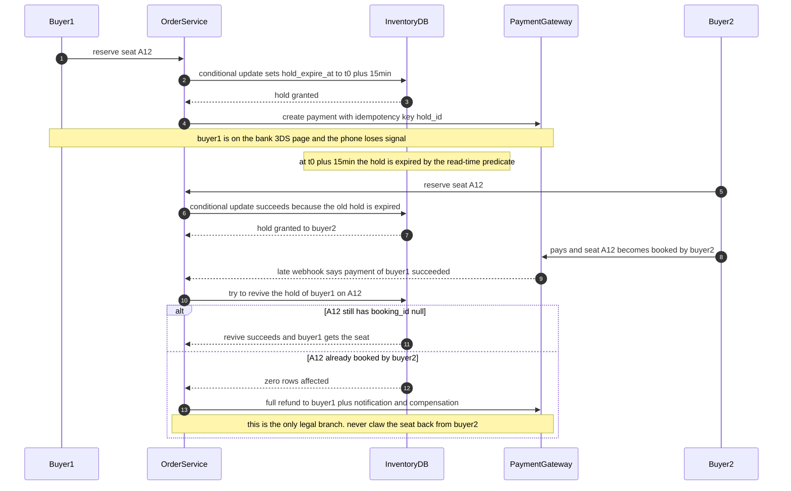

# 14 · 设计票务系统（Design a Ticket Booking System）

> 这题的题面是"卖票"，考的是**库存并发的正确性**：三个约束必须同时成立 —— **不超卖、不锁死、保留会超时自动释放**。
> 只解决其中一个的方案在第一次追问下就崩。而三个约束需要**三个互不依赖的机制**，这是全题唯一的评分主轴。

---

## 读这道题之前

**如果你是直接翻到这道题的**：这题从头到尾在用三个构件（条件更新、边缘缓存、准入控制）。正文默认你知道它们是什么。

**先确认你能回答这三个问题**

1. 为什么"先 SELECT 查余量、判断够不够、再 UPDATE 扣减"放进事务里**仍然**会超卖？数据库的默认隔离级别挡住了什么、没挡住什么？
   答不出 → 先读 [00-concepts §7 事务与隔离级别](../00-foundations/00-concepts.md)
2. 缓存的 TTL 是什么？"允许数据陈旧 1–3 秒"为什么能把 10 Gbps 的回源变成 1 QPS？
   答不出 → 先读 [`02-caching.md`](../01-building-blocks/02-caching.md) §1、§6
3. Little's Law：等待室放行 2,000 人/s，你前面排了 10 万人，你要等多久？这个数字为什么必须给用户看见？
   答不出 → 先读 [00-concepts §2 延迟 / 吞吐 / 并发](../00-foundations/00-concepts.md)

**这道题会用到的构件**

| 构件 | 用在哪 | 详见 |
|---|---|---|
| 条件更新 vs 分布式锁、fencing token | §4.1 占座语句、§4.2 三种实现、§4.3 为什么不用锁 | [`05-consensus-and-coordination.md`](../01-building-blocks/05-consensus-and-coordination.md) §3、§4 |
| 隔离级别与并发扣减 | §4.2 悲观锁 / 乐观 CAS / 唯一约束的吞吐差 | [00-concepts §7](../00-foundations/00-concepts.md) |
| CDN、缓存键、`stale-while-revalidate` | §4.4 第 0 层静态化：座位图与等待室位次 | [`02-caching.md`](../01-building-blocks/02-caching.md) §6 |
| 负载卸载与准入控制 | §4.4 虚拟等待室 + 令牌准入 = 第 1、2 层漏斗 | [`03-resilience-patterns.md`](../05-reliability/03-resilience-patterns.md) §6、§7 |
| 幂等键与对账 | §4.5 支付回调迟到时的"复活"与三方比对 | [01-fundamentals §5](../00-foundations/01-fundamentals.md)、[`02-billing-and-metering.md`](../03-saas-platform/02-billing-and-metering.md) §4、§9 |

**这道题的一句话本质**

> **97% 的请求在物理上不可能成功，所以真正的战场在准入层，不在库存层。**
> 而库存层要同时守住三个约束 —— 不超卖、不锁死、超时自动释放 —— 它们需要三个互不依赖的机制。读正文时随时问："这一段在守哪一条？"

---

## 0. 45 分钟怎么分配这道题

| 分钟 | 做什么 | 这一段的得分点 |
|---|---|---|
| **0–2** | 复述题面，主动切一刀："我按**选座**做，不选座（GA）的差异我留到最后单讲" | 主动划范围，而不是等面试官问 |
| **2–5** | 问 6–8 个澄清问题，其中 2 个必须问（见 §1） | 问对问题比答对问题早 3 分钟拿分 |
| **5–9** | 估算：峰值 12 万 QPS、**97% 请求注定失败**、单主库 5 秒卖光 5 万张 | 用数字推出"库存不是瓶颈，准入才是"，这是全题的论点 |
| **9–14** | 画高层图，先给**最简单能工作的版本**：一张 `seat` 表 + 条件更新 | 先能工作再优化。此时不要提 Redis、Kafka |
| **14–19** | 状态模型：`available / held / booked`，说清 **`held` 是派生态不是存储态** | 数据模型选对，后面所有问题都变简单 |
| **19–25** | 深挖一：不超卖的三种实现 + 单行吞吐的物理上限 | 量化对比，说得出 500 vs 2,000 TPS 的来源 |
| **25–30** | 深挖二：hold 超时的三种实现，**惰性判定管正确性、扫描器管体验** | 分离正确性与体验，是这题最省事的判断 |
| **30–35** | 深挖三：**支付成功但座位已被释放** —— 不等面试官问，主动讲 | 这一段直接决定 Senior / Staff |
| **35–40** | 削峰三层 + 失败模式表 | 系统性思维，而不是零散优化 |
| **40–43** | 演进路线 v0→v2 与撞墙信号 | Staff 信号：你知道什么时候**不该**建这套 |
| **43–45** | 主动说边界："黄牛、退票改签、连座算法我没展开，各自的难点是 X" | 知道自己没说什么，比假装全都说了强 |

**时间陷阱**：不要在座位图渲染、连座（contiguous seats）选择算法上花超过 2 分钟。它们看起来有意思，但**不产生任何评分信号**。

---

## 1. 需求澄清

| # | 我会问的问题 | 面试官通常怎么回 | 这个答案改变什么 |
|---|---|---|---|
| **1** ⭐ | **座位有身份吗** —— 选座（reserved seating）还是只买张数（general admission, GA）？ | "先做选座" | **决定库存是 N 个独立唯一资源，还是 1 个计数器。两者的并发方案完全不同**，见 §4.6 |
| **2** ⭐ | 有**秒杀级峰值**吗？最热的一场，多少人抢多少张？ | "5 万座位，50 万人，开票瞬间涌入" | **决定准入层存不存在**。没有峰值，整个准入层可以删掉，题目难度掉一半 |
| 3 | 超卖能容忍吗？ | "演唱会绝对不行" | 见下方的反直觉判断 |
| 4 | 座位保留多久？支付超时多久？ | "给用户看 10 分钟倒计时" | 决定 hold 时长与支付 deadline 的**相对关系**（用户看 10 min，库里存 15 min），这是 §4.5 的地基 |
| 5 | 一单最多几张？要连座吗？ | "最多 4 张，尽量连座但不强制" | 决定库存操作是单座位还是多座位事务（多座位要按 `seat_id` 排序加锁防死锁） |
| 6 | 限购规则？实名吗？ | "每人每场 4 张，暂不实名" | 决定限购计数是否要进同一个事务，见 §4.6 |
| 7 | 退票 / 改签在范围内吗？ | "先不做" | 退票会让 `booked` 不再是终态，是一整条新链路 |
| 8 | 座位图必须实时吗？ | "秒级陈旧可以接受" | **允许陈旧 = 允许 CDN = 省掉 10 Gbps 回源**，见 §4.4 |

⭐ **不问就会做错方向的两个**：问题 1 和问题 2。

**关于问题 3 的反直觉判断**：很多人以为"能否超卖"是架构分叉点，它不是。**航空公司不是靠一个会超卖的库存系统实现超卖的** —— 它们的库存依然精确，只是把**可售容量**设成 `物理容量 × 1.05`。超卖是**上层的一个系数**，不是下层的一个 bug；做进库存层，你会失去"到底卖了多少张"这个事实。⇒ 无论答案是什么，**库存层永远做精确**。这个回答本身就是加分点。

---

## 2. 估算

**假设**：全国性票务平台，年办活动 20 万场，平均 2,000 座位，年售 3,000 万张。单场最热：**5 万座位，50 万人抢**（10:1）。

### 峰值 QPS

```
开票时刻 T0：50 万人中 80% 在 T0+10s 内发首次请求 → 40 万 / 10 s = 4 万 QPS
             抢失败后平均重试 2 次（人手动 + 客户端自动）→ 每人 3 次
  ⇒ 峰值 ≈ 4 万 × 3 = 12 万 QPS，总请求量 50 万 × 3 = 150 万次
  ⇒ 能成功改变库存状态的只有 5 万次 ⇒ 失败率 = 1 − 5万/150万 = 96.7%
```

> **这个数字意味着什么**：**97% 的请求在物理上不可能成功。** 所以优化方向不是"让库存层更快"，而是"让这 97% 根本到不了库存层"。这一句话决定了后面所有的设计。

### 库存层的物理上限

```
单行（single row）写吞吐上限 = 1 / 行锁持有时间；行锁持有时间 ≈ 事务提交时间
  （含 WAL fsync 与组提交 group commit）
  ├─ 单条自动提交的 UPDATE                  → 0.5–2 ms  ⇒ 单行 500–2,000 TPS
  └─ SELECT FOR UPDATE + 应用逻辑 + UPDATE  → 2–10 ms（含 RTT）⇒ 单行 100–500 TPS
选座场景：5 万座位分散在 5 万行 ⇒ 没有单行热点，上限变成"整库写 TPS"
  单 Postgres 主库小事务写 1–2 万 TPS（量级）⇒ 5 万座位 ÷ 1 万 TPS = 5 秒卖光
```

> **这个数字意味着什么**：**只要削峰做对，一个单主库 5 秒就能把 5 万张票卖光。** 库存层从来不是瓶颈 —— 任何以"我要用 Redis 扛 12 万 QPS 扣库存"开场的答案，都是在解一个不存在的问题。

### 带宽（本题最大的一项，也是最常被漏掉的）

```
座位图（seat map）：5 万座位 × 约 20 B = 1 MB 原始，状态高度重复，br 后取 150 KB
50 万人各拉一次 = 75 GB，集中在 60 s 内 = 1.25 GB/s ≈ 10 Gbps
  ⇒ 单台 4 vCPU 应用机转发上限 100–200 MB/s ⇒ 需 7–13 台机器纯发座位图（还没算冗余）
  ⇒ 走 CDN：回源 1 QPS（每秒生成一份快照），出流量 75 GB × $0.02–0.08/GB ≈ $2–6/场
     （2026 年中量级，随时变动）
```

### 连接数、存储与成本（这三项都不是难点，但要说得出来）

- **连接数**：等待室用长连接 → 50 万并发 ÷ 单机 5 万 = 10 台接入机；改成"轮询 CDN 上的位次文件" → 10 万 QPS 全命中边缘、回源 1 QPS、**0 台接入机**。这是全题最便宜的一次优化。
- **存储**：4 亿座位行 × 300 B = 120 GB；订单 3,000 万/年 × 1 KB = 30 GB/年 ⇒ 十年也只是 TB 级。这题不是存储题。
- **成本**：单场边际成本 = CDN $2–6 + 托管准入层（按事件计价，量级 $10²–10³/场，需询价）⇒ 远低于一张票的售价。这题也不是成本题 —— 它是"售罄那 5 秒能不能不出事"的题。

---

## 3. 高层设计

**最简单能工作的版本是一张表 + 一条 SQL**：`用户 → API → UPDATE seat ... WHERE booking_id IS NULL AND hold_expire_at < now()`，影响 0 行即抢失败。这个版本在 2,000 人抢 500 张票时**完全够用**。下面加的每一层，都要说得出它挡住了哪个具体的数字。

```
 50 万人 ─▶ ┌ 第 0 层 静态化 CDN（TTL 1–3 s）演出页 / 座位图 / 剩余量 / 等待室位次 ┐
            └ 命中 > 99%，回源 1 QPS，挡掉 10 Gbps；未命中的只有"取令牌"一个接口   ┘
                 │ 50 万次取令牌
            ┌────▼ 第 1 层 准入 Admission ───────────────────────────────┐
            │ 虚拟等待室 FIFO → 签名令牌 sign(user,event,admit_at,nonce) │
            │ 放行 2,000 人/s，累计只放 库存×3 = 15 万人 ← 阀门在这里     │
            └────┬──────────────────────────────────────────────────────┘
                 │ 15 万人 / 75 s × 1.5 次尝试 = 3,000 TPS
            ┌────▼ 第 2 层 库存 Inventory（唯一裁决者）──────────────────┐
            │ 单条条件更新 → hold 15 min；分片 hash(event_id)，          │
            │ 热门场次独占一个 cell                                      │
            └────┬──────────────────────────────────────────────────────┘
                 │ 5 万次成功 hold
            ┌────▼ 第 3 层 订单 + 支付（幂等键 = hold_id）───────────────┐
            │ 成功 → 同事务 hold→booking；失败/超时 → 什么都不做（惰性）  │
            └────┬──────────────────────────────────────────────────────┘
                 ▼  出票（与库存解耦，可重发）

 旁路（不在关键路径）：Sweeper 每 30 s 刷座位图 ｜ Reconciler 每小时三方对账
```

**四条不可动摇的边界**：

1. **库存的唯一裁决者是数据库的一条条件语句**。应用层永不 `check-then-act`，永不加分布式锁。
2. **正确性只依赖读时判定**。任何"必须有后台任务活着才正确"的设计，都是把可用性问题伪装成正确性问题。
3. **准入层 fail-close**（依赖不可用时选择**拒绝**服务；反面是 fail-open —— 放行，见 [`03-resilience-patterns.md`](../05-reliability/03-resilience-patterns.md) §6）。它挂了就停售，不能放开 —— 见 §5。
4. **座位状态允许陈旧，座位归属不允许错**。这两件事走两条路径：前者走 CDN，后者走数据库。

---

## 4. 深挖

### 4.1 座位状态模型与保留超时

**核心洞见：`held` 不是一个存储的状态，是一个派生（derived）状态。**

```
   available                          held                        booked
   booking_id IS NULL     ──hold──▶  booking_id IS NULL  ──pay──▶  booking_id
   AND (hold_expire_at    条件UPDATE  AND hold_expire_at   同事务    IS NOT NULL
        IS NULL OR < now())                >= now()                    │
        ▲                                  │                           │
        │◀──── 到期：不需要任何写操作 ──────┘                           │
        │       （谓词自己就变真了）                                    │
        └──────────── refund：新的正向操作，不是回滚 ───────────────────┘

  ※ 三个状态里只有 booked 是"写出来的"。available / held 是同一行的两种读法。
  ※ booked → held 这条边不存在：座位卖出后只能被退回，不能被抢回。
```

表结构与占座语句（一张表，不要拆两张 —— 拆了就需要跨表原子性）：

```sql
CREATE TABLE seat (
  event_id BIGINT, seat_id BIGINT, booking_id BIGINT,   -- booking_id NULL = 未售出，唯一的真相
  hold_id UUID, held_by BIGINT, hold_expire_at TIMESTAMPTZ,
  PRIMARY KEY (event_id, seat_id));
CREATE INDEX ON seat (event_id, hold_expire_at) WHERE booking_id IS NULL;  -- 给扫描器用

-- 占座：这条语句是全题的心脏
UPDATE seat
   SET hold_id = :hold, held_by = :user, hold_expire_at = now() + interval '15 minutes'
 WHERE event_id = :ev AND seat_id = :seat
   AND booking_id IS NULL                                    -- 没被卖掉
   AND (hold_expire_at IS NULL OR hold_expire_at < now())    -- 没被有效持有
RETURNING hold_id;
-- 0 行 = 抢失败。返回 409 + seat_taken，不带 Retry-After，客户端不重试。
```

**所有时间比较用数据库的 `now()`，不用应用服务器的时间。** 实例间的时钟偏移（clock skew）会让两个实例对"是否过期"给出相反答案；数据库的 `now()` 是单点，天然一致。

#### 保留超时的三种实现

| 方案 | 释放延迟 | 正确性依赖谁 | 本题规模下的成本 | 失效时会怎样 |
|---|---|---|---|---|
| **定时扫描**（scheduled sweep） | 一个扫描周期（30 s） | **扫描器必须活着** | 5 万行表上走部分索引，ms 级；每 30 s 一次 | 扫描器挂 → **库存永久锁死，显示售罄但有空座** |
| **惰性判定**（lazy expiration） | **0**（读到即算） | **只依赖读时比时间** | 每条语句多一个谓词，≈ 0 | 没人来读 → 座位图显示为已售（**体验问题，不是正确性问题**） |
| **延迟队列**（delay queue，见 [`03-messaging-and-streams §5`](../01-building-blocks/03-messaging-and-streams.md)） | 秒级 | 队列不丢消息 + 消息可撤销 | 每个 hold 一条消息：单场 5 万 hold = 5 万条在途 | 队列挂 = 退化成定时扫描的失效模式；**悬空消息必须在消费时重新校验状态** |

**量化对比**：单场 5 万个 hold 里约 70% 在到期前就已转成 booking —— 那 3.5 万次定时唤醒是纯浪费；更要命的是悬空消息在消费时必须重新校验座位状态，**等于你还是写了一遍惰性判定**。换来的只有"释放延迟从 30 s 降到 1 s"，而释放延迟根本不影响正确性。⇒ 延迟队列只在 hold 极度分散（全平台几百万个 hold 散在十万场演出上，单场索引扫描的收益不再成立）时才值得。本题不是。

**结论：三选一是个伪命题。惰性判定和扫描器要同时有，但它们守的不是同一件事。**

> **面试金句 · 惰性过期**
> "过期不应该是一个写操作。我把 hold 的过期做成读时判定 —— `booking_id IS NULL AND hold_expire_at < now()` 就是可售，**没有任何后台任务参与正确性**。后台扫描器只负责把座位图刷回绿色，它挂三天，库存依然是对的，只是座位图难看。把正确性和体验放在两条路径上，是这道题最省事的一个决定。"
> "Expiry should never be a write. I make hold expiry a read-time predicate — booking_id is null and hold_expire_at is in the past means the seat is sellable, and no background job takes part in correctness at all. The sweeper only exists to repaint the seat map green; if it dies for three days the inventory is still correct, the map just looks stale. Splitting correctness from cosmetics onto two paths is the cheapest decision in this whole design."

---

### 4.2 不超卖的三种实现，以及它们的吞吐

| 方案 | 语句形态 | 单资源吞吐 | 冲突时的行为 | 代价 | 什么条件下选它 |
|---|---|---|---|---|---|
| **悲观锁**<br>pessimistic lock | `SELECT ... FOR UPDATE` → 应用判断 → `UPDATE`，一个事务 | **100–500 TPS**（锁跨越网络往返） | 后来者**排队等待**，占住连接 | 事务时长 = 应用逻辑时长；多座位需按 `seat_id` 排序加锁，否则死锁 | 必须在同一事务里读出多张表再决定（如同时校验限购 + 优惠券 + 风控），且不能拆 |
| **乐观 CAS**<br>conditional update | `UPDATE ... WHERE booking_id IS NULL AND ...`，单条 | **500–2,000 TPS** | 直接失败返回，**不排队** | 高冲突下若自动重试，DB 侧 QPS 暴涨而成功率不变 | **票务的默认答案** |
| **数据库唯一约束**<br>unique constraint | `INSERT INTO seat_hold(seat_id PK) ... ON CONFLICT DO NOTHING` | 同上，但受 B+Tree 同页插入竞争影响 | 冲突即失败 | 需要一个**天然唯一键**；GA 场景没有这样的键，得人工造 | 需要保留"历史上谁抢过"的审计记录时 |
| （旁参）**Redis 预扣 + 异步落库** | Lua 脚本原子扣减 | 单分片 8–15 万 QPS | 直接失败 | **把正确性从"DB 事务"降级成"Redis 不丢数据"**：AOF everysec 最坏丢 1 s 扣减 = 峰值下 2,000 条 | 削峰已经做到极致仍不够 —— 本题不会走到这一步 |

**为什么悲观锁慢 5–10 倍**：差距**全部**来自"锁在网络往返期间被持有" —— 条件更新的临界区在数据库进程内部（微秒级），悲观锁的临界区跨越了应用与数据库之间的 RTT（毫秒级）。这不是实现质量问题，是拓扑决定的。

**票务场景里乐观锁的一个特殊之处**（很多人把通用 OCC 模板套过来时会在这里翻车）：
```
通用 OCC：失败 = "版本变了，重读后重试"  → 重试是对的
票务场景：失败 = "这个座位真的没了"      → 重试是错的
⇒ 条件更新失败必须是终态：409 + seat_taken，让用户去选别的座位。
   自动重试同一个座位，只会把 12 万 QPS 变成 36 万 QPS，成功率一点不变。
```

---

### 4.3 为什么不该用分布式锁（参见 [`05-consensus-and-coordination.md §3–§4`](../01-building-blocks/05-consensus-and-coordination.md)）

| 论点 | 展开 |
|---|---|
| **① 自我否定** | 要让锁安全必须配 **fencing token**；而 fencing token 的安全性来自**存储端的单调性检查**（`WHERE fence_token < :new`）。也就是说你必须先让存储层具备条件写能力 —— 可一旦它能条件写，你就不需要那把锁了 |
| **② 更慢** | Redis 锁 = `SET NX` + 业务 + Lua 比较删除 = **3 次往返**，且临界区横跨网络；条件更新 = **1 次往返**，临界区在引擎内。单座位吞吐从 500–2,000 TPS 掉到 100–500 TPS |
| **③ 新单点** | 锁服务成为库存写路径上的一个新依赖。它挂了你只有两个选择：停售（fail-close）或裸奔超卖（fail-open）。条件更新压根没有这道选择题 |
| **④ 追问必崩** | "持锁进程 GC 暂停 30 秒后醒来继续写呢？"——没有 fencing token 就接不下去，而条件更新根本不需要面对这个问题 |

> **面试金句 · 分布式锁**
> "分布式锁在这道题上是一个自我否定的方案。要让它安全，你必须配 fencing token；而 fencing token 的安全性来自**存储端的单调性检查**。你得先让存储层能做条件写 —— 可一旦它能做条件写，那把锁就没用了。锁在这里只贡献三样东西：一次额外的网络往返、一个新的单点故障、以及一个我答不上来的追问。"
> "A distributed lock is self-defeating here. To make it safe you need a fencing token, and the fencing token's safety comes from a monotonicity check on the storage side. So you first have to give storage the ability to do a conditional write — and the moment storage can do conditional writes, the lock is redundant. All the lock adds is one extra round trip, one new single point of failure, and one interview question I can't answer."

**什么条件下我会改口**：互斥必须**跨异构存储**成立 —— 座位在 Postgres、场馆通行证在另一个团队的服务里、两者必须同生共死，而你无法把它们合进一个事务。那时你需要的也**不是锁**，是 **Saga + 预留（reservation / TCC = Try-Confirm-Cancel：先在每个系统里"试占"一份，全部试占成功再统一确认，任一失败则各自取消）**，见 [`02-event-driven-and-cqrs.md §2`](../02-architecture-patterns/02-event-driven-and-cqrs.md)。锁在这道题的任何版本里都不是答案。

---

### 4.4 削峰：三层漏斗，每层都要算得出挡了多少

（"削峰"英语里没有对应名词，面试时说 **"buffer the burst" / "smooth the spike"**，别直译。）

```
50 万人
 ├ 第 0 层 静态化（serve it from the CDN）TTL 1–3 s + stale-while-revalidate
 │   （SWR：缓存过期后先把旧值返给用户、同时后台去回源刷新 —— 源站永远不被"过期瞬间"的并发打穿）
 │   挡掉 10 Gbps 座位图 + 10 万 QPS 位次轮询 → 源站只剩"取令牌"：50 万次
 ├ 第 1 层 虚拟等待室（virtual waiting room）全局 FIFO + 签名令牌 + 位次可见
 │   放行 2,000 人/s ← 阀门 → 累计 15 万人（= 库存 × 3），耗时 75 s
 ├ 第 2 层 令牌准入（token admission）令牌绑 user+event+admit_at+nonce，一次性
 │   （nonce：一次性随机串，服务端用过即作废 —— 它让令牌不能被复制粘贴给第二个人用）
 │   → 到达库存层：15 万人 × 平均 1.5 次尝试 = 3,000 TPS，持续 75 s
 └ 第 3 层 库存条件更新：单主库上限 1–2 万 TPS ⇒ 余量 3–6 倍 ✅
     22.5 万次 UPDATE 里成功 5 万，其余全部返回"这个座位刚被选走"

 不削峰的对照：12 万 QPS 直接撞库存层 → 连接池瞬间耗尽 →
              **整个数据库不可用**，不只是这一场演出的接口变慢
```

**三个容易漏的设计点**：

1. **位次广播必须走 CDN**。50 万人每 5 s 问一次"轮到我了吗" = 10 万 QPS。做法：把"当前放行到第 N 号"写成 1 s TTL 的静态文件推到边缘，客户端拿自己的号本地比较，回源 1 QPS。
2. **令牌必须签名并绑定身份**。不签名的令牌 = 黄牛直接构造请求跳过队列，整个准入层白做。
3. **队列位次必须对用户可见**。看不见位次的队列会让用户疯狂刷新，正好抵消削峰。预计等待时间用 Little's Law（并发 = 吞吐 × 停留时间，反解出停留时间）估：`等待 ≈ 前面的人数 / 放行速率`，见 [`02-capacity-estimation.md §3`](../00-foundations/02-capacity-estimation.md)。

**自建还是买（2026）**：等待室的全部价值在于"位于你的源站之前"，而这正好是 CDN / 边缘厂商的位置。托管选项：[Cloudflare Waiting Room](https://developers.cloudflare.com/waiting-room/)、[Virtual Waiting Room on AWS](https://docs.aws.amazon.com/solutions/latest/aws-virtual-waiting-room/welcome.html)、[Queue-it](https://queue-it.com/)、Queue-Fair、CrowdHandler。
⇒ **自建虚拟等待室的 ROI 在多数场景下是负的。** 说"我会先用托管的，只在需要把队列语义和业务规则深度耦合时才自建"，比现场设计一个分布式队列更像 Staff。

---

### 4.5 支付超时与库存释放的一致性（这是必答题）

**问题**：hold 到期释放了，支付回调才到。钱收了，座位没了。先做选择，再谈兜底：

| 策略 | 描述 | 结构性超卖风险 | 座位周转 | 什么时候选 |
|---|---|---|---|---|
| **A. hold 时长 > 支付 deadline + 余量** | hold 15 min，支付网关 deadline 10 min，留 5 min 安全带 | 0 | 慢（座位被锁 15 min） | **默认** |
| **B. 到期即释放，支付成功后"复活" hold** | 回调时重新尝试占座 | 需要处理"已被别人买走" | 快 | 库存极度紧张、周转率是核心指标 |
| **C. 下单即出票，超时取消** | 支付前座位就是 `booked` | 0 | 最慢（取消率高时座位长期不可售） | 低竞争场景（会议、餐厅订位） |

**选 A 为主 + B 为兜底。** A 把竞态窗口从"常态"压成"罕见"，但**压不到零** —— 支付网关的 webhook 可以迟到几小时（三方渠道 p99 3–30 s，超时率 0.1–1%，最长要主动查询到 24 h，见 [`07-classic-canon.md` 第 8 题](07-classic-canon.md)）。这条路径会被触发多少次：

```
3,000 万张/年 × 0.5% 状态未知 = 15 万次/年
其中真正撞上"座位已被别人买走"的（只发生在热门场次售罄边缘）≈ 1%
  ⇒ 约 1,500 次/年 ≈ 每天 4 次
```
> **这个数字意味着什么**：每天 4 次，正好是"必须自动化、绝不能靠人工工单"的量级。每天 0.01 次可以人工，每天 400 次会压垮客服。4 次是那个必须写代码的中间地带。

```sql
-- 复活（revive）：一条语句，两个出口。支付回调处理，幂等键 = hold_id（不是随机 UUID）
UPDATE seat SET booking_id = :order, hold_id = NULL, hold_expire_at = NULL
 WHERE event_id = :ev AND seat_id = :seat
   AND booking_id IS NULL                            -- 没被别人买走
   AND (hold_id = :hold OR hold_expire_at < now())   -- 我的 hold 还在，或座位已回到可售
RETURNING seat_id;
-- 1 行 ⇒ 出票成功，用户毫无感知
-- 0 行 ⇒ 座位已被别人买走。唯一合法出路：全额退款 + 通知 + 补偿（优先购买权/代金券）
```

**绝不能把座位从已经付了钱的第二个买家手里抢回来。** 这句话要明确说出口 —— 它是产品原则，不是技术选择。表格只能列出"有哪几种处理"，画不出"处理方式由到达时刻单向决定"，所以这里补一张时序图：



> 📖 **读图要点**：**没有任何一条边从第 13 步指回第 8 步** —— 一旦 buyer2 在第 8 步付完钱，系统里就不存在"撤销 buyer2 的 booking"这条路径。这条缺失的边就是本节的全部结论：竞态窗口消除不掉，能设计的只有"输的那一方怎么被补偿"。再看第 6 步：它之所以成功，不是因为谁把旧 hold 删掉了，而是读时谓词自己变真了 —— 所以即使扫描器整晚都挂着，第 6 步照样成立。

#### 对账：每小时三方比对（`seat.booking_id × order × 支付流水`）

```
有支付、无座位              → 自动退款队列（上面那 4 次/天）
有座位、无支付              → 释放座位 + 告警（这是 bug 的信号，不是正常业务）
有 hold、无 order 且已超期  → 正常，扫描器清理
```
**不对账的库存系统必然长期漂移**，且方向永远对你不利：要么用户付了钱没票（客诉 + 退款），要么座位卖不出去（收入漏损）。

**还有一件事**：hold 到支付有 15 分钟，**支付回调时必须重新校验限购与风控**。用户可以在这 15 分钟里用另一个入口再拿 4 张。

---

### 4.6 选座与 GA 的架构差异，以及黄牛与限购

| 维度 | 选座（reserved seating） | 不选座（general admission, GA） |
|---|---|---|
| 库存表示 | N 行，每行一个座位，**天然唯一键** | 1 行计数器，或 M 个**分桶计数器**（sharded counter：把一个计数器拆成 M 行，写时随机挑一行扣、读时求和 —— 用"读变贵"换"写不再撞同一行"） |
| 不超卖机制 | 条件更新 / 唯一约束 | `UPDATE ... SET remaining = remaining - :n WHERE remaining >= :n` |
| 单点吞吐 | 5 万座位分散在 5 万行 → **没有单点** | 单行 500–2,000 TPS，**这就是全部** |
| 座位图带宽 | 10 Gbps 级，必须 CDN | ≈ 0 |
| 削峰必要性 | 高（用户要看图、要选、会犹豫，天然被摊开） | **极高**（没有选择过程，所有人在同一毫秒撞同一行） |
| 分桶代价 | 不需要 | 余量碎片化，见下 |
| 退票 | 座位回到原位 | 计数器 `+1` |
| hold 的意义 | 锁住一个具体资源 | 锁住一个额度 —— 更接近配额租约（见 [`04-usage-based-billing.md §10`](04-usage-based-billing.md)） |

#### GA 分桶数怎么算（这里有个反直觉的结论）

```
桶数 = ceil(准入后的峰值 TPS / 单行 TPS)
  削峰做对：  3,000 ÷ 1,000 =   3 个桶  ← 取 8 留余量
  削峰没做：120,000 ÷ 1,000 = 120 个桶（而且大概率还是会挂）

碎片化的代价：1 万张票，售罄前还剩 200 张
  拆   8 桶 → 平均每桶 25 张 → 买 4 张一次成功
  拆 100 桶 → 平均每桶  2 张 → 买 4 张几乎必然要"借桶"
借桶必须按固定顺序遍历（bucket_id 升序），不能随机 —— 随机会产生活锁（livelock）：
  两个买家反复抢同一批桶的余量，谁都凑不齐。
"还剩多少张"变成 M 行求和 ⇒ 1 s TTL 的缓存值，UI 上明写是近似值。
```

> **削峰不只是保护数据库，它直接决定你需要几个桶 —— 而桶越少，碎片化越轻。**

#### 限购与黄牛

```
限购三层，成本递增、有效性递增：
① 账号级：per (user_id, event_id) 限 4 张   成本 ≈ 0，黄牛用小号绕过
② 身份级：实名 + 人证核验，一证一票        有效，代价是 PII（personally identifiable
                                            information，个人身份信息）与合规成本
③ 行为级：设备指纹 + IP 段 + 行为模型      覆盖最广，误杀率就是它的全部代价
```

**实现陷阱：限购计数必须和 hold 在同一个事务里。** 否则并发下同一个人能同时持有 8 个 hold。

```sql
BEGIN;
  UPDATE user_event_quota SET held = held + :n
   WHERE user_id = :u AND event_id = :ev AND held + :n <= 4
  RETURNING held;                      -- 0 行 ⇒ 超限，直接回滚
  UPDATE seat SET ... ;                -- §4.1 那条语句
COMMIT;
```
这确实引入了第二个热点行，但它是 **per-user 的**，天然分散在 15 万个买家上，不构成瓶颈。

**2026 年的监管现实**（这一段能把答案从"技术方案"抬到"产品与合规"）：

- 美国：BOTS Act 之上，2025-03-31 的行政令要求 FTC 强化执法（[Wiley 解读](https://www.wiley.law/alert-Executive-Order-on-Ticket-Resale-Market-Calls-for-Greater-FTC-Enforcement)）；2025-09 FTC 联合七个州起诉 Live Nation / Ticketmaster，**指控之一正是"允许经纪商批量购票、绕过限购上限"**。
- 英国：2026-05-14 King's Speech 提出 **Draft Ticket Tout Ban Bill**（禁止高于原价转售、限制转售平台服务费、禁止个人转售超过其原始限购量），但仅以草案形式做立法前审查，普遍预计 **2027–28 会期**才可能成法（[TicketNews](https://www.ticketnews.com/2026/05/uk-ticket-resale-price-cap-reportedly-pushed-back-as-debate-over-consumer-harm-intensifies/)、[Music Ally](https://musically.com/2026/05/14/uk-ticket-touting-ban-will-only-be-draft-legislation-for-now/)）。

⇒ **设计含义：限购正在从产品策略变成可被起诉的合规要求。** 你的系统必须能**证明**每一单的限购判定过程 —— 限购决策要留结构化审计日志（谁、哪场、判定输入、判定结果、规则版本），而不只是一个 boolean。这是 Staff 级的那一层。

---

## 5. 失败模式

| 故障 | 影响 | 检测信号 | 应对 / 降级到什么 |
|---|---|---|---|
| **扫描器 OOM 或积压** | 座位图显示售罄但实际有空座。**正确性不受影响**（惰性判定兜底）。若系统里没有惰性判定，同一个故障就变成"库存永久锁死" | `count(*) WHERE hold_expire_at < now() AND hold_id IS NOT NULL` 持续增长 | 惰性判定继续保证可售；重启扫描器；降级为"用户点到该座位时就地判定并刷新"。**没有惰性判定是设计缺陷，不是运维问题** —— 别指望给扫描器加副本 |
| **准入层不可用** | 12 万 QPS 直接打到库存层，连接池耗尽，**整库不可用**（波及同分片的所有其他演出） | 库存服务连接池等待数触顶 / DB active connections 达上限 | **fail-close**：对"开票中"的演出直接返回 503 + 静态说明页。票务的准入层 fail-open 等于放弃整个数据库 |
| **支付回调迟到，座位已售** | 用户付了钱没座位 | `payment_succeeded_without_seat` 计数 > 0（应该是每天个位数） | 自动全额退款 + 通知 + 补偿。**绝不从第二个买家手里收回** |
| **支付网关不可用** | 大量 hold 到期，票"看起来卖不掉" | 支付创建成功率骤降 | 暂停放行新令牌（别让人排队进来发现付不了）；已有 hold **自动延长一次**并告知用户 |
| **客户端自动重试放大** | 峰值再 ×3，削峰白做 | 同一 `user_id` 5 s 内 > 5 次下单请求 | 抢失败返回**终态** 409 + `seat_taken`，**不带 `Retry-After`**；客户端按错误码决定不重试 |
| **座位图 CDN 未命中 / TTL 配错** | 10 Gbps 回源，源站被自己人打死 | CDN 命中率 < 90%、origin 出网带宽陡增 | 强制缓存 + `stale-while-revalidate`；座位状态本来就允许陈旧（见 [`02-caching.md §6`](../01-building-blocks/02-caching.md)） |
| **热门场次与普通场次同分片** | 一场演唱会把分片打满，同分片所有演出跟着挂 | 单分片写 TPS / CPU 远高于其他分片 | 分片键 `hash(event_id)` 可隔离场次；**超大场次提前迁到独立 cell**（见 [`05-scaling-playbook.md §7`](../05-reliability/05-scaling-playbook.md)） |
| **时钟漂移导致过期判断不一致** | 两个实例对同一个 hold 给出相反结论 | NTP offset 告警 | **时间比较一律用数据库 `now()`**。这一条比监控 NTP 可靠 |

---

## 6. 演进路线

### 什么时候这个方案是错的（在 v0 之前先问这个）

| 情况 | 该做什么 |
|---|---|
| 票量 < 1,000、无秒杀（小剧场、会议、餐厅订位） | 一张 `seat` 表 + 条件更新 + 一个 cron 清 hold。**不要准入层、不要 Redis、不要队列**。这套东西的复杂度会超过业务本身 |
| 库存充足、几乎不会卖光（工作日电影场次、长期通票） | **连 hold 都不需要**：下单即锁定，超时取消。hold 是为竞争设计的，没竞争就是纯成本 |
| 允许并鼓励超卖（航空、酒店） | 库存**仍然精确**，超卖是上层的一个可售容量系数（`capacity × 1.05`）。把超卖做进库存层会让你失去"到底卖了多少"这个事实 |
| 一次卖出一整块（包场、团票、展位） | 这不是并发问题，是审批流。加任何锁只会拖慢它 |
| 二级市场 / 转售平台 | 卖家分散，没有中央库存。核心问题变成"同一张票不能被卖两次" = 票据所有权转移 ⇒ 更接近支付 / 账本题，见下一篇 |

### v0 → v2

```
v0  单场 < 5,000 座位、并发 < 2,000 人                              【一天能上线】
    单 Postgres：seat 一张表 + 条件更新 + hold_expire_at 惰性判定 + 30 s cron；
    座位图查库生成 + Cache-Control 5 s。无准入层、无 Redis、无队列。
    撞墙信号（任一即升级）：DB active connections 触顶 ｜ 下单 p99 > 2 s 持续 30 s
                          ｜ 座位图接口源站出网 > 1 Gbps

v1  单场并发 5 万级                                              【一到两周】
    + 座位图与剩余量静态化到 CDN（TTL 1–3 s + stale-while-revalidate）
    + 令牌准入：只放 库存×3 的人进下单页（此时还不需要完整等待室）
    + 支付回调对账 job（每小时）
    撞墙信号：令牌接口本身成为 QPS 大头（需要真正的排队与位次广播）
            ｜一场热门演出让同分片其他演出 p99 抬升 > 50%
            ｜payment_succeeded_without_seat 每天 > 1 次（hold 时长设短了）

v2  单场并发 50 万级                                                ← 本文
    + 虚拟等待室（优先托管）+ FIFO 位次走 CDN
    + 库存按 hash(event_id) 分片，超大场次独占 cell
    + GA 分桶计数器（桶数 = ceil(准入后峰值 TPS / 1,000)）
    + 三方对账（seat × order × 支付流水）+ 限购审计日志
    撞墙信号：单场 > 50 万并发或需要多地域就近准入 ｜ 合规要求"证明限购判定过程"
            ｜出现第二个业务线来借你的库存能力 → 进 v3

v3  库存层产品化：抽成通用的"有限资源预留服务"（座位 / 停车位 / 考位 / 号源共用）；
    跨区域库存（同一批票多国同售）⇒ 退化成全局配额租约问题，机制与
    04-usage-based-billing §10 的本地令牌 + 周期同步同构。
    信号：你开始需要为"超发上界"写一个可计算的公式，而不是"保证不超卖"。
```

---

## 7. 常见错误答法

| # | mid-level 会怎么答 | 为什么掉分 | 正确的说法 |
|---|---|---|---|
| **1** | "用 Redis 分布式锁锁座位，拿到锁的人才能改库存。" | 面试官下一句必是"持锁进程 GC 暂停 30 秒后醒来继续写呢"。没有 fencing token 就接不下去 —— 而这题**根本不需要面对这个问题** | "互斥下推到存储层：单条条件更新。它在引擎内原子，不需要锁，因此'持锁者崩溃'这一整类问题不存在。"（见 §4.3） |
| **2** | "先查余量 / 先查座位状态，够就扣。" | 典型的 check-then-act，并发下必然超卖。这是判断候选人有没有真写过并发代码的一道单选题 | "永不 check-then-act。`UPDATE ... WHERE booking_id IS NULL AND hold_expire_at < now()`，看影响行数：0 行就是抢失败。" |
| **3** | "起一个定时任务，每分钟扫一遍把过期的 hold 释放掉。" | 把正确性绑在一个后台进程的存活上。扫描器 OOM 一次，5 万座位卡死、页面显示售罄而实际有空座 —— 且**没有任何兜底** | "惰性判定管正确性（读时比时间），扫描器只管刷新座位图。扫描器挂三天，库存依然是对的。"（见 §4.1） |
| **4** | "hold 到期就释放；万一支付晚到了，把座位从后来的买家手里收回来就行。" | 把一次技术故障变成两次客诉。而且第二个买家已经拿到二维码、可能已经出发了 | "hold 设得比支付 deadline 长一个安全余量，把窗口压到每天几次；剩下的几次只有一条合法出路：全额退款 + 补偿。**已付款的座位不可撤销。**"（见 §4.5） |

另外一条同样常见但更隐蔽的：❌「用 Kafka 把下单请求排成队，一条一条消费扣库存」—— 听起来像削峰，实际是把**同步的失败**变成**异步的失败**：用户提交后要等几十秒才知道没抢到，且队列积压时给不出位次。**真正的削峰发生在请求到达之前，不是之后。**

---

## 8. 相关章节

- [`01-building-blocks/01-storage-engines.md`](../01-building-blocks/01-storage-engines.md) —— 行锁与 B+Tree 页竞争；部分索引（扫描器用的 `WHERE booking_id IS NULL`）
- [`01-building-blocks/02-caching.md`](../01-building-blocks/02-caching.md) §4 §6 —— CDN 缓存键、`stale-while-revalidate`、热 key（等待室位次文件）
- [`01-building-blocks/03-messaging-and-streams.md`](../01-building-blocks/03-messaging-and-streams.md) §5 —— 延迟队列 / DLQ，以及**为什么本题不用它**
- [`01-building-blocks/05-consensus-and-coordination.md`](../01-building-blocks/05-consensus-and-coordination.md) §3 §4 —— 分布式锁与 fencing token、租约。**本题最重要的交叉引用**
- [`00-foundations/02-capacity-estimation.md`](../00-foundations/02-capacity-estimation.md) §3 —— Little's Law，等待室的位次与预计等待时间
- [`00-foundations/03-tradeoff-framework.md`](../00-foundations/03-tradeoff-framework.md) §2 —— 单向门：分片键与 GA 桶数一旦定下就要迁数据
- [`02-architecture-patterns/02-event-driven-and-cqrs.md`](../02-architecture-patterns/02-event-driven-and-cqrs.md) §2 —— 预留（TCC）与语义锁，跨异构存储互斥的正确答案
- [`05-reliability/03-resilience-patterns.md`](../05-reliability/03-resilience-patterns.md) §6 §7 —— 负载卸载与准入控制、优雅降级必须提前定义
- [`05-reliability/05-scaling-playbook.md`](../05-reliability/05-scaling-playbook.md) §5 §7 —— 热点治理、单元化（超大场次独立 cell）
- [`04-usage-based-billing.md`](04-usage-based-billing.md) —— 幂等键由业务语义派生、三方对账、配额租约（GA 跨区域库存与它同构）
- [`07-classic-canon.md`](07-classic-canon.md) 第 7 题 —— 本文的压缩版

---

## 面试官会追问

1. 不超卖、不锁死、能自动释放 —— 你用了几个机制？哪个守哪一条？能不能用一个机制同时守住三条？
2. hold 到期了，但后台扫描器已经挂了三天。库存会永久锁死吗？为什么不会？
3. 为什么不用分布式锁？如果我坚持要用，你需要补什么才能让它安全？补完之后那把锁还有必要吗？
4. 单行库存的写吞吐上限是多少？这个数字怎么来的？悲观锁和条件更新差多少倍，差在哪里？
5. 支付回调迟到 20 分钟，座位已被别人买走并出票。你怎么处理？这条路径每天会被触发多少次？
6. 用户抢座位失败，客户端要不要自动重试？返回什么状态码？带不带 `Retry-After`？
7. 改成 GA 之后，你的方案哪一部分要重写？分几个桶，怎么算出来的？桶多了有什么坏处？
8. 准入层挂了，你 fail-open 还是 fail-close？为什么这题和限流器那题的答案不一样？

---

## 自测

遮住上文，你能不能说出：

1. **97% 这个数字**是怎么算出来的，以及它把设计重心推向了哪一层？（提示：150 万次请求，5 万次能成功）
2. **`held` 为什么是派生状态而不是存储状态**？这个选择让"保留超时"这件事省掉了什么？
3. **单行 500–2,000 TPS 与 100–500 TPS 的差距来自哪里**？（提示：临界区在引擎内 vs 跨网络往返）
4. **分布式锁的自我否定论证**：让锁安全需要什么，而那个东西一旦存在，锁为什么就多余了？
5. **支付成功但座位已被买走**时，唯一合法的出路是什么？为什么不能反过来（撤销第二个买家）？

---

**下一篇** → [15-payment-system.md](15-payment-system.md)：钱不能丢也不能重复扣，而难点不在你的系统内部 —— 在你和三方渠道状态不一致时怎么收敛。
