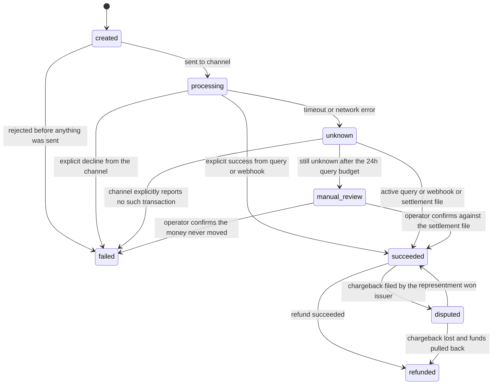

# 15 · 设计支付系统（Design a Payment System）

> 题面写的是"钱不能丢、不能重复扣"，实际考的是：**在一个你无法回滚的外部世界里，怎么把"状态未知"收敛成确定结果。**
> 幂等键（idempotency key）+ 状态机（state machine）+ 对账（reconciliation）是三件套，缺一件这题就不成立。而胜负手只有一个 —— 你和三方渠道状态不一致时，靠什么收敛。

---

## 0. 45 分钟怎么分配这道题

| 时钟 | 你在做什么 | 这一段的得分点 |
|---|---|---|
| **0:00–2:00** | 复述题面，**先切一刀**："我理解要做的是接三方渠道的支付服务 + 内部账本（ledger），不是从零做一个卡组织。对吗？" | 面试官立刻知道你分得清 gateway / acquirer / ledger 三层 |
| **2:00–8:00** | 6–8 个澄清问题（§1）。白板左上角写：TPS / 渠道数 / 是否含退款与争议 / 保留期 / 币种 | 只要问出"退款和 chargeback 在不在范围内"，后面的账本设计就有了合法性 |
| **8:00–12:00** | 估算（§2）。**必须说出三句话**：这不是容量题；每天有 1 万–10 万笔状态未知；渠道手续费比基础设施贵 3 个数量级 | 第二句把讨论直接推向本题核心；第三句证明你知道这系统为谁存在 |
| **12:00–23:00** | 画主链路 ASCII（§3）+ 画状态机 + 写 `payments` / `idempotency_keys` / `ledger_entries` 三张表的骨架 | 状态机里出现 `unknown` 这个态，是这题最强的单一信号 |
| **23:00–27:00** | 主动提名深挖点："我想深挖 UNKNOWN 的收敛和账本模型，你想先看哪个？" 然后讲三重保障（§4.2） | 把选择权交出去；同时确保最难的点你先讲了 |
| **27:00–34:00** | 深挖账本（§4.3）：为什么不能用余额字段 + minor units + 每分钟配平断言 | 这一段把你和"只写过 CRUD"的人分开 |
| **34:00–40:00** | 深挖对账（§4.4）：差异分类矩阵 + 误差目标 + 老化告警 | 说出"关键指标是差异的**账龄**，不是当天差异数" |
| **40:00–44:00** | 收敛：v0/v1/v2 + 撞墙信号（§6）+ 一句"什么时候这套是错的"（§4.7） | 主动说"< 10 万笔/天 我不会自建这个"，比讲完所有细节更能证明判断力 |
| **44:00–45:00** | 反问 | — |

**面试官不主导时，深挖顺序永远是 UNKNOWN → 账本 → 对账。** 退款、多币种、风控放进"时间够就讲"的口袋 —— 它们都重要，但**都建立在前三个之上**，先讲会显得没有主次。

---

## 1. 需求澄清

| # | 你问 | 面试官通常会回 | 它改变什么 |
|---|---|---|---|
| 1 ★ | 我们是**支付网关/编排层**（接 Stripe / Adyen 这类渠道），还是**收单机构**（自己进卡组织），还是只做**内部账本**？ | "接三方渠道，自己做账本" | 决定"不可回滚的边界"画在哪。不问 → 你可能花 20 分钟设计一条根本不属于你的清算流程 |
| 2 ★ | 退款、部分退款、争议（chargeback）在范围内吗？ | "退款和部分退款要，chargeback 提一下即可" | 部分退款一出现，"余额字段加减"就彻底不成立。不问 → 你会做出一个只走 happy path 的转账 API |
| 3 | 支付方式：卡为主，还是含银行转账（ACH / SEPA）/ 钱包 / BNPL？ | "卡为主，加一个钱包渠道" | 卡是授权（authorization）+ 请款（capture）两段式；ACH 是 T+2 才知道退票 —— 终局时间差两个数量级 |
| 4 | 多渠道吗？要智能路由还是只要故障切换？ | "3 个渠道，先做故障切换" | 决定 Channel Router 的复杂度，以及对账要不要按渠道分别做 |
| 5 | 币种：单一结算币种，还是跨境多币种？ | "展示多币种，结算 USD / EUR 两种" | 决定账本要不要 FX 账户与汇率快照 |
| 6 | PCI 范围：卡号（PAN）会不会进我们的系统？ | "不会，用渠道的 tokenization / hosted fields" | 直接把合规范围从 PCI DSS Level 1 降到 SAQ-A 量级，省掉一整套隔离环境。PCI DSS v4.x 的 51 条 future-dated 要求自 [2025-03-31 起已强制](https://blog.pcisecuritystandards.org/now-is-the-time-for-organizations-to-adopt-the-future-dated-requirements-of-pci-dss-v4-x) |
| 7 | 规模与保留期？争议窗口多长？ | "1,000 万笔/天，合规保留 7 年" | 决定热冷分层与幂等表保留期 |
| 8 | 用户在支付页最多等多久？超时后产品**展示什么文案**？ | "10 秒；超时显示处理中" | **"处理中"这三个字必须由产品认可**，否则 UNKNOWN 态在产品上无处安放，工程师就会被逼着把它写成 failed |

**★ 是不问就会做错方向的两个。** 第 1 题决定系统边界，第 2 题决定数据模型，其余六题只决定参数。**本文假设**：电商平台自建支付服务，接 3 家收单渠道，自建复式记账账本，支持退款/部分退款/争议，展示多币种、结算 USD+EUR，1,000 万笔/天，均单价 $25，卡号不落地，合规保留 7 年。

---

## 2. 估算

```
① 吞吐  1,000 万笔/天 ÷ 86,400 = 116 TPS 均值 × 5（日内峰谷）≈ 600 TPS 常规峰值
       大促瞬时 20× = 2,300 TPS      ← 容量规划的基准是它，不是 600
② 写放大  每笔 ≈ 10 行持久化（幂等 1 + payment 1 + 状态事件 2 + 账本分录 6）
       600 TPS × 10 = 6,000 writes/s；大促 23,000 writes/s
       ⇒ 单主 Postgres（NVMe + 组提交）在 6,000 是舒适区，23,000 要提前扩容或削峰
       ⇒ 但**不要主动引入分库和分布式事务** —— 这题的难点从来不是吞吐
③ 在途并发（Little's law：在途 = TPS × 依赖延迟）
       渠道 p50 800 ms / p99 3 s → 600 × 1.2 s ≈ 720 在途
       渠道劣化到平均 10 s        → 600 × 10   = 6,000 在途
       ⇒ 每请求一线程（1 MB 栈）= 6 GB 栈 + 上下文切换灾难
       ⇒ 必须异步/协程/虚拟线程，且每渠道设并发上限（bulkhead）max_inflight = 2,000
       ⇒ 每渠道 200–500 条 keep-alive 长连接；TLS 握手 ~100 ms，不复用 = 全局 +100 ms
④ 状态未知量  渠道超时率 0.1%–1% → 每天 1 万–10 万笔进 UNKNOWN = 0.1–1.2 笔/秒持续流入
       ⇒ 主动查询 Poller 本身就是一条 ~1 QPS 的常态负载，不是异常处理
⑤ 存储（7 年）  payments 1 KB/笔 → 10 GB/天 → 7 年 25 TB
       + ledger_entries 6×150 B（9 GB/天）+ 状态事件 4×200 B（8 GB/天）+ 幂等 200 B（2 GB/天）
       ≈ 29 GB/天 ≈ 74 TB / 7 年原始；热库只留 90 天 = 2.6 TB（单机 NVMe 装得下）
       冷层 Parquet + zstd 约 5× → 15 TB → S3 约 $350/月（2026 年中量级，随时变动）
⑥ 带宽  600 TPS × 4 KB ≈ 2.4 MB/s ≈ 20 Mbps
⑦ 对账文件  每渠道 ~333 万行/天 × 300 B ≈ 1 GB；3 渠道 = 3 GB/天
```

**这些数字意味着什么** —— 面试里必须把解读说出来，光报数字不给分：

1. **⑥ 说明带宽完全不是约束**，⑤ 说明"7 年合规保留"每月只要几百美元。前者把讨论从"容量"拉回"正确性"，后者给出和 [`04-usage-based-billing.md`](04-usage-based-billing.md) 一样的结论：**没有任何理由做数据裁剪**，原始记录是你在争议里唯一的证据。
2. **④ 说明 UNKNOWN 不是边缘 case，是每天 1 万–10 万笔的常规业务流。** 对账不是"兜底"，是产线 —— 它需要工具、需要 SLA、需要人。
3. **成本结构决定这个系统为谁存在**：
   ```
   GMV        = 1,000 万 × $25 = $2.5 亿/天 = $912 亿/年（成功交易）
   渠道手续费 ≈ 2.5%            ≈ $23 亿/年
   基础设施   ≈ $80k–150k/月    ≈ $1.8M/年        ← 相差约 1,300×
   ⇒ 费率降 1 bp（0.01%）  ≈ 省 $9.1M/年   ⇒ 基础设施成本砍到 0 只省 $1.8M/年
   ⇒ 授权成功率提高 1 pp   ≈ 多成交 $10.7 亿 GMV/年（按尝试额 $1,073 亿算）
   ```
   **这套系统的商业价值在"多渠道路由 + 提高授权成功率 + 压低争议率"，不在省服务器。**

---

## 3. 高层设计

先给最简单能工作的版本：一张 `payments` 表 + 一张幂等表 + 一个渠道 + 主动查询。下面这张图是它长大之后的样子 —— 每个新增的框都对应一个上面算出来的数字。

```
                                    ┌── 幂等表 idempotency_keys（唯一索引）
 商户 ─POST /payments──────────▶ Payment API ─┤   热 7d（Postgres）/ 冷 540d（归档）
   Idempotency-Key:                 │         └── 命中 → 直接返回**响应快照**，不重新执行
   merchant_id + merchant_order_id  │
                                    │ ① 幂等裁决（唯一索引，非 SELECT-then-INSERT）
                                    │ ② 风控 pre-auth（硬超时 100 ms，fail-open）
                                    │ ③ 同一事务：写 payments(created) + outbox
                                    ▼
                        Channel Router（按币种/成功率/费率选渠道，故障时切换）
                                    ▼
     ┌─── Channel Adapter：每渠道独立连接池 + 隔板(max_inflight 2000) + 熔断 ────┐
     │    超时 / 网络错误 ⇒ status = unknown，**绝不写 failed**                  │
     └────────────────────────────────┬─────────────────────────────────────┘
                                      ▼   ←── 这条线之外的一切，你都无法回滚
                            第三方渠道 / 卡组织 / 银行
                                      │
     ┌────────────────────────────────┼────────────────────────────────┐
     ▼ ① 主动查询                      ▼ ② 渠道回调 webhook              ▼ ③ T+1 清算文件
  Poller                            Webhook Ingest（独立部署/独立扩容）  Recon Job
  退避 5s/30s/2m/10m/1h              验签 → 落 Kafka → 立刻 200         merge join
  24h 封顶 → manual_review           **不在回调里做业务处理**           3 GB/天
     └───────────────┬──────────────────────┬──────────────────────────┬──┘
                     ▼                      ▼                          ▼
        State Machine Applier：转移白名单 + 条件更新 + 版本号 + 单调前进
                     │ 影响 1 行 = 推进；影响 0 行 = 这条消息过期，丢弃并计数
                     ▼
        Ledger：append-only 复式分录，SUM(debit) = SUM(credit)，每分钟断言
                     ├──▶ 余额快照（派生视图，永远可从分录重算）
                     └──▶ 差异池 / 人工工单           ← 必须有这条出口
```

**四条不可动摇的边界**：

1. **渠道调用那条线之外的一切不可回滚。** 你的所有机制都只是在"事后把自己的认知对齐到对方的事实"。
2. **回调入口与支付主链路物理隔离。** 回调只做三件事：验签、落 Kafka、返回 200。渠道的重发风暴不能把下单链路带下去。
3. **状态推进只有一个入口**（State Machine Applier）。查询、回调、对账三条路走同一段代码、同一套白名单。三段各写一遍状态更新的系统，一定会在某一段漏掉一个条件。
4. **账本 append-only。** 任何"更正"都是新增反向分录，不是 UPDATE。这是会计要求，不是技术偏好。

**数据模型骨架**（白板上写这三张表就够）：

```sql
payments(id PK, merchant_id, merchant_order_id, amount_minor BIGINT, currency CHAR(3),
         status, channel, channel_txn_id, refunded_minor BIGINT DEFAULT 0, version INT,
         created_at, updated_at, UNIQUE (merchant_id, merchant_order_id))  -- 第二道幂等
idempotency_keys(merchant_id, idem_key, request_fingerprint, state, response_snapshot,
                 payment_id, created_at, PRIMARY KEY (merchant_id, idem_key))
ledger_entries(entry_id PK, transaction_id, account_id, direction SMALLINT,  -- +1/-1
               amount_minor BIGINT CHECK (amount_minor > 0), currency CHAR(3),
               posted_at, effective_at, UNIQUE (transaction_id, account_id, direction, seq))
```

---

## 4. 深挖

### 4.1 · 幂等键的端到端设计

**问题**：客户端超时后重试。如果两次请求落到渠道两次，就是重复扣款 —— 这类系统里最贵的 bug（退款 + 客诉 + 在受监管市场是合规事件）。

| 方案 | 谁生成 key | 重试时 key 会变吗 | 重复扣款风险 | 代价 |
|---|---|---|---|---|
| A · 客户端随机 UUID | 客户端 | **会变**（每次重试新 UUID） | 高 —— 幂等形同虚设 | 0 |
| B · 客户端从业务标识派生 `merchant_id + merchant_order_id` | 客户端，但确定性 | 不变 | 低 | 要求商户有稳定订单号 |
| C · 服务端两段式：先 `POST /payment_intents` 拿 `intent_id`，再 `POST /payment_intents/{id}/confirm` | 服务端 | 不变（第二段用 `intent_id` 自身） | 低 | 多一次 RTT（~30 ms） |

**选 B + C 组合**：第一段创建 intent 用业务派生 key（挡住"创建也重复"），第二段用 `intent_id` 做幂等键。本质是 **把"生成幂等键"这件事从重试路径上移走** —— 一旦 `intent_id` 存在，后续所有重试天然共享同一个 key，不再依赖客户端的自觉。**什么条件下只用 B**：商户是服务端对服务端集成、且已有可靠订单号（多数电商如此）；若是移动端弱网直连、每次 RTT 都可能失败，两段式反而增加失败面。

**三个必须说出来的实现细节**：

- **裁决靠唯一索引，不靠 SELECT-then-INSERT**：`INSERT INTO idempotency_keys(...) ON CONFLICT DO NOTHING RETURNING *`，无返回即已存在。并发下 SELECT-then-INSERT 必错 —— 这是判断"写没写过并发代码"的单选题。
- **相同 key 不同 body ⇒ 返回 409，绝不返回旧结果**。body 规范化后取 hash 存 `request_fingerprint`；指纹不符说明调用方有 bug，返回旧结果等于帮他把 bug 藏到某天金额对不上为止。
- **并发同 key ⇒ 第二个请求看到 `state='in_progress'`，返回 409 + `Retry-After: 1`，不要等**。等待会让连接池被慢渠道吃干，把一个渠道的抖动放大成全站不可用。

| 保留期 | 存储量（1,000 万笔/天 × 200 B） | 能挡住 | 挡不住 |
|---|---|---|---|
| 24 h（[Stripe API v1 的窗口](https://docs.stripe.com/api/idempotent_requests)） | 2 GB | 客户端自动重试、网络抖动 | 隔天跑的人工补单脚本 |
| 30 d（Stripe API v2 的窗口） | 60 GB | 上面全部 + 常规运维补单 | 争议期内的重复退款 |
| **540 d（覆盖 Visa 争议窗口极端值）** | 1.08 TB | 全部 | — |

**保留期分两层：热层 7 天（14 GB，Postgres，点查 < 1 ms）+ 冷层 540 天（归档表 / 对象存储，只在人工排查与补单时查）。** 一层做法要么挡不住补单脚本，要么把 1 TB 的索引压在 OLTP 主库上。另外，**退款的幂等键不能是 `payment_id`** —— 那会让第二次部分退款被当成重复请求静默吞掉，必须用 `merchant_refund_id` 派生的 `refund_id`。这个 bug 在生产里极常见，症状是"客户投诉少退了钱"，排查时没人会怀疑幂等。

---

### 4.2 · 状态机与 UNKNOWN 的收敛（本题的胜负手）

**问题**：调用渠道超时了。这时对方可能处于三种状态之一 —— 请求没发出去（真失败）、对方处理完了但响应丢了（已扣款）、对方还在处理（未定）。**在客户端你无法区分这三种**，所以状态机里必须有一个显式的 `unknown` 态。

下面这张图要让你看见的不是"有哪些状态"，而是**有哪些边被刻意删掉了** —— 这件事上面的 ASCII 架构图和任何表格都表达不出来。



> 📖 **读图要点**：`processing` 有三条出边，其中通向 `failed` 的那条标着 "explicit decline"，通向 `unknown` 的那条标着 "timeout" —— **图里不存在一条从 timeout 指向 failed 的边**，这是整道题唯一必须记住的一件事。再看 `failed`：它没有任何出边。所以把超时误写成 failed 是**不可逆的** —— 之后再没有任何机制会回头去问渠道，那笔已经扣掉的钱会永远消失在你的视野之外。`unknown` 到 `failed` 的边确实存在，但它的标签是"渠道明确说这笔不存在"，不是"等久了"。

> **面试金句**
> 支付系统里最贵的一个词是 timeout。它的语义是**状态未知**，不是失败。我的状态机里 `failed` 是终态、没有出边，所以超时**永远不允许指向它** —— 一旦误写成 failed，就再没有任何机制会回头去问渠道，那笔真的扣掉的钱永远不会被发现。超时只能进 `unknown`，而 `unknown` 只能被三条路推进：主动查询、渠道回调、T+1 对账。**超时本身永远不推进任何状态。**
> The most expensive word in a payment system is "timeout." It means unknown, not failed. In my state machine `failed` is terminal — it has no outgoing edges — so a timeout is never allowed to point at it. The moment you write `failed` on a timeout, nothing will ever go back and ask the channel again, and money that actually moved just vanishes from your view. A timeout can only land in `unknown`, and `unknown` advances exactly three ways: an active status query, a channel webhook, or T+1 reconciliation. The timeout itself never advances anything.

**三重保障的分工与量化** —— 三条路必须**同时存在**：只做 ① 的系统在渠道查询接口劣化时集体卡死；只做 ② 的系统在自己回调入口挂 10 分钟时留下一批永久 `processing`；只做 ③ 的系统让用户等 30 小时。

| 手段 | 累计覆盖 | 收敛延迟 | 什么时候失效 |
|---|---|---|---|
| ① 主动查询 Poller（退避 5s / 30s / 2m / 10m / 1h，24 h 封顶） | ~90–95% | 秒级–分钟级 | 渠道查询接口也挂了；渠道自己也还没定 |
| ② 渠道回调 webhook（验签 + 事件去重 + 单调前进） | ~95–99% | 秒级 | 你的回调入口挂了；验签密钥轮换出错；回调乱序 |
| ③ T+1 清算文件对账 | **100%（终局）** | 最长约 30 h | 渠道文件延迟出（此时唯一的答案是等 + 告警） |

**推进状态的唯一正确写法** —— 条件更新，不是读改写：

```sql
UPDATE payments
   SET status = 'succeeded', channel_txn_id = :ctid, version = version + 1, updated_at = now()
 WHERE id = :id
   AND status IN ('processing', 'unknown')      -- 转移白名单：succeeded 不会被打回
   AND version = :expected_version;             -- 乐观锁
-- 影响 1 行 ⇒ 推进成功
-- 影响 0 行 ⇒ 这条消息是过期/乱序的。丢弃 + state_transition_rejected 计数 +1，
--            **不要重试**。重试一个逻辑上过期的消息只会浪费配额。
```

**回调先于同步响应到达是常态，不是异常**（渠道的 webhook 往往比 HTTP 响应先到，因为它们走不同的网络路径）：

```
时间 ─────────────────────────────────────────────────────────────▶
 t0  API 发出 HTTP 请求，本地 status = processing      t1  渠道扣款成功
 t2  渠道发出 webhook          ─┐ 两条独立的网络路径，先后顺序不可控
 t3  渠道开始返回 HTTP 200      ─┘
 t4  webhook 先到 → Applier: processing → succeeded         影响 1 行 ✅
 t5  HTTP 200 后到 → Applier: processing → succeeded        影响 0 行 ⇒ 丢弃 ✅
 —— 另一条分支：t4' API 侧超时（t3 的响应在路上丢了）——
     想写 unknown：UPDATE ... SET status='unknown' WHERE id=? AND status='processing'
     若 webhook 已在 t4 推到 succeeded ⇒ 影响 0 行 ⇒ 什么都不做 ✅
     若写成无条件 UPDATE ⇒ 把 succeeded 打回 unknown ⇒ Poller 重新去查、用户重新看到
        "处理中"、下游被重复触发 ⇒ 这一行代码就是一次生产事故 ← 全题最容易漏掉的一行
```

**面向用户的展示**：`unknown` 一律显示"处理中，最迟 X 分钟内出结果"，并配一个查询入口。**绝不显示"支付失败，请重试"** —— 那句话本身就是重复扣款的按钮。这也是 §1 第 8 问必须问的原因：产品不认这三个字，工程上就守不住。

---

### 4.3 · 账本：为什么不能用"余额字段加减"

**问题**：最直觉的写法是 `UPDATE accounts SET balance = balance - 10000 WHERE id = :a`。它错在哪？

| 模型 | 可审计 | 并发正确性 | 读余额 | **损坏可检测吗** |
|---|---|---|---|---|
| A · 余额字段 UPDATE | ❌ 丢失"为什么" | 行锁，单账户 ~500–1,000 TPS 上限 | O(1) | **❌ 完全不可检测** |
| B · append-only 分录 + 实时 SUM | ✅ 完整 | 纯 INSERT，无热点 | O(该账户分录数) —— 大账户会变慢 | ✅ |
| C · **append-only 分录 + 定期余额快照** | ✅ 完整 | 纯 INSERT，无热点 | O(自上次快照的增量) | ✅（快照 vs 重算比对） |

**选 C。** A 的致命之处不是性能，是第四列：**余额字段一旦被写坏，你没有任何办法发现它坏了** —— 没有冗余就没有校验。而且它答不出审计和争议里的第一个问题："2026-03-11 14:00 这个账户余额是多少？" **什么条件下 A 可以**：内部计数器、不涉及真实资金、错了能直接重置（比如"本月已用次数"）；一旦这个数字会出现在对外账单上，A 就出局。

**一笔卡支付的完整分录**（金额用最小货币单位，$100.00 = `10000` cents）：

```
用户支付 $100.00，渠道费 2.9% + $0.30 = $3.20，平台向商户抽佣 $5.00
t1 授权 authorization —— 资金未移动，只写一条 memo 记录，**不进账本**
                                                     debit(+)   credit(-)
t2 请款 capture   txn=T1  channel_receivable 应收·渠道在途   10000
                          merchant_payable   商户应付                    10000
t3 渠道扣费       txn=T2  fee_expense        手续费支出         320
                          channel_receivable                             320
t4 结算到账 T+2   txn=T3  bank_cash          银行存款          9680
                          channel_receivable                            9680
        ⇒ channel_receivable = 10000 − 320 − 9680 = 0
        ⇒ **这个"归零"就是对账的断言**：任何非零余额都是一笔在途或一笔差异
t5 结算给商户     txn=T4  merchant_payable                    10000
                          bank_cash                                     9500
                          platform_revenue   平台收入                     500
每一个 txn 内部，同币种的 SUM(direction × amount_minor) 必须等于 0。
```

**每分钟跑一次的全局断言** —— 这是复式记账最大的实际收益：

```sql
SELECT transaction_id, currency, SUM(direction * amount_minor) AS imbalance
  FROM ledger_entries
 WHERE posted_at > now() - interval '5 minutes'
 GROUP BY 1, 2
HAVING SUM(direction * amount_minor) <> 0;
-- 非空 = 此刻有代码正在写坏账本。处理方式是用 feature flag **停掉该 transaction_type 的写入**，
-- 不是记个日志继续跑。
```

> **面试金句**
> 余额不是数据，是**结论**。我不存余额、只存分录，余额是从分录派生出来的视图。理由不是优雅 —— 是余额字段被写坏之后你没有任何办法发现，因为没有冗余就没有校验。复式记账给了我一条每分钟都能跑的全局断言：任意一笔交易内、同一币种的借贷之和必须是零。**这一条断言抓到的 bug，比我写过的所有单元测试加起来都多。**
> A balance isn't data, it's a conclusion. I don't store balances — I store entries, and the balance is a view derived from them. That's not about elegance: a corrupted balance column is undetectable, because with no redundancy there's nothing to check it against. Double-entry gives me one global assertion I can run every minute — within any single transaction, debits and credits in the same currency must sum to zero. That assertion has caught more real bugs than every unit test I've ever written.

**金额的表示 —— 三条硬规则**：

- **绝不用浮点。** IEEE 754 二进制浮点表示不了 0.1；1,000 万笔累积下来是肉眼可见的钱。
- **存 minor units 整数 + ISO 4217 币种码，两者必须一起解释**：`USD/EUR exponent=2`（cents）、`JPY/KRW exponent=0`（¥1000 就是 1000，不是 100000）、`BHD/KWD/JOD exponent=3`、`CLF exponent=4`。⇒ 硬编码 `amount * 100` 是跨境时必炸的 bug。BIGINT 上限 9.2×10^18 minor units，够用。
- **中间计算（费率、分账、税）必然产生非整数**：用 `NUMERIC(30,10)` 或整数分子/分母定点算，**最后一步一次性舍入**，且余数必须有归宿 —— $100 三方均分 = 3333×3 = 9999，差 1 分；这 1 分给谁（最大方 / 平台 / 轮转）必须显式指定，否则分录配不平。

**多币种与汇率**：

- **账户永不跨币种。** 每个 `account_id` 绑定一个 currency，配平断言按 currency 分组。换汇是**两笔各自配平的交易**，中间过一个 FX 头寸账户（`Dr USD_acct / Cr fx_position_USD`，`Dr fx_position_EUR / Cr EUR_acct`）—— 跨币种配平是不存在的东西。
- **汇率必须快照写进交易**：`fx_rate_id` 指向不可变的 `fx_rates(rate_id, base, quote, rate NUMERIC(20,10), source, valid_from)`。**永不重算历史交易的汇率** —— 重算意味着昨天的报表今天会变。精度存 6 位在 USD/JPY、USD/IDR 这类大数值对上会在大额交易产生可见误差，存 10 位。
- 给用户展示的报价有 TTL（常见 30–120 s），过期必须重新报价而不是沿用。锁汇（rate lock）的成本就是你承担的汇率风险，必须用点差（spread）覆盖。

---

### 4.4 · 对账：日终三方比对

**问题**：你的记录、渠道的清算文件、你的账本，三份数据必然会漂移。不对账的支付系统一定会长期漂移，且发现时已无法追溯。

**实现要点**（三条，每条对应一个真实的坑）：

- **不要逐行查库。** 1,000 万行 × 3 渠道逐行点查 = 几小时。两边按渠道流水号排序做外排序 merge join，或都灌进列存做 full outer join —— 3 GB 在单机 DuckDB / Spark 上是分钟级。
- **时间口径必然错位**：渠道文件按渠道时区的自然日切，你的记录按 UTC 切 ⇒ 边界上几小时的交易必然对不上。解法是取**重叠窗口** `[D−1 18:00, D+1 06:00]`，用流水号而非日期做匹配键，日期只用于分区裁剪。
- **对账作业必须幂等可重跑**：自动补记的分录用 `transaction_id = uuid5(NAMESPACE, channel_txn_id + ':auto_repair')` 确定性派生 + 唯一索引兜底。同一天跑 10 次，结果必须完全相同。

**差异分类矩阵**（这是本节的核心，也是面试官最想听的一张表）：

| 类型 | 现象 | 常见原因 | 处理 | 目标占比 |
|---|---|---|---|---|
| **长款** channel 有、我方无 | 渠道记了一笔我们没有的支付 | 我方落库失败但渠道成功；测试流量污染生产 | 自动补记 payment + 分录 + 告警；金额超阈值转人工 | < 0.001% |
| **短款** 我方有、channel 无 | 我方 `succeeded`，渠道文件里没有 | 我方误把 UNKNOWN 判成成功；渠道文件延迟 | 等一个文件周期；仍无则**冲正（reversal）**并告警 | < 0.001% |
| **金额不符** | 双方都有，金额不同 | 币种/单位错、部分退款未同步、渠道扣费口径差异 | **一律人工，绝不自动改账** | < 0.0001% |
| **状态不符** | 我方 `processing`，渠道 `succeeded` | 回调丢失 + 主动查询也失败 | 自动推进状态机（单调前进，走同一段 Applier 代码） | < 0.01% |
| **时间归属差异** | 双方都有，落在不同自然日 | 时区、截单时间 | 用重叠窗口消化，**不计入差异** | — |

**误差目标与告警**：

```
笔数差异率   < 0.01%    → 1,000 万笔/天 = 1,000 笔/天进人工池 = 需要 2–3 人的运营团队
金额未平差额 < 0.001%   且 T+3 必须清零
关键指标是**未平差异的账龄（aging）**，不是当天差异数：
   alert: count(*) where status='open' and detected_at < now() - 3 days  > 0
```

**为什么盯账龄不盯当日条数**：当日 1,000 条差异是正常的（大部分 T+1 自动平掉）；而 T+3 还没平的哪怕只有 3 条，都意味着有一类差异是自动流程处理不了的。按 1,000 条/天算，积压三个月就是 9 万条无法追溯的差异 —— 这是这类系统最经典的死法，而它的早期信号只有账龄这一个。

**还有第二层对账：账本自对账。** §4.3 那条每分钟跑的配平 SQL 查的是内部一致性，三方对账查的是与外部世界的一致性。**两层都要，缺一层就有一整类 bug 永远不会被发现。**

---

### 4.5 · 退款与部分退款

**问题**：多笔部分退款并发时超退（退出去的钱超过收进来的）。

| 方案 | 机制 | 并发正确性 | 代价 |
|---|---|---|---|
| A · 读余额再退 | `SELECT refunded_minor` → 判断 → `UPDATE` | ❌ check-then-act，并发必超退 | — |
| B · **条件更新** | `UPDATE payments SET refunded_minor = refunded_minor + :x WHERE id = :id AND refunded_minor + :x <= amount_minor`；影响 0 行 = 拒绝 | ✅ 单语句原子，无需分布式锁 | 单行热点，但退款量 < 支付量的 5%，不构成问题 |
| C · 账本约束 | 退款也是分录，对可退额账户做条件写入 | ✅ 且天然可审计 | 实现复杂度高一档 |

**选 B 做裁决者 + 同时写 C 的分录做记录。** 一件事只能有一个裁决者，但记录可以有多份。B 的 `WHERE` 子句就是那个裁决者 —— 和票务题（[`07-classic-canon.md` 第 7 题](07-classic-canon.md)）的库存扣减是同一个模式：**正确性来自单条 SQL 的原子性，不来自锁。什么条件下改选 C**：当"可退额"不只由这一笔支付决定（商户余额不足、平台设了退款额度池），B 的单表条件就不够了，约束必须下沉到账本账户上。

**退款的分录是新增反向分录，不是冲掉原分录**：

```
部分退款 $30.00：   Dr merchant_payable 3000 / Cr channel_receivable 3000
                    （渠道会从下一批结算里扣回这笔）
原始的 T1/T2/T3 分录一个字都不改。append-only 不是风格偏好，是会计要求。
```

**退款有自己的状态机，并且同样需要 UNKNOWN**（`refund: created → processing → {succeeded | failed | unknown}`）—— 退款调用渠道也会超时。**很多人只给支付做了三重保障，退款直接 try/catch 掉：那是同一个洞，只是流量小 20 倍所以晚三个月才爆。**

**争议（chargeback）** 是渠道/发卡行单方面发起的状态转移，你只能被动接受：

- 时间窗：持卡人一般 **120 天**，特定情形下 Visa 可到 **540 天**（[Visa 争议时限](https://www.chargeflow.io/blog/visa-chargeback-dispute-rules-fees-time-limit)）。你的支付记录、幂等表、账本必须活过 540 天，否则争议来了你举证不了。
- 争议率是硬性商业约束：Visa VAMP 自 **2026-04-01** 起把 excessive 阈值降到 **150 bps**（(TC40 欺诈 + TC15 争议) ÷ 已结算 CNP 交易），超阈值每笔计费 **$8**（[VAMP 2026 阈值](https://www.corgilabs.ai/insights/vamp-2026-merchant-compliance)）。若你的比率是 160 bps：1,000 万笔/天 × 1.6% = 16 万笔 × $8 = **$128 万/天罚金** —— 这就是风控必须在链路里、且必须有异步层的量化理由。

---

### 4.6 · 风控放在链路的哪一段

**问题**：风控要准就需要多方数据和长时窗聚合（几百 ms 到几秒）；支付要快，用户在等。放同步链路会拖 p99 并成为可用性单点；放异步则钱已经出去了。

| 位置 | 延迟成本 | 拦得住 | 拦不住 | 风控挂了怎么办 |
|---|---|---|---|---|
| 同步 · 授权前 pre-auth | +50–200 ms（必须硬超时） | 盗卡、机器人、明显欺诈模式 | 需要长时窗聚合的团伙欺诈 | **必须 fail-open**，降级到本地规则集；否则风控挂 = 支付全停 |
| 同步 · 请款前 pre-capture | 0（授权已返回，不在用户等待路径） | 授权到请款之间新发现的问题 | 即时到账的支付方式没有这个窗口 | fail-open 安全得多 |
| 异步 · 事后标记 | 0 | 团伙、长时窗模式、跨商户关联 | 已经出去的钱 | 无影响 |

**三层都要，且职责不同**：同步层只跑确定性规则 + 轻量模型，硬超时 100 ms，超时即放行并打标 `risk_timeout`；中间态走 `manual_review`（状态机里有这个态），SLA 15 分钟，**不是同步阻塞**；异步层跑图算法与团伙识别，命中后**冻结商户提现**而不是撤销支付 —— 支付已经不可撤销，你能控制的只剩下游资金流。

**风控的输出必须是三态（allow / review / deny），不是二态。** 二态会逼你在"放过"和"误杀"之间做一个本来不必做的取舍。

> **面试金句**
> 同步风控的阈值不能靠感觉设，要先算误拒和欺诈的相对代价。我这组假设下：AOV $25、毛利率 20%（毛利 $5）、欺诈率 0.1%、一笔欺诈损失货值 $25 + 争议手续费 $15 = $40 ⇒ 期望欺诈成本 **$0.04/笔**。误拒率每上升 1 个百分点：即时毛利损失 1% × $5 = $0.05，加上被误拒用户约 1/3 不再回来、剩余生命周期毛利按 $40 算 ⇒ 1% × 1/3 × $40 = $0.133，合计 **$0.18/笔**，是欺诈成本的 **4–5 倍**。所以同步层必须偏松、硬超时、fail-open，抓坏人交给不在用户等待路径上的异步层。**这个比值是你和风控团队要一起算出来的第一个数字；算不出来就没资格设阈值。**
> You can't set the inline risk threshold by feel — you first price a false decline against the fraud it prevents. With my assumptions: $25 AOV, 20% margin so $5 of gross profit, 0.1% fraud rate, and a fraud loss of $25 in goods plus a $15 dispute fee, expected fraud cost is about 4 cents per transaction. Now push false declines up by one percentage point: that's 5 cents of immediate margin, plus roughly a third of those customers never coming back — at $40 of remaining lifetime margin that's another 13 cents. So about 18 cents per transaction, four to five times the fraud it saves. That's why the inline check has to be permissive, hard-timeout'd, and fail-open, with the real fraud hunting pushed to an async layer off the user's waiting path. That ratio is the first number you and the risk team compute together — if you can't produce it, you have no business setting a threshold.

---

### 4.7 · 什么时候这整套方案是错的

| 情况 | 该做什么 |
|---|---|
| 你是接 Stripe / Adyen 的普通电商，< 10 万笔/天 | **别自建状态机和账本。** 用渠道的 Payment Intents + webhook + 每日拉 Balance Transaction 做对账。自建的唯一收益是渠道议价权，而 10 万笔/天没有议价权 |
| 单渠道、单币种、不做退款 | 一张 `payments` 表 + 唯一索引 + 定时查询就够。复式记账在这里是纯粹的复杂度支出 |
| 内部虚拟币 / 积分，不涉及真实资金与监管 | 复式记账仍然值（可审计），但不需要三重保障和 T+1 清算文件流程 |
| **纯内部转账**（同一系统内两个余额账户之间） | 那是一个本地数据库事务，**没有 UNKNOWN**。把外部渠道的复杂度套到内部转账上是常见的过度设计 |
| 高频交易 / 撮合清算（单账户 > 10 万 TPS） | 本文的"单行条件更新"直接失效。那是另一个系统：内存撮合 + 确定性状态机 + WAL 复制（LMAX 式），账本在撮合之后异步生成 |
| **链上加密货币支付** | 终局性（finality）语义完全不同：确认数是概率终局，不是布尔值。UNKNOWN 会持续几十分钟，且可能因重组（reorg）**从 succeeded 退回** —— 需要一条本文明确禁止的回退边。这是"经典支付状态机"唯一站不住的场景 |

---

## 5. 失败模式

| 故障 | 影响 | 检测信号 | 应对 / 降级到什么 |
|---|---|---|---|
| 渠道 p99 从 3 s 劣化到 30 s | 在途并发从 720 涨到 6,000+，连接池/线程池打满，**一个渠道拖死整个支付服务** | `channel_inflight` 与 `channel_p99` 同时上涨；连接池等待队列长度 | 每渠道独立隔板（`max_inflight = 2000`）+ 熔断；熔断后由 Router 切备用渠道；无备用则对新请求快速失败并提示稍后重试，**不要排队** |
| 回调入口被打挂 / 验签服务不可用 | 大量支付卡在 `processing` / `unknown` | `webhook_5xx_rate`、`unknown_state_count` 上升 | 回调入口独立部署独立扩容；回调只做验签 + 落 Kafka + 200，业务处理全异步；渠道会重发，回调必须可被无限重放 |
| **重复扣款**（幂等失效） | 直接资金损失 + 客诉 + 受监管市场的合规事件 | 探测 SQL：同一 `merchant_order_id` 存在 > 1 条 `succeeded` | 幂等表唯一索引是最后一道；**每小时**跑探测 SQL，命中即自动发起退款并开工单。别等客户来告诉你 |
| 状态机回退（乱序回调把 `succeeded` 改回 `processing`） | 下游重复发货、重复入账 | `state_transition_rejected` 计数**为 0**（说明根本没有白名单在挡）；状态回退事件 | 转移白名单 + 条件更新 + 乐观锁版本号；被拒绝的转移必须计数并进指标，不能静默丢 |
| 对账差异积压 | 按 1,000 条/天积压三个月 = 9 万条无法追溯的差异 | **T+3 未平条数 > 0**（不是当日差异数） | 差异老化告警 + 强制清零 SLA + 有人值守的差异池 |
| 账本不平（代码 bug 写坏分录）/ `fx_rates` 被 UPDATE | 财务报表错误，可能数周后才发现；同一笔交易两次重算金额不同 | 每分钟的 `SUM(direction × amount_minor) <> 0` 断言；抽样重算金额不一致 | 断言失败即用 feature flag **停掉该 transaction_type 的写入**；`fx_rates` 在 DB 权限层只允许 INSERT |
| 支付主库连接耗尽 / 磁盘打满 | 全站支付不可用 | 连接数、WAL 堆积、复制延迟 | 支付库与其他业务库物理隔离；写路径准入限流；降级到**只读**：能查历史订单，不能发起新支付（比整体 5xx 好得多） |

---

## 6. 演进路线

```
v0 · < 10 万笔/天 —— 能上线的最小集
   单库 Postgres 三张表（payments / idempotency_keys / ledger_entries）；一个渠道；
   Poller + 回调；每日对账是一条 SQL。不做：分库、消息队列、独立风控、多币种。
   ▼ 触发 v1 的信号（可观测，不是"用户变多"）：渠道 p99 劣化时支付服务整体不可用（缺隔板）
     ｜每日人工处理的差异 > 20 条（缺自动补偿）｜回调洪峰导致下单链路 p99 上涨（缺物理隔离）

v1 · 10 万–500 万笔/天
   回调入口独立部署 + 落 Kafka 异步处理；每渠道独立连接池 + 熔断 + 隔板；对账从单条 SQL
   改成 merge join 作业；接入同步 pre-auth 风控（硬超时 100 ms，fail-open）。
   ▼ 触发 v2 的信号：payments 单表 > 5 亿行、夜间索引维护窗口装不下｜单库持续
     > 3,000 writes/s 或写 p99 > 20 ms｜出现"按成功率选渠道"的路由需求｜出现跨币种账户

v2 · 500 万–5,000 万笔/天  ← 本文
   payments 按 merchant_id 分片；**账本按 account_id 分片且禁止跨分片交易**（一笔 transaction
   的所有分录必须同分片 —— 这是分片这类系统时唯一重要的约束）；热冷分层（热库 90 天）；
   多渠道智能路由；异步风控层；对账升级为有 SLA 的运营流程（差异池 + 工单 + 老化告警）。
   ▼ 触发 v3 的信号：多法人实体 / 多国牌照、资金池须按实体隔离｜监管要求实时报送｜
     **单账户分录写入 > 1,000 TPS**（典型是平台收入账户）⇒ 分录分桶
     platform_revenue#0..#63，余额是 64 个桶之和

v3 · 独立的资金与清算系统
   接入实时清算网络（FedNow / RTP / SEPA Instant），ISO 20022 报文 —— SWIFT 跨境支付的
   MT/MX 共存期已于 [2025-11-22 结束](https://www.swift.com/standards/iso-20022/iso-20022-financial-institutions-focus-payments-instructions)，MT103/MT202 正式退役，
   新建系统直接按 ISO 20022 设计，不要再兼容 MT。此时"支付"与"账本"应拆成两个团队两个系统。
   ▼ 信号：审计师开始问"你怎么证明 2026-03-11 这个账户余额是对的" —— 答案必须是
     "从创世分录重放到那一刻"，而不是"我们的余额字段很可靠"
```

---

## 7. 常见错误答法

| # | mid-level 会怎么答 | 为什么掉分 | 正确的说法 |
|---|---|---|---|
| 1 | "调渠道超时了就置成 failed，让用户重试" | 直接制造重复扣款。而且 `failed` 是终态，之后没有任何机制会回头查渠道 —— **错误不可逆**。这是本题唯一的"立即出局"答案 | "超时的语义是状态未知。它只能进 `unknown`，由主动查询、渠道回调、T+1 对账三条路之一推进。超时本身永远不推进状态" |
| 2 | "用 2PC / 分布式事务保证一致性" | 三方渠道不可能加入你的事务协调器。而且 2PC 的协调者故障窗口在支付场景意味着资金悬空。说这句话等于宣布没做过真实支付 | "只能 Saga + 补偿（compensating transaction），而且**补偿本身也会失败** —— 所以对账是最终的收敛手段，不是可选的兜底" |
| 3 | "账户存一个 balance 字段，收付款时加减" | 不可审计、单行 500–1,000 TPS 封顶，最致命的是**损坏不可检测**：没有冗余就没有校验。答不出"某年某月某日余额是多少" | "余额是结论不是数据。append-only 复式分录 + 派生余额快照 + 每分钟的同交易同币种借贷配平断言" |
| 4 | "金额用 decimal 存就行了" / "幂等键用 UUID" | 前者漏掉了 exponent 随币种变（JPY 会差 100 倍）和舍入余数的归宿；后者在重试时会生成新 key，幂等形同虚设。**退款复用 `payment_id` 做幂等键**更隐蔽：第二次部分退款被静默吞掉 | "minor units 整数 + ISO 4217 币种码一起解释，中间计算用定点数最后一次舍入，余数有指定归宿。幂等键从业务标识确定性派生，退款用独立的 `refund_id`" |

---

## 8. 相关章节

- **单行条件更新的 TPS 上限、索引与表膨胀、冷热分层** → [`01-building-blocks/01-storage-engines.md`](../01-building-blocks/01-storage-engines.md)
- **exactly-once 的真相、Outbox 模式、DLQ 与重放** → [`01-building-blocks/03-messaging-and-streams.md §3–§5`](../01-building-blocks/03-messaging-and-streams.md)
- **幂等与去重的协调视角、租约、时间不可信** → [`01-building-blocks/05-consensus-and-coordination.md §5–§6`](../01-building-blocks/05-consensus-and-coordination.md)
- **Saga、补偿事务、Outbox + 编排器的可抄实现** → [`02-architecture-patterns/02-event-driven-and-cqrs.md §2–§3`](../02-architecture-patterns/02-event-driven-and-cqrs.md)
- **超时预算、重试放大、熔断器、隔板、优雅降级** → [`05-reliability/03-resilience-patterns.md §2–§7`](../05-reliability/03-resilience-patterns.md)｜**告警设计** → [`05-reliability/02-observability.md §8`](../05-reliability/02-observability.md)
- **排队论：在途并发 = TPS × 依赖延迟** → [`00-foundations/02-capacity-estimation.md §3`](../00-foundations/02-capacity-estimation.md)｜**取舍四句话、ADR、复杂度预算** → [`00-foundations/03-tradeoff-framework.md §6–§8`](../00-foundations/03-tradeoff-framework.md)
- **同一套幂等/对账机制在计费侧的形态、退款与信用额度** → [`03-saas-platform/02-billing-and-metering.md §4、§9–§10`](../03-saas-platform/02-billing-and-metering.md)、[`04-usage-based-billing.md`](04-usage-based-billing.md)
- **idempotency / reconciliation / compensating transaction 的英文用法与发音** → [`07-interview/04-glossary.md`](../07-interview/04-glossary.md)

---

## 面试官会追问

1. 调渠道超时了，你把状态置成什么？为什么不是 failed？**如果置成了 failed，这个错误会被什么机制发现？**
2. 幂等键谁生成？客户端传 UUID 错在哪？相同 key 不同 body 你返回什么？并发同 key 的第二个请求 —— 等它还是拒它？
3. 幂等记录保留多久？24 小时够吗？为什么争议窗口会影响这个数字？
4. 为什么不能用一个 balance 字段？如果我坚持要用，你能给我一个检测它是否已经被写坏的办法吗？
5. 用户支付 $100、渠道扣费 $3.20、平台抽佣 $5，把分录写给我。`channel_receivable` 最后应该是多少，为什么这个数字重要？
6. 渠道的 webhook 比你的 HTTP 响应先到达。你的代码会发生什么？把那条 UPDATE 写出来。
7. 日终对账你怎么做？1,000 万行怎么比？差异分几类，哪一类绝对不能自动处理？告警指标是"当天差异条数 > N" 还是别的？
8. 部分退款并发怎么保证不超退？退款的幂等键是什么，为什么不能是 `payment_id`？风控该 fail-open 还是 fail-closed，依据是哪个数字？

---

## 自测

遮住上文，你能不能说出：

1. **为什么 `failed` 必须是没有出边的终态，以及这一条如何决定了超时不能写 failed？**（§4.2）
2. **`unknown` 只能被哪三条路径推进，各自的覆盖率、收敛延迟和失效条件？**（§4.2 那张三重保障表）
3. **余额字段模型最致命的缺陷是哪一条，以及复式记账给了你哪一条可以每分钟跑的断言？**（§4.3）
4. **对账的告警指标为什么是差异的账龄而不是当天差异数？五类差异里哪一类绝对不能自动处理？**（§4.4）
5. **同步风控该 fail-open 还是 fail-closed，支撑这个判断的那个比值怎么算出来的？**（§4.6，$0.18 vs $0.04）

---

**下一篇** → [16-search-autocomplete.md](16-search-autocomplete.md)：一个必须每小时变一次的东西，怎么做成永远不变的东西来服务。
