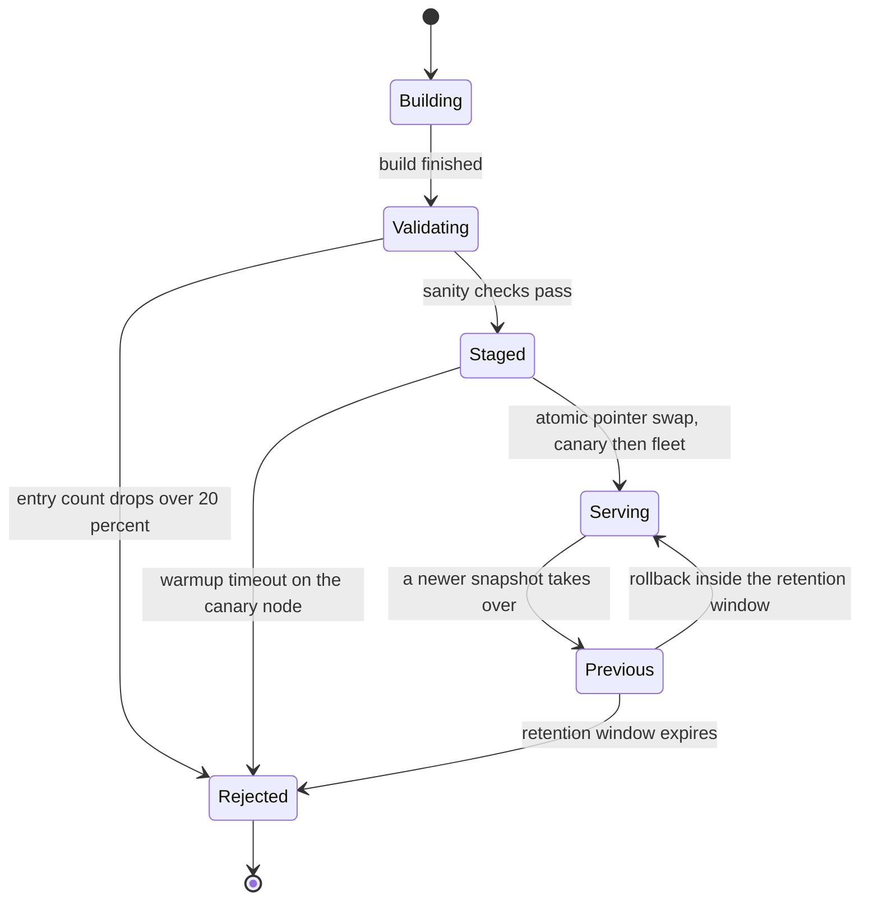

# 16 · 设计搜索自动补全（Search Autocomplete / Typeahead）

> 这题不考 Trie —— Trie 是本科作业。真正考的是：**一个必须每小时变一次的东西，怎么做成一个永远不变的东西来服务。**
> 所有难点（热度更新、个性化、模糊匹配、敏感词）本质都是同一个问题：它们都想让那个"不变的东西"变。

---

## 读这道题之前

**如果你是直接翻到这道题的**：这题几乎不考数据结构，考的是缓存与发布。第 1 题答不出，你会把 30 分钟花在优化 Trie 上 —— 而 Trie 只占延迟预算的 0.05%。

**先确认你能回答这三个问题**

1. 边缘缓存的 cache key 是什么？key 里多加一个维度（比如"用户 ID"）会让命中率和回源流量各变成多少？
   答不出 → 先读 [`02-caching.md`](../01-building-blocks/02-caching.md) §1、§6
2. p50 / p99 分别是什么？"把一次纯内存查找从 50 µs 优化到 25 µs"对用户感知的 p99 有多大影响？
   答不出 → 先读 [00-concepts §3 p50 / p90 / p99](../00-foundations/00-concepts.md)
3. 一个进程内持有 2.3 GB 只读索引的服务，算有状态还是无状态？随便杀掉一台会永久丢东西吗？
   答不出 → 先读 [00-concepts §9 有状态 vs 无状态](../00-foundations/00-concepts.md)

**这道题会用到的构件**

| 构件 | 用在哪 | 详见 |
|---|---|---|
| 边缘缓存、cache key、TTL | §4.5 个性化把命中率从 80% 打到 0 的全部前提 | [`02-caching.md`](../01-building-blocks/02-caching.md) §6 |
| CDN / RTT 预算 / 边缘运行时的内存上限 | §2.4 延迟里 99% 是网络；§4.5 边缘只放热子集 | [`04-networking-and-edge.md`](../01-building-blocks/04-networking-and-edge.md) §6 |
| 流式窗口聚合、watermark、Count-Min Sketch | §4.3 查询日志 → 热度表 → 实时热点层 | [`03-messaging-and-streams.md`](../01-building-blocks/03-messaging-and-streams.md) §6 |
| 不可变段、mmap、原子切换与回滚 | §4.4 影子构建：这题区分度最高的一节 | [`01-storage-engines.md`](../01-building-blocks/01-storage-engines.md) §2、§5 |
| 分位数与尾延迟、灰度发布 | §2.4 延迟预算；§4.4 一台 → 10% → 全量 | [00-concepts §3](../00-foundations/00-concepts.md)、[`05-release-engineering.md`](../03-saas-platform/05-release-engineering.md) |

**这道题的一句话本质**

> **一个必须每小时变一次的东西，怎么做成一个永远不变的东西来服务。**
> 在线只读、离线重建、原子切换 —— 三件事拆开，索引就有了"回滚"这条边。读正文时盯住一个问题："这个功能想让在役索引变吗？如果想，把它挡在哪一层？"

---

## 0. 45 分钟怎么分配这道题

| 时间 | 做什么 | 这一段的得分点 |
|---|---|---|
| **0:00–0:04** | 澄清 6–8 问，**必须锁死两个分水岭**：建议来自固定词库还是查询日志、要不要个性化 | 主动说出"个性化会让全局预计算整体失效"。说出来这一句，你已经领先大多数候选人 |
| **0:04–0:08** | 估算：QPS、内存、**延迟预算分解**、成本 | 关键不是 1.4 万 QPS，是**延迟预算里 Trie 只占 0.05%**。这句话定整题基调 |
| **0:08–0:16** | 高层：先画最简可工作版本（单机内存 Trie + 每日重建），再画读写彻底分离的完整版 | 明确说"这是 v0，我知道它哪里会撞墙"。不要一上来画 12 个框 |
| **0:16–0:22** | 深挖 A：节点预存 Top-K + 内存账 | 必须算出 GB 数，并说清**哪些节点不存 top-k** |
| **0:22–0:28** | 深挖 B：索引更新方式（就地 → 影子构建 + 原子切换 + 回滚） | 这是全题区分度最高的一节。就地加锁的人到这里就止步了 |
| **0:28–0:34** | 深挖 C：个性化 vs 边缘缓存命中率，给可算的判据 | 给出"命中率 80% → 0、回源 5×"的数字，然后给判据 |
| **0:34–0:39** | 失败模式与降级：镜像坏了、日志断了、突发热点 | 至少说清"日志管道断了怎么在 5 分钟内发现" |
| **0:39–0:43** | 演进路线 + 撞墙信号（可观测指标，不是"用户变多"） | |
| **0:43–0:45** | 收敛：一句话复述三个关键决策及其代价 | |

**时间陷阱**：这题极容易在 0:08–0:16 把整整 8 分钟花在讲 Trie 的实现上。**Trie 讲 90 秒就够了**，剩下的时间全部留给"怎么更新它"。

---

## 1. 需求澄清

| # | 你问的 | 面试官通常的回答 | 它决定了什么 |
|---|---|---|---|
| 1 | ★ 建议来自**固定词库**（人工维护 / 商品目录）还是**实时查询日志**？ | "查询日志" | 后者需要一整条流式管道 + 热度衰减 + 敏感词过滤，是完全不同的系统 |
| 2 | ★ 要**个性化**吗（按用户历史 / 地域 / 分群）？ | "先不做，但要能演进" | 这一个需求让"全局预计算 + 边缘缓存"整体失效，是最大的架构分水岭 |
| 3 | 热度更新可接受的延迟：秒级 / 分钟级 / 小时级？ | "热点事件要分钟级，长尾小时级即可" | 直接推出"主镜像批量 + 实时热点层"的两层结构 |
| 4 | 补全的是**搜索 query** 还是**实体**（商品 / 用户 / 地点）？ | "query" | 实体补全的词库可能是 10 亿级，那时才真的需要分片 |
| 5 | 语言与地域范围？有中文 / 日文吗？ | "全球，中英为主" | CJK 让镜像体积 ×4，且"前缀"的定义要重写 |
| 6 | p99 目标？用户分布在几个大洲？ | "p99 < 100 ms，三大洲" | 决定镜像要不要多区域复制 —— 跨洲 RTT 单项就吃掉 150 ms |
| 7 | 要**拼写纠错**和**中间词匹配**吗？ | "拼写纠错要，中间匹配不要" | 中间匹配 = 放弃 Trie 改用 n-gram 倒排，成本完全不同 |
| 8 | 敏感词 / 合规按地区有差异吗？谁维护名单？ | "有差异，法务维护，要求 5 分钟内生效" | "5 分钟内生效"直接否定"只在构建期过滤"的方案 |

**不问就会做错方向的两个**：

- **问题 1（词库来源）**。固定词库 = 一个查询服务；查询日志 = 一个数据管道 + 一个查询服务，且管道是主体。答错这个，你 45 分钟讲的是另一道题。
- **问题 2（个性化）**。不问就默认没有，然后你把全部结论建在"全局镜像 + 边缘缓存"上；面试官第 30 分钟抛出"现在要按用户历史排序"，你的架构会当场塌一半。

**本文假设**：通用搜索引擎的 typeahead。1 亿次搜索/天，词库 1,000 万条 query（英文为主），热度来自查询日志，p99 < 100 ms，三大洲，暂不做用户级个性化但要留出口。

---

## 2. 估算

### 2.1 QPS：客户端防抖是全题最便宜的一次优化

```
1 亿次搜索/天，平均 query 12 个字符
  裸实现（每敲一键发一次请求）：12 请求/搜索 → 12 亿 typeahead 请求/天
  客户端防抖 debounce 150 ms + 本地 LRU（缓存本次会话已请求过的前缀）
    人的连续击键间隔 ~200 ms，防抖后平均合并到 3–4 次
  ⇒ 4 请求/搜索 → 4 亿 typeahead 请求/天

4 亿 ÷ 86,400 = 4,630 QPS 均值 × 3（日内峰谷比） ≈ 1.4 万 QPS 峰值
```

**这个数字意味着**：防抖那一行客户端代码砍掉了 **2/3 的全站请求**。见 §2.4 —— 它每月省下的钱比整个服务端集群还多。**它是这题 ROI 最高的一个决策，而且不在服务端。**

### 2.2 内存：镜像体积决定了要不要分片

```
词库 1,000 万条 query，平均 20 字符
节点数：朴素上界 1,000 万 × 20 = 2 亿（假设零共享，不可能）
        实际前 4 字符高度共享、5 字符之后几乎不共享 ⇒ 经验区间 词条数 × 2–4
        取 3,000 万节点 → 压成 radix tree（单子节点链压成一条边）再降 ~50%
        ⇒ 1,500 万节点
每节点：radix 结构（children 索引 + edge label 指针）  ≈ 60 B
        预存 top-10：10 × (suggestion_id 4 B + score 4 B) = 80 B
suggestion 字符串表：1,000 万 × 24 B                    = 240 MB
  1,500 万 × 140 B = 2.1 GB  +  0.24 GB  =  2.3 GB
  运行时对象/对齐开销 ×1.5                 ≈  3.5 GB   → 取 4 GB
  双缓冲（见 §4.4）必须 2×                 ≈  8 GB 常驻 → 16 GB 机器
```

**这个数字意味着**：4 GB **单机装得下**。⇒ **这题的正确答案是"不分片"。** 副本是为了可用性和 QPS，不是为了容量。谁一上来讲一致性哈希分 Trie，谁就答错了题（详见 §4.2）。

### 2.3 机器数、带宽、连接数：三个"不是问题"的数字

```
纯内存前缀查找 ≈ 50 µs/次（走 20 层 radix + 读一个 top-K 数组）
  单核理论 2 万 QPS，按生产口径打 4 折 ⇒ 5,000 QPS/核；8 核实例 = 4 万 QPS
  1.4 万 QPS 峰值 ⇒ 计算上 1 台就够
响应：10 条建议 × 40 B + JSON 开销 ≈ 800 B（gzip 后 ~400 B）
  带宽 = 1.4 万 × 800 B = 11 MB/s ≈ 90 Mbps      ← 一张网卡的零头
并发连接：一次搜索会话约 2 秒内发 4 个请求 = 2 请求/s/会话
  并发会话 = 14,000 ÷ 2 = 7,000                   ← 比聊天题少四个数量级
```

**这个数字意味着**：**计算、带宽、连接数在这题里全都不是约束。** 那 12 台服务节点（3 大洲 × 每洲 4 台，另加 1 台离线 Builder）是为**可用性、地理就近、滚动灰度**买的，不是为 QPS 买的。面试里明确说出这一句，比算出 QPS 本身更值钱。

### 2.4 延迟预算分解：Trie 只占 0.05%

```
p99 < 100 ms（服务端预算；客户端防抖的 150 ms 计入用户感知，不计入这里）
  客户端 → 边缘节点 RTT           20–40 ms   ← 支配项
  ├─ 边缘缓存命中                  +1 ms      ⇒ p99 ≈ 45 ms  ✅
  └─ 边缘未命中，回源到本洲 region +30–60 ms
       ├─ 区域 LB + 服务框架        +2 ms
       ├─ Trie 前缀查询             +0.05 ms  ← 算法部分，占预算 0.05%
       ├─ 实时热点层融合            +0.2 ms
       ├─ 个性化融合（若开启）      +1–3 ms（含一次用户画像 KV 读）
       └─ 敏感词过滤 + 序列化       +0.5 ms
                                  ⇒ p99 ≈ 95 ms  ⚠ 卡在预算边缘
  跨洲回源（镜像只放一个洲）        +150 ms    ⇒ p99 ≈ 200 ms  ❌
```

**这个数字意味着**：延迟的 **99% 是网络**。所以优化方向永远是"把不可变镜像放得离用户更近 + 提高边缘命中率"，**不是"把 Trie 写得更快"**。把 50 µs 优化到 25 µs，用户感知不到任何变化。

### 2.5 成本量级（2026 年中口径，随厂商与承诺量差异很大）

| 项 | 量级 | 备注 |
|---|---|---|
| 服务节点 12 × (8c / 16 GB) | ~$1,800/月 | 为可用性与地理分布买单 |
| 查询日志管道（Kafka + 流聚合常驻小集群） | ~$2,000/月 | 1 亿 query/天 × 200 B = 20 GB/天 |
| 构建集群（每小时全量重建 10 min） | ~$150/月 | 4 机时/天 |
| **边缘/CDN HTTP 请求费** | **~$9,000/月** | 120 亿请求/月 × $0.5–1.0 / 百万请求 |

**这个数字意味着**：**边缘请求费是全系统最大的一项开销，是计算成本的 5 倍。** 如果没有客户端防抖，请求量是 360 亿/月，这一项变成 ~$27,000/月 —— 防抖每月省下 **$18,000**，超过其余全部成本之和。这也解释了为什么"把结果缓存在客户端本地"比"再加一层服务端缓存"重要得多。

---

## 3. 高层设计

### 3.1 最简能工作的版本（v0，先说这个）

```
 查询日志 ──每日一次 batch──▶ 聚合 count + 截断到 top 1,000 万
                              ──▶ 构建带 top-10 的 Trie ──▶ 单个二进制镜像文件
                                                              │
 用户输入 "sys" ──▶ App（进程内 mmap 该镜像，只读）──▶ 走到 "sys" 节点 ──▶ 返回该节点的 top-10
                        ↑ mmap：把文件直接映射进进程地址空间，页由 OS 页缓存管理 ——
                          不需要反序列化，进程重启后索引还是热的
```
能上线、能扛 1.4 万 QPS、p99 < 5 ms（服务内）。它的问题只有一个：**热度延迟 24 小时**，突发事件完全跟不上。

### 3.2 完整版：读路径与写路径物理隔离

```
══════ 写路径（离线，与在线服务零共享）══════
 搜索提交事件 + 建议采纳事件 ─▶ Kafka ─▶ 流聚合（5 min 滚动窗口，watermark 2 min）
   （绝不统计 typeahead 前缀本身）           │
                                            ├─▶ CMS + heavy hitters ─▶ 实时热点层
                                            ▼        （最近 30 min top-1,000，< 1 MB，每 30 s 重建）
                          热度表（时间衰减 λ ≈ 0.97/天）
                                            ▼
              过滤：低频尾巴 / 敏感词 / 拼写噪声 / 已下架实体
                                            ▼
              Builder（1 台，10 min）：radix Trie + 节点 top-K
                                            ▼
              自检 → 不可变镜像文件 → 对象存储 → 分发到 12 个节点
                                            ▼
              滚动切换：1 台 → 观察 5 min → 10% → 全量（§4.4）

══════ 读路径（在线，纯内存，零 IO，零跨服务依赖）══════
 客户端（防抖 150 ms + 本地 LRU）─▶ GET /ac?q=sys&lang=en&country=US
     ▼
 边缘 CDN / Worker ── cache key = (归一化前缀, lang, country, blocklist_version)，TTL 60 s
     │  命中 ~80% → 1 ms 返回 ｜ 未命中 ↓
     ▼
 本洲 Typeahead 服务（无状态，进程内不可变 Trie 副本）
     ① 归一化前缀（NFKC + 小写 + 折叠空白）—— 与构建期同一份代码
        NFKC：Unicode 的"兼容分解 + 正规组合"，把全角/半角、异体写法折叠成同一种形式
     ② 走 radix 到 "sys" 节点，直接读预存 top-K（不遍历子树）
     ③ 与实时热点层融合（去重，按分数取大）
     ④ 返回期敏感词黑名单过滤（Aho-Corasick：多模式串匹配自动机，一次扫描同时匹配上万个词，
        与词数无关；秒级生效）
     ⑤ 若精确候选 < 3 条 → 触发拼写纠错兜底（§4.6）
```

> **图里的三个词**：**watermark（水位线）** = 一条"这个时刻之前的数据应该都到齐了"的推进标记，流聚合用它决定窗口何时收口、迟到多久的数据还收（[`03-messaging-and-streams.md`](../01-building-blocks/03-messaging-and-streams.md) §6）｜**CMS（Count-Min Sketch）** = 用固定几 MB 内存估计海量 key 频次的概率结构，只会高估不会低估｜**heavy hitters** = 频次最高的那少数几个 key（§4.3 讲怎么把两者组合成实时热点层）。

**四条不可动摇的边界**：

1. **在线服务只读不写。** Trie 是不可变镜像，服务实例可以随时被杀、被重启、被回滚，语义不变。
2. **热度只来自"提交的 query"和"采纳的建议"，不来自 typeahead 请求本身。** 否则"s"、"se"、"sea" 这些残缺前缀会被统计成热词，索引在三天内被自己污染。
3. **构建只做一次，分发 N 次。** 12 个节点各自构建 = 12 倍成本 + 12 份可能不一致的索引。构建产物是一个文件，文件有版本号和校验和。
4. **敏感词过滤在构建期和返回期各做一遍。** 构建期漏的靠返回期兜底；返回期名单必须能在秒级推到所有节点和边缘。

---

## 4. 深挖

### 4.1 节点预存 Top-K：内存怎么算，以及哪些节点不该存

**问题**：查询 `"a"` 时子树里有 300 万个词条，现场遍历再排序是秒级 —— 完全不可用。

| 方案 | Top-K 存储 | 查询延迟 | 构建代价 |
|---|---|---|---|
| A. 不存，查询时遍历子树排序 | 0 | 短前缀 **秒级**（子树 300 万节点） | 0 |
| B. **每个节点都存 top-10** | 1,500 万 × 80 B = **1.2 GB** | O(前缀长度) ≈ 50 µs，恒定 | 自底向上一次归并，~10 min |
| C. **只在"子树词条数 ≥ 20"的节点存**，其余现场遍历 | 约 300 万节点 → **240 MB** | 命中存储 50 µs；未命中则遍历 ≤ 20 个叶子 ≈ +5 µs | 同 B |

**选 C**。理由是分布：深前缀（≥ 8 字符）数量占 80% 但每个子树都很小，现场遍历 20 个叶子的成本可以忽略；它们的 top-k 数组是纯粹的浪费。**什么条件下改选 B**：如果 top-k 不是"按 score 取前 10"而是要跑一个打分模型（时效性、地域权重、实体消歧），现场遍历就不再是 5 µs 而是几百微秒 —— 那时全存是对的，用内存换掉在线计算。

**K 取多少**：返回 10 条，但节点存 **top-15**（每节点 120 B）。多存的 5 条是给返回期敏感词过滤和去重兜底的 —— 否则过滤掉 3 条后你只能返回 7 条，UI 会出现"越打字候选越少"的诡异体验。代入方案 C：300 万 × 120 B = **360 MB**，整个镜像从 4 GB 压到 **~2.3 GB**（降 40%），而 p99 完全不变。这 50% 的 K 冗余是必要开销，不是浪费。

### 4.2 分片：按前缀分片一定热点不均，正确答案是先别分

**问题**：如果镜像装不下单机（比如实体补全，词库 10 亿条，镜像 100 GB+），怎么切？

| 方案 | 每节点内存 | 负载均衡 | 查询扇出 | 结论 |
|---|---|---|---|---|
| A. **全量复制**（每节点一份完整 Trie） | 完整镜像 | 完美（无状态轮询） | 1 | **镜像 < 单机内存时的唯一正确答案** |
| B. 按前缀首 1–2 字符分片 | 镜像 / N | **差**：英文 `s` 开头约占 10–12%，`x`/`z` < 0.5%，**倾斜 20–30×**；且热前缀的 QPS 占比远高于其词条数占比，倾斜在流量维度还要再放大 | 1（前缀直接定分片） | 只在被迫时用，且边界要按累计流量等分，不是按字母等分 |
| C. 按词条 hash 分片 + 广播查询 | 镜像 / N | 好 | **N**（p99 = 最慢分片） | 几乎不选：前缀查询天然不能按词条 hash 路由 |

**B 的救命补丁 —— 把两类前缀分开处理**：

```
短前缀：1–3 字符，英文小写共 26 + 676 + 17,576 ≈ 1.8 万个
        吃掉 60–70% 的 typeahead 请求（防抖后首次请求通常发生在第 3 个字符）
        top-15 全部展开 = 1.8 万 × 600 B ≈ 11 MB    ← 复制到每个分片，甚至直接推到边缘
长前缀：≥ 4 字符，数量以亿计，但每个都极冷
        按前缀分片，自然分散，怎么切都不会热
```

> **面试金句**
> "按前缀分片是个陷阱：短前缀数量少但吃掉 60–70% 的流量，长前缀数量海量但每个都冷。所以正确的做法不是找一条更好的分片边界，而是**把这两类东西分开处理** —— 1–3 字符的前缀一共才 1.8 万个、11 MB，全量复制到每个分片，甚至直接推到边缘；剩下的长前缀天然分散，随便怎么分都不会热。"
> "Sharding by prefix is a trap. Short prefixes are few but soak up sixty to seventy percent of the traffic; long prefixes are astronomically many but each one is cold. So the fix isn't a smarter shard boundary — it's treating the two classes differently. There are only about eighteen thousand one-to-three-character prefixes, eleven megabytes in total, so you replicate those to every shard, or push them straight to the edge. What's left is long prefixes, and those spread out on their own no matter how you split them."

**撞墙信号**：镜像体积 > 单机可用内存的 40%（因为双缓冲要 2×，再留 20% 余量）。在此之前分片是纯粹的自伤。

### 4.3 热度采集与聚合：实时更新的真实代价是写放大

**问题**：查询日志怎么变成节点上的 top-k？多快能变？

| 方案 | 热度延迟 | 计算成本量级 | 写放大 | 判据 |
|---|---|---|---|---|
| 每日全量批处理 | 12–24 h | ~$5/天 | 无 | 词库稳定、无突发热点（企业内搜、商品目录） |
| 5 min 微批聚合 + 每小时全量重建 | 5–60 min | ~$60/天 | 无 | **默认选择** |
| 逐条实时更新在役 Trie | < 1 s | 中 | **20×**（见下）+ 锁竞争 | **不选**，见 §4.4 |
| **主镜像每小时 + 实时热点层每 30 s** | 突发词 30 s，长尾 1 h | ~$70/天 | 只对 top-1,000 词 | **推荐** |

**"实时更新"的真实代价是写放大**：

```
1 亿 query/天，平均 20 字符 ⇒ 一条 query 的热度变化要更新它的 20 个前缀节点的 top-k
  1 亿 × 20 = 20 亿 次 top-k 更新/天 = 23,000 更新/s
  每次更新是"在一个 15 元素的有序小数组里做插入判定" —— 单次很便宜
  但它们全部落在同一棵在役的共享数据结构上 ⇒ 见 §4.4，这才是真正的成本
```
**这一步是很多人漏掉的：实时热度的成本不在"算热度"（1,160 QPS 的计数而已），在"把热度写进一个正在被 1.4 万 QPS 读的结构里"。**

**实时热点层怎么做**：只维护"最近 30 分钟内热度上升最快的 top-1,000 词"。用 Count-Min Sketch（概率计数结构：用固定的几 MB 内存估计海量 key 的频次，**只会高估不会低估**，代价是不能列举 key）做频次估计 + 一个小顶堆做 heavy hitters（频次最高的那少数几个 key），每 30 s 重建一棵 1,000 词的小 Trie（< 1 MB），旁挂在服务进程里。返回时与主镜像结果融合、去重、按 `max(score_main, score_hot × boost)` 排序。

**融合的坑（必须主动说）**：主镜像每小时重建一次，重建后它**已经包含**了这批热词；如果实时层还在给同一个词加权，就是**双重计数**，一个偶然热词会被永久钉在第一位。解法：实时层的分数是**相对基线的增量**，且每次主镜像切换时**重置实时层的基线**，而不是简单相加。

**时间衰减**：`score = Σ count_d × λ^(today - d)`，`λ ≈ 0.97/天`（半衰期约 23 天）。λ 是产品参数不是技术参数：λ 太大 = 三年前的热词赖着不走；λ 太小 = 排序天天抖，用户觉得系统不稳定。

### 4.4 索引更新：就地更新的锁竞争 → 影子构建 + 原子切换

**问题**：新的热度算好了，怎么让 12 个正在服务 1.4 万 QPS 的进程用上它？

| 方案 | 切换停顿 | 内存 | 可回滚？ | 实现复杂度 |
|---|---|---|---|---|
| 就地更新 + 全局读写锁 | 每批 **50–200 ms 全停**（p99 直接被打穿） | 1× | ❌ | 低 |
| 就地更新 + 每节点细粒度锁 | ~0 | **2×**（1,500 万把锁的开销和数据本身同量级） | ❌ | 高，且 top-k 跨节点更新有死锁风险 |
| 就地更新 + RCU / copy-on-write 路径<br>（RCU：写者复制出新版节点、改完再原子换指针，旧版等所有在读的人退出后才回收） | ~0 | 1.2–1.5×（节点复用导致长期碎片，运行数天后膨胀 30–50%） | ❌ | 高 |
| **影子构建 + 原子指针交换** | **~0（一条原子指令）** | **2× + 构建峰值** | ✅ **秒级** | 中 |
| 分段增量（Lucene 式多段 + 后台合并） | ~0 | 1.3× | 部分 | 高，且合并期有 p99 毛刺 |

**选影子构建**。它唯一的代价是 2× 内存 —— 2.3 GB 镜像变成 ~5 GB 常驻，16 GB 机器，每台每月多花几十美元。

```
 ┌───────────── Typeahead 进程内存布局 ─────────────┐
 │  activePtr ─────▶ [ 镜像 v103, 只读, 2.3 GB ]    │ ← 1.4 万 QPS 全部读这里
 │    读者取一次指针的本地拷贝，请求结束即释放       │   零锁、零原子操作、零内存屏障
 │  shadowPtr ─────▶ [ 镜像 v104, 构建 / 预热中 ]   │ ← 后台线程独占写
 └──────────────────────────────────────────────────┘
 切换：atomic.StorePointer(&activePtr, shadowPtr)   ← 纳秒级，读者零感知
 释放：旧镜像等 grace period 60 s（> 最长在途请求）后回收，期间它就是回滚目标
```

**更好的形态是把构建移出服务进程**：Builder 集群产出一个不可变文件，服务节点 `mmap` 它，切换变成 `rename` 一个 symlink + 通知进程重新 mmap。好处有三：构建只做一次而不是 12 次；页缓存由 OS 管理，进程重启后索引是热的；服务进程本身不再需要构建期的临时堆。

**上面那张表列出了五种更新方式，但它列不出真正的分界线：就地更新的方案里，"回滚"这条边根本不存在。** 索引一旦被写坏，你没有任何一条路径能回到上一个好状态 —— 只能重启进程 + 全量重建，期间服务降级。镜像方案则把索引变成一条有生命周期的、每个状态都可达且可退出的链：



> 📖 **读图要点**：看**没有画出来的边** —— `Serving` 没有任何一条边指回 `Building` 或 `Validating`。这就是"在役镜像不可修改"在状态图上的形状，而就地更新方案等价于给 `Serving` 加一条指向自己的自环，那个自环一旦写坏就没有出口。另外 `Previous --> Serving` 是全图唯一的回滚边，它的存在**要求上一版镜像仍然驻留在内存里** —— 这才是 §2.2 里那个 2× 内存的第二个理由，比"构建期需要临时空间"重要得多。

**自检（Validating）必须有的三条**，否则影子构建只是让你更快地把坏索引推到全量：

```
① 词条数与上一版偏差 > ±20%          → 拒绝（分词器改了 / 上游日志断了，这条能兜住 90% 的事故）
② 抽样 1,000 个高频前缀重放，与上一版结果的 Jaccard 相似度（两个集合的交集 ÷ 并集，
   1 = 完全相同、0 = 毫无重叠）< 0.7 → 拒绝
③ 抽样 200 个已知敏感词，任一出现在 top-15 → 拒绝并告警
```

**滚动切换**：**绝不能 12 台同时切**。全量同切意味着同一秒钟全集群内存翻倍 + 页缺失风暴 + p99 尖刺。节奏是 1 台 → 观察 5 分钟（p99、词条数、建议采纳率 CTR）→ 10% → 全量。

> **面试金句**
> "我绝不就地更新一棵正在服务的 Trie。写锁会让所有读者停在那里，细粒度锁把内存翻倍还送你死锁，而最糟的是就地更新**没有回滚这条边** —— 构建逻辑出一个 bug，索引就被污染了，唯一的修法是重启加全量重建。我用影子构建 + 一条原子指针交换：切换是纳秒级、零停顿，上一版镜像在内存里再留 60 秒，回滚就是把指针换回去。代价只有一个，内存要留 2 倍 —— 这是我在这道题里花得最值的一笔钱。"
> "I'd never mutate a trie that's serving traffic. A write lock stalls every reader, per-node locks double your memory and hand you deadlocks, and the worst part is that in-place updates have no rollback edge — one bug in the build logic poisons the index and your only fix is a restart plus a full rebuild. So I build a shadow copy off to the side and swap a single atomic pointer: nanoseconds, zero pause, and the previous snapshot stays resident for sixty seconds so a rollback is just swapping the pointer back. The only cost is two times the memory, and that's the best money I spend in this whole design."

### 4.5 个性化：它会让边缘缓存命中率崩塌，先算这笔账

**问题**：产品要"按用户历史排序"。这一个需求会同时打击三样东西：边缘命中率、回源 QPS、p99。

边缘缓存的 key 是 `(归一化前缀, lang, country, blocklist_version)`。**个性化维度直接进 cache key，key 基数就乘上个性化的档数。**

| 个性化粒度 | cache key 基数（相对） | 边缘命中率（TTL 60 s） | 回源 QPS | 服务端 p99 |
|---|---|---|---|---|
| 无（全局镜像） | 1× | ~80% | 2,800 | 45 ms |
| 国家级（20 档，已在 key 里） | 20× | ~75% | 3,500 | 45 ms |
| 分群级（100 个用户群） | 2,000× | **~25%** | 10,500 | 60 ms |
| **用户级（1 亿用户）** | ~1 亿× | **≈ 0%** | **14,000** | **95 ms** |

**读法**：从"无个性化"走到"用户级个性化"，边缘命中率 80% → 0，**回源 QPS 涨 5 倍**，用户侧 p99 从 45 ms 变成 95 ms（因为每一次请求都要真的跑一趟回源），集群从 12 台变成 40+ 台，边缘请求费还一分不少。

**判据（这是本节要交付的东西）**：

```
做服务端个性化的条件（三条同时成立才做）：
  ① A/B 实测建议采纳率（CTR）提升 > 5%  —— 低于这个数，收益淹没在噪声里
  ② 能接受 p99 从 45 ms 涨到 95 ms      —— 打字场景 100 ms 是感知阈值，几乎没余量
  ③ 愿意为 5× 回源付账（集群 ×3.5 + 全部延迟预算被吃光）
否则（绝大多数情况）个性化放客户端：本地存该用户最近 200 条搜索历史（几 KB），
  前缀匹配后置顶 2–3 条，与服务端全局结果去重合并。成本 0，边缘命中率不变，
  而"用户重复搜索自己搜过的词"本身就占 typeahead 采纳量的两三成 —— 大头已经吃到了。
```

**中间档才是真正的答案**：服务端只做到**地域 + 语言**级（几十份镜像，而不是几亿份），用户级的部分全部在客户端做。这样 cache key 基数不变、命中率不变，而个性化在用户感知上是存在的。

> **面试金句**
> "自动补全的延迟预算里，Trie 查询只占 50 微秒，剩下 99% 全是网络。所以这题的优化方向从来不是把数据结构写得更快，而是把不可变镜像放得离用户更近、并且让边缘缓存真的能命中。而个性化是唯一一个能把边缘命中率从 80% 直接打到 0 的功能 —— 所以它要么放在客户端，要么你得先把那 5 倍回源的账算清楚再上。"
> "In a typeahead latency budget the trie lookup is fifty microseconds and everything else is network. So the optimization is never 'make the data structure faster' — it's pushing an immutable snapshot closer to the user and making sure the edge cache actually hits. And personalization is the one feature that can take edge hit rate from eighty percent straight to zero, so either it lives on the client, or you price out the five-x origin traffic before you ship it."

**边缘上能不能直接跑索引？** 不能跑完整的。主流边缘运行时的单 isolate 内存上限是 **128 MB**（[Cloudflare Workers limits](https://developers.cloudflare.com/workers/platform/limits)，且明确说明**不能通过升级套餐提高**），2.3 GB 的镜像放不进去。但**能放子集**：top 5 万前缀的 top-15 展开 = 5 万 × 600 B ≈ **30 MB**，压缩后约 10 MB，完全塞得下，且覆盖 60–80% 的请求。**"边缘放一个热子集、回源放全量"是这题在 2026 年真正的新做法**，比十年前教科书里"CDN 只缓存响应"更进一步。

### 4.6 拼写纠错、多语言与敏感词：三件都必须在 Trie 之外做

**（a）模糊匹配 / 编辑距离**

| 方案 | 索引膨胀 | 单次延迟 | 判据 |
|---|---|---|---|
| Trie × Levenshtein automaton，d=1 | 0 | 0.1–0.5 ms（5 字符前缀约 130 条分支同时下探） | 内存紧张时可用 |
| 同上 d=2 | 0 | **数毫秒**（状态数按 `L² × 字母表²` 涨，候选质量同时崩塌） | **不做** |
| SymSpell 全量删除索引，d=1 | **条目数 ×21**（每词 L+1 个删除变体） | 0.02 ms | 2.1 亿条目 × ~20 B = **4.2 GB**，比主镜像本身还大；词库 < 50 万时才划算 |
| **SymSpell 仅 top-100 万热词 + 条件触发** | 2,100 万条目 = **+0.42 GB（+18%）** | 摊薄后 < 1 ms | **推荐** |
| 不做 | 0 | 0 | 词库是受控实体（SKU / 城市名 / 内部文档）时完全够用 |

**关键不是选哪个算法，是什么时候触发**：**只在精确前缀匹配返回 < 3 条时才跑模糊匹配**。触发率 5–10%，摊薄到全量请求上延迟增加 < 1 ms。**无条件在主路径上跑编辑距离，是把 5% 场景的成本摊给 100% 的请求。**

**（b）多语言与中文**

```
中文没有空格，"前缀"必须重新定义 —— 用户可能输入三种东西：
  汉字前缀 "北京大" ｜ 全拼 "beijingda" ｜ 简拼 "bjd"
⇒ 三套并联索引，指向同一个 suggestion id 池
内存代价：汉字 1× + 全拼 ~3×（一个汉字约 3 个拼音字母）+ 简拼 ~0.3× ≈ 4.3×
  ⇒ 同等词条量，中文镜像是英文的 4 倍。这个数字必须提前算进容量
简拼冲突极严重（"bjd" 可对应几百个词）⇒ 只能靠热度截断，top-k 在这里是刚需不是优化
```

**归一化是 CJK 场景最常见的线上 bug**：全角/半角、简繁、异体字必须做 Unicode NFKC + 简繁归一，而且**构建期和查询期必须调用完全同一份代码**（同一个库、同一个版本、同一份配置）。两边各写一遍必然漂移，症状是"某些词永远搜不出来"，且极难定位。日文更糟：平假名 / 片假名 / 汉字 / 罗马字四套输入路径，同一个词四种打法都要能命中。

**（c）敏感词过滤**

两道闸，缺一不可：

| 闸 | 位置 | 生效延迟 | 成本 | 作用 |
|---|---|---|---|---|
| 构建期 | Builder 里，从候选池剔除 | 一次重建（5–60 min） | 0（离线） | 主力，处理绝大多数 |
| **返回期** | 服务进程 + 边缘，Aho-Corasick 自动机 | **秒级**（配置推送） | 10 条 × 一次匹配 < 10 µs | **兜底 + 应急** |

**只做构建期过滤是错的**：一次公关事件里，"等下一次重建"的那 5–60 分钟就是新闻本身。返回期黑名单必须能秒级推送到所有节点和边缘 —— 这也是为什么 cache key 里要带 `blocklist_version`：名单一更新，版本号一变，全部旧缓存自动失效，不需要主动 purge。

**法域差异**：同一个词在不同国家的合规要求不同 ⇒ 黑名单按 country 分版本。这又是 cache key 里的一个维度（§4.5 表里的"国家级"那一行，其成本本来就得付）。

---

## 5. 失败模式

| 故障 | 影响 | 检测信号 | 应对 / 降级到什么 |
|---|---|---|---|
| **12 台同时切镜像** | 同一秒全集群内存翻倍 + 页缺失风暴，p99 从 45 ms 尖到 800 ms | 切换窗口内的 p99 尖峰、RSS 同步跳变 | 强制滚动：1 台 → 5 min 观察 → 10% → 全量；发布系统里做成硬约束而不是流程约定 |
| **构建产出坏镜像**（分词器升级、上游 schema 变更） | 词条数塌缩 / 结果全变，且**已经推到全量** | Validating 阶段：词条数偏差 > ±20%、抽样 Jaccard < 0.7 | 自检拒绝 → 不切换，继续服务 v103；告警"索引已陈旧 N 小时"（陈旧远好过错误） |
| **日志管道中断** | 镜像停止更新，**服务完全正常，没有任何用户可见症状** | **镜像 age 指标**（now − snapshot_built_at）> 3 h 告警 | 这是最阴险的一条：必须**单独监控镜像新鲜度**，不能只监控服务健康 |
| **热度反馈回路**（展示→点击→排更前→展示更多） | 一个偶然热词被永久钉在第一位，长尾永无出头之日 | 头部建议的 CTR 缓慢下降，top-10 的日间变动率趋近 0 | 时间衰减 λ + 位置偏差校正（按展示位置归一化 CTR）+ 少量探索性打散（ε ≈ 2%） |
| **个性化上线后边缘命中率崩塌** | 回源 QPS 从 2,800 → 14,000，集群被打满 | **边缘命中率**（这是这题最该盯的一个指标） | 灰度个性化时同步盯命中率；命中率跌破 50% 立即回退到地域级 |
| **突发热点主镜像跟不上** | 重大新闻发生后 1 小时内补全里没有它，用户感知"这搜索引擎很傻" | 实时层 top-1,000 里出现主镜像 top-10 万之外的词，且频次跳变 > 10× | 这正是实时热点层存在的理由；若热点层也挂，降级为"只有主镜像"，用户可感知但服务不中断 |
| **敏感词漏放** | 合规事故，且**修复时间取决于你的最慢一条链路** | 返回期黑名单命中计数突然非零（说明构建期漏了） | 返回期名单秒级推送 + `blocklist_version` 变更自动使全部边缘缓存失效 |
| **单节点 OOM**（构建与服务同进程 + 2× 内存 + 突发流量） | 该节点被 OOM Killer 杀掉，剩余节点承接流量后连锁 | RSS 接近 limit、GC 停顿变长 | 构建移出服务进程（离线 Builder + mmap）；内存 limit 按 2.5× 镜像设，不是 2× |

**全局降级链**（每一级都要能单独触发）：
```
个性化融合超时 3 ms   → 丢掉个性化，返回全局结果
实时热点层不可用      → 只用主镜像（结果变陈旧，但完全可用）
本洲服务全挂          → 边缘返回上一次缓存（TTL 放宽到 10 min）
边缘也没有            → 返回空建议 + 200 OK   ← 绝不返回 5xx
```
**最后一条是这题的原则：自动补全是一个纯增强功能。它挂掉时用户应该只是"没有建议"，而不是"搜索框报错"。返回 5xx 会让前端弹错误提示，把一个无关紧要的降级变成一次可见故障。**

---

## 6. 演进路线

```
v0 ── 能上线 ───────────────────────────────────────────────────────
     固定词库或每日批量聚合 → 单机内存 Trie（每节点 top-10）→ 无边缘缓存
     一台机器 + 一个每日 cron，两天能写完。
     ▼ 触发 v1（任一）：新词进补全需要 > 12 h（产品提工单）｜重建期 p99 尖峰
       > 200 ms（就地更新或停服重建的症状）｜跨洲用户 p99 > 150 ms
v1 ── 不可变镜像 + 多区域 ────────────────────────────────────────────
     离线 Builder 产出不可变镜像文件 → 3 大洲 × 4 台 → mmap + 原子切换，每小时重建
     加边缘响应缓存（TTL 60 s，key 含 lang / country / blocklist_version）
     ▼ 触发 v2（任一）：重大事件后 1 h 内补全里没有该词且每周 > 1 次｜边缘命中率
       < 60%（先修 key 设计和 TTL，别急着加机器）｜精确候选 < 3 条的请求占比 > 8%
v2 ── 两层热度 + 兜底纠错 ─────────────────────────────────────────── ← 本文
     主镜像每小时 + 实时热点层每 30 s（CMS + heavy hitters）
     top-100 万热词的 SymSpell 删除索引（条件触发）；边缘放 top 5 万前缀的展开子集
     ▼ 触发 v3（任一）：A/B 实测个性化 CTR +5% 以上且业务愿付 5× 回源的账｜镜像
       > 单机可用内存的 40%（实体补全常见）｜中文/日文流量 > 30%（镜像 ×4.3，重算）
v3 ── 个性化与语义补全 ──────────────────────────────────────────────
     服务端只到地域+语言级；用户级个性化留在客户端
     语义/向量补全（"便宜的笔记本" → "低价笔记本电脑"）作为独立召回源与 Trie 融合
     信号：日志里"输入 A 却最终提交了语义等价的 B"的比例 > 10%
```

**注意每一级的触发条件都是一个能画在监控面板上的数字。** "用户变多了"不是触发条件 —— §2.3 已经证明这题的机器数根本不由 QPS 决定。

---

## 7. 常见错误答法

### 7.0 先说：什么时候这整套方案是错的

| 情况 | 为什么这套方案是错的 | 该做什么 |
|---|---|---|
| 词库 < 10 万条，QPS < 500（企业内搜、后台管理系统） | 一整条流式管道 + 影子构建 + 边缘缓存的运维成本，远超它解决的问题 | 内存里一个 `sorted list` + 二分查前缀，或 Redis `ZRANGEBYLEX`。**一天写完，够用五年** |
| 建议来自**受控实体目录**（城市名、SKU、员工名录），没有热度概念 | 整条热度管道（Kafka、窗口聚合、时间衰减、反馈回路校正）全部是纯粹的浪费 | 每次目录变更触发一次重建即可。**保留影子构建 + 原子切换，丢掉热度管道** |
| 需要**中间词匹配**（输入 "goblet" 要匹配 "Harry Potter and the Goblet of Fire"） | Trie 是前缀结构，物理上做不到中间匹配。[Lucene / ES 的 completion suggester 也只支持前缀](https://www.elastic.co/blog/you-complete-me) | 改用 edge n-gram 倒排或 n-gram 索引，接受 5–20× 的索引膨胀和更高的 p99。**这是换系统，不是加功能** |
| 补全结果需要**实时反映每个用户的私有数据**（我的文件、我的邮件） | 全局预计算的前提直接不成立 —— 没有任何"全局热度"可言 | 每用户一个小索引（本地或按用户分片），完全是另一道题，更接近"多租户搜索"。见 [`03-multi-tenant-vector-search.md`](03-multi-tenant-vector-search.md) |
| 单区域、单语言、内部工具 | 边缘缓存、多区域镜像、滚动灰度全都是负收益的复杂度 | v0 就是终点 |

### 7.1 四条会直接掉分的答法

| mid-level 会怎么答 | 为什么掉分 | 正确的说法 |
|---|---|---|
| "查到前缀节点后向下遍历子树，收集所有词再排序取 top-10" | 前缀 `"a"` 的子树有 300 万节点，p99 是**秒级**。这题的全部算法含量就在"节点预存 top-k"这一步，答不出来等于没答 | "每个（子树规模 ≥ 20 的）节点预存 top-15，查询是 O(前缀长度) 的 50 µs。多花 360 MB 内存换掉 4 个数量级的延迟" |
| "用 SQL `LIKE 'sys%'` / ES 的 `edge_ngram`" | `LIKE` 前缀能走索引，但 1,000 万行 + 排序 + 1.4 万 QPS 会打死 DB，而且**完全不解决热度排序**（你还是要在别处算 top-k）。`edge_ngram` 能跑，但索引膨胀 5–20× 且每次热度更新要重写文档 | "用内存 radix + 预存 top-k。ES 的 completion suggester 底层也是内存 FST（finite state transducer，有限状态转换器：把共同前缀**和共同后缀**都合并掉的只读前缀索引，比 Trie 还省内存），思路一致；自建的理由是我要控制 top-k 的打分和镜像的切换节奏" |
| "热度更新就实时写进 Trie" | 两个致命问题：一是写放大 20×（一条 query 要更新 20 个前缀节点）；二是**在一个被 1.4 万 QPS 读的共享结构上加写锁**，p99 立刻被打穿。而且就地更新之后**没有回滚** | "热度走完全独立的离线管道，影子构建 + 原子指针交换。5–60 分钟的陈旧是我主动买下的代价，换来在线服务完全只读、可秒级回滚" |
| "个性化就在 Trie 里按用户加权" | 每用户一棵 Trie = 1 亿份索引，成本上不可能；即使只做加权，也会让边缘 cache key 变成用户级，**命中率 80% → 0，回源 5×** | "个性化绝不进索引。服务端最多做到地域+语言级（几十份镜像），用户级的部分放客户端本地历史置顶 —— 成本 0，边缘命中率不变" |

---

## 8. 相关章节

| 这题用到的构件 | 本书章节 |
|---|---|
| 边缘缓存、cache key 设计、命中率与 TTL 抖动（§4.5 的全部前提） | [`01-building-blocks/02-caching.md`](../01-building-blocks/02-caching.md) |
| CDN / 边缘计算 / RTT 预算 / 边缘运行时的内存限制（§2.4、§4.5） | [`01-building-blocks/04-networking-and-edge.md`](../01-building-blocks/04-networking-and-edge.md) |
| 查询日志管道、窗口聚合、watermark、Count-Min Sketch（§4.3） | [`01-building-blocks/03-messaging-and-streams.md`](../01-building-blocks/03-messaging-and-streams.md) |
| 不可变段、mmap、段合并与压实（§4.4 的分段增量方案） | [`01-building-blocks/01-storage-engines.md`](../01-building-blocks/01-storage-engines.md) |
| 镜像版本分发、滚动切换与原子性（§4.4） | [`01-building-blocks/05-consensus-and-coordination.md`](../01-building-blocks/05-consensus-and-coordination.md) |
| QPS / 内存 / 延迟预算的估算方法（§2 全部） | [`00-foundations/02-capacity-estimation.md`](../00-foundations/02-capacity-estimation.md) ｜ [`05-reliability/01-slo-and-error-budget.md`](../05-reliability/01-slo-and-error-budget.md) |
| 超时、降级链、"绝不返回 5xx"（§5）；灰度发布与回滚（§4.4） | [`05-reliability/03-resilience-patterns.md`](../05-reliability/03-resilience-patterns.md) ｜ [`03-saas-platform/05-release-engineering.md`](../03-saas-platform/05-release-engineering.md) |
| 离线批 + 流式两条管道的编排（§3.2）；语义补全与混合检索（v3） | [`02-architecture-patterns/05-data-platform.md`](../02-architecture-patterns/05-data-platform.md) ｜ [`04-ai-agent-systems/02-context-engineering-and-rag.md`](../04-ai-agent-systems/02-context-engineering-and-rag.md) |
| 本题的压缩版（45 分钟速讲） | [`06-case-studies/07-classic-canon.md` 第 9 题](07-classic-canon.md) |

---

## 面试官会追问

1. 前缀 `"a"` 的子树有 300 万个词条，你怎么在 50 微秒内返回 top-10？内存代价多少，哪些节点你选择不付这个代价？
2. 1,000 万词条的 Trie 有多少节点？怎么算出来的？镜像多大？为什么这个数字直接决定了"要不要分片"？按前缀首字母分片时 `s` 和 `z` 的负载差多少倍，你怎么修？
3. 热度要做到秒级更新，你会直接改在役的 Trie 吗？写锁停顿多久？细粒度锁的内存代价是多少？就地更新之后怎么回滚？
4. 影子构建需要 2 倍内存，这笔钱换来了什么？除了"构建时要临时空间"，第二个必须留 2× 的理由是什么？
5. 现在要按用户历史个性化。边缘缓存命中率会变成多少？回源 QPS 涨几倍？p99 涨多少？什么条件下你才答应做这件事？
6. 你的日志管道断了 4 小时，服务健康检查全绿、p99 正常、错误率为零。你怎么发现这件事？
7. 中文补全的镜像比英文大几倍？为什么？"前缀"在中文里指什么？归一化最容易在哪里出 bug？
8. 拼写纠错你在什么时候触发？无条件跑编辑距离 2 会怎样？整个 typeahead 服务挂了，接口返回什么状态码，为什么不是 503？

---

## 自测

遮住上文，你能不能说出：

1. **延迟预算里 Trie 占多少？** 答不出"50 µs / 占 0.05%"，你就会把时间花在优化数据结构上 —— 而这题 99% 的延迟是网络。
2. **1,000 万词条的 Trie 有多少节点、镜像多大、能不能装进单机？** 答不出"~1,500 万节点 / 2.3–4 GB / 装得下 ⇒ 不分片"，你会在一个不存在的问题（分片）上浪费 6 分钟。
3. **为什么不能就地更新在役 Trie？三个理由。** 写锁停顿、细粒度锁的内存与死锁、**没有回滚这条边**。第三条是最重要也最少被说出口的。
4. **个性化让边缘命中率从多少掉到多少、回源涨几倍？做与不做的判据是什么？** 答不出"80% → 0、5×、CTR +5% 才做，否则放客户端"，说明你只会说"个性化很贵"而不会定价。
5. **热度实时更新的真实成本在哪里？** 不在"算热度"（1,160 QPS 的计数而已），在**写放大 20× 且全部落在一个被 1.4 万 QPS 读的共享结构上**。这一条是区分"读过书"和"写过系统"的分水岭。

---

**下一篇** → [17-object-storage.md](17-object-storage.md)
