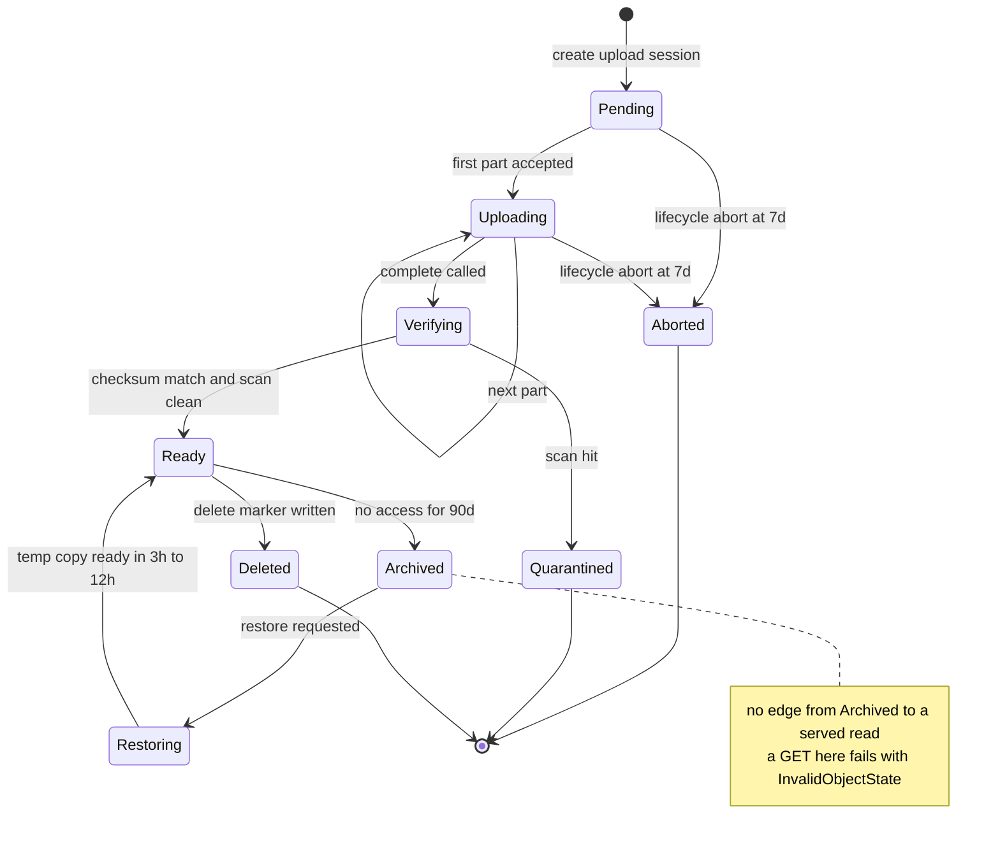

# 17 · 设计对象存储 / 文件上传（Design an Object Storage / File Upload Service）

> 题面是"存文件"，实际考的是**元数据（metadata）与数据（bytes）分离**这一个决策，以及它的全部推论。
> 而这个决策的第一条推论只有一句话：**文件字节永远不经过你的应用服务器。** 说不出这一句，后面讲得再细也没用。

---

## 读这道题之前

**如果你是直接翻到这道题的**：这题唯一的评分点是"字节和元数据是两个形状完全相反的系统"。第 1 题答不出，你会把它读成一道 QPS 题 —— 而它的 QPS 只有 510。

**先确认你能回答这三个问题**

1. 延迟、吞吐、并发三者什么关系？为什么一个只有 510 QPS 的服务，可能需要 65 台机器？
   答不出 → 先读 [00-concepts §2 延迟 / 吞吐 / 并发](../00-foundations/00-concepts.md#2-延迟吞吐并发--三个最常被混淆的词)、[§1 一个请求的旅程](../00-foundations/00-concepts.md#1-一个请求到底经历了什么)
2. 强一致与最终一致的区别？"元数据说文件 ready、字节还没落地"属于哪一种不一致，谁负责让它收敛？
   答不出 → 先读 [00-concepts §6 什么是一致性](../00-foundations/00-concepts.md#6-什么是一致性--一个词两种完全不同的意思)
3. 客户端**一定**会在传完最后一片后崩溃、关标签页、换设备。为什么"只有一条兜底路径"等于没有兜底？
   答不出 → 先读 [01-fundamentals §8 失败模型](../00-foundations/01-fundamentals.md#8-失败模型你要防的到底是什么)、[§5 幂等](../00-foundations/01-fundamentals.md#5-幂等idempotency分布式系统的第一公民)

**这道题会用到的构件**

| 构件 | 用在哪 | 详见 |
|---|---|---|
| 对象存储当"数据库"、条件写、首字节延迟 | §4.3 覆盖写与并发、§4.5 分层的物理下限 | [`01-storage-engines.md`](../01-building-blocks/01-storage-engines.md) §7 |
| 出网流量成本、CDN、Anycast | §2.3 出网是存储的 3.2 倍、§4.6 下载路径 | [`04-networking-and-edge.md`](../01-building-blocks/04-networking-and-edge.md) §6、§7 |
| 缓存键与失效、serve stale | §4.3 "覆盖写后 CDN 还是旧内容" | [`02-caching.md`](../01-building-blocks/02-caching.md) §6 |
| Little's Law、峰均比、成本建模 | §2.1 峰值字节速率、§2.4 并发连接不是瓶颈 | [00-concepts §2](../00-foundations/00-concepts.md#2-延迟吞吐并发--三个最常被混淆的词)、[`02-capacity-estimation.md`](../00-foundations/02-capacity-estimation.md) §1、§3、§6 |
| 事件驱动、双向对账 | §3 事件面（扫毒 / 缩略图 / 索引）、§4.3 三种不一致 | [`02-event-driven-and-cqrs.md`](../02-architecture-patterns/02-event-driven-and-cqrs.md) §1 |

**这道题的一句话本质**

> **元数据与字节是两个形状完全相反的系统：数据量差 10,000 倍、QPS 差 50 倍且方向相反、一致性要求一个强一致一个不可变。**
> 所以它们必须是两个存储，而第一条推论就是：文件字节永远不经过应用服务器。分片、断点续传、去重、分层、可撤销分享 —— 全是这一个决策的推论。

---

## 0. 45 分钟怎么分配这道题

| 时间 | 做什么 | 这一段的得分点 |
|---|---|---|
| **0:00–0:02** | 复述题面并切一刀："我做上传 + 下载 + 元数据 + 生命周期；转码和权限模型的细节先放范围外。" | 主动收范围，不等面试官提醒 |
| **0:02–0:08** | 澄清 6–8 问（§1）。**必须问出最大文件大小和是否需要服务端处理** | 这两问决定"要不要分片"和"要不要事件管道"，问错方向后面全废 |
| **0:08–0:13** | 估算（§2）。**算出"字节流经应用层需要多少台机器"和"出网带宽的月成本"** | 这两个数字是你整道题的论据；没有它们，你的架构只是背下来的 |
| **0:13–0:23** | 高层设计（§3）。画三条路径：控制面（元数据）/ 数据面（字节）/ 事件面 | 数据面那条线**不穿过应用服务器**——面试官在等这条线 |
| **0:23–0:27** | 主动提名深挖点："我想深挖分片上传的完整生命周期和元数据一致性，你想先看哪个？" | 把选择权交出去，别自己讲嗨 |
| **0:27–0:38** | 深挖 2–3 个（§4）。**首选 4.2（分片全生命周期）与 4.3（元数据一致性）** | 4.2 里"未完成分片怎么清"是最强的经验信号 |
| **0:38–0:43** | 收敛：v0/v1/v2 + 撞墙信号 + 至少 3 条失败模式 | 没有收敛的设计题等同于没做完 |
| **0:43–0:45** | 反问 | 问"你们现在的对象存储最疼的是成本还是元数据规模" |

**止损规则**：如果 0:13 还没画完高层图，跳过估算里的成本部分，只留"多少台机器"那一条 —— 它是全题信息密度最高的一个数字。

---

## 1. 需求澄清

| # | 你问的问题 | 面试官通常的回答 | 它改变什么 |
|---|---|---|---|
| 1 | **最大单文件多大？大小分布长什么样？** ⚠ | "多数是文档和图片，但有用户传几十 GB 的视频" | **不问就会做错方向**：5 MB 头像和 50 GB 视频是两个系统。前者单 PUT 就够，后者必须分片 + 断点续传 |
| 2 | **上传后需要服务端处理吗**（转码 / 扫毒 / 缩略图 / 提取文本）？ ⚠ | "要扫毒和缩略图" | **不问就会做错方向**：需要处理 = 对象在"传完"和"可用"之间有一个必经状态，整个一致性模型都不同 |
| 3 | 读写比？下载是热点集中还是均匀？ | "读写 10:1，20% 的对象占 80% 的下载" | 决定 CDN 值不值、缓存分层怎么切 |
| 4 | 访问控制粒度：公开 / 私有 / 可撤销的分享链接？ | "三种都要" | "可撤销"这三个字会否掉裸预签名 URL 方案，见 §4.6 |
| 5 | 需要版本化（versioning）和回收站吗？ | "要 30 天回收站，版本化 v2 再说" | 决定删除是写 delete marker（删除标记：新写一行"此 key 已删"的版本，字节和历史版本都还在）还是真删，决定去重的引用计数怎么做 |
| 6 | 用户地理分布？有数据驻留（data residency）要求吗？ | "全球，欧盟数据要留在欧盟" | 决定单 region 还是多 region、CDN 还是多 bucket |
| 7 | 存储成本有目标吗？留存期多长？ | "尽量低，合规要求留 7 年" | 7 年 = 分层和归档是必答项，不是优化项 |
| 8 | 自建存储还是用托管对象存储？ | "用托管的" | 见 §6"什么时候这个方案是错的" |

**本文假设**：企业文件协作平台，100 万次上传/天，平均 10 MB（P50 200 KB，P99 500 MB，最大 50 GB），读写比 10:1，需扫毒 + 缩略图，托管对象存储 + 自建元数据层，合规留存 7 年。

---

## 2. 估算

### 2.1 流量与 QPS

```
上传：100 万次/天 ÷ 86,400 = 11.6 次/s 均值
      峰均比 4（企业负载集中在 10 小时工作时间）→ 46 次/s 峰值
下载：读写比 10:1 → 1,000 万次/天 = 116 次/s 均值 × 4 = 464 次/s 峰值

字节速率（这才是本题的支配变量）：
  入  10 TB/天 ÷ 86,400 = 116 MB/s 均值 × 3 = 347 MB/s 峰值 = 2.8 Gbps
  出  100 TB/天 ÷ 86,400 = 1,157 MB/s 均值 × 3 = 3,470 MB/s 峰值 = 27.8 Gbps
```

**这个数字意味着什么**：请求数（46 + 464 = 510 QPS）小到任何单机都能处理；**难的从来不是 QPS，是字节**。峰值 3.8 GB/s 的字节量在 510 QPS 上，等于**平均每个请求 7.5 MB** —— 这是一个和普通 Web 服务差 4 个数量级的形状。

### 2.2 字节流经应用层要多少台机器（本题的胜负手数字）

```
单台 4 vCPU 云主机做 TLS 终止 + 流式转发的实际上限 ≈ 100–200 MB/s，取 150
 （TLS 终止 = 在这台机器上解密 HTTPS、明文再往后转发）
 （用户态拷贝 + HTTP 解析 + 运行时 GC。上 kTLS + splice —— 把 TLS 加解密下沉到内核、
   数据在内核里直接从一个 socket 转到另一个，全程不进用户态内存 —— 能到 500 MB/s+，
   但那时你写的已经是一个代理，不是应用服务器了）

峰值合计 347 + 3,470 = 3,817 MB/s ÷ 150 = 26 台跑满
  ÷ 60% 目标利用率 = 43 台   （> 70% 时排队延迟非线性上升，见 02-capacity-estimation §3）
  × 1.5（跨 3 AZ 且要能挂掉一个）= 65 台

预签名直传（presigned URL：应用用自己的凭证预先签好一个带有效期和限定条件的 URL，
  客户端拿着它**直接**读写对象存储，全程不需要任何凭证，字节也不经过你）后：
  普通单 PUT 的 create + complete 控制消息约 KB 级
  → 若暂把 100 万次上传都按单 PUT 做基线：约 200 万个控制请求 × 1 KB ≈ 2 GB/天 = 23 KB/s

  但 multipart 不能仍按“complete < 1 KB”估：
  50 GB ÷ 16 MB = 3,200 parts；每批签 100 个 URL → 32 次签发请求。
  若每 100 片回传一次 manifest checkpoint，再加 create + complete，约 66 个控制请求；
  part tuple 按 ~100 B、预签名 URL 按 ~500 B 的教学假设，
  完成 manifest 约 320 KB，URL 响应约 1.6 MB，合计约 2 MB（仍只占 50 GB 的约 0.004%）。

  → 把所有上传先按 create + complete 计时，基线可视为约 850 QPS 的纯 JSON API
     （结合不同端点的查询数得到 §2.4 约 2,700 DB QPS）→ 3 台（还是为了跨 AZ 冗余）；
     最终上传 API 请求率应按下面的分布重算，而不是给每个请求统一乘 3 次查询：
       单 PUT 率 × 2
       + Σ(multipart 桶的上传率 × [2 + 2×ceil(parts/100) + 续传 ListParts 页数])。
     若从已含 create + complete 的 850 QPS 基线增量计算，则每个 multipart 只再加
     `2×ceil(parts/100) + 续传页数`。
     没有“文件大小 × multipart 占比”的直方图，就不能把 850 QPS 当最终容量数字。
```

> **在本文负载分布的基线里，承载字节的 65 台变成控制面的 3 台。**要记住的是数量级为何改变；multipart 尾部会增加控制请求与 manifest 字节，必须按文件大小分布补算。

**注意一个常见的错误论据**：直传**不省出网单价**。EC2 → Internet 与 S3 → Internet 都是 $0.09/GB 量级，同 region 的 EC2 ↔ S3 走 gateway endpoint（网关端点：让流量走云内部路由而不出公网的一条通道）免费。省的是机器、部署耦合和失败面（§4.1 会拆开讲）。真正把出网费砍掉的是 CDN —— [S3 → CloudFront 的回源（origin fetch）流量免费](https://aws.amazon.com/cloudfront/pricing/)。

### 2.3 存储与成本

```
存量：10 TB/天 × 365 = 3.65 PB/年（逻辑）
  全放 Standard：3,650,000 GB × $0.023 = $83,950/月
  分层后（热 5% / 温 20% / 冷 75%）：
    热 182,500 × $0.023 = $4,198 ＋ 温 730,000 × $0.0125 = $9,125（Standard-IA）
    ＋ 冷 2,737,500 × $0.0036 = $9,855（Glacier Flexible）= $23,178/月 → 省 72%
请求费：260 万次 PUT/天 × $5/百万 = $390/月                      ← 可忽略
出网  ：100 TB/天 × 30 = 3 PB/月 × $0.09/GB = $270,000/月        ← 不可忽略
（2026 年中量级，随时变动）
```

**这个数字意味着什么** —— 全题最重要的一条解读：

> **出网带宽 $270k/月 是存储 $84k/月 的 3.2 倍。** 在这个规模上，CDN 选型、缓存命中率、以及"要不要把出网放到零出网费的云"（Cloudflare R2 / Backblaze B2），单条决策的金额都超过所有存储层优化的总和。
> 面试里 90% 的人花 10 分钟讲纠删码省了多少存储，却完全不提出网 —— 那是在优化第二大的那笔钱。

### 2.4 元数据：形状完全相反的另一个系统

| 维度 | 对象字节 | 对象元数据 |
|---|---|---|
| 单位大小 | 平均 10 MB | ~1 KB |
| 日增量 | **10 TB** | **1 GB**（差 10,000×） |
| 峰值 QPS | 60 PUT/s | **约 2,500–3,000 QPS**（差 50×，反方向） |
| 访问模式 | 顺序大块，写一次读多次 | 点查（point lookup）+ 前缀范围扫描（list） |
| 一致性 | 不可变，写完不改 | 强一致，必须 read-your-writes |
| 合适的存储 | 纠删码集群 / 托管对象存储 | B-Tree（Postgres / 分布式 KV） |

```
元数据 QPS（峰值）：下载换 URL 464 + 上传 138 + 列目录 232（每次扫 ~1,000 行）
                   + 权限/去重/同步 delta（≈ 上述之和 × 2）  →  约 2,700/s
元数据存量：3.65 亿条/年 × 1 KB = 365 GB/年 + 索引 ×2 ≈ 1.1 TB/年
            → 数据量本身不足以证明首日分片；先以单主 Postgres 为候选，
              再按点查/list 形状、索引、硬件与 p99 SLO 压测，决定它能撑几年
并发连接（Little's Law）：上传 46/s × 20 s = 920 + 下载 464/s × 5 s = 2,320 ≈ 3,240 条
            分摊到 65 台 = 50 条/台 → 连接数根本不是瓶颈，带宽才是
```

**最后一行值得停一下**：很多人把这题答成长连接管理题，是因为没算这一步。见 [`02-capacity-estimation`](../00-foundations/02-capacity-estimation.md)。

---

## 3. 高层设计

先给最简单能工作的版本：**三条物理上分离的路径**。

```
 ┌── 控制面（control plane）：元数据，小而密 ────────────────────────────┐
 │  Client ──① POST /uploads ─▶ App（3 台）──▶ Metadata DB               │
 │           {key,size,sha256}    校验配额/权限/去重     objects 表        │
 │                                生成 storage_key       status=pending    │
 │  Client ◀──② 预签名 URL 列表 ──┘  （绑定 key/content-type/checksum；    │
 │                                     大小按厂商能力签入或完成后校验）    │
 │  Client ──⑤ POST /uploads/{id}/complete {parts[]} ─▶ App               │
 │             校验 part 标识与服务端 checksum → status=verifying         │
 └────────────────────────────────────────────────────────────────────────┘
              ┃                                          ┃
 ┌── 数据面（data plane）：字节，大而稀 ──┐    ┌── 事件面：异步处理 ──────┐
 │  Client ═══③ PUT part 1..N ═══▶ 对象   │    │ object_created ─▶ Kafka  │
 │              （并发 4–8，失败只重传    │    │      ├─▶ 扫毒            │
 │                该片）           存储   │    │      ├─▶ 缩略图/转码     │
 │  Client ◀════④ ETag ═══════════┘       │    │      └─▶ 搜索索引        │
 │  ★ 应用服务器完全不在这条线上 ★        │    │  全部完成 → status=ready │
 └────────────────────────────────────────┘    └──────────────────────────┘

 下载：Client ─▶ App 换取 CDN 签名 URL（TTL 5 min）─▶ CDN ─▶ 回源对象存储
       大文件 / 视频：客户端并发 8 个 Range 请求（见 §4.6）
```

**数据流说明（一次 50 GB 上传）**：①② 应用查去重表未命中 → 建 `objects` 行（`pending`）+ 发起 multipart upload 拿 `upload_id` → 按 `size` 算出 `part_size=16 MB`、片数 3,200，**只批量签发前 100 个 part URL**（不是一次签 3,200 个）。③④ 客户端 8 并发 PUT，用完 100 个 URL 再要下一批；中断后调 `ListParts` 拿服务端视角、只补缺片。⑤ `complete` 校验片号和服务端返回的 part identifier / ETag（把它当完成协议里的不透明标识，不假设它必然是 MD5）→ 比对存储服务计算的全对象 checksum；若厂商不支持，就由受信任后台读取校验 → `verifying` → 扫毒通过后才 `ready`。

**四条不可动摇的边界**：

1. **字节不经过应用服务器。** 唯一的例外是 < 1 MB 的小文件（省一次 RTT 比省带宽重要），且必须有大小硬上限。
2. **应用元数据是目录与权限的真相源（source of truth）。** `ListObjects` 适合存储侧枚举与对账，但它没有应用的二级索引、租户权限和业务状态；即使底层服务能稳定分页列出大 bucket，也不能据此实现产品目录。
3. **`pending → ready` 之间的对象对任何人不可读。** 扫毒没过的文件能被下载，是一个安全事故，不是一个边缘 case。
4. **兜底不能只有一条。** 客户端不调 `complete` 是必然发生的（换设备、崩溃、关标签页），所以清理必须**同时**有应用侧（pending 超 24 h 删元数据）和存储侧（lifecycle 规则 abort 未完成分片）两条路。

---

## 4. 深挖

### 4.1 · 为什么大文件默认绕过应用层

**问题**：让客户端把文件 POST 到应用服务器、服务器再流式转存对象存储，代码最直接；在什么规模与约束下它会变成错误默认？

| 方案 | 应用层机器数 | 单文件上限 | 部署耦合 | 失败面 |
|---|---|---|---|---|
| **A. 经应用层转发** | 65 台（§2.2 算例） | 由应用、代理与存储 API 的显式限制决定；持续传输不会仅因 idle timeout 到期 | 必须对长连接做 connection draining；宽限期不足才会中断 | 应用/代理故障进入上传路径；应用按带宽与连接数扩展 |
| **B. 预签名 URL 直传** | 3 台（§2.2 算例） | 受目标对象存储 API 限制；例如 S3 当前上限见[官方公告](https://aws.amazon.com/about-aws/whats-new/2025/12/amazon-s3-maximum-object-size-50-tb/) | 应用部署不承载字节连接，但签名与元数据服务仍影响新上传 | 元数据与字节可能短暂不一致（§4.3） |
| C. 自建边缘上传节点 | 按带宽算，但节点无状态、可就近 | 同 B | 同 B | 多一套要运维的东西；只有在托管存储的入口延迟不可接受时才值 |

**在本案例的大文件与高带宽假设下选 B。** 费用是否下降取决于云厂商、地域、LB/传输处理与 CDN 路径，稳定论据是以下三条：

1. **发布与连接排空成为额外约束。** 转发方案必须让实例停止接新流量后继续服务旧上传，并把 drain 宽限设到可接受的上传时长；做不到才会让发布中断上传。直传把这项责任交给专门的数据面。
2. **长连接限制要逐层验证。** idle timeout 只在连接一段时间没有字节时触发，不等于 `带宽 × idle timeout` 的文件上限；仍要核对客户端、CDN、LB、应用 server、代理和存储端的 idle/request/body 限制与重试语义。
3. **弹性方向错了。** 转发方案下应用层要按**带宽**扩容；直传后应用层按**请求数**扩容。请求数的峰均比是 4，带宽的峰均比是 3 但基数大 4 个数量级 —— 你在为一个和业务逻辑无关的维度买单。

> **面试金句**
> 本案例的主轴是：**大文件字节默认绕过通用应用层，应用只保留权限、配额和元数据控制面。** 这样把带宽、长连接和发布排空移出业务服务；代价是预签名链接的暴露面、对象与元数据对账，以及厂商协议差异。机器数与费用结论必须跟本案例假设一起说。
> The main design axis is to keep authorization, quotas, and metadata in the application control plane while large-file bytes go directly to a storage data plane. This removes bandwidth, long-lived connections, and deployment draining from the general-purpose app tier. The tradeoffs are signed-URL exposure, metadata/object reconciliation, and provider-specific semantics; machine counts and pricing must remain attached to the scenario assumptions.

**什么条件下改选 A**：文件有严格小上限、客户端不支持直传，或必须在接受前做同步协议转换/检查时，应用层代理可能更简单。要使用流式处理、请求体硬上限、背压与连接排空，不能把整个对象读进内存；“上传后立即可读”本身并不排除直传 + complete 协议。

---

### 4.2 · 分片上传：协议、断点续传、合并、清理

**问题**：50 GB 单次 PUT 网络抖一下就要从头再来。分片解决了这个，但引入了四个新问题：分多大、断了怎么接、怎么合、没传完的怎么办。

```
① POST /uploads {key,size,sha256} → App: CreateMultipartUpload → upload_id
     objects(status=pending, upload_id, part_size, expected_parts)
② App 批量签发 part URL（一次 100 个）
③ Client 并发 8 路 PUT，每路一片 → 保存服务端返回的 part identifier / ETag
     它是完成请求所需的“不透明标识”；不要把它通用地解释成该片 MD5
     ┌ 断线 ─▶ 重连 ─▶ GET /uploads/{id}/parts ─▶ App 转发 ListParts
     └ 服务端视角的已完成分片列表 ─▶ 只补缺片
④ POST /uploads/{id}/complete {parts:[{n,etag}...]}
     └─▶ 校验片数与顺序 → CompleteMultipartUpload
         对象存储服务端拼接（零字节回传，不经过任何人的内存）
         返回最终对象标识；它是否等于某种 MD5 取决于厂商、加密和上传模式
⑤ 完整性：客户端 sha256 只能表达“期望值”，不能作为可信证明。
   优先要求存储服务在上传时校验受支持的 CRC/SHA 校验和，并在 complete 后
   比对服务端返回的全对象校验和；厂商不支持时，由受信任的后台读取并校验后
   再把 status 从 verifying 改为 ready
```

**分片大小怎么选**（下表采用 [AWS S3 当前 multipart 约束](https://docs.aws.amazon.com/AmazonS3/latest/userguide/qfacts.html)作示例：最多 10,000 片、除末片外单片 5 MiB–5 GiB；其他厂商可能不同，落地前查目标服务文档）：

| 分片大小 | 50 GB 的片数 | 单次重传浪费 | 请求费（传完 50 GB） | 客户端内存（8 并发） | 判定 |
|---|---|---|---|---|---|
| 1 MB | 51,200 | 1 MB | $0.256 | 8 MB | ❌ 超 10,000 片上限，非法 |
| **8–16 MB** | 3,200–6,400 | 8–16 MB | $0.016–0.032 | 64–128 MB | ✅ **默认** |
| 64 MB | 800 | 64 MB | $0.004 | 512 MB | 高带宽专线场景可选 |
| 5 GB | 10 | 5 GB | $0.00005 | 40 GB | ❌ 一次重传毁掉半小时 |

**选片大小的规则（可以直接说出口）**：
```
part_size = max( 5 MiB, ceil(object_size / 10000), 单流带宽 × 4 s )
            ↑ 硬下限   ↑ 10,000 片硬上限          ↑ 让单片耗时落在 2–10 s
上行 10 MB/s、4 并发 → 单流 2.5 MB/s × 4 s = 10 MB → 取 8 或 16 MB
```
2–10 s 这个区间的理由：短于 2 s，每片的 TLS + 签名验证开销占比过高；长于 10 s，重传浪费和进度条粒度都变差。

**断点续传的关键判断**：每次 `UploadPart` 成功后，客户端要持久保存 `(part_number, ETag/part_identifier)`；需要跨设备续传时，就把这份很小的 manifest 分批回传应用元数据层。重连后用分页的 `ListParts` **核验存储侧确实收到哪些片**，再补传缺片；但完成请求仍使用上传时记录的标识，不把一次 listing 当成唯一 manifest。`upload_id` 保存存储侧分片，manifest 保存“按什么顺序、用哪些标识完成”—— 换设备续传要两者，不能声称完全不需要额外状态。AWS S3 也明确要求记录每个 part 的 ETag，并把 listing 只用于验证，见 [multipart upload 文档](https://docs.aws.amazon.com/AmazonS3/latest/userguide/mpuoverview.html)。

**未完成分片的清理 —— 这是本节最强的经验信号**：

```
未完成的 multipart 分片会计费，但在 ListObjects / 控制台的对象列表里完全看不见，
只有 ListMultipartUploads 或 Storage Lens 的 incomplete-MPU 指标能看到。

假设 5% 的上传中断后不再续传（换设备、放弃、崩溃）：
  5 万次/天 × 平均已传 50%（5 MB）= 250 GB/天 泄漏
  不配 lifecycle：一年积累 91 TB → 约 $2,100/月 的幽灵账单
  配 7 天 AbortIncompleteMultipartUpload：稳态 1.75 TB → $40/月
⇒ 一条 lifecycle 规则，省 $2,000/月，代码量为零。
```

**什么条件下不做分片**：文件恒定 < 100 MB 且客户端网络可靠（内网、服务端到服务端）。分片带来的复杂度（并发控制、进度合并、清理规则、失败重组）对小文件可能是纯负担。[AWS 建议对象接近 100 MB 时开始考虑 multipart](https://docs.aws.amazon.com/AmazonS3/latest/userguide/qfacts.html)；它是起始假设，不是跨厂商硬阈值，最终按 SDK 配置和失败重传数据调。

---

### 4.3 · 元数据层与一致性模型

**问题**：元数据和字节在两个系统里，它们**必然会不一致**。承认这一点、并说清楚三种不一致各自怎么收敛，是这一节的全部内容。

#### 元数据模型（不要用对象存储当目录）

```sql
CREATE TABLE objects (
  bucket_id BIGINT, key TEXT,            -- key: 'projects/2026/report.pdf'
  version_id BIGINT,                     -- 单调递增；删除写 delete marker 行
  storage_key TEXT,                      -- 物理位置，与用户可见的 key 解耦
  size BIGINT, content_sha256 BYTEA, etag TEXT,   -- sha256 用于内容校验；ETag 只作不透明版本/条件请求标识
  storage_class SMALLINT,                -- hot / warm / cold / archive
  status SMALLINT,                       -- pending/verifying/ready/quarantined/deleted
  last_access_at TIMESTAMPTZ,            -- 分层判据，绝不用 created_at
  created_at TIMESTAMPTZ,
  PRIMARY KEY (bucket_id, key, version_id));
CREATE INDEX objects_latest_idx
  ON objects (bucket_id, key, version_id DESC);
-- 列目录 = 前缀范围扫描；取最新版时使用上面的降序索引：
--   WHERE bucket_id = ? AND key >= 'projects/2026/' AND key < 'projects/2026' || chr(255)
```

**`storage_key` 与用户 `key` 解耦是一个便宜且高回报的决定**：改名 = 只改元数据一行（不搬字节）；去重 = 两行元数据指向同一个 `storage_key`；覆盖写 = 写新 `storage_key` 而不是原地覆盖（下面会用到）。

#### 三种不一致，各自怎么收敛

| 不一致 | 怎么产生 | 检测 | 收敛方式 |
|---|---|---|---|
| **字节在、元数据 pending** | 客户端传完最后一片，`complete` 调用失败或用户直接关了页面 | 每日双向对账：存储侧 Inventory（对象存储按日产出的全量对象清单文件，用它代替昂贵的 `ListObjects` 遍历）⨝ `objects` | `pending` 超 24 h → 删元数据 + abort multipart；**同时**存储侧 lifecycle 兜底 |
| **元数据 ready、字节不在** | 生命周期规则误配、人为误删、跨 region 复制未完成 | 同上，反向差集 | 标记 `corrupted` + 告警 + 从版本/副本恢复。**绝不静默返回 404** |
| **覆盖写后 CDN 还是旧内容** | 同 key 覆盖 + CDN 已缓存 | 比较响应中的应用版本标记与元数据 `version_id`；抽样下载时可计算正文 SHA-256 并与 `content_sha256` 比较。**不要把 ETag 当内容哈希** | **根本解：key 里带内容哈希，让“覆盖”变成“写新 key”**；退一步用 surrogate key（代理键：给一批 URL 打上同一个缓存标签，之后按标签一次性失效，不用逐个 URL purge）定点 purge |

#### 覆盖写与并发

托管对象存储对同 key 覆盖是 **last-writer-wins**，两个并发 PUT 谁赢不确定。三种做法：

| 做法 | 一致性保证 | 代价 | 何时选 |
|---|---|---|---|
| 直接覆盖 | 无。并发写结果不确定 | 0 | 只有单写者（如构建产物）时 |
| **内容寻址 key + 元数据指针切换** | 强（指针切换是元数据层的一行 UPDATE，可加 `WHERE version = ?`） | 旧内容要靠 GC 回收 | ✅ **默认**，且顺带解决 CDN 缓存问题 |
| 存储侧条件写（`If-Match` / `If-None-Match`） | 强（[S3 2024 起支持条件写](../01-building-blocks/01-storage-engines.md#7-对象存储被低估的数据库)） | 绑定厂商能力；仍不解决 CDN 缓存 | 元数据层不可用、必须让存储自己裁决时 |

#### 对象状态机

上面那张表讲的是"哪三种不一致"，但真正要说清的是**哪些状态转移根本不存在** —— 尤其是"归档态的对象不能被直接读"这一件事，表格和 ASCII 箭头图都画不出"缺失的边"：



> 📖 **读图要点**：看 `Archived` 的出边 —— **只有一条，通向 `Restoring`**，没有任何一条边让它直接服务读请求。这就是"冷热分层"不是纯运维优化的原因：产品必须显式暴露 3–12 小时的等待，否则用户点下载会拿到一个 `InvalidObjectState` 错误。再看 `Pending` 和 `Uploading` 各有一条指向 `Aborted` 的边 —— **那两条边是 lifecycle 规则画出来的，不是你的应用代码画的**。你没配那条规则，图上这两条边就不存在，对象会永远停在那里，每月计费而在对象列表里看不见（§4.2）。

---

### 4.4 · 去重：内容寻址与分块去重

**问题**：同一份 PPT 被 20 个人上传 20 次。去重能省多少、代价是什么、什么时候不值得。

⚠ **术语提醒**：本书里 **CDC 默认指 change data capture**（见 [`04-glossary`](../07-interview/04-glossary.md) 第 5 组）。这一节的 CDC 是 **content-defined chunking（内容定义分块）**，必须说全称。

| 方案 | 去重率（企业文件场景） | 索引规模（3.65 PB 数据） | 读放大 | 删除复杂度 |
|---|---|---|---|---|
| 不去重 | 0% | 0 | 1× | 简单 |
| **全文件 sha256（秒传）** | **20–30%** | 3.65 亿条 × 40 B = **15 GB** | 1× | 引用计数（reference counting） |
| 固定块 4 MB | 30–40% | 8.7 亿块 × 40 B = 35 GB | 需分片重组 | 引用计数 × 块数 |
| 内容定义分块，平均 8 KB | 50–70%（备份场景可到 90%） | 4,455 亿块 × 40 B = **18 TB** | 1 GB 文件 = 12.5 万块 → 12.5 万次查询 | 极高 |

**选全文件 sha256。** 理由是索引规模差了 1,200 倍：15 GB 的索引是 Postgres 里的一张表，18 TB 的索引本身就是一个需要专职团队的分布式系统 —— 你为了多省 30% 存储（约 $7,000/月），换来一个比原系统还复杂的子系统。

**什么条件下改选内容定义分块**：备份 / 镜像 / 虚拟机盘 / 大模型 checkpoint 这类**同一份大文件被反复微改**的负载。这时去重率能到 90%+，收益是 10 倍而不是 30%，索引的复杂度才买得起。

**全文件去重的三个必须说出口的代价**：

1. **引用计数让删除变难。** `refcount -= 1` 必须和元数据行在同一事务里，否则并发"一个人删、一个人秒传"会把字节删掉而新引用已经建立。更稳的做法是**不做同步引用计数，改为标记 + 异步 GC**：删除只写元数据，GC 作业扫描"没有任何 `objects` 行指向的 `storage_key`"，且留 7 天宽限期再真删。
2. **隐私侧信道（不说会掉分）。** 客户端说"我有 `sha256=X`"，服务端回"已存在，秒传成功" —— 攻击者由此能**探测任意文件是否已被系统里的任何人上传过**（Dropbox 早期被公开报告过的真实问题）。两种修法：**只在租户内去重**（简单够用，代价是跨租户重复省不掉），或**持有性证明（proof of ownership）**：服务端随机指定几个字节区间，客户端返回这几段的哈希后才允许秒传。
3. **和加密粉碎（crypto-shredding）冲突。** 每租户一个 DEK、删除靠销毁密钥（见 [`04-isolation-and-compliance`](../03-saas-platform/04-isolation-and-compliance.md)）时，跨租户去重在物理上不可能 —— 同一份字节没法同时被两把密钥加密。**合规要求会直接杀掉这个选项。**

---

### 4.5 · 冗余与分层：纠删码 vs 多副本，热温冷归档

**问题**：3.65 PB 的数据要抗磁盘 / 机器 / 机架故障，怎么存最便宜；以及怎么让 75% 不再访问的数据不按热价计费。

#### 纠删码（erasure coding）vs 多副本（replication）

```
 RS(10,4)：一个对象切成 10 个数据分片 + 4 个校验分片，分散到 14 个故障域
 ┌───┬───┬───┬───┬───┬───┬───┬───┬───┬───┐ ┌───┬───┬───┬───┐
 │ D1│ D2│ D3│ D4│ D5│ D6│ D7│ D8│ D9│D10│ │ P1│ P2│ P3│ P4│ 任意 4 个丢失可重建
 └───┴───┴───┴───┴───┴───┴───┴───┴───┴───┘ └───┴───┴───┴───┘
 存储放大 14/10 = 1.40×   修复 1 个分片 = 读同条带的 10 个 → 修复流量 = 丢失量 × 10
```

| 方案 | 存储放大 | 3.65 PB 的物理容量 | 可容忍同时故障 | 修一块 20 TB 盘要读 | 小对象效率 |
|---|---|---|---|---|---|
| 3 副本 | **3.00×** | 10.95 PB | 2 | 20 TB（1.8 h @ 25 Gbps） | 好 |
| RS(6,3) | 1.50× | 5.48 PB | 3 | 120 TB | 差 |
| **RS(10,4)** | **1.40×** | **5.11 PB** | 4 | **200 TB（18 h @ 25 Gbps）** | 很差 |
| LRC(12,2,2) | 1.33× | 4.85 PB | 3（多数 4 故障组合也可） | 局部组内修复只读 6 个 → 120 TB | 很差 |

**成本差**：3 副本 vs RS(10,4) 差 5.84 PB。按自建裸容量摊销 $0.006/GB/月（盘 + 服务器 + 机架 + 电，5 年）计 = **$35,000/月，一年 $42 万**。这是所有 PB 级对象存储最终都用纠删码的唯一理由。

**但代价是真实的，必须说出来**：

1. **修复流量放大 10 倍。** 一块 20 TB 盘故障要读 200 TB，在 25 Gbps 集群带宽下是 **18 小时** —— 这 18 小时既吃带宽，**又是第二块盘故障的风险窗口**。LRC（local reconstruction code）就是为修这条而生：分局部组，组内修复只读 6 个分片。而且**盘越大越糟**：20 TB → 30 TB 时修复窗口线性变长而故障率不变，所以纠删码的参数随硬件代际要重选，不是一次定死的。
2. **小对象是灾难。** 100 KB 对象被切成 10 个 10 KB 分片，读一次要 10 次 IO；HDD 随机 IOPS 约 100–150 ⇒ **一块盘每秒只能服务 10–15 个这样的对象**。所以生产系统都做混合：小于阈值（常见 **128 KB–1 MB**）走多副本，或先把小对象聚合成大 extent 再整体纠删码（Haystack / f4 / Ceph 都是这思路）。

**什么条件下就用 3 副本**：集群 < 100 TB。省下的存储费（100 TB × 1.6 × $0.006 ≈ $960/月）买不回修复逻辑、条带管理、降级读路径这一整套复杂度。

#### 存储分层与生命周期

| 层 | $/GB/月 | 首字节延迟 | 最短计费期 | 取回费 | 适合 |
|---|---|---|---|---|---|
| Standard | 0.023 | 20–100 ms | 无 | 无 | 30 天内活跃 |
| Standard-IA | 0.0125 | 20–100 ms | 30 天 | $0.01/GB | 月度访问 |
| Glacier Instant | 0.004 | 毫秒 | 90 天 | $0.03/GB | 季度访问但要即时 |
| Glacier Flexible | 0.0036 | 分钟–5 小时 | 90 天 | 按取回等级 | 归档 |
| Deep Archive | 0.00099 | **12 小时** | 180 天 | ~$0.02/GB | 合规留存 |

（2026 年中量级，随时变动；来源见 [S3 Glacier 存储类](https://aws.amazon.com/s3/storage-classes/glacier/)）

**三个必须说出口的陷阱**：

1. **小对象降级是净亏损。** 转换请求费约 $0.05/1,000 对象，**与对象大小无关**：
   ```
   100 KB 对象 Standard → Glacier Flexible：
     90 天节省 = 0.0000954 GB × (0.023 − 0.0036) × 3 = $0.0000056
     转换费    = $0.05 / 1000                        = $0.00005   ← 是节省的 9 倍
     ⇒ 盈亏平衡要 810 天 ≈ 2.2 年
   盈亏平衡的对象大小：0.0582 × S = 0.00005 → S ≈ 0.86 MB
   ⇒ 小于约 1 MB 的对象，90 天内降级收不回转换成本
     （这也是各家 Intelligent-Tiering 对 < 128 KB 对象不自动降级的原因）
   ```
2. **判据必须是 `last_access_at`，绝不是 `created_at`。** 而 `last_access_at` 需要访问日志回流 —— **这本身是一条要建的管道**，不是一个字段。没有这条管道，你的分层规则会把一个每天被读 1,000 次的三年前的文件降到归档层。
3. **取回费和取回时间是产品决策。** Deep Archive 取回 1 TB = $20 + 12 小时。如果产品页上写着"随时下载"，归档层就不能用在用户可见的路径上。见 §4.3 状态机里 `Archived` 那条唯一的出边。

---

### 4.6 · 下载路径：范围请求、CDN 与安全

**问题**：下载占了 90% 的流量和 76% 的成本（§2.3）。这条路径上有三件事要做对：并行、缓存、以及"签出去的 URL 怎么收回来"。

#### 范围请求（range request）与并行下载

```
Range: bytes=0-8388607  →  206 Partial Content + Content-Range: bytes 0-8388607/52428800

为什么必须并行：单条 TCP 流的吞吐 ≈ 接收窗口 / RTT
  跨洋 RTT 150 ms、接收窗口 4 MB → 4 MB / 0.15 s = 26.7 MB/s 封顶
  8 路并行 Range → 213 MB/s（瓶颈这才回到客户端接入带宽）
  ⇒ 所有对象存储 SDK 默认做并行 range 下载的原因，和服务端快不快无关
```

其他用途：视频拖动（先拉 moov atom —— MP4 的索引块，记录每一帧在文件里的偏移，播放器拿到它才知道"第 30 秒"要请求哪个字节区间 —— 再按需拉 segment）、PDF 分页、断点续下（`Range: bytes=N-`）。**CDN 必须开启 range GET 支持**，否则一次拖动会触发整个大文件回源。

#### 预签名 URL 的有效期与"可撤销"

| 场景 | TTL | 必须绑定的条件 | 理由 |
|---|---|---|---|
| 单 PUT 上传 | 15 min | 精确 key、`content-type`、厂商支持时签入 `Content-Length` / checksum | 弱网重试要留余量；不支持签入长度时，完成后用 HEAD 校验并隔离/删除超限对象。`content-length-range` 是 POST policy 条件，不是通用 PUT 参数 |
| multipart 的 part | 1 h，**每批签 100 个** | key + `upload_id` + `partNumber` | 大文件传得久；一次签 6,400 个是把整个对象的写权限一次性交出去 |
| 应用内下载 | **5 min** | 精确 key、`response-content-disposition` | URL 会进浏览器历史、Referer 头、日志、客服截图 |
| **可撤销的分享链接** | 见下 | — | **不能用裸预签名 URL** |

> **预签名 URL 通常没有“只撤销这一条 URL”的即时开关。** 删除/改名对象、修改访问策略、撤销或轮换凭证等手段可能让它提前失效，但影响范围大，而且不同厂商语义不同。
> ⇒ 任何"可以随时取消的分享链接"必须走**你自己的重定向端点**：
> `GET /share/{token}` → 查 token 是否被撤销 / 过期 / 配额用完 → `302` 到一个 **30 秒**的签名 URL。
> 这多了一跳（约 30 ms），换来的是可撤销、可审计、可限速、可统计。**这是本节最容易被忽略的设计点。**

⚠ **一个会当场被追问的实现细节**：AWS SDK/CLI 用 SigV4 生成的预签名 URL 最长可设 7 天，但**签名活不过签它的凭证**。角色或 STS 临时凭证可能更早到期，所以“配置了 7 天”不等于一定可用 7 天；具体会话寿命由凭证来源与配置决定，不能笼统背成 1–12 小时。见 [AWS 预签名 URL 文档](https://docs.aws.amazon.com/AmazonS3/latest/userguide/using-presigned-url.html)。长分享仍应走自己的短签名重定向端点。

**防盗链（hotlink protection）按有效性排序**：Referer 白名单最弱（可伪造），只挡住浏览器里的 `` 直接嵌入，成本为零所以仍值得开；绑定客户端 IP 中等，但**移动网络切换 IP 会误杀**，只适合固定出口；**默认方案是短 TTL 签名 + 每 token 下载配额 + 异常检测**（信号：同一 token 5 分钟内出现在 20 个 IP）。

**扫毒与 XSS 的两条硬规则**：① 对象先落 **quarantine** 前缀，扫完再 copy 到正式位置；`status != ready` 的对象**任何签名 URL 都签不出来**。② 下载走**独立域名**（不共享主站 cookie 域）+ 强制 `Content-Disposition: attachment` + `X-Content-Type-Options: nosniff` —— 否则用户上传一个 HTML，你就有了一个挂在主域上的存储型 XSS。

---

## 5. 失败模式

| 故障 | 影响 | 检测信号 | 应对 / 降级到什么 |
|---|---|---|---|
| **未完成 multipart 堆积** | 每年 91 TB 的幽灵账单，且在对象列表里**完全不可见** | `ListMultipartUploads` 计数 / Storage Lens 的 incomplete-MPU 字节数 | 配 `AbortIncompleteMultipartUpload` 7 天规则；存量用批量 abort 脚本一次性清 |
| **`complete` 调用丢失 → 孤儿对象** | 字节已计费，用户看不到，元数据无记录 | 每日双向对账：Inventory ⨝ `objects` 的两个方向差集 | 有对象无元数据 → lifecycle 清；有元数据无对象 → 标 `corrupted` + 告警，**绝不静默 404** |
| **少量前缀/对象上的持续高 QPS**（AWS 建议超过约 3,500 写或 5,500 读请求/s/前缀时主动设计扩展；服务会自动扩展但并非瞬时） | 扩展期间可能出现 `503 SlowDown`，批量上传成片失败 | 503 率 > 0.1% | 先并行连接、渐进升流和 full jitter；确需更高吞吐时再按访问模式分散前缀，而不是机械给所有 key 加随机前缀。见 [AWS 性能设计模式](https://docs.aws.amazon.com/AmazonS3/latest/userguide/optimizing-performance-design-patterns.html) |
| **预签名 URL 泄漏** | 私有对象在 TTL 内可被持有者下载，通常无法只撤销这一条 URL | 同一签名出现在多个 IP；单对象下载量突增 | TTL 压到分钟级；分享链接改走可撤销 token 端点；紧急时按厂商能力删/改对象或策略，并评估影响范围；按 signature 聚合访问日志告警 |
| **生命周期规则误配** | 热数据被降到 Deep Archive，用户点下载等 12 小时；批量取回 $20/TB | 规则生效后 24 h 内 restore 请求数突增 | 规则上线前用 Inventory 做 dry-run；判据只用 `last_access_at`；新规则先在单个 bucket 灰度 |
| **CDN 缓存旧版本** | 覆盖写后用户看到旧文件，“刷新也没用” | 响应应用版本标记 ≠ 元数据 `version_id`；或抽样正文 SHA-256 ≠ `content_sha256`。ETag 不作通用内容哈希 | 根本解：内容寻址 key（§4.3）；过渡期用 surrogate key 定点 purge |
| **扫毒 / 转码管道积压** | 对象长期停在 `verifying`，用户看到"处理中" | 队列 lag > 5 min | 按文件大小分优先级队列（小文件走快车道）；超时后标记"未扫描"并限制分享 |
| **元数据主库故障** | 连预签名 URL 都签不出来 = 上传下载全停 | 主库连接失败率 | **下载路径必须能只靠只读副本活着**（换 URL 只需读）；上传返回 503 + `Retry-After`。客户端侧的对偶故障是大对象 OOM ⇒ SDK 强制流式 + 服务端在 `create` 响应里下发建议的 `part_size` 与并发度 |

---

## 6. 演进路线

```
v0 —— 能上线（1–2 周）：托管对象存储 + Postgres 元数据 + 预签名单 PUT（硬限 5 GB）
      + pending 超时清理。不做 CDN / 分层 / 去重 / 转码。
   ▸ 触发 v1 的信号（可观测的，不是"用户变多"）：
     · 出网账单 > 计算账单 或 跨地域下载 p99 > 本地的 3 倍  → 该上 CDN 了
     · P95 文件大小 > 100 MB 或上传失败率 > 2%              → 该上分片了

v1 —— 分片上传 + 断点续传 + AbortIncompleteMultipartUpload + CDN + 全文件 sha256 去重。
   ▸ 触发 v2 的信号：
     · 存储月增 > 100 TB                          → 分层的 ROI 转正
     · 元数据主库写入 > 单机上限的 60%            → 该分片元数据了
     · 单 bucket 对象数 > 1 亿、列目录 p99 > 1 s  → 该按 bucket 分库了

v2 —— 本文：生命周期分层（按 last_access_at）+ 元数据按 bucket_id 分片 + 多 region
      + 事件驱动处理管道 + 双向对账作业 + 可撤销分享端点。
   ▸ 触发 v3 的信号：
     · 出网 > $200k/月            → 该谈多云出网 / 自建 CDN 节点了
     · 存储 > 10 PB 且增长可预测  → 自建的账才开始算得过来（见下）
```

### 什么时候这个方案是错的

| 情况 | 上面这套为什么错 | 该做什么 |
|---|---|---|
| **< 10 GB 总量，< 1,000 次上传/天** | 预签名、分片、对账、分层全是纯负担 | 直接 POST 到应用层存对象存储；一张 `files` 表；三天写完 |
| **文件恒定 < 1 MB 且要立即可读**（头像、内嵌图） | 预签名多一次 RTT，收益是负的 | 收进应用层，加 `MaxBytesReader` 硬上限，直接写存储 |
| **强延迟要求（p99 < 10 ms 的读）** | 对象存储的首字节延迟就是 20–100 ms，这是物理下限 | 小对象放 KV / Redis；对象存储只做冷备。见 [`01-storage-engines`](../01-building-blocks/01-storage-engines.md#7-对象存储被低估的数据库) |
| **每租户独立密钥 + 加密粉碎的合规要求** | 跨租户去重在物理上不可能 | 放弃跨租户去重，只做租户内去重（§4.4） |
| **数十 PB 且存储是核心竞争力** | 托管存储的账单会变成毛利表上最大的一行 | 自建。[Dropbox 的 Magic Pocket 在 2015–2017 两年省了约 $7,500 万](https://www.geekwire.com/2018/dropbox-saved-almost-75-million-two-years-building-tech-infrastructure/)（S-1 披露），但那是 EB 级规模和一个专职团队 |

**关于自建的诚实说法**：单纯比账面，3.65 PB 规模下自建的盈亏平衡点大约在 **3 PB** —— 看起来已经该自建了。但那个算式里的"3 个 SRE"是假的：做到 11 个 9 的持久性、跨 AZ 条带、在线扩缩容、静默数据损坏（bit rot）巡检，需要的是一个几十人年的专职团队。

> **面试金句**
> 自建对象存储的盈亏平衡点，账面上算出来大概在几 PB，但那个数字是错的 —— 它把"运维一个 11 个 9 的存储系统"当成了三个 SRE 的工作量。真正的判据不是成本，是**存储本身是不是你的核心竞争力**。Dropbox 在 EB 级自建，两年省了 7,500 万美元，那是对的；在几 PB 的规模上自建，你省下的钱买不回你放弃的东西 —— 出事的时候，你没法把客户指向厂商的状态页。
> The break-even for running your own object storage pencils out at a few petabytes, but that number is a lie — it assumes three SREs can operate an eleven-nines storage system. The real question isn't cost, it's whether storage is your core competency. Dropbox built their own at exabyte scale and saved seventy-five million over two years; that was right for them. At a few petabytes you'd be trading away something you can't buy back — when it breaks, you can't point your customers at somebody else's status page.

---

## 7. 常见错误答法

| ❌ mid-level 会怎么答 | 为什么掉分 | ✅ 正确的说法 |
|---|---|---|
| **"不问大小和约束，所有文件都先传应用服务器"** | 大文件让通用应用按带宽和长连接扩展，还要承担逐层限制与发布排空；算例中的 65 台不是通用常数 | "本案例让大文件走预签名直传，应用层只处理控制消息。代价是链接暴露与元数据/字节短暂不一致，我用短 TTL、显式状态、校验与 lifecycle 收敛。" |
| **"大文件一次 PUT 传完，失败就重试"** | 50 GB 网络抖动后通常要重传整对象，恢复粒度太粗；若路径经过代理，还要逐层验证 timeout，而不是把 idle timeout 当固定大小上限 | "大文件按目标存储的 part 数、吞吐和重试成本选分片与并发；断线后核验服务端已收分片，只补缺片。8–16 MB / 8 并发是本案例起点，不是协议定律。" |
| **"上传完成由客户端调 complete 接口标记 ready"** | 客户端**一定**会不调（换设备、崩溃、关标签页）。只有一条路径的兜底等于没有兜底 | "客户端调 complete 是快路径；同时应用侧清理 pending 超 24 h 的元数据，存储侧配 7 天 abort 规则。**两条兜底，缺一条就是每年 91 TB 的幽灵账单。**" |
| **"元数据就存在对象存储里，列目录用 ListObjects"** | 没有二级索引、没有权限过滤、翻页是 continuation token 不是 offset、大 bucket 上慢到不可用 | "元数据是一个 QPS 高 50 倍、数据量小 10,000 倍、需要强一致和范围扫描的系统 —— 它和字节的形状完全相反，必须是两个存储。" |

---

## 8. 相关章节

| 这题用到的构件 | 章节 |
|---|---|
| 出网流量成本、CDN、边缘、Anycast | [`01-building-blocks/04-networking-and-edge.md §6–7`](../01-building-blocks/04-networking-and-edge.md#6-anycast多区域与边缘) |
| 对象存储作为"数据库"、条件写、存算分离、首字节延迟 | [`01-building-blocks/01-storage-engines.md §7`](../01-building-blocks/01-storage-engines.md#7-对象存储被低估的数据库) |
| CDN 缓存键、失效级联、serve stale | [`01-building-blocks/02-caching.md`](../01-building-blocks/02-caching.md) |
| Little's Law、峰均比、成本建模 | [`00-foundations/02-capacity-estimation.md §1、§3、§6`](../00-foundations/02-capacity-estimation.md#1-估算的黄金流程)；可逆性与单向门见 [`03-tradeoff-framework.md`](../00-foundations/03-tradeoff-framework.md) |
| `object_created` 事件、小文件问题、双向对账 | [`02-architecture-patterns/02-event-driven-and-cqrs.md`](../02-architecture-patterns/02-event-driven-and-cqrs.md)、[`05-data-platform.md §2`](../02-architecture-patterns/05-data-platform.md#2-lakehouse-表格式核心机制) |
| 加密粉碎、数据驻留、分享链接的授权模型 | [`03-saas-platform/04-isolation-and-compliance.md`](../03-saas-platform/04-isolation-and-compliance.md)、[`03-identity-and-authz.md`](../03-saas-platform/03-identity-and-authz.md) |
| 超时、重试放大、full jitter、优雅降级、症状告警 | [`05-reliability/03-resilience-patterns.md §2–3、§7`](../05-reliability/03-resilience-patterns.md#2-超时预算timeout-budget与-deadline-传播)、[`02-observability.md`](../05-reliability/02-observability.md) |
| 本题的压缩版 | [`06-case-studies/07-classic-canon.md` 第 10 题](07-classic-canon.md) |

---

## 面试官会追问

1. 10 TB/天的上传如果流经应用层，你需要多少台机器？这些机器在做什么有价值的事？直传省的是带宽费吗？
2. 客户端传完了所有分片但没调 `complete`，你怎么发现、怎么清？只有一条兜底够吗？
3. 分片选多大？为什么不是 1 MB，也不是 1 GB？给我一个能算的规则。
4. 断点续传时，已完成的分片列表以客户端记录为准还是服务端为准？为什么？
5. 两个人同时覆盖同一个 key，谁赢？CDN 那边呢？你怎么让这个问题根本不存在？
6. 全文件去重能省多少、块级去重能多省多少、块级的索引有多大？你选哪个？隐私上有什么问题？
7. 3 副本和 RS(10,4) 在 3.65 PB 上差多少钱？纠删码的代价是什么？盘从 20 TB 变 30 TB 会怎样？
8. 分享链接发出去之后用户想撤销，你怎么做？预签名 URL 能撤销吗？一个已在归档层的对象被点了下载，你的接口返回什么？

---

## 自测

遮住上文，你能不能说出：

1. **65 台 → 3 台**这个数字对是怎么算出来的？以及"直传省带宽费"这个说法**错在哪**？
2. 未完成的 multipart 分片在哪里能看到、在哪里看不到？不清理一年会积多少 TB、多少钱？两条兜底分别是什么？
3. 元数据和对象字节的**五个维度**（数据量、QPS、访问模式、一致性要求、合适的存储）各自差多少倍、方向是反的还是同的？
4. 全文件去重和平均 8 KB 的内容定义分块，索引规模分别是 15 GB 和 18 TB —— 这 1,200 倍的差距怎么算出来的？什么负载下你才会选后者？
5. 归档层的对象**为什么不能直接被 GET**？把一个 100 KB 的对象降到归档层，多久才能收回转换成本？盈亏平衡的对象大小是多少？

---

**目录下一篇（ML 系统专项）** → [18-model-serving-platform.md](18-model-serving-platform.md)：负责模型平台时，再把 ML 系统章节合成一道完整设计题。

**通用 Full Stack 主学习链下一步** → [07/01 面试框架](../07-interview/01-interview-framework.md)，随后按 [PRACTICE.md](../PRACTICE.md) 选择下一道计时练习。
