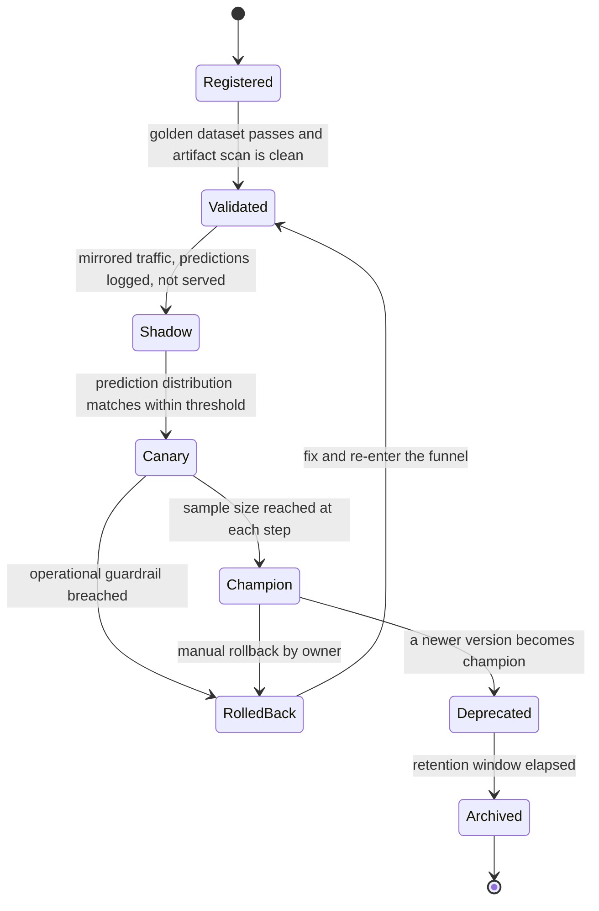

# 18 · 设计一个模型服务平台（Model Serving Platform）

> 这题的题面是"把模型部署上线"，考的却是两件事：**把异构模型变成同构服务的抽象能力**，
> 以及**怎么调度一种昂贵、不可超售、冷启动以分钟计的资源**。
> 还有一个几乎所有人都漏掉的量级事实：**250 个长尾模型只占 0.2% 的样本量，一模型一卡地部署却要 250 张卡 ——
> 比全平台其余部分加起来还多。**能不能在一张卡上塞下上百个模型，直接决定这个平台的账单差 21 倍。

---

## 读这道题之前

**你在工作中遇到过这个**

你们的推理平台上跑着 300 个模型，K8s 里一模型一 Deployment、整卡独占。半年里模型数从 60 涨到 300，
GPU 账单跟着涨到每月二十几万美元。财务来问的那天你才把数据拉出来：
**250 个长尾模型只承接 0.2% 的样本量，却压着 250 张卡（$255k/月）**，平均利用率个位数。
你把长尾并进一个共存池、按 LRU 卸载，卡数从 250 压到 12，账单差 21 倍。
三周后周三上午 9:05，运营在群里推了一条活动，30 秒内流量翻 5 倍，共存池开始 thrash（模型被反复卸载又加载）：
冷命中率从 2% 飙到 40%，p99 从 30 ms 变成 2 s。而 HPA 盯的是 CPU 利用率 —— 满载的推理实例 CPU 接近 idle，
**它一台都没扩**；等你手工扩的副本起来已经是 8 分钟后，那波流量早就超时完了。
省下 21 倍成本的那个决策，同时把尖峰容错砍到了零，而这两件事在同一个设计里，没人单独提醒你。

**如果你是直接翻到这道题的**：这题不考模型，考调度与发布。下面三个问题答不出，正文里每一句"按队列深度扩容"都会读成黑话 —— 案例篇不再解释构件。

**先确认你能回答这三个问题**

1. 利用率 80% 时的排队延迟是空载的多少倍？为什么这题里 GPU 只按 65% 利用率折算卡数？
   答不出 → 先读 [`02-capacity-estimation.md` §3 排队论](../00-foundations/02-capacity-estimation.md)
2. 一次请求串行打 3 个模型，每个 p99 都是 100 ms，端到端 p99 是多少？（不是 300 ms，也不是 100 ms）
   答不出 → 先读 [00-concepts §3 p50/p90/p99](../00-foundations/00-concepts.md)、[00/01 §7 尾延迟放大](../00-foundations/01-fundamentals.md)
3. 一个进程内常驻 20 GB 权重 + 一份编译缓存的服务，算有状态还是无状态？随便杀掉一台会发生什么？
   答不出 → 先读 [00-concepts §9 有状态 vs 无状态](../00-foundations/00-concepts.md)

**这道题会用到的构件**

| 构件 | 用在哪 | 详见 |
|---|---|---|
| 排队论、利用率与延迟的非线性 | §2.3 为什么按 65% 折算卡数；§4.4 按队列深度扩容 | [`02-capacity-estimation.md`](../00-foundations/02-capacity-estimation.md) §3 |
| 金丝雀、影子、渐进式交付 | §4.5 模型发布与服务发布的三个差别 | [`05-release-engineering.md`](../03-saas-platform/05-release-engineering.md) §3、§7 |
| 隔离级别与噪音邻居的量化 | §4.6 跨租户为什么只剩整卡或 MIG | [`03-multi-tenancy.md`](../02-architecture-patterns/03-multi-tenancy.md) §1、§5 |
| 准入控制、负载卸载、静态稳定性 | §4.4 排队而不是弹性；§5 镜像仓库挂了怎么办 | [`03-resilience-patterns.md`](../05-reliability/03-resilience-patterns.md) §6、§10 |
| KV cache、连续批处理、PD 分离（LLM 专用） | §4.3 为什么 LLM 的批处理是另一个世界，**本题不重复** | [`01-llm-serving-infra.md`](../04-ai-agent-systems/01-llm-serving-infra.md) §2、§3 |
| SLI/SLO 与错误预算 | §2.2 延迟预算分解；§4.2 冷 / 热两条 SLO | [`01-slo-and-error-budget.md`](../05-reliability/01-slo-and-error-budget.md) §1、§3 |

**本题新引入的术语**

| 术语 | English | 一句话定义 |
|---|---|---|
| 冷启动 | cold start | 从零把一个模型实例拉起来、到它能正常接第一个请求所需的全部时间（拉镜像 + 解压 + 起进程 + 载权重 + 预热） |
| 预热 | warmup | 接真实流量之前，主动用假请求把所有"第一次才会做"的一次性开销（图捕获、算子调优、显存池分配）跑完 |
| 预热池 | warm pool | 常驻一批已完成加载和预热、但当前不承载流量的空闲实例，专门用来吸收扩容窗口 |
| 共存池 | multi-model colocation pool | 一个进程内同时装载多个模型、共享同一张卡的显存与 CUDA context 的部署形态，模型按 LRU 换入换出 |
| 热命中 / 冷命中 | warm hit / cold hit | 请求到达时模型已经在显存里（热）还是要先从磁盘或对象存储装载（冷）；两者延迟差 1–2 个数量级 |
| 抖动 | thrashing | 模型被反复卸载又反复装载，装载本身吃掉大部分 GPU 时间，实际吞吐反而下降 |
| 显存超售 | GPU memory overcommit | 分配给多个模型的显存总和超过物理显存，指望它们不同时用满 —— 在 GPU 上基本不成立 |
| 别名 | alias / pointer | 可以原地改指向的名字（如 `@champion`），服务只引用别名、不引用具体版本号，回滚就是把指针重指 |
| GPU 毫秒 | GPU-ms | 一次请求实际独占 GPU 的毫秒数；本题的计量与配额单位，QPS 在这里没有意义 |
| 样本 vs 请求 | sample vs request | 一次排序请求要给 300 个候选各打一次分，样本数 = 请求数 × 候选数；容量必须按样本算 |
| 模型版本四元组 | model version quadruple | 「权重 + 特征管道 + 依赖锁 + 配置」这个不可分割的整体；回滚必须四项一起回，只回一项会造出一个从没测过的组合 |

**这道题的一句话本质**

> **把异构模型变成同构服务，然后调度一种昂贵、不可超售、冷启动以分钟计的资源。**
> 抽象层决定你能不能只写一次部署逻辑，GPU 的三条物理性质决定你全部的调度、扩容、发布策略。
> 读正文时盯住一个问题："这个设计是在抹平模型之间的差异，还是在绕开 GPU 的某一条物理约束？"

---

## 0. 45 分钟怎么分配这道题

| 时间 | 做什么 | 这一段的得分点 |
|---|---|---|
| **0:00–0:04** | 澄清 6–8 问，**必须锁死两个分水岭**：负载里 LLM 占多少、模型产物是否跨信任域 | 前者决定是不是两套栈，后者决定 GPU 共享方案。不问就是在赌 |
| **0:04–0:07** | 敲定规模（模型数与长尾形状、QPS、延迟 SLO）与非目标（不做训练、不做特征平台） | 明确说"训练和特征我不做"，把 45 分钟留给调度与发布 |
| **0:07–0:12** | 估算：**请求数 vs 样本数**、卡数、显存、成本/月 | **1:300 这个比值是本题枢纽**，它推出"批处理对排序模型是负收益" |
| **0:12–0:16** | 画最简版本：一个模型一个 Deployment，整卡独占，说清它在哪撞墙 | 先给能工作的最简解。上来就画 10 个框是负分 |
| **0:16–0:22** | 画目标架构：注册中心 / 产物分发 / 路由 / 执行器 / 调度器 / 计量 | 边画边说"这个框挂了会怎样"，尤其是控制面挂了数据面还能不能服务 |
| **0:22–0:28** | 深挖一：GPU 调度与多模型共存（显存不可超售、能超售的只有时间） | 说出"250 卡 vs 12 卡、21× 成本差"，并给出 MPS 不能跨租户的机制原因 |
| **0:28–0:34** | 深挖二：**冷启动与预热池**（为什么不能靠自动扩缩容） | **本题唯一的必答点。**说不出"扩容比尖峰慢一个数量级"，前面全白讲 |
| **0:34–0:38** | 深挖三：动态批处理与延迟 SLO（给拐点公式），或多版本与金丝雀 | 主动说出"LLM 不该调 `max_queue_delay`"能拉开一档 |
| **0:38–0:42** | 失败模式 3 条 + 撞墙信号 + 演进触发条件 | 说可观测信号（"冷命中率 > 2%"），不要说"模型变多" |
| **0:42–0:45** | 收敛：复述三个关键决策及其代价 | |

**如果只剩 10 分钟**：跳过注册与分发（一句"内容寻址 + alias 指针 + 节点本地缓存"带过），把时间全给 §4.2 和 §4.4。

---

## 1. 需求澄清

| # | 我会问 | 面试官通常怎么答 | 为什么决定架构 |
|---|---|---|---|
| 1 | ★ **负载里 LLM 占多大比例？** | "先不考虑 LLM，主要是排序、CV、embedding" | LLM 是 iteration-level 调度 + KV cache 显存模型，和本题的 request-level 批处理是两套栈（见 [`04/01`](../04-ai-agent-systems/01-llm-serving-infra.md)）。混在一个池里两边都做不好 |
| 2 | ★ **模型产物来自谁？跨信任边界吗？** | "公司内部多个团队，半可信" | 决定 GPU 共享方案：跨信任域只剩整卡或 MIG，同信任域才能用 MPS（§4.2） |
| 3 | 模型数量与规模分布？长尾有多长？ | 300 个在线模型，最大 20 GB | 长尾形状直接决定卡数，见 §2.1 的 21× |
| 4 | 延迟 SLO 是一条还是两条？ | "热模型 p99 80 ms，长尾可以放宽" | **只写一条 SLO 就没法做卸载池。**冷/热两条 SLO 是 §4.2 的前提 |
| 5 | 一次请求打几个模型、每个模型一次前向几个样本？ | 排序一次 300 个候选 | 这是本题的负载单位问题，见 §2.2 |
| 6 | 平台管不管**预测质量**，还是只管可用性和延迟？ | "先管可用性，质量给业务团队" | 决定要不要建第二套监控。运维指标对质量退化完全失明（§4.5） |
| 7 | 谁付这笔 GPU 账？要按团队分摊吗？ | "要，年底要出账" | 计量字段必须**第一天就埋**，事后补不回来（§4.6） |
| 8 | 有没有离线 / 近线批量打分？ | "有，天级任务" | 它是把 GPU 时间利用率从 11% 拉到 30%+ 的唯一现实手段（§2.3） |

**不问就会做错方向的两个：#1 和 #2。**不问 #1，你会把连续批处理（continuous batching：每生成一个 token 后重新组批）讲一整段，然后被一句"我们 90% 是排序模型"推翻 —— 排序模型根本没有"逐 token 生成"这个阶段。不问 #2，你会默认用 MPS 把多个模型塞进一张卡省钱；而如果模型产物跨租户，MPS 既不隔离显存也不隔离崩溃：**一个进程在执行 kernel 时异常退出，会连带拖垮同卡上共享 IPC 与 UVM 的其他进程**（[NVIDIA GPU sharing 文档](https://docs.nvidia.com/datacenter/cloud-native/gpu-operator/latest/gpu-sharing.html)）。

**本文假设**：300 个在线模型、峰值 1.7 万 req/s（121 万 sample/s）、非 LLM 为主、公司内部半可信多租户、热模型 p99 80 ms / 冷模型 p99 2 s、按团队计费。

---

## 2. 估算

### 2.1 模型清单：长尾才是成本主体

```
在线模型 300 个（registry 里注册版本约 2,400 个，保留策略见 §4.5）
  Tier A  排序 / 召回     8 个   2–20 GB（其中 embedding table 占 >90% 参数）  → 占样本量 99%
  Tier B  CV / NLP       42 个   200 MB – 2 GB                              → 占 0.9%
  Tier C  长尾           250 个  10 – 500 MB，中位 QPS < 0.5                 → 占 0.2%

Tier C 合计只有约 2,000 QPS。按"一模型一 Deployment、一 Deployment 独占一卡"部署：
  独占：250 张卡 × $1.4/卡·小时 × 730 h = $255,500/月  ← 服务不到 1% 的样本量
  共存：12 张卡（§4.2 的显存推导）        = $12,264/月  ← 21× 成本差
```

**推论 1**：**这个平台的技术难度不在 Tier A，在 Tier C。**Tier A 的 8 个模型你怎么部署都不会错得离谱；能不能在一张卡上塞下 100+ 个长尾模型，是这个平台存在与否的全部理由。

### 2.2 负载单位：请求数不是负载

```
Feed 排序：峰值用户请求 4,000 QPS × 每次 300 个候选 = 1,200,000 sample/s
CV 审核：              3,000 QPS × 1 张图           =     3,000 sample/s（单样本 FLOPs 高 3 个数量级）
文本 embedding：       8,000 QPS × 1 句             =     8,000 sample/s
长尾合计：             2,000 QPS                    =     2,000 sample/s
总计：                17,000 req/s                  = 1,213,000 sample/s
比值：全平台 71:1，排序模型单独 300:1
```

**推论 2**：**容量单位是 sample/s 和 GPU-ms/sample，不是 QPS。**用 QPS 报容量的平台，产品同学把候选数从 300 调到 500 就会让你的估算错 67%，而这个改动不会经过任何架构评审。延迟预算（一次 Feed 刷新，端到端 300 ms）：

```
网关 30 ms ｜ 召回 60 ms（见 03-multi-tenant-vector-search.md）｜ 特征取数 15 ms
粗排 + 精排推理 80 ms  ← 本平台的 SLO 只覆盖这一段
重排与业务规则 40 ms ｜ 余量 75 ms
```

那 15 ms 由"一次请求要**串行发几次 KV 查询**"决定，不是由特征个数决定（完整展开见 [19-feature-store.md](19-feature-store.md)）。参考量级：Redis 在线特征读 p50 600–700 µs / p99 2.5–3.0 ms、DynamoDB p99 20–25 ms（[Tecton docs](https://docs.tecton.ai/docs/monitoring/online-serving)，持续更新）—— **选 DynamoDB 等于把这 15 ms 一次性花光。**

### 2.3 GPU 数量、成本，和那个没人愿意说的利用率

自测基准（**必须自己测，厂商 benchmark 系统性偏乐观**）：

| 模型 | batch | 单卡吞吐（L40S 48 GB） | MFU | 瓶颈在哪 |
|---|---|---|---|---|
| 排序（20 GB embedding + 8 层 MLP） | 512 | **180,000 sample/s** | **1.2%** | embedding 的随机访存 + kernel launch，**不是矩阵乘** |
| CV 检测（YOLO-m 级，640×640） | 8 | **900 img/s** | ~25% | 算力 |
| 文本 embedding（bge-base 级，seq 128） | 64 | **1,800 sent/s** | ~28% | 算力 |

排序模型那一行的 1.2% 不是笔误：dense 部分约 12 MFLOPs/sample，18 万 sample/s 只有 2.2 TFLOPS，而 L40S 密集 FP16 峰值约 181 TFLOPS。**这就是"平台不要报 MFU"的原因** —— 对访存密集的排序模型，MFU 只能证明你没在做矩阵乘。平台对外只报 sample/s 和 GPU-ms/sample。

```
排序：      1,200,000 ÷ 180,000 = 6.7 → ÷0.65（排队论目标利用率）= 10.3 → 11 卡
CV：            3,000 ÷    900  = 3.3 → ÷0.65                    =  5.1 →  6 卡
embedding：     8,000 ÷  1,800  = 4.4 → ÷0.65                    =  6.8 →  7 卡
长尾：      共存后（§4.2 推导）                                          12 卡
纯服务算力                                                             36 卡
跨 AZ 冗余 ×1.6（接受单 AZ 故障时降级到 70% 容量，而不是买 2× 保 100%）  58 卡
金丝雀池 6（§4.5 的显存账：v1+v2+激活 = 48 GB，一张卡放不下两个版本）    +6 卡
预热池 8（§4.4 的公式：Tier A 突发 +50% ⇒ +6，另留 2 个覆盖故障替换）    +8 卡
  影子只镜像 Tier A 的 10% 流量（11 卡 × 10% ≈ 1.1 卡），与金丝雀池共用，不再单列
合计 ≈ 72 张 L40S 级

成本：72 × $1.4/卡·小时 × 730 h = $73.6k/月（2026 量级，长约常有 40–60% 折扣，随时变动）
      加控制面 / 对象存储 / 特征取数 / 可观测 ≈ $90k/月
      月样本量 = 121 万/s × 峰谷 0.35 × 2.6e6 s = 1.1e12  ⇒ $0.08 / 百万样本
GPU 时间利用率的诚实算法：
      峰谷 0.35 × 目标利用率 0.65 = 23%（只看 36 张服务卡）
      再摊到全部 72 张卡（含冗余 / 金丝雀 / 预热池）= 11%
```

**推论 3**：**11% 不是你做错了，是在线推理平台的物理形态。**冗余、金丝雀、预热池都不是浪费，是可用性和发布安全的价格。把利用率从 11% 拉到 30–40% 的唯一现实手段是**把离线 / 近线批量打分调度到低谷时段**（它没有延迟 SLO，可以被随时抢占）—— 不是"再压一压在线容量"。任何以"GPU 利用率只有 15%，砍掉一半机器"为出发点的重构，都会在下一次流量尖峰时把 p99 打穿。

---

## 3. 高层设计

### 3.1 先给最简单能工作的版本（10 个模型，总 QPS < 500）

```
 业务服务 ──gRPC──► [model-a Deployment] [model-b Deployment] [model-c Deployment]
                    1 Pod = 1 GPU = 1 模型｜权重烤进镜像｜HPA 按 QPS 扩缩
 发布：改 image tag → kubectl apply → 滚动更新
```

**它能撑到哪**：模型数 < 15、每个模型都有稳定流量、镜像 < 5 GB。三个撞墙信号，任一出现就走 v1：GPU 平均利用率 < 20% 且卡数 > 20；或模型数 > 15 且有人开始手工 `scp` 权重到节点；或**一次镜像重建要 20 分钟，而模型每天要更新两次**（权重和代码被绑在同一个构建里）。

### 3.2 目标架构（300 个模型）

```
                    ┌──────────────── 控制面（挂了不影响存量服务，见 §5）────────────────┐
  训练作业 ──►  Model Registry ──► 准入门禁 ──► 转换/编译 ──► 内容寻址产物库（S3 + sha256）
                 权重/管道/依赖锁/配置       格式扫描      ONNX/TRT      │
                 alias: @champion @canary   pickle 拒绝                 │ 预热推送
                    │                                                   ▼
                    │  期望状态（哪个模型 × 哪个版本 × 几个副本 × 放哪类卡）
                    ▼
              Placement Controller ──调度决策──► 节点 Agent（本地 NVMe 产物缓存 225 GB）
                    │                                        │
  ══════════════════╪════════════════════════════════════════╪═══════════════════════
                    │              数据面                     ▼
  业务服务 ──► Inference Router ──► [Executor Pod ×N]  每 Pod 独占 1 GPU
              · 按 model_id + version alias 路由           ├── 常驻模型（Tier A/B，整卡或 MIG）
              · 队列 + 准入控制（满则 REJECT，不排队到死）   └── 共存池（Tier C，同进程多模型 + LRU 卸载）
              · 动态批处理（仅对 batch=1 的请求类型）
              · 记录 GPU-ms + 显存·秒 → 计量流
                    │                                    Warm Pool ×8：已加载、已 warmup、
                    ▼                                                 已 capture 的空闲实例
              预测日志（特征快照 + 分数 + 版本 + request_id）→ 对象存储
                    │
                    └──► 运维监控（可用性/延迟/队列） + 预测级监控（分数分布/校准/熵）
```

**这张图的四条边界**：

1. **控制面与数据面严格分离。**Registry、Placement Controller 全挂，**存量 Pod 继续服务**（静态稳定性：故障时不依赖控制面，见 [`03-resilience-patterns.md`](../05-reliability/03-resilience-patterns.md) §10）。代价是控制面挂着的时候不能发新版本、不能扩容 —— 这是可接受的降级。
2. **产物走对象存储，不走镜像仓库。**权重和代码解耦：换权重不重建镜像。理由见 §4.1 的时间账。
3. **路由只认 alias 不认版本号。**`model_id + @champion` → 具体 sha256。业务代码里永远不出现版本号。
4. **计量在数据面产生，不在控制面推算。**GPU-ms 和显存·秒必须由执行器当场记录，事后按 QPS 反推的账单没人认（§4.6）。

---

## 4. 深挖

### 4.1 模型注册与产物分发：版本的单位不是权重

**模型版本是一个不可分割的四元组**：`权重 + 预处理/特征管道版本 + 依赖锁（容器 digest）+ 配置`。

只回滚权重会命中**特征时间旅行（feature time travel）**：把模型产物回滚到 X 天前，它却要去消费特征库里训练时根本不存在的"未来"特征 —— 结果是**静默劣化，不报错、不改变 HTTP 状态码**（[arXiv 2604.08181](https://arxiv.org/pdf/2604.08181)）。"只回滚一半"比不回滚更糟：它把一个问题变成两个。**产物分发路径，三选一**：

| 方案 | 15 GB 权重的到位时间 | 代价 | 撞墙条件 |
|---|---|---|---|
| A. 烤进容器镜像 | **拉取 5–6 min + 解压 3–4 min**（8B 级镜像 20.2 GB，[BentoML 2025-05-08](https://www.bentoml.com/blog/25x-faster-cold-starts-for-llms-on-kubernetes)） | 换权重要重建镜像；镜像仓库成为扩容路径上的单点 | 模型日更；或一次扩容风暴打爆仓库带宽 |
| B. 对象存储 + 单线程 loader | **47.99 s**（0.32 GB/s，瓶颈是**单线程读**不是磁盘，[NVIDIA 2025-09-16](https://developer.nvidia.com/blog/reducing-cold-start-latency-for-llm-inference-with-nvidia-runai-model-streamer)） | 简单，但白白浪费 8× 带宽 | 冷启动预算 < 60 s 时 |
| C. **对象存储 + 并发流式加载**（本文） | **4.88 s**（S3、32 并发；`15 ÷ 4.88 ≈ 3.1 GB/s`，同上来源）；同等数据从对象存储拉取约 **10 s** vs registry 350 s | 需要 safetensors 布局；要自己管本地缓存淘汰 | 本地 NVMe 写满：250 模型 × 300 MB × 3 版本 ≈ 225 GB |

**格式是准入门禁不是建议**：只接受 safetensors，**拒绝一切 pickle 系产物**。两个真实理由：(a) 反序列化过程不执行代码（纯 header + 张量字节）；(b) 可 mmap 零拷贝，正是方案 C 并发加载的前提。背景是 **CVE-2025-32434**：PyTorch ≤ 2.5.1 的 `torch.load()` **即使设了 `weights_only=True` 仍可远程代码执行**（CVSS v4 9.3）—— 此前被广泛推荐的"安全加载不可信模型"做法已被证伪；PyTorch 2.6 起该参数默认为 `True`，平台的版本下限就钉在 ≥ 2.6。⚠️ safetensors **只封住了反序列化边界**，不保证权重本身没被投毒或植入后门。

**alias 指针层是硬性的**：MLflow 的 Model Stages（None/Staging/Production/Archived）**自 2.9.0 起已弃用**，官方迁移到 **alias（如 `@champion`）+ tag**（[MLflow 3, 2025-06-11](https://mlflow.org/releases/3)）。服务代码里硬编码版本号的平台，回滚要走一次发布 —— 而回滚必须是秒级的指针重指。

---

### 4.2 GPU 调度与多模型共存：能超售的只有时间

**三条物理事实，本节全部结论都从它们推出来**：①**显存不能超售** —— GPU 没有 CPU 那种 swap / overcommit 语义，申请不到就是 OOM，没有"慢一点但能跑"这个中间态；②**每个进程一份 CUDA context，0.5–1 GB** —— 20 个独立进程等于在还没装权重之前就没了 10–20 GB；③**加载与卸载是秒级到分钟级的** —— 所以"按需换入换出"是一个有延迟代价的操作，必须写进 SLO。

**共享方式对比**（机制细节见 [`04/01 §11`](../04-ai-agent-systems/01-llm-serving-infra.md)）：

| 方式 | 显存隔离 | 故障隔离 | 本题用在哪 | 致命限制 |
|---|---|---|---|---|
| 整卡独占 | ✅ | ✅ | Tier A 排序模型 | 长尾用它 = 250 卡 = $255k/月 |
| **MIG**（硬件把一张卡切成几张小卡） | ✅ 硬件级 | ✅ | 跨租户唯一的**分卡**方案 | ⚠️ **不是所有新卡都有**：A100 / A30 / H100 / H200 一线支持，而**本文用的 L40S（Ada 架构）不支持 MIG**（[NVIDIA L40S 产品页](https://www.nvidia.com/en-us/data-center/l40s/)）—— 所以在本文的卡型上，跨租户只能整卡独占。profile **静态**，改配要重启；碎片浪费 10–30% |
| **MPS**（多进程共享一个 CUDA context） | ❌ | ❌ | 同租户内的可信负载 | device plugin 下**显存按 replica 数均分**，超了 OOM；**一个进程执行 kernel 时异常退出会拖垮同卡其他进程** |
| time-slicing（驱动按时间片轮转） | ❌ | ❌ | 开发环境 | 抖动大；老卡唯一选择 |
| **同进程多模型**（本文的 Tier C） | ❌（同一进程内） | ❌ | 长尾共存池 | 一个模型 OOM 拖垮同池全部模型 → 必须做 per-model 显存配额 |

**长尾共存池的容量推导**（L40S 48 GB）：

```
 ┌───────────────────────────── 48 GB ─────────────────────────────┐
 │ 框架/allocator/碎片 4 GB │ 激活峰值预留 8 GB │ CUDA ctx 0.7 GB │  可用于权重 35.3 GB │
 └──────────────────────────────────────────────────────────────────┘
   激活峰值那一块不能省：它是 OOM 的最后防线，由 batch 上限决定

同进程多模型（共享 context）：35.3 ÷ 0.3 GB/模型 ≈ 117 个模型/卡
独立进程（每进程 0.6 GB context）：35.3 ÷ 0.9 = 39 个 —— 少 3 倍，且 39 个进程的切换会打散 p99

250 个长尾 ÷ 117 ≈ 3 卡（算力侧 2,000 QPS，绰绰有余）
  × 2 AZ = 6，再 × 2（常驻热集与按需冷集分池，避免加载抖动传染）= 12 卡   ← §2.3 的那个 12
```

**能超售的只有时间维度**，两个可直接用的机制：Triton 的 **EXPLICIT 模式**按需 load/unload 模型（[model_management.md](https://github.com/triton-inference-server/server/blob/main/docs/user_guide/model_management.md)）；vLLM 的 **sleep mode** 不停服务、不重启容器就释放掉大部分显存，醒来再占回（[vLLM docs](https://docs.vllm.ai/en/latest/features/sleep_mode/)）。

**LRU 卸载的代价必须写进 SLO，写成两条**：

```
热命中（模型已在显存）  p99  30 ms
冷命中（需要换入）      p99   2 s   ← 300 MB 权重本地 NVMe 并行读 0.3–1.5 s + 首次前向
冷命中率预算           < 2%        ← 可配告警的撞墙信号
thrash 判据：淘汰率 × 加载耗时 > 池 GPU 时间的 10% ⇒ 池已经在给自己搬砖
```

`evictions/min` 与冷命中率同时上升，说明工作集超过了池容量。**此时加卡是对的，加 batch、调 LRU 参数都是错的。**

> **面试金句**
> "CPU 可以超售，GPU 不行 —— 没有 swap，没有 overcommit，申请不到就是 OOM。所以在 GPU 上，你唯一能超售的资源是时间：按需换入换出。代价直接写进 SLO —— 热命中 30 毫秒、冷命中 2 秒、冷命中率不许超过 2%。只写一条 p99 的平台做不了共存，因为它没法承认'有些请求就是会慢七十倍'。"
> "You can overcommit CPU. You cannot overcommit GPU memory — there's no swap, no overcommit, you just OOM. So the only thing you can oversubscribe on a GPU is time: swap models in and out on demand. And you pay for that in the SLO, explicitly — thirty milliseconds warm, two seconds cold, cold-miss rate under two percent. A platform with a single p99 number can never do model co-location, because it has no way to admit that some requests are just going to be seventy times slower."

---

### 4.3 动态批处理：只对一部分模型有用，对另一部分是负收益

**先分清两个批处理世界，混淆它们是本题最常见的失分点**：

| | **非 LLM：request-level dynamic batching** | **LLM：iteration-level continuous batching** |
|---|---|---|
| 组批粒度 | 组批后锁定到整批推理结束 | **每个 decode step 之后重新组批**，某条序列结束立刻让出槽位 |
| 该调什么 | `max_batch_size` → 再沿延迟预算爬 `max_queue_delay_microseconds` | `max_num_batched_tokens`、`max_num_seqs` |
| 头阻塞 | 同批最长的样本拖死所有人 | **decode 维度上被调度粒度消除**，但超长 prefill 仍会堵住整个 step（靠 chunked prefill 缓解），KV cache 打满时也会重现 |
| 本书在哪讲 | **本节** | [`04/01 §3`](../04-ai-agent-systems/01-llm-serving-infra.md) |

**推论：在 LLM 前面再加一层"凑批等待"是纯延迟浪费**，收益早被 iteration-level 调度拿走了。**Triton 官方的调法只有一句**：先定 `max_batch_size`，再"逐步增大 delay 直到超出延迟预算，观察吞吐的变化"（[batcher.md](https://github.com/triton-inference-server/server/blob/main/docs/user_guide/batcher.md)）。另外 `preferred_batch_size` **大多数模型不该设置** —— 官方原话，它只对多 optimization profile 的 TensorRT 模型有意义。

**拐点公式**（本书按排队推导，**未找到公开的定量曲线**）：

```
吞吐随 delay 上升先陡后平，拐点 ≈ 平均到达间隔 × (max_batch_size − 1)
delay 的合理上界 ≈ p99 延迟预算 − 单批推理时间 − 网络开销
QPS 已经打满时 delay 应设 0：请求本来就排着队，等待只剩纯惩罚

  吞吐 高│      ╭────────────      p99 延迟 高│              ╱   线性上升，
      低│  ╭───╯  ↑ 拐点                  低│──────╱          没有任何拐点
        └──────┴────────→ delay            └──────┴──────→ delay
                14 ms                              14 ms
        拐点右侧：吞吐 +3%，p99 +40 ms
```

**CV 模型算例**（数据取自 §2.3）：6 卡承载 3,000 QPS → 单卡 500 QPS → 平均到达间隔 2 ms；`max_batch_size = 8` → 拐点 ≈ `2 ms × 7 = 14 ms`。而 delay 上界 = `图片审核链路给的 150 ms p99 预算 − 8.9 ms 单批推理 − 5 ms 网络 = 136 ms`。**取 14 ms，不是 136 ms** —— 上界只告诉你"不会违约"，拐点才告诉你"再等没有收益"。

**反直觉的那一半**：排序模型一次请求天然带 300 个候选，它**已经是一个 batch**。对它开动态批处理，是把两个 300 拼成 600：吞吐涨不到 3%（GPU 早就饱和了），p99 却白白加上一个到达间隔。**动态批处理只对 `batch=1` 的请求类型有价值** —— 本平台里就是 CV 和 embedding，占样本量不到 1%。

---

### 4.4 冷启动、预热池，与"为什么不能靠自动扩缩容"

**先把冷启动拆开，因为优化顺序完全由它决定**：

```
阶段                        未优化           优化后        手段
镜像拉取                    5–6 min      ─┐
镜像解压（layer extract）    3–4 min       ├─► ~10 s     产物走对象存储，seekable-tar + 按需读
权重加载（15 GB）            48.0 s        │     4.9 s    32 并发流式读（0.32 → 3.1 GB/s）
torch.compile               39 s          │    10 s      编译缓存烤进镜像或挂共享卷
──────────────────────────────────────────┴──────────────────────────────────────────
以上三段小计               ~11 min             ~26 s     25×（BentoML 2025-05-08）
CUDA graph capture          30–60 s             5–10 s    裁剪 cudagraph_capture_sizes
8B 级端到端                 ~12 min             ~35 s
```

⚠️ **读这张表要注意两件事**：① 那个广为流传的 **25×** 只覆盖前三段（镜像 + 权重 + 编译），
**不含 capture**；把 capture 算进去端到端是 ~35 s 而不是 ~26 s。② 优化后各项**不是简单相加** ——
seekable-tar 按需读让镜像那一段和进程启动重叠发生，所以"~10 s"是重叠后的净增量，不是一段独占的时间。
**报数字时把口径说出来，比报一个更漂亮的数字更能拿分。**

**换更快的 GPU 救不了。**实测 22 个模型（0.5B–16B），vLLM 冷启动 **predominantly CPU-bound**；唯一对 GPU 代际敏感的阶段是 CUDA graph capture，H100 也只比 L40S 快 **1.2×**（[arXiv 2606.07362, MLSys 2026](https://arxiv.org/abs/2606.07362)）。torch.compile 的编译产物**可以跨机拷贝或烤进镜像**，39 s → 10 s，这是全表投入产出比最高且零风险的一项（[route179, 2026-06-30](https://route179.dev/2026/06/30/optimizing-vllm-cold-start-with-model-streaming-and-compile-caching/)）。

**优化顺序是硬的：镜像 > 权重 I/O 并行 > 编译缓存 > capture size 裁剪。**倒过来做（先去调 capture）能省 20 秒，而镜像那一项摆着 8 分钟。**现在算扩容这笔账**：

```
T_scale = 等到有空闲 GPU 的节点（0–4 min）+ 冷启动 60 s–3 min（已优化，不含 capture）
        + warmup / CUDA graph capture 30–60 s
        ⇒ 乐观 0 + 60 + 30 = 90 s，悲观 240 + 180 + 60 = 480 s = 8 min
流量尖峰的上升时间：推荐 / 信息流场景 30 s 内翻倍是常态（推送、热点、上游重试风暴）

  QPS │      ╱▔▔▔▔▔╲  实际流量      ████ = 缺口，只能由预热池当场填上
      │    ╱  ████  ╲                     靠扩容补：等它到位，尖峰已经过去了
      │  ╱ ███████   ╲___
      └────────────────────────► t
        0s   30s   90s   3min
```

**⇒ 扩容比尖峰慢一个数量级。在 GPU 上，自动扩缩容不是弹性，是事后补偿。三件事扛尖峰，扩容不在其中**：

1. **预留余量**：§2.3 的 0.65 目标利用率就是它。
2. **排队 + 准入控制**：队列满了要 **REJECT，不是无限排队**。Triton 的 `max_queue_size` + `timeout_action: REJECT` + `priority_levels` 是可以直接照抄的语义模型。不做准入控制的代价有实测：在 LLM 上，"Fill and Squeeze" 攻击能把 TTFT 劣化 **20–280×**（[arXiv 2602.07878, 2026-02-08](https://arxiv.org/abs/2602.07878)）—— 攻击场景是 LLM，但"没有准入控制的共享队列会被单个租户打穿"这条结论对本平台同样成立。
3. **预热池（warm pool）**：一批已加载权重、已完成 warmup、已 capture 的空闲实例。

**预热池容量 = 冷启动补上之前的那段缺口**（`N_warm = 峰值突发要新增的副本数 + 故障替换余量`），不是"扩容需求 × 冷启动时间"。本文：Tier A 突发 +50% ⇒ +6 副本，另留 2 个覆盖故障替换 = **8 卡**，`8 × $1.4 × 730 = $8.2k/月 = 总成本的 9%` —— 这是可用性的价格，不是浪费。**降本手段与它的代价**：预热池实例用 sleep mode 挂起（释放大部分显存），唤醒 1–3 s，成本接近 0 —— 代价是**不再保证同一张卡上还有空间接住它**，被别的模型占了就退化成完整冷启动。所以 sleep mode 只用于 Tier C，Tier A 的预热池必须真占着卡。

**扩缩容挂什么指标**：**队列深度，绝不是 CPU 利用率。**CPU 利用率是饱和指标（延迟已经劣化了它才涨），队列深度是先行指标；而且**满载的推理实例 CPU 接近 idle**，HPA 的 CPU/内存指标完全看不见 GPU 队列。KEDA 推荐起点：`formula: "running + (waiting * 10)"`、`target: "25"`、`activationTarget: "5"`（[AWS EKS Best Practices](https://docs.aws.amazon.com/eks/latest/userguide/ml-inference-autoscaling-hpa-keda.html)，2025）。**而 scale-to-zero 只对 Tier C 成立** —— 因为只有它的 SLO 里写了"冷命中 2 s"；对有交互延迟要求的模型，缩到零意味着下一次请求吃满冷启动，这不是省钱，是把成本转嫁给了 p99。

---

### 4.5 多版本、金丝雀与影子：模型的发布和服务的发布不是一回事

**三个差别，每一个都会让照搬服务发布流程的人翻车**：

| | 服务发布 | 模型发布 |
|---|---|---|
| 坏了长什么样 | 5xx、延迟涨、错误率报警 | **HTTP 200，延迟不变，只是推荐变差了** |
| 推进判据 | 时间（跑 30 分钟没报警就推进） | **统计分辨率**（样本量够了才推进） |
| 回滚单位 | 镜像 tag | **四元组**（§4.1） |

**运维指标对质量退化完全失明。**Uber 的说法是这类问题 "can cause degradations in customer experience without throwing off any production alarms"，所以他们把监控分成两层：**operational**（可用性 / 延迟 / 吞吐，秒级可判）+ **prediction-level**（**分数分布、校准度、预测熵**）（[Uber, 2025-10-30](https://www.uber.com/us/en/blog/raising-the-bar-on-ml-model-deployment-safety/)）。注意一个诚实的细节：**Uber 公开的自动回滚触发器全部是运维指标，质量指标目前只是"监控"，不是"自动回滚"** —— 质量信号还不够快到能自动决策。

发布状态机的价值在于**哪些边不存在**，这件事 ASCII 箭头画不清（线条一多就互相穿插）：



> 📖 **读图要点**：`Registered` 到 `Canary` **没有直达边** —— 任何版本都必须先过 `Shadow`，这是平台强制的，不是流程建议。另一处：`Champion → RolledBack` 的触发词是 "manual"，而 `Canary → RolledBack` 是自动的；这条不对称正是上面那个事实的图上形态（质量指标还不能自动决策）。还有：`Archived` 没有回到 `Champion` 的边，归档意味着产物可能已被 GC，回滚窗口关闭 —— 所以保留期是一个必须算出来的数，不是一个默认值。

**金丝雀必须 validation-gated 而不是 time-gated。**照搬服务的"25% 起步 + 每小时推进"是错的：模型的阶梯是 **1% → 5% → 10% → 25% → 50% → 100%**，每一步的推进条件是**样本量够了**（[GrowthBook, 2026-05-29](https://www.growthbook.io/insights/canary-releases-ai-models-what-changes-vs-traditional-software)）。反例很具体：低流量产品放 1% 流量跑 48 小时，可能只有约 **200 次交互** —— 你什么都没测出来，却已经等了两天。按时间推进不是统计方法，是排班表。

**影子先行。**Uber 的 shadow 覆盖 **>75% 的关键在线用例**（计划 2025 H2 到 100%）。成本是确定的：**被镜像那部分流量要付 2× 推理算力**，外加双份特征拉取与日志写入 —— 所以镜像比例是一个成本旋钮，本文只镜像 Tier A 的 10%（≈1.1 卡，§2.3）。但要清楚它证明了什么 —— **只证明"不会崩、分布没歪"，给不出任何业务指标结论**。

**warmup 必须是就绪探针的一部分。**Triton 的 `ModelWarmup` 在配置里声明一组预热请求，**全部实例执行成功才标记 READY**；而且 **warmup 必须覆盖将要 capture 的 batch size 集合**，否则线上遇到未捕获的形状会走 eager 慢路径。不这么做的后果很具体：金丝雀的第一批用户吃到 30–60 s 的 capture 尾延迟，被误判成"新模型变慢了"，一个好模型就这样被回滚掉。

**多版本共存的显存账**（最常被漏掉的一项）：20 GB 排序模型做金丝雀 = `v1 20 GB + v2 20 GB + 激活 8 GB = 48 GB`，**正好撑爆一张 48 GB 的卡**。⇒ 金丝雀不能"就地扩一个副本"，必须有独立的金丝雀池（§2.3 的 +6 卡）。

**旧版本保留多久**：**未找到公开数据**，但下界可推导 —— `≥ 标签回流周期 + 检测延迟 + 一个完整重训周期`；以欺诈风控为例（标签数天 + 检测 2 天 + 重训 3 天）⇒ **至少 10 天**。保留期短于这个数，等你发现问题时回滚目标已经被 GC 了。

---

### 4.6 多租户隔离与成本归因：GPU-second 是唯一诚实的计量单位

**按请求计费的平台一定会被薅**。用 §2.3 的基准换算成 GPU 时间：

```
embedding 1 req = 1 样本 → 0.55 ms ┐ "每请求"耗时落在同一量级（0.5–1.7 ms），
CV 检测   1 req = 1 张图 → 1.11 ms ├ 但"每样本"差 200×（0.006 vs 1.11 ms）
排序   1 req = 300 样本 → 1.67 ms ┘ ⇒ 按请求计费时，把候选数从 300 调到 3,000 的
                                     租户账单一分不涨，而 GPU 时间涨 10 倍
```

| 归因口径 | 谁会占便宜 | 误差 | 结论 |
|---|---|---|---|
| 按请求数 | 一次请求塞几千个样本的租户（每样本差 200×） | 不可用 | 只适合内部看趋势 |
| 按 GPU-ms | **QPS 极低但常驻 20 GB 显存的模型**（几乎免费搭车） | 显存维度完全丢失 | 不够 |
| **GPU-ms + 显存·秒**（本文） | — | 共享池 ±15% | 唯一能拿去对账的口径 |

```
cost(tenant) = Σ GPU-ms × 单价_compute
             + Σ (常驻显存 GB × 驻留秒数) × 单价_memory
共享池里同一个 CUDA context 上的多个模型无法精确归因，按 batch 内样本数比例摊，误差 ±15%
  ⇒ 账单上必须写明"共享池按样本数摊" —— 藏起来的分摊规则一定会在对账会上被质疑
```

**配额按 GPU-ms/s 发，不按 QPS 发**：按 QPS 限流的平台会被一个把 batch 从 8 调到 512 的租户打穿；超配额的正确动作是 **429 拒绝而不是排队** —— 排队会把一个租户的超额转化成所有租户的延迟（限流器实现见 [`09-rate-limiter.md`](09-rate-limiter.md)）。**隔离级别则按信任域选，不按成本选**：跨租户只有整卡或 MIG，同租户内才能用 MPS。⚠️ **而 MIG 是一个卡型能力不是架构选项** —— 本文的 L40S 就没有 MIG（Ada 架构不支持），所以本平台的跨租户隔离**实际只剩整卡独占**；想靠 MIG 压低跨租户成本，必须在选型阶段就把卡换成 A100/H100 一线，事后补不上。噪音邻居的量级可以测出来 —— 同卡上另一个租户把 batch 从 8 调到 64，你的 p99 会从 12 ms 涨到 40 ms 以上（时间片被抢），而两边的监控都显示"一切正常"（量化与治理见 [`03-multi-tenancy.md`](../02-architecture-patterns/03-multi-tenancy.md) §5）。

> **面试金句**
> "计费单位选错，架构就跟着错。按请求计费的模型平台，会逼着每个团队去做大 batch、把长尾模型常驻显存 —— 因为这两件事在账单上都是免费的。我按 GPU 毫秒加显存秒计费，一天之内就会有人主动来问'我这个模型能不能缩到零'。计量不是财务需求，是平台唯一能大规模影响用户行为的杠杆。"
> "Get the billing unit wrong and the architecture follows it down. If you bill a model platform per request, every team is incentivized to batch huge and pin their long-tail models in GPU memory forever — both of those are free on that invoice. Bill per GPU-millisecond plus gigabyte-second, and within a day someone walks up and asks whether their model can scale to zero. Metering isn't a finance requirement, it's the only lever a platform has to change user behavior at scale."

---

### 4.7 什么时候这整套方案是错的

| 场景 | 为什么本文方案错 | 应该做什么 |
|---|---|---|
| 只有 3–5 个模型、总 QPS < 500 | 注册中心、调度器、共存池、计量流全是净复杂度，比模型本身还难维护 | §3.1 的版本；小模型直接**跑在业务服务进程内**（Netflix 就是把小模型放进 JVM 服务层用 CPU 跑，[2026-07](https://netflixtechblog.com/in-house-llm-serving-at-netflix-a5a8e799ea2c)） |
| **sub-2B 模型 / embedding / 树模型** | GPU 在这里是净亏：单 endpoint 持续 < 100 req/s 时 CPU 性价比直接胜出（[AWS EKS BP](https://docs.aws.amazon.com/eks/latest/best-practices/aiml-cpu-inference.html)，2025） | CPU 推理 + 量化；**统一判据是"目标 p95 下的 cost-per-1,000-queries"**，两条路各测一遍。⚠️ 流传的"BERT 类要 5,000 req/s 才该上 GPU"与上述口径差 50 倍，两个都别直接采信。转 CPU 后必须显式设 `OMP_NUM_THREADS` / `INTRA_OP_NUM_THREADS`，否则密集 bin-pack 时每个 pod 都按**节点 vCPU 数**起线程（20 pod × 32 线程），p99 会被上下文切换打穿 |
| **纯 LLM 负载** | request-level 批处理、整卡分配、"显存 = 权重"这套模型全错：LLM 的显存主项是随并发增长的 KV cache | 走 [`04/01`](../04-ai-agent-systems/01-llm-serving-infra.md) 那一套：连续批处理、前缀缓存、PD 分离、按 token 而非请求计量 |
| **离线 / 近线批量打分**（延迟预算分钟级） | 在线平台的排队、准入、预热池全部无意义，还多付一层抽象 | Spark / Ray 批处理 + spot 实例，成本差 5–10×；顺便用它填 §2.3 的利用率低谷 |
| 单一超大模型独占整个集群 | "把异构变同构"的抽象层没有服务对象，纯负债 | 用引擎原生部署 + 一层薄路由 |
| 强监管场景（医疗器械、信贷决策） | 自动推进的金丝雀不合规：每个版本要留审批与证据链 | 发布走人工闸门；registry 从"存权重"变成"**存证据**"（EU AI Act Annex XI 要求记录训练算力 FLOPs、训练时长、能耗、数据来源与过滤方法，**这些训练结束后基本无法补录**；委员会自 **2026-08-02** 起可直接索取，[artificialintelligenceact.eu](https://artificialintelligenceact.eu/annex/11/)） |

**一条通用判据**：当平台上**模型数量的增长快于流量增长**时，本文这套（共存 + 卸载 + 计量）就是对的；反过来，如果是流量在涨而模型数不变，你需要的只是更多同构副本，别建平台。

---

## 5. 失败模式

| 故障 | 影响 | 检测信号 | 应对 / 降级到什么 |
|---|---|---|---|
| 一个租户把 batch 调大 → 显存 OOM | **整卡上所有共存模型一起挂**（不是只挂它自己） | `CUDA out of memory` 计数、显存高水位 | per-model 显存配额（启动时预分配 arena）；超配额在**入口拒绝**而不是让它 OOM |
| 长尾池 thrash（换入换出抖动） | 冷命中率从 2% 飙到 40%，p99 从 30 ms 到 2 s | `evictions/min`、冷命中率 | 固定常驻集（按 7 日 QPS 排序取 Top-N）+ 冷模型独立池；**加卡，不要调 LRU 参数** |
| 镜像仓库限流 / 挂掉 | 新 Pod 全起不来，**存量服务不受影响** | 镜像拉取失败率、Pod `ImagePullBackOff` | 节点本地缓存 + 对象存储双通道；这是 §3.2 第 1 条边界的兑现 |
| 特征服务超时，缺失值被当 0 | 模型静默劣化，**HTTP 200、延迟正常、错误率为 0** | 特征缺失率、预测分数分布偏移 | 显式缺失标记（NULL ≠ 0，这是训练/服务偏斜的高频成因）；缺失率超阈值时**拒绝请求**而不是补 0 |
| warmup 未完成就进 LB | 金丝雀首批用户吃 30–60 s 尾延迟，好模型被误判回滚 | 新副本首 100 次请求的 p99 | warmup 进就绪探针，覆盖全部要 capture 的 batch size |
| 尖峰时扩容追不上 | 队列爆炸 → 全线超时（连没超载的模型一起） | 队列深度、排队时长 p99、拒绝率 | 准入控制 REJECT + 预热池；降级到**上一版本的缓存分数**或规则兜底 |
| 上游数据管道列级损坏 | 预测质量下降数周无告警 —— Uber 的实例是某费用组件在 10% session 中缺失、持续 **45 天**，模拟影响 **0.23% gross booking** | 列级数据质量监控（空值率、分位数、类别分布） | 列级监控必须与模型监控分开建；Uber D3 把检测时间从 45 天压到平均 2 天（[2023-02-23](https://www.uber.com/us/en/blog/d3-an-automated-system-to-detect-data-drifts/)） |
| 单卡 ECC / XID 故障导致静默降速 | 该卡吞吐掉 30%，路由却仍按等权重打过来 | 每卡吞吐 / 延迟的方差（不是均值） | 自动隔离该节点，副本重建走预热池 |
| 恶意或损坏的模型产物 | GPU 节点上任意代码执行 | 产物格式扫描结果 | 只接受 safetensors（§4.1）；转换/编译在**沙箱节点**上跑，不在服务节点 |

---

## 6. 演进路线

```
v0  < 10 个模型，总 QPS < 500：模型跑在业务服务进程内或 sidecar，CPU 为主，权重烤进镜像。
    → v1 触发条件（任一命中）：模型数 > 15；或有人开始手工 scp 权重到节点；
      或一次镜像重建 20 分钟而模型每天更新两次（权重与代码被绑死在同一次构建里）

v1  10–50 个模型，开始上 GPU：统一服务框架（Triton / Ray Serve / BentoML），一模型一
    Deployment 整卡独占；registry + alias 指针；产物移出镜像走对象存储。
    → v2 触发条件：GPU 平均利用率 < 20% 且卡数 > 20；或长尾模型数 > 50；
      或第一次有人问"这个月 GPU 账单为什么涨了 40%，是谁用的"

v2  300 个模型 ← 本文：多模型共存池 + LRU 卸载（冷/热两条 SLO）；动态批处理（仅 batch=1 类型）；
    预热池 + 队列准入控制；影子 → 金丝雀（validation-gated）；GPU-ms + 显存·秒计量。
    → v3 触发条件：跨租户合规隔离要求（外部模型进场）；或单模型规模超过单卡；
      或 LLM 负载占比 > 30%（这是"该分栈"的信号，不是"该加卡"）

v3  分栈与硬隔离：非 LLM 池保持本文形态，LLM 走 vLLM/SGLang + KServe/llm-d 那条线（见 04/01）；
    跨租户改 MIG 硬隔离（**注意这一步要连卡型一起换** —— L40S 没有 MIG）；跨区域部署。
```

⚠️ **v1 起就要过一遍法务与维护状态**：Seldon Core 自 2024-01-22 改为 BSL 1.1，**生产使用需商业许可**（[licensing FAQ](https://www.seldon.io/licensing-faqs/)）；TorchServe（归档 2025-08-07）与 TGI（归档 2026-03-21）均已只读，不能再写进新架构 —— 存量迁移应列为**安全债**而非优化项。

---

## 7. 常见错误答法

| mid-level 会怎么答 | 为什么掉分 | 正确的说法 |
|---|---|---|
| 「一个模型一个 Deployment，K8s 会帮我调度」 | K8s 的 `nvidia.com/gpu` 是**整数资源**，申请不了 0.3 张卡。250 个长尾模型 = 250 张卡 = $255k/月，服务不到 1% 的样本量 | "长尾走同进程共存池 + LRU 卸载，117 个模型/卡，12 张卡搞定。代价写进 SLO：热命中 30 ms、冷命中 2 s、冷命中率 < 2%。" |
| 「用 HPA 按 GPU / CPU 利用率自动扩缩容」 | 满载的推理实例 CPU 接近 idle，HPA 永远不扩，直到请求开始超时；而且**扩容 90 s–8 min，尖峰 30 s** —— 慢一个数量级 | "按**队列深度**扩（KEDA `running + waiting*10`，target 25）。真正扛尖峰的是排队 + 准入控制 + 预热池，扩容只是事后补偿。" |
| 「把 `max_queue_delay` 调大来提吞吐」 | 只在未饱和区成立；QPS 打满时纯粹是延迟惩罚。而且对 LLM 根本不该调这个参数 | "沿延迟预算爬到拐点 ≈ 到达间隔 × (max_batch_size−1)，本例 14 ms。再大：吞吐 +3%、p99 +40 ms。排序模型天然带 300 个候选，对它开动态批处理是负收益。" |
| 「回滚就是把版本指针指回上一版」 | 会命中**特征时间旅行**：旧模型去消费训练时不存在的"未来"特征，静默劣化不报错 | "版本是不可分割四元组：权重 + 特征管道 + 依赖锁 + 配置。**只回滚一半比不回滚更糟。**" |
| 「模型发布跟服务发布一样，25% 金丝雀跑一小时」 | 模型坏掉时 HTTP 全 200、延迟不变；按时间推进不是统计方法。低流量场景 1% 跑 48 小时可能只有 200 次交互 | "先 shadow 再 canary，阶梯 1%→5%→10%→25%→50%，**每步按样本量推进**；同时监控分数分布、校准度、预测熵，不只看错误率。" |
| 「用 MPS 把多个租户塞一张卡省钱」 | 显存按 replica 数均分（超了 OOM），且**一个进程执行 kernel 时异常退出会拖垮同卡其他进程** | "跨信任域只有整卡或 MIG。MPS 只用在同租户内的可信负载上。" |

---

## 8. 相关章节

| 本题用到的构件 | 章节 |
|---|---|
| 排队论、目标利用率、成本单位经济 | [`../00-foundations/02-capacity-estimation.md`](../00-foundations/02-capacity-estimation.md) §3、§6 |
| KV cache 显存公式、连续批处理、前缀缓存、PD 分离（LLM 专用，本题刻意不重复） | [`../04-ai-agent-systems/01-llm-serving-infra.md`](../04-ai-agent-systems/01-llm-serving-infra.md) §2、§3、§11 ｜ 成本与延迟 ROI [`08-cost-and-latency.md`](../04-ai-agent-systems/08-cost-and-latency.md) |
| 准入控制、负载卸载、静态稳定性、优雅降级 | [`../05-reliability/03-resilience-patterns.md`](../05-reliability/03-resilience-patterns.md) §6、§7、§10 |
| 冷 / 热两条 SLO 怎么写、错误预算 | [`../05-reliability/01-slo-and-error-budget.md`](../05-reliability/01-slo-and-error-budget.md) §1、§9 ｜ 两层监控的落地 [`02-observability.md`](../05-reliability/02-observability.md) |
| 金丝雀、影子、五个可版本化对象 ｜ 控制面/数据面分离与协调循环 | [`../03-saas-platform/05-release-engineering.md`](../03-saas-platform/05-release-engineering.md) §3、§7 ｜ [`01-control-plane.md`](../03-saas-platform/01-control-plane.md) §1、§2、§7 |
| 多租户隔离级别、噪音邻居量化 ｜ 配额与限流（按 GPU-ms 而非 QPS） | [`../02-architecture-patterns/03-multi-tenancy.md`](../02-architecture-patterns/03-multi-tenancy.md) §1、§5 ｜ [`09-rate-limiter.md`](09-rate-limiter.md) |
| GPU-ms 计量 → 账单 ｜ 特征取数与训练/服务偏斜 ｜ 召回侧向量检索 | [`../03-saas-platform/02-billing-and-metering.md`](../03-saas-platform/02-billing-and-metering.md)、[`04-usage-based-billing.md`](04-usage-based-billing.md) ｜ [`19-feature-store.md`](19-feature-store.md) ｜ [`03-multi-tenant-vector-search.md`](03-multi-tenant-vector-search.md) |

---

## 面试官会追问

1. 250 个长尾模型每个 300 MB，你打算怎么部署？一张 48 GB 的卡能装几个？算给我看，把 CUDA context 算进去。
2. 流量 30 秒内翻倍。你的自动扩缩容多久能补上？如果补不上，这套系统靠什么不挂？
3. HPA 按 CPU 利用率扩 GPU 推理服务，会发生什么？为什么？那该挂什么指标？
4. 新模型上线后错误率 0、p99 没变，但第二天 CTR 掉了 3%。你的平台里哪个东西本该在几分钟内发现它？
5. 一个租户的模型在共享卡上 OOM 了，同卡另外 100 个模型会怎样？怎么防？
6. 你按什么给团队分摊 GPU 成本？如果只按请求数计费，一年后这个平台会长成什么样？
7. 冷启动 11 分钟，你先优化哪一段？换 H100 能救多少？给我数字。
8. `max_queue_delay` 从 5 ms 调到 50 ms，吞吐和 p99 各怎么变？什么时候这个参数应该设成 0？

---

## 自测

遮住上文，你能不能说出：

1. **请求数和样本数的比值是多少？**这个比值推出的两个结论是什么？（排序 300:1 → 容量单位是 sample/s；→ 排序模型天然成批，动态批处理对它是负收益）
2. **GPU 上唯一能超售的资源是什么？**为什么显存不行？（时间；GPU 没有 swap/overcommit 语义，申请不到就是 OOM，没有中间态）
3. **冷启动优化的正确顺序是什么？**换更快的 GPU 能省多少？（镜像 > 权重 I/O 并行 > 编译缓存 > capture 裁剪；前三段 ~11 min → ~26 s，加上 capture 端到端 ~12 min → ~35 s；换卡几乎救不了 —— 冷启动 CPU-bound，H100 只在 capture 阶段比 L40S 快 1.2×）
4. **预热池的容量怎么算？**为什么不能靠自动扩缩容代替它？（覆盖冷启动补上之前的缺口；扩容 90 s–8 min vs 尖峰 30 s，慢一个数量级）
5. **模型版本是哪四样东西？**只回滚权重会发生什么？（权重 + 特征管道 + 依赖锁 + 配置；特征时间旅行 —— 旧模型消费训练时不存在的特征，静默劣化不报错）

---

**下一篇** → [19-feature-store.md](19-feature-store.md)：训练和线上用的是同一份特征定义，为什么算出来的值不一样。
