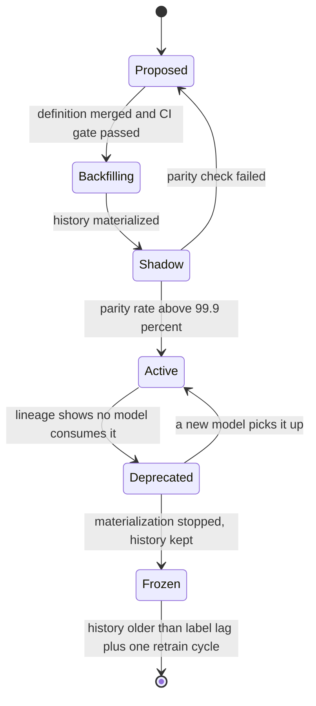

# 19 · 设计一个特征平台（Feature Store）

> 题面是"建一个存特征的地方"，考的却是**同一份特征定义怎么同时喂给离线训练和在线推理，且让训练时看到的值恰好是当时线上能看到的值**。
> 存储是实现细节 —— 在线 KV 换成什么都能跑；**时间点正确性（point-in-time correctness）错一次，这个模型的全部离线指标永久失去意义**，而且不报错。
> 还有一个几乎所有人都漏掉的事实：这个系统的一致性不是被"定义统一"担保的，是被**逐条比对**度量出来的。没有比对流水线的特征平台，只是一个更贵的 Redis。

---

## 读这道题之前

**你在工作中遇到过这个**

你们的风控模型换了一版，离线 AUC（随机抽一个正样本和一个负样本，模型给正样本打分更高的概率；0.5 等于瞎猜）
从 0.72 涨到 0.75，评审全票通过。周一放量 20%，三天后拒绝率不动、坏账率反而升了 3%。
你们花了两周读离线 SQL 和在线 Go 代码找差异，最后是有人拉了 1,000 条线上特征日志、
按同一个 `(user_id, request_ts)` 跑离线回填逐列 diff 才定位到：
「近 30 天交易笔数」这个特征，离线按自然日算 30 天，在线用的是滚动 720 小时；
跨月那几天两边差 12%，而这个特征在模型里权重排第三。
更贵的是第二笔账：口径改完要把 90 天历史重新回填一遍，as-of join 本身跑 9 小时，
而其中一个爆款商家的 key 有几百万行、单个 task 独自又跑了 6 小时，整个作业被它一个人拖着不能结束。
**没有逐条比对流水线，前面那两周是省不掉的。**

**如果你是直接翻到这道题的**：这题不考存储选型。下面三个问题是地基，答不出，正文里每一句"物化"和"as-of join"都会读成黑话 —— 案例篇不再解释构件。

**先确认你能回答这三个问题**

1. 双写（应用在一个请求里同时写两个存储）为什么不可能保证一致？Outbox 解决的是这里面的哪一半？
   答不出 → 先读 [`03-messaging-and-streams.md`](../01-building-blocks/03-messaging-and-streams.md) §4
2. 事件时间与处理时间差在哪？一个迟到 30 秒的点击事件，会让"最近 5 分钟点击数"这个值在多长时间里是错的？
   答不出 → 先读 [`03-messaging-and-streams.md`](../01-building-blocks/03-messaging-and-streams.md) §6
3. 一个请求要读 300 个特征，它们分散在 5 张表里。这次取数的 p99 主要由 300 决定，还是由 5 决定？
   答不出 → 先读 [00-concepts §3 p50 / p90 / p99](../00-foundations/00-concepts.md)

**这道题会用到的构件**

| 构件 | 用在哪 | 详见 |
|---|---|---|
| 双写问题、Outbox、CDC | §4.2 在线值只能是离线表的物化产物，不能双写 | [`03-messaging-and-streams.md`](../01-building-blocks/03-messaging-and-streams.md) §4 |
| 事件时间、窗口聚合、watermark、迟到事件 | §4.5 流式特征的新鲜度与乱序 | [`03-messaging-and-streams.md`](../01-building-blocks/03-messaging-and-streams.md) §6 |
| 热 key、读放大、进程内缓存 | §4.4 爆款 item 打穿单 key 上限 | [`02-caching.md`](../01-building-blocks/02-caching.md) §4 |
| 表格式、分区、时间旅行、数据契约与 CI 门禁 | §4.3 回填的分区设计、§4.7 变更管控 | [`05-data-platform.md`](../02-architecture-patterns/05-data-platform.md) §2、§4 |
| 列存压缩比、对象存储单价、Little's Law | §2 全部四段估算 | [`02-capacity-estimation.md`](../00-foundations/02-capacity-estimation.md) §2、§6 |
| 数据倾斜与 shuffle | §4.3 as-of join 的热 key 单 task 卡死 | [`01-storage-engines.md`](../01-building-blocks/01-storage-engines.md) §4 |

**本题新引入的术语**

| 术语 | English | 一句话定义 |
|---|---|---|
| 实体 | entity | 特征挂靠的主键对象（用户 / 商品 / 商户 / 设备），它决定在线取数按什么 key 查 |
| 特征视图 | feature view / feature group | 共享同一个实体主键和同一份计算逻辑的一组特征，是物化和取数的最小单位。**一次请求读几个 view 就是几次网络往返 —— 延迟由 view 个数决定，不由特征个数决定** |
| 在线存储 / 离线存储 | online store / offline store | 前者按主键返回"当前值"、毫秒级；后者存全部带时间戳的历史值，供拼训练集 |
| 物化 | materialization | 把离线算好的特征值批量写进在线存储的那个动作；它的滞后决定在线值有多旧 |
| 特征新鲜度 | feature freshness | 从"产生这个特征的事件真的发生"到"线上能取到它"之间的时间 |
| 时间点正确性 | point-in-time correctness | 每条训练样本只允许看到标签时间戳之前已经存在的特征值，一秒都不能多 |
| as-of join | as-of join | 按实体主键匹配、并只取时间戳 ≤ 标签时间戳的那条最新特征值的拼接方式；时间点正确性的具体实现 |
| 特征穿越 / 数据泄漏 | data leakage | 训练样本里混进了"标签发生那一刻还不存在"的信息；症状是离线指标虚高、上线打回原形 |
| 训练/服务偏斜 | training-serving skew | 同一个特征名，训练集里那个值和线上真正喂给模型的那个值不一样 |
| 服务端特征日志 | feature logging | 线上打分那一刻，把**实际喂给模型的那份特征向量**连同预测结果原样落盘，下一轮训练直接拿它当样本来源 |
| 回填 | backfill | 用今天的代码，重新计算历史某一段时间的特征值 |
| 请求时变换 | on-demand transformation | 只有拿到请求参数才能算的特征（当前距离、距上次点击多少秒），在读路径上现算 |
| AUC / GAUC | AUC / grouped AUC | AUC：随机抽一正一负两个样本，模型给正样本打分更高的概率（0.5 = 瞎猜）。GAUC：先在每个用户或每次请求**内部**算一次 AUC 再按曝光数加权平均 —— 线上只关心同一屏内的排序，所以 GAUC 更贴近线上 |

**这道题的一句话本质**

> **同一份特征定义要在两个执行引擎上跑出同一个值，且离线那次必须只用标签时刻之前的数据。**
> 一致性问题，不是存储问题。读正文时对每个组件问一次："它是在保证两边算出同一个值，还是在保证不看未来？"这两件事分别对应 §4.1–4.2 和 §4.3，混为一谈是本题最常见的失分点。

---

## 0. 45 分钟怎么分配这道题

| 时间 | 做什么 | 这一段的得分点 |
|---|---|---|
| **0–3 min** | 问"训练样本的特征从哪来：离线回填拼接，还是在线特征日志"、"最高新鲜度要求是哪一档" | 第一个问题决定整个架构。不问就是在赌 |
| **3–5 min** | 敲定规模（特征数、实体基数、在线读 QPS、历史跨度）与非目标（不做特征工程算法、不做模型训练调度） | 明确说"我不做 X"，把 45 分钟留给该深挖的地方 |
| **5–9 min** | 算三个数：每请求的实体扇出、在线存储容量、特征日志日增量 | **扇出 401 个实体 / 34,300 个值是本题的枢纽**，它直接推出"item 特征不能走 KV" |
| **9–13 min** | 画最简版本：一个 Spark 作业 + 一张 Redis hash，说清它在什么条件下撞墙 | 先给能工作的最简解。上来就画 8 个框是负分 |
| **13–19 min** | 画目标架构：定义层 / 双执行器 / 物化 / 在线取数 / 特征日志 / 校验流水线 | 边画边说数据流，每个框写一句"它挂了会怎样" |
| **19–25 min** | 深挖一：特征定义的单一来源（一套定义两处执行 vs 一处执行两处消费） | 说出"定义一致 ≠ 执行语义一致"，并给出三条路线各自的代价 |
| **25–31 min** | 深挖二：**point-in-time 正确的 as-of join** | **本题第一个必答点。**没讲到这里，前面全白讲 |
| **31–36 min** | 深挖三：在线取数的延迟预算（往返数而不是特征数） | 给出预算分解式，说出"item 特征进程内、user 特征走 KV"的分工 |
| **36–41 min** | 深挖四：**训练服务偏斜发生了，你怎么定位** | **本题第二个必答点。**给一个从便宜到贵的排查顺序，不是"加监控" |
| **41–45 min** | 失败模式 3 条 + 撞墙信号 + 什么时候根本不该建这个平台 | 说出可观测的信号（"比对匹配率 < 99.9%"），不要说"数据变多" |

**如果只剩 10 分钟**：跳过存储选型和流式（一句"日级批 / 分钟级流 / 请求时计算三档分级"带过），把全部时间给 §4.3 和 §4.6。

---

## 1. 需求澄清

| # | 我会问 | 面试官通常怎么答 | 为什么决定架构 |
|---|---|---|---|
| 1 | **训练样本的特征从哪来：离线回填拼接，还是在线特征日志（feature logging：线上每次预测把真正喂给模型的特征向量落盘）？** | "你定，说清代价" | 这是本题的分水岭。回填要建 as-of join 全套；特征日志把偏斜结构性归零，但新特征没有历史 |
| 2 | 在线延迟预算多少？一个请求要取几个实体、几个 feature view（一组共享同一实体键与同一份变换的特征，它是一次往返的单位）？ | 端到端 100 ms，给特征 15 ms | 决定往返预算，进而决定在线拓扑（§4.4） |
| 3 | 最高新鲜度要求：日级 / 分钟级 / 请求时计算？ | "都有" | 三档管道成本差 5–20 倍，一刀切必然为最贵的那一档买单 |
| 4 | 特征被几个团队、几个模型复用？ | 8 个团队、40 个模型 | **少于 3 个就不该建平台**（§4.8 的立项判据） |
| 5 | 规模：特征数、实体基数、在线读 QPS、历史跨度？ | 20,000 特征、2 亿 user、峰值 2 万排序 QPS、2 年历史 | 全部估算的输入 |
| 6 | 有状态时间窗聚合（"最近 7 天点击率"）在范围内吗？ | 在 | 它是流式管道与乱序处理的唯一理由 |
| 7 | 谁为特征质量负责：平台还是特征作者？ | 作者，平台提供门禁 | 决定要不要做数据契约 CI 门禁与血缘 |
| 8 | 合规：训练数据可审计吗？特征要能下线吗？ | 欧盟市场要 | 决定血缘与保留期是必需项而非加分项（§6 v3） |

**不问就会做错方向的两个：#1 和 #3。**

- 不问 #1，你会把回填方案讲完，然后被一句"我们训练样本直接用线上日志"推翻半个架构 —— 而那半个架构（as-of join、回填分区、时间旅行）正是你准备用来拿分的部分。
- 不问 #3，你会给所有特征上流式管道。分钟级流的单位成本是日级批的 5–20 倍，而 20,000 个特征里真正需要分钟级的通常不到 5%。

**本文假设**：推荐排序 + 风控共用的平台。20,000 个特征定义、2 亿 user / 5,000 万 item / 3 亿 device、峰值 2 万排序 QPS（每请求 200 个候选 item）、2 年历史、端到端 100 ms 里给特征取数 15 ms。这个量级参照 [Uber Palette 的公开口径](https://www.uber.com/us/en/blog/from-predictive-to-generative-ai/)：20,000+ 特征、5,000+ 生产模型、峰值 1,000 万次实时预测/秒（2024-05-02）。

---

## 2. 估算

### 2.1 每请求的扇出 —— 本题的枢纽

```
一次排序请求要取的实体：
  1 个 user + 200 个候选 item + 200 个 (user,item) 交叉实体
每请求特征值数：
  user 300 + item 200×150 + cross 200×20 = 300 + 30,000 + 4,000 = 34,300 个值
  序列化后（float32 + 少量 int/bool）≈ 34,300 × 8 B = 274 KB/请求
  ← 对照 Tecton 的 SLO 资格线：单请求从在线存储取回 ≤ 2 MB，安全（13%）
2 万 QPS × 274 KB = 5.5 GB/s ≈ 44 Gbps 内网流量
```

**三个直接推论，每一个都改变架构**：

1. **`(user,item)` 交叉特征永远不能预物化**：2 亿 × 5,000 万 = 10¹⁶ 个组合。它只能在请求时算（on-demand transformation：输入直到请求到达才存在的特征，例如"这个 user 对这个 item 所属类目的历史转化率"）。
2. **item 特征不该走 KV**：200 个候选 × 2 万 QPS = 400 万次 item 查找/s，而 item 只有 5,000 万个、更新以小时计、且被所有请求共享 —— 它的正确形态是**进程内只读副本 + 定期换版**，不是网络查找。
3. **user 特征必须走 KV**：2 亿基数装不进进程，但每请求只取 1 个。**"哪些特征进 KV"这个问题的判据是（基数 × 更新频率）÷ 每请求取数个数，不是"它是不是重要特征"。**

### 2.2 在线存储容量与成本：两个方向同时撞墙

```
user      2 亿  × (300 特征 × 8 B + hash 结构开销 ~1 KB) ≈ 3.4 KB → 680 GB
device    3 亿  × (50 × 8 B + 开销)          ≈ 0.5 KB → 150 GB
item      5,000 万 × 1.2 KB                            →  60 GB（热子集 100 万 × 1.2 KB = 1.2 GB 进程内）
merchant  500 万  × 2 KB                               →  10 GB
embedding user 2 亿 × 128 维 × 4 B = 102 GB；item 5,000 万 × 512 B = 26 GB
                                                  合计 ≈ 1.03 TB 在线热数据
```

| 在线存储 | p50 / p99 / p999 | 单分片参考 | 100K QPS 年成本 | 500 GB 数据集年成本 |
|---|---|---|---|---|
| **Redis** | **600–700 µs / 2.5–3.0 ms / 9–12 ms** | ≈ 18,000 QPS **或** 18 GB（cache.m5.2xlarge） | **≈ $76,404** | ≈ $305,619 |
| **DynamoDB** | 3–4 ms / 20–25 ms / 60–120 ms | 单 entity key **3,000 QPS 硬上限**，响应 2 MiB | ≈ $788,476（**10.3×**） | **≈ $9,329（1/33）** |

（数字为 Tecton / Feast 官方文档口径，2025–2026 量级；[Tecton online serving](https://docs.tecton.ai/docs/monitoring/online-serving)、[Feast performance tuning](https://docs.feast.dev/how-to-guides/online-server-performance-tuning)）

**推论 4：这题两个方向同时撞墙，所以"选一个在线存储"这个问题本身是错的。** 1 TB 数据让 DynamoDB 便宜 33 倍，高 QPS 让 Redis 便宜 10 倍。唯一正确的答案是**按访问模式分层**：排序关键路径的热特征进 Redis，风控 / 低频 / 大基数长尾特征进 DynamoDB。

**推论 5：分片数由容量决定，不由 QPS 决定，二者差 20 倍。**

```
容量：1.03 TB ÷ 18 GB/分片 = 58 分片    QPS：4 万 queries/s ÷ 18,000 = 3 分片
⇒ 为容量买的 58 个分片顺带给了 20× 的 QPS 余量
⇒ 热点永远不是分片级问题，只可能是单 key 级问题（爆款 item / 爬虫 user）
```

### 2.3 离线回填：贵的不是存储，是"改一个定义要重算两年"

```
user 侧日快照原始量：2 亿 × 300 × 8 B = 480 GB/天
Parquet + 字典编码 + zstd 约 4–6× → ~90 GB/天 → 2 年 ≈ 66 TB
对象存储 $0.023/GB/月（2026 量级）→ 66 TB ≈ $1,550/月     ← 存储便宜到可以忽略
一次全量回填（重算 2 年历史）：
  读 66 TB + as-of join 的 shuffle（量级 ≈ 左右表之和）
  1,000 vCPU × 60 MB/s/核有效吞吐 = 60 GB/s → 纯 IO 约 18 分钟
  实际含排序与 shuffle 落盘，量级 4–10 小时、$1,000–5,000/次（spot 口径，2026 量级）
```

**推论 6：回填必须能局部化，否则每次改一个特征定义都是一次全平台重算。** 离线表按 `(feature_group, date)` 分区，改一个 feature view 只重算它自己的分区：66 TB ÷ 200 个 feature group ≈ 330 GB → 分钟级。**这一条分区决策的价值 = 每次特征迭代省 4–10 小时**，是全平台迭代速度的上限。

### 2.4 特征日志：采样策略是架构决策，不是运维参数

```
全量记录每个候选：2 万 QPS × 200 候选 × 470 特征 × 8 B = 15 GB/s = 1.3 PB/天   ← 不可能
只记录曝光的 10 个：2 万 × 10 × 470 × 8 B = 752 MB/s ≈ 65 TB/天（原始）
  列存 + 字典编码 + zstd 约 5–8× → 8–13 TB/天
  保留 90 天 ≈ 900 TB × $0.023/GB/月 ≈ $21k/月
再加 1% 请求的"全候选"记录：200 QPS × 200 候选 × 470 × 8 B = 150 MB/s ≈ 13 TB/天（原始）
  ⇒ 压缩后 +1.6–2.6 TB/天，日志成本 +20%（约 +$4k/月）
  ⚠️ 这一项的增量看的是"1% 的请求 × 200 个候选"，不是"曝光日志的 1%"——
     两者差 (0.01×200)/(1×10) = 20 倍，把它当成 1% 是最常见的一次算错
```

**推论 7：只记曝光样本，等于把冰山效应（iceberg effect：训练集只有推荐系统曝光过的有偏样本，线上却要给从未曝光的物品打分）永久焊死在训练数据里。** 那 1% 的全候选与随机流量记录是打破它的唯一手段，代价是日志账单涨两成（$21k → $25k/月）—— **在一个每月 GPU 账单以十万美元计的系统里，这仍然是全书性价比最高的一条采样决策**。

---

## 3. 高层设计

### 3.1 先给最简单能工作的版本（1 个模型、1 个团队）

```
 特征作者 ──► 一个 Spark SQL 作业（每天 02:00 跑）
                 │
                 ├──► Iceberg 表 offline_features(entity_id, event_ts, f1..fn)   ← 训练读
                 └──► Redis HSET user:{id} f1 v1 f2 v2 ...（覆盖写最新值）        ← 在线读
 在线服务 ──HMGET user:{id} f1 f2 ...──► 拼向量 ──► 模型
```

**它能撑到哪**：< 500 个特征、1–2 个模型、日级新鲜度、在线读 < 5,000 QPS。**撞墙信号有三个，命中任意两条才值得建平台**：
① 出现第一次"离线指标涨、线上不动"的事故，且查了超过 3 天；
② 第三个团队来问"你那个 `user_7d_ctr` 到底怎么算的"；
③ 有人要加"最近 5 分钟"这一档新鲜度。

### 3.2 目标架构

```
      ┌───────────── 特征定义：唯一真相源（代码 + CI 门禁）─────────────┐
      │  FeatureView(name, entities, source, transform, ttl,             │
      │              freshness_tier, owner, version)                     │
      └────────┬──────────────────────────────────────┬─────────────────┘
               │ 同一份 IR（中间表示）编译出两个执行计划
   ┌───────────▼────────────┐              ┌──────────▼─────────────┐
   │ 批执行器（Spark）      │              │ 流执行器（Flink）      │
   │ 事件表 → as-of join    │              │ Kafka → 窗口聚合       │
   │ → 按 (group,date) 分区 │              │ → 带 event_ts 的更新   │
   └───────────┬────────────┘              └──────────┬─────────────┘
        Iceberg 离线表（唯一的历史真相）◄─────────────┘
               │  materialize（单向，CAS：event_ts 更大才覆盖）
      ┌────────┴─────────┬────────────────────┐
      ▼                  ▼                    ▼
  Redis（QPS 型）   DynamoDB（容量型）   进程内只读副本（item 热子集，定期换版）
      └────────┬─────────┴────────────────────┘
               │  ≤ 2 次串行往返
        Feature Server ──► on-demand 变换（cross 特征）──► 模型
               │
               ├──► Feature Log：特征向量 + 预测 + request_id + 各 view 的 version
               │        └──► 训练样本 = Feature Log ⋈ 标签（只 join 标签，不重算特征）
               └──► 校验流水线：拿 Feature Log 的 (entity_key, request_ts) 当左表
                    重跑离线回填，逐条比对线上实际取到的值 → 匹配率指标
```

> **图里的三个词**：**materialize（物化）** = 把离线算好的最新值写进在线 KV 的过程，它是单向的 ｜ **IR** = 特征定义被解析成的中间表示，两个执行器都从它编译，而不是各写一份 SQL ｜ **feature log（特征日志）** = 线上每次预测把真正喂进模型的那个向量原样落盘。

**四条边界，每一条都是一个评分点**：

1. **定义只有一份，执行有两个。** 但两个执行计划必须由同一个 IR 编译出来 —— 否则你有的不是"一份定义"，是"一份文档 + 两份实现"（§4.1）。
2. **在线是离线的物化产物，绝不双写。** 应用同时写两个存储没有事务，一边成功一边失败就是静默偏斜（[双写问题见 03-messaging §4](../01-building-blocks/03-messaging-and-streams.md)）。
3. **训练样本的主来源是 Feature Log，不是回填。** 回填只用于新特征冷启动与校验。
4. **一致性是被度量的，不是被承诺的。** 校验流水线不是加分项，是必需品 —— 没有它，§4.6 的排查第一步就做不了。

---

## 4. 深挖

### 4.1 特征定义的单一来源：三条路线，代价完全不同

| 路线 | 做法 | 偏斜（skew）风险 | 新鲜度上限 | 代价 / 撞墙条件 |
|---|---|---|---|---|
| **A. 一套定义、两处执行** | 同一份 DSL 编译出 Spark 批计划 + Flink 流计划（Feast / Tecton / Chronon 主流） | 定义一致，**执行语义不一致**：NULL 处理、时区、窗口左右闭合、浮点精度、类型提升 | 分钟级 | 必须配一致性校验流水线，否则偏斜无人发现 |
| **B. 一处执行、两处消费** | 只有在线一条执行路径，离线消费它的日志 | **结构性归零**（同一段代码算的） | 等于在线本身 | 新特征没有历史，冷启动要等 N 天；回答不了"三个月前上这个特征会怎样" |
| **C. 存 fact 不存 feature** | 只存原始事实，训练与服务共享同一份 encoder 代码现算（[Netflix Axion](https://netflixtechblog.com/evolution-of-ml-fact-store-5941d3231762)，2022-04-26） | 代码一致 | 取决于 encoder 成本 | 每次训练重算；Netflix 口径：EVCache + Iceberg 混合让特定访问模式快 3–50× |

关于路线 A 的风险，2025 年被引最多的那句批评是："Feature definitions match. Execution semantics do not."（[dev.to, 2025-01-21](https://dev.to/synapcores/why-feature-stores-didnt-fix-training-serving-skew-fad)）**我选 B 为主 + A 为辅**：生产特征走 feature logging（结构性消灭偏斜），新特征上线时用 A 的回填做冷启动，shadow 期间用校验流水线比对两者，匹配率达标后切成日志来源。
**什么条件下必须回退到 A**：标签回流周期长于可等待的冷启动时间时。欺诈标签数天、保险理赔数月到数年 —— 等不起 N 天日志，只能回填。

### 4.2 在线 / 离线的写入拓扑：只能有一个方向

| 拓扑 | 语义 | 一致窗口 | 失效模式 |
|---|---|---|---|
| 双写（服务同时写在线与离线） | 无事务 | 不定 | 一边成功一边失败 → **静默偏斜**。这是最常见也最错的答案 |
| **离线为源，批物化推在线**（本文默认） | 单向 | 批周期（小时–天） | 物化作业挂 → 在线值静默变旧，**写成功率 100%、错误率 0** |
| 流式物化 + 同一条流落 Iceberg | 单写多读 | 秒–分钟 | 乱序与迟到（§4.5） |

**必须监控的不是写成功率，是在线值的年龄**：`now − feature.event_ts` 的 p50 / p99，按 feature view 分组。物化作业挂掉时根本没有写发生，错误率恒为 0，APM 全绿 —— 只有 `value_age` 会涨。

**校验流水线（Chronon 模式，目前公开资料里最干净的闭环）**：把线上 fetch 日志的 `(entity_key, request_ts)` 当作离线 as-of join 的左表重新回填，逐条比对线上实际取到的值。
```
比对口径必须先固定，否则全是噪声：
  浮点：|a−b| / max(|a|,|b|,1e-6) < 1e-6 才算匹配
  NULL vs 0：必须分开统计，不能都算"零值"      ← Nubank 列为高频偏斜成因
  采样：1% 请求全量比对足够 → 2 万 QPS × 1% = 200 条/s = 1,700 万条/天
指标三件套（Nubank）：每日精确匹配率 / 差值均值 / P99 分位差
门禁：匹配率 < 99.9% 的 feature view 禁止进入任何新模型的训练集
```

### 4.3 point-in-time 正确的离线拼接：本题第一个必答点

**先看错法** —— §4.6 要定位的那类"离线 AUC 涨、线上 CTR 跌"的事故，多数出在这一行：

```sql
-- ❌ 用今天的特征表去配 30 天前的标签：模型在训练时看到了标签之后才发生的点击
SELECT l.user_id, l.label, f.user_7d_ctr
FROM labels l JOIN features_today f ON l.user_id = f.user_id;
```

**正确语义**（Databricks 官方口径）：按主键精确匹配 + 取 **≤ 标签时间戳的最新值**，无历史值返回 NULL。

```sql
-- ✅ as-of join（point-in-time join）
SELECT l.entity_id, l.label_ts, l.label, f.value
FROM labels l
LEFT JOIN LATERAL (
  SELECT value FROM feature_values f
  WHERE f.entity_id = l.entity_id
    AND f.event_ts <= l.label_ts                        -- 只看标签时刻之前
    AND f.event_ts >  l.label_ts - INTERVAL '7 days'    -- lookback_window
  ORDER BY f.event_ts DESC LIMIT 1
) f ON true;
```

三种实现，成本差一个数量级：

| 实现 | 机制 | 10 亿样本 × 300 特征的量级 | 失效条件 |
|---|---|---|---|
| 逐行相关子查询 | 每行一次索引查找 | 在 Spark 上跑不完（数十小时） | 面试里说这个直接扣分 |
| **排序归并（sort-merge as-of）** | 两侧按 `(entity_id, ts)` 排序后一次线性归并 | 主流实现，shuffle 是主成本，**4–10 小时** | **数据倾斜**：爬虫 user / 爆款 item 单 key 几百万行 → 单 task 卡死，必须对热 key 加盐打散 |
| 时间分桶广播 | 特征按天快照，标签按天分桶后广播 join | 最快 | **精度退化到天级**，分钟级特征不能用 |

**四个必须说出来的坑**：

1. **回填窗口 ≠ 线上窗口。** backfill 用 24 h join 窗口而线上推理用 5 min 窗口，模型会完全跑偏。这是最隐蔽的穿越变体 —— 它纯粹是时间戳逻辑问题，**分布没变，drift 监控永远抓不到**。
2. **`lookback_window` 只在训练与批量推理生效，在线推理永远取最新值**（Databricks 语义）。这是天然的训练/服务不对称点，必须自己把在线 TTL 与它对齐。
3. **禁止 wall-clock 参与离线特征生成。** 任何 `WHERE dt = current_date - 7` 都是定时炸弹：回填时它算的是"回填那天的 7 天前"，同一份定义在不同日子跑出不同结果。一律用事件时间。
4. **主键是 DATE / TIMESTAMP 却没声明为 timeseries 列**，`create_training_set()` / `publish_table()` 会直接失败；官方解法是把主键转成 STRING。

> **面试金句**
> "特征平台的核心资产不是那个 KV，是 as-of join 的那一行 `f.event_ts <= l.label_ts`。少了它，你的离线指标衡量的是一个能看见未来的模型 —— 它一定更好看，也一定不会在线上兑现。更麻烦的是这类错误不报错、不改变分布，漂移监控看不见它，只有比对流水线看得见。"
> "The real asset of a feature platform isn't the key-value store, it's that one line in the as-of join: feature timestamp less than or equal to label timestamp. Drop it and your offline metric is measuring a model that can see the future — it'll always look better, and it'll never ship. And the nasty part is it doesn't throw, it doesn't shift any distribution, so drift monitoring is blind to it. Only a parity pipeline catches it."

### 4.4 在线取数的延迟预算：几百个特征 10 ms 内

```
p99 15 ms 预算分解：
  客户端 → Feature Server 网络         0.5 ms
  请求编解码（protobuf/Arrow）         1–2 ms   ← 34,300 个值走 JSON 光解析就 5 ms+
  在线存储往返                         Redis p99 2.5–3.0 ms / 次
  on-demand 变换（cross 特征）         0.5–2 ms（原生 Python；pandas 慢 3–10×）
  ⇒ 可用往返 = (15 − 4.5) / 3 ≈ 3.5 次 ⇒ 设计上限 2 次，留一次重试余量
```

**硬结论：延迟的驱动量是 feature view 个数（串行往返数），不是特征个数**（Feast 官方口径）。10 个特征分散在 5 个 view = 5 次串行 RTT；唯一的例外是 Redis 把同一 entity 的所有 view 塞进一个 hash key —— 往返恒为 1 次。**"特征太多所以慢"是错的诊断，减特征减不掉往返。**四条工程手段，按收益排序：

| 手段 | 收益 | 代价 |
|---|---|---|
| 同实体所有 view 合并成一个 hash key | N 次往返 → 1 次 | 任何一个 view 的变更都要重写整个 hash；更新放大 |
| item 热子集（100 万 × 1.2 KB = 1.2 GB）进程内只读副本 + 定期换版 | 200 次 item 查找 → 命中 90%+，剩下的一次批量补 | 每个服务实例 +2 GB 内存；换版要原子切换 |
| 跨实体（user / item / merchant）并行发起 | 3 次串行 → 1 次并行 | 客户端复杂度；任一后端慢就是木桶效应 |
| 重变换搬到写入侧（on-write 预物化） | 读路径计算清零 | 写放大；只对可预物化的特征成立 |

**单 key 热点是这里唯一的真瓶颈**（§2.2 推论 5）：DynamoDB 单 entity key 3,000 QPS 是硬上限，大促时一个爆款 item 轻松超过。解法是 Feature Server 进程内 LRU + 1–5 s TTL —— 这就是 [02-caching §4 热 key](../01-building-blocks/02-caching.md) 的标准解法，特征平台没有任何特殊性。

**注意本题的批处理与 LLM 服务的批处理完全不是一回事**：这里是请求级动态组批，形状固定、一次推理到底；LLM 那边是 continuous batching（在每个 decode step 之后重新组批，某条序列结束就立刻把新请求塞进它的槽位），因为它的每个请求长度不定。**把 LLM 的调优旋钮搬过来是纯延迟浪费**，见 [`04-ai-agent-systems/01-llm-serving-infra.md`](../04-ai-agent-systems/01-llm-serving-infra.md) §3。

### 4.5 流式特征：新鲜度分三档，乱序单独处理

| 档位 | 例子 | 管道 | 端到端延迟 | 单位成本 |
|---|---|---|---|---|
| 日级批 | `user_lifetime_gmv`、item 类目统计 | Spark 每日 | 小时级 | **1×** |
| 分钟级流 | `user_5min_click_count` | Flink 窗口 → 物化到 KV | 秒–分钟 | 5–20× |
| 请求时计算 | user × item 交叉、query 与标题相似度 | Feature Server 进程内 | 0 | 每请求 CPU |

**公开的锚点数字**（引用时必须带边界）：Coinbase 用 [Spark Real-Time Mode](https://www.databricks.com/blog/announcing-general-availability-real-time-mode-apache-spark-structured-streaming-databricks)（GA 2026-03-19，端到端最低 5 ms）把 250+ 特征从 800–900 ms 微批降到 100–250 ms（无状态 150 ms / 有状态聚合 250 ms），在线离线一致性 99%，成本 −51%；Pinterest 的实时用户信号摄入 1.2M events/s、端到端 p99 ≈ 10 s，有状态聚合把服务端 p99 从 ~100 ms 降到 < 35 ms（2019-12-05，年代久，需折算）。

**乱序**是流式特征唯一真正难的地方：

```
一个点击事件迟到 30 s 到达：
  在线侧：只有"覆盖写最新值"这一个语义，没有 watermark 概念 → 计数被改回更小的值（时间倒流）
  离线侧：as-of join 用事件时间，迟到事件改写已发布的历史分区 → 训练集不可重放
解法（两侧各一条，不能只做一边）：
  在线：值带 (value, event_ts)，写入做 CAS —— 只有 event_ts 更大才覆盖
  离线：固定 lateness 上限（如 1 h），超时事件进补偿分区，已发布分区永不原地改写，
        训练集引用分区版本号
```

**在线发布模式选错 = 在线拿不到历史**：snapshot 模式只存最新值、仅支持主键查；window 模式保留全部带时间戳的值 + TTL 过期、支持带时间戳检索。做"过去 N 天行为序列"类特征必须选后者。

### 4.6 训练服务偏斜发生了，你怎么定位：本题第二个必答点

症状永远是同一句话："离线 AUC 从 0.72 涨到 0.75，上线后核心指标反而跌了 3%"。**排查顺序必须从最便宜的假设开始**，绝大多数人一上来就去读两边代码，那是最贵的一步：

```
症状：离线涨、线上不涨
 │
 ├─ 第 0 步（10 分钟）SRM 检查：实验分流比偏离预期吗（p < 0.0005）？
 │      是 ⇒ 任何指标结论都不可信。先修分流，别碰模型
 │
 ├─ 第 1 步（1 小时）取 1,000 条线上 feature log，用同一 (entity_key, request_ts)
 │      跑离线回填逐特征比对 → 匹配率 < 99% ⇒ 训练服务偏斜，嫌疑犯通常只有 1–3 个
 │
 ├─ 第 2 步（1–2 天）只在随机 / 探索流量样本上重算离线指标
 │      提升消失 ⇒ 冰山效应 → 对探索样本上采样 + 新旧模型分数融合并逐步放大权重
 │
 ├─ 第 3 步（半天）换 GAUC（按 user / session 分组的 AUC）重算
 │      没涨 ⇒ 指标口径问题：AUC 衡量全局排序，线上只关心单次请求内的排序
 │
 └─ 都不是（数月）⇒ 新奇效应 / 首因效应，只能靠长期 holdout，2–4 周的实验测不出

第 1 步命中后查这五件事（Nubank 清单，按命中率排序）：
  ① 窗口：30 天被实现成 15 天？`last_24h` 被理解成"当天 00:00 至今"？
  ② NULL 语义：训练侧 NULL、线上侧 0（或反过来）      ③ 过滤条件：离线漏了"仅已结算"
  ④ 数据源：第三方快照 vs 实时 API                    ⑤ 类型与精度：float64/32、时区
```

**这张图的价值全在顺序上。** 第 0 步 10 分钟、第 1 步 1 小时、后面每步都是数天。SRM 的发生率不低（LinkedIn 约 10% 的 triggered 实验、Microsoft 约 6%），跳过它直接去读代码，期望损失是几天。

**推论 8：没有 feature log 的系统，第 1 步根本做不了 —— 你只能读两边代码猜。** 这就是 feature logging 不是可选项的原因：它把"查一周"变成"查一小时"。

**这类问题的检测时间是可以量化的**：Uber 的 D3 系统用 100,000+ monitors 覆盖 300+ Tier-1 数据集（1,000+ 数据集 × 50+ 列），fact 表告警精确率 95.23%，把数据事故的平均检测时间从 **45 天压到 2 天（20×）**（[Uber D3, 2023-02-23](https://www.uber.com/us/en/blog/d3-an-automated-system-to-detect-data-drifts/)）。触发它的那起事故是：某费用组件在美国主要城市 10% 的 session 中缺失、持续 45 天、零服务告警，模拟影响约 0.23% gross booking。

**教训是反直觉的：列级数据质量监控比模型监控更早触发。** 空值率、分位数、distinct count 这些统计量在特征层就会动，而模型的 AUC 要等标签回流。

**skew 与 drift 是两套基线，不能合并**：skew 对**训练集**比，drift 对**上一时间窗**比。只做 drift 会漏掉"部署第一天就存在"的实现差异 —— 那正是本节要抓的东西。Vertex AI 的默认告警阈值是 0.3（数值特征用 JS 散度、类别特征用 L∞ 距离，可 per-feature 覆盖），监控频率默认 24 h、最小 1 h。

> **面试金句**
> "上了特征平台不等于没有偏斜。定义一致不等于执行一致 —— 偏斜藏在 NULL 怎么填、窗口左右开闭、时区、浮点精度这些地方，而这些东西在两个执行引擎里天然会分岔。所以我要两样东西：feature logging 把它结构性消掉，比对流水线把剩下的量出来。至于我怎么定位一次已经发生的偏斜，我的第一步不是读代码，是查 SRM —— 十分钟，而且大约十次里会中一次。"
> "Shipping a feature platform doesn't get rid of skew. Matching definitions is not matching execution — skew hides in how you fill nulls, whether the window is half-open, time zones, float precision. Two engines will always drift on those. So I want two things: feature logging to kill it structurally, and a parity pipeline to measure whatever's left. And when skew has already happened, my first move isn't reading code — it's checking for sample ratio mismatch. Ten minutes, and it fires maybe one time in ten."

### 4.7 特征的版本化与下线：几乎没人答得好的一节

**变更兼容性表 —— 这张表本身就是 CI 门禁的规则**：

| 变更 | 兼容？ | 处理 |
|---|---|---|
| 往一个 view 里加新特征 | ✅ | 在线加字段，旧模型忽略 |
| 窗口 7d → 14d | ❌ 语义变更 | 必须新建 `xxx_14d`。**原地改会让历史训练集与今天的在线值永久不可比**，事后只能靠"同一特征跨日 PSI > 0.2"发现（该阈值是信用评分行业经验值、不是统计推导，必须按特征重标定），而 CI 门禁应当直接拦掉这类变更 |
| 改 NULL 填充值 | ❌ | 同上。这是最常被当作 bugfix 偷偷上线的破坏性变更 |
| 改上游源表的分区逻辑 / 元数据 | ❌ 且最难发现 | Uber Palette 的 Tier-1 事故根因是**错误的元数据变更**（不是特征值）导致 OnlineServing 直接挂；整改后元数据更新延迟从 > 1 小时降到 15 分钟 |
| 修一个明确的计算 bug | ⚠️ | 必须同时回填历史，否则训练集里"修复前 / 修复后"两段分布不同，模型学到一个不存在的时间信号 |

一个特征从提出到删除的可达状态，ASCII 画得出箭头，但画不出**哪条边不存在** —— 而这一节的全部信息量恰恰在缺失的边上：



> 📖 **读图要点**：`Active` **没有一条直接指向 `Frozen` 或删除的边** —— 想停掉一个在役特征，必须先拿血缘证明没有模型在消费它，走 `Deprecated` 并保留回头路（`Deprecated → Active` 那条边就是为"下线到一半发现还有人用"准备的）。另一处：`Active` 也**没有指回 `Backfilling` 的边** —— 改语义不是"回去重算"，是新建一个版本，"原地改"这条边在图上根本不存在，这与上面那张兼容性表逐条对应。`Frozen` 的出边带着唯一的量化条件：历史至少保留"标签回流周期 + 一个完整重训周期"，早于这个就删，等于让回滚无路可走。

**回滚模型时会撞上"特征时间旅行"**：把模型 artifact 回滚到 X 天前，它要去处理特征平台里**训练时根本不存在的"未来"特征**，产生版本错配与静默劣化。所以**模型版本是一个不可分割四元组：权重 + 特征管道版本 + 依赖锁 + 配置**，只回滚一半比不回滚更糟。这条约束反过来要求 feature log 里必须带每个 view 的 `version`。

**血缘不是治理装饰品，是下线的前置条件。** 开放标准侧目前只有 OpenLineage（采集标准）+ Marquez（参考实现）有采纳度；Feast 从 [v0.62.0（2026-04-08）](https://github.com/feast-dev/feast/releases) 起提供 FeatureView 版本追踪与血缘图版本标记，v0.64.0（2026-06-13）加了原生数据质量监控。注意选型时看清成熟度：Feast 的 On-demand Transformations 是 Beta，Streaming Transformations 与 Vector Search 是 Alpha。

### 4.8 什么时候根本不该建这个平台

**立项判据（三条全中才立项）**：(a) 在线路径要在 < 50 ms 内拿到跨多个实体的特征；(b) 特征被 ≥ 3 个团队 / 模型复用；(c) 存在有状态时间窗聚合。三条不全中，独立特征平台大概率是**净负债**。

| 场景 | 为什么本文方案错 | 应该做什么 |
|---|---|---|
| 1 个模型、1 个团队、日级新鲜度 | 平台的全部价值是复用与一致性；没有复用就只剩运维成本 | §3.1 的一个 Spark 作业 + 一张 Redis hash |
| **批量打分**（离线推荐、风控日跑） | 根本没有在线路径，"在线离线一致性"这个问题不存在 | 直接在仓库里做 as-of join，训练与推理共用同一段 SQL |
| 特征全是请求时才存在的（query 文本、当前购物车） | 没有可物化的东西，KV 层是纯开销 | 全走 on-demand 变换，平台只提供定义与日志 |
| **特征以 embedding 为主** | 行式 KV 路径对几百 KB 的向量很差；Meta 的 embedding 表是数十到数百 TB 量级，占模型参数 > 99% | 独立通道：TTL + 多级缓存 + 离线在线混合（Meta Mosaic：AOTI + 模型切分 −56% GPU，叠 memcache 累计 −79%，缓存 TTL 2 h，[arXiv 2607.24015](https://arxiv.org/html/2607.24015v1)）。检索侧见 [`03-multi-tenant-vector-search.md`](03-multi-tenant-vector-search.md) |
| 团队 < 10 人且没有专职平台工程师 | 自建特征平台是可预期的失败模式 —— [Xebia 那篇（2026-01-28 更新）](https://xebia.com/blog/you-still-don-t-need-a-feature-store/)的作者花了 6 个月重构一个过度工程化的 Feast 实现 | 用数据平台已有的能力，买"能力"不要买"产品" |

**一条通用判据**：**当两个团队为同一个业务概念写了两份不同的 SQL、并且第一次因此出线上事故时，才是建平台的时刻。** 在那之前建，你解决的是一个还不存在的问题。
顺便记住 2025–2026 的赛道现实：独立特征平台产品在收缩（[Tecton 于 2025-08-22 并入 Databricks](https://databricks.com/blog/tecton-joining-databricks-power-real-time-data-personalized-ai-agents)，Databricks 的 legacy online tables 已下线），而特征平台的**能力**在扩散到 lakehouse 与流引擎里。选型文档只要写于 2024 年及更早，基本都要重做。

---

## 5. 失败模式

| 故障 | 影响 | 检测信号 | 应对 / 降级到什么 |
|---|---|---|---|
| 物化作业挂 | 在线值静默变旧，模型缓慢劣化 | **`value_age` p99**（错误率恒为 0，APM 全绿） | 按 freshness_tier 分级告警；超过 3× TTL 自动把该特征置 NULL 而不是给旧值 —— **模型对 NULL 有训练过的处理，对"旧 7 天"没有** |
| 元数据变更推错 | 在线服务整体挂（Uber Palette 真实 Tier-1 事故） | 部署后 error rate 尖峰 | 服务端校验（不是客户端）+ 增量而非全量刷新 + 灰度；回滚元数据版本 |
| 爆款 item 单 key 热点 | DynamoDB 3,000 QPS/key 硬上限被打穿，该 key 全部限流 | 单 key QPS、限流计数 | 进程内 LRU（TTL 1–5 s）+ 副本 key 打散 |
| 上游埋点变更导致某特征 10% 缺失 | 零服务告警，靠人工发现耗时 45 天 | **列级空值率突变**（不是模型监控） | 列级 monitor + 自动关闭噪声 monitor 的诊断作业（Uber D3 模式） |
| 在线存储迁移期 | 双写窗口内不一致 | 双读比对差异率 | event-level + sequence-level 双读比对达标再切流，切流后保留回切开关 2 周 |
| 流式作业 lag | 分钟级特征退化成小时级 | consumer lag + `value_age` | 降级到最近一次批物化值，并在特征向量里带 staleness 标志位**让模型知道**（把降级变成模型的输入，而不是隐藏它） |
| 回填作业与在线物化并发写同一 key | 老值覆盖新值 | `value_age` 出现负跳变 | 写入侧 CAS：只有 `event_ts` 更大才覆盖 |
| 特征日志只采曝光样本 | 冰山效应固化，长尾永远学不到 | 长尾覆盖率、平均热度排名 | 保留 1% 随机 / 探索流量并全量记录 —— 没有它，倾向性加权与无偏离线评估全部无法落地 |

---

## 6. 演进路线

```
v0  1 个模型、1 个团队（在线读 < 5,000 QPS，日级新鲜度）：一个 Spark 作业 + 一张 Redis hash。
    → v1 触发条件（命中任意两条）：出现"离线涨线上不动"且查了 > 3 天；
      第三个团队来问某特征怎么算；有人要分钟级新鲜度

v1  定义即代码 + 回填（3–8 个模型，特征数百）
    FeatureView DSL + as-of join 回填 + 按 (feature_group, date) 分区 + 物化作业 + 血缘。
    → v2 触发条件：在线 p99 吃满预算（串行往返 > 2）；或在线数据 > 500 GB
      （成本拐点：Redis ≈ $305k/年 vs DynamoDB ≈ $9.3k/年，差 33×）；或需要有状态窗口聚合

v2  双存储分级 + 流式 + 特征日志 ← 本文
    Redis（QPS 型）/ DynamoDB（容量型）/ 进程内只读副本三层；Flink 分钟级管道；
    feature logging 成为训练样本主来源；逐条比对流水线 + 99.9% 门禁。
    → v3 触发条件：比对匹配率 < 99.9% 成为常态（执行语义已分岔，加机器解决不了）；
      或 cross 特征必须请求时算；或合规要求训练数据可审计

v3  平台化治理：CI 门禁（兼容性表）、下线流程（血缘 + Deprecated 状态）、探索流量作为长期设施。
    合规触发点是硬日期：EU AI Act 下委员会自 2026-08-02 起可直接索取文档，Annex XI 要求记录
    训练数据的类型 / 来源 / 清洗过滤方法与数据点数量 —— 训练结束后无法追溯补录，必须当场写出来。
```

---

## 7. 常见错误答法

| mid-level 会怎么答 | 为什么掉分 | 正确的说法 |
|---|---|---|
| 「特征平台就是一个 Redis 加一张 Hive 表，双写就行」 | 双写没有事务，一边成功一边失败就是静默偏斜；而且完全没有回答"训练时怎么拿到历史时刻的值" | "在线是离线表的物化产物，单向；训练样本的主来源是在线特征日志。一致性必须被度量 —— 拿线上 fetch 日志当左表重跑回填，逐条比对。" |
| 「训练的时候 join 一下特征表就行」 | 没有 point-in-time：用今天的值去配历史标签，模型看到未来 → 离线指标虚高、线上不兑现。**这是本题的核心考点** | "as-of join：按实体键匹配 + 取 ≤ 标签时间戳的最新值，无历史返回 NULL；实现用 sort-merge，热 key 要加盐打散，回填按 (group, date) 分区好局部重算。" |
| 「延迟慢就加缓存、减特征」 | 延迟的驱动量是 feature view 数（串行往返），不是特征数。减特征减不掉往返 | "同实体所有 view 合并成一个 hash key（往返恒为 1），跨实体并行，候选 item 用进程内只读副本。预算：Redis p99 2.5–3 ms/次 × 最多 2 次串行。" |
| 「上了特征平台就没有偏斜了」 | Uber 的 Tier-1 事故根因是元数据变更；偏斜藏在执行语义（NULL / 窗口 / 时区 / 类型）里而不是定义里 | "定义一致 ≠ 执行一致。结构性解法是 feature logging，检测手段是比对流水线，两者都要有，且比对口径要先固定（浮点相对误差、NULL 与 0 分开统计）。" |
| 「用漂移监控就能发现偏斜」 | 基线不同：skew 对训练集比，drift 对上一时间窗比。只做 drift 会漏掉"部署第一天就存在"的实现差异；而且回填窗口错配根本不改变分布 | "skew 和 drift 是两套基线两套告警。Vertex AI 默认阈值 0.3，数值用 JS 散度、类别用 L∞ 距离。真正最早触发的其实是列级数据质量监控。" |

---

## 8. 相关章节

| 本题用到的构件 | 章节 |
|---|---|
| 双写问题、Outbox、CDC（为什么在线只能是物化产物） | [`../01-building-blocks/03-messaging-and-streams.md`](../01-building-blocks/03-messaging-and-streams.md) §4 ｜ 事件时间、watermark、迟到事件 §6 |
| 热 key、进程内缓存、TTL 与换版 | [`../01-building-blocks/02-caching.md`](../01-building-blocks/02-caching.md) §4、§5 ｜ 在线 KV 的分片与副本 [`12-distributed-cache.md`](12-distributed-cache.md) |
| 表格式、分区、时间旅行、数据契约 CI 门禁、数据质量 SLO | [`../02-architecture-patterns/05-data-platform.md`](../02-architecture-patterns/05-data-platform.md) §2、§4、§5 |
| 数据倾斜、shuffle、列存压缩比 | [`../01-building-blocks/01-storage-engines.md`](../01-building-blocks/01-storage-engines.md) §4、§5 |
| 容量与单位经济（回填成本、日志成本） | [`../00-foundations/02-capacity-estimation.md`](../00-foundations/02-capacity-estimation.md) §2、§6 |
| `value_age` 这类"错误率为 0 的故障"怎么告警 | [`../05-reliability/02-observability.md`](../05-reliability/02-observability.md) §8 ｜ SLI 的正确形式 [`01-slo-and-error-budget.md`](../05-reliability/01-slo-and-error-budget.md) §1 |
| 影子发布与灰度、请求级 vs 迭代级批处理 | [`../04-ai-agent-systems/06-evaluation-and-observability.md`](../04-ai-agent-systems/06-evaluation-and-observability.md) §8 ｜ [`01-llm-serving-infra.md`](../04-ai-agent-systems/01-llm-serving-infra.md) §3 ｜ embedding 独立通道 [`03-multi-tenant-vector-search.md`](03-multi-tenant-vector-search.md) ｜ 排序链路 [`10-news-feed.md`](10-news-feed.md) |

---

## 面试官会追问

1. 训练的时候你怎么拿到"标签发生那一刻"的特征值？写出 SQL。如果左表有 10 亿行、右表 500 亿行，你用哪种 join 实现，热 key 怎么办？
2. 离线回填用 24 小时窗口、线上推理用 5 分钟窗口。分布会变吗？漂移监控能发现吗？那靠什么发现？
3. 一个请求要取 300 个特征，p99 要 10 ms。你先问哪个数字？为什么问它而不是问"300 个特征多大"？
4. 物化作业挂了 6 小时。错误率、成功率、延迟三个指标分别是什么表现？你靠哪个发现？
5. 离线 AUC 涨了 3 个点，线上 CTR 跌了 3%。给我你的排查顺序，并说出每一步的耗时量级。
6. 你要把一个特征的窗口从 7 天改成 14 天。能原地改吗？不能的话，历史训练集怎么办？
7. `(user, item)` 交叉特征有 10¹⁶ 种组合。你怎么在 10 ms 里给 200 个候选都算出来？
8. 什么信号出现时，你会说"这个团队不该建特征平台"？不要说"数据量小"，给我一个能配告警或能查表的判据。

---

## 自测

遮住上文，你能不能说出：

1. **as-of join 的谓词是哪一行？** 少了它会发生什么，且为什么监控发现不了？（`f.event_ts <= l.label_ts`；模型看到未来 → 离线虚高线上不兑现；分布不变，drift 看不见，只有比对流水线看得见）
2. **在线取数延迟的驱动量是什么？** 唯一的例外是什么？（feature view 个数 = 串行往返数，不是特征个数；例外是 Redis 把同 entity 的所有 view 放进一个 hash key，往返恒为 1）
3. **物化作业挂掉时，哪个指标会动？** 为什么错误率不动？（`value_age` p99；因为根本没有写发生，写成功率是 100%）
4. **偏斜排查的第 0 步是什么？** 为什么排在读代码前面？（SRM 检查，p < 0.0005；10 分钟成本，且 triggered 实验里发生率约 6–10%，跳过它去读代码期望损失是几天）
5. **哪三条同时成立才该建特征平台？**（在线 < 50 ms 取跨实体特征；≥ 3 个团队/模型复用；存在有状态时间窗聚合 —— 不全中就是净负债）

---

**下一篇** → [20-ranking-service.md](20-ranking-service.md)：这一章算出来的特征要在几十毫秒内喂进漏斗，而漏斗每一级的候选数与单条算力互为倒数。
