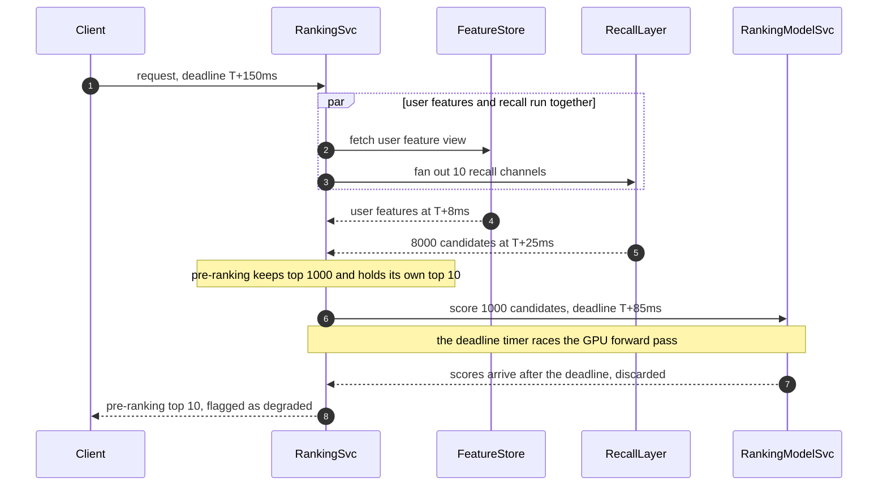

# 20 · 设计推荐/排序系统的在线推理（Ranking Service）

> 这题的题面是"怎么把最合适的 10 条内容推给用户"，考的却是**在一个固定的延迟预算里，把候选数和单条算力这两个乘数分配到四级漏斗上**。
> 漏斗不只是省钱手段。一个常用的起步启发是：**让各级的「候选数 × 单条算力」处在相近量级**，再用真实流量的延迟与质量曲线调参；它不是数学守恒定律。
> 还有一个几乎所有人都漏掉的量级事实：**这个系统差不多一半的延迟预算根本没花在跑模型上，花在搬数据上** —— 每请求 1,000:1 的特征读放大，扩容解决不了，只能靠架构消灭。

---

## 读这道题之前

**你在工作中遇到过这个**

你把精排模型从 6 层 MLP 换成 12 层，离线 AUC 从 0.741 涨到 0.745，评审一致通过。周二上午 10 点放量到 20%，服务端 p99 从 92 ms 涨到 214 ms，网关的 200 ms 超时开始生效，**18% 的请求被打到热门兜底列表**，整体 CTR 跌 2.1%。当天下午回滚。真正的代价在两周后才显形：兜底期间产生的 3,400 万条曝光全部进了训练集，下一版模型学会了"热门就是好"，长尾物料的曝光占比从 31% 掉到 19%，又花了三周做数据清洗和探索流量补采才拉回来。

**如果你是直接翻到这道题的**：下面三个问题是这题的地基。答不出，正文里每一句"延迟预算"都会读成黑话 —— 案例篇不再解释构件。

**先确认你能回答这三个问题**

1. 一个请求串行调用 5 个服务，每个服务 p99 都是 20 ms，端到端 p99 是 100 ms 吗？答不出 → 先读 [00-concepts §3 p50 / p90 / p99](../00-foundations/00-concepts.md#3-为什么平均值是骗人的p50--p90--p99)
2. 什么是近似最近邻（ANN）？它比精确最近邻快几个数量级，代价换的是什么？答不出 → 先读 [01-storage-engines §6 向量索引](../01-building-blocks/01-storage-engines.md#6-专项选读向量索引)
3. 一个 key 被 30% 的请求同时读会发生什么？为什么加分片不解决这个问题？答不出 → 先读 [02-caching §4 热点 Key](../01-building-blocks/02-caching.md#4-热点-keyhot-key)

**这道题会用到的构件**

| 构件 | 用在哪 | 详见 |
|---|---|---|
| 向量索引（HNSW / IVF）与 recall-latency 取舍 | §4.4 embedding 召回、索引重建 | [`01-storage-engines.md`](../01-building-blocks/01-storage-engines.md) §6 ｜ [`03-multi-tenant-vector-search.md`](03-multi-tenant-vector-search.md) §4、§6 |
| 超时预算与 deadline 传播 | §2.2 预算分解、§4.7 超时即放弃 | [`03-resilience-patterns.md`](../05-reliability/03-resilience-patterns.md) §2、§7 |
| 热点 Key 与本地缓存 | §4.5 item 特征本地化 | [`02-caching.md`](../01-building-blocks/02-caching.md) §4、§8 |
| 流式窗口聚合与 watermark | §4.6 近实时统计特征 | [`03-messaging-and-streams.md`](../01-building-blocks/03-messaging-and-streams.md) §6 |
| 静态稳定性（故障时不依赖控制面） | §4.7 兜底列表必须离线预生成 | [`03-resilience-patterns.md`](../05-reliability/03-resilience-patterns.md) §10 |
| Little's Law、分位数不可相加 | §2.2、§2.4 推容量与预算 | [00-concepts §2](../00-foundations/00-concepts.md#2-延迟吞吐并发--三个最常被混淆的词)、[§3](../00-foundations/00-concepts.md#3-为什么平均值是骗人的p50--p90--p99) |

**本题新引入的术语**

| 术语 | English | 一句话定义 |
|---|---|---|
| 召回 | candidate retrieval | 漏斗第一级：用廉价手段从千万级物料里挑出几千条候选。**注意它和指标"召回率 recall"是两个词** —— 本章用"召回"指阶段，用 `recall@K` 指指标 |
| 粗排 | pre-ranking | 漏斗第二级：用算得动几千条的轻模型把候选降到千级 |
| 精排 | ranking | 漏斗第三级：用几百个特征做交叉的重模型给千级候选打分 |
| 重排 | re-ranking | 漏斗第四级：在精排分数之上施加多样性、打散、业务与商业规则 |
| 双塔模型 | two-tower model | 用户侧和物料侧各过一个独立网络得到一个向量，打分就是两个向量的点积。因为物料向量可以离线算好存起来，所以它能对千万级物料做向量检索 |
| 特征取数 | feature fetch | 请求时把模型要的特征从在线存储读出来、拼成一个输入向量的过程 |
| feature view | feature view | 在线特征存储里一组可共同读取的特征。若客户端按 view 串行查询，view 越多通常往返越多；批量 API、并行读取或同 key 共置可以改变这个关系 |
| 训练/服务偏斜 | training-serving skew | 同一个特征，离线训练管道算出来的值和线上服务算出来的值不一致。典型表现是离线指标涨、线上指标不动或下跌 |
| 曝光日志 | impression log | 记录"这次请求给这个用户展示了哪些物料、在第几位、用的哪个模型版本"的日志。它是构造反馈样本的主键骨架，还要按时间窗关联点击/转化标签，并补齐当时的特征与采样概率 |
| 探索流量 | exploration traffic | 一小部分刻意不按模型最优排序的流量，用来采集没有被模型自身偏好污染的样本 |
| 兜底列表 | fallback list | 离线预先算好、不依赖任何在线链路的推荐结果，用于全链路故障时返回 |

**这道题的一句话本质**

> **在一个固定的延迟预算里，把候选规模与单条算力分配到漏斗各级，再用线上数据验证每一级是否值得存在。**
> 带着这句话往下读 —— 每见到一个组件就问一次："它是在花这个预算，还是在为省下这个预算做准备？"

---

## 0. 45 分钟怎么分配这道题

| 时间 | 做什么 | 这一段的得分点 |
|---|---|---|
| **0–3 min** | 问"硬延迟预算是多少、超时的请求算失败还是算降级"、"单目标还是多目标" | 这两个问题决定漏斗形状和精排出几个头。不问就是在赌 |
| **3–5 min** | 敲定规模（DAU、人均请求数、物料量）与非目标（不讲模型结构、不讲训练） | 明确说"我不设计模型，只设计服务这个模型的系统" |
| **5–10 min** | 算三个数：峰值 QPS、漏斗各级候选数、**每请求的特征读放大** | **1,000:1 是本题的枢纽**，它直接推出"item 特征不能跨网络取" |
| **10–14 min** | 画最简版本：单进程全量 GBDT 打分，说清它在什么规模撞墙 | 先给能工作的最简解。上来就画四级漏斗是负分 |
| **14–20 min** | 画目标架构 + **把 150 ms 预算逐项摊到表里** | 边画边报数字。预算表是这题最强的表达形式 |
| **20–26 min** | 深挖一：漏斗配比的工程启发（候选数下降、单条算力上升） | 核心是能用延迟和级间召回率说明为什么不是两级、不是五级 |
| **26–32 min** | 深挖二：特征取数的批量化与本地化（读放大 1,000:1 怎么消灭） | 说出"延迟由 feature view 数决定不由特征数决定" |
| **32–37 min** | 深挖三：分层降级（超时返回什么）+ **降级曝光必须打标** | 打标那一句是分水岭：它说明你想过反馈回路 |
| **37–41 min** | 深挖四（面试官挑一个）：多路召回合并 / 实时性 / 探索与冷启动 | 有余量就主动提名探索流量 —— 多数候选人完全不提 |
| **41–45 min** | 失败模式 3 条 + 撞墙信号 + 演进触发条件 | 给能配告警的指标（"粗排 recall@1000 < 0.85"），不要说"效果变差" |

**如果只剩 10 分钟**：跳过召回索引细节（一句"双塔向量召回，精确扫描还是 ANN 由同一 k 下的压测决定；多路配额合并"带过），把全部时间给 §4.1 和 §4.5。

---

## 1. 需求澄清

| # | 我会问 | 面试官通常怎么答 | 为什么决定架构 |
|---|---|---|---|
| 1 | **服务端硬延迟预算是多少？超时的请求算失败，还是允许返回降级结果？** | "150 ms p99，允许降级" | 决定要不要做分层降级、能不能重试。若是"超时即失败"，整个漏斗要缩一级 |
| 2 | **优化目标是单目标（CTR）还是多目标（CTR / 转化 / 时长 / 留存）？** | "多目标，权重可调" | 单目标 = 一个精排头；多目标 = 多头 + 融合公式 + 权重的在线调整通道，重排层复杂度差一个数量级 |
| 3 | 规模：DAU、人均请求数、可推物料量？ | 3,000 万 DAU、人均 20 次、1,000 万物料 | 决定漏斗每级的候选数与索引形态 |
| 4 | **新物料多久必须可推？** | "15 分钟内" | 决定向量索引是"全量重建"还是"增量插入 + 新品直通路" |
| 5 | 用户行为发生后多久必须影响推荐？ | "同一会话内立即，跨会话分钟级" | 决定要不要请求时读行为序列，以及要不要上流式聚合 |
| 6 | **有没有商业化流量（广告）与自然内容混排？** | "先不做" | 混排要求自然内容和广告有统一的价值口径，这是独立难题，会吃掉一半时间 |
| 7 | **有没有探索流量 / 随机桶？预算多少？** | "你定，说清代价" | 没有随机桶，无偏离线评估、倾向性加权、debias 训练全部做不了 |
| 8 | 单次请求返回多少条？分页怎么做？ | "一次 10 条，下拉再请求" | 决定已曝光去重的状态放哪（会话内 vs 跨会话），以及缓存能不能跨页复用 |

**不问就会做错方向的两个：#1 和 #2。**

- 不问 #1，你会按"尽量准"设计，然后被一句"我们的预算是 80 ms"推翻整个漏斗 —— 80 ms 装不下四级。不问 #2，你会用单个分数建模；一旦是多目标，精排要出 3–5 个头，重排要做加权融合与帕累托权衡，而且**融合权重是每周都在调的运营参数**，它必须能不发版就改。这个约束会反过来改变你的部署形态。

**本文假设**：3,000 万 DAU、人均 20 次排序请求/天、1,000 万可推物料、服务端 p99 硬预算 150 ms、允许降级、多目标（先按 CTR 讲，融合放 §4.1）。

---

## 2. 估算

### 2.1 请求量与漏斗形状

```
3,000 万 DAU × 20 次/天 = 6 亿次排序请求/天
  ÷ 86,400 = 6,940 QPS 均值 × 3（晚高峰集中）≈ 20,000 QPS 峰值
漏斗（每请求）：
  可推物料 1,000 万
    ├ 召回 10 路并行，索引裁剪后实际触达 ≈ 10 万条
    ├ 各路截断 + 合并去重          →  8,000 条
    ├ 粗排                          →  1,000 条
    ├ 精排                          →    100 条
    └ 重排（多样性 + 业务规则）      →     10 条曝光
```

### 2.2 延迟预算 —— 这题的骨架

**先说为什么必须逐项摊开**：分位数不能相加（[00-concepts §3](../00-foundations/00-concepts.md#3-为什么平均值是骗人的p50--p90--p99)），但**预算可以相加**。预算表是一份契约：每一级拿到多少毫秒，超了就自己降级，不许去借下一级的。没有这张表，线上必然出现"某一级偷偷占用了别人的预算，直到某天它抖动一下，全链路一起超时"。

| 阶段 | p99 预算 | 依据 |
|---|---|---|
| 网关 + 鉴权 + 请求解析 | 5 ms | — |
| **user 侧特征取数 ∥ 召回 10 路并行**（同时发出，取最慢） | 25 ms | user 侧一次 Redis 往返 p99 **2.5–3.0 ms**、p999 9–12 ms（[Tecton docs](https://docs.tecton.ai/docs/monitoring/online-serving)，持续更新）+ 拼装 ≈ 8 ms，被召回的 25 ms 完全盖住；ANN 一路 p99 约 12 ms，每路独立超时 20 ms，超时即丢不等 |
| 合并 / 去重 / 过滤（已看、黑名单、权限） | 7 ms | Roaring bitmap 交并差 |
| **粗排** 8,000 → 1,000 | 8 ms | 进程内 item 向量，纯 CPU 向量化 |
| item 侧特征拼装（1,000 条） | 5 ms | **进程内驻留，零网络往返**（跨网络的代价见 §4.5） |
| **精排** 1,000 → 100 | 35 ms | GPU 前向 10 ms + 排队 / 主存到显存拷贝 / 序列化 25 ms |
| **重排** 100 → 10 | 5 ms | 多样性重排 + 业务规则（§4.1 有算力口径） |
| 响应序列化 + 曝光日志（异步投递） | 4 ms | 日志走本地 agent，**绝不同步等落盘** |
| **小计** | **94 ms** | |
| 预留（GC 停顿、网络重传、抖动） | 56 ms | 约 37% 余量，低于 30% 时 p99 会随机穿透 |
| **服务端 p99 硬预算** | **150 ms** | |

**这张表最反直觉的地方是它的分组**：真正在跑模型的只有 **48 ms**（粗排 8 + 精排 35 + 重排 5），另外 **46 ms** 全部花在取数、检索、去重、序列化上 —— 几乎对半分，而多数人本能地以为模型占九成。

> **面试金句**
> "漏斗不是'为了省钱把模型变小'。一个好用的起点是让各级计算量处在相近量级，再用级间召回率和线上延迟调参。把预算摊开后你常会发现，很多时间没花在模型上，而在搬数据上。这就是为什么这题先问特征放哪，再问模型选哪个。"
> "The funnel is not merely about shrinking models to save money. A useful starting heuristic is to keep stage-level compute in the same order of magnitude, then tune with inter-stage recall and production latency. Once the budget is itemized, data movement often consumes as much attention as model execution. That is why feature placement comes before model choice."

### 2.3 特征读放大 —— 这题的枢纽数字

```
每请求要取的特征实体数：user 侧 1 个 + item 侧 1,000 个（进精排的候选）
  ⇒ 读放大 = 1,000 : 1
若 item 特征走在线 KV：
  20,000 QPS × 1,000 = 2,000 万 key 读/s
  Redis 单分片约 18,000 QPS（cache.m5.2xlarge 量级，Tecton 口径）
    ⇒ 需 1,100+ 个分片，只为读 item 特征        ← 这里就该停手了
  每条 item 特征 500 B（32 个统计量 + 64 维 FP16 向量 128 B + 类目/标签）
    ⇒ 500 KB/请求 × 20,000 QPS = 10 GB/s = 80 Gbps 跨网络流量
```

**推论 1**：**item 侧特征不能在请求时跨网络取。** 这不是"优化"，是可行性边界 —— 1,100 个 Redis 分片和 80 Gbps 内网流量都不是加钱能解决得优雅的东西。
**推论 2**：**但这份数据并不大。** 1,000 万物料 × 500 B = **5 GB**；再加 1,000 万 × 64 维 FP16 向量约 **1.28 GB**，精确扫描方案合计约 **6.3 GB**（还要另算进程、临时缓冲与双版本余量）。若改用 HNSW，还要加上受 M 和实现影响的图结构。这个场景可以先验证每台排序服务器全量驻留，避免请求时跨网络取 item 特征。
**推论 3**：user 侧只有 1 个实体，约 20,000 次逻辑读取/s，容量比 item 侧小三个数量级。需要几个 Redis 分片仍要按单分片压测吞吐、热点、内存、故障余量和副本拓扑计算；不能只凭平均 QPS 写死为 2 个。

### 2.4 算力与成本

```
CPU：每请求 CPU 时间 ≈ 粗排 8 + 合并去重 7 + 拼装 5 + 重排 5 = 25 ms
  20,000 QPS × 25 ms = 500 core·s/s = 500 核 ÷ 32 核/台 = 16 台，留 2× 余量 → 32 台
GPU：batch=1,000 的一次前向，L4 量级卡上实测 8–15 ms（2026 量级，随模型结构变化极大）
  取 10 ms → 20,000 × 10 ms = 200 张满载，留 2× 余量 → 400 张 × $0.7/h × 730 h ≈ $204k/月
曝光日志：20,000 QPS × 10 条 × 200 B = 40 MB/s ≈ 3.5 TB/天（zstd 后 700 GB/天）
  一年累计 250 TB × $0.023/GB/月 ≈ $6k/月

合计 ≈ $225k/月 ≈ $2.7M/年，摊到 180 亿请求/月 = $12.5 / 百万请求
每请求 10 条曝光，千次曝光收入（eCPM）量级 $2–10 ⇒ 每百万请求收入 $20k–100k
  ⇒ 推理基础设施占收入 0.01%–0.06%
```

**推论 4**：**成本不是这题的约束，延迟才是。** 精排候选从 1,000 加到 2,000，多花的钱不到收入的万分之一，但它要吃掉 35 ms 里的另外 25 ms —— 你没有这 25 ms。所以本题任何取舍的理由都必须是"延迟预算"或"效果"，**用"省 GPU"当理由是掉分的**。反过来也成立：把精排候选砍到 500 省下的钱不值一提，只有当你要把这 15 ms 挪给别的级时才该做。

---

## 3. 高层设计

### 3.1 先给最简单能工作的版本（物料 5 万，500 QPS）

```
 客户端 ──► Ranking Svc（单进程）
              │ ① 全量取 5 万条 item（进程内数组，启动时加载）
              │ ② 规则过滤（已看 / 下架 / 权限）→ 约 3 万条
              │ ③ GBDT 全量打分（每条 ~2 µs）→ 3 万 × 2 µs = 60 ms
              │ ④ 排序取 top 10 + 类目打散
              └─► Postgres（物料元数据）+ Redis（用户已看 bitmap）
```

**它能撑到哪**：物料 5 万、QPS 500 时 p99 约 90 ms，一台机器搞定，**没有召回、没有粗排、没有 ANN**。撞墙信号三个，任一出现就走 v1：物料量 > 20 万；或**每请求过滤后候选 > 5 万且打分耗时占预算 > 60%**；或需要个性化 embedding（GBDT 吃不下 64 维稠密向量的交叉）。

### 3.2 目标架构（20,000 QPS，1,000 万物料）

```
 客户端 ─► API GW ─► Ranking Svc ×32   每台常驻：item 特征 5 GB + item 向量 1.28 GB
                          │
    ┌─────────────────────┼──────────────────────┐
    ▼                     ▼                      ▼
 User Feature Store   Recall ×10 路并行      Behavior Svc      ┌───────────────┐
 Redis ×2 分片         每路独立超时 20 ms     最近 50 条行为    │ Fallback Store│
 1 个 feature view     双塔 ANN / 实时 i2i /  p99 < 10 ms      │ 每用户 200 条 │
 p99 3 ms              倒排 / 社交 / 离线 CF /                  │ TTL 24 h      │
                       运营池 / 新品直通 / 探索池 / 热门兜底     └───────┬───────┘
                          │                                            │
                          ▼                                            │ 全链路故障时
     合并 → 去重(item_id + 内容指纹) → 过滤(已看 bitmap)  8,000 条      │ 直接读
                          ▼                                            │
     粗排（双塔点积 + 少量交叉，CPU 向量化，8 ms）        1,000 条 ─────┘
                          ▼
     Ranking Model Svc（GPU ×400，request-level 动态批处理）  100 条 × 多目标分数
                          ▼
     重排（MMR 多样性 + 打散 + 业务规则 + 融合权重）           10 条
                          ▼
     响应 ─┬─► 客户端     └─► 曝光日志 ─► 本地 agent ─► Kafka ─► 特征日志/样本/指标

 离线·近线（不在请求路径上）：物料入库 → 内容 embedding → 更新版本化向量快照（新品走直通路，15 min 可推）
   行为流 → 流式窗口聚合（近 1h/24h CTR）→ item 特征增量推送（端到端 p99 约 10 s 量级）
   曝光日志 + 标签 → 训练样本 → 日级重训 → 影子比对 → 灰度放量
```

**数据流的四条边界**：①**请求路径上没有任何"取全量 item 特征"的远程调用** —— item 特征和向量索引都在排序服务的进程内存里，靠近线管道推送更新，这是 §2.3 三条推论的直接落地；②**每一路召回都可以整路失败**（独立超时 20 ms，超时即丢，其它路按配额补位），任何一路都不是必需的，除了兜底路；③**曝光日志提供样本主键与决策上下文**，还要关联后续标签，并记录当时实际使用的特征值、模型版本和采样概率，不能只靠事后回溯拼接（理由见 §4.6）；④**兜底列表离线预生成、独立存储、不依赖排序链路上任何一个组件** —— 这是静态稳定性（故障时不依赖控制面，见 [`03-resilience-patterns.md`](../05-reliability/03-resilience-patterns.md) §10）在这题上的形态。

---

## 4. 深挖

### 4.1 漏斗配比：从启发式起步，用数据收口

**问题**：1,000 万物料，精排模型每条约 1 ms（单条串行口径）。全量打分 = 1,000 万 × 1 ms ≈ **2.8 小时/请求**。所以必须分级。但分几级、每级留多少条，不是拍的。

| 级 | 输入 | 输出 | 单条算力预算 | 该级耗时 | 模型形态 |
|---|---|---|---|---|---|
| 召回 | 1,000 万（索引裁剪后触达 10 万） | 8,000 | ~0.25 µs | 25 ms（10 路并行取最慢） | 倒排扫描 / ANN 图遍历 / 离线表查 |
| 粗排 | 8,000 | 1,000 | ~1 µs | 8 ms | 双塔点积 + 少量交叉特征 |
| 精排 | 1,000 | 100 | ~10 µs（批处理摊薄后；单条串行口径约 1 ms） | 10 ms GPU | 几百个特征交叉的深度模型 |
| 重排 | 100 | 10 | ~50 µs | 5 ms | 规则 + 多样性（MMR：每选一条就对与已选内容相似的候选降权；DPP：直接对整个集合的"多样程度"建模） |

**工程启发看出来了**：候选数逐级下降，单条算力逐级上升，**各级耗时先放在 5–25 ms 的相近量级**。这只是预算设计的起点，不是必须相等的守恒律；最终要用每一级的边际质量收益、级间 recall、排队时间和端到端 p99 决定留多少候选。

**为什么不是两级**：去掉粗排，精排要吃 8,000 条 → 8,000 × 10 µs = **80 ms**，超出它 35 ms 预算的 2.3 倍。
**为什么不是五级**：每加一级的固定代价是 3–5 ms（候选传递 + 特征拼装）+ 一个要独立训练、独立监控、独立回滚的模型 + 一处新的**级间目标不一致**。

**级间不一致是漏斗的系统性损失，而且它可测**：粗排的目标函数和精排不同，它会把"精排本来会给高分"的候选提前砍掉。可观测指标叫**粗排召回率**（pre-rank recall@1000）：把粗排输出临时放大到 3,000 条，看精排 top-100 里有多少来自原来 1,000 之外。

```
pre-rank recall@1000 = |精排(top1000) ∩ 精排(top3000)的前 100| / 100
  > 0.95 粗排足够强，加算力浪费 ｜ 0.85–0.95 健康 ｜ < 0.85 粗排是瓶颈 ——
  这是全系统加算力最划算的地方，比把精排从 12 层加到 16 层的收益高一个数量级
```

**多目标怎么落在这四级上**：精排出 3–5 个头（pCTR、pCVR、预估时长 pWatch、举报率 pReport），重排做融合 `score = pCTR^α · pCVR^β · (1+pWatch)^γ / (1+pReport)^δ`。**关键工程约束是 α/β/γ/δ 必须能不发版就改** —— 它们是每周都在调的运营参数，走配置中心 + 灰度，生效延迟目标 < 5 分钟。把它们编译进模型是这题最常见的架构错误之一。

**一个必须说清的界限**：这里的批处理是 **request-level dynamic batching**（一次请求里的 1,000 个候选天然构成一个 batch，跨请求再攒批由服务框架做）。它**不是** LLM 的 iteration-level continuous batching（每生成一个 token 之后就重新组批，让先结束的序列腾出槽位 —— 见 [`../04-ai-agent-systems/01-llm-serving-infra.md`](../04-ai-agent-systems/01-llm-serving-infra.md) §3）：排序模型没有自回归解码，也就没有"同批最长序列拖死所有人"这个问题。参数调法也不同 —— 非 LLM 场景官方给的方法是**沿延迟预算逐步加 `max_queue_delay`**，而不是设一个大值（[Triton batcher 文档](https://github.com/triton-inference-server/server/blob/main/docs/user_guide/batcher.md)，持续更新；`preferred_batch_size` 官方明说大多数模型不该设置）。完整的服务层设计见 [`18-model-serving-platform.md`](18-model-serving-platform.md)。

### 4.2 延迟预算的执行：超时即放弃，不是超时即重试

**问题**：预算表写在文档里没用，得有机制强制它。排序请求的价值随延迟**单调递减到零** —— 用户已经在看下一屏了，200 ms 后返回的完美排序和返回错误没有区别。这推出三条硬规则：

1. **过载时不重试。** 对瞬时网络错误，只有在调用幂等、剩余 deadline 足够且重试预算未耗尽时，才允许至多一次重试。对冲请求（hedged request）也不是免费保险：只应在尾延迟主要来自个别副本、系统有冗余容量、能取消败者且严格计入额外负载时使用；持续排队或 GPU 饱和时应准入控制并降级（[`03-resilience-patterns.md`](../05-reliability/03-resilience-patterns.md) §3、[`../08-ml-systems/04-online-inference.md`](../08-ml-systems/04-online-inference.md)）。
2. **deadline 随请求传播，每一跳只减不加。** 召回路拿到的不是"20 ms 超时"，是"绝对时间戳 T+45ms"；中间任何一跳堆积，下游自动拿到更少的时间并直接降级。
3. **每一级都必须能在自己的预算内产出"能用的东西"**，哪怕质量下降 —— 这是分层降级（§4.7）的前提，也是下面这张图的全部内容。

下面这件事 ASCII 画不出来：粗排结果和精排调用在时间上是**重叠**的，而降级判定发生在一个和精排竞速的定时器上，谁先到谁赢。这个竞速窗口正是"粗排结果必须留着不能丢"的原因：



> 📖 **读图要点**：第 2 步和第 3 步在同一个 `par` 块里同时发出，所以 user 特征取数的 8 ms **不叠加**在召回的 25 ms 上 —— 这正是预算表把它们合成一行的原因。真正决定成败的是第 5 步之后那条 `Note`：**粗排把 1,000 条送进精排之前，已经先算出并留住了自己的 top 10**，所以第 7 步精排的结果迟到被丢弃时，第 8 步能立刻返回而不是等待或报错。图里没有任何一条"精排超时后重新调用粗排"的边 —— 那要多花 8 ms，而此刻预算已经是负数。

### 4.3 多路召回的合并与去重：跨路分数不可比

**问题**：10 路召回各返回一批候选，原始分数的量纲完全不同 —— ANN 路给余弦相似度 [0,1]，协同过滤路给共现次数，热门路给曝光量，运营池给人工权重。**未经校准就归一化后混排是错的**（归一化只是把不可比藏起来）。本文采用容易解释的**配额（quota）+ 粗排统一打分**：每路按配额截断，合并后一律由粗排重新打分，召回分数只在路内截断。数据与标注足够时，也可以学习跨路校准或融合模型，但仍要保留供给、多样性和探索约束。

```
  ANN 长期兴趣 2,000 ┐                    ┌─► ① item_id
  实时 i2i     1,500 │                    ├─► ② 内容指纹 simhash 64 位（海明距离 ≤3）
  标签倒排     1,200 │                    └─► ③ 已看 bitmap（Roaring，约 2 KB/用户）
  社交关系       800 ├─► 合并 ~10,500 ─► 去重 −18% ─► 过滤（黑名单/权限/地域）
  离线 CF      1,500 │                                        ↓
  运营池 + 新品 1,100│                                     8,000 条 ──► 粗排
  探索池         400 │      总配额 10,500 > 目标 8,000，因为去重会砍掉约 18%
  热门兜底     2,000 ┘
```

**去重的三个层次，只做第一层是不够的**：

| 层次 | 键 | 抓得住什么 | 代价 |
|---|---|---|---|
| item_id | 主键 | 同一条内容被多路召回 | 0 |
| **内容指纹（simhash 64 位）** | 内容哈希 | **转载、搬运、同一视频不同上传者** —— 用户视角这就是重复 | 先按指纹分桶/多索引探测近邻，再对小桶计算海明距离 ≤3；不能对 8,000 条做全量两两比较 |
| 作者 / 系列打散 | author_id | 同一作者连续占屏 | 放在重排层做，不在去重层 |

**配额不是常数，是随场景变的**：新用户 ANN 路配额几乎为 0（没有兴趣向量），探索池和热门路提到 40%；老用户反过来。**配额表必须是配置，不是代码** —— 和融合权重同理（§4.1）。**一路挂了**其它路按配额比例自动补位，不阻塞；可观测信号是**每路 candidate_count 的 p50 突然掉到 0**（索引在重建或数据源挂了），这个告警比"CTR 下降"早 30 分钟到几小时。

### 4.4 embedding 召回：索引形态与版本成对性

**问题**：从 1,000 万物料里按向量相似度取 top 2,000，预算 12 ms。

| 方案 | 内存 | p99 | recall@2000 | 撞墙条件 |
|---|---|---|---|---|
| 暴力扫描（brute force） | 1.28 GB | 1,000 万 × 64 维点积 ≈ 25 ms（AVX-512 单核）；多核切分到 8 核 ≈ 4 ms | 1.0 | 物料 > 5,000 万，或核数要留给粗排 |
| HNSW（`efSearch ≥ k=2,000`） | 1.28 GB 向量 + 图结构（受 M 与实现影响） | **必须按目标 k 压测** | 由数据、M、efSearch 决定 | `efSearch` 应不小于返回数 k；因此不能拿 ef=64/128 的 top-k 小样本数据外推到 top-2000 |
| IVF-PQ（量化） | 约 0.2 GB | 4–6 ms | ≈ 0.85 | 精度损失在长尾物料上更严重，且 nprobe 调参敏感 |

**本文先选向量化暴力扫描**：按表中的场景压测，8 核约 4 ms 且 recall=1.0，已经满足 12 ms 预算。目录继续增长、CPU 要让给粗排，或实测全量扫描越过预算时，再比较 HNSW（`efSearch ≥ 2,000`）和 IVF-PQ；延迟与 recall 必须在同一数据集、同一 k 上重测。真正致命的是下面这个：

**embedding 版本必须成对切换。** 用新模型算出的 user 向量去查用旧模型建的 item 索引，结果是**几何上有意义但语义上是随机的** —— 不报错、不超时、不触发任何服务级告警，只是推荐质量静默塌掉。这是这一节唯一会写进故障复盘的东西。

三条防线：①**向量带版本号**，检索时校验 `user_vec.model_version == index.model_version`，不匹配走降级路而不是硬查；②**双版本并存 + 原子切换**（新向量快照或 ANN 索引准备好、影子比对通过后切换指针，旧版留作回滚；精确扫描时纯向量约 1.28 GB → 2.56 GB，ANN 还要另算双份图结构）；③**检测信号是召回路 top-1 相似度分布的突变** —— 正常时它稳定，版本错配时整体下移且方差变大，比等 CTR 掉下来更早。索引重建与增量的完整取舍（墓碑、over-fetch、embedding 升级的成本账）见 [`03-multi-tenant-vector-search.md`](03-multi-tenant-vector-search.md) §6。

**新物料 15 分钟可推**怎么做到：靠**新品直通召回路** —— 新物料入库后先进一个按时间排序的小向量集合（几万条，需压测精确扫描延迟）并带强制曝光配额，等下一版主向量快照发布，或在采用 ANN 时完成增量插入。两条路并存，新品既不用等整版发布，也不会因为统计特征全是 0 而被粗排一刀砍掉。

### 4.5 在线特征取数：把 1,000:1 的读放大消灭掉

**问题**：§2.3 已经算出来了 —— item 侧走在线 KV 需要 1,100+ 个 Redis 分片和 80 Gbps 内网流量。

| 方案 | 每请求跨网络字节 | 全局 KV QPS | p99 增量 | 撞墙条件 |
|---|---|---|---|---|
| A. 全部走在线 KV | 500 KB | 2,000 万次逻辑 key 读/s | +25–60 ms | 分片数 > 100 就该停手；批量读取能减少往返但不会消除字节量、分区吞吐与热点约束。DynamoDB 的限制按分区容量单位计，不应简化成“单 key 3,000 QPS” |
| B. 本地 LRU + 远程回源（命中 85%） | 75 KB | 300 万 key/s | +8–15 ms | 命中率随物料量增长而下降；发版后缓存空窗期会打穿后端 |
| **C. 全量进程内驻留（本文）** | **0** | **0** | **+0** | **物料量 × 单条字节 > 单机内存的 1/3**。本文 5 GB 安全；10 亿物料时 500 GB，失效 |

**选 C。** 更新通路是近线推送：流式聚合作业每分钟把变化的 item 特征增量推给所有排序服务器（20,000 条变化/分钟 × 500 B = 10 MB/分钟，不含协议、重试和多副本开销）。**代价说清楚**：①本文精确扫描方案至少要加载约 6.3 GB 特征与向量，另加运行时和双版本余量；扩容时新实例加载完成并通过校验后才能进负载均衡（40–90 s 只是场景估计，需实测）；②特征更新不是强一致，各台机器之间可能差几十秒 —— 统计类特征可按新鲜度 SLO 接受，对"下架"这类权威状态必须走强一致的过滤通道（如版本化黑名单 bitmap），不能当普通特征处理。

**三条通用规则，与物料规模无关**（在线特征存储本身怎么建、时间点正确性怎么保，见 [`19-feature-store.md`](19-feature-store.md)）：

1. **延迟通常更受物理读取次数与串并行方式影响，而不是特征列数本身。** 10 个特征分散在 5 个独立 key/view 且串行读取，最多会形成 5 次往返；批量 API、并行读取或把同生命周期的数据共置到一个 Redis hash，都可能减少往返。是否把 4 个 view 合并，要同时考虑更新频率、权限边界、载荷大小和压测结果，不能只看 view 数（[Feast 文档](https://docs.feast.dev/how-to-guides/online-server-performance-tuning)，持续更新）。
2. **重变换搬到写入侧。** 请求路径只做拼装不做计算：把 on-demand 变换预物化到在线存储，读路径的计算直接清零；确实要在请求时算的，用原生 Python 而不是 pandas —— 后者把向量化框架的固定开销压到了单行请求上，实测差 **3–10×**（[Feast blog](https://feast.dev/blog/feature-transformation-latency/)，2025-01-14）。
3. **给单请求设字节上限和后端超时。** Tecton 文档里的 2 MB / 2 s 可视为后端产品边界，不是本文 150 ms 请求的可用预算；这里应从剩余 deadline 倒推，例如给 user 特征 10–20 ms 量级，并用压测决定载荷上限。下游超时必须小于调用者剩余 deadline。

> **面试金句**
> "这题的枢纽数字是每请求的特征读放大：一个用户，一千个候选，1,000:1。你不能靠加 Redis 分片解决它 —— 那要一千一百个分片和八十 Gbps 内网流量。你只能靠把 item 侧特征搬进排序服务的进程内存把它消灭掉。而一算就会发现，全部一千万物料的特征只有五个 GB，从一开始就没必要跨网络。顺便说一句，很多人以为在线特征的延迟由特征个数决定 —— 不是，是由 feature view 的个数决定的，因为那是几次网络往返。"
> "The hinge number here is the feature read amplification per request: one user, a thousand candidates, a thousand to one. You can't fix that by adding Redis shards — that would take eleven hundred shards and eighty gigabits of internal traffic. You fix it by moving item-side features into the ranker's own process memory. And once you do the math, all ten million items come to five gigabytes. It never needed to be a network call. One more thing people get wrong: online feature latency isn't driven by how many features you fetch — it's driven by how many feature views, because that's how many round trips you make."

### 4.6 实时性：用户行为发生后多久能影响推荐

**问题**：这是产品最常问、工程最容易含糊的一个问题。正确答法是**拆成四条独立的通路，每条给一个数字和一个代价**。

| 通路 | 生效延迟 | 怎么做 | 代价 / 风险 |
|---|---|---|---|
| **请求时读行为序列** | **50–200 ms**（下一次请求即生效） | 排序服务同步调行为服务取最近 50 条交互 | 每请求 +1 次 RTT（预算里的 8 ms 之外还要 5–10 ms）；序列一长就撑爆特征字节预算 |
| **流式窗口聚合** | **5–30 s** | 行为流 → 窗口聚合近 1h/24h 的曝光/点击 → item 特征表 → 推给排序服务 | 需要流式作业 + 状态存储；乱序与 watermark 处理（[`03-messaging-and-streams.md`](../01-building-blocks/03-messaging-and-streams.md) §6）。参考量级：Pinterest 实时用户信号摄入 120 万 events/s、端到端 p99 约 **10 s**（2019-12-05，年代久，需折算） |
| **增量训练 / 在线学习** | **15 min – 数小时** | 用最新样本做增量更新，只更新 embedding 表或最后几层 | 训练/服务偏斜风险剧增；模型回滚变成"回滚到哪个增量步"，几乎无法精确复现 |
| **全量重训** | **6–24 h** | 日级全量 | — |

**默认只上前两条。** 第三条是很多团队踩的坑：在线学习看起来能"秒级响应"，实际带来的是不可复现的模型状态和无法定位的效果波动，而它相对"请求时读行为序列 + 流式统计特征"的增量收益，在大多数场景下只有个位数百分比。

**训练/服务偏斜是这一节的真正杀手。** 同一个特征"用户近 7 日点击率"，离线用当天全量日志算（看得到当天全部行为），线上只能看到请求那一刻之前的数据 —— 训练时模型看到了未来。表现是离线 AUC 持续改善、线上不动或下跌。四条防线，按性价比排序：

1. **服务端特征日志（feature logging）—— 最直接的偏斜防线之一。** 线上把实际喂给模型的特征向量 + 预测结果 + request_id 一起落盘，下一轮训练按时间窗关联标签。它避免“离线重算与线上取值不一致”，但日志丢失、标签归因、采样偏差和上游定义错误仍会造成偏差，不能宣称把 skew 归零。代价是日志量：1,000 条候选 × 500 B 太大，只记进入精排的 100 条 → 20,000 QPS × 100 × 500 B = 1 GB/s；若采样到 10%，必须同时记录采样概率，训练时再校正。
2. **逐条比对流水线**：把线上 fetch 日志（key + 时间戳）当作离线回填的左表重新算一遍，逐条比线上实际取值。检测三件套：**每日精确匹配率 / 差值均值 / 差值 P99**（Nubank 的做法，[building.nubank.com](https://building.nubank.com/dealing-with-train-serve-skew-in-real-time-ml-models-a-short-guide/)，2023-06-27）。
3. **上线前硬门禁**：特征的缺失值填充逻辑（NULL 还是 0）在训练和服务两侧必须逐字相同 —— Uber 把这条做成了部署前的硬门禁（[Uber 工程博客](https://www.uber.com/us/en/blog/raising-the-bar-on-ml-model-deployment-safety/)，2025-10-30）。看起来琐碎，但 NULL/0 混淆是公开材料里排前三的偏斜成因。
4. **别把 skew 当 drift 做**（成因分类与检测闭环见 [`../08-ml-systems/06-feature-and-data.md`](../08-ml-systems/06-feature-and-data.md)）：偏斜（skew）比较训练与服务两条管道在相同实体、相同时间点的值；漂移（drift）则至少同时比较**训练/发布基线**与**近期季节性基线**。只看上一个时间窗会把缓慢漂移和周期变化混在一起。

### 4.7 降级：超时了到底返回什么

**问题**：预算表里每一级都可能超时。"返回 500"是最差的答案 —— 用户刷不出内容的成本远高于看到一个次优排序。

| 级别 | 触发条件 | 返回什么 | CTR 相对损失（量级，需自测） | 必须满足 |
|---|---|---|---|---|
| **L0** 正常 | — | 精排 top 10 | 0 | — |
| **L1** 精排超时/熔断 | 精排未在 deadline 前返回 | **粗排 top 10**（§4.2 已在内存里留好） | −5% ~ −12% | 粗排结果不能在送进精排后丢弃 |
| **L2** 特征取数超时 | user feature store 超时 | 用本地缓存的**陈旧 user 特征**打分（stale-while-error） | −2% ~ −6% | 本地必须缓存上一次成功的特征，带时间戳，超过 30 min 视为无效 |
| **L3** 单路召回超时 | 某路 > 20 ms | 丢弃该路，其它路按配额补位 | −1% ~ −3%（**探索路丢弃几乎无损，实时 i2i 路丢弃损失最大**） | 每路独立超时，不共享 |
| **L4** 全链路故障 | 排序服务不可用 | **兜底列表**：离线预生成、每用户 200 条、TTL 24 h | −20% ~ −35% | 独立存储、独立部署、离线预生成 |
| **L5** 连兜底也没有 | 新用户 / 兜底过期 | 全局热门 + 类目打散 | −40% 以上 | 静态文件，进程内常驻 |

**三条规则，每一条都是独立的评分信号**：①**降级是有序的、可观测的、可演练的** —— 每个级别一个计数器加一条告警线（如 `L1 占比 > 3% 持续 5 分钟`）；"优雅降级必须提前定义降级到什么"（[`03-resilience-patterns.md`](../05-reliability/03-resilience-patterns.md) §7），没定义的降级在生产里一律表现为超时。②**兜底列表必须离线预生成**，故障时现算意味着依赖一条你正在救的链路。

③**降级产生的曝光必须打标，并由训练策略显式处理。** 不能一律直接丢弃：剔除会改变样本分布，也可能浪费真实反馈。可按用途选择排除、降权、单独建模，或在记录了曝光概率时做倾向校正；关键是不能把降级策略当作正常模型决策混入。开头事故展示的是一种退化反馈回路：模型只推热门 → 用户只能消费热门 → 训练数据更热门 → 长尾坍塌。可观测指标包括**长尾覆盖率、平均热度排名、曝光基尼系数**。

### 4.8 探索与冷启动：为什么必须花掉这部分 CTR

**探索的成本是确定的，收益是延后的**，所以它永远是第一个被砍的东西 —— 然后半年后你会发现离线评估全部不可信。

| 探索形式 | 流量代价 | 换来什么 | 什么时候必须有 |
|---|---|---|---|
| **全随机桶**（一小撮用户完全随机排序） | 桶内 CTR 可能显著下降；幅度必须实测 | 在随机化假设成立、曝光概率已记录时，提供低偏差评估与 IPW 数据。也可用受控位置探索或已知 propensity 的随机策略降低代价 | 需要评估未被现有策略充分覆盖的候选时 |
| **位置级探索**（只在第 5、9 位注入随机） | 全局 CTR −0.3% ~ −1% | **位置偏差**（同一物料放第 1 位比放第 10 位点击率高数倍，与它好坏无关）的估计 + 一部分无偏样本 | 默认就该有 |
| **新物料曝光配额**（每条新物料保证 N 次曝光） | 全局 CTR −0.5% ~ −1.5% | 新物料能积累统计特征，否则永远进不了漏斗 | 物料每天新增 > 1% 的时候 |
| **Bandit（Thompson / LinUCB）** | 理论上最优 | 自适应分配探索预算 | **多数排序系统上不了** —— 它要求在线更新后验参数，与批式训练的模型栈不兼容。工程上通常退化成上面三条 |

公开材料里 Booking.com 明确表示保留了 exploration budget，但**未披露具体比例**（2025-05）—— 这是行业普遍不公开的数字，面试里给"1%–5% 量级、按目标是评估还是训练分开设"比给一个精确数字更可信。

**新物料冷启动的可执行做法**：统计特征全是 0 的物料会被粗排一刀砍掉，所以要给**先验** —— 用同类目物料的历史 CTR 做贝叶斯平滑：

```
smoothed_ctr = (clicks + α) / (impressions + α + β)
  α/(α+β) = 该类目历史 CTR（先验均值），α+β = 先验强度（等价样本量），取 200–1,000
  0 次曝光 → 拿类目均值 ｜ 200 次 → 自身数据与先验各半 ｜ 5,000 次 → 先验失效
  太小（20）：前几十次曝光的随机波动被当成信号，新物料忽上忽下
  太大（1 万）：新物料要几周才能出头，等价于没做冷启动
```

**新用户冷启动**：没有行为序列 → ANN 路配额降到 0，探索池和热门路配额提到 40%；用注册信息 + 设备 + 地理做粗粒度画像。关键指标不是新用户的首屏 CTR（那个指标会诱导你只推爆款），而是**新用户前 10 次请求的类目覆盖数** —— 你要在前几次交互里把这个用户的兴趣空间探出来，这是一个显式的探索目标，不是排序目标。

### 4.9 什么时候这整套方案是错的

| 场景 | 为什么本文方案错 | 应该做什么 |
|---|---|---|
| 物料 < 2 万、DAU < 10 万 | 四级漏斗、ANN、GPU 全是净复杂度。全量打分 2 万条 × 2 µs = 40 ms，一台机器够 | §3.1 的单进程版本：全量 GBDT + 规则打散 |
| **强时效资讯**（物料半衰期 2 小时） | 离线协同过滤表和 embedding 索引在生成时就已经过期；个性化的边际收益低于时效性 | 以流式热度 + 内容 embedding 为主，弱化个性化；漏斗压成两级 |
| **强合规 / 需可解释**（信贷产品推荐、医疗内容） | 深度精排给不出理由，监管要求逐条说明为什么推给这个人 | 线性模型 / GBDT + 特征重要性归因；牺牲的效果换的是可审计性 |
| **单坑位场景**（如一次只出 1 条广告） | 重排和多样性整层消失，且延迟预算通常是 100 ms 的**硬约束**（超时的请求价值为零，不是降级） | 模型和特征全部内存驻留，消灭所有远程调用，降级到本地默认值 |
| **供给极度稀缺**（B2B 撮合、小众垂类） | 候选池只有几百条，排序质量的边际收益远低于供给增长 | 工程投入放在供给侧和探索上，排序用规则就够 |

**一条通用判据**：当**粗排召回率 recall@1000 > 0.95** 且**精排候选从 1,000 减到 500 的线上 CTR 损失 < 0.3%** 时，你的漏斗比业务需要的深 —— 砍掉一级，把省下的预算给召回的多样性。

---

## 5. 失败模式

| 故障 | 影响 | 检测信号 | 应对 / 降级到什么 |
|---|---|---|---|
| 精排 GPU 排队 | p99 出现双峰（命中批的快、等下一批的慢），均值不变 | **队列深度**，不是 GPU 利用率 —— 满载实例的 CPU 接近 idle，按 CPU 扩容永远不会触发 | 按队列深度扩容；超预算直接走 L1 降级 |
| user feature store 抖动 | 全量请求 p99 抬升 8 → 40 ms | feature fetch p99、超时率 | L2 降级：本地陈旧特征（≤30 min）；单次取数超时 20 ms 即放弃 |
| 某路召回索引重建中返回空 | 该路候选 0，多样性坍塌，长尾曝光骤降 | **每路 candidate_count 的 p50** 掉到 0 | 其它路按配额补位；这个告警比 CTR 下降早数小时 |
| **embedding 版本错配** | 召回结果语义随机，**零报错、零超时** | 召回路 **top-1 相似度分布**整体下移且方差变大 | 向量带版本号，检索前校验；双索引并存 + 原子切换回滚 |
| 训练/服务偏斜 | 离线 AUC 持续涨、线上 CTR 不动或跌 | 特征逐条比对的每日精确匹配率 < 99%；差值 P99 突变 | 特征日志作为训练样本源；上线前偏斜门禁 |
| **降级曝光污染训练集** | 若把策略选择当正常模型决策，可能学成“热门就是好”、长尾坍塌 | 长尾覆盖率、平均热度排名、曝光基尼系数 | 曝光带降级策略与 propensity；按用途排除、降权、单独建模或校正，并用探索流量补覆盖 |
| 全站爆款 item 成为热 key | 若 item 特征在远端 KV，单 key 可能打热所在分区或缓存节点 | 单 key QPS、分区消耗容量与 throttling | 本文方案天然免疫（进程内驻留）；方案 B 需要本地缓存 + 多副本（[`02-caching.md`](../01-building-blocks/02-caching.md) §4） |
| 新模型分数分布漂移 | 排序相对关系没变但绝对分数变了 —— 下游用绝对分数做阈值的模块（广告出价、曝光过滤）全错 | score distribution / 预测熵可立即看；**校准度要等标签成熟后**评估 | 影子流量先比对分布；绝对阈值消费者要做版本化校准或改用经验证的分位数 |
| 排序服务扩容实例未加载完就进 LB | 新实例返回空推荐，占比 = 新实例/总实例 | 就绪探针通过率、单实例 candidate_count | **加载并校验特征 + 向量/索引必须做成就绪探针的一部分**，不完成不进 LB；加载时长按产物大小和存储带宽实测 |

---

## 6. 演进路线

```
v0  物料 < 5 万，QPS < 1,000 —— 单进程全量 GBDT 打分 + 规则打散；PG 元数据 + Redis 已看 bitmap。
    → v1 触发（任一）：物料 > 20 万；或过滤后候选 > 5 万且打分占预算 > 60%；
      或产品要求个性化 embedding（GBDT 吃不下 64 维稠密向量交叉）

v1  物料 100 万，QPS 5,000 —— 两级漏斗：倒排/热门召回 + GBDT 精排；特征进 Redis 请求时取。
    → v2 触发：**item 特征跨网络流量占网卡带宽 > 30%**；或 feature fetch 占延迟预算 > 50%；
      或只为 item 特征就要 > 20 个 Redis 分片

v2  物料 1,000 万，QPS 20,000 ← 本文
    四级漏斗；双塔向量召回（本文压测样例先用多核精确扫描，越界后再评估 ANN）；GPU 精排；
    **item 特征全量进程内驻留**；
    分层降级 + 兜底列表；曝光/特征日志与标签共同构造训练样本；探索流量作为常设基础设施。
    → v3 触发：物料 > 1 亿（5 GB → 50 GB+，进程内驻留开始挤压内存）；
      或**粗排 recall@1000 持续 < 0.85**（该给粗排加算力，不是给精排）；
      或多目标融合权重需要按人群自适应（配置中心手调已经不够）

v3  物料 10 亿 / 多国多机房 —— item 分片路由（候选按 item 分片打散到持有该分片的排序机，用一次
    网络往返换内存）；多目标在线学习；生成式召回；跨机房索引与特征同步（数据驻留约束）。
```

---

## 7. 常见错误答法

| mid-level 会怎么答 | 为什么掉分 | 正确的说法 |
|---|---|---|
| 「用一个大模型直接给全部物料打分，再取 top 10」 | 1,000 万 × 1 ms ≈ 2.8 小时/请求。这个答案暴露的是完全没有延迟预算概念 | "漏斗用廉价阶段逐级缩小候选，再把更贵的模型留给小集合。让各级计算量处在相近量级只是起点，最终用级间 recall、边际质量收益和端到端延迟来调。" |
| 「特征全放 Redis，请求时逐条取出来拼成向量」 | 1,000:1 读放大 → 2,000 万次逻辑 key 读/s、约 80 Gbps 原始载荷；批量读取能省 RTT，但仍要承担字节与分区吞吐 | "本文 item 特征约 5 GB，可先验证进程内驻留。user 侧尽量用一次批量读取；延迟看物理 key、串并行、载荷和后端实现，不只看特征列数或 view 数。" |
| 「多路召回的结果按分数归一化后合并排序」 | 跨路分数量纲根本不可比（余弦相似度 / 共现次数 / 曝光量 / 人工权重），归一化只是把不可比藏起来 | "**各路配额截断 + 粗排统一打分**，召回分数只在路内用。去重要用内容指纹，不能只用 item_id —— 转载和搬运在用户眼里就是重复。" |
| 「超时了就重试，或者等它返回」 | 排序请求的价值随延迟下降；过载重试会进一步放大负载 | "**deadline + 有界重试预算 + 分层降级**：过载时不重试；瞬时且幂等的错误只在预算内重试一次。精排超时返回已保留的粗排 top 10，特征超时用陈旧特征，全挂返回离线兜底列表。降级曝光必须打标并按训练策略处理。" |
| 「离线 AUC 涨了 0.4%，可以上线」<br>「上线看 CTR 就行」 | 离线涨线上跌有四类结构性成因（特征不一致、特征穿越、有偏样本、AUC 与线上口径不同）；而只看 CTR 会漏掉分数分布漂移这类"错误率不变但质量下降"的故障 | "离线指标只做剪枝，判决要靠 A/B。中间加一层交错实验做筛选 —— 但它**只能判'逐位偏好'**，公开数据里它和 A/B 的方向一致率只有 **82%**（[arXiv:2508.00751](https://arxiv.org/abs/2508.00751)，2025-08），集合级优化和收入类指标必须回落 A/B（见 [`21-ab-experiment-platform.md`](21-ab-experiment-platform.md)）。上线后除了 CTR，还要监控 score distribution、校准度和预测熵。" |

---

## 8. 相关章节

| 本题用到的构件 | 章节 |
|---|---|
| 向量索引原理、HNSW 参数与 recall-latency 取舍 | [`../01-building-blocks/01-storage-engines.md`](../01-building-blocks/01-storage-engines.md) §6 ｜ 索引重建、墓碑、embedding 升级 [`03-multi-tenant-vector-search.md`](03-multi-tenant-vector-search.md) §6 |
| 超时预算、deadline 传播、重试放大、优雅降级、静态稳定性 | [`../05-reliability/03-resilience-patterns.md`](../05-reliability/03-resilience-patterns.md) §2、§3、§7、§10 |
| 热 key、本地缓存、缓存作为可用性层 | [`../01-building-blocks/02-caching.md`](../01-building-blocks/02-caching.md) §4、§8 |
| 在线特征存储、时间点正确性、训练/服务偏斜的检测闭环 | [`19-feature-store.md`](19-feature-store.md) ｜ [`../08-ml-systems/06-feature-and-data.md`](../08-ml-systems/06-feature-and-data.md) ｜ 流式窗口聚合与 watermark [`../01-building-blocks/03-messaging-and-streams.md`](../01-building-blocks/03-messaging-and-streams.md) §6 |
| 分位数不可相加、Little's Law、容量估算 | [00-concepts §2、§3](../00-foundations/00-concepts.md#2-延迟吞吐并发--三个最常被混淆的词) ｜ [`../00-foundations/02-capacity-estimation.md`](../00-foundations/02-capacity-estimation.md) §2、§3 |
| 模型服务层：动态批处理、准入控制、GPU 共享、冷启动、金丝雀 | [`18-model-serving-platform.md`](18-model-serving-platform.md) ｜ [`../08-ml-systems/04-online-inference.md`](../08-ml-systems/04-online-inference.md)、[`05-inference-optimization.md`](../08-ml-systems/05-inference-optimization.md) ｜ LLM 侧的 continuous batching 与 KV cache [`../04-ai-agent-systems/01-llm-serving-infra.md`](../04-ai-agent-systems/01-llm-serving-infra.md) §2、§3 |
| 离线评测 / 交错实验 / 影子部署的分工，以及漂移监控 | [`../08-ml-systems/07-model-quality-and-experimentation.md`](../08-ml-systems/07-model-quality-and-experimentation.md)、[`08-drift-and-monitoring.md`](../08-ml-systems/08-drift-and-monitoring.md) ｜ 实验平台本身 [`21-ab-experiment-platform.md`](21-ab-experiment-platform.md) |
| 推拉扇出与时间线（信息流的另一半） | [`10-news-feed.md`](10-news-feed.md) ｜ 硬延迟预算下的检索 [`16-search-autocomplete.md`](16-search-autocomplete.md) ｜ 本题速解版 [`../07-interview/02-question-bank.md`](../07-interview/02-question-bank.md) Q16 ｜ 分层实验与曝光口径 Q15 |

---

## 面试官会追问

1. 你的漏斗是 10 万 → 8,000 → 1,000 → 100。为什么粗排留 1,000 而不是 500 或 3,000？给我一个能配告警的指标来判断这个数选对了没有。
2. 每请求要 1,000 条 item 特征。你打算怎么取？如果我坚持要放 Redis，会先坏在哪里？给我算一下。
3. 精排在 deadline 前没返回。你返回什么？那个东西是什么时候算出来的、存在哪？
4. 降级期间的曝光会怎么处理？如果不处理，两周后会发生什么？
5. 你把 embedding 模型换了一版。上线时如果只切了 user 侧没切 item 索引，系统会报错吗？你靠什么发现？
6. 用户点了一个视频，多久能影响他的推荐？给我四条通路和各自的延迟与代价。
7. 探索流量要花掉多少 CTR？为什么不能省掉它 —— 具体是哪些事情做不了？
8. 离线 AUC 涨了 0.4% 但线上 CTR 跌了 2%。给我四个结构性原因，以及你会先查哪一个。

---

## 自测

遮住上文，你能不能说出：

1. **漏斗配比的起步启发是什么？为什么它不是定律？** （候选数逐级下降、单条算力逐级上升，使各级计算量先处于相近量级；再按级间 recall、边际质量收益、排队与端到端 p99 调整）
2. **每请求的特征读放大是多少？** 这个数字推出的架构结论是什么？（1,000:1 → 走 KV 要 2,000 万 key/s 和 1,100 分片 → item 侧必须进程内驻留，而它只有 5 GB）
3. **在线特征取数的延迟由什么决定？** （物理 key/分区数、批量与串并行方式、载荷字节数、后端排队与网络；feature view 个数只有在它映射成独立读取时才直接增加往返）
4. **精排超时返回什么？为什么那个东西一定在？** （粗排 top 10；因为粗排结果送进精排后没有被丢弃，而重新算一次粗排要 8 ms，此刻预算已经是负数）
5. **降级曝光为什么必须打标？** （否则进训练集 → 模型学会"热门就是好" → 长尾坍塌，这是退化反馈回路；观测指标是长尾覆盖率与曝光基尼系数）

---

**按训练路径阅读** → 回 [START-HERE](../START-HERE.md) 按所选路径继续；页尾链接只表示本目录或专章的顺读顺序。

**案例顺读下一篇** → [21-ab-experiment-platform.md](21-ab-experiment-platform.md)：分层分流、曝光口径与序贯检验 —— 为什么 82% 的方向一致率还不够用来做判决。
