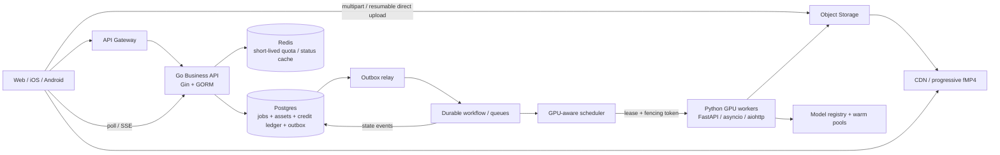
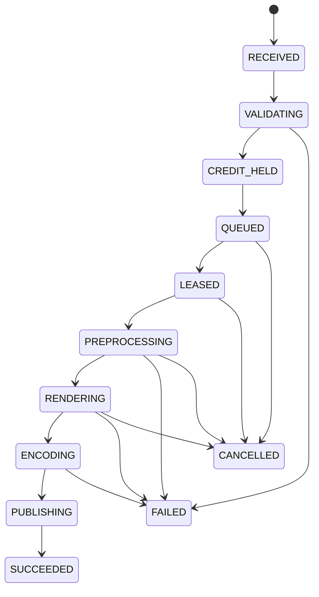

# Viggle AI Backend MTS：60 分钟单文件面试冲刺包

> 调研日期：2026-08-06
> 目标岗位：Member of Technical Staff - Backend Software Engineer（Toronto）
> 使用方法：这是一份**自包含**材料。从头到尾按 §1 的时间标记读 60 分钟，不需要翻本仓库的其他章节。最后的外部链接只是调研证据，不是必读。

---

## 0. 先给结论：这不是一个普通 CRUD 岗

这个岗位的主体是“**业务控制面 + 媒体数据面 + GPU 调度面**”：

1. **Go 业务 API**：用户、资产、渲染任务、订阅、IAP、Stripe、积分账本。
2. **Python GPU pipeline**：上传验证、视频预处理、inpainting、模型推理、编码、发布。
3. **分布式正确性**：至少一次投递、幂等、租约、fencing token、任务取消、故障恢复。
4. **经济调度**：积分不超扣、GPU 不空转、冷启动可控、热门模型常驻、单位成功输出秒的成本下降。
5. **视频工程**：大文件不经过 API 服务器；处理 codec/container/VFR/PTS/DTS/音画同步；结果走对象存储 + CDN，必要时逐段产出 fMP4。

**备考投入优先级**：

| 优先级 | 主题 | 你必须能讲到的深度 |
|---|---|---|
| P0 | 异步任务、队列、幂等、恢复 | 状态机 + 租约 + 重试分类 + 副作用去重 |
| P0 | GPU 调度与容量 | 显存、模型常驻、冷启动、公平队列、过载拒绝、goodput |
| P0 | 积分安全 | hold/capture/release 账本，不超扣，可对账 |
| P0 | 大文件与视频 pipeline | 直传对象存储、元数据探测、阶段性产物、PTS/DTS |
| P1 | Go + Python 生产实践 | `context`/并发控制/事务；`asyncio` 取消/超时/有界并发 |
| P1 | K8s/发布/可观测性 | GPU device plugin、node affinity、readiness after warmup、金丝雀 |
| P2 | 模型算法细节 | 知道推理边界即可；不要把 80% 时间花在 diffusion 论文上 |

### 你的一句话定位

> 我要设计的不是“一个调模型的 API”，而是“一个对用户资产和积分负责、对 GPU 成本负责、可以在任意 worker 崩溃后恢复的长任务系统”。

---

## 1. 这 60 分钟怎么用

| 时间 | 读什么 | 到点后必须能做什么 |
|---|---|---|
| 0–5 min | §0 岗位本质 | 用一句话说清它为什么不是 CRUD |
| 5–10 min | §2 产品信号 | 记住 Character/Motion/Render/Credits 四个业务对象 |
| 10–15 min | §3 概念小词典 | 能解释幂等、Outbox、lease、fencing、CAS、backpressure |
| 15–25 min | §4–7 主链路/容量/架构/API | 从空白纸画完架构，算出 GPU 数量级 |
| 25–35 min | §8–9 状态机/积分 | 能回答重复投递、取消竞态、不重扣积分 |
| 35–45 min | §10–11 GPU/视频 | 能回答排队、warmup、OOM、PTS/DTS、fMP4 |
| 45–52 min | §12–13 代码与故障 | 会讲 Go/Python 边界，快速扫完故障矩阵 |
| 52–57 min | §14 追问快答 | 合上文档，口头答 10 题 |
| 57–60 min | §15 速记与话术 | 背主链路、五个不变式、三个数和两个反问 |

### 如果这是一场 60 分钟 system design 面试

| 面试时间 | 你要交付的东西 |
|---|---|
| 0–5 min | 需求澄清 + SLO 卡 + 范围外 |
| 5–10 min | 三个容量数：peak jobs/s、入站字节/s、GPU 数量级 |
| 10–20 min | API + 数据模型 + 高层架构 + 主链路 |
| 20–45 min | 深挖两项：优先“任务恢复/积分”和“GPU 调度” |
| 45–52 min | 故障矩阵 + 可观测性 + 过载降级 |
| 52–57 min | v0/v1、成本、失效边界和升级信号 |
| 57–60 min | 30 秒总结 + 两个反问 |

---

## 2. 公开产品信号 → 面试考点

公开页面不能告诉我们 Viggle 的内部架构，但可以用来推导系统约束。下表中“推导”都是备考分析，不是对其内部实现的声称。

| 公开事实 | 面试推导 |
|---|---|
| 官方开发者页面展示 50M+ registered creators、98M+ videos created | 流量是全球且有明显峰谷；但累计用户/视频不能直接换算日 QPS，容量题必须显式假设 |
| Character、Motion、Render 都是可轮询的异步资源 | 任务状态必须持久化；任务不依赖单个 API/worker 进程存活 |
| 可预处理 Character/Motion 并复用，官方称规模化场景首次渲染可约快 3× | 应拆出可缓存/可复用的前置计算，避免每次重算；需处理模型版本兼容性 |
| Render 按输出视频秒数和角色数计价，异步任务开始时预留积分，处理后结算 | 会问积分 hold/capture/release、取消/失败返还、重试不重扣、孤儿 hold 扫描 |
| V1 公开文档提醒：创建资源尚未暴露 idempotency key，网络超时后不可盲目重试 | 设计题中应主动加入业务操作 ID/幂等契约，或说明如何用 request ID + 查询解决不确定结果 |
| 结果 URL 和终态记录公开 API 中仅保留 1 小时 | 输出与任务元数据有明确保留策略；客户需及时归档；必须处理过期 URL |
| 支持 progressive fMP4、透明 mask、多角色 | 产物不止一个 MP4；需要段级发布、manifest 一致性、同步输出和组合计费 |
| 消费端套餐限制同时生成数，不同套餐为 1/4/6/10 | 并发配额不只是 API rate limit；需要跨设备的分布式准入与槽位释放 |

**谨慎使用的信息**：官方 About 页展示 40M creators，开发者页展示 50M+ registered creators；这类运营计数会变化，只用于证明量级，不要在面试中把它当作 DAU 或实时 QPS。

### 面试中的业务对象

```text
Character = 由单张图像预处理出的可复用角色资产
Motion    = 由 driving video 预处理出的可复用动作资产
Render    = Character + Motion + 模型版本 + 背景/输出参数
Output    = MP4 或 progressive fMP4，可能还有 alpha/mask
Credits   = 开始前预留，按约定的业务结果结算或释放
```

---

## 3. 六分钟概念小词典

这些词后面会直接使用，在这里一次讲清。

| 概念 | 在本题里的意思 | 解决什么故障 |
|---|---|---|
| **幂等 idempotency** | 同一业务操作重试多次，最终效果和一次相同 | 客户端超时重试不会多建 job、多扣积分 |
| **at-least-once** | 尽力保证消息至少被处理一次，因此允许重复 | worker 崩溃前未 ack 时消息能重新投递 |
| **Outbox** | 在创建 job 的同一 DB 事务内写一条待发事件，后台 relay 发队列 | 避免“DB 写成功、发队列前进程死亡” |
| **CAS** | Compare-And-Set：只在 state/version 仍是预期值时更新 | 两个 worker 同时提交时只有一个胜出 |
| **lease** | 有过期时间、需要 heartbeat 续约的临时执行权 | worker 死亡后任务能被回收重排 |
| **fencing token** | 每次新 lease 都获得更大的单调 epoch，存储只接受最新 epoch | 旧 worker 卡顿后“复活”，不能覆盖新 worker 的结果 |
| **Saga/补偿** | 跨 DB、队列、GPU 的多步操作无法原子提交，失败时用 release/delete/reconcile 反向收敛 | 积分已 hold 但 GPU 未执行等部分成功 |
| **backpressure** | 下游处理不过来时限制上游，队列有界，必要时拒绝 | 无界积压让所有任务都超 deadline |
| **goodput** | 单位时间内成功且满足 deadline/质量的输出 | GPU 100% 忙，但都在算已超时或最终失败的任务 |
| **控制面/数据面** | 控制面管元数据、权限和状态；数据面搬运视频大字节 | 避免大文件压垮 Go API，两条路径可独立扩容 |

**一句话记忆**：队列重复不可怕；可怕的是重复消息触发了不能去重的扣费、发布和通知。

---

## 4. 最值得练的母题

> **Design a global AI avatar video generation platform. Users upload a reference image and a driving video, then receive a generated video. The system must support millions of creators, near-real-time progress, paid credits, and a heterogeneous GPU fleet.**

若只有时间练一道题，就练这道。它能覆盖 JD 中几乎所有关键词。

### 4.1 开局只问这 8 个问题

1. 用户要的是“快速受理”还是“多久拿到首段/完整结果”？
2. 视频最大时长、分辨率、帧率、单文件大小是多少？
3. 每日任务数、峰均比、付费/免费比例和发布活动峰值？
4. 用户可以取消吗？已消耗部分 GPU 时间怎么扣费？
5. 可以重复一个 job 吗？还是只要业务语义上 exactly once？
6. 哪些模型/分辨率只能跑在特定 GPU SKU？模型加载和 warmup 多久？
7. 结果保留多久？是否需要渐进播放、mask 和多种格式？
8. 是单 region 多 AZ，还是 GPU 池跨 region？是否有数据驻留/隐私要求？

然后收敛：

> “我先按异步受理、最终产出 MP4，支持进度与取消；单 region 多 AZ 控制面，GPU 池可按 region 扩展；积分不允许超扣。先不设计内容推荐和训练 pipeline。”

**英文开场模板**：

> “I’ll first clarify the latency target, workload shape, cancellation and charging semantics. Then I’ll estimate upload bandwidth and GPU capacity, propose the APIs and data model, and separate the business control plane from the media and GPU data planes. For the deep dive, I suggest job recovery and credit safety first, followed by GPU scheduling. Does that match what you’d like to evaluate?”

### 4.2 候选 SLO 卡

这些是**面试假设**，不是 Viggle 官方 SLO：

| 指标 | 候选目标 | 为什么要分开 |
|---|---:|---|
| `POST /renders` 受理延迟 | p99 < 300 ms（不包字节上传） | 业务 API 不应等 GPU |
| 队列等待 | paid p95 < 30 s，free 可更长 | 优先级和套餐语义 |
| 首个可播放片段 | p95 < 60 s | 用户体感不等于完整任务时间 |
| 任务终态正确率 | 99.9% 在规定窗口内进入终态 | 防止永远 processing |
| 积分重扣 | 0 作为业务不变式 | 这是正确性目标，不是普通可用性 SLO |
| 核心成本 | $ / successful output-second | 将空转、失败重试、低质量结果都计入 |

---

## 5. 容量估算：不要用 API QPS 掩盖 GPU 账

### 5.1 一组完整练习数字

假设：

- 200,000 renders/day；峰均比 5×。
- 平均上传 30 MB；平均输出 10 s @ 30 fps。
- 在目标模型 + GPU SKU + 分辨率上，压测平均每个 job 需要 40 GPU-service-seconds。
- 为控制尾延迟，目标利用率 70%。

```text
平均 jobs/s = 200,000 / 86,400 ≈ 2.3
峰值 jobs/s = 2.3 × 5 ≈ 11.6

峰值入站字节 = 11.6 × 30 MB ≈ 348 MB/s
日入站字节     = 200,000 × 30 MB ≈ 6 TB/day
日输出帧         = 200,000 × 10 × 30 = 60M frames/day

峰值 GPU 数量级 = 11.6 × 40 / 0.70 ≈ 663 GPUs
若平均端到端 120 s，在途任务 ≈ 11.6 × 120 ≈ 1,400
```

### 5.2 算完必须立即说的结论

1. 348 MB/s 峰值入站字节意味着**文件必须直传对象存储**，Go API 只管签名 URL 和元数据。
2. 看似只有十几 jobs/s，却可能要数百张 GPU；**服务时间才是支配变量**。
3. 663 只是计算量级，不是采购数；要按 `model_version × GPU_SKU × resolution × duration_bucket × batch` 压测校准。
4. 动态批处理会改变 `service-seconds/job`，但会增加等批时间和显存峰值；不能默认越大越好。
5. 配容不能只看 GPU 利用率；还要看 deadline 内完成的 goodput、成功率和 $/output-second。

**面试里最好用的公式**：

```text
GPU fleet ≈ λ_peak × E[S_gpu] / target_utilization
queue wait ≈ queued_work_in_GPU_seconds / available_GPU_goodput
cost / successful output-second
  = (GPU + CPU + storage + egress + retry waste) / delivered_successful_video_seconds
```

---

## 6. 高层架构：控制面、字节面、计算面分开



### 各组件只说一句职责

| 组件 | 唯一主职责 |
|---|---|
| Go API | 身份、幂等、任务元数据、资产权限、积分账本 |
| Postgres | 业务事实和不变式的权威来源 |
| Redis | 可重建的快速状态；不单独承担计费正确性 |
| Outbox | 解决“DB 已创建 job，但入队消息丢了”的双写窗口 |
| Workflow/queue | 持久化阶段、计时器、重试和补偿；消息中只放 ID/对象引用 |
| GPU scheduler | 把 deadline、优先级、model residency、GPU SKU/VRAM 约束转成 lease |
| Python worker | 执行一个有边界的 stage，定期 heartbeat，可取消，幂等提交 |
| Object storage/CDN | 承载大字节、中间产物和最终产物；不让媒体字节穿过业务 API |

### 为什么不能只说“用 Kafka”

队列和工作流解决的问题不同：

- Kafka/RabbitMQ/NATS 擅长投递、路由、重放和背压。
- Temporal 类工作流引擎擅长多阶段持久化、计时器、重试策略、取消和补偿。
- 如果 pipeline 只有几个简单 stage，`Postgres state machine + outbox + durable queue` 更简单。
- 如果有长时间计时、人工介入、多种补偿和频繁恢复，workflow engine 的收益才明显。

**选型答法**：先问团队已有什么，再说 workload 需要哪种语义；不按品牌名气作答。

| 候选工具 | 适合的主问题 | 代价/不要误用的地方 |
|---|---|---|
| Redis Streams | 已有 Redis 且需要中小规模持久队列/消费组 | 不让它同时成为 job 和 credit 的唯一权威库；需评估持久化和内存成本 |
| RabbitMQ | 工作队列、ack、路由、优先级/DLQ | 长期事件回放和大规模日志不是它的核心优势 |
| Kafka | 高吞吐事件日志、重放、多消费者、计量/分析流 | 它不会自动给你长任务状态机、计时器和 Saga |
| NATS/JetStream | 低延迟消息、轻量 pub/sub 与持久流 | 具体交付/保留语义需按 JetStream 配置说清，不要只说“NATS 更快” |
| Temporal | 长时间多阶段工作流、持久 timer、retry/cancel/compensation | 引入运营和心智成本；两三个简单 stage 可能用 DB 状态机 + queue 就够 |

---

## 7. API 与数据模型

### 7.1 核心 API

```http
POST /v1/uploads
Content-Type: application/json

{"kind":"motion_video","size_bytes":31457280,"sha256":"..."}

→ 201 {"asset_id":"asset_123","upload_url":"...","expires_at":"..."}
```

```http
POST /v1/renders
Idempotency-Key: 4a14...
Content-Type: application/json

{
  "character_asset_id": "asset_character",
  "motion_asset_id": "asset_motion",
  "model_version": "jst_x@2026-08-01",
  "background_mode": "transparent",
  "output": {"resolution":"720p","format":"fmp4"}
}

→ 202 {"render_id":"render_123","status":"validating","status_url":"/v1/renders/render_123"}
```

```http
GET    /v1/renders/{id}          → state, stage, progress, output URLs, error
DELETE /v1/renders/{id}          → request cancellation; terminal result is idempotent
GET    /v1/renders/{id}/events   → optional SSE; polling remains a safe fallback
```

**幂等契约**：发起方在首次尝试前生成并持久化 key；同一 key + 同一请求 hash 返回原 job；同 key 但不同参数返回 `409` 或 `422`。幂等记录的 TTL 至少覆盖移动端最长重试/离线重放窗口。

### 7.2 最小数据模型

| 表 | 关键字段 | 不变式/索引 |
|---|---|---|
| `render_jobs` | `id, account_id, idem_key, request_hash, model_version, state, stage_version, attempt, lease_epoch, deadline, reserved_credits` | `UNIQUE(account_id, idem_key)`；状态用 CAS 更新 |
| `assets` | `id, owner_id, kind, object_key, sha256, media_meta, model_version, state` | 客户不能引用别人资产；预处理资产绑定模型版本/兼容性 |
| `credit_accounts` | `account_id, available, version` | `available >= 0`；条件更新防止并发超扣 |
| `credit_ledger` | `entry_id, account_id, job_id, type, amount, created_at` | hold/capture/release/adjust 追加写；每个语义步骤唯一 |
| `resource_leases` | `resource_id, job_id, epoch, expires_at, heartbeat_at` | 新租约 `epoch` 必须大于旧租约 |
| `outbox` | `event_id, aggregate_id, type, payload, published_at` | 与 job/账本在同一 DB 事务中写入 |

---

## 8. 深挖一：任务状态机、重试与取消



### 8.1 投递语义

**不承诺物理 exactly once**。选择 at-least-once 投递，并让业务副作用幂等：

- stage 开始：`UPDATE ... WHERE state=:expected AND stage_version=:v`。
- stage 产物：使用确定性 object key，如 `jobs/{job_id}/{stage}/{attempt_or_content_hash}`。
- 终态提交：只允许当前 `lease_epoch` 成功 CAS。
- credit capture/release：以 `job_id + semantic_step` 做唯一键。
- 通知：可重复发，消费端按 `event_id` 去重。

### 8.2 重试分类

| 失败 | 策略 |
|---|---|
| 对象存储 503、网络短断 | 有上限的指数退避 + jitter，受 job deadline 限制 |
| 非法 codec、图像损坏、资产与模型版本不兼容 | 确定性失败，直接进终态，不重试 |
| CUDA OOM | 先分类：输入越界则失败；批大小/碎片问题可降 batch 或换大显存 SKU **最多一次** |
| worker 消失 | 等 lease 过期后重新调度；旧 worker 的迟到写入被 fencing token 拒绝 |
| 模型版本系统性失败 | 打开版本级熔断，停止继续烧 GPU，回滚 alias，对安全任务重新排队 |

### 8.3 取消是竞态，不是一个 boolean

1. API 只写入 `cancel_requested_at`，并尝试将未开始的 job CAS 到 `CANCELLED`。
2. worker 在 stage/chunk 边界检查取消，不假设 CUDA kernel 可随时安全打断。
3. 若 worker 已完成且抢先提交 `SUCCEEDED`，取消返回已终态，不倒退。
4. 扣费语义要事先定义：未开始全量释放；已消耗计算是全额、按比例还是免费，这是产品决策。

---

## 9. 深挖二：积分安全与两种资源预留

### 9.1 积分状态

```text
RESERVE/HOLD  任务受理前原子地检查余额并预留
CAPTURE       达到约定的可计费结果后结算
RELEASE       失败/取消/超时后释放未结算的 hold
ADJUST        对账后用追加修正事件，不篡改旧账本
```

一个可辩护的原子预留：

```sql
UPDATE credit_accounts
SET available = available - :amount,
    version = version + 1
WHERE account_id = :account_id
  AND available >= :amount;
```

检查受影响行数后，在**同一事务**中追加 ledger hold、创建 job 和 outbox。这仍然需要定期用 append-only ledger 重算并对账快照余额。

### 9.2 积分和 GPU 不能做分布式原子事务

不要试图“同时锁住积分和 GPU”。正常顺序是：

1. 字节上传完成、廉价验证通过。
2. 做 credit hold；这是廉价、可补偿的数据库操作。
3. 任务入队；需要时 hold 有 TTL/对账器，防止永久冻结。
4. 只在所有输入就绪时申请 GPU lease，避免占着昂贵 GPU 等上传。
5. 成功则 capture；终止则按业务规则 release/capture partial。
6. reconciler 定期查找“有 hold 无活动 job”和“有成功 job 无 capture”。

这是 Saga/补偿，不是 2PC。

---

## 10. 深挖三：GPU 调度、热池与 OOM

### 10.1 排队键与公平性

不要用一条全局 FIFO 装所有任务。建议至少按兼容类分队列：

```text
(model_version, GPU_SKU_or_VRAM_class, resolution_bucket, duration_bucket, priority_tier)
```

每个兼容类内用 weighted fair queue / deficit round robin，并加 aging：

- paid 用户有更高权重，但 free 队列不能永久饥饿。
- 大租户不能占满队列；用 per-tenant in-flight cap 和公平调度。
- 短任务与长任务分桶，减少队头阻塞；但要防止用户虚报时长，以预处理探测为准。

### 10.2 原生 K8s 不等于完整 GPU scheduler

Kubernetes 通过 device plugin 暴露 GPU 扩展资源，可用 node labels/affinity 选 GPU 类型。但面试中要主动指出：

- 默认调度主要看“几张卡”，不会自动理解模型常驻、加载代价、实际 VRAM 峰值和 deadline。
- 业务层需要 GPU-aware coordinator，或自定义 scheduler/operator。
- 若用 MIG/时分共享，必须说清显存隔离、性能抖动和故障爆炸半径；它不是免费的利用率。

### 10.3 模型常驻与 warmup

- 热门模型版本保持 warm pool，冷门版本按需加载。
- pod 只在权重加载、CUDA graph/kernel 初始化、合成和真实 shape warmup 通过后才 readiness=true。
- 不在滚动发布时一次性驱逐大量热 pod；新版先预热，再小流量切入。
- 任务固定 `model_version` 而不是运行到一半跟随 `latest`；回滚只影响新任务，在途任务按明确策略完成或重排。

### 10.4 OOM 的回答模板

> “我会在准入时用 model-version-specific 的显存估算器拒绝越界输入，用最坏 shape 压测 max batch，并保留显存余量。OOM 后先把 worker 移出可用池并释放进程资源；若是可恢复的 batch/碎片问题，最多降 batch 或升 GPU class 重试一次。同一模型版本 OOM 率超阈值则熔断，不无限重试烧卡。”

---

## 11. 视频 pipeline 必会被追问的点

### 输入

- 分片/可恢复直传对象存储；上传 URL 短 TTL、限制 content length/type，完成后验证 checksum。
- `ffprobe` 只是廉价探测的一部分；真正 decode 时仍可能发现损坏。
- 限制时长、像素数、帧率、解码后尺寸，防止压缩炸弹和资源攻击。

### 时间轴

- PTS 决定呈现时间，DTS 决定解码顺序；它们要乘以 time base 才是时间。
- 不要假设 `frame_index / fps` 对所有输入都正确；VFR、B-frame、截取和拼接会破坏这个假设。
- 在 pipeline 边界明确是保留原时间轴还是 normalize 到 CFR，并用回归样例检查音画漂移。

### 中间产物与发布

- 每个昂贵 stage 的产物写对象存储，带 job/stage/model/input hash，便于幂等重用和调试。
- 中间产物有 TTL 和清理器，但当前任务持有引用时不可删除。
- progressive fMP4 按片段写入不可变 object key；片段完整上传后才更新 manifest，避免客户见到半个片段。
- 最终产物用 CDN 和签名 URL；任务元数据、原始输入、中间物和输出分别定义保留期。

### 安全、隐私与 UGC 边界

- 每次读写 asset 都重新校验 tenant/owner，不因为用户知道 object key 就授权。
- 上传先进 quarantine prefix/bucket；完成校验、解码探测、恶意文件与内容政策检查后才进可处理状态。
- 原始图像/视频、生成结果、临时帧和调试日志分别定义 TTL；用户删除需要一个可审计的异步删除工作流。
- 对象存储加密、CDN 签名 URL 短 TTL，日志不记录完整 URL/token/用户媒体。
- API rate limit 防请求洪水，任务准入和 credit hold 防昂贵计算滥用；两者不是同一个限制器。

---

## 12. Go + Python 必要知识：只记住生产边界

### 12.1 Go 业务 API

**`context` 传播**：HTTP 请求中的 DB/下游操作要接受 `r.Context()`，让客户取消和 deadline 向下传播。但一旦 job + outbox 已事务提交，后台执行是持久化业务工作，不能继续绑定已结束的 HTTP context；它要用自己的 job deadline。

**有界并发**：不为每个请求无上限创建 goroutine。用有界 worker pool/channel/semaphore，并把“队列已满”转成可观测的 backpressure/429，不是继续在内存排队。

**事务边界**：GORM transaction 内只写 Postgres 里能同时提交的 job、ledger、outbox。不在 transaction callback 中先发 Kafka/RabbitMQ：外部消息发成功后 DB rollback，消费者就看到了不存在的 job。

幂等创建的伪代码：

```go
func CreateRender(ctx context.Context, accountID, idemKey string, req Request) (Job, error) {
    requestHash := StableHash(req)
    return WithTx(ctx, func(tx Tx) (Job, error) {
        if old := tx.FindByIdempotencyKey(accountID, idemKey); old != nil {
            if old.RequestHash != requestHash { return Job{}, ErrIdempotencyConflict }
            return *old, nil
        }
        // Conditional debit: UPDATE ... WHERE available >= hold.
        hold, err := tx.ReserveCredits(accountID, EstimateCost(req))
        if err != nil { return Job{}, err }
        job := tx.InsertJob(accountID, idemKey, requestHash, hold.ID, req)
        tx.InsertOutbox("render.accepted", job.ID)
        return job, nil
    })
}
```

### 12.2 Python GPU worker

**`asyncio` 只为 I/O 并发，不会让一段阻塞 CUDA/CPU 代码自动变并行**。下载、上传、heartbeat 适合 async；长 CPU 编码用独立进程/任务，GPU 执行通常由每 GPU 有限进程持有模型与 CUDA context。

- `Queue(maxsize=N)` 限制**等待工作量**；`Semaphore(K)` 限制**同时执行某类操作的数量**。
- 所有网络请求都有 connect/read/total timeout；重试受总 job deadline 限制。
- 取消要在 `try/finally` 里释放本地临时文件、锁和 lease；不吞 `CancelledError`。
- heartbeat 失败不意味着立即重复提交；worker 应尽快停止可中断工作，最终写入仍必须校验 fence。

伪代码：

```python
async def run_job(job, lease, gpu_sem):
    heartbeat = asyncio.create_task(renew_lease(job.id, lease))
    try:
        async with asyncio.timeout(job.remaining_seconds):
            inputs = await download_and_validate(job)
            await check_cancelled(job.id)
            async with gpu_sem:
                output = await run_gpu_stage(inputs, job.model_version)
            uri = await upload_idempotently(job.output_key, output)
            await commit_if_current_fence(job.id, lease.epoch, uri)
    except asyncio.CancelledError:
        raise
    finally:
        heartbeat.cancel()
        await cleanup_local_files(job.id)
```

### 12.3 商业化 webhook 边界

- Stripe webhook 与 App Store server notification 都当作可重复、可迟到、可乱序的外部事件。
- 先验签，再用 provider `event_id/transaction_id` 去重，权益转移使用状态机和条件更新。
- webhook 不是唯一事实来源；有消息窗口、退款和跨设备恢复时，用 provider 权威 API/历史定期对账。
- 支付事件和视频 credits 是两层账本：前者购买/赋予积分，后者在渲染时 hold/capture/release；不要用一个可变 `balance` 字段代替完整记录。

---

## 13. 故障矩阵：这张表是 Senior/MTS 分数的主要来源

| 故障 | 用户看到什么 | 根本机制 | 恢复/防重 |
|---|---|---|---|
| 创建 job 成功，HTTP 响应丢失 | 客户不知道是否创建 | 不确定结果 | 重试复用 idempotency key，返回原 job |
| DB 已写 job，队列没有消息 | job 长期不动 | 双写窗口 | transactional outbox + relay lag 告警 |
| 队列重复投递 | 可能两个 worker 执行 | at-least-once | CAS + lease epoch + 确定性产物 + ledger 唯一键 |
| worker 失联后又恢复 | 新旧 worker 竞争 | lease 过期重分配 | fencing token 拒绝旧 worker 提交 |
| 上传结果成功，DB 更新前崩溃 | 有 object 无终态 | 跨系统原子性不可得 | 确定性 key + HEAD/reconciler + 幂等终态提交 |
| 积分 hold 后永不执行 | 余额被冻结 | job/orchestrator 失联 | hold TTL + 孤儿扫描 + 账本对账 |
| 队列积压超过用户 deadline | GPU 100% 但结果已无价值 | 无界队列/只看 utilization | 预测等待、deadline-aware drop、准入拒绝、保护 paid traffic |
| 某模型版本 OOM 风暴 | 重试放大失败 | 把确定性/系统性故障当瞬时故障 | 版本级熔断、回滚、有上限的一次降 batch/换 SKU |
| region 丢 GPU 容量 | 排队变长 | 稀缺计算不可立即复制 | 优先负载卸载、降级输出/暂停 free；安全时才跨 region 重排 |
| 模型发布质量退化 | 系统“成功”但产品不可用 | 只看技术错误率 | 金丝雀同时看质量、OOM、速度、成本、用户重试/放弃 |
| IAP/Stripe webhook 重复或丢失 | 权益错误 | 外部通知至少一次/可丢 | 验签、transaction/event ID 去重、权威 API 回查、周期对账 |

### 应主动提出的观测指标

- **API**：受理 p95/p99、幂等命中、准入拒绝率。
- **Queue/workflow**：各兼容类 queue age p50/p95/p99、重试率、孤儿 job、租户饥饿时间。
- **GPU**：有效利用率、VRAM headroom、OOM rate、模型热命中率、加载/warmup 时间、每 SKU goodput。
- **Pipeline**：分 stage 延迟/失败率、无效 codec、PTS 修正、编码失败、中间产物复用率。
- **Money**：hold 老化、capture/release 不匹配、账本对账差额、二次 capture 尝试。
- **单位经济**：$/successful output-second，失败重试 GPU 占比，冷启动空转占比。

---

## 14. 高频追问快答

### System design

**1. 为什么不让客户端把视频上传给 Go API？**
因为字节带宽、连接时长和重试会把业务 API 变成昂贵代理。API 只颁发短 TTL、限大小/类型的签名 URL；客户分片直传对象存储，完成后服务端验 checksum 和所有权。

**2. 为什么 job 状态在 DB，队列不能当权威库？**
队列提供投递和消费位置，不擅长权限查询、幂等唯一约束、任意 job 查询和账本事务。DB 保存业务事实，队列可从 outbox 重建投递。

**3. 重复投递时如何防止两个 worker 都发布和扣费？**
执行权用 lease，提交权用 fencing epoch；状态转换用 CAS，产物用确定性 key，capture 用 `job_id + semantic_step` 唯一约束。重复计算有可能，重复副作用不允许。

**4. 为什么只有 lease 还不够？**
旧 worker 可能因 GC pause/断网错过续约，新 worker 已获得新 lease，但旧 worker 随后恢复并写入。单调 fencing token 让存储层能识别并拒绝这个旧持有者。

**5. 如何付费优先但不让 free 饥饿？**
按兼容类分队列，类内用 weighted fair/deficit round robin，配合 aging、per-tenant in-flight cap 和最低 free 容量份额。监控最长等待而不只看平均值。

**6. 已经不可能在 deadline 前完成，为什么要拒绝？**
继续计算只会烧 GPU、扩大队列并拖累仍有机会成功的任务。要优化 goodput，在准入或出队时用预测剩余时间做 deadline-aware drop。

**7. 哪些模型常驻 GPU？**
用模型到达率、加载/warmup 代价、显存占用、请求价值和 SLO 算热池收益。热门版本常驻，冷门按需；用热命中率、冷启 p95 和空转成本校准。

**8. 模型金丝雀除了 5xx 看什么？**
看质量指标/人工样本、完成率、用户重试与放弃、OOM、速度、VRAM、$/output-second。新 job 固定版本，只在预热完成后放流，回滚 alias 影响新任务。

**9. 渲染完成但 capture 失败，怎么办？**
不把远程计费调用放在不可恢复的最后一步。本地 ledger capture 与 job 可见性用同一 DB 事务，外部计费通过 outbox 投递并对账。若产品要求付费后才下载，先保存产物但不发放 URL；规则必须在设计前明确。

**10. 取消和成功同时发生？**
两者都用 `WHERE state IN (...) AND version=:v` CAS，先提交者获得终态；后者读取已有终态并幂等返回。账本处理必须与胜出的转移语义对齐。

**11. 一个租户突然提交一百万任务？**
在 API 准入层用套餐并发槽位、每租户 pending/in-flight 上限、请求速率和预算限制；调度层用公平队列。不等它先把共享队列和 DB 插满再限制。

**12. 跨 region 调度怎么做？**
先让账本有单一 home region/权威写入点，避免为了 GPU 容量引入多主账本。资产只在合规允许的 region 复制；job 包含 data-locality 和 eligible-region 约束。跨 region 转移要比较排队收益、复制延迟、出网成本和隐私边界。

### Go / Python / distributed systems

**13. Go HTTP context 应传到哪里？**
受理请求的 DB/下游调用跟随 HTTP context；事务提交后的持久化 job 不跟已结束请求，使用 job 自身 deadline。

**14. 为什么 GORM transaction 里不直接发队列？**
因为 DB 和 broker 不共享原子提交；会出现“消息已发但 DB rollback”或“DB commit 但消息未发”。同事务写 outbox，再由 relay 重试发送。

**15. Python async 如何安全取消？**
结构化管理子任务；失败时取消并 await 剩余任务，`try/finally` cleanup，不吞 `CancelledError`。无法中断的 GPU kernel 在安全边界停止，最终提交仍用 fence。

**16. `Queue(maxsize=N)` 和 `Semaphore(K)` 的差别？**
Queue 限制等待内存/积压，Semaphore 限制正在执行的稀缺资源并发。一个防队列无界，一个防 GPU/网络/编码并发过量。

**17. 什么时候 ack？**
执行前 ack 会在崩溃时丢任务；执行后 ack 会在“副作用成功、ack 前崩溃”时重复投递。通常选后者，用幂等副作用承受重复。

**18. CUDA OOM 为什么不无限重试？**
对同一 shape/模型/SKU，OOM 常是确定性或系统性故障；立即重试只会制造风暴。只对可证明改变条件的重试（降 batch/换 SKU）给一次预算。

**19. PTS/DTS/time base？**
PTS 是展示时间戳，DTS 是解码时间戳，二者都要乘 time base 得到时间。VFR 下不能用帧号除以一个常数 fps 代替真实时间线。

**20. K8s 能分配 GPU，为什么还需要业务调度？**
K8s 知道资源数和 node label，但不自动知道模型已常驻、加载代价、实际 VRAM 峰值、用户优先级、deadline 和 credit 状态。它是物理资源执行层，不是完整的业务 admission/scheduling policy。

### 行为与 MTS 信号

**21. 把不稳定研究原型上线。**
用 STAR，但 Action 必须包含：固定模型/数据版本、离线质量门槛、真实 shape 压测、金丝雀、回滚指标、谁 on-call。Result 用质量、p95、错误率和成本四类数字中的至少两类。

**22. 延迟、可靠性和成本取舍。**
先说业务约束，再给两个方案和数字，明确你放弃什么，最后说上线后用什么信号验证决定。不要只说“和 PM 沟通后选了 A”。

**23. 快速学陌生技术。**
讲“问题 → 最小必需知识 → 小基准/原型 → 被证伪的假设 → 交付 → 沉淀”。和 Viggle 的文案“Learning fast”直接对齐，但必须有一个失败实验，否则只像成功学。

**24. 只精通 Go/Python 中一个。**
先诚实界定。然后展示可迁移内核：超时、取消、有界并发、事务、可观测性、测试。给出 2–4 周交付路线：第一周改小 bug+补测试，第二周负责一个有边界的 endpoint/worker stage，用 code review 和生产指标验收。

---

## 15. 面试前一页速记

```text
主线：direct upload → idempotent accept → credit hold + job + outbox
      → validate → fair queue → GPU lease/fence
      → preprocess → inference → encode → atomic publish
      → CAS terminal state → capture/release → CDN

五个不变式：
1. 同一业务操作一个 job
2. available credits 不为负
3. 只有当前 fence 能提交
4. 终态不倒退
5. 重放不重复副作用

三个数：
peak jobs/s
GPU = λ × service time / utilization
$/successful output-second

五个失败：
HTTP 不确定结果、DB/队列双写、worker 失联又复活、OOM 风暴、credit hold 孤儿

两个反问：
1. “你们当前 GPU fleet 的主要瓶颈是容量、模型加载、队列公平性，还是单位成功输出的成本？”
2. “最近一次渲染 pipeline 的严重事故是什么？事后改的是调度机制、可观测性还是产品降级策略？”
```

### 最后 30 秒收尾

> “这个设计把业务正确性留在 Go/Postgres 控制面，把大字节放在对象存储，把昂贵计算放在可租约、可 fencing、可重放的 GPU workflow 里。v0 我会先做单 region 多 AZ、少量兼容队列和整卡调度；等模型冷启动、热点租户或显存碎片成为主要成本后，再引入更细的 residency-aware scheduling 和 GPU 分割。我会用 queue-age SLO、OOM rate 和 $/successful output-second 决定何时升级。”

> “The design keeps business correctness in the Go and Postgres control plane, large media bytes in object storage, and expensive computation in a durable GPU workflow protected by leases and fencing tokens. I would start with a multi-AZ control plane, a few compatibility queues and whole-GPU scheduling. I’d add finer residency-aware scheduling only when cold starts, tenant hotspots or memory fragmentation become measured bottlenecks. The trigger metrics are queue age, OOM rate, model warm-hit rate and cost per successful output-second.”

---

## 16. 资料与信息边界

### Viggle 一手资料

- [岗位页：Member of Technical Staff - Backend Software Engineer](https://jobs.ashbyhq.com/viggle/c7076b35-03f3-4fca-90b7-3f3c8d29ba5d)
- [Viggle Model API 开发者页](https://viggle.ai/developers)
- [Viggle API Introduction](https://docs.viggle.ai/introduction)
- [V1 Async jobs and result availability](https://docs.viggle.ai/v1/production/async-jobs)
- [V1 Errors and recovery](https://docs.viggle.ai/v1/production/errors)
- [Viggle 套餐与并发限制](https://viggle.ai/pricing)
- [About Viggle](https://viggle.ai/about-us)

### 技术一手资料

- [Kubernetes: Schedule GPUs](https://kubernetes.io/docs/tasks/manage-gpus/scheduling-gpus/)
- [NVIDIA Triton: Dynamic batching and queue policy](https://docs.nvidia.com/deeplearning/triton-inference-server/user-guide/docs/user_guide/batcher.html)
- [Stripe: Idempotent requests](https://docs.stripe.com/api/idempotent_requests)
- [Apple: Receiving App Store Server Notifications](https://developer.apple.com/documentation/AppStoreServerNotifications/receiving-app-store-server-notifications)
- [FFmpeg Documentation](https://ffmpeg.org/ffmpeg.html)

### 调研边界

- 未找到可靠、可确认属于当前 Viggle AI 后端岗的公开面试流程或真题。搜索结果中有同名旧公司和不同职能的记录，不应当成本岗信号。
- 本文架构是根据岗位描述和公开产品/API 契约建立的面试模型，不声称等同 Viggle 内部架构。
- 文中 SLO、日任务数、峰均比、GPU service time 和 GPU 数都是教学假设，不是公司披露数据。
