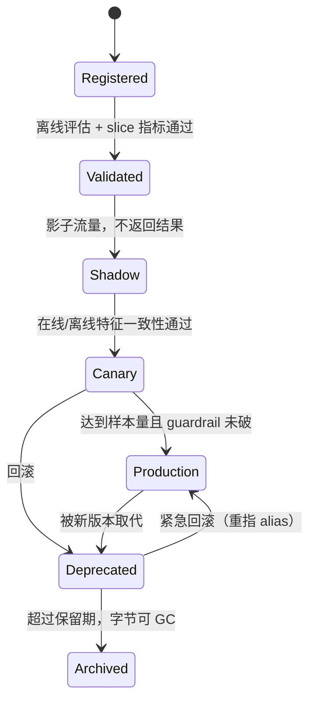

# 02 · 模型生命周期：注册、版本、Checkpoint

> 模型不是一个文件，是「权重 + 特征管道 + 依赖锁 + 配置」这个不可分割的四元组。
> 只存权重的 registry 是一个文件柜，不是一个控制面 —— 它在你需要它的那一天必然失效。

---

## 读这一章之前

**你在工作中遇到过这个**

你的 CTR 模型 `v37` 在生产跑了四个月，风控要你复现一遍它、证明当初那个 `auc=0.7431` 是真的。
你手上有 S3 上一个 4.2 GB 的 `model_final.pt`，和 MLflow 里那一行指标，别的什么都没有：
训练脚本在一个半年前被 squash merge 掉的分支上；训练用的那张 Hive 表每天覆盖写，
四个月前的分区在两次 compaction 之后已经不是当时的字节了；镜像 tag 写的是 `training:latest`，
今天它指向的 CUDA 比当时高了两个小版本。你花三周复现出 0.7218，差了 213 个基点，
没人能说清是数据、代码还是随机种子。最后的处理是"重训一个新的" ——
那个 0.7431 从此是一个**没有任何人能验证的数字**，而它当初决定了一次全量放量。

**需要先懂的概念**

| 概念 | 一句话 | 详见 |
|---|---|---|
| ML 系统的失败方式 | 它坏掉时返回 200 OK：错误率不变、延迟不变，只有分数偏了 | [08/01 §4](01-ml-system-overview.md#4-ml-系统特有的失败模式清单) |
| 制品与不可变发布 | 构建产物一旦生成就不再改字节，"部署"只是把指针指向某个已存在的产物 | [03/05 §1](../03-saas-platform/05-release-engineering.md#1-部署--发布) |
| 渐进式交付 | 先切 1% 流量、盯指标、再逐档放大，出问题只烧掉这一档的用户 | [03/05 §3](../03-saas-platform/05-release-engineering.md#3-渐进式交付progressive-delivery) |
| 对象存储的语义 | 对象整体覆盖写、没有真目录、单对象读带宽要靠并发范围读堆出来 | [06/17](../06-case-studies/17-object-storage.md) |
| 读放大 | 为了拿到真正需要的那些字节，实际从设备/网络上读了多少倍 | [01/01](../01-building-blocks/01-storage-engines.md) |
| 冷启动 | 进程刚起来时缓存和显存都是空的，这段时间的延迟和稳态完全是两条曲线 | [01/02 §2](../01-building-blocks/02-caching.md#2-缓存模式) |

**这一章要回答的问题**

1. 一个只存了权重文件和一行 AUC 的 registry，具体是在哪一步失效的？该记的字段有哪些是**训练结束后补不回来**的？
2. 模型该怎么编版本号？为什么 `v2.1.3` 这套 SemVer 语义放到模型上是错的，正确的替代品是什么？
3. 训练 70B 模型，checkpoint 该多久打一次、留多少份、一个月要花多少钱？恢复时的读带宽为什么会比写带宽高两个数量级？
4. safetensors 到底解决了 pickle 的什么问题、又**没有**解决什么问题？ONNX / TorchScript 的兼容性坑分别在导出侧还是运行侧？

**本章新引入的术语**

| 术语 | English | 一句话定义 |
|---|---|---|
| 模型注册表 | model registry | 记录"每个被产出的模型是什么、由什么产出、能不能上线"的索引服务；它存指针和元数据，权重字节存在对象存储里 |
| 血缘 | lineage | 从一个模型往回追到产出它的代码提交、数据集分区、超参、运行环境的那条链 |
| 检查点 | checkpoint | 训练途中把"接着往下训所需的全部状态"落盘的快照 —— 不只是权重，还有优化器状态、数据加载进度、学习率调度状态 |
| 优化器状态 | optimizer state | 优化器（Adam 这一类）为**每个参数**额外维护的两个辅助数值，只在继续训练时才需要、推理时完全用不到；FP32 下这两份合计是权重字节数的 4 倍 —— 所以 checkpoint 比"模型文件"大好几倍 |
| 分片检查点 | sharded checkpoint | 每个训练进程只写自己持有的那一份参数，恢复时按当前并行度重新拼装 |
| 异步检查点 | asynchronous checkpoint | 训练线程只阻塞"显存 → 主机内存"这一步拷贝，落盘交给后台完成 |
| 反序列化即执行 | code execution on deserialize | 某些序列化格式在"读文件"这一步就会按文件内容去调用函数 —— 加载模型等同于执行陌生代码 |
| 张量安全格式 | safetensors | 一段 JSON header + 一段连续张量字节的格式，读取过程不执行任何代码，且可 mmap 零拷贝 |
| 算子集版本 | opset version | ONNX 用来声明"这张图里的算子按哪一版语义解释"的整数 |
| 别名 | alias / pointer | 可以原地改指向的名字（如 `@champion`），服务只引用别名，不引用具体版本号 |
| 提升 | promotion | 把同一个不可变产物从 dev 标到 staging 再标到 prod；产物字节一个都不变，变的只是标签 |
| 保留策略 | retention policy | 规定哪些 checkpoint / 模型版本留多久、什么时候删的规则 |

---

## 1. 为什么模型无法复现：六个原因，五个是工程问题

先把目标定清楚，否则后面所有投入都没有验收标准。「复现」有三档，成本差两个数量级：

| 档位 | 定义 | 典型成本 | 什么时候真的需要 |
|---|---|---|---|
| **L0 可解释** | 能说清这个模型是谁、在哪份数据、用哪个 commit 训出来的 | 每个训练作业多写 ~20 个字段 | **永远需要**。事故复盘、合规问询的下限 |
| **L1 指标可复现** | 重跑一遍，离线指标落在多种子重复训练的 ±1σ 内 | 数据集要可寻址、依赖要锁死 | 模型上线决策、A/B 结论受质疑时 |
| **L2 位级可复现** | 重跑出**逐字节相同**的权重 | 要禁掉非确定性 kernel，训练慢 10–30% | 取证、专利/侵权诉讼、极少数强监管场景 |

**大多数团队真正需要的是 L1，但他们连 L0 都没做到。** 而 L2 通常是一个错误的目标 ——
为它付出的确定性代价，换来的信息量比"多跑三个种子、报出 σ"少得多。

六个常见原因，按我见过的发生频率排：

1. **训练数据不可寻址。** Hive 表按天覆盖写、上游做过一次静默回填、compaction 重写了文件
   —— **表名 + 日期分区不是地址**。可寻址只有两种形态：数据集快照的内容哈希，
   或只追加表格式的 snapshot id（Iceberg / Delta）。**只记 `dt=2026-03-14` 等于没记。**
2. **代码版本丢失。** squash merge、本地未提交的改动、notebook 里的最后一次调参。
   判据是 `git_commit` 能否 `git cat-file -e` 通过、以及当时工作区是否 dirty ——
   **dirty 的训练作业不允许产出可上线的模型**。
3. **依赖漂移。** `requirements.txt` 不带 hash、基础镜像写 `latest`、cuDNN 换个 kernel 就改数值。
   **唯一可靠的记法是容器镜像 digest（`sha256:…`），不是 tag。**
4. **随机性未固定。** 四个独立源头：数据加载顺序（`DataLoader` worker 数变了顺序就变）、
   dropout / 增强采样、CUDA 非确定性 kernel（`atomicAdd` 的浮点累加顺序不定）、多卡 all-reduce 规约顺序。
   **`seed_everything(42)` 只挡得住前两个。**
5. **特征管道版本与模型版本不同步。** 把权重回滚到 X 天前，它会去 feature store 读到训练时
   **根本不存在的"未来"特征**（字段新加、口径改过、窗口从 24h 变 7d）。不报错，只是分数偏了
   （[arXiv 2604.08181](https://arxiv.org/pdf/2604.08181)）。
6. **硬件与数值差异。** TF32 的默认开关、bf16 与 fp16 的舍入、tensor core 的累加顺序。
   通常只影响末位，但它是唯一你无法靠"再记一个字段"解决的那个。

> **面试金句**：
> "复现失败的第一嫌疑人永远不是随机种子，是数据地址。
> If your dataset pointer is a table name and a date, you don't have a pointer — you have a wish.
> 我要的是内容哈希或 Iceberg 的 snapshot id，因为上游随时会回填，而回填不会给你发通知。"

---

## 2. Registry 该记什么：一张 schema 表，重点在最后一列

Registry 只有一个作用：**把"字节"和"关于字节的事实"分开存，让服务只认指针**。它自己不在推理的关键路径上。

```
  ┌───────────┐  写权重/checkpoint  ┌────────────────────┐
  │ 训练作业   │ ─────────────────► │ 对象存储（权威副本）  │
  │ (K8s Job) │                    │ s3://…/sha256:9f3a… │
  └─────┬─────┘                    └──────────┬─────────┘
        │ 注册元数据（指针 + 血缘 + 证据）           │ 只被拉取一次
        ▼                                      ▼
  ┌──────────────────────┐  解析 alias  ┌──────────────────┐
  │ Model Registry        │ ◄────────── │ 推理服务（启动时）  │
  │  version: 37（不可变） │   一次       └────────┬─────────┘
  │  alias: @champion ──► v37                   │ 之后不再依赖 registry
  │  alias: @shadow   ──► v38                   ▼
  └──────────────────────┘                在线请求（registry 挂了不影响）
```

**这张图唯一要看的是那条"只被拉取一次"的边**：registry 是控制面，
一旦它进了数据面（每次推理都去查版本），它的可用性就成了推理的可用性上限 —— 这是自找的。

| 分组 | 字段 | 例子 | 不记会怎样 | **事后能否补录** |
|---|---|---|---|---|
| **身份** | `model_name` / `version`（单调整数） | `ranking-ctr` / `37` | 无法引用 | ✅ |
| | `artifact_uri` + `content_digest` | `s3://…` + `sha256:9f3a…` | 同名不同内容，缓存命中错的权重 | ⚠️ 需重算哈希 |
| | `format` + `format_version` | `safetensors` / `onnx@opset28` | 加载端猜格式 | ✅ |
| **血缘** | `git_commit` + `git_dirty` | `a1b2c3d` / `false` | 原因 2 | ❌ **过后就没了** |
| | `dataset_ref`（快照 id 或内容哈希） | `iceberg://…@snap-8812` | 原因 1，最致命 | ❌ |
| | `feature_pipeline_version` | `palette-fs@v12` | 原因 5，回滚时静默劣化 | ❌ |
| | `parent_model` | `v31`（微调/蒸馏的来源） | 追不到上游污染 | ⚠️ |
| **训练** | `hyperparams`（全量，不是挑几个）+ `seed` + `deterministic_flags` | `{lr:3e-4, bs:1024}` / `42` | 无法 L1 复现、无法解释末位差异 | ❌ |
| | `container_digest` | `sha256:7c1e…` | 原因 3 | ❌ |
| | `training_flops` / `wall_time` / `energy_kwh` | `3.2e22` / `54d` / `2.1 GWh` | **EU AI Act Annex XI 强制项** | ❌ |
| **评估** | `metrics` + `eval_dataset_ref` + `n_samples` | `{auc:0.7431}` / `…@snap-8813` / `4.1e7` | 指标不可比 | ❌ |
| | `metric_sigma`（多种子标准差） | `0.0016` | 分不清"涨了"和"抖了" | ❌ 需重训多次 |
| | `slice_metrics`（分人群/分地区） | `{new_user_auc:0.68, …}` | 大盘涨、子群塌 | ⚠️ 需重跑评估 |
| **运行时** | `input_signature` + `resource_profile` | `{dense:[512]}` / `{vram_gb:24, warmup_batches:[1,8,32]}` | 加载后才发现 shape 不对；冷启动踩坑 | ✅ |
| **治理** | `owner` / `approved_by` / `promoted_at` | `@team-rank` / `@alice` / `…` | 审计断链 | ❌ |
| | `data_sources` + `filtering_method` | 见 Annex XI | **法定项** | ❌ |

**最后一列是这张表的全部重点。** 打 ❌ 的字段描述的是**训练过程中转瞬即逝的状态**，
作业一结束、产生它们的上下文就没了。所以正确做法不是"上线前补一份 model card"，
而是**训练作业在退出前自己把这些字段写出来，写不出来就让作业失败**。

**对落入适用范围的通用目的 AI 模型（GPAI）提供者，法规会把部分字段变成硬约束。** EU AI Act 的 [Annex XI](https://artificialintelligenceact.eu/annex/11/)
要求记录架构与参数量、训练数据的类型/来源/清洗过滤方法/数据点数量、
**训练算力（如 FLOPs）、训练时长、已知或估算的能耗**。时间线：GPAI 义务 **2025-08-02** 起适用，
**2026-08-02** 起委员会可直接索要文档并执法，存量模型 **2027-08-02** 前合规；
罚则上限 **€15M 或全球营业额 3%**（Art. 101，[实施时间表](https://artificialintelligenceact.eu/implementation-timeline/)）。传统内部模型、下游部署者与开源例外的义务不同；实际适用范围、时间和文档要求应由法务按角色与模型类别确认。

**工具现状（2026 年中）**：MLflow 3（[2025-06-11](https://mlflow.org/releases/3)）把 `LoggedModel`
升为一等实体，可跨 experiment 检索，UI 有独立 Lineage tab。但**它强制的元数据只有
tags / aliases / description / lineage，上表里的 `dataset_ref`、`git_commit`、`container_digest`
都要你自己塞进 tag 或 param** —— 装了 MLflow 不等于有了血缘。开放标准侧 `OpenLineage` + `Marquez`
是当前较有生态采纳度的采集规范之一。截至 2026 年中，本文**未确认一个所有厂商共同采用、且专门覆盖模型血缘全语义的 GA 标准**；这只是检索快照，不表示其它元数据/血缘标准不存在，也不应成为锁定实现的理由。

---

## 3. 版本化与血缘：SemVer 为什么不适用

SemVer（`MAJOR.MINOR.PATCH`）的前提是**兼容性由作者在类型层面控制**：
接口没变就是 PATCH，加了字段是 MINOR，删了字段是 MAJOR。模型三条都不满足：

| SemVer 的假设 | 模型的现实 | 后果 |
|---|---|---|
| 接口没变 ⇒ 行为兼容 | 权重全换、`input_signature` 一字不变 | 按 SemVer 是 `1.0.1`，实际是一个完全不同的模型 |
| 兼容性是二值的 | 输出**分布**平移了 0.03，下游阈值 0.5 全部失准 | 没有任何版本号位能表达"校准漂移了多少" |
| 作者知道自己破坏了什么 | 破坏是**统计意义**的，只有跑评估才知道 | 版本号是训练脚本写的，它不可能提前知道 |

**替代方案：单调递增整数 + 不可变 + 多维标签。**

- **版本号只回答"哪个更新"**：`v37`、`v38`，没有语义、不许复用、不许覆盖。
- **语义放进标签**：`base_model=llama3-8b`、`train_data=2026-03`、`calibrated=true`。
  标签可查询、可组合，且**可以事后加**（新发现一个失败类别，打个 tag，不用重发版）。
- **部署引用别名**：`@champion` / `@challenger` / `@shadow`。回滚 = 把 `@champion` 重指到 `v36`，不改一行服务代码。
  MLflow 的 **Model Stages 自 2.9.0 已弃用**，官方迁移路径就是 alias + tag
  （[MLflow 3 迁移指南](https://mlflow.org/docs/latest/ml/mlflow-3/)）；对应物在 KServe 是 revision、SageMaker 是 production variant。

**但一个 `model_version` 指的绝不只是权重。** 回滚的单位是不可分割四元组：

```yaml
# model_version manifest —— 四项缺一，回滚就是"只回滚了一半"
model_version: ranking-ctr/37
weights:            s3://models/ranking-ctr/37/model.safetensors  # sha256:9f3a…
feature_pipeline:   palette-fs@v12          # ← 最常被忘。含特征定义 + 缺失值填充逻辑
runtime:            registry/serve@sha256:7c1e…   # 容器 digest，不是 tag
config:
  preprocess:       {log1p_cols: [...], clip_p99: true}
  postprocess:      {calibration: isotonic@v3, threshold: 0.42}
  batching:         {max_batch_size: 64, max_queue_delay_us: 2000}
```

**只把 `@champion` 指回 `v36`、不回滚 `palette-fs`，就会精确命中 §1 的原因 5。**
Uber 在 2025-10-30 的[部署安全](https://www.uber.com/us/en/blog/raising-the-bar-on-ml-model-deployment-safety/)里
说得更狠：只回滚系统的一部分不是解决问题，是把一个问题变成两个。

---

## 4. Checkpoint：先算大小，再谈频率

### 4.1 三个必须先算的量

**先声明 checkpoint 包含什么。** 下表采用一个简化口径：BF16 权重 2 B/参数 + Adam 两个 FP32 moment 8 B/参数，合计约 10 B/参数（来源 [AWS Storage Blog, 2025-06-16](https://aws.amazon.com/blogs/storage/architecting-scalable-checkpoint-storage-for-large-scale-ml-training-on-aws/)）。若还保存 FP32 master weights、梯度、EMA、数据加载器或未分片副本，可能达到 12–20+ B/参数；纯推理权重则可能只有 0.5–4 B/参数。

| 模型规模 | 权重(BF16) | 优化器状态 | **单副本 checkpoint** |
|---|---|---|---|
| 7B | 14 GB | 56 GB | **70 GB** |
| 70B | 140 GB | 560 GB | **700 GB** |
| 100B | 200 GB | 800 GB | **1 TB** |
| 405B | 810 GB | 3.2 TB | **~4 TB** |

**频率由故障率倒推，不是拍脑袋。** H100 SXM 单卡 MTBF ≈ 50,000 小时（约 6 年），
但 16,384 卡集群整体掉到**约 3 小时一次**（[Epoch AI, 2025](https://epoch.ai/blog/hardware-failures-wont-limit-ai-scaling)）；
Meta 训 Llama 3 405B 在 16,384×H100 上 **54 天遭遇 419 次非预期中断**（平均 3.1 小时一次），
仍拿到 >90% 有效训练时间。经典的 Young/Daly 最优间隔近似 `T_opt ≈ sqrt(2 · T_ckpt · MTBF)`：
`T_ckpt = 60 s`、`MTBF = 10,800 s` ⇒ `T_opt ≈ 1,138 s ≈ 19 分钟`。
**把 T_ckpt 压到 1 秒，最优间隔变成约 2.4 分钟 —— 更频繁，但总开销更低。**
同步 checkpoint 的代价是显式算力：在 §4.2 那个 **4,000 卡**的集群上，一次 3 分钟全局停顿 = `4,000 × 0.05 h` = **200 GPU-hours**，一天 48 次 = **9,600 GPU-hours/天**（卡数一变这个数按比例变，16,384 卡上是 819 GPU-hours/次）。

⚠️ **这里有一处公开数据打架**：Epoch AI 的**估算模型**给出 checkpoint 开销占训练时间 **12–43%**；
二手转述的 Llama 3.1 405B 口径却是"最优间隔 4 分钟、单次 **2.5 秒**、总开销 **2.1%**"
（arXiv [2605.17821](https://arxiv.org/html/2605.17821)，**未在 Meta 一手文档核实**）。差两个数量级，
合理推测后者已是异步 + 分片 + 本地暂存的结果。两者的系统边界不同，不能一个拿来做容量、另一个拿来当统一目标。容量规划应使用自己测得的 checkpoint 大小、前后台写带宽、阻塞时间和故障率，并给最坏场景留余量。

### 4.2 分层写、异步写、以及恢复时的读放大

```
  写路径（越往下越慢越持久，节奏各不相同）
  GPU HBM ──staging: 训练线程只阻塞这一步 ~0.78 s──► Host DRAM ──后台进程异步落盘──┐
                                                                              ▼
  本地 NVMe / 内存盘  每 5 min ──► 区域内共享 FS  每 30 min ──► 对象存储  每 1 h / 里程碑
  （单线程 1.2 GB/s，并行 ~10 GB/s）                            （唯一跨区域持久的一份）

  恢复路径（方向反了，而且被副本数放大）
  对象存储 ──读 1 份──► 一个 rank ──集群内网络分发──► 其余 N-1 个 rank
                        ▲
                        └── 反模式：N 个 rank 各自去 S3 拉全量 = 读放大 N 倍
```

**这张图要看的是最后两行的对比。** AWS 的算例：100B 模型、4,000 加速器、125 个数据并行副本
—— **写 1 TB，恢复要读 125 TB**（读放大 = 副本数）。要求 2 分钟内恢复时，朴素方案（所有 rank 直连对象存储）
需要 **~1,042 GB/s** 存储读带宽；改成"存储读一份 + 集群内网络分发"只需 **~8.33 GB/s**，**降低 125 倍**。
典型 checkpoint 端到端加载时间是 **10–15 分钟**量级。

**异步 checkpoint 不是免费的。** PyTorch DCP 在
[2025-04-30 的官方博客](https://pytorch.org/blog/6x-faster-async-checkpointing/)里报告：
1,856×H200 跑 TorchTitan Llama3-70B，后台处理时间 **~436 s → ~67 s（6.5×）**，
训练线程 staging 阻塞 **0.78 s**，吞吐跌幅从 700→315 tps 改善到 700→372 tps，
MFU 被压制时长 **~7 min → ~1 min**。两个关键改动：① 后台从**线程**改成**独立进程**，
消除 GIL 争用（Python 里"后台线程"和训练线程抢的是同一把锁）；
② `DefaultSavePlanner(enable_plan_caching=True)`。官方 GA 用法是 `dcp.async_save()` + DefaultStager。

**更激进的一条路：不落盘。** torchft 在 300×L40S 训 Llama 3 1B，注入 **1,100 次故障（每 60 s）**
与 **1,015 次（每 ~15 s）** 仍持续训练 —— Gloo ProcessGroup 重初始化 **<1 s**，
新 rank 直接从活着的 peer **P2P 拉权重、完全不落盘**（[PyTorch Blog, 2025-06-20](https://pytorch.org/blog/fault-tolerant-llama-training-with-2000-synthetic-failures-every-15-seconds-and-no-checkpoints-on-crusoe-l40s/)）。
代价写在同一篇：HSDP2 每步同步约 **1,200 tps**，DiLoCo（每 40 步半同步）能到 **~4,000 tps（3.3×）**，
但半同步意味着你放弃了"所有 rank 在同一步"这个心智模型，调试与数值分析都会变难。

---

## 5. 保留策略与成本：一个必须自己算一遍的算例

**场景**：70B 模型，训练 30 天，每 10 分钟一次 checkpoint，单份 700 GB。**先算不做保留策略会怎样**：

```
每天次数     = 24 h × 6 = 144 次
每天写入量   = 144 × 700 GB = 100.8 TB/天
30 天累计    = 3,024 TB ≈ 3.0 PB
S3 Standard  ≈ $0.023/GB/月（us-east-1，2026 年中量级，随时变动）
月成本       = 3,024 × 1024 × $0.023 ≈ $71,221/月
```
（口径：这是"30 天末已经攒到 3 PB，再存一整月"的账。第 1 个月因为数据线性累积、平均在存量只有一半，
实际出账约 $36k；但只要不做保留策略，它每个月都往上叠 —— 下面那个 79× 是拿稳态口径对稳态口径比的。）

**再算写带宽够不够**：日均 100.8 TB = **1.17 GB/s 平均**，但它是脉冲式的 —— 每 10 分钟窗口里要写完 700 GB。
若要求训练停顿 < 30 s，你需要 `700 GB / 30 s ≈ 23 GB/s` 的**聚合写带宽**。这就是为什么大规模训练必须
**分片写（每 rank 只写自己那份，天然并行）+ 异步写（停顿只算 staging 那 0.78 s）**，而不是"找块更快的盘"。

**保留策略把 $71,221 变成约 $900**：

| 档位 | 保留内容 | 份数 | 容量 | 存储层 | 月成本 | 恢复 RTO |
|---|---|---|---|---|---|---|
| 热 | 最近 3 次 | 3 | 2.1 TB | 本地 NVMe / 高性能 FS | 计入集群成本 | **< 1 min** |
| 温 | 最近 24 h 每小时 1 份 | 24 | 16.8 TB | S3 Standard | ~$395 | 10–15 min |
| 冷 | 每天 1 份 | 30 | 21 TB | S3 Standard | ~$494 | 10–15 min |
| 归档 | 里程碑（收敛点、发布点） | ~5 | 3.5 TB | **Glacier Flexible Retrieval**（$0.0036/GB·月） | ~$13 | **数分钟–数小时** |
| **合计** | | | **~43 TB** | | **~$900/月** | |

**降 79×。** ⚠️ **别把 Glacier 的三档搞混，它们的 RTO 差三个数量级**：Glacier **Instant** Retrieval 是**毫秒级**取回（$0.004/GB·月），Glacier **Flexible** Retrieval 才是分钟到小时（$0.0036/GB·月），Deep Archive 是小时级（$0.00099/GB·月）；三者都有**最短计费时长**（IR/Flexible 90 天、Deep Archive 180 天）和**按 GB 计的取回费**。上表选 Flexible 是因为里程碑 checkpoint 本来就不急，**"最近一次"绝对不能放进任何一档 Glacier**（[S3 定价](https://aws.amazon.com/s3/pricing/)）。

三个容易漏的成本项：① **PUT 请求费** —— 分片 checkpoint 一次产生几千个对象，
144 次/天 × 4,000 = 57.6 万 PUT/天，按 $0.005/1000 约 $86/月；分片切得更碎它会跳到前列，
**且小对象会让恢复时的元数据往返成为瓶颈**。② **跨 AZ / 跨区域流量** $0.01–0.02/GB，
恢复一次 125 TB 读放大就是 $1,250–2,500。③ **归档层的取回费与 90/180 天最短计费时长** ——
它让"存 3 天就删"的归档对象按 90 天计费，反而比 S3 Standard 贵。

**保留期的下界可以推导**（"旧模型该留多久"无公开定论，但下界是硬的）：
`保留期 ≥ 标签回流周期 + 事故检测延迟 + 一次完整重训周期`。欺诈风控：标签回流 7 天 + 检测延迟
（AI 事故中位检测时间约 **4.5 天**，二手口径）+ 重训 3 天 ≈ 15 天，取 2× 安全系数 ⇒ **至少保留 30 天内
可立即回滚的完整四元组**（不只是权重）。保险理赔（标签数月）、临床预测（标签可能数年）按同一公式重算，结论会大得多。

---

## 6. 模型格式：safetensors 封住了哪条边，没封住哪条

**pickle 的问题不是"不安全"，是"反序列化即执行"。** `torch.load()` 本质是 `pickle.load()` 加张量重建，
而 pickle 字节流里可以直接编码"导入某模块、调用某函数" —— **加载一个模型文件和执行一个陌生脚本是同一件事**。

被证伪的那条建议：**`torch.load(weights_only=True)` 曾被广泛推荐为"安全加载不可信模型"的做法，
CVE-2025-32434 证否了它** —— PyTorch **≤ 2.5.1** 即使设了 `weights_only=True` 仍可 RCE，CVSS v4 **9.3**；
PyTorch **2.6 起默认 `weights_only=True`** 并使用受限 unpickler
（CVE 编号与 CVSS 可交叉验证，[二手汇总](https://cybersecuritynews.com/critical-pytorch-vulnerability/)）。
**结论：PyTorch 版本下限钉在 ≥ 2.6，且别把"版本够新"当成可以加载不可信权重的理由。**

**safetensors 有两个真实理由，第二个才是你每天感受得到的那个：**
(a) 反序列化过程不执行任何代码（结构就是 JSON header + 连续张量字节）；
(b) **可 mmap 零拷贝、可按张量偏移并发读**。量级上，15 GB 权重用默认 HF loader 要
**~48 s（0.32 GB/s，瓶颈是单线程读不是磁盘）**，换成按偏移并发读能压到 **~5–14 s（~2 GiB/s）**
（[NVIDIA, 2025-09-16](https://developer.nvidia.com/blog/reducing-cold-start-latency-for-llm-inference-with-nvidia-runai-model-streamer)；
九项冷启动拆解见 [08/03 §2](03-model-loading-and-warmup.md#2-冷启动的九项拆解每一项到底多少秒)）。
**pickle 布局做不到这件事** —— 它的字节流必须顺序解释，没有"跳到第 k 个张量"这个操作。

⚠️ **safetensors 只封住了反序列化这一条边。** 权重仍可被投毒 / 植入后门，
一个纯净的加载器加载一个被改过的分类头不会有任何报错。
供应链安全靠签名 + digest 校验 + 来源白名单，不靠文件格式。

| 格式 | 加载时执行代码 | 自带计算图 | 跨框架 | 主要的坑 | 用在哪 |
|---|---|---|---|---|---|
| `.pt` / `.pth`（pickle） | **是** | 否 | 否 | CVE-2025-32434；不可 mmap | 只用于自己产自己用的 checkpoint |
| **safetensors** | 否 | 否 | 是（只是张量） | 不含图 ⇒ 必须另存模型定义代码 | **权重分发的默认选择** |
| ONNX | 否 | 是 | 是 | **坑在导出侧**（见下） | 跨运行时部署、CPU 推理、边缘 |
| TorchScript | 否 | 是 | 否 | `trace` 固化控制流；已是维护状态 | 存量系统；新项目改用 `torch.export` |
| TF SavedModel | 否 | 是 | 否 | SignatureDef 名字 / TF 版本 / custom op | TF 存量 |
| GGUF | 否 | 是 | 部分 | 量化档位与质量强相关 | CPU / 端侧量化推理 |

**ONNX 的坑集中在导出侧，不在运行侧。** 2025 年 PyTorch 有多个开放 issue 报告 `dynamic_shapes`
在导出时被静默忽略、`dynamic_axes` 与 `dynamo=True` 混用报错、opset 自动降级转换失败
（[#149065](https://github.com/pytorch/pytorch/issues/149065)、[#149275](https://github.com/pytorch/pytorch/issues/149275)）。
版本兼容性是**单向的**：ORT 所有版本支持 opset ≥ 7，实现 opset N 的 ORT 可运行 [7, N] ——
**旧模型在新 ORT 上没问题，新导出的 opset 28 模型在旧 ORT 上直接加载失败**（ONNX 1.23.0 = opset 28 / IR_VERSION 13）。
⇒ **`opset` 必须写进 registry 的 `format_version`，部署前和目标 ORT 版本做一次断言。**

**TorchScript 的坑是 `trace` 会把 Python 控制流固化**：`if seq_len > 512:` 在 trace 那次走了哪条分支，
导出的图就永远走那条 —— 不报错，只在长序列上给出错误结果。
**`torch.compile` 则不支持图序列化**，每次进程启动都要重编译，直接计入冷启动预算
（39 s → 带缓存 10 s，见 [08/03 §2](03-model-loading-and-warmup.md#2-冷启动的九项拆解每一项到底多少秒)）。TensorRT engine 可持久化，
但**绑定 GPU 型号 + TensorRT 版本 + 输入形状集合**，换卡型必须重建 ⇒ 它属于 `runtime`，不属于 `weights`。

---

## 7. 产物的存储与分发：不要把权重烤进镜像

**权威副本放对象存储，但对象存储不该是每个 pod 的读路径。** 第一条纪律是**权重不进容器镜像**：
把 15 GB 权重烤进镜像会让 pull 变成 **5–6 min**、layer extract 再加 **3–4 min**，
而同一份字节从 GCS/S3 拉只要 **~10 s**（[BentoML, 2025-05-08](https://www.bentoml.com/blog/25x-faster-cold-starts-for-llms-on-kubernetes)）。
**原因是布局而不是带宽**：镜像层是压缩 tar，必须顺序解压；对象存储可以并发范围读 ——
把权重放进镜像等于主动放弃上一节 safetensors 布局刚给你的那件东西。

**分发带宽的算例**（一次全量滚动更新，200 个 pod × 15 GB）：

```
总分发量 = 200 × 15 GB = 3 TB
5 分钟窗口内完成 ⇒ 需要 3 TB / 300 s = 10 GB/s 出口带宽
跨 AZ 流量费 ≈ $0.01–0.02/GB ⇒ 3 TB × $0.02 = $60/次发布
一天 10 次发布 = $600/天 ≈ $18,000/月   ← 只是"把同一份字节搬了 2000 次"
```

| 分发方式 | 首字节延迟 | 聚合带宽 | 复杂度 | 撞墙条件 |
|---|---|---|---|---|
| 每 pod 直连对象存储 | 低 | 受单前缀吞吐与出口带宽限制 | 无 | **>50 个 pod 同时冷启**：单前缀限速 + 跨 AZ 费用线性增长 |
| 节点级本地缓存（DaemonSet 预拉 + hostPath） | 极低（命中时） | 节点内 NVMe，~10 GB/s | 低 | 节点池弹性大时命中率塌方；磁盘容量 = 并存模型数 × 单模型大小 |
| 区域内 pull-through 镜像/对象缓存 | 中 | 单点带宽成瓶颈 | 中 | 缓存节点自身成为新的单点，扩它又要一层 |
| **P2P 分发（Dragonfly / Kraken）** | 中（要先建拓扑） | **随节点数线性增长** | **高** | **< 20 个节点不值得**：调度开销 + 运维成本 > 收益 |

**P2P 的本质是把回源次数从 N 降到 1**：第一个拿到分片的节点成为其他节点的源，200 节点集群里回源流量从
3 TB 降到 15 GB，代价是节点间流量与一套要你运维的调度系统。

⚠️ **本地缓存的键必须是内容摘要（`sha256:…`），不能是版本名或路径。** `ranking-ctr/v37/model.safetensors`
这个 key 在一次"重训后覆盖同名产物"之后，会让一半节点用旧字节、一半用新字节，**且没有任何指标会告诉你**
—— 这正是 §2 那张表里 `content_digest` 的理由。

---

## 8. 不可变性与提升：dev → staging → prod

**核心纪律只有一句：提升不重新构建（promote, don't rebuild）。** 从 staging 到 prod，
产物字节必须逐位相同，变的只有标签和 alias 指向。一旦你在提升时重新训练、重新导出、重新量化，
你验证过的东西和你上线的东西就不是一个了 —— staging 的全部证据当场作废。

下面这张状态机的重点不是"有哪些状态"（那用一张表就能说清），而是**哪些边不存在**
—— 这件事表格表达不了，因为表格只能列出存在的东西。



> 📖 **读图要点**：看三条**不存在**的边。① `Registered → Production` 不存在：没有任何"紧急情况"
> 可以跳过 `Shadow` —— 跳过它意味着你在用真实用户做第一次特征一致性测试。
> ② `Production → Validated` 不存在：生产上出了问题只能降到 `Deprecated` 再发新版本，
> 不能"拿回去改一改再上"，那会破坏产物不可变。③ `Archived → Production` 不存在而
> `Deprecated → Production` 存在 —— 这两条边的差别就是 §5 保留期的全部意义：**字节被 GC 之后，回滚在物理上就没了**。

每个转换的门禁，必须写成"看什么证据 + 谁批 + 失败回哪"：

| 转换 | 证据 | 批准者 | 失败回到 |
|---|---|---|---|
| `Registered → Validated` | 全量离线指标 + **slice 指标**（分人群/分地区，防"大盘涨、子群塌"）+ `metric_sigma` | 自动 | 停在 Registered |
| `Validated → Shadow` | manifest 四项齐全；`container_digest` 可拉取；预热覆盖将要捕获的 batch size 集合（漏掉的形状线上第一次出现时走 eager 慢路径，见 [08/03 §3](03-model-loading-and-warmup.md#3-预热跑什么跑多少次怎么算跑完了)） | 自动 | Validated |
| `Shadow → Canary` | **在线/离线特征一致性**（把线上实际喂给模型的特征值与离线回填值逐条比对，不一致率必须收敛到接近 0，见 [08/06](06-feature-and-data.md)）+ 预测分布/校准无显著漂移 | 模型 owner | Validated |
| `Canary → Production` | **按样本量推进，不按时间推进**；guardrail 未破 | owner + 一个非本人 reviewer | Deprecated（回滚） |
| `Production → Deprecated` | 新版本已 100% | 自动 | — |
| `Deprecated → Archived` | 超过保留期下界（§5 公式） | 自动，但需可审计 | — |

**"按验证证据而非只按时间"是这张表里最容易被抄错的一条。** `1–5%` 起步、
`1% → 5% → 10% → 25% → 50% → 100%` 是高流量模型的示例模板，不是固定阶梯；起点与档位由爆炸半径、ring、最小样本、标签延迟和回滚速度共同决定。
每一档的推进条件是服务/数据门通过且该档累积到足够统计信息（[GrowthBook, 2026-05-29](https://www.growthbook.io/insights/canary-releases-ai-models-what-changes-vs-traditional-software)）。
反例很好记：低流量产品用 1% 流量跑 48 小时可能只有 **~200 次交互** ——
按时间推进等于在完全没有统计分辨率的情况下放到 100%。**按时间推进不是统计方法，只是一张排班表。**

回滚的自动化边界要说清楚：Uber 公开的**自动回滚触发器全部挂在运维指标上**（error rate / latency /
利用率击穿阈值 → 自动回到上一个 known-good），**质量指标目前是"监控"而不是"自动回滚"** ——
质量信号（score distribution / calibration / entropy）还不够快不够准到能自动决策。
还有一条反直觉的：**guardrail 指标不要太多** —— 越多假阳性率越高 → 好模型被自动回滚 → 团队三个月后关掉自动回滚。

> **面试金句**：
> "回滚一个模型不是把版本指针指回去。
> Rolling back the weights but not the feature pipeline doesn't fix your problem —
> it gives you a second one, and this one doesn't page anybody.
> 老模型会去 feature store 里读到它训练时根本不存在的特征，
> 分数会偏，但 HTTP 200、延迟不变、错误率是零。
> 所以我的回滚单元是四元组：权重、特征管道版本、容器 digest、配置 —— 一个 manifest、一次 PR。"

---

## 9. 什么时候不要这么做（反模式）

| 反模式 | 后果 | 正确做法 |
|---|---|---|
| 团队只有 1 个模型、月更一次，先上一套 registry 平台 | 运维成本 > 收益，且没人填字段 | **一个 S3 前缀 + 一张 Postgres 表**就够；等到"第 3 个模型"或"第 2 个团队"再升级 |
| 为了"完整血缘"一次性改所有训练脚本 | 推不动，最后一个字段都没落地 | 先**强制 5 个字段**（`git_commit`、`dataset_ref`、`container_digest`、`hyperparams`、`metrics`），CI 里缺一个就让作业失败 |
| 把 bit-wise 可复现（L2）当默认目标 | 训练慢 10–30%，换来的信息比"多跑 3 个种子报 σ"少 | 默认 L1；L2 只在取证/诉讼场景开 |
| 把 registry 放进每次推理的关键读路径 | registry 的可用性成为推理的可用性上限 | 发布控制面先把 alias 解析成不可变 digest 写入 rollout manifest；实例启动读 manifest 并校验 digest，避免 alias 切换期间新旧 Pod 随启动时刻混装 |
| 用 MLflow 的 `Production` stage 当发布控制面 | **自 2.9.0 已弃用** | alias（`@champion`）+ tag |
| 权重存进 Git / Git LFS | 仓库膨胀到不可 clone；LFS 配额与带宽费；没有并发范围读 | 对象存储 + 内容摘要，Git 里只放 manifest |
| >100 卡规模还用同步 checkpoint | 一次 3 分钟停顿 = 200 GPU-hours，一天 48 次 = 9,600 GPU-hours | `dcp.async_save()` + process-based stager + plan caching |
| 把 checkpoint 直接当发布产物 | 带着优化器状态，**大 5 倍**；还可能含数据加载器内部状态 | 发布产物是"权重导出"（safetensors），checkpoint 只服务于训练恢复 |
| 把权重烤进容器镜像 / 本地缓存用版本名做 key | 顺序解压吃掉 8–10 min；覆盖写后一半节点用旧字节且无指标可见 | 权重走对象存储并发拉取；缓存 key 一律用 `sha256:` 内容摘要 |
| < 20 节点就上 P2P 分发 | 调度与运维成本远超省下的带宽 | 先做节点级本地缓存 + DaemonSet 预拉 |
| registry 里存原始样本做"示例" | 把 PII 从数据平台泄到一个权限模型更松的系统里 | 只存不可逆的统计量与 schema，样本留在数据平台并沿用其权限 |

---

## 这一章的三句话

1. **registry 元数据表里真正重要的一列不是字段名，是"事后能否补录"。** 打不了勾的那些字段
   （数据集快照、容器 digest、训练 FLOPs、多种子 σ）必须由训练作业在退出前写出来、写不出来就让作业失败
   —— 等你需要它们的那一天，产生它们的上下文已经不存在了。
2. **模型的版本号只应该回答"哪个更新"，语义全放标签，部署全引用别名。** 给模型套 SemVer 是在假装
   "接口没变 ⇒ 行为兼容"，而模型的兼容性是统计意义的，版本号里没有任何一位能表达"校准漂移了 0.03"。
3. **checkpoint 按写带宽规划、按读带宽恢复，这两个数字差一个副本数的倍数。** 写 1 TB 读 125 TB
   不是笔误，是数据并行的定义决定的；不做"读一份 + 集群内分发"，恢复时间会被存储带宽而不是被网络钉死。

---

## 面试官会追问

1. 你的 registry 里记了哪些字段？其中哪几个是训练结束后**补不回来**的？为什么？
2. 模型为什么不能用 SemVer？你用什么代替？回滚时具体改哪一个东西？
3. 只把模型版本指针指回上一个版本，会出什么事？给我一个具体的失效链路。
4. 训 70B、每 10 分钟一个 checkpoint，一个月存储要多少钱？你的保留策略是什么，恢复 RTO 各是多少？
5. checkpoint 的写带宽和恢复读带宽差多少倍？为什么？怎么把这个倍数压下去？
6. `torch.load(weights_only=True)` 安全吗？safetensors 解决了什么，**没**解决什么？
7. ONNX 的兼容性是哪个方向的？opset 28 的模型能在两年前的 ONNX Runtime 上跑吗？
8. 模型的金丝雀为什么不能照抄服务的 25% 起步 + 定时推进？你的推进条件怎么写？

---

**按训练路径阅读** → 回 [START-HERE](../START-HERE.md) 按所选路径继续；页尾链接只表示本目录或专章的顺读顺序。

**ML Systems 专章顺读下一篇** → [03-model-loading-and-warmup.md](03-model-loading-and-warmup.md)
