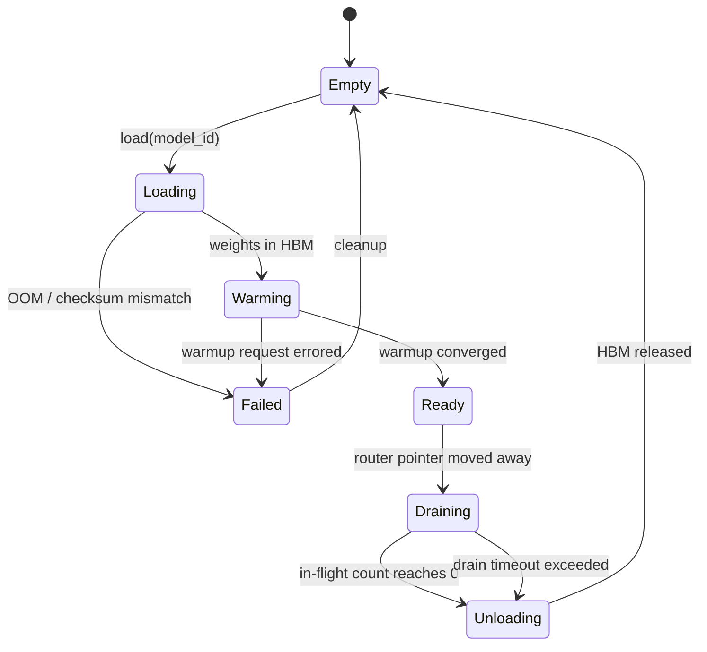

# 03 · 模型加载、预热与冷启动

> 冷启动不是"加载权重"这一件事，是九件事叠在一起；其中最贵的那几件跟 GPU 没关系。
> 你花钱换更快的卡，只买到 1.2 倍。

---

## 读这一章之前

**你在工作中遇到过这个**

你的图像审核模型部署在 8 张 A10G 上，稳态 p99 是 45 ms，一切正常。
运营在周三上午 10:00 推了一次活动，QPS 从 800 涨到 2,100，HPA 在 90 秒后决定扩容。
新 Pod 起来了 —— 然后 **11 分钟**里什么都没发生：拉 20 GB 镜像 5 分钟、解压 3 分钟、
权重从对象存储下来 48 秒、TensorRT 在这台卡上重新 autotune 又是 2 分钟。
更糟的是第 11 分钟：Pod 的 readiness probe 一通过就被 LB 灌进了 300 QPS，
而它的第一批请求撞上 cuDNN 算法搜索和 CUDA graph 捕获，**p99 飙到 4 秒，持续 40 秒**。
监控面板上这是一条完美的"扩容后延迟变差"曲线，值班同学的第一反应是把新 Pod 摘掉 ——
于是流量又回到老 Pod 上，再次触发扩容，来回震荡了 25 分钟。
事后复盘的结论只有一句：**你们的扩容速度比流量慢一个数量级，而且新实例在没准备好的时候就接了流量。**

**需要先懂的概念**

| 概念 | 一句话 | 详见 |
|---|---|---|
| p99 与尾延迟 | 平均值好看不代表没事，第 99 百分位才是用户投诉的那一档 | [00-concepts §3](../00-foundations/00-concepts.md#3-为什么平均值是骗人的p50--p90--p99) |
| 有状态 vs 无状态 | 实例内存里有东西的服务，不能随便杀了重建 | [00-concepts §9](../00-foundations/00-concepts.md#9-有状态-vs-无状态) |
| 背压 / 准入控制 / 有界队列 | 处理不过来时要当场拒绝，而不是无限排队一起死 | [00/01 §6](../00-foundations/01-fundamentals.md#6-背压backpressure没有它系统就会雪崩cascading-failure) |
| 缓存冷启动与雪崩 | 缓存刚起来是空的，这段时间几乎每个请求都要回源 | [01/02 §3](../01-building-blocks/02-caching.md#3-三大经典故障穿透击穿雪崩) |
| SLI 的正确形式 | `好事件 / 有效事件` —— 哪些事件算"有效"是设计决策 | [05/01 §1](../05-reliability/01-slo-and-error-budget.md#1-sli优先写成-好事件--有效事件) |
| 模型版本 = 不可分割四元组 | 权重 + 特征管道 + 依赖锁 + 配置，回滚的单位是这四个一起 | [08/02 §3](02-model-lifecycle.md#3-版本化与血缘semver-为什么不适用) |
| 产物存储与分发 | 权威副本放对象存储，但对象存储不该是每个 Pod 的读路径 | [08/02 §7](02-model-lifecycle.md#7-产物的存储与分发不要把权重烤进镜像) |
| LLM 侧的冷启动与预热池 | KV cache、连续批处理、前缀缓存预热，本章不重复 | [04/01 §12](../04-ai-agent-systems/01-llm-serving-infra.md#12-容量规划从-qps-与-token-分布推-gpu-数) |

**这一章要回答的问题**

1. 一个模型实例从 Pod 被调度到能接第一个请求，这段时间到底被谁吃掉了？每一项多少秒？
2. "预热"具体是跑什么？用什么形状的输入、跑多少次、怎么判断它预热完了？预热请求要不要计进 p99？
3. 不停服换模型时，显存里要不要同时放两份权重？放不下怎么办？
4. 常驻一个预热池要多少台机器 —— 有没有公式？什么情况下这笔钱不该花？

**本章新引入的术语**

| 术语 | English | 一句话定义 |
|---|---|---|
| 冷启动 | cold start | 从零把一个模型实例拉起来，到它能正常接第一个请求所需的全部时间 |
| 预热 | warmup | 在接真实流量之前，主动用假请求把所有"第一次才会做"的一次性开销跑完 |
| 就绪探针 | readiness probe | 编排系统（K8s 等）反复问实例"你能接流量了吗"的那个接口，答否就不往它转发请求 |
| 权重流式加载 | weight streaming | 不等整个权重文件下载完，边下载边往显存里灌，把网络传输和显存拷贝重叠起来 |
| 张量并发读 | concurrent tensor read | 按权重文件里张量的字节偏移把它切成 N 段同时读，绕开单线程 I/O 上限 |
| 图捕获 | CUDA graph capture | 把一串固定的 GPU 调用序列录成一个可回放的整体，之后每次执行少掉几百次逐个下发调用的开销 |
| 算子自动调优 | kernel autotune | 框架在某个具体输入形状上把几种候选实现各跑一遍，选最快的那个记下来；只在该形状第一次出现时发生 |
| 图编译 | graph compilation | 把模型的计算图提前编译成针对这张卡的优化代码（`torch.compile` / TensorRT engine build），耗时分钟量级 |
| 惰性加载 | lazy loading | 实例启动时不加载模型，等第一个请求到了再加载；省常驻成本，代价是首请求极慢 |
| 预热池 | warm pool | 常驻一批已完成加载和预热、但当前不承载流量的空闲实例，专门用来吸收扩容窗口 |
| 双缓冲切换 | double buffering | 新模型在旁边完整加载并预热好之后，才把路由指针原子地指过去，旧模型再排空卸载 |
| 排空 | drain | 停止给某个实例发新请求，但等它手上正在处理的请求全部做完再销毁 |
| 显存超售 | GPU memory overcommit | 分配给多个模型的显存总和超过物理显存，指望它们不同时用满 —— 在 GPU 上基本不成立 |
| 抖动 | thrashing | 模型被反复卸载又反复加载，加载本身吃掉大部分 GPU 时间，实际吞吐反而下降 |

---

## 1. 为什么"第一次推理"和第一百次不是一回事

先做一件事：在一台刚起来的 GPU 实例上，连续跑 100 次同样输入的 forward，把每次耗时打出来。
你会看到一条几乎所有 ML 服务都长一样的曲线：

```
 耗时(ms)
  4000 │ ●                       ← 第 1 次：cuDNN/TensorRT 在这个形状上做算法搜索
       │
   800 │  ●                      ← 第 2–3 次：cuBLAS 句柄初始化、显存分配器第一次向驱动要块
       │   ●
   120 │    ● ●                  ← 第 4–8 次：还在补 kernel 缓存和 page cache
       │       ● ●
    45 │          ● ● ● ● ● ●…   ← 第 9 次之后：稳态
       └────────────────────────────────────────────► 第 N 次调用
```

> 📖 读图要点：第 1 次和稳态差了将近 **90 倍**，而"第 1 次"和"第 9 次"之间还有一段
> 缓慢下降的尾巴 —— 这段尾巴决定了"跑几次算预热完"不能拍脑袋定成 1 次或 3 次（§3 给判据）。

这条曲线里的每一格都对应一件**只会发生一次**的事，共同点是：
**开销和"这是第几次"有关，和"输入是什么"无关** —— 所以它们全都可以在接流量之前提前付掉，
这就是预热的全部动机。而更前面还有一段用户看不见、却决定了你能不能扩容的时间：镜像、权重、编译。

---

## 2. 冷启动的九项拆解：每一项到底多少秒

```
Pod 被调度                                                     能接第一个请求
    │                                                                │
    ├─① 拉镜像 ─┬─② 解压层 ──┬─③ 进程启动 ─┬─④ 权重下载 ─┬─⑤ 反序列化 ┐
    │  5–6 min  │  3–4 min   │  ~2 min     │  48 s       │  ~1 s      │
    │  ↑ 最大项，且和模型大小无关                                      │
    │                                                                 ▼
    └────────── ⑨ 缓存未热 ◄─ ⑧ 分配器预热 ◄─ ⑦ 图编译/捕获 ◄─ ⑥ CUDA context ┘
                 秒~分钟         < 1 s          10 s–2 min      0.5–2 s
```

> 📖 读图要点：**①②③ 加起来 10 分钟，④⑤⑥⑧ 加起来不到 1 分钟。**
> 冷启动的主体不在"加载模型"，在"把这个容器搬到这台机器上"。
> 这就是为什么优化顺序必须是 **镜像 → 权重 I/O 并行 → 编译缓存 → 捕获集合裁剪**，反过来做投入产出比极差。

### 分解表：一个 8B 级模型 / 单张 A10G / vLLM

这是目前公开资料里边界最清楚的一组实测（口径：从 Pod 调度到 `/health` 返回 ready）。

| # | 阶段 | 未优化 | 优化后 | 怎么优化的 | 来源 |
|---|---|---|---|---|---|
| ① | 从 cloud registry 拉镜像（~20.2 GB：CUDA 2.8 + torch 1.4 + 库 1 + 权重 15） | **5–6 min** | ~10 s | 权重移出镜像、放对象存储 + seekable-tar 按需读 | [BentoML 2025-05-08](https://www.bentoml.com/blog/25x-faster-cold-starts-for-llms-on-kubernetes) |
| ② | 解压镜像层 | **3–4 min** | ≈0 | SOCI snapshotter 并行 pull/unpack、Bottlerocket | [AWS EKS BP 2025](https://docs.aws.amazon.com/eks/latest/best-practices/aiml-cpu-inference.html) |
| ③ | 容器/框架进程启动、配置加载 | ~2 min | 数秒 | 砍掉启动期的远程配置拉取与依赖探测 | BentoML |
| ④ | 15 GB 权重 → 显存（默认 HF safetensors loader，**单线程读，0.32 GB/s**） | **47.99 s**(GP3) / 47.00 s(IO2) | **14.34 s**(GP3,16 并发) / 7.53 s(IO2,8) / **4.88 s**(S3,32) | Run:ai Model Streamer 按张量偏移并发读，`15 GB ÷ 14.34/7.53/4.88 s` = **1.0 / 2.0 / 3.1 GB/s**（随盘型与并发度变） | [NVIDIA 2025-09-16](https://developer.nvidia.com/blog/reducing-cold-start-latency-for-llm-inference-with-nvidia-runai-model-streamer) |
| ⑤ | 反序列化（safetensors = 纯 header + 张量字节，可 mmap 零拷贝） | ~1 s | 同左 | 已经是最优；换 pickle 反而更慢且不安全（§4） | 同上 |
| ⑥ | CUDA context 初始化 | 0.5–2 s，占 300–600 MB 显存/进程 | 不可消除 | — | *未找到一手公开数据，按经验给量级* |
| ⑦ | 图编译 + CUDA graph capture | `torch.compile` **39 s**；capture **30–60 s** 典型 | 编译 **10 s**；capture 按需裁剪 | 编译产物缓存（下文）+ `cudagraph_capture_sizes` 限定形状集合 | [route179 2026-06-30](https://route179.dev/2026/06/30/optimizing-vllm-cold-start-with-model-streaming-and-compile-caching/) / vLLM docs |
| ⑧ | 显存分配器预热（第一次分配走驱动，之后从缓存块取） | < 1 s | 被 ⑦ 顺带做完 | — | *经验量级* |
| ⑨ | 各级缓存未热（page cache、特征缓存、前缀缓存） | 秒 ~ 数十分钟 | 见 §3 与 §8 | 与模型无关，取决于你的缓存层 | [01/02](../01-building-blocks/02-caching.md) |
| | **合计（①–⑦，不含 capture）** | **~11 min** | **~26 s（25×）** | | BentoML |
| | **端到端（含 capture 30–60 s，裁剪后 5–10 s）** | **~12 min** | **~35 s** | | 本书自算 |

⚠️ **这张表的"优化后"一列不能竖着加起来**，两个原因：① seekable-tar 按需读让 ①② 与 ③ **重叠发生**，
那个"~10 s"是重叠后的净增量而不是独占时长；② 广为流传的 **25×** 只覆盖 ①–⑦ 里编译之前的部分，
**不含 CUDA graph capture** —— 把 capture 算进去，端到端是 ~35 s 而不是 ~26 s。
面试里报这个数字时把口径说出来（"不含 capture 的 26 秒 / 含 capture 的 35 秒"），比报一个更漂亮的数字更能拿分。

**同一组人给出的端到端 ready 时间**（8B / A10G，镜像已在本地，只换权重加载方式）：
默认 loader **66.13 s**(GP3) / 62.69 s(IO2) → Model Streamer **35.08 s** / **28.28 s** / S3 **23.18 s**
—— 注意这一组数已经包含了 capture，且镜像不用拉，所以它和上表"优化后"那一列不是同一个口径。

### 三条必须记住的结论

**结论 1：在引用的 vLLM 基准里，冷启动主要是 CPU-bound；先量各阶段再决定是否换 GPU。**
MLSys 2026 实测 22 个模型（0.5B–16B），vLLM 冷启动 *predominantly CPU-bound*；
只有 CUDA graph capture 对 GPU 代际敏感，**H100 比 L40S 快 1.2×**
（[arXiv:2606.07362](https://arxiv.org/abs/2606.07362)）。

> **面试金句**：
> "冷启动优化里最贵的一课是：换更快的卡救不了你。实测下来它是 CPU-bound 的，
> 只有 CUDA graph capture 在乎 GPU 代际，而那也就是 L40S 到 H100 的 1.2 倍。
> 所以顺序永远是镜像、然后权重 I/O 并行、然后编译缓存、最后才裁捕获形状 ——
> 反过来做，等于花大钱买 1.2×。"
> **EN**: *"The most expensive lesson here is that a faster GPU doesn't save you — cold start is
> mostly CPU-bound. The only piece that cares about the GPU is CUDA graph capture, and that's
> maybe 1.2x from an L40S to an H100. So the order is always: shrink the image, then parallelize
> the weight I/O, then cache the compile artifacts, and only then trim capture shapes.
> Do it backwards and you're paying a lot of money for 1.2x."*

**结论 2：权重加载的瓶颈是"单线程读"，不是磁盘。**
单线程 NVMe 读 **1.2 GB/s**，并行读能到 **~10 GB/s**；默认 loader 只跑出 **0.32 GB/s** ——
连单线程顺序读的能力都没吃满（差近 4 倍），更别说盘的并行上限。
route179 在 35B 模型上实测：权重加载从 **142 s 压到 59 s（2.4×）**，提速**全部来自并行 I/O**，没换任何硬件。
⚠️ 别把 `1.2 → 10 GB/s` 这个**带宽比**当成加速比 —— 真实加速比受张量切分粒度、网卡/盘的实际并发上限和
CPU 侧拷贝开销压制，**2.4× 是实测值，8.3× 是理论上界**。

**结论 3：在版本与硬件稳定时，编译缓存常是高 ROI 项。**
`torch.compile` **不支持图序列化**，每次进程启动都要重编译 → 编译时间直接计入冷启动预算。
但产物本身能缓存：vLLM 放在 `VLLM_CACHE_ROOT`（默认 `~/.cache/vllm`），
**可以跨机拷贝，也可以直接烤进镜像**，引用基准里 39 s → 10 s。它不是零风险：缓存键必须包含框架/编译器、驱动、GPU 架构、模型图和输入形状；命中后仍要做数值与性能 smoke test，失配时回退重编译。
TensorRT 的 engine 产物同样可持久化 —— 但它绑定 GPU 型号 + TensorRT 版本 + 输入形状集合，
**换卡型就必须重建**，所以镜像里要按卡型放多份 engine，或者接受在新卡型上第一次开机多花几分钟。

### 非 LLM 模型的分解长得不一样

| 阶段 | 8B LLM（A10G） | 排序/CTR 模型（大 embedding 表） | 视觉模型（TensorRT） |
|---|---|---|---|
| 主体开销 | 镜像 + 权重 I/O | **embedding 表灌进 DRAM** | **engine build / autotune** |
| 参数分布 | 权重 = 几乎全部 | embedding 占参数 **>99%**（Meta 口径：单表 **数十~数百 TB**，96 TB Model-F、200 TB+ Persia）| 权重 = 几十~几百 MB |
| 权重放哪 | HBM | 分片放 **CPU DRAM / 多级内存**，HBM 只放 dense 部分 | HBM |
| 冷启动量级 | 25 s（优化后）~ 11 min（未优化） | 取决于分片数与网络：**分钟级**，且扩容要重新拉分片 | engine 已构建 **10–30 s**；现场构建 **2–10 min** |
| 最有效的手段 | 编译缓存 + 并发读 | **分片预置 + 只加载本副本负责的那部分** | **engine 预构建并烤进镜像，按卡型分目录** |

（Meta 侧数字见 [arXiv:2607.24015](https://arxiv.org/html/2607.24015v1) 与 [arXiv:2410.12794](https://arxiv.org/html/2410.12794v2)，2024–2026，可信度中高。）
**推论**：推荐系统的冷启动优化跟 LLM 几乎没有共同点 —— LLM 优化的是 I/O 并行度，
推荐系统优化的是**分片布局**：让一个副本只加载它负责的那一段 embedding，而不是全量。

---

## 3. 预热：跑什么、跑多少次、怎么算跑完了

### 用什么形状的输入

**硬约束：预热必须覆盖你将要捕获 / 将要 autotune 的那组形状。**
漏掉的形状在线上第一次出现时会走 eager 慢路径（不用图、不用调优好的 kernel），
表现是"某些请求莫名慢 10 倍且没有规律" —— 其实规律就是 batch size 或分辨率第一次出现。

形状的笛卡尔积会爆炸（batch × 序列长度 × 分辨率），所以正确做法是**先分桶再预热**
（分桶 bucketing：把连续变化的输入长度归到有限几档、padding 到该档上界，用一点浪费换有限的形状集合；
桶怎么切、padding 浪费多少见 [08/04 §7](04-online-inference.md#7-变长输入padding-浪费与分桶)）：

```
批大小桶   : {1, 2, 4, 8, 16, 32}          ← 与 cudagraph_capture_sizes 逐个对齐
序列长度桶 : {128, 512, 2048}（padding 到桶上界）
图像分辨率 : {640×640}（固定，其他分辨率在前处理阶段 resize 过来）
预热请求数 = 6 × 3 = 18 组，每组跑 K 次
```

桶越多预热越久（每多一个捕获形状，capture 阶段多几百毫秒到几秒），
桶越少 padding 浪费越多。**这是一个直接的延迟-算力取舍，不是可以两全的事。**

### 用什么数据

| 数据来源 | 能触发 | 不能触发 | 结论 |
|---|---|---|---|
| 全零 / 随机张量 | kernel autotune、分配器、cuBLAS 初始化、对应形状的图捕获 | 数据依赖分支、其他 shape/batch/长度 | dense 模型的最低 smoke warmup；仍需覆盖生产 shape 集合 |
| 真实流量采样（影子请求） | 上面全部 + embedding 查表的缓存行为、MoE 路由分支、稀疏特征的不同长度 | — | **稀疏/条件计算模型必须用它** |

对推荐模型尤其重要：全零输入会让所有样本命中同一个 embedding 行，
**预热完了 embedding 的访问局部性和线上完全不同**，上线第一分钟仍然会有一波 cache miss。

### 跑多少次：不要定次数，定收敛判据

```python
# 判据：连续窗口的 p50 稳定，且没有离群的慢请求
def warmup_done(latencies, window=10, tol=0.05):
    if len(latencies) < 2 * window:
        return False
    prev, cur = latencies[-2*window:-window], latencies[-window:]
    p50_prev, p50_cur = median(prev), median(cur)
    return (abs(p50_cur - p50_prev) / p50_prev < tol      # 相对变化 < 5%
            and max(cur) < 2 * p50_cur)                    # 最慢一次 < 2× p50
```

典型收敛在 **20–50 次/形状**。定死"跑 3 次"是这一节最常见的错误 ——
从 §1 那条曲线看，第 3 次时你离稳态还差 2–3 倍。

### 把预热做成就绪探针的一部分（这一条是硬性的）

**Triton 的 `ModelWarmup` 值得直接抄**：在模型配置里声明一组 warmup 请求（含 `batch_size` 与
`count` 迭代次数），**模型实例必须把它们全部成功执行完，才会被标记为 READY**
（[Triton model configuration](https://docs.nvidia.com/deeplearning/triton-inference-server/user-guide/docs/user_guide/model_configuration.html)）。

不这么做的后果是一个真实且高频的误判：金丝雀（canary）刚上线，
第一批用户吃到 30–60 秒的图捕获尾延迟，监控显示"新模型 p99 是老模型的 20 倍"，
自动回滚触发 —— **但新模型本身没有任何问题**。
Uber 在部署安全的实践里把这条列为必须项：**不完成 warmup 就不进 LB**
（[Uber 2025-10-30](https://www.uber.com/us/en/blog/raising-the-bar-on-ml-model-deployment-safety/)）。

### 预热请求要不要计入指标：分三种指标，答案不同

| 指标类别 | 预热请求 | 理由 |
|---|---|---|
| SLI（用户可见的 p99 / 错误率） | **必须排除** | 它不是用户请求。算进去等于每次发布都自己烧一笔错误预算（[05/01 §5](../05-reliability/01-slo-and-error-budget.md#5-错误预算与燃尽率burn-rate)） |
| 实例健康指标 | **必须单独记** | `warmup_duration_seconds` 和 `warmup_failed_total` 是"这个 build 有问题"的最早信号，比任何业务指标都早 |
| 业务日志 / 特征日志 / 训练样本 | **绝对不能进** | 特征日志是下一轮训练集的主来源；混进几千条全零请求会静默污染训练数据，而且很难查 |

实现上只需要一个请求头 `x-warmup: 1`，在指标中间件里分流。
**但要注意：这个头必须只能由本机 localhost 或 sidecar 注入，不能从外部网关传进来** ——
否则它就是一个"免费绕过 SLI 统计"的接口，压测和攻击都会用它。

---

## 4. 缩短冷启动的手段：收益、代价、撞墙条件

| 手段 | 收益（量级） | 代价 | 什么时候会撞墙 |
|---|---|---|---|
| **镜像瘦身 / 权重移出镜像** | ①② 从 9 min → 10 s，**最大单项** | 启动时多一次对象存储依赖；对象存储抖动直接变成扩容失败 | 镜像已经 < 3 GB 时收益趋近于零 |
| **并行 pull/unpack（SOCI、Bottlerocket）** | 多 GB 镜像给 pod 启动的增量从 30–60 s 降到接近 0 | 需要节点级配置权限；不是所有托管 K8s 都支持 | 节点网络带宽打满时无效 |
| **权重并发读 / 流式加载** | 15 GB：48 s → 5–14 s（**~2 GiB/s**） | 需要 safetensors 这类**按张量偏移可寻址**的布局；pickle 格式做不到 | 单机网卡/盘带宽上限（NVMe 并行 ~10 GB/s） |
| **编译产物缓存**（`VLLM_CACHE_ROOT` / TensorRT engine） | `torch.compile` 39 s → **10 s** | 缓存绑定「模型 + 引擎版本 + GPU 型号 + 形状集合」，任一变了必须失效；不失效比不缓存更危险 | 混合卡型集群里命中率会掉 |
| **权重预置到本地 NVMe / tmpfs** | 二次启动省掉整个 ④ | 占本地盘/内存；节点回收就没了；多模型时容量不够 | 模型集总大小 > 本地盘时退化成 LRU 抖动 |
| **模型缓存层（节点级 DaemonSet 共享目录）** | 同节点上第 2 个副本几乎零下载 | 需要处理并发下载的单飞（single-flight），否则 8 个 Pod 同时拉同一个模型 | 节点被驱逐/换节点时全部作废 |
| **`cudagraph_capture_sizes` 裁剪** | capture 30–60 s → 数秒 | 未捕获的形状走 eager，那部分请求慢 2–5× | 线上形状分布比你以为的散 |
| **惰性加载（lazy loading）** | 实例启动到 ready 只剩秒级 | **首请求承担全部加载**，用户直接看到 30 s–5 min | 只适合"长尾模型 + 无在线 SLO" |
| **预热池（warm pool）** | 把冷启动从用户可见路径上完全移走 | **常驻闲置成本**，量化见 §5 | 见 §8 |
| **vLLM sleep mode / Triton EXPLICIT** | 不重启容器就释放大部分显存，醒来再占回 | 唤醒仍需重新分配显存与部分预热；不省 CPU/内存的钱 | 唤醒时物理显存已被别人占走 → 唤醒失败 |
| **研究前沿：模板化 CUDA graph 上下文物化** | Qwen3-235B-A22B 初始化 **10 min → 3.9 s**（最高 99% 降幅） | **未 GA**，不要写进方案 | [arXiv:2604.06664](https://arxiv.org/abs/2604.06664)（Foundry，2026） |

### 顺便解决的一件事：模型格式

统一到 **safetensors** 的两条理由里，只有一条是安全（反序列化过程不执行代码），
**另一条纯粹是加载速度**：它是"纯 header + 张量字节"的布局，因此可 mmap 零拷贝、
可按张量偏移切段并发读 —— Run:ai Model Streamer 的 2 GiB/s 正是基于这个布局，
pickle 格式在原理上做不到。安全侧的完整讨论（含 CVE-2025-32434 与
"PyTorch 版本下限 ≥ 2.6"这条硬线）见 [08/02 §6](02-model-lifecycle.md#6-模型格式safetensors-封住了哪条边没封住哪条)。
这里只强调一句：**格式选型在这一章里是性能决策，在上一章里是安全决策，两边给出同一个答案。**

---

## 5. 预热池要多大：公式与算例

预热池回答的是一个纯粹的时间竞速问题：**在冷启动窗口里，流量能涨多少？**

```
N_warm  ≥  T_cold × (dQ/dt) / C        ← 吸收"持续爬坡"
        +  ΔQ_spike / C                ← 吸收"瞬时台阶"

T_cold   : 冷启动时间（秒），取 §2 表里你自己那一行的实测值
dQ/dt    : 爬坡最陡的那一段的流量斜率（QPS / 秒）
ΔQ_spike : 一次推送/开屏能在几秒内加上来的流量台阶（QPS）
C        : 单副本在 p95 达标下的容量（QPS），注意不是压测峰值
```

**算例**（沿用开头那个审核模型）：

```
C        = 40 QPS/副本（p95 ≤ 50 ms 时的 goodput，不是极限 QPS）
稳态     = 1,200 QPS → 30 副本
爬坡     = 早高峰 5 分钟内 1,200 → 2,400 QPS  ⇒ dQ/dt = 1,200/300 = 4 QPS/s
T_cold   = 90 s（镜像已预拉、编译缓存已烤进镜像；未优化时是 11 min）
ΔQ_spike = 一次全量推送 +600 QPS

N_warm ≥ 90 × 4 / 40 + 600 / 40 = 9 + 15 = 24 副本
```

24 副本相对 30 的稳态是 **80%** —— 大到让人不敢信，但它是对的：
**问题出在 ΔQ_spike 那一项，不是爬坡项。** 一次能在几秒内加 600 QPS 的推送，任何弹性手段都接不住，
只能用常驻容量接。所以正确的动作是**先去掉那个台阶**（推送打散到 5 分钟、给推送流量单独的低优先级队列），
把 ΔQ_spike 从 600 降到 100，`N_warm` 立刻从 24 掉到 **11 副本（37%）**。

**这是本节唯一想让你记住的推论：预热池的容量方程里，可以被架构改掉的项是 ΔQ_spike 和 T_cold，
而不是 dQ/dt。先改那两项，再算池子。**

### 不设预热池的代价，也要算出来

扩容永远滞后 `T_cold`，意味着爬坡期间实际容量恒定落后需求 `dQ/dt × T_cold`：

```
稳态滞后缺口 = 4 QPS/s × 90 s = 360 QPS
若扩容连续跟随但滞后 90 s：
被排队或拒绝的请求 ≈ 0.5×4×90² + 360×(300−90) = 91,800 次
占爬坡期总请求 (1200+2400)/2 × 300 = 540,000 的约 17%
```

在这个理想化“连续扩容、固定滞后”模型里约 **17%** 的爬坡期请求受影响。真实 autoscaler 是阶梯式、还受配额和排队影响，应回放真实曲线，而不是把 17% 当固定结论。

---

## 6. 热加载与模型切换：显存够不够放两份

双缓冲是常见的零停机切换形态之一；跨实例蓝绿、分片滚动和外部路由也可实现同一目标：

```
                    ┌──────────── 路由指针（原子交换）────────────┐
                    │                                            │
   请求 ──► Router ─┴─► [槽位 A] model_v7  READY   ◄── 在途请求 N=12
                       [槽位 B] model_v8  LOADING → WARMING → READY
                                                              │
   ①B 完成 warmup ─► ②指针原子指向 B ─► ③A 停止收新请求 ─► ④A 排空(N→0) ─► ⑤卸载 A
                                                              ▲
                                     任一步失败：指针留在 A，直接卸载 B（零影响回滚）
```

> 📖 读图要点：**第 ② 步和第 ④ 步之间存在一个两份权重同时在显存里的窗口**，
> 长度等于最长在途请求的执行时间。这个窗口就是下面那条硬约束的来源。

**更完整的硬约束：`W_old + W_new + A_serving + A_warmup + workspace + headroom ≤ HBM`**。只有新旧权重相同、且两个版本不会同时持有各自激活/工作区时，才可近似成 `2W + A`。放不下时可选：

| 方案 | 停服窗口 | 代价 |
|---|---|---|
| **先卸载再加载**（就地替换） | 有，等于 T_cold | 该实例在窗口内完全不可用，必须先从 LB 摘掉 |
| **整实例替换**（蓝绿 / Red-Black） | 无 | 切换期间需要 **2× 实例数**；Netflix 用这个做原子回滚 |
| **权重量化后再放两份** | 无 | 精度损失，且两个版本精度不一致会让 A/B 结论失真 |

对绝大多数生产系统，**答案是整实例替换而不是进程内热加载**。
进程内热加载只在两种情况下值得：单机上有几十个小模型（多租户小模型服务），
或者模型大到一台机器只能放一份、换机器意味着重新拉几百 GB。

### 槽位的状态机

下面这张图的价值在于**哪几条边不存在** —— 这件事用 ASCII 箭头画会互相穿插到看不清。



> 📖 读图要点：三条**不存在**的边才是重点。
> ① 没有 `Warming --> Draining` —— 还没接过流量的槽位不可能有在途请求，出错就直接 `Failed`；
> ② 没有 `Ready --> Empty` 的直达边 —— 卸载**必须**经过 `Draining`，跳过它等于把在途请求打断；
> ③ `Draining` 有两条出边，其中 `drain timeout exceeded` 那条会**主动丢弃**还没做完的请求 ——
> 所以 drain 超时必须 ≥ 单请求最长执行时间，否则你在每一次发布里都稳定地杀掉一批长请求。

**引用计数怎么做**：路由器在把请求发给槽位时 `refcount++`，请求完成/失败/超时时 `refcount--`，
卸载条件是 `refcount == 0`。听起来平凡，两个坑：
(a) **超时路径必须也减一**，漏了会导致 refcount 永不归零、槽位永远卸不掉（表现为"显存泄漏"）；
(b) 流式响应（逐 token 返回、逐帧返回）的"完成"是最后一个 chunk 发出去，不是 HTTP 头发出去。

---

## 7. 多模型共存：显存管理与超售的风险

**先说结论：显存超售在 GPU 上基本不成立。** GPU 没有 CPU 那种 swap / overcommit 语义 ——
超了就是 OOM，而且 CUDA OOM 通常打死整个进程，**连带这个进程里共存的所有模型一起死**。
一次 OOM 的爆炸半径是"这台机器上的全部模型"，不是"申请显存的那个模型"。

真正可用的复用维度是**时间**，不是空间：

| 机制 | 语义 | 代价 |
|---|---|---|
| **Triton EXPLICIT 模式** | 通过 Model Control API 显式 load/unload，三态 `NONE / EXPLICIT / POLL` | 卸载后的模型下次请求吃满冷加载 |
| **vLLM sleep mode** | 不停服务、不重启容器就释放大部分显存（含权重与 KV cache），醒来再占回 | 唤醒时物理显存可能已被别人占走 |
| **MIG**（A100 / A30 / H100 / H200 一线；⚠️ **Ada 系 L4/L40/L40S 不支持**） | 硬件级隔离：算力 + 显存 + 故障域 | profile 静态，改配置要重配整卡；**"卡更新就一定有 MIG"是错的**，选型时要单独确认 |
| **MPS** | 共享 CUDA context，小 kernel 场景利用率明显更好 | 显存按 replica 数均分，超了 OOM；**一个进程执行 kernel 时异常退出会连带拖垮共享 IPC/UVM 的其他进程** → 不能跨信任域 |

（GPU 共享的完整对比见 [04/01 §11](../04-ai-agent-systems/01-llm-serving-infra.md#11-gpu-多租户与调度)，那里从多租户调度角度展开。）

### LRU 卸载：什么时候它开始害你

多模型服务的默认策略是 LRU 卸载 —— 显存不够时踢掉最久没用的模型。
它在"模型集总大小略大于显存"时工作良好，在"显著大于"时会**抖动（thrashing）**：
加载本身吃掉大部分 GPU 时间，实际吞吐反而低于只服务一半模型。

**抖动的量化判据（可以直接做成告警）：**

```
load_time_ratio = Σ(模型加载耗时) / GPU 忙时
    < 5%   健康
  5–15%   开始付代价，考虑收缩模型集或加机器
    >15%  抖动，此时"加一台机器"的边际收益远高于"调 LRU 参数"
```

第二条判据更直接：**被卸载的模型在 T 分钟内被重新加载的比例 > 30%**，说明你的 LRU 窗口
比业务的访问周期短，再怎么调策略都是在错误的容量上做优化。

**正确的解法是分池，不是调策略**：把"每秒都有请求"的热模型固定常驻（pinned，不参与 LRU），
长尾模型放在另一组机器上按需加载并接受首请求 10–30 秒。
一套 LRU 同时服务两类模型，结果一定是热模型偶尔被冷模型挤掉 —— 而那正是最贵的一次 miss。

---

## 8. 什么时候不该做常驻预热池（反模式）

预热池是这一章里唯一一个**直接、持续烧钱**的手段，所以它需要一条明确的不适用清单。

| 情况 | 判据 | 该做什么 |
|---|---|---|
| **流量可预测且爬坡慢** | `T_cold × (dQ/dt) / C < 1` 副本 | 按日历预扩容（predictive scaling）。早 9 点的尖峰用 cron 在 8:50 扩，比池子便宜一个数量级 |
| **离线 / 批量打分** | 没有交互式尾延迟要求 | 直接排队。批处理的正确指标是吞吐和成本，不是 p99 |
| **长尾模型（每天几十次调用）** | 常驻成本 ÷ 调用次数 > 单次调用的业务价值 | 惰性加载 + 明确告知调用方首次 10–30 s |
| **SLO 里塞得下排队** | 在目标负载回放中直接计算端到端 `good/valid = count(valid 且 T_queue + T_service ≤ deadline) / count(valid)`，仍达到 SLO 目标且坏事件不超错误预算；不能用“p99 预算 − 稳态 p99”再与平均排队时长比较 | 准入队列 + 429 + `Retry-After`，比常驻算力便宜得多（[00/01 §6](../00-foundations/01-fundamentals.md#6-背压backpressure没有它系统就会雪崩cascading-failure)） |
| **池子是用来掩盖 11 分钟冷启动的** | `T_cold > 3 min` 且没做过 §4 的任何一项 | **先去优化冷启动**。用池子掩盖未优化的冷启动，等于按 25 倍的价格买时间 |

反过来，有两种情况**必须**有池子，即使成本难看：

1. **GPU 供给本身不确定**：H100 这类卡常态缺货，扩容请求可能**直接失败**而不是变慢。
   这时预热池不是延迟优化，是可用性设施 —— 你在为"要不到卡"这个事件买保险。
2. **爬坡斜率本身来自外部**（第三方回调、上游批量任务），你改不了 ΔQ_spike。

⚠️ **还有一个更隐蔽的反模式：把预热池的实例设成"完全不接流量"。**
一个几十分钟没跑过任何请求的实例，它的 page cache 是凉的、特征缓存是空的、
连接池可能已经被对端关掉了 —— 真到切流那一刻仍然会有一波尾延迟。
可用合成请求、录制后脱敏的请求或极小比例影子流量周期性保温。若用影子流量，必须禁用副作用、隔离凭据与配额，并满足隐私/驻留要求；1–2% 只是实验起点，不是固定比例。

**最后一个反模式，也是最常见的**：`initialDelaySeconds` 调大来"等模型加载完"。
这是把就绪判断从"实例自己知道"改成"你猜一个数"。
模型大小一变、盘一慢，这个数就错，而且错的方向是**提前上线**。
就绪探针必须真的去问模型状态（§3 的 warmup 收敛判据），不是定时器。

---

## 这一章的三句话

1. **先分解冷启动，再优化最大项。** 引用案例里镜像、解压和进程启动占 11 分钟里的 10 分钟；其他部署可能由权重 I/O、编译或图捕获主导，不能外推成统一结论。
2. **没完成预热就进 LB，等于每次发布都自己伪造一次线上事故。**
   金丝雀第一批用户吃 30–60 秒的图捕获尾延迟，监控显示"新模型慢 20 倍"，自动回滚触发 ——
   而新模型没有任何问题。预热必须是就绪探针的一部分，不是启动脚本里的一行日志。
3. **预热池容量同时受爬坡斜率、突发量、冷启动和单实例容量影响。** `dQ/dt` 有时来自外部，但也可通过上游节流、定时错峰或排队整形改变；先找可控项，再算池子。
   先把推送打散、先把冷启动从 11 分钟压到 90 秒，再来算池子要多大 ——
   顺序反过来的团队，最后都在为一个本可以不存在的问题常驻 80% 的闲置算力。

---

## 面试官会追问

1. 一个 8B 模型从 Pod 调度到能接第一个请求，时间花在哪？给我分项表，说清最大项是哪个。
2. 我把 A10G 换成 H100，冷启动能快多少？为什么？
3. 权重加载 15 GB 用了 48 秒，盘的顺序读是 1.2 GB/s，问题出在哪？怎么改？
4. `torch.compile` 每次启动都要 39 秒，你怎么办？TensorRT 在这件事上有什么不同？
5. 预热具体跑什么？用什么形状、什么数据、跑多少次？怎么判断预热完了？
6. 预热请求要不要计进 p99？要不要写进特征日志？为什么两个答案不一样？
7. 不停服换模型，显存里要同时放两份权重吗？放不下你怎么做？drain 超时该设多大？
8. 一台卡上跑 20 个模型用 LRU 卸载，什么信号说明这套策略已经在害你？给我一个预热池容量的算式，以及你会拒绝做池子的情况。

---

**按训练路径阅读** → 回 [START-HERE](../START-HERE.md) 按所选路径继续；页尾链接只表示本目录或专章的顺读顺序。

**ML Systems 专章顺读下一篇** → [04-online-inference.md](04-online-inference.md)
