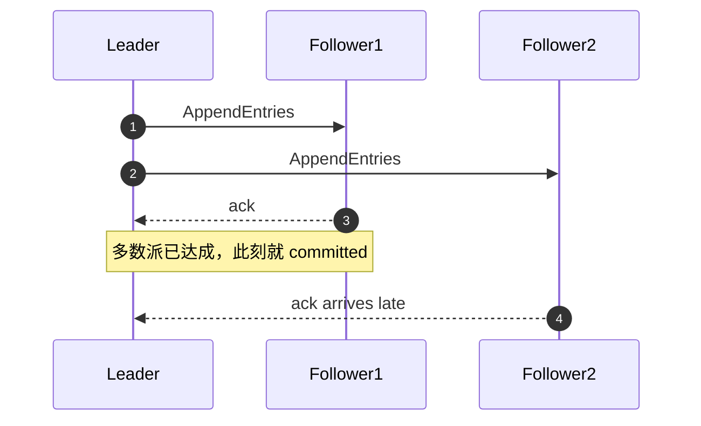
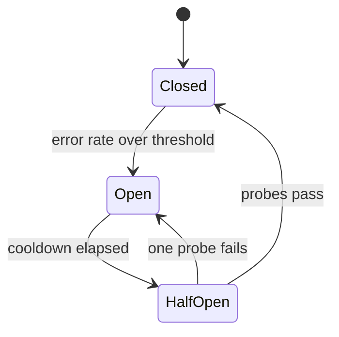
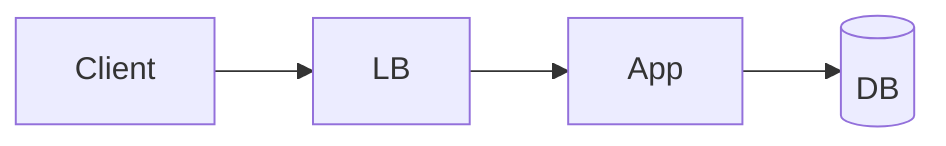

# 贡献指南

欢迎补充、纠错、更新。这本手册的价值取决于内容的**准确性**和**时效性** —— 尤其是
`04-ai-agent-systems/` 这一章，里面的事实每几个月就会过期。

## 什么样的 PR 最受欢迎

1. **纠错**：数字错了、机制描述错了、协议版本过时了。请附一手来源链接。
2. **更新前沿章节**：新的推理优化、协议版本、定价变化、被证伪的做法。
3. **补充失败模式**：你在生产里真实踩过的坑，比任何理论都值钱。
4. **补充反例**：某个"最佳实践"在什么情况下是错的。

## 什么样的 PR 会被拒

- 把内容改得更"入门"（本书明确面向 Senior/Staff，不做科普）
- 只有结论没有数字和代价的段落
- 从别处大段复制的内容
- 无来源的性能声称

## 写作规范

每一篇的结构是固定的：

```markdown
# NN · 标题
> 一句话的核心断言

---

## 1. ...
## 2. ...

---

## 面试官会追问
1. ...（6–8 条）

---

**按训练路径阅读** → 回 [START-HERE](START-HERE.md) 按所选路径继续；页尾链接只表示本目录或专章的顺读顺序。

**目录顺读下一篇** → [文件名](相对路径)
```

页尾标签按内容选择：00–03 与 05 使用“目录顺读下一篇”，04 使用“AI 专章顺读下一篇”，06 使用“案例顺读下一篇”，07 使用“面试专章顺读下一篇”，08 使用“ML Systems 专章顺读下一篇”。Path A 提示必须保留，链接路径按文件位置调整。

内容要求：

| 要求 | 说明 |
|---|---|
| 给数字 | "很快"是无效表述，"p99 约 2ms（同 AZ）"才是 |
| 给代价 | 每个方案必须写出它的坏处 |
| 给撞墙条件 | "到 X 规模会失效，信号是 Y" |
| 有反模式 | 每篇必须有一节讲"什么时候不要这么做" |
| 可执行 | SQL / 配置 / 伪代码 / 公式，而不是抽象描述 |
| 前沿内容带链接 | 2025 年之后的事实必须有一手来源 |

### 讲清楚的义务

本书面向 Senior，**不做科普**，但"不科普"指的是不解释业务背景、不铺垫动机、不降低结论的密度 ——
**不是允许你用读者没见过的词去解释另一个词**。下面四条是硬性的，违反其中任何一条的 PR 会被要求返工。

#### 1. 术语首次出现必须给定义，且定义里不能含未定义的术语

判据只有一条：**把这一段单独拿给一个只读过 [`00-foundations/00-concepts.md`](00-foundations/00-concepts.md) 的人看，他能不能读懂。**
定义写在术语第一次出现的那一句里（括号或破折号），不要推给文末的术语表。

- ✅ `写路径上要加**背压（backpressure：下游处理不过来时，让上游当场被拒绝或被阻塞，而不是无限排队）**，否则……`
- ❌ `写路径上要加背压，否则会亚稳态失败。` ——「背压」没定义，「亚稳态失败」又是一个没定义的词，两个未知数。
- ❌ `幂等键是用来做去重的 idempotency token。` —— 用一个同义的英文词替换中文词，不叫定义。

**新增一个会被别的篇章当作前置的概念时**，同时更新 [`00-foundations/README.md`](00-foundations/README.md) 的
「概念首次定义位置」表 —— 那张表是全书的索引，漏更新等于这个概念对读者不存在。

#### 2. 每章必须有「读这一章之前」块，且场景必须具体

结构固定为三段：**你在工作中遇到过这个** → **需要先懂的概念**（表格，每行给一句话 + 指向首次定义处的链接）→ **这一章要回答的问题**。
第一段是唯一容易写坏的：它必须是一个**能被复述的具体事故**，有数字、有时间线、有"结果是什么"。

- ✅ `你给商品详情加了 Redis，命中率 96%。三周后凌晨两点一次批量预热让几万个 key 落在同一秒过期，DB 连接池 200 毫秒内打满，接口全线 504 四分钟；恢复后缓存是空的，又被打死一次。`
- ❌ `缓存是系统设计中非常重要的一环，用好了能大幅提升性能，用不好则会带来一致性问题。` —— 抽象、无数字、无时间线，读者无法判断这一章跟自己有没有关系。
- ❌ `你可能遇到过缓存雪崩。` —— 用章节内容当场景，等于什么都没说。

#### 3. 不要在章节开头就要求读者记忆数字，先给动机

数字表是**结论**，不是**开场**。开场要先让读者知道"不记这个数会在哪里付代价"，否则它只是一张背不下来的表。
参考 [`00-foundations/01-fundamentals.md`](00-foundations/01-fundamentals.md)：§1 先用光速算出跨洲同步写的下限，§2 才给那张必背表。

- ✅ `§1 为什么要有这些数字 → 上海到弗吉尼亚 12,000 km，光纤里 200,000 km/s，一个来回 120 ms 是硬下限，没有任何架构能绕过 → §2 于是这张表你必须背`
- ❌ `## 1. 必须背下来的延迟数字` 直接开表 —— 读者背完也不知道背它干什么，一周后就忘了。

#### 4. 前向引用必须"就地解释一句 + 给链接"

用到后面章节才展开的概念时，**不能只留链接**。链接解决"去哪看全的"，就地那一句解决"现在能不能读下去"。
一句话的标准是：**读者不点那个链接，本段的论证依然成立。**

- ✅ `消费端必须幂等（同一条消息处理两次和处理一次的效果相同 —— 因为分布式系统里只有 at-least-once 投递）。完整实现见 [00/01 §5](00-foundations/01-fundamentals.md#5-幂等idempotency分布式系统的第一公民)。`
- ❌ `消费端必须幂等（见 [00/01 §5](00-foundations/01-fundamentals.md#5-幂等idempotency分布式系统的第一公民)）。`
- ❌ `这里用 fencing token 解决，详见 01/05。` —— 读者不知道 fencing token 是什么，这一段就断了。

**反向引用（用前面已定义的概念）则相反：直接用，不要复述定义。** 每篇都重讲一遍"什么是分片"会把书撑成三倍厚，
而且会让读者以为可以跳过 00 章。前置概念放进「读这一章之前」的表里，正文直接用。

### 图的约定

**默认用 ASCII 画图。** 理由是四条，且它们叠加起来足以压倒"渲染出来更好看"：

| 理由 | 说明 |
|---|---|
| 白板可复现 | 面试时你要在白板上重画它。画不出来的图，对本书的读者没有价值 |
| 终端可读 | `cat` / `less` / `git diff` / GitHub 的 raw view 里都能直接看 |
| grep 友好 | 图里的状态名、字段名能被 `grep` 搜到，mermaid 里的也能，但 ASCII 的上下文对齐关系搜出来仍然可读 |
| 任何渲染器都能看 | 不依赖 mermaid 版本、不依赖渲染器是否开启该功能、离线可读 |

**只有两类图允许用 mermaid：时序图（`sequenceDiagram`）和状态机（`stateDiagram-v2`）。**
理由是这两类各有一件 ASCII 表达不了的事：

- **时序图 → 时间交错。** 多个参与者的消息在时间轴上谁压着谁，尤其是"A 还没写回去、B 已经删完了"这种竞态窗口，以及 `par` / `alt` 这种同一时刻的分叉。ASCII 只能画出"先后"，画不出"重叠"。
- **状态机 → 状态可达性。** 哪条边不存在、哪个状态没有出边、哪个状态看起来是终态其实不是。**画得出的边和画不出的边同样是信息**，ASCII 的箭头一多就会互相穿插到无法辨认。

**禁止用 mermaid 画 flowchart、架构图、拓扑图、部署图、类图、ER 图。** 这些用 ASCII 方框画，本书全部现有章节都是这么画的。

#### 正例

架构与拓扑 → ASCII：

```
   Client ──► LB ──► App ──► Cache ──► DB
                      │                 ▲
                      └── Outbox ──► Relay ──► Kafka
```

时间交错 → mermaid 时序图（这件事 ASCII 画不清）：

````markdown

````

状态可达性 → mermaid 状态机（重点在"没有哪条边"）：

````markdown

````

#### 反例

❌ 用 mermaid 画流程/架构（应该用 ASCII 方框）：

````markdown

````

❌ 把旁边已有的 ASCII 图换个画法再画一遍。**宁缺毋滥** —— 如果这张 mermaid 图和上面的 ASCII 图传递的是同一份信息，删掉 mermaid 那张。

❌ 空洞的引导句和"读图要点"：

```markdown
下面这张图展示了整个流程，如下图所示：
> 读图要点：这张图很重要，请仔细阅读。
```

#### 硬性要求

1. **每张 mermaid 图前必须有一句引导句**，说清楚"这张图要让你看见什么，而这件事为什么上面的 ASCII / 表格 / 代码说不出来"。
2. **每张图后必须有一条以 `> 📖` 开头的"读图要点"引用块**，指向图里**具体的**边或步骤（"第 7 步和第 9 步的先后"、"`Shipped` 没有指回补偿态的边"），而不是复述图的内容。
3. **术语用英文，且必须与 [`07-interview/04-glossary.md`](07-interview/04-glossary.md) 第 2 列一致**（`origin fetch` 不是 `back to source`，`fencing token` 不是 `isolation token`）。图里的状态名 / 参与者名要和同一节正文、ASCII 图里的写法**逐字一致**，不要另起一套。
4. **复杂度上限**：时序图 `participant ≤ 7`，状态机状态数 `≤ 10`。超了就拆图或砍掉次要分支。
5. **图里的数字不能和正文/表格打架**（比如状态机写"连续 3 次成功"，而下面参数表写 `permittedNumberOfCalls = 5–10`）。
6. **提交前跑一遍解析**，语法错的图在 GitHub 上会渲染成一段红色报错：
   ```bash
   npx -y @mermaid-js/mermaid-cli -i 你的文件.md -o /tmp/out.md
   ```

## 事实的时效性标注

涉及价格、性能、版本号的内容，请标注时间和不确定性：

```markdown
（2026 年中量级，随时变动）
```

不确定的数字用"约 / 量级"限定。**宁可写"未找到公开数据"，也不要编造。**

## 提交

- 一个 PR 只做一件事
- commit message 用中文或英文都可以，说清"改了什么、为什么"
- 大改动请先开 issue 讨论
